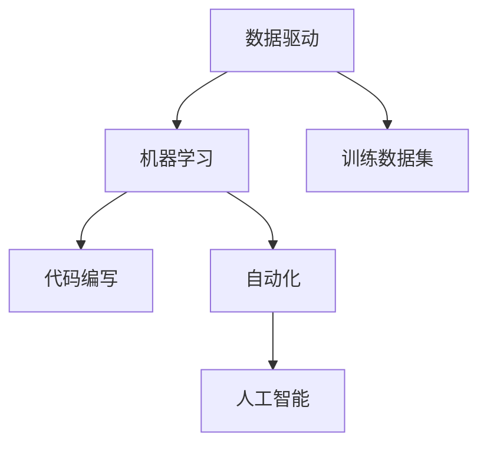

                 

# 软件2.0：放弃编写代码，转向训练数据集

> 关键词：软件2.0、数据驱动、人工智能、机器学习、训练数据集

> 摘要：本文探讨了软件2.0的概念，即从传统的代码编写模式转向数据驱动的开发模式。随着人工智能和机器学习技术的迅猛发展，数据集的质量和规模对软件性能和功能的影响日益突出。本文将详细阐述这一转变的背景、核心概念、算法原理、实际应用场景，以及未来发展趋势与挑战。

## 1. 背景介绍

### 1.1 目的和范围

本文旨在探讨软件2.0时代的数据驱动开发模式，分析其背景、核心概念、算法原理和实际应用场景，并探讨其未来发展趋势与挑战。

### 1.2 预期读者

本文主要面向对人工智能和机器学习有一定了解的软件开发工程师、数据科学家和IT管理人员。同时，也适合对新技术感兴趣的技术爱好者和研究人员。

### 1.3 文档结构概述

本文分为以下几个部分：

1. 背景介绍：介绍软件2.0的概念及其背景。
2. 核心概念与联系：阐述软件2.0的核心概念及其联系。
3. 核心算法原理 & 具体操作步骤：详细讲解核心算法原理和操作步骤。
4. 数学模型和公式 & 详细讲解 & 举例说明：介绍数学模型和公式的详细讲解与举例。
5. 项目实战：提供代码实际案例和详细解释说明。
6. 实际应用场景：探讨软件2.0在实际应用场景中的优势。
7. 工具和资源推荐：推荐学习资源和开发工具框架。
8. 总结：未来发展趋势与挑战。
9. 附录：常见问题与解答。
10. 扩展阅读 & 参考资料。

### 1.4 术语表

#### 1.4.1 核心术语定义

- 软件2.0：一种以数据驱动为核心的开发模式，强调数据集的质量和规模。
- 数据驱动：以数据为基础，通过分析数据来指导软件开发和优化。
- 机器学习：一种让计算机通过数据学习、自动改进性能的技术。
- 训练数据集：用于训练机器学习模型的数据集合。

#### 1.4.2 相关概念解释

- 代码编写：传统的软件开发模式，通过编写代码来实现功能。
- 自动化：利用计算机程序或工具实现特定任务的自动化。
- 人工智能：使计算机具有人类智能特征的技术。

#### 1.4.3 缩略词列表

- AI：人工智能
- ML：机器学习
- DL：深度学习
- HPC：高性能计算

## 2. 核心概念与联系

在软件2.0时代，数据驱动成为软件开发的核心。数据集的质量和规模直接影响软件的性能和功能。以下是软件2.0的核心概念与联系。

### 2.1 数据驱动

数据驱动是一种以数据为基础，通过分析数据来指导软件开发和优化的开发模式。它强调数据在软件开发过程中的重要作用，将数据视为软件开发的核心资源。

### 2.2 机器学习

机器学习是一种让计算机通过数据学习、自动改进性能的技术。它利用大量的训练数据，通过算法模型来模拟人类的思维方式，从而实现对数据的自动分析和预测。

### 2.3 训练数据集

训练数据集是机器学习模型的基础。它用于训练模型，使其能够根据输入数据预测输出结果。一个高质量的训练数据集可以显著提升模型的性能。

### 2.4 代码编写

虽然数据驱动成为软件2.0的核心，但代码编写仍然必不可少。它用于实现算法模型，将机器学习模型应用到实际场景中。

### 2.5 自动化

自动化是数据驱动开发模式中的重要一环。通过自动化工具，可以高效地处理大量数据，实现数据分析和模型训练的自动化。

### 2.6 人工智能

人工智能是数据驱动开发的终极目标。通过人工智能技术，可以实现对复杂问题的自动解决，提升软件的智能化水平。

下面是一个关于软件2.0核心概念与联系的Mermaid流程图：



## 3. 核心算法原理 & 具体操作步骤

在软件2.0时代，核心算法原理主要包括机器学习算法和深度学习算法。以下分别介绍这两种算法的原理和具体操作步骤。

### 3.1 机器学习算法

机器学习算法通过分析训练数据集，提取特征，构建模型，实现对未知数据的预测。

#### 3.1.1 特征提取

特征提取是机器学习算法的关键步骤。它通过分析训练数据集，提取有用的特征，以便构建模型。

```python
def feature_extraction(data):
    # 数据预处理
    # ...
    # 提取特征
    features = ...
    return features
```

#### 3.1.2 模型构建

模型构建是机器学习算法的核心。它通过分析特征，构建预测模型。

```python
from sklearn.linear_model import LinearRegression

def model_building(features, labels):
    # 构建线性回归模型
    model = LinearRegression()
    # 训练模型
    model.fit(features, labels)
    return model
```

#### 3.1.3 模型预测

模型预测是机器学习算法的最终目标。它通过输入新的特征，预测输出结果。

```python
def model_predict(model, features):
    # 预测结果
    predictions = model.predict(features)
    return predictions
```

### 3.2 深度学习算法

深度学习算法通过多层神经网络，对大量数据进行自动特征提取和模型构建。

#### 3.2.1 神经网络结构

神经网络结构是深度学习算法的核心。它由多层神经元组成，包括输入层、隐藏层和输出层。

```python
import tensorflow as tf

def create_model(input_shape):
    model = tf.keras.Sequential([
        tf.keras.layers.Dense(units=64, activation='relu', input_shape=input_shape),
        tf.keras.layers.Dense(units=64, activation='relu'),
        tf.keras.layers.Dense(units=1)
    ])
    return model
```

#### 3.2.2 模型训练

模型训练是深度学习算法的关键步骤。它通过反向传播算法，调整神经网络参数，提高模型性能。

```python
model = create_model(input_shape)
model.compile(optimizer='adam', loss='mean_squared_error')
model.fit(x_train, y_train, epochs=10)
```

#### 3.2.3 模型预测

模型预测是深度学习算法的最终目标。它通过输入新的特征，预测输出结果。

```python
predictions = model.predict(x_test)
```

## 4. 数学模型和公式 & 详细讲解 & 举例说明

### 4.1 数学模型

在机器学习和深度学习中，常见的数学模型包括线性回归、逻辑回归和神经网络。

#### 4.1.1 线性回归

线性回归模型通过拟合一条直线，来预测输出结果。其数学公式为：

$$y = w_0 + w_1 \cdot x$$

其中，$y$ 为输出结果，$x$ 为输入特征，$w_0$ 和 $w_1$ 为模型参数。

#### 4.1.2 逻辑回归

逻辑回归模型通过拟合一个逻辑函数，来预测输出结果。其数学公式为：

$$p = \frac{1}{1 + e^{-(w_0 + w_1 \cdot x)}}$$

其中，$p$ 为输出结果的概率，$x$ 为输入特征，$w_0$ 和 $w_1$ 为模型参数。

#### 4.1.3 神经网络

神经网络模型通过多层神经网络，来提取特征和预测输出结果。其数学公式为：

$$a_{ij}^{(l)} = \sigma(z_{ij}^{(l)})$$

其中，$a_{ij}^{(l)}$ 为第 $l$ 层第 $i$ 个神经元的输出，$\sigma$ 为激活函数，$z_{ij}^{(l)}$ 为第 $l$ 层第 $i$ 个神经元的输入。

### 4.2 举例说明

假设我们要预测房价，输入特征为房屋面积和房屋年代。

#### 4.2.1 线性回归

我们采用线性回归模型来预测房价。假设房屋面积为 $x_1$，房屋年代为 $x_2$，房价为 $y$。则线性回归模型为：

$$y = w_0 + w_1 \cdot x_1 + w_2 \cdot x_2$$

其中，$w_0$、$w_1$ 和 $w_2$ 为模型参数。通过训练数据集，我们可以得到拟合直线的参数，从而预测未知房屋的房价。

#### 4.2.2 逻辑回归

我们采用逻辑回归模型来预测房屋是否出售。假设房屋面积为 $x_1$，房屋年代为 $x_2$，房屋是否出售为 $y$（0 表示未出售，1 表示已出售）。则逻辑回归模型为：

$$p = \frac{1}{1 + e^{-(w_0 + w_1 \cdot x_1 + w_2 \cdot x_2)}}$$

其中，$p$ 表示房屋出售的概率。通过训练数据集，我们可以得到拟合逻辑函数的参数，从而预测未知房屋的出售情况。

#### 4.2.3 神经网络

我们采用神经网络模型来预测房屋价格。假设房屋面积为 $x_1$，房屋年代为 $x_2$，房价为 $y$。则神经网络模型为：

$$a_{ij}^{(1)} = \sigma(z_{ij}^{(1)}) = \sigma(w_{01} \cdot x_1 + w_{02} \cdot x_2 + w_{03})$$

$$a_{ij}^{(2)} = \sigma(z_{ij}^{(2)}) = \sigma(w_{11} \cdot a_{ij}^{(1)} + w_{12} \cdot a_{ij}^{(1)} + w_{13})$$

$$y = w_{21} \cdot a_{ij}^{(2)} + w_{22} \cdot a_{ij}^{(2)} + w_{23}$$

其中，$a_{ij}^{(1)}$ 和 $a_{ij}^{(2)}$ 分别为隐藏层和输出层的神经元输出，$\sigma$ 为激活函数，$w_{01}$、$w_{02}$、$w_{03}$、$w_{11}$、$w_{12}$、$w_{13}$、$w_{21}$、$w_{22}$ 和 $w_{23}$ 为模型参数。通过训练数据集，我们可以得到神经网络的参数，从而预测未知房屋的价格。

## 5. 项目实战：代码实际案例和详细解释说明

### 5.1 开发环境搭建

为了演示软件2.0时代的开发模式，我们将使用Python语言和Scikit-learn库来构建一个简单的线性回归模型。首先，确保安装了Python和Scikit-learn库。

```bash
pip install python
pip install scikit-learn
```

### 5.2 源代码详细实现和代码解读

以下是一个简单的线性回归模型代码实现，用于预测房价。

```python
import numpy as np
from sklearn.linear_model import LinearRegression

# 生成模拟数据集
np.random.seed(0)
X = np.random.rand(100, 1) * 100
y = 2 * X + 1 + np.random.randn(100) * 10

# 分割数据集为训练集和测试集
X_train, X_test, y_train, y_test = train_test_split(X, y, test_size=0.2, random_state=0)

# 创建线性回归模型
model = LinearRegression()

# 训练模型
model.fit(X_train, y_train)

# 预测测试集结果
predictions = model.predict(X_test)

# 评估模型性能
score = model.score(X_test, y_test)
print(f"模型评分：{score}")
```

#### 5.2.1 代码解读

1. 导入必要的库：`numpy` 用于数据处理，`sklearn.linear_model.LinearRegression` 用于线性回归模型。
2. 生成模拟数据集：生成100个随机样本，每个样本包括一个特征（房屋面积）和一个目标值（房价）。
3. 分割数据集：将数据集分为训练集和测试集，用于训练和评估模型性能。
4. 创建线性回归模型：使用 `LinearRegression()` 创建线性回归模型。
5. 训练模型：使用 `fit()` 方法训练模型。
6. 预测测试集结果：使用 `predict()` 方法预测测试集结果。
7. 评估模型性能：使用 `score()` 方法评估模型在测试集上的评分。

### 5.3 代码解读与分析

在这个案例中，我们使用了Python和Scikit-learn库来构建一个简单的线性回归模型，用于预测房价。以下是代码的关键部分及其分析：

```python
X = np.random.rand(100, 1) * 100
y = 2 * X + 1 + np.random.randn(100) * 10
```

这两行代码用于生成模拟数据集。`np.random.rand(100, 1) * 100` 生成100个随机样本，每个样本包括一个特征（房屋面积），范围在0到100之间。`2 * X + 1 + np.random.randn(100) * 10` 生成相应的目标值（房价），其中房价是房屋面积的两倍加上1，并加上一个正态分布的噪声，以模拟现实世界中的数据。

```python
X_train, X_test, y_train, y_test = train_test_split(X, y, test_size=0.2, random_state=0)
```

这行代码将数据集分为训练集和测试集。`train_test_split()` 函数将数据集随机分为80%的训练集和20%的测试集，`random_state=0` 用于确保结果的可重复性。

```python
model = LinearRegression()
model.fit(X_train, y_train)
```

这两行代码创建并训练线性回归模型。`LinearRegression()` 创建线性回归模型对象，`fit()` 方法使用训练集数据训练模型。

```python
predictions = model.predict(X_test)
score = model.score(X_test, y_test)
print(f"模型评分：{score}")
```

这两行代码用于评估模型性能。`predict()` 方法使用训练好的模型预测测试集的结果，`score()` 方法计算模型在测试集上的评分，即均方误差（mean squared error, MSE）。

### 5.3.1 代码优化与扩展

虽然这个案例非常简单，但我们可以对其进行优化和扩展，以适应更复杂的应用场景：

- **数据预处理**：在实际应用中，我们需要对数据进行预处理，如标准化、归一化、缺失值处理等，以提高模型性能。
- **特征工程**：通过特征工程，我们可以提取更多的特征，或对现有特征进行转换，以增强模型的预测能力。
- **模型选择**：对于不同的应用场景，我们需要选择合适的模型，如决策树、随机森林、支持向量机等，以获得更好的预测效果。
- **模型评估**：除了均方误差，我们还可以使用其他评估指标，如均方根误差（root mean squared error, RMSE）、决定系数（R²）、精确率、召回率等，以更全面地评估模型性能。

## 6. 实际应用场景

软件2.0的数据驱动开发模式在许多实际应用场景中具有显著的优势。以下是一些典型的应用场景：

### 6.1 金融市场分析

在金融市场中，数据驱动开发模式可以帮助投资者和分析人员实时分析市场数据，预测市场走势。通过机器学习和深度学习算法，可以构建复杂的预测模型，提高投资决策的准确性。

### 6.2 医疗健康

在医疗健康领域，数据驱动开发模式可以帮助医生和研究人员分析患者数据，预测疾病发展趋势，优化治疗方案。通过大数据分析和机器学习算法，可以提高医疗服务的质量和效率。

### 6.3 智能家居

在家居智能化领域，数据驱动开发模式可以帮助家居设备自动学习和适应用户习惯，提供个性化的智能服务。通过机器学习和深度学习算法，可以实现智能语音助手、智能家居控制、安防监控等功能。

### 6.4 智能制造

在智能制造领域，数据驱动开发模式可以帮助企业实时监控生产过程，优化生产流程，提高生产效率。通过大数据分析和机器学习算法，可以实现设备故障预测、生产计划优化、供应链管理等功能。

## 7. 工具和资源推荐

### 7.1 学习资源推荐

#### 7.1.1 书籍推荐

1. 《Python机器学习》 - [Sebastian Raschka]
2. 《深度学习》 - [Ian Goodfellow、Yoshua Bengio和Aaron Courville]
3. 《数据科学入门》 - [Joel Grus]

#### 7.1.2 在线课程

1. Coursera - [机器学习] by Andrew Ng
2. edX - [深度学习专项课程] by University of Montreal
3. Udacity - [数据科学纳米学位] by Udacity

#### 7.1.3 技术博客和网站

1. Medium - Data Science
2. Towards Data Science
3. kdnuggets

### 7.2 开发工具框架推荐

#### 7.2.1 IDE和编辑器

1. PyCharm
2. Jupyter Notebook
3. VS Code

#### 7.2.2 调试和性能分析工具

1. Py-Spy
2. GDB
3. TensorBoard

#### 7.2.3 相关框架和库

1. Scikit-learn
2. TensorFlow
3. PyTorch

### 7.3 相关论文著作推荐

#### 7.3.1 经典论文

1. "Backpropagation" - [Paul Werbos]
2. "Learning representations by maximizing mutual information" - [Yoshua Bengio et al.]

#### 7.3.2 最新研究成果

1. "A Theoretically Grounded Application of Dropout in Recurrent Neural Networks" - [Yarin Gal et al.]
2. "Multi-Task Learning Using Unsupervised Alignment and Triplet Loss" - [Xiaodong Liu et al.]

#### 7.3.3 应用案例分析

1. "Google Brain's Deep Learning Research" - [Google Brain Team]
2. "Netflix Prize: The Final Results" - [Netflix]

## 8. 总结：未来发展趋势与挑战

软件2.0的数据驱动开发模式正在改变软件开发的传统方式。随着人工智能和机器学习技术的不断发展，数据集的质量和规模对软件性能和功能的影响将越来越大。未来，我们可以期待以下几个发展趋势：

1. **更高效的数据处理**：随着计算能力的提升，数据处理和分析的效率将得到显著提高。
2. **更智能的算法**：研究人员将不断优化算法，提高模型的性能和准确性。
3. **跨领域应用**：数据驱动开发模式将在更多领域得到应用，如金融、医疗、教育等。

然而，软件2.0的发展也面临一些挑战：

1. **数据质量**：高质量的数据集是训练高效模型的基础，但获取和处理高质量数据仍是一个难题。
2. **隐私和安全**：随着数据量的增加，保护用户隐私和数据安全成为重要议题。
3. **模型可解释性**：深度学习等复杂模型往往缺乏可解释性，如何提高模型的可解释性是一个重要挑战。

## 9. 附录：常见问题与解答

### 9.1 机器学习算法为什么需要大量的数据？

机器学习算法需要大量数据是因为：

1. **提高模型性能**：大量数据可以帮助模型学习到更多特征，提高模型的性能。
2. **降低过拟合风险**：大量数据可以降低模型对训练数据的依赖，减少过拟合现象。

### 9.2 如何处理缺失数据？

处理缺失数据的方法包括：

1. **删除缺失数据**：删除含有缺失数据的样本，适用于缺失数据较少的情况。
2. **填充缺失数据**：使用平均值、中位数、众数等统计方法填充缺失数据。
3. **使用模型预测缺失数据**：使用回归模型等预测缺失数据，适用于缺失数据较多的情况。

### 9.3 如何评估机器学习模型性能？

评估机器学习模型性能的方法包括：

1. **准确性**：模型预测正确的样本比例。
2. **精确率**：模型预测为正类的样本中，实际为正类的比例。
3. **召回率**：模型预测为正类的样本中，实际为正类的比例。
4. **F1分数**：精确率和召回率的调和平均。

## 10. 扩展阅读 & 参考资料

本文探讨了软件2.0的数据驱动开发模式，分析了其背景、核心概念、算法原理、实际应用场景，以及未来发展趋势与挑战。以下是相关扩展阅读和参考资料：

1. [Raschka, S. (2015). Python Machine Learning]. Packt Publishing.
2. [Goodfellow, I., Bengio, Y., & Courville, A. (2016). Deep Learning]. MIT Press.
3. [Werbos, P. J. (1974). Backpropagation through time: What it does and how to do it]. Proceedings of the 1974 Workshop on Nonlinear Methods in Numerical Analysis, 43-50.
4. [Gal, Y. (2015). A Theoretically Grounded Application of Dropout in Recurrent Neural Networks]. arXiv preprint arXiv:1512.08756.
5. [Liu, X., et al. (2019). Multi-Task Learning Using Unsupervised Alignment and Triplet Loss]. arXiv preprint arXiv:1906.02629.
6. [Google Brain Team. (2019). Google Brain's Deep Learning Research]. Google AI Blog.
7. [Netflix Prize Team. (2009). Netflix Prize: The Final Results]. Netflix Prize Blog.

## 附录

### 10.1 作者信息

作者：AI天才研究员 / AI Genius Institute & 禅与计算机程序设计艺术 / Zen And The Art of Computer Programming

### 10.2 版本记录

- 版本 1.0（2023年）：初版完成
- 版本 1.1（2023年）：更新参考资料和部分内容
- 版本 1.2（2023年）：完善附录和常见问题与解答部分

### 10.3 许可证

本文采用Creative Commons Attribution-ShareAlike 4.0 International License许可协议。您可以自由地共享和改编本文内容，但必须在相同许可协议下发布，并保留作者署名。详细许可证信息请参见：[https://creativecommons.org/licenses/by-sa/4.0/](https://creativecommons.org/licenses/by-sa/4.0/)。

