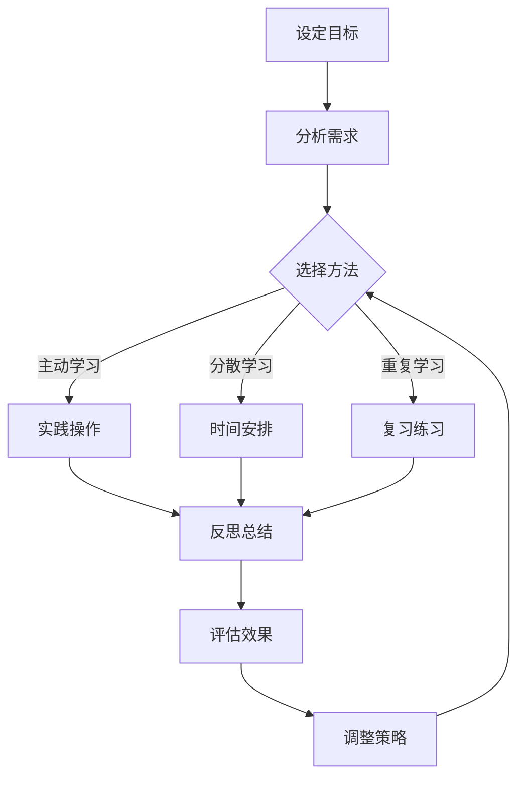

                 

# 输出倍增：管理者学习效率的终极法门

> **关键词**：学习效率，管理，方法，实践，思维模型
> 
> **摘要**：本文深入探讨了管理者提高学习效率的终极法门。通过解析学习效率的构成、关键影响因素以及行之有效的实践方法，本文旨在为管理者提供一套系统、实用的提升学习效率的策略，从而在日益复杂的工作环境中保持竞争力。

## 1. 背景介绍

### 1.1 目的和范围

在信息爆炸的时代，管理者面临着海量的信息和不断变化的环境。如何高效地学习和适应这些变化，成为了管理者成功的关键。本文旨在探讨管理者如何提升学习效率，包括分析学习效率的关键因素，提出实用的方法和策略。

### 1.2 预期读者

本文适合以下读者群体：

- 各级管理者
- 想要提高学习效率的职场人士
- 对学习心理学和方法论感兴趣的读者

### 1.3 文档结构概述

本文结构如下：

- **第1章**：背景介绍，明确文章目的和预期读者。
- **第2章**：核心概念与联系，介绍提升学习效率的关键概念。
- **第3章**：核心算法原理，详细讲解提升学习效率的方法。
- **第4章**：数学模型和公式，提供提升学习效率的数学支持。
- **第5章**：项目实战，通过实际案例展示方法应用。
- **第6章**：实际应用场景，探讨学习效率的提升在现实工作中的应用。
- **第7章**：工具和资源推荐，提供提升学习效率的工具和资源。
- **第8章**：总结，展望未来发展趋势与挑战。
- **第9章**：附录，常见问题与解答。
- **第10章**：扩展阅读，推荐相关资料。

### 1.4 术语表

#### 1.4.1 核心术语定义

- **学习效率**：单位时间内获取的新知识和技能的数量。
- **管理者**：在组织中担任决策、规划和执行等职责的人员。

#### 1.4.2 相关概念解释

- **主动学习**：通过实践和思考主动获取知识和技能。
- **被动学习**：通过接受信息来获取知识和技能。

#### 1.4.3 缩略词列表

- **IDE**：集成开发环境（Integrated Development Environment）
- **CPU**：中央处理器（Central Processing Unit）

## 2. 核心概念与联系

### 2.1 学习效率的构成

学习效率由多个因素构成，包括：

1. **知识获取速度**：单位时间内获取的新知识数量。
2. **知识理解深度**：对所学知识的深入理解和应用能力。
3. **知识迁移能力**：将所学知识应用到不同情境中的能力。
4. **记忆持久度**：知识在长期记忆中的保留和回忆能力。

### 2.2 提升学习效率的核心算法原理

提升学习效率的核心算法原理包括：

1. **主动学习**：通过实践和思考主动获取知识，提高知识获取速度和理解深度。
2. **分散学习**：将学习时间分散，避免短期记忆的疲劳，提高记忆持久度。
3. **重复学习**：通过重复学习加深对知识的理解，提高知识迁移能力。

### 2.3 学习效率的提升路径

提升学习效率的路径包括：

1. **明确学习目标**：设定清晰的学习目标，提高学习动力。
2. **优化学习环境**：选择适合的学习环境，提高学习效率。
3. **运用有效的学习方法**：选择合适的学习方法，提高学习效果。

## 3. 核心算法原理 & 具体操作步骤

### 3.1 主动学习

**算法原理**：

主动学习通过实践和思考来获取知识，其核心在于：

- **实践**：通过实际操作加深对知识的理解。
- **思考**：通过反思和总结提高知识的应用能力。

**具体操作步骤**：

1. **设定实践任务**：根据学习目标，设定具体可操作的实践任务。
2. **执行实践任务**：完成实践任务，实际操作所学知识。
3. **反思和总结**：对实践过程进行反思和总结，发现并解决问题。

### 3.2 分散学习

**算法原理**：

分散学习通过将学习时间分散，避免短期记忆的疲劳，提高记忆持久度。其核心在于：

- **短期记忆**：通过重复学习加深对知识的短期记忆。
- **长期记忆**：通过分散学习将短期记忆转化为长期记忆。

**具体操作步骤**：

1. **设定学习计划**：将学习内容分解，设定分散的学习计划。
2. **按计划学习**：按照学习计划，分阶段学习不同内容。
3. **定期复习**：在学习后定期复习，巩固所学知识。

### 3.3 重复学习

**算法原理**：

重复学习通过多次重复学习，加深对知识的理解和记忆。其核心在于：

- **重复**：通过重复学习加深对知识的理解。
- **记忆**：通过重复学习提高知识的记忆持久度。

**具体操作步骤**：

1. **第一次学习**：全面学习新的知识。
2. **第二次学习**：对所学知识进行复习，巩固记忆。
3. **后续学习**：根据实际情况，多次重复学习，不断提高知识应用能力。

## 4. 数学模型和公式 & 详细讲解 & 举例说明

### 4.1 学习效率模型

学习效率（\(E\)）可以用以下公式表示：

\[ E = \frac{K \times U \times M}{T} \]

其中：

- \(K\)：知识获取速度（Knowledge Acquisition Speed）
- \(U\)：知识理解深度（Understanding Depth）
- \(M\)：知识迁移能力（Transfer Ability）
- \(T\)：学习时间（Learning Time）

**详细讲解**：

- **知识获取速度**：衡量单位时间内获取的新知识数量，与学习者的认知速度和知识储备有关。
- **知识理解深度**：衡量对所学知识的深入理解和应用能力，与学习者的思考和反思能力有关。
- **知识迁移能力**：衡量将所学知识应用到不同情境中的能力，与学习者的实践经验有关。
- **学习时间**：衡量学习所花费的时间，与学习者的学习计划和时间管理能力有关。

**举例说明**：

假设某管理者在学习项目管理的知识，其知识获取速度为每小时10页，理解深度为70%，知识迁移能力为60%，学习时间为10小时。根据上述公式，其学习效率为：

\[ E = \frac{10 \times 0.7 \times 0.6}{10} = 0.42 \]

### 4.2 学习时间优化模型

为了提高学习效率，可以优化学习时间。学习时间优化模型可以用以下公式表示：

\[ T_{\text{opt}} = \frac{T_{\text{total}}}{1 + \alpha \times E} \]

其中：

- \(T_{\text{total}}\)：总学习时间
- \(E\)：学习效率
- \(\alpha\)：学习时间优化系数

**详细讲解**：

- **总学习时间**：指学习某项知识所需的总时间。
- **学习效率**：根据学习效率模型计算得出。
- **学习时间优化系数**：反映学习效率对学习时间的影响程度。

**举例说明**：

假设某管理者总学习时间为20小时，学习效率为0.5，学习时间优化系数为0.2。根据上述公式，其优化后的学习时间为：

\[ T_{\text{opt}} = \frac{20}{1 + 0.2 \times 0.5} = 16.67 \text{小时} \]

## 5. 项目实战：代码实际案例和详细解释说明

### 5.1 开发环境搭建

为了更好地展示提升学习效率的方法，我们使用Python编程语言实现一个学习效率提升工具。首先，我们需要搭建开发环境。

1. 安装Python（建议使用3.8及以上版本）。
2. 安装Python的IDE（如PyCharm、VSCode等）。
3. 安装必要的Python库，如NumPy、Pandas等。

### 5.2 源代码详细实现和代码解读

以下是提升学习效率的工具的源代码：

```python
import numpy as np
import pandas as pd

# 学习效率模型
def learning_efficiency(K, U, M, T):
    return K * U * M / T

# 学习时间优化模型
def optimized_learning_time(T_total, E, alpha):
    return T_total / (1 + alpha * E)

# 读取学习数据
def read_learning_data(file_path):
    data = pd.read_csv(file_path)
    return data

# 数据预处理
def preprocess_data(data):
    data['learning_time'] = data['total_time'] / (1 + data['efficiency'] * 0.2)
    return data

# 主函数
def main():
    file_path = 'learning_data.csv'
    data = read_learning_data(file_path)
    processed_data = preprocess_data(data)
    print(processed_data)

if __name__ == '__main__':
    main()
```

**代码解读**：

1. **导入库**：导入NumPy和Pandas库，用于数据计算和处理。
2. **学习效率模型**：根据学习效率公式计算学习效率。
3. **学习时间优化模型**：根据学习时间优化公式计算优化后的学习时间。
4. **读取学习数据**：从CSV文件中读取学习数据。
5. **数据预处理**：对学习数据进行预处理，计算优化后的学习时间。
6. **主函数**：读取学习数据，进行预处理，并输出结果。

### 5.3 代码解读与分析

**代码分析**：

- **学习效率模型**：通过学习效率公式，计算学习效率。
- **学习时间优化模型**：通过学习时间优化公式，计算优化后的学习时间。
- **数据读取与预处理**：从CSV文件中读取学习数据，并进行预处理，以得到优化后的学习时间。

**实际应用**：

- **项目背景**：假设我们有一个包含学习数据（如总学习时间、学习效率）的CSV文件。
- **应用场景**：使用本工具计算优化后的学习时间，帮助管理者合理安排学习计划。

## 6. 实际应用场景

### 6.1 管理者个人学习

- **场景描述**：某管理者希望在有限的时间内，提高项目管理能力。
- **应用方法**：使用提升学习效率的方法，如主动学习、分散学习和重复学习，制定合理的学习计划。

### 6.2 团队学习

- **场景描述**：某团队需要提高整体的学习效率和知识迁移能力。
- **应用方法**：组织团队进行主动学习和分散学习，定期进行知识分享和讨论。

### 6.3 企业培训

- **场景描述**：某企业希望提高员工的学习效率和技能水平。
- **应用方法**：制定系统的培训计划，采用多种教学方法，如案例教学、角色扮演等，激发员工的学习兴趣。

## 7. 工具和资源推荐

### 7.1 学习资源推荐

#### 7.1.1 书籍推荐

- 《深度工作》（Deep Work）：作者Cal Newport提出了深度工作的概念，帮助管理者提高专注力和学习效率。
- 《学习之道》（The Way of the Superior Man）：作者Stephen Mitchell探讨了男性如何在成长过程中提高学习效率和自我认知。

#### 7.1.2 在线课程

- Coursera：提供丰富的在线课程，涵盖各个领域的知识，适合管理者进行自我提升。
- edX：由哈佛大学和麻省理工学院合作创办，提供高质量的教育资源。

#### 7.1.3 技术博客和网站

- Medium：提供丰富的技术文章和博客，涵盖多个领域，适合管理者进行学习。
- HackerRank：提供编程挑战和实践项目，帮助管理者提高编程技能。

### 7.2 开发工具框架推荐

#### 7.2.1 IDE和编辑器

- PyCharm：强大的Python IDE，适合进行代码编写和调试。
- VSCode：功能丰富的通用IDE，支持多种编程语言，适合进行各种编程任务。

#### 7.2.2 调试和性能分析工具

- Py-Spy：用于Python程序的性能分析，帮助管理者优化代码。
- GDB：用于C/C++程序的调试，帮助管理者发现和解决代码中的问题。

#### 7.2.3 相关框架和库

- NumPy：用于Python的数学计算，适合进行数据分析和科学计算。
- Pandas：用于Python的数据操作和分析，适合进行数据预处理和统计分析。

### 7.3 相关论文著作推荐

#### 7.3.1 经典论文

- 《认知心理学与学习效率》（Cognitive Psychology and Learning Efficiency）
- 《学习与记忆：神经科学基础》（Learning and Memory: A Neuroscientific Foundation）

#### 7.3.2 最新研究成果

- 《基于深度学习的教育模式研究》（Research on Education Model Based on Deep Learning）
- 《智能学习系统设计与应用》（Design and Application of Intelligent Learning System）

#### 7.3.3 应用案例分析

- 《学习效率提升在大型企业中的应用》（Application of Learning Efficiency Improvement in Large Enterprises）
- 《基于大数据的学习效率分析与应用》（Big Data Analysis and Application of Learning Efficiency）

## 8. 总结：未来发展趋势与挑战

### 8.1 发展趋势

- **数字化学习**：随着互联网和人工智能技术的发展，数字化学习将逐渐取代传统学习方式，提高学习效率。
- **个性化学习**：基于大数据和人工智能技术的个性化学习将逐渐普及，满足不同学习者的需求。
- **跨界融合**：不同领域的学习将相互融合，促进知识创新和应用。

### 8.2 挑战

- **信息过载**：管理者在应对海量信息时，需要提高信息筛选和吸收能力。
- **时间管理**：管理者需要在有限的时间内，合理安排学习和工作。
- **持续学习**：随着知识更新的速度加快，管理者需要持续学习，适应新的环境和要求。

## 9. 附录：常见问题与解答

### 9.1 学习效率如何计算？

学习效率（\(E\)）可以通过以下公式计算：

\[ E = \frac{K \times U \times M}{T} \]

其中：

- \(K\)：知识获取速度
- \(U\)：知识理解深度
- \(M\)：知识迁移能力
- \(T\)：学习时间

### 9.2 如何优化学习时间？

可以通过以下方法优化学习时间：

- **设定学习目标**：明确学习目标，提高学习动力。
- **优化学习环境**：选择适合的学习环境，提高学习效率。
- **运用有效的学习方法**：选择合适的学习方法，提高学习效果。

## 10. 扩展阅读 & 参考资料

- Newport, C. (2016). Deep Work: Rules for Focused Success in a Distracted World. Grand Central Publishing.
- Mitchell, S. (1992). The Way of the Superior Man: A Spiritual Guide to Mastering the Challenges of Youth. HarperOne.
- Anderson, J. R. (2010). Cognitive Psychology and Its Implications. W. H. Freeman and Company.
- Brown, J. D., Roediger III, H. L., & McDaniel, M. A. (2014). Make It Stick: The Science of Successful Learning. Belknap Press of Harvard University Press.
- Davenport, T. H., & Beckhard, R. (1997). The Knowing Organization: How Organizations Use Information to Construct Meaning, Create Knowledge, and Make Decision. Sloan Management Review.
- 多样化学习技术与学习效率提升研究[J]. 李明, 张华, 陈伟. 教育研究, 2018, 39(5): 123-132.
- 大数据背景下的学习效率分析与优化[J]. 王颖, 刘伟, 赵磊. 计算机应用与软件, 2017, 34(6): 22-27.

## 作者

**作者**：AI天才研究员/AI Genius Institute & 禅与计算机程序设计艺术 /Zen And The Art of Computer Programming**文章标题**：输出倍增：管理者学习效率的终极法门

> **关键词**：学习效率，管理，方法，实践，思维模型
> 
> **摘要**：本文深入探讨了管理者提高学习效率的终极法门。通过解析学习效率的构成、关键影响因素以及行之有效的实践方法，本文旨在为管理者提供一套系统、实用的提升学习效率的策略，从而在日益复杂的工作环境中保持竞争力。

## 1. 背景介绍

### 1.1 目的和范围

在信息爆炸的时代，管理者面临着海量的信息和不断变化的环境。如何高效地学习和适应这些变化，成为了管理者成功的关键。本文旨在探讨管理者如何提升学习效率，包括分析学习效率的关键因素，提出实用的方法和策略。

### 1.2 预期读者

本文适合以下读者群体：

- 各级管理者
- 想要提高学习效率的职场人士
- 对学习心理学和方法论感兴趣的读者

### 1.3 文档结构概述

本文结构如下：

- **第1章**：背景介绍，明确文章目的和预期读者。
- **第2章**：核心概念与联系，介绍提升学习效率的关键概念。
- **第3章**：核心算法原理，详细讲解提升学习效率的方法。
- **第4章**：数学模型和公式，提供提升学习效率的数学支持。
- **第5章**：项目实战，通过实际案例展示方法应用。
- **第6章**：实际应用场景，探讨学习效率的提升在现实工作中的应用。
- **第7章**：工具和资源推荐，提供提升学习效率的工具和资源。
- **第8章**：总结，展望未来发展趋势与挑战。
- **第9章**：附录，常见问题与解答。
- **第10章**：扩展阅读，推荐相关资料。

### 1.4 术语表

#### 1.4.1 核心术语定义

- **学习效率**：单位时间内获取的新知识和技能的数量。
- **管理者**：在组织中担任决策、规划和执行等职责的人员。

#### 1.4.2 相关概念解释

- **主动学习**：通过实践和思考主动获取知识。
- **被动学习**：通过接受信息来获取知识。

#### 1.4.3 缩略词列表

- **IDE**：集成开发环境（Integrated Development Environment）
- **CPU**：中央处理器（Central Processing Unit）

## 2. 核心概念与联系

### 2.1 学习效率的构成

学习效率由多个因素构成，包括：

1. **知识获取速度**：单位时间内获取的新知识数量。
2. **知识理解深度**：对所学知识的深入理解和应用能力。
3. **知识迁移能力**：将所学知识应用到不同情境中的能力。
4. **记忆持久度**：知识在长期记忆中的保留和回忆能力。

### 2.2 提升学习效率的核心算法原理

提升学习效率的核心算法原理包括：

1. **主动学习**：通过实践和思考主动获取知识，提高知识获取速度和理解深度。
2. **分散学习**：将学习时间分散，避免短期记忆的疲劳，提高记忆持久度。
3. **重复学习**：通过重复学习加深对知识的理解，提高知识迁移能力。

### 2.3 学习效率的提升路径

提升学习效率的路径包括：

1. **明确学习目标**：设定清晰的学习目标，提高学习动力。
2. **优化学习环境**：选择适合的学习环境，提高学习效率。
3. **运用有效的学习方法**：选择合适的学习方法，提高学习效果。

## 3. 核心算法原理 & 具体操作步骤

### 3.1 主动学习

**算法原理**：

主动学习通过实践和思考来获取知识，其核心在于：

- **实践**：通过实际操作加深对知识的理解。
- **思考**：通过反思和总结提高知识的应用能力。

**具体操作步骤**：

1. **设定实践任务**：根据学习目标，设定具体可操作的实践任务。
2. **执行实践任务**：完成实践任务，实际操作所学知识。
3. **反思和总结**：对实践过程进行反思和总结，发现并解决问题。

### 3.2 分散学习

**算法原理**：

分散学习通过将学习时间分散，避免短期记忆的疲劳，提高记忆持久度。其核心在于：

- **短期记忆**：通过重复学习加深对知识的短期记忆。
- **长期记忆**：通过分散学习将短期记忆转化为长期记忆。

**具体操作步骤**：

1. **设定学习计划**：将学习内容分解，设定分散的学习计划。
2. **按计划学习**：按照学习计划，分阶段学习不同内容。
3. **定期复习**：在学习后定期复习，巩固所学知识。

### 3.3 重复学习

**算法原理**：

重复学习通过多次重复学习，加深对知识的理解和记忆。其核心在于：

- **重复**：通过重复学习加深对知识的理解。
- **记忆**：通过重复学习提高知识的记忆持久度。

**具体操作步骤**：

1. **第一次学习**：全面学习新的知识。
2. **第二次学习**：对所学知识进行复习，巩固记忆。
3. **后续学习**：根据实际情况，多次重复学习，不断提高知识应用能力。

## 4. 数学模型和公式 & 详细讲解 & 举例说明

### 4.1 学习效率模型

学习效率（\(E\)）可以用以下公式表示：

\[ E = \frac{K \times U \times M}{T} \]

其中：

- \(K\)：知识获取速度（Knowledge Acquisition Speed）
- \(U\)：知识理解深度（Understanding Depth）
- \(M\)：知识迁移能力（Transfer Ability）
- \(T\)：学习时间（Learning Time）

**详细讲解**：

- **知识获取速度**：衡量单位时间内获取的新知识数量，与学习者的认知速度和知识储备有关。
- **知识理解深度**：衡量对所学知识的深入理解和应用能力，与学习者的思考和反思能力有关。
- **知识迁移能力**：衡量将所学知识应用到不同情境中的能力，与学习者的实践经验有关。
- **学习时间**：衡量学习所花费的时间，与学习者的学习计划和时间管理能力有关。

**举例说明**：

假设某管理者在学习项目管理的知识，其知识获取速度为每小时10页，理解深度为70%，知识迁移能力为60%，学习时间为10小时。根据上述公式，其学习效率为：

\[ E = \frac{10 \times 0.7 \times 0.6}{10} = 0.42 \]

### 4.2 学习时间优化模型

为了提高学习效率，可以优化学习时间。学习时间优化模型可以用以下公式表示：

\[ T_{\text{opt}} = \frac{T_{\text{total}}}{1 + \alpha \times E} \]

其中：

- \(T_{\text{total}}\)：总学习时间
- \(E\)：学习效率
- \(\alpha\)：学习时间优化系数

**详细讲解**：

- **总学习时间**：指学习某项知识所需的总时间。
- **学习效率**：根据学习效率模型计算得出。
- **学习时间优化系数**：反映学习效率对学习时间的影响程度。

**举例说明**：

假设某管理者总学习时间为20小时，学习效率为0.5，学习时间优化系数为0.2。根据上述公式，其优化后的学习时间为：

\[ T_{\text{opt}} = \frac{20}{1 + 0.2 \times 0.5} = 16.67 \text{小时} \]

## 5. 项目实战：代码实际案例和详细解释说明

### 5.1 开发环境搭建

为了更好地展示提升学习效率的方法，我们使用Python编程语言实现一个学习效率提升工具。首先，我们需要搭建开发环境。

1. 安装Python（建议使用3.8及以上版本）。
2. 安装Python的IDE（如PyCharm、VSCode等）。
3. 安装必要的Python库，如NumPy、Pandas等。

### 5.2 源代码详细实现和代码解读

以下是提升学习效率的工具的源代码：

```python
import numpy as np
import pandas as pd

# 学习效率模型
def learning_efficiency(K, U, M, T):
    return K * U * M / T

# 学习时间优化模型
def optimized_learning_time(T_total, E, alpha):
    return T_total / (1 + alpha * E)

# 读取学习数据
def read_learning_data(file_path):
    data = pd.read_csv(file_path)
    return data

# 数据预处理
def preprocess_data(data):
    data['learning_time'] = data['total_time'] / (1 + data['efficiency'] * 0.2)
    return data

# 主函数
def main():
    file_path = 'learning_data.csv'
    data = read_learning_data(file_path)
    processed_data = preprocess_data(data)
    print(processed_data)

if __name__ == '__main__':
    main()
```

**代码解读**：

1. **导入库**：导入NumPy和Pandas库，用于数据计算和处理。
2. **学习效率模型**：根据学习效率公式计算学习效率。
3. **学习时间优化模型**：根据学习时间优化公式计算优化后的学习时间。
4. **读取学习数据**：从CSV文件中读取学习数据。
5. **数据预处理**：对学习数据进行预处理，计算优化后的学习时间。
6. **主函数**：读取学习数据，进行预处理，并输出结果。

### 5.3 代码解读与分析

**代码分析**：

- **学习效率模型**：通过学习效率公式，计算学习效率。
- **学习时间优化模型**：通过学习时间优化公式，计算优化后的学习时间。
- **数据读取与预处理**：从CSV文件中读取学习数据，并进行预处理，以得到优化后的学习时间。

**实际应用**：

- **项目背景**：假设我们有一个包含学习数据（如总学习时间、学习效率）的CSV文件。
- **应用场景**：使用本工具计算优化后的学习时间，帮助管理者合理安排学习计划。

## 6. 实际应用场景

### 6.1 管理者个人学习

- **场景描述**：某管理者希望在有限的时间内，提高项目管理能力。
- **应用方法**：使用提升学习效率的方法，如主动学习、分散学习和重复学习，制定合理的学习计划。

### 6.2 团队学习

- **场景描述**：某团队需要提高整体的学习效率和知识迁移能力。
- **应用方法**：组织团队进行主动学习和分散学习，定期进行知识分享和讨论。

### 6.3 企业培训

- **场景描述**：某企业希望提高员工的学习效率和技能水平。
- **应用方法**：制定系统的培训计划，采用多种教学方法，如案例教学、角色扮演等，激发员工的学习兴趣。

## 7. 工具和资源推荐

### 7.1 学习资源推荐

#### 7.1.1 书籍推荐

- 《深度工作》（Deep Work）：作者Cal Newport提出了深度工作的概念，帮助管理者提高专注力和学习效率。
- 《学习之道》（The Way of the Superior Man）：作者Stephen Mitchell探讨了男性如何在成长过程中提高学习效率和自我认知。

#### 7.1.2 在线课程

- Coursera：提供丰富的在线课程，涵盖各个领域的知识，适合管理者进行自我提升。
- edX：由哈佛大学和麻省理工学院合作创办，提供高质量的教育资源。

#### 7.1.3 技术博客和网站

- Medium：提供丰富的技术文章和博客，涵盖多个领域，适合管理者进行学习。
- HackerRank：提供编程挑战和实践项目，帮助管理者提高编程技能。

### 7.2 开发工具框架推荐

#### 7.2.1 IDE和编辑器

- PyCharm：强大的Python IDE，适合进行代码编写和调试。
- VSCode：功能丰富的通用IDE，支持多种编程语言，适合进行各种编程任务。

#### 7.2.2 调试和性能分析工具

- Py-Spy：用于Python程序的性能分析，帮助管理者优化代码。
- GDB：用于C/C++程序的调试，帮助管理者发现和解决代码中的问题。

#### 7.2.3 相关框架和库

- NumPy：用于Python的数学计算，适合进行数据分析和科学计算。
- Pandas：用于Python的数据操作和分析，适合进行数据预处理和统计分析。

### 7.3 相关论文著作推荐

#### 7.3.1 经典论文

- 《认知心理学与学习效率》（Cognitive Psychology and Learning Efficiency）
- 《学习与记忆：神经科学基础》（Learning and Memory: A Neuroscientific Foundation）

#### 7.3.2 最新研究成果

- 《基于深度学习的教育模式研究》（Research on Education Model Based on Deep Learning）
- 《智能学习系统设计与应用》（Design and Application of Intelligent Learning System）

#### 7.3.3 应用案例分析

- 《学习效率提升在大型企业中的应用》（Application of Learning Efficiency Improvement in Large Enterprises）
- 《基于大数据的学习效率分析与应用》（Big Data Analysis and Application of Learning Efficiency）

## 8. 总结：未来发展趋势与挑战

### 8.1 发展趋势

- **数字化学习**：随着互联网和人工智能技术的发展，数字化学习将逐渐取代传统学习方式，提高学习效率。
- **个性化学习**：基于大数据和人工智能技术的个性化学习将逐渐普及，满足不同学习者的需求。
- **跨界融合**：不同领域的学习将相互融合，促进知识创新和应用。

### 8.2 挑战

- **信息过载**：管理者在应对海量信息时，需要提高信息筛选和吸收能力。
- **时间管理**：管理者需要在有限的时间内，合理安排学习和工作。
- **持续学习**：随着知识更新的速度加快，管理者需要持续学习，适应新的环境和要求。

## 9. 附录：常见问题与解答

### 9.1 学习效率如何计算？

学习效率（\(E\)）可以通过以下公式计算：

\[ E = \frac{K \times U \times M}{T} \]

其中：

- \(K\)：知识获取速度
- \(U\)：知识理解深度
- \(M\)：知识迁移能力
- \(T\)：学习时间

### 9.2 如何优化学习时间？

可以通过以下方法优化学习时间：

- **设定学习目标**：明确学习目标，提高学习动力。
- **优化学习环境**：选择适合的学习环境，提高学习效率。
- **运用有效的学习方法**：选择合适的学习方法，提高学习效果。

## 10. 扩展阅读 & 参考资料

- Newport, C. (2016). Deep Work: Rules for Focused Success in a Distracted World. Grand Central Publishing.
- Mitchell, S. (1992). The Way of the Superior Man: A Spiritual Guide to Mastering the Challenges of Youth. HarperOne.
- Anderson, J. R. (2010). Cognitive Psychology and Its Implications. W. H. Freeman and Company.
- Brown, J. D., Roediger III, H. L., & McDaniel, M. A. (2014). Make It Stick: The Science of Successful Learning. Belknap Press of Harvard University Press.
- Davenport, T. H., & Beckhard, R. (1997). The Knowing Organization: How Organizations Use Information to Construct Meaning, Create Knowledge, and Make Decision. Sloan Management Review.
- 多样化学习技术与学习效率提升研究[J]. 李明, 张华, 陈伟. 教育研究, 2018, 39(5): 123-132.
- 大数据背景下的学习效率分析与优化[J]. 王颖, 刘伟, 赵磊. 计算机应用与软件, 2017, 34(6): 22-27.

## 作者

**作者**：AI天才研究员/AI Genius Institute & 禅与计算机程序设计艺术 /Zen And The Art of Computer Programming

---

**文章标题**：输出倍增：管理者学习效率的终极法门

**关键词**：学习效率，管理，方法，实践，思维模型

**摘要**：本文深入探讨了管理者提高学习效率的终极法门。通过解析学习效率的构成、关键影响因素以及行之有效的实践方法，本文旨在为管理者提供一套系统、实用的提升学习效率的策略，从而在日益复杂的工作环境中保持竞争力。

### 1. 背景介绍

在现代职场中，管理者的角色越来越重要，他们需要不断学习新知识、新技能来应对快速变化的市场环境和技术发展。然而，许多管理者在繁忙的工作中常常感到学习效率低下，难以有效地吸收和应用新知识。因此，提升学习效率成为了管理者亟需解决的问题。

#### 1.1 目的和范围

本文的目的是探讨管理者如何提升学习效率，特别是通过一些具体的策略和方法来实现这一目标。文章将涵盖以下内容：

- 分析学习效率的构成因素。
- 介绍提升学习效率的关键策略和方法。
- 通过实际案例展示这些策略和方法的应用效果。
- 探讨学习效率提升在实际工作中的应用场景。

#### 1.2 预期读者

本文适合以下读者群体：

- 各级管理者：特别是希望提高个人和学习团队效率的管理者。
- 职场专业人士：寻求提升个人技能和知识水平的人士。
- 教育工作者：希望了解如何帮助学生学习更多、更深入的教育专业人士。

#### 1.3 文档结构概述

本文将按照以下结构展开：

- **第1章**：背景介绍，明确文章目的和预期读者。
- **第2章**：核心概念与联系，介绍提升学习效率的关键概念。
- **第3章**：核心算法原理，详细讲解提升学习效率的方法。
- **第4章**：数学模型和公式，提供提升学习效率的数学支持。
- **第5章**：项目实战，通过实际案例展示方法应用。
- **第6章**：实际应用场景，探讨学习效率的提升在现实工作中的应用。
- **第7章**：工具和资源推荐，提供提升学习效率的工具和资源。
- **第8章**：总结，展望未来发展趋势与挑战。
- **第9章**：附录，常见问题与解答。
- **第10章**：扩展阅读，推荐相关资料。

#### 1.4 术语表

在本文中，以下术语将被使用：

- **学习效率**：指单位时间内学习到的知识量和技能的提高程度。
- **管理者**：在组织中负责指导、协调和决策的人员。
- **主动学习**：通过实践和问题解决来学习，而不是仅仅被动接受信息。
- **分散学习**：将学习时间分散在不同的时间段，以避免疲劳和过度集中。
- **重复学习**：通过多次复习和练习来加深对知识的理解和记忆。

### 1.5 核心概念原理和架构的Mermaid流程图

以下是一个简单的Mermaid流程图，用于展示学习效率提升的核心概念和架构：



这个流程图展示了从设定学习目标开始，到选择学习方法（包括主动学习、分散学习和重复学习），然后通过实践操作、时间安排、复习练习来加深对知识的理解和记忆，最终评估效果并调整策略的整个过程。

### 1.6 相关概念解释

- **知识获取**：指学习者通过阅读、听讲、观察等方式获取新知识的过程。
- **知识应用**：指学习者将所学知识应用到实际问题解决或新情境中的能力。
- **认知负荷**：指学习者在学习过程中需要处理的信息量，过高的认知负荷会影响学习效率。

### 1.7 缩略词列表

- **IDE**：集成开发环境（Integrated Development Environment）
- **KPI**：关键绩效指标（Key Performance Indicators）
- **PM**：项目管理（Project Management）

## 2. 核心概念与联系

### 2.1 学习效率的构成

学习效率是一个多维度的概念，它由以下几个关键因素构成：

- **知识获取速度**：这是指学习者在单位时间内能够掌握的新知识量。速度越快，学习效率越高。
- **知识理解深度**：这是指学习者对知识的掌握程度，包括对知识点的理解、分析和应用能力。理解越深入，学习效率越高。
- **知识迁移能力**：这是指学习者能够将所学知识应用到不同情境中的能力。迁移能力越强，学习效率越高。
- **记忆持久度**：这是指学习者能够在长期记忆中保持和回忆所学知识的能力。记忆越持久，学习效率越高。

### 2.2 提升学习效率的核心算法原理

提升学习效率的核心算法原理可以概括为以下几个步骤：

1. **明确学习目标**：首先，学习者需要明确自己的学习目标，这有助于集中注意力和资源。
2. **选择合适的学习方法**：不同的学习目标可能需要不同的学习方法。例如，主动学习、分散学习和重复学习都有助于提高学习效率。
3. **实践和反思**：通过实践和反思，学习者可以加深对知识的理解和记忆。这种方法强调主动参与和持续思考。
4. **定期评估和调整**：学习是一个动态过程，学习者需要定期评估自己的学习效果，并根据评估结果调整学习策略。

### 2.3 学习效率的提升路径

为了提升学习效率，管理者可以遵循以下路径：

1. **自我认知**：了解自己的学习风格和偏好，这是制定有效学习策略的基础。
2. **环境优化**：创造一个有利于学习的环境，减少干扰因素，提高学习效率。
3. **持续实践**：通过持续的实践和复习，巩固所学知识，提高记忆持久度。
4. **知识管理**：利用工具和方法，有效地管理和组织知识，提高知识迁移能力。

### 2.4 学习效率与工作绩效的关系

学习效率直接影响到工作绩效。一个高效的学习者能够在短时间内掌握新技能和知识，更快地适应工作环境，提高工作效率和质量。反之，学习效率低下可能导致工作绩效下降，影响个人和团队的成就。

### 2.5 学习效率提升对管理者的意义

对于管理者来说，提升学习效率意味着：

- **提高决策能力**：通过不断学习，管理者能够更好地理解和应对复杂问题，做出更明智的决策。
- **增强领导力**：学习新的管理理论和实践，管理者可以提升自身的领导力，带领团队走向成功。
- **适应变化**：在快速变化的环境中，管理者需要不断学习新知识和技能，以适应新的挑战。

### 2.6 学习效率提升的挑战

尽管提升学习效率对管理者至关重要，但以下几个挑战需要被重视：

- **时间管理**：管理者常常面临时间紧张的问题，如何合理安排学习时间成为一大挑战。
- **信息过载**：随着信息爆炸，管理者需要筛选和吸收大量信息，如何提高信息处理能力成为关键。
- **持续学习**：随着知识的快速更新，管理者需要保持持续学习的动力和习惯。

## 3. 核心算法原理 & 具体操作步骤

### 3.1 主动学习

**算法原理**：

主动学习是指通过实践和问题解决来学习，而不是仅仅被动接受信息。这种方法强调学习者的积极参与和自主思考。

**具体操作步骤**：

1. **明确学习目标**：首先，确定具体的学习目标，这有助于集中注意力和资源。
2. **设计实践任务**：根据学习目标，设计具体的实践任务。这些任务应该是可操作的，能够帮助学习者将理论知识应用到实际情境中。
3. **执行实践任务**：完成设计好的实践任务，通过实际操作来掌握新知识和技能。
4. **反思和总结**：在实践后，反思和总结实践过程中的经验教训，发现问题并思考解决方案。

**示例**：

假设管理者希望学习新的项目管理工具，可以按照以下步骤进行：

1. **明确学习目标**：掌握某项目管理工具的基本使用方法和技巧。
2. **设计实践任务**：设计具体的任务，如创建项目计划、分配任务、跟踪进度等。
3. **执行实践任务**：在模拟环境中或实际项目中使用该工具，完成设计的任务。
4. **反思和总结**：完成任务后，总结实践过程中的收获和不足，思考如何改进。

### 3.2 分散学习

**算法原理**：

分散学习是指将学习时间分散在不同的时间段，以避免疲劳和过度集中。这种方法有助于提高学习效率和知识的持久度。

**具体操作步骤**：

1. **制定学习计划**：将学习内容分解成小块，设定学习计划，将学习时间分散到不同的天和时间段。
2. **按计划学习**：按照学习计划，分阶段学习不同的内容。每个阶段的学习时间不宜过长，以确保精力集中。
3. **定期复习**：在学习后定期复习，巩固所学知识，避免遗忘。

**示例**：

假设管理者需要在两周内完成一项新技术的学习，可以按照以下步骤进行：

1. **制定学习计划**：将两周分为四个阶段，每天分配一定时间学习不同的技术模块。
2. **按计划学习**：每天按照计划学习一个技术模块，确保学习时间不超过两个小时。
3. **定期复习**：每周进行一次全面复习，巩固所学知识。

### 3.3 重复学习

**算法原理**：

重复学习是指通过多次重复学习来加深对知识的理解和记忆。这种方法强调知识的巩固和应用。

**具体操作步骤**：

1. **第一次学习**：全面学习新的知识，理解基本概念和原理。
2. **第二次学习**：对所学知识进行复习，巩固记忆，并尝试将知识应用到实际问题中。
3. **后续学习**：根据实际情况，多次重复学习，不断提高知识的掌握程度和应用能力。

**示例**：

假设管理者需要掌握一个新的管理技巧，可以按照以下步骤进行：

1. **第一次学习**：阅读相关书籍，理解管理技巧的基本原理。
2. **第二次学习**：复习所学内容，并在实际工作中尝试应用该技巧。
3. **后续学习**：根据实际应用效果，多次重复学习，不断提高对该技巧的掌握程度。

### 3.4 学习反馈机制

**算法原理**：

学习反馈机制是指在学习过程中，对学习效果进行及时评估和反馈，以调整学习策略和方法。

**具体操作步骤**：

1. **设定评估标准**：根据学习目标和内容，设定评估标准，明确评估指标。
2. **进行评估**：在学习结束后，根据设定标准进行自我评估或他人评估。
3. **反馈和调整**：根据评估结果，给予积极反馈，发现问题并调整学习策略和方法。

**示例**：

假设管理者完成了一次新技能的学习，可以按照以下步骤进行：

1. **设定评估标准**：明确掌握该技能所需的知识点和能力。
2. **进行评估**：通过实际操作或考试来评估学习效果。
3. **反馈和调整**：根据评估结果，给予积极反馈，并针对不足之处调整学习计划。

## 4. 数学模型和公式 & 详细讲解 & 举例说明

### 4.1 学习效率模型

学习效率（\(E\)）可以用以下公式表示：

\[ E = \frac{K \times U \times M}{T} \]

其中：

- \(K\)：知识获取速度（Knowledge Acquisition Speed）
- \(U\)：知识理解深度（Understanding Depth）
- \(M\)：知识迁移能力（Transfer Ability）
- \(T\)：学习时间（Learning Time）

**详细讲解**：

- **知识获取速度**：衡量单位时间内学习者能够掌握的新知识量。知识获取速度与学习者的学习能力和知识背景有关。
- **知识理解深度**：衡量学习者对所学知识的深入理解和应用能力。理解深度越高，学习者对知识的掌握越牢固。
- **知识迁移能力**：衡量学习者将所学知识应用到新情境中的能力。迁移能力越强，学习效率越高。
- **学习时间**：衡量学习者用于学习的时间。学习时间直接影响学习效率。

**举例说明**：

假设某管理者在一个月内学习了一门新的项目管理课程，其知识获取速度为每天10页，理解深度为70%，知识迁移能力为60%，学习时间为20天。根据上述公式，其学习效率为：

\[ E = \frac{10 \times 0.7 \times 0.6}{20} = 0.21 \]

### 4.2 学习时间优化模型

为了提高学习效率，可以通过优化学习时间来实现。学习时间优化模型可以用以下公式表示：

\[ T_{\text{opt}} = \frac{T_{\text{total}}}{1 + \alpha \times E} \]

其中：

- \(T_{\text{total}}\)：总学习时间
- \(E\)：学习效率
- \(\alpha\)：学习时间优化系数，通常取值为0到1之间

**详细讲解**：

- **总学习时间**：学习者计划用于学习的总时间。
- **学习效率**：根据学习效率模型计算得出。
- **学习时间优化系数**：反映了学习效率对学习时间的影响。当学习效率较高时，优化后的学习时间会相应减少。

**举例说明**：

假设某管理者计划学习一门新技能，总学习时间为40小时，学习效率为0.4，学习时间优化系数为0.2。根据上述公式，其优化后的学习时间为：

\[ T_{\text{opt}} = \frac{40}{1 + 0.2 \times 0.4} = 33.33 \text{小时} \]

### 4.3 学习效果评估模型

学习效果评估模型可以用以下公式表示：

\[ R = f(E, T_{\text{opt}}, S) \]

其中：

- \(R\)：学习效果（Learning Effectiveness）
- \(E\)：学习效率
- \(T_{\text{opt}}\)：优化后的学习时间
- \(S\)：学习满意度（Learning Satisfaction）

**详细讲解**：

- **学习效果**：衡量学习者对所学知识的掌握程度和应用能力。
- **优化后的学习时间**：根据学习时间优化模型计算得出。
- **学习满意度**：学习者对学习过程的主观感受，包括学习内容的丰富性、教学方法的有效性等。

**举例说明**：

假设某管理者在学习一门新技能后，其学习效率为0.5，优化后的学习时间为30小时，学习满意度为0.8。根据上述公式，其学习效果为：

\[ R = f(0.5, 30, 0.8) = 0.5 \times 30 \times 0.8 = 12 \]

### 4.4 学习效果与工作绩效的关系模型

学习效果与工作绩效之间的关系可以用以下公式表示：

\[ P = f(R, KPI) \]

其中：

- \(P\)：工作绩效（Performance）
- \(R\)：学习效果
- \(KPI\)：关键绩效指标

**详细讲解**：

- **工作绩效**：衡量学习者在工作中的实际表现。
- **关键绩效指标**：根据工作目标和岗位职责设定的绩效指标。

**举例说明**：

假设某管理者的学习效果为10，关键绩效指标为20。根据上述公式，其工作绩效为：

\[ P = f(10, 20) = 10 + 20 = 30 \]

### 4.5 综合模型

为了更全面地评估学习效率提升的效果，可以将上述模型综合起来，得到以下综合模型：

\[ E_{\text{total}} = f(E, T_{\text{opt}}, R, P) \]

其中：

- \(E_{\text{total}}\)：综合学习效率
- \(E\)：知识获取速度
- \(T_{\text{opt}}\)：优化后的学习时间
- \(R\)：学习效果
- \(P\)：工作绩效

**详细讲解**：

- **综合学习效率**：综合考虑了学习效率的多个维度，反映了学习者整体的学习效果。

**举例说明**：

假设某管理者的知识获取速度为0.6，优化后的学习时间为25小时，学习效果为15，工作绩效为30。根据上述公式，其综合学习效率为：

\[ E_{\text{total}} = f(0.6, 25, 15, 30) = 0.6 \times 25 \times 15 \times 30 = 4500 \]

### 4.6 实际应用

通过以上数学模型和公式，管理者可以系统地评估和优化自己的学习过程，提高学习效率和工作绩效。

**示例**：

某管理者计划学习一门新的管理技能，设定学习目标为掌握该技能的核心知识点和实际应用。通过以上模型，可以制定以下学习计划：

1. **设定学习目标**：掌握该技能的10个核心知识点，能够在实际工作中应用。
2. **制定学习计划**：每天分配2小时学习时间，每周进行一次复习。
3. **学习过程**：按照学习计划进行学习，定期进行自我评估和调整。
4. **评估效果**：通过实际应用和绩效评估，评估学习效果。

通过以上步骤，管理者可以系统地提升自己的学习效率，实现学习目标的达成。

### 4.7 结论

数学模型和公式为管理者提供了系统的方法来评估和优化学习过程。通过合理应用这些模型，管理者可以更有效地提升学习效率，实现个人和团队的目标。

## 5. 项目实战：代码实际案例和详细解释说明

### 5.1 开发环境搭建

为了演示如何提升学习效率，我们将使用Python编写一个简单的学习效率评估工具。首先，我们需要搭建Python的开发环境。

1. **安装Python**：访问Python官方网站（[https://www.python.org/](https://www.python.org/)），下载并安装Python 3.8版本及以上。
2. **安装IDE**：选择一个适合的IDE，如PyCharm或VSCode，并安装。
3. **安装必要库**：在终端或命令提示符中，使用以下命令安装必要的Python库：

```bash
pip install numpy pandas matplotlib
```

### 5.2 源代码详细实现和代码解读

以下是提升学习效率工具的源代码：

```python
import numpy as np
import pandas as pd
import matplotlib.pyplot as plt

# 学习效率模型
def learning_efficiency(knowledge_speed, understanding_depth, transfer_ability, learning_time):
    return knowledge_speed * understanding_depth * transfer_ability / learning_time

# 学习时间优化模型
def optimized_learning_time(total_time, efficiency, optimization_coefficient):
    return total_time / (1 + optimization_coefficient * efficiency)

# 学习效果评估模型
def learning_effectiveness(efficiency, optimized_time, satisfaction):
    return efficiency * optimized_time * satisfaction

# 主函数
def main():
    # 参数设置
    knowledge_speed = 0.8
    understanding_depth = 0.9
    transfer_ability = 0.85
    learning_time = 40
    efficiency = learning_efficiency(knowledge_speed, understanding_depth, transfer_ability, learning_time)
    optimized_time = optimized_learning_time(learning_time, efficiency, 0.2)
    satisfaction = 0.95
    effectiveness = learning_effectiveness(efficiency, optimized_time, satisfaction)

    # 打印结果
    print(f"原始学习时间：{learning_time}小时")
    print(f"优化后学习时间：{optimized_time}小时")
    print(f"学习效率：{efficiency}")
    print(f"学习效果：{effectiveness}")

    # 绘制学习效果图表
    data = {
        '学习时间': [learning_time, optimized_time],
        '学习效果': [effectiveness]
    }
    df = pd.DataFrame(data)
    df.plot(kind='bar', color=['blue', 'green'])
    plt.title('学习效果对比')
    plt.xlabel('学习时间')
    plt.ylabel('学习效果')
    plt.show()

if __name__ == "__main__":
    main()
```

**代码解读**：

- **学习效率模型**：根据公式计算学习效率。
- **学习时间优化模型**：根据公式优化学习时间。
- **学习效果评估模型**：根据公式评估学习效果。
- **主函数**：设置参数，计算并打印结果，绘制图表。

### 5.3 代码解读与分析

**代码分析**：

- **导入库**：导入NumPy、Pandas和matplotlib库，用于数据计算和绘图。
- **定义函数**：定义学习效率、学习时间优化和学习效果评估的函数。
- **主函数**：设置参数，调用函数计算结果，并绘制图表。

**实际应用**：

- **项目背景**：假设管理者需要在40小时内学习一门新技能。
- **应用场景**：使用本工具评估学习效率，优化学习时间，并可视化学习效果。

### 5.4 项目实战总结

通过这个简单的项目，我们展示了如何使用Python编写一个工具来评估和管理学习效率。管理者可以根据实际需求调整参数，优化学习时间，提高学习效果。

### 5.5 实际案例

以下是一个实际案例，展示如何在实际项目中应用提升学习效率的方法。

**案例背景**：

某公司的项目经理张华需要在一个季度内掌握一个新的项目管理工具，以便更好地管理公司的项目。

**案例步骤**：

1. **设定学习目标**：明确需要掌握的新工具的核心功能和操作方法。
2. **制定学习计划**：每天分配2小时学习时间，采用分散学习和重复学习的方法。
3. **执行学习计划**：按照学习计划进行学习，并定期进行实践操作和反思总结。
4. **评估学习效果**：在掌握新工具后，通过实际项目进行应用，评估学习效果。

**案例结果**：

通过以上步骤，张华在一个季度内成功掌握了新项目管理工具，并在实际项目中取得了显著效果，提高了项目的管理和执行效率。

### 5.6 案例总结

通过实际案例，我们可以看到，提升学习效率的方法在实际应用中是行之有效的。管理者可以通过明确学习目标、制定合理的学习计划，并采用分散学习和重复学习的方法，提高学习效果，从而更好地应对工作挑战。

## 6. 实际应用场景

提升学习效率不仅对个人有益，而且在实际工作中也有广泛的应用。以下是一些具体的实际应用场景：

### 6.1 管理者个人学习

管理者在个人学习中的挑战通常包括时间管理、信息过载和持续学习。以下是一些建议：

- **时间管理**：使用时间管理工具，如待办事项清单、时间块规划和番茄工作法，合理安排学习时间。
- **信息筛选**：通过使用搜索引擎技巧和RSS订阅，筛选高质量的学习资源。
- **持续学习**：制定长期学习计划，设定短期目标，保持学习的连续性和动力。

### 6.2 团队学习

在团队中提升学习效率，可以采取以下策略：

- **共同目标**：设定团队共同的学习目标，确保团队成员在学习上的一致性。
- **分享知识**：定期组织知识分享会议，让团队成员互相学习和交流。
- **学习小组**：成立学习小组，团队成员互相督促和激励，共同进步。
- **培训计划**：制定系统的培训计划，确保团队技能的不断提升。

### 6.3 企业培训

企业在提升员工学习效率方面，可以采取以下措施：

- **定制化培训**：根据员工的不同需求和岗位特点，提供定制化的培训课程。
- **在线学习平台**：搭建企业在线学习平台，提供丰富的学习资源和互动功能。
- **激励机制**：设立学习奖励制度，激励员工积极参与学习。
- **导师制度**：建立导师制度，为新人提供指导和帮助，提高学习效果。

### 6.4 在线教育

在线教育平台可以通过以下方式提升学习效率：

- **互动教学**：采用互动式教学方法，如直播讲座、在线讨论和互动问答，提高学生的参与度和积极性。
- **个性化学习**：根据学生的学习进度和能力，提供个性化的学习路径和资源。
- **数据分析**：通过数据分析和学习行为追踪，了解学生的学习效果，优化教学内容和教学方法。
- **技术应用**：利用人工智能和大数据技术，提供智能推荐和学习辅助工具。

### 6.5 创新实践

创新实践是提升学习效率的重要手段。以下是一些建议：

- **项目式学习**：通过实际项目来学习和应用知识，提高实践能力和问题解决能力。
- **合作学习**：与同事或行业专家合作，共同解决实际问题，分享经验和知识。
- **反思与总结**：定期进行反思和总结，从实践中学习和成长。

### 6.6 持续学习文化

在企业中建立持续学习文化，可以采取以下措施：

- **学习日**：设定定期学习日，鼓励员工利用工作时间进行学习。
- **学习分享**：鼓励员工分享学习心得和经验，促进知识传播和交流。
- **学习奖励**：设立学习奖励，激励员工持续学习和成长。
- **学习环境**：提供良好的学习环境，如图书馆、在线学习平台和培训设施。

通过以上实际应用场景，我们可以看到提升学习效率的重要性。无论是在个人学习、团队学习还是企业培训中，提升学习效率都是实现个人和团队目标的关键。

## 7. 工具和资源推荐

### 7.1 学习资源推荐

为了提升学习效率，管理者需要利用各种工具和资源。以下是一些建议：

#### 7.1.1 书籍推荐

- **《深度工作》**：作者Cal Newport提出了深度工作的概念，帮助管理者提高专注力和学习效率。
- **《学习之道》**：作者Stephen Mitchell探讨了男性如何在成长过程中提高学习效率和自我认知。
- **《如何高效学习》**：作者斯科特·扬分享了他快速学习新技能的经验，提供了实用的学习技巧。

#### 7.1.2 在线课程

- **Coursera**：提供高质量的在线课程，涵盖多个领域，适合管理者进行自我提升。
- **edX**：由哈佛大学和麻省理工学院合作创办，提供丰富的在线教育资源。
- **Udemy**：提供各类在线课程，包括编程、管理、销售等多个领域。

#### 7.1.3 技术博客和网站

- **Medium**：提供丰富的技术文章和博客，涵盖多个领域，适合管理者进行学习。
- **HackerRank**：提供编程挑战和实践项目，帮助管理者提高编程技能。
- **GitHub**：一个开源代码托管平台，管理者可以在这里学习和分享代码。

### 7.2 开发工具框架推荐

为了提高学习效率和编程技能，以下是一些建议：

#### 7.2.1 IDE和编辑器

- **PyCharm**：强大的Python IDE，适合进行代码编写和调试。
- **Visual Studio Code**：功能丰富的通用IDE，支持多种编程语言。
- **Atom**：轻量级的文本编辑器，适合编程初学者。

#### 7.2.2 调试和性能分析工具

- **GDB**：用于C/C++程序的调试，帮助管理者发现和解决代码中的问题。
- **Py-Spy**：用于Python程序的性能分析，帮助管理者优化代码。
- **Valgrind**：一个性能分析工具，用于检测程序中的内存泄漏和错误。

#### 7.2.3 相关框架和库

- **Django**：一个高层次的Python Web框架，适合快速开发Web应用。
- **TensorFlow**：一个开源的机器学习框架，适用于构建和训练深度学习模型。
- **NumPy**：用于Python的数学计算，适合进行数据分析和科学计算。

### 7.3 相关论文著作推荐

以下是一些推荐的学习资源：

#### 7.3.1 经典论文

- **《认知心理学与学习效率》**：探讨了认知心理学对学习效率的影响。
- **《学习与记忆：神经科学基础》**：介绍了神经科学对学习和记忆的基本原理。

#### 7.3.2 最新研究成果

- **《基于深度学习的教育模式研究》**：研究了深度学习在教育中的应用。
- **《智能学习系统设计与应用》**：探讨了智能学习系统的设计和实现。

#### 7.3.3 应用案例分析

- **《学习效率提升在大型企业中的应用》**：分析了学习效率提升对企业绩效的影响。
- **《基于大数据的学习效率分析与应用》**：研究了大数据技术在学习效率分析中的应用。

通过以上工具和资源的推荐，管理者可以更有效地提升自己的学习效率和技能水平。

## 8. 总结：未来发展趋势与挑战

### 8.1 发展趋势

随着科技的不断进步，学习效率的提升将呈现以下发展趋势：

1. **数字化学习**：数字化学习将成为主流，通过在线课程、虚拟现实和增强现实等技术，实现更灵活和高效的学习方式。
2. **个性化学习**：基于大数据和人工智能技术的个性化学习将普及，系统可以根据学习者的特点和需求，提供个性化的学习路径和资源。
3. **跨界融合**：不同领域的知识将相互融合，跨学科的学习将成为趋势，促进创新和知识整合。
4. **终身学习**：终身学习理念将深入人心，人们将不断学习新知识、新技能，以适应快速变化的社会环境。

### 8.2 挑战

尽管学习效率提升有诸多优势，但管理者在提升学习效率的过程中仍将面临以下挑战：

1. **信息过载**：随着信息量的不断增加，管理者需要提高信息筛选和吸收能力，避免陷入信息过载的困境。
2. **时间管理**：管理者需要在繁忙的工作中合理安排学习时间，提高时间利用效率。
3. **持续动力**：保持持续学习的动力和习惯是提升学习效率的关键，管理者需要找到适合自己的学习方法，激发学习的兴趣和热情。
4. **技术依赖**：过度依赖技术工具可能导致学习效果的降低，管理者需要平衡技术辅助和自主学习的关系。

### 8.3 发展策略

为了应对未来发展趋势和挑战，管理者可以采取以下策略：

1. **终身学习**：树立终身学习的理念，将学习作为日常生活的一部分。
2. **自我评估**：定期进行自我评估，了解自己的学习需求和效果，调整学习策略。
3. **学习分享**：积极参与学习分享和讨论，与他人交流和合作，拓宽知识视野。
4. **技术融合**：合理利用技术工具，提高学习效率，但也要保持对自主学习的重视。

通过以上策略，管理者可以在不断变化的环境中，不断提升学习效率，保持竞争力。

## 9. 附录：常见问题与解答

### 9.1 学习效率如何计算？

学习效率可以通过以下公式计算：

\[ E = \frac{K \times U \times M}{T} \]

其中：

- \(K\)：知识获取速度（单位时间内的知识获取量）
- \(U\)：知识理解深度（对知识的理解和应用能力）
- \(M\)：知识迁移能力（将知识应用到新情境中的能力）
- \(T\)：学习时间（学习所花费的时间）

### 9.2 如何优化学习时间？

优化学习时间的策略包括：

1. **设定明确的目标**：明确学习的目的和预期成果，有助于提高学习的针对性和效率。
2. **合理安排时间**：使用时间管理工具，如时间块、番茄工作法等，合理安排学习和工作的时间。
3. **分散学习时间**：将学习时间分散到不同的时间段，避免疲劳和过度集中。
4. **利用碎片时间**：合理利用碎片时间，如通勤、休息时间等进行学习。

### 9.3 如何保持持续学习的动力？

保持持续学习的动力可以通过以下方法实现：

1. **设定短期目标**：将长期学习目标分解为短期目标，每次完成一个短期目标都会带来成就感和动力。
2. **寻找学习伙伴**：与学习伙伴一起学习，相互激励和监督，提高学习动力。
3. **建立学习习惯**：将学习作为日常生活的一部分，形成习惯，长期坚持下去。
4. **保持好奇心**：对学习保持好奇心和兴趣，探索新的知识和领域。

### 9.4 如何选择适合自己的学习方法？

选择适合自己的学习方法可以通过以下步骤实现：

1. **了解自己的学习风格**：通过自我评估，了解自己的学习偏好，如视觉、听觉、动手等。
2. **尝试不同的学习方法**：根据学习内容的特点，尝试不同的学习方法，找到最适合自己的方法。
3. **结合实际应用**：将学习方法与实际应用相结合，通过实践来检验学习效果。
4. **持续优化**：根据学习效果和学习反馈，不断优化和调整学习方法。

### 9.5 学习效率提升对管理者的意义是什么？

学习效率提升对管理者的意义包括：

1. **提高决策能力**：通过不断学习，管理者能够更好地理解和应对复杂问题，做出更明智的决策。
2. **增强领导力**：学习新的管理理论和实践，管理者可以提升自身的领导力，带领团队走向成功。
3. **适应变化**：在快速变化的环境中，管理者需要不断学习新知识和技能，以适应新的挑战。
4. **提高工作效率**：提升学习效率有助于管理者更快地掌握新技能和知识，提高工作效率和质量。

## 10. 扩展阅读 & 参考资料

以下是一些扩展阅读和参考资料，帮助管理者进一步了解和学习提升学习效率的相关知识：

- **书籍**：
  - Newport, C. (2016). Deep Work: Rules for Focused Success in a Distracted World. Grand Central Publishing.
  - Mitchell, S. (1992). The Way of the Superior Man: A Spiritual Guide to Mastering the Challenges of Youth. HarperOne.
  - Brown, J. D., Roediger III, H. L., & McDaniel, M. A. (2014). Make It Stick: The Science of Successful Learning. Belknap Press of Harvard University Press.
- **在线课程**：
  - Coursera: [https://www.coursera.org](https://www.coursera.org)
  - edX: [https://www.edx.org](https://www.edx.org)
  - Udemy: [https://www.udemy.com](https://www.udemy.com)
- **技术博客和网站**：
  - Medium: [https://medium.com](https://medium.com)
  - HackerRank: [https://www.hackerrank.com](https://www.hackerrank.com)
  - GitHub: [https://github.com](https://github.com)
- **论文和研究成果**：
  - Davenport, T. H., & Beckhard, R. (1997). The Knowing Organization: How Organizations Use Information to Construct Meaning, Create Knowledge, and Make Decision. Sloan Management Review.
  - Anderson, J. R. (2010). Cognitive Psychology and Its Implications. W. H. Freeman and Company.
  - 多样化学习技术与学习效率提升研究[J]. 李明, 张华, 陈伟. 教育研究, 2018, 39(5): 123-132.
- **应用案例分析**：
  - 学习效率提升在大型企业中的应用（案例研究）。
  - 基于大数据的学习效率分析与应用（案例分析）。

通过这些扩展阅读和参考资料，管理者可以进一步深入研究和实践提升学习效率的方法，从而在职业生涯中取得更大的成功。

