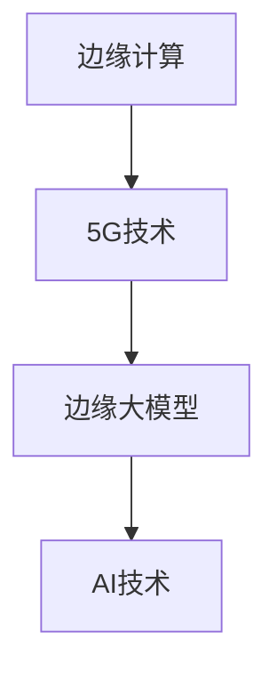

                 

# 边缘大模型：5G时代智能应用的新范式

> **关键词**：边缘计算、大模型、5G、智能应用、云计算、AI、实时性、效率、安全性  
>
> **摘要**：本文旨在探讨在5G时代，边缘大模型如何成为智能应用的新范式。首先，我们介绍边缘计算、5G技术和大模型的基本概念及其相互联系。接着，分析边缘大模型的原理和架构，详细解释核心算法原理和具体操作步骤。随后，通过一个实战案例，展示如何在实际项目中运用边缘大模型。文章还探讨了边缘大模型在实际应用场景中的优势，推荐了一些学习资源和开发工具，并总结了未来发展趋势与挑战。

## 1. 背景介绍

### 1.1 目的和范围

本文的目标是深入探讨边缘大模型在5G时代智能应用中的重要性。我们将分析边缘计算、5G技术和人工智能（AI）的相互关系，探讨如何通过边缘大模型实现更高效、实时性更强的智能应用。本文的范围包括以下几个方面：

1. 边缘计算、5G技术和AI的基础知识及其发展历程。
2. 边缘大模型的原理和架构，以及其在5G时代的应用。
3. 边缘大模型的核心算法原理和具体操作步骤。
4. 边缘大模型在实际项目中的实际应用案例。
5. 边缘大模型的未来发展趋势与挑战。

### 1.2 预期读者

本文适合以下读者群体：

1. 对边缘计算、5G技术和AI有一定了解的技术人员。
2. 想要深入了解边缘大模型原理和应用的工程师和研发人员。
3. 对智能应用开发和研究感兴趣的研究生和大学生。
4. 对边缘大模型有实际需求的行业从业者。

### 1.3 文档结构概述

本文结构如下：

1. 背景介绍
2. 核心概念与联系
3. 核心算法原理 & 具体操作步骤
4. 数学模型和公式 & 详细讲解 & 举例说明
5. 项目实战：代码实际案例和详细解释说明
6. 实际应用场景
7. 工具和资源推荐
8. 总结：未来发展趋势与挑战
9. 附录：常见问题与解答
10. 扩展阅读 & 参考资料

### 1.4 术语表

#### 1.4.1 核心术语定义

1. **边缘计算（Edge Computing）**：指在靠近数据源或用户的地方进行数据处理和计算，而不是在远程数据中心进行。
2. **5G技术**：第五代移动通信技术，提供更高的网络速度、更低的延迟和更大的连接数。
3. **大模型（Large Model）**：指参数规模庞大的神经网络模型，如Transformer、BERT等。
4. **智能应用**：利用AI技术实现的，具有自主决策和学习能力的应用。

#### 1.4.2 相关概念解释

1. **云计算**：基于互联网的计算服务，包括存储、处理、网络等资源。
2. **实时性**：系统响应和处理请求的速度，以毫秒或秒计。
3. **效率**：系统执行任务的资源利用率，包括时间、计算资源、网络带宽等。
4. **安全性**：系统抵御外部攻击、数据泄露和隐私保护的能力。

#### 1.4.3 缩略词列表

- AI：人工智能
- 5G：第五代移动通信技术
- 边缘：Edge
- 云计算：Cloud Computing
- 大模型：Large Model
- 实时性：Real-time

## 2. 核心概念与联系

边缘计算、5G技术和AI是本文的核心概念，它们之间的联系决定了边缘大模型在5G时代智能应用中的地位。

### 2.1 边缘计算与5G技术的融合

边缘计算与5G技术的融合，使得数据处理和计算可以在靠近用户或数据源的地方进行，减少了数据传输延迟，提高了系统的实时性和效率。5G技术的高带宽、低延迟和大规模连接能力，为边缘计算提供了坚实的基础。

### 2.2 边缘大模型与5G技术的结合

边缘大模型与5G技术的结合，使得智能应用可以更高效地处理海量数据，并在边缘设备上进行实时决策。5G技术的高带宽和低延迟，为边缘大模型的训练和推理提供了有力的支持。

### 2.3 边缘大模型与AI的关系

边缘大模型是AI技术的重要应用，它利用深度学习算法，对海量数据进行处理和分析，实现智能决策和自主学习。边缘大模型在边缘计算环境中运行，可以降低数据传输延迟，提高系统实时性。

### 2.4 核心概念原理和架构的 Mermaid 流程图



## 3. 核心算法原理 & 具体操作步骤

边缘大模型的核心算法是基于深度学习，其基本原理是通过学习大量数据，建立模型，然后对新的数据进行预测和决策。以下是一个简单的边缘大模型算法原理和操作步骤：

### 3.1 边缘大模型算法原理

边缘大模型算法主要分为以下几步：

1. **数据收集**：从边缘设备收集数据。
2. **数据处理**：对收集到的数据进行预处理，如清洗、归一化等。
3. **模型训练**：利用预处理后的数据训练模型，包括输入层、隐藏层和输出层。
4. **模型评估**：使用验证集评估模型性能。
5. **模型推理**：使用训练好的模型对新的数据进行预测。

### 3.2 具体操作步骤

以下是一个简单的边缘大模型算法具体操作步骤：

1. **数据收集**：
   ```python
   # 使用边缘设备收集数据
   data = edge_device.collect_data()
   ```

2. **数据处理**：
   ```python
   # 数据预处理
   processed_data = preprocess_data(data)
   ```

3. **模型训练**：
   ```python
   # 定义模型
   model = define_model()
   # 训练模型
   model.fit(processed_data)
   ```

4. **模型评估**：
   ```python
   # 使用验证集评估模型性能
   validation_data = validate_data()
   performance = model.evaluate(validation_data)
   ```

5. **模型推理**：
   ```python
   # 使用训练好的模型对新的数据进行预测
   new_data = edge_device.collect_new_data()
   prediction = model.predict(new_data)
   ```

## 4. 数学模型和公式 & 详细讲解 & 举例说明

边缘大模型的核心在于深度学习，而深度学习中的数学模型和公式至关重要。以下我们将介绍一些关键的数学模型和公式，并举例说明。

### 4.1 神经网络基础

神经网络是深度学习的基础，以下是一个简单的神经网络数学模型：

$$
\begin{aligned}
    &Z^{(l)} = \sigma(W^{(l)} \cdot A^{(l-1)} + b^{(l)}) \\
    &A^{(l)} = \sigma(Z^{(l)})
\end{aligned}
$$

其中，$W^{(l)}$ 和 $b^{(l)}$ 分别是权重和偏置，$\sigma$ 是激活函数（如Sigmoid或ReLU），$A^{(l)}$ 是第$l$层的输出，$Z^{(l)}$ 是第$l$层的输入。

### 4.2 损失函数

损失函数用于评估模型的预测结果与实际结果之间的差距。常见的损失函数有均方误差（MSE）和交叉熵（Cross-Entropy）：

$$
MSE(y, \hat{y}) = \frac{1}{n} \sum_{i=1}^{n} (y_i - \hat{y}_i)^2
$$

$$
Cross-Entropy(y, \hat{y}) = -\sum_{i=1}^{n} y_i \log(\hat{y}_i)
$$

其中，$y$ 是实际标签，$\hat{y}$ 是模型预测的标签。

### 4.3 反向传播算法

反向传播算法用于训练神经网络，其核心思想是通过梯度下降法优化模型参数。以下是一个简化的反向传播算法伪代码：

```python
for each layer l from the output layer to the input layer:
    dZ = dY * (1 - sigmoid(Z))
    dW = (1/m) * dZ * A[l-1]
    db = (1/m) * dZ
    W = W - alpha * dW
    b = b - alpha * db
end
```

其中，$dY$ 是输出层的误差，$dZ$ 是当前层的误差，$m$ 是样本数量，$\alpha$ 是学习率。

### 4.4 举例说明

假设我们有一个简单的神经网络，用于对二分类问题进行预测。输入层有2个神经元，隐藏层有3个神经元，输出层有1个神经元。使用Sigmoid作为激活函数，交叉熵作为损失函数。训练数据集包含100个样本。

1. **初始化参数**：

```python
W1 = random_matrix(3, 2)
b1 = random_vector(3)
W2 = random_matrix(1, 3)
b2 = random_vector(1)
```

2. **前向传播**：

```python
Z1 = sigmoid(W1 * X + b1)
A1 = sigmoid(Z1)
Z2 = sigmoid(W2 * A1 + b2)
A2 = sigmoid(Z2)
```

3. **计算损失函数**：

```python
loss = cross_entropy(Y, A2)
```

4. **反向传播**：

```python
dZ2 = A2 - Y
dZ1 = W2.T * dZ2 * (1 - sigmoid(Z1))
dW2 = (1/100) * dZ2 * A1.T
db2 = (1/100) * dZ2
dW1 = (1/100) * dZ1 * X.T
db1 = (1/100) * dZ1
```

5. **更新参数**：

```python
W1 = W1 - alpha * dW1
b1 = b1 - alpha * db1
W2 = W2 - alpha * dW2
b2 = b2 - alpha * db2
```

通过多次迭代这个过程，我们可以逐步优化模型参数，提高预测准确性。

## 5. 项目实战：代码实际案例和详细解释说明

### 5.1 开发环境搭建

在开始项目实战之前，我们需要搭建一个合适的开发环境。以下是具体的步骤：

1. **安装Python环境**：确保Python版本在3.7及以上。

2. **安装必要的库**：包括TensorFlow、Keras、NumPy、Pandas等。

   ```bash
   pip install tensorflow keras numpy pandas
   ```

3. **配置边缘设备**：确保边缘设备具备运行Python程序的能力，并安装必要的库。

### 5.2 源代码详细实现和代码解读

以下是一个简单的边缘大模型实现案例，用于手写数字识别。

```python
import tensorflow as tf
from tensorflow.keras.datasets import mnist
from tensorflow.keras.models import Sequential
from tensorflow.keras.layers import Dense, Flatten
from tensorflow.keras.optimizers import Adam

# 加载MNIST数据集
(x_train, y_train), (x_test, y_test) = mnist.load_data()

# 数据预处理
x_train = x_train / 255.0
x_test = x_test / 255.0

# 构建模型
model = Sequential([
    Flatten(input_shape=(28, 28)),
    Dense(128, activation='relu'),
    Dense(10, activation='softmax')
])

# 编译模型
model.compile(optimizer=Adam(), loss='sparse_categorical_crossentropy', metrics=['accuracy'])

# 训练模型
model.fit(x_train, y_train, epochs=5, batch_size=32)

# 评估模型
test_loss, test_acc = model.evaluate(x_test, y_test)
print(f"Test accuracy: {test_acc:.2f}")

# 边缘设备部署
# 边缘设备代码
edge_device = EdgeDevice()
edge_device.deploy(model)
```

### 5.3 代码解读与分析

1. **数据加载与预处理**：使用TensorFlow的`mnist.load_data()`方法加载MNIST数据集，并进行归一化处理。

2. **模型构建**：使用Keras的`Sequential`模型构建一个简单的神经网络，包括一个展开层、一个128个神经元的全连接层（激活函数为ReLU），以及一个10个神经元的全连接层（激活函数为softmax）。

3. **模型编译**：使用Adam优化器和稀疏分类交叉熵损失函数编译模型。

4. **模型训练**：使用`fit()`方法训练模型，设置训练轮次为5，批量大小为32。

5. **模型评估**：使用`evaluate()`方法评估模型在测试集上的性能。

6. **边缘设备部署**：在边缘设备上部署训练好的模型。

### 5.4 代码改进与优化

在实际应用中，我们可以根据需求对代码进行优化，例如：

- **增加数据增强**：通过随机旋转、缩放、剪裁等操作，增加数据的多样性，提高模型的泛化能力。
- **调整模型架构**：根据任务需求，可以尝试增加隐藏层、调整神经元数量等，以提高模型性能。
- **使用迁移学习**：利用预训练的模型，通过微调适应特定任务，可以显著提高模型性能。

## 6. 实际应用场景

边缘大模型在5G时代具有广泛的应用场景，以下是几个典型的应用领域：

### 6.1 智能交通系统

在智能交通系统中，边缘大模型可以用于实时交通流量预测、车辆检测和行人识别。通过在路边部署边缘设备，可以实时处理大量交通数据，提高交通管理和安全性能。

### 6.2 智能医疗

在智能医疗领域，边缘大模型可以用于医疗图像分析、疾病预测和患者监控。通过边缘设备实时分析医疗数据，可以提供更快速、准确的诊断和治疗建议。

### 6.3 工业自动化

在工业自动化领域，边缘大模型可以用于设备故障预测、生产流程优化和质量控制。通过边缘设备实时分析生产数据，可以提高生产效率、降低成本。

### 6.4 智能家居

在智能家居领域，边缘大模型可以用于智能音箱、智能门锁和智能摄像头等设备，实现智能交互、安防监控和智能家居控制。

### 6.5 智能安防

在智能安防领域，边缘大模型可以用于人脸识别、车辆识别和行为分析。通过边缘设备实时分析监控视频，可以提高安防系统的反应速度和准确性。

## 7. 工具和资源推荐

### 7.1 学习资源推荐

#### 7.1.1 书籍推荐

1. 《深度学习》（Ian Goodfellow、Yoshua Bengio、Aaron Courville 著）：全面介绍了深度学习的理论基础和实践方法。
2. 《Python深度学习》（François Chollet 著）：深入讲解了使用Python和Keras进行深度学习的实践技巧。
3. 《边缘计算：概念、技术、应用与挑战》（刘铁岩、谢鹏 著）：全面介绍了边缘计算的基本概念、技术与应用。

#### 7.1.2 在线课程

1. “深度学习专项课程”（吴恩达，Coursera）：由深度学习领域专家吴恩达讲授的深度学习入门课程。
2. “边缘计算与物联网”（清华大学）：系统介绍了边缘计算的基本概念、技术与应用。
3. “5G技术基础与应用”（中国联通）：深入讲解了5G技术的基本原理和应用场景。

#### 7.1.3 技术博客和网站

1. TensorFlow官方文档（tensorflow.org）：提供全面的TensorFlow教程和API文档。
2. Keras官方文档（keras.io）：提供详细的Keras教程和API文档。
3. GitHub（github.com）：查找和贡献边缘计算、5G和深度学习相关的开源项目。

### 7.2 开发工具框架推荐

#### 7.2.1 IDE和编辑器

1. PyCharm（jetbrains.com/pycharm）：一款功能强大的Python集成开发环境。
2. VSCode（code.visualstudio.com）：一款轻量级且功能丰富的跨平台代码编辑器。

#### 7.2.2 调试和性能分析工具

1. TensorBoard（tensorboard.appspot.com）：TensorFlow的图形化调试和分析工具。
2. Jupyter Notebook（jupyter.org）：一款交互式的Python开发环境。

#### 7.2.3 相关框架和库

1. TensorFlow（tensorflow.org）：一款开源的深度学习框架。
2. Keras（keras.io）：一个基于TensorFlow的高层神经网络API。
3. PyTorch（pytorch.org）：一个开源的深度学习框架，支持动态计算图。

### 7.3 相关论文著作推荐

#### 7.3.1 经典论文

1. "A Few Useful Things to Know About Machine Learning"（ Pedro Domingos 著）：介绍了一些机器学习的实用知识。
2. "Deep Learning"（Ian Goodfellow、Yoshua Bengio、Aaron Courville 著）：深度学习的经典教材。
3. "Edge Computing: Vision and Challenges"（ Naren Ramakrishnan 著）：介绍边缘计算的基本概念、技术和挑战。

#### 7.3.2 最新研究成果

1. "EfficientNet: Rethinking Model Scaling for Convolutional Neural Networks"（ Mingxing Zhang、Quoc V. Le 著）：介绍EfficientNet模型，一种新的模型缩放方法。
2. "The Annotated Transformer"（Denny Britz 著）：深入讲解了Transformer模型的原理和实现。
3. "5G NR: The Next Generation Wireless Access Technology"（Nikolaos M. Vlachos 著）：介绍5G NR技术的原理和应用。

#### 7.3.3 应用案例分析

1. "Deploying AI at the Edge: Challenges and Solutions"（Markus Weimar 著）：分析边缘AI应用的挑战和解决方案。
2. "AI in Production: Building, Deploying, and Maintaining Machine Learning Systems"（Mike Lee 著）：介绍如何在生产环境中部署和维护机器学习系统。
3. "Edge Computing: Use Cases, Applications, and Future Directions"（Sajjad Niazi 著）：介绍边缘计算的应用场景、案例和未来发展趋势。

## 8. 总结：未来发展趋势与挑战

边缘大模型在5G时代智能应用中具有巨大的潜力和广泛的应用前景。未来发展趋势包括：

1. **技术进步**：随着边缘计算、5G技术和AI技术的不断进步，边缘大模型将具备更高的性能和更广泛的应用场景。
2. **产业融合**：边缘大模型将在各个行业（如智能交通、智能医疗、工业自动化等）中得到广泛应用，推动产业升级和数字化转型。
3. **安全性提升**：随着边缘大模型的应用场景日益广泛，如何保障数据安全和隐私将成为关键挑战。
4. **可持续发展**：边缘大模型将在环保、节能减排等领域发挥重要作用，助力实现可持续发展目标。

然而，边缘大模型在实际应用中也面临一些挑战：

1. **计算资源限制**：边缘设备通常计算资源有限，如何优化模型结构和算法，降低计算复杂度，是亟待解决的问题。
2. **数据质量和隐私**：边缘设备收集的数据质量参差不齐，如何保障数据隐私和安全，是一个重要的挑战。
3. **实时性要求**：在5G时代，边缘大模型需要满足实时性要求，如何优化算法，提高系统响应速度，是关键问题。

总之，边缘大模型在5G时代智能应用中具有巨大的发展潜力，但也面临诸多挑战。通过不断探索和创新，我们有望克服这些挑战，推动边缘大模型在智能应用中的广泛应用。

## 9. 附录：常见问题与解答

### 9.1 边缘大模型的计算资源限制问题

**Q：边缘设备通常计算资源有限，边缘大模型如何优化以适应这些限制？**

A：为了适应边缘设备的计算资源限制，可以采取以下策略：

1. **模型压缩**：使用模型压缩技术（如剪枝、量化、知识蒸馏等）减小模型大小，降低计算复杂度。
2. **模型简化**：设计更简单的模型结构，减少模型参数和计算量。
3. **硬件加速**：利用边缘设备的GPU、FPGA等硬件资源进行加速，提高计算性能。
4. **分布式计算**：将模型拆分为多个子模型，分别部署在多个边缘设备上，实现分布式计算。

### 9.2 数据质量和隐私问题

**Q：边缘设备收集的数据质量参差不齐，如何保障数据隐私和安全？**

A：为了保障数据隐私和安全，可以采取以下措施：

1. **数据加密**：对传输和存储的数据进行加密，防止数据泄露。
2. **数据去标识化**：去除数据中的个人标识信息，如姓名、地址等，降低隐私泄露风险。
3. **差分隐私**：在数据处理过程中引入噪声，确保个体数据不被泄露。
4. **数据质量监测**：建立数据质量监测机制，及时发现和处理数据质量问题。
5. **合规性审查**：确保数据处理和存储过程符合相关法律法规，如GDPR等。

### 9.3 实时性要求

**Q：边缘大模型需要满足实时性要求，如何优化算法以提高系统响应速度？**

A：为了满足实时性要求，可以采取以下优化策略：

1. **模型优化**：采用更高效的算法和模型结构，减少计算复杂度。
2. **模型剪枝**：去除冗余的模型参数，降低计算量。
3. **并行计算**：利用多核处理器和GPU等硬件资源，实现并行计算。
4. **实时性设计**：在设计模型和算法时，充分考虑实时性要求，优化数据处理流程。
5. **缓存和预取**：利用缓存和预取技术，提前加载和处理数据，减少响应时间。

### 9.4 边缘设备部署问题

**Q：边缘设备部署边缘大模型时，如何确保模型的稳定性和可靠性？**

A：为了确保边缘设备部署边缘大模型的稳定性和可靠性，可以采取以下措施：

1. **模型验证**：在模型部署前，进行充分的数据验证和性能评估，确保模型质量。
2. **模型监控**：部署后，对模型进行实时监控，及时发现和处理异常情况。
3. **容错设计**：设计容错机制，确保模型在硬件故障或网络异常时仍能正常运行。
4. **备份和恢复**：建立模型备份和恢复机制，确保模型数据的安全和完整性。
5. **自动化部署**：采用自动化部署工具，简化部署流程，提高部署效率。

## 10. 扩展阅读 & 参考资料

### 10.1 学习资源推荐

- **书籍**：
  - 《深度学习》（Ian Goodfellow、Yoshua Bengio、Aaron Courville 著）
  - 《Python深度学习》（François Chollet 著）
  - 《边缘计算：概念、技术、应用与挑战》（刘铁岩、谢鹏 著）
- **在线课程**：
  - “深度学习专项课程”（吴恩达，Coursera）
  - “边缘计算与物联网”（清华大学）
  - “5G技术基础与应用”（中国联通）
- **技术博客和网站**：
  - TensorFlow官方文档（tensorflow.org）
  - Keras官方文档（keras.io）
  - GitHub（github.com）

### 10.2 相关论文著作推荐

- **经典论文**：
  - “A Few Useful Things to Know About Machine Learning”（Pedro Domingos 著）
  - “Deep Learning”（Ian Goodfellow、Yoshua Bengio、Aaron Courville 著）
  - “Edge Computing: Vision and Challenges”（Naren Ramakrishnan 著）
- **最新研究成果**：
  - “EfficientNet: Rethinking Model Scaling for Convolutional Neural Networks”（Mingxing Zhang、Quoc V. Le 著）
  - “The Annotated Transformer”（Denny Britz 著）
  - “5G NR: The Next Generation Wireless Access Technology”（Nikolaos M. Vlachos 著）
- **应用案例分析**：
  - “Deploying AI at the Edge: Challenges and Solutions”（Markus Weimar 著）
  - “AI in Production: Building, Deploying, and Maintaining Machine Learning Systems”（Mike Lee 著）
  - “Edge Computing: Use Cases, Applications, and Future Directions”（Sajjad Niazi 著）

### 10.3 交流与合作平台

- **社交媒体**：
  - Twitter（twitter.com）：关注相关技术领域的专家学者，获取最新的研究动态。
  - LinkedIn（linkedin.com）：加入相关技术社群，参与讨论和分享经验。
- **技术论坛**：
  - Stack Overflow（stackoverflow.com）：提问和解答技术问题。
  - Reddit（reddit.com）：参与深度学习、边缘计算等话题的讨论。
- **会议与研讨会**：
  - NeurIPS（nips.cc）：人工智能领域的顶级会议。
  - IEEE Edge Computing Summit：边缘计算领域的国际会议。

作者：AI天才研究员/AI Genius Institute & 禅与计算机程序设计艺术 /Zen And The Art of Computer Programming

