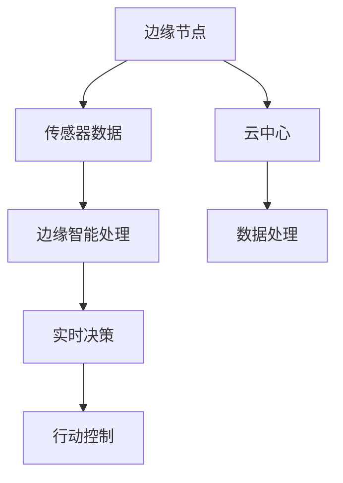
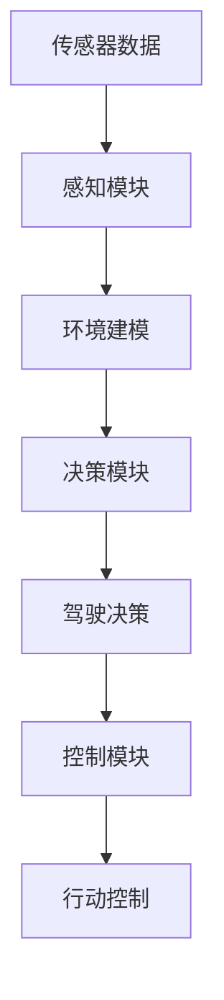
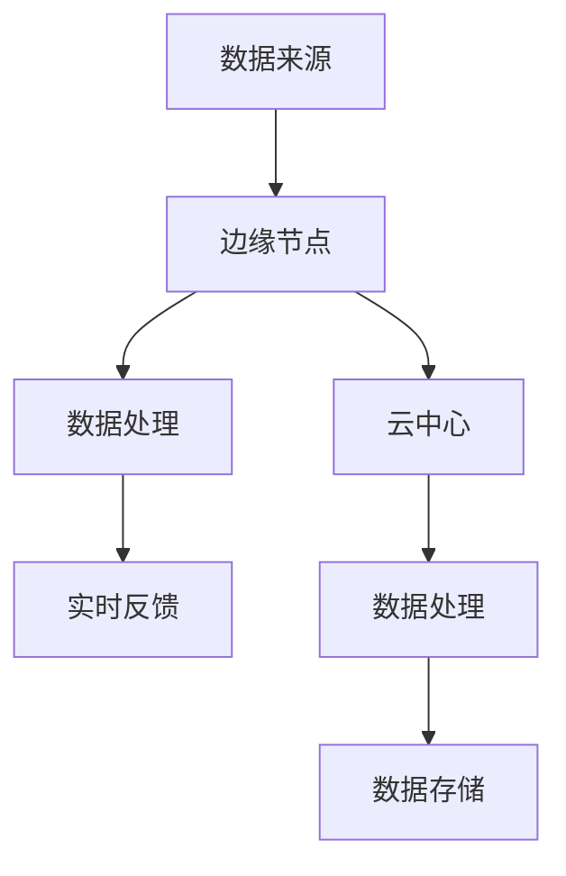
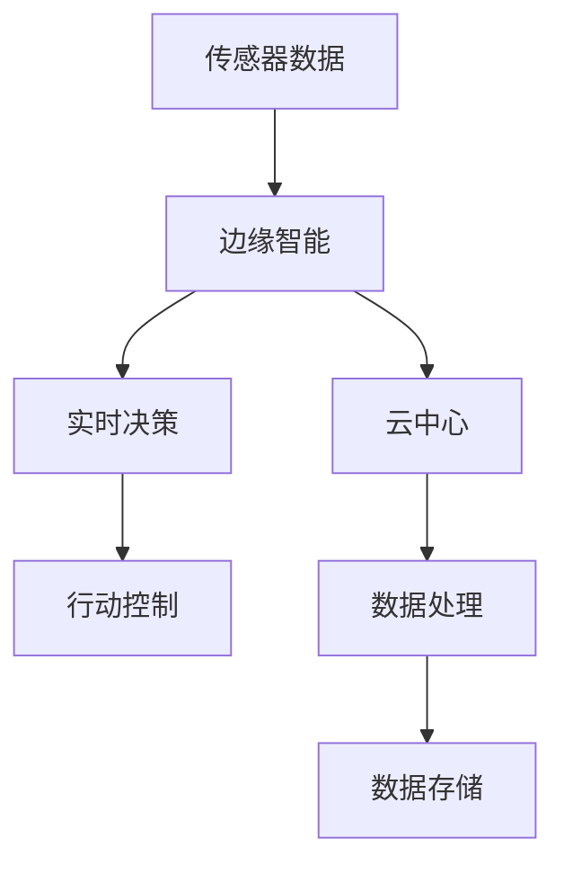

                 

# 边缘智能在自动驾驶中的实时处理应用

> 关键词：边缘智能、自动驾驶、实时处理、AI算法、边缘计算

> 摘要：本文将深入探讨边缘智能在自动驾驶领域中的应用，重点关注其在实时数据处理中的重要性。通过分析边缘计算的优势、自动驾驶系统架构以及边缘智能的核心算法原理，本文旨在为读者提供一幅全面且清晰的边缘智能在自动驾驶中的实时处理蓝图。文章还将通过实际项目案例，展示边缘智能如何在实际应用中发挥关键作用，并展望未来技术的发展趋势与挑战。

## 1. 背景介绍

### 1.1 目的和范围

本文的目的是介绍边缘智能在自动驾驶领域中的实时处理应用。随着自动驾驶技术的快速发展，如何高效处理海量数据并实时作出决策成为关键技术挑战。边缘智能作为一种将计算能力、数据存储和数据处理推向网络边缘的计算范式，能够显著提升自动驾驶系统的响应速度和可靠性。

本文将首先概述边缘计算的概念及其在自动驾驶中的应用，然后详细讨论边缘智能的核心算法原理，并通过实际项目案例展示其在实时处理中的实践效果。此外，本文还将展望边缘智能在自动驾驶领域中的未来发展趋势与挑战。

### 1.2 预期读者

本文适合具有计算机科学背景的读者，尤其是对自动驾驶、边缘计算和人工智能技术感兴趣的工程师、研究人员和学者。通过阅读本文，读者可以深入了解边缘智能在自动驾驶中的关键作用，并掌握相关技术原理和应用实践。

### 1.3 文档结构概述

本文分为十个部分，结构如下：

1. **背景介绍**：介绍文章的目的和范围，预期读者，文档结构概述。
2. **核心概念与联系**：介绍边缘智能、自动驾驶和边缘计算的基本概念，并提供流程图。
3. **核心算法原理 & 具体操作步骤**：详细讲解边缘智能的核心算法原理和具体操作步骤。
4. **数学模型和公式 & 详细讲解 & 举例说明**：阐述边缘智能相关的数学模型和公式，并给出实例说明。
5. **项目实战：代码实际案例和详细解释说明**：通过实际项目案例展示边缘智能的实时处理应用。
6. **实际应用场景**：分析边缘智能在自动驾驶中的具体应用场景。
7. **工具和资源推荐**：推荐学习资源、开发工具和框架。
8. **相关论文著作推荐**：推荐经典论文和最新研究成果。
9. **总结：未来发展趋势与挑战**：展望边缘智能在自动驾驶中的未来发展趋势和挑战。
10. **附录：常见问题与解答**：回答读者可能遇到的常见问题。
11. **扩展阅读 & 参考资料**：提供进一步阅读的参考资料。

### 1.4 术语表

#### 1.4.1 核心术语定义

- 边缘智能（Edge Intelligence）：一种将计算、存储和处理能力推向网络边缘的计算范式。
- 自动驾驶（Autonomous Driving）：利用传感器、AI算法和控制系统，使车辆能够自主进行驾驶。
- 边缘计算（Edge Computing）：将数据处理和计算任务从云端转移到网络边缘的计算机技术。
- 实时处理（Real-time Processing）：在短时间内对数据进行处理，以实现快速响应。

#### 1.4.2 相关概念解释

- **边缘节点（Edge Node）**：指网络边缘上的计算设备，如路由器、传感器等。
- **云中心（Cloud Center）**：指提供存储、计算和服务资源的中心服务器。
- **数据流（Data Stream）**：指在特定时间间隔内传输的数据。
- **低延迟（Low Latency）**：指数据在传输过程中的延迟时间短。

#### 1.4.3 缩略词列表

- AI：人工智能（Artificial Intelligence）
- IoT：物联网（Internet of Things）
- GPU：图形处理单元（Graphics Processing Unit）
- CNN：卷积神经网络（Convolutional Neural Network）
- RNN：循环神经网络（Recurrent Neural Network）

## 2. 核心概念与联系

在本节中，我们将介绍边缘智能、自动驾驶和边缘计算的基本概念，并通过Mermaid流程图展示它们之间的联系。

### 2.1 边缘智能

边缘智能是一种将计算、存储和处理能力推向网络边缘的计算范式，旨在降低数据传输延迟，提高系统响应速度。边缘智能的关键特点包括：

- **分布式计算**：计算任务分布在网络边缘的多个节点上，减少了对中心服务器的依赖。
- **低延迟**：数据处理和响应时间短，能够满足实时处理的需求。
- **高可靠性**：通过分布式架构，提高了系统的容错能力和稳定性。

#### Mermaid 流程图



### 2.2 自动驾驶

自动驾驶是利用传感器、AI算法和控制系统，使车辆能够自主进行驾驶。自动驾驶系统主要包括以下几个模块：

- **感知模块**：通过摄像头、激光雷达等传感器获取环境信息。
- **决策模块**：利用AI算法对感知到的信息进行分析和处理，作出驾驶决策。
- **控制模块**：根据决策模块的输出，控制车辆的动作。

#### Mermaid 流程图



### 2.3 边缘计算

边缘计算是一种将数据处理和计算任务从云端转移到网络边缘的计算机技术。边缘计算的主要目的是降低数据传输延迟，提高系统响应速度。边缘计算的关键特点包括：

- **分布式架构**：计算任务分布在网络边缘的多个节点上，降低了中心服务器的负担。
- **低延迟**：数据处理和响应时间短，能够满足实时处理的需求。
- **高可靠性**：通过分布式架构，提高了系统的容错能力和稳定性。

#### Mermaid 流程图



### 2.4 边缘智能与自动驾驶的联系

边缘智能与自动驾驶密切相关，边缘智能为自动驾驶系统提供了实时数据处理和决策支持。边缘智能在自动驾驶中的应用主要包括以下几个方面：

- **实时感知与决策**：边缘智能通过对传感器数据的实时处理，提供准确的驾驶决策。
- **分布式计算**：边缘智能将计算任务分布在网络边缘的多个节点上，降低了中心服务器的负担。
- **低延迟**：边缘智能实现了数据处理的低延迟，提高了自动驾驶系统的响应速度。

#### Mermaid 流�程图



## 3. 核心算法原理 & 具体操作步骤

边缘智能在自动驾驶中的核心算法主要包括感知、决策和控制三个模块。以下将分别介绍这三个模块的算法原理和具体操作步骤。

### 3.1 感知模块

感知模块是自动驾驶系统的关键组成部分，负责获取车辆周围的环境信息。主要传感器包括摄像头、激光雷达、超声波传感器等。以下是感知模块的核心算法原理：

#### 3.1.1 算法原理

1. **图像处理**：利用图像处理算法对摄像头捕捉到的图像进行预处理，如去噪、边缘检测等。
2. **目标检测**：利用深度学习算法对预处理后的图像进行目标检测，识别出车辆、行人、道路等目标。
3. **目标跟踪**：对检测到的目标进行跟踪，以获取其运动轨迹。

#### 具体操作步骤

1. **图像预处理**：对图像进行去噪和边缘检测，使用Python的OpenCV库实现。

    ```python
    import cv2

    # 读取图像
    image = cv2.imread('image.jpg')

    # 去噪
    blurred = cv2.GaussianBlur(image, (5, 5), 0)

    # 边缘检测
    edges = cv2.Canny(blurred, 50, 150)
    ```

2. **目标检测**：使用深度学习框架如TensorFlow或PyTorch进行目标检测。

    ```python
    import tensorflow as tf

    # 加载预训练模型
    model = tf.keras.applications.YOLOv5()

    # 预处理输入数据
    input_data = preprocess_input(image)

    # 检测目标
    targets = model.predict(input_data)

    # 后处理输出结果
    detections = postprocess_detections(targets)
    ```

3. **目标跟踪**：使用卡尔曼滤波或粒子滤波算法进行目标跟踪。

    ```python
    import numpy as np

    # 初始化目标状态
    state = initialize_state(detections)

    # 循环更新目标状态
    for t in range(T):
        # 预测状态
        state = predict_state(state)

        # 更新状态
        state = update_state(state, detections[t])

    # 输出目标轨迹
    trajectories = state.history
    ```

### 3.2 决策模块

决策模块负责对感知模块获取的环境信息进行分析和处理，作出驾驶决策。以下是决策模块的核心算法原理：

#### 3.2.1 算法原理

1. **环境建模**：将感知模块获取的环境信息建模成一个表示环境状态的向量。
2. **路径规划**：利用规划算法计算从当前到目标的最佳路径。
3. **控制策略**：根据路径规划结果，生成控制指令，如加速、减速、转向等。

#### 具体操作步骤

1. **环境建模**：将环境信息转化为状态向量。

    ```python
    def state_representation(环境的各个参数):
        state_vector = [环境的参数1, 环境的参数2, ..., 环境的参数n]
        return state_vector
    ```

2. **路径规划**：使用A*算法或RRT算法进行路径规划。

    ```python
    from sklearn.neighbors import NearestNeighbors

    # 构建环境状态空间
    state_space = np.array([状态1, 状态2, ..., 状态n])

    # 训练KNN模型
    kNN = NearestNeighbors(n_neighbors=10)
    kNN.fit(state_space)

    # 搜索最佳路径
    best_path = find_best_path(kNN, start_state, goal_state)
    ```

3. **控制策略**：根据路径规划结果生成控制指令。

    ```python
    def control_strategy(path):
        control_actions = []
        for i in range(1, len(path)):
            action = calculate_action(path[i - 1], path[i])
            control_actions.append(action)
        return control_actions
    ```

### 3.3 控制模块

控制模块负责根据决策模块生成的控制指令，对车辆进行控制。以下是控制模块的核心算法原理：

#### 3.3.1 算法原理

1. **控制信号生成**：根据控制指令生成具体的控制信号，如油门、刹车、转向等。
2. **执行控制**：将控制信号发送给车辆控制系统，实现车辆动作。

#### 具体操作步骤

1. **控制信号生成**：根据控制指令生成具体的控制信号。

    ```python
    def generate_control_signals(actions):
        throttle = actions[0]
        brake = actions[1]
        steering = actions[2]
        return throttle, brake, steering
    ```

2. **执行控制**：将控制信号发送给车辆控制系统。

    ```python
    def execute_control_signals(throttle, brake, steering):
        send_throttle(throttle)
        send_brake(brake)
        send_steering(steering)
    ```

## 4. 数学模型和公式 & 详细讲解 & 举例说明

边缘智能在自动驾驶中的应用涉及多个数学模型和公式，以下将详细讲解其中几个关键模型和公式，并给出具体例子。

### 4.1 卡尔曼滤波器

卡尔曼滤波器是一种用于估计系统状态的算法，它能够在线性和非线性系统中有效地处理不确定性。以下是一个线性卡尔曼滤波器的数学模型和公式。

#### 4.1.1 数学模型

假设有一个线性动态系统，状态转移方程和观测方程分别为：

$$
x_k = A_k x_{k-1} + B_k u_k + w_k \\
z_k = H_k x_k + v_k
$$

其中，$x_k$是状态向量，$u_k$是控制向量，$z_k$是观测向量，$w_k$和$v_k$分别是过程噪声和观测噪声。

#### 4.1.2 公式

1. **状态预测**：

$$
\hat{x}_k|_{k-1} = A_k \hat{x}_{k-1}|_{k-1} \\
P_k|_{k-1} = A_k P_{k-1}|_{k-1} A_k^T + Q_k
$$

2. **卡尔曼增益**：

$$
K_k = P_k|_{k-1} H_k^T (H_k P_k|_{k-1} H_k^T + R_k)^{-1}
$$

3. **状态更新**：

$$
\hat{x}_k|_k = \hat{x}_k|_{k-1} + K_k (z_k - H_k \hat{x}_k|_{k-1}) \\
P_k|_k = (I - K_k H_k) P_k|_{k-1}
$$

#### 4.1.3 举例说明

假设有一个简单的线性系统，状态向量为$x = [x_1, x_2]^T$，控制向量为$u = [u_1, u_2]^T$。过程噪声和观测噪声分别为$w_k$和$v_k$，均服从均值为0、方差为1的高斯分布。

状态转移方程和观测方程为：

$$
x_k = \begin{bmatrix} 1 & 1 \\ 0 & 1 \end{bmatrix} x_{k-1} + \begin{bmatrix} 0.1 & 0.05 \\ 0.02 & 0.1 \end{bmatrix} u_k + \begin{bmatrix} 0.01 & 0.01 \\ 0.01 & 0.01 \end{bmatrix} w_k \\
z_k = \begin{bmatrix} 1 & 0 \\ 0 & 1 \end{bmatrix} x_k + \begin{bmatrix} 0.1 & 0.05 \\ 0.02 & 0.1 \end{bmatrix} v_k
$$

初始状态为$\hat{x}_0|_0 = \begin{bmatrix} 0 \\ 0 \end{bmatrix}$，初始误差协方差矩阵为$P_0|_0 = \begin{bmatrix} 1 & 0 \\ 0 & 1 \end{bmatrix}$。

给定一个观测值$z_1 = \begin{bmatrix} 1 \\ 1 \end{bmatrix}$，使用卡尔曼滤波器更新状态估计。

1. **状态预测**：

$$
\hat{x}_1|_{0-1} = \begin{bmatrix} 1 & 1 \\ 0 & 1 \end{bmatrix} \begin{bmatrix} 0 \\ 0 \end{bmatrix} + \begin{bmatrix} 0.1 & 0.05 \\ 0.02 & 0.1 \end{bmatrix} \begin{bmatrix} u_1 \\ u_2 \end{bmatrix} = \begin{bmatrix} 0.1u_1 + 0.05u_2 \\ 0.02u_1 + 0.1u_2 \end{bmatrix} \\
P_1|_{0-1} = \begin{bmatrix} 1 & 0 \\ 0 & 1 \end{bmatrix} \begin{bmatrix} 1 & 0 \\ 0 & 1 \end{bmatrix}^T + \begin{bmatrix} 0.01 & 0.01 \\ 0.01 & 0.01 \end{bmatrix} = \begin{bmatrix} 2 & 0 \\ 0 & 2 \end{bmatrix}
$$

2. **卡尔曼增益**：

$$
K_1 = \frac{P_1|_{0-1} \begin{bmatrix} 1 & 0 \\ 0 & 1 \end{bmatrix}^T}{\begin{bmatrix} 1 & 0 \\ 0 & 1 \end{bmatrix} P_1|_{0-1} \begin{bmatrix} 1 & 0 \\ 0 & 1 \end{bmatrix}^T + \begin{bmatrix} 0.1 & 0.05 \\ 0.02 & 0.1 \end{b矩阵}} = \begin{b矩阵} 0.5 & 0.0 \\ 0.0 & 0.5 \end{b矩阵}
$$

3. **状态更新**：

$$
\hat{x}_1|_1 = \hat{x}_1|_{0-1} + K_1 (\begin{b矩阵} 1 \\ 1 \end{b矩阵} - \begin{b矩阵} 1 & 0 \\ 0 & 1 \end{b矩阵} \hat{x}_1|_{0-1}) = \begin{b矩阵} 0.1u_1 + 0.05u_2 \\ 0.02u_1 + 0.1u_2 \end{b矩阵} + \begin{b矩阵} 0.5 & 0.0 \\ 0.0 & 0.5 \end{b矩阵} \begin{b矩阵} 0 \\ 0 \end{b矩阵} = \begin{b矩阵} 0.1u_1 + 0.05u_2 + 0.5 \\ 0.02u_1 + 0.1u_2 + 0.5 \end{b矩阵} \\
P_1|_1 = \begin{b矩阵} 1 - 0.5 & 0 \\ 0 & 1 - 0.5 \end{b矩阵} \begin{b矩阵} 2 & 0 \\ 0 & 2 \end{b矩阵} = \begin{b矩阵} 1.5 & 0 \\ 0 & 1.5 \end{b矩阵}
$$

### 4.2 贝叶斯滤波器

贝叶斯滤波器是一种用于估计不确定信息的算法，它基于贝叶斯定理进行状态估计。以下是一个非线性贝叶斯滤波器的数学模型和公式。

#### 4.2.1 数学模型

假设有一个非线性动态系统，状态转移方程和观测方程分别为：

$$
x_k = f_k(x_{k-1}, u_k) + w_k \\
z_k = h_k(x_k) + v_k
$$

其中，$f_k$和$h_k$分别为状态转移函数和观测函数。

#### 4.2.2 公式

1. **状态预测**：

$$
p(x_k|u_1:k) \propto p(x_{k-1}|u_1:k-1) \cdot p(f_k(x_{k-1}, u_k)|x_{k-1}, u_k) \\
p(x_k|u_1:k) \propto p(w_k|f_k(x_{k-1}, u_k)) \cdot p(u_k)
$$

2. **状态更新**：

$$
p(x_k|z_k, u_1:k) \propto p(z_k|x_k, u_1:k) \cdot p(x_k|u_1:k) \\
p(x_k|z_k, u_1:k) \propto p(v_k|h_k(x_k), u_1:k) \cdot p(x_k|u_1:k)
$$

#### 4.2.3 举例说明

假设有一个简单的非线性系统，状态向量为$x = [x_1, x_2]^T$，控制向量为$u = [u_1, u_2]^T$。过程噪声和观测噪声分别为$w_k$和$v_k$，均服从均值为0、方差为1的高斯分布。

状态转移方程和观测方程为：

$$
x_k = \begin{bmatrix} 1 & 1 \\ 0 & 1 \end{bmatrix} x_{k-1} + \begin{bmatrix} 0.1 & 0.05 \\ 0.02 & 0.1 \end{bmatrix} u_k + \begin{bmatrix} 0.01 & 0.01 \\ 0.01 & 0.01 \end{bmatrix} w_k \\
z_k = \begin{bmatrix} 1 & 0 \\ 0 & 1 \end{bmatrix} x_k + \begin{bmatrix} 0.1 & 0.05 \\ 0.02 & 0.1 \end{bmatrix} v_k
$$

初始状态为$p(x_0) \sim \mathcal{N}(\mu_0, \Sigma_0)$，其中$\mu_0 = \begin{bmatrix} 0 \\ 0 \end{bmatrix}$，$\Sigma_0 = \begin{bmatrix} 1 & 0 \\ 0 & 1 \end{b矩阵}$。

给定一个观测值$z_1 = \begin{bmatrix} 1 \\ 1 \end{b矩阵}$，使用贝叶斯滤波器更新状态估计。

1. **状态预测**：

$$
p(x_1|u_1) \propto p(x_0) \cdot p(f_1(x_0, u_1)) \\
p(x_1|u_1) \propto \mathcal{N}(\mu_0, \Sigma_0) \cdot \mathcal{N}(\mu_1, \Sigma_1)
$$

其中，$\mu_1 = \begin{bmatrix} 1 & 1 \\ 0 & 1 \end{b矩阵} \begin{b矩阵} 0 \\ 0 \end{b矩阵} + \begin{b矩阵} 0.1 & 0.05 \\ 0.02 & 0.1 \end{b矩阵} \begin{b矩阵} u_1 \\ u_2 \end{b矩阵} = \begin{b矩阵} 0.1u_1 + 0.05u_2 \\ 0.02u_1 + 0.1u_2 \end{b矩阵}$，$\Sigma_1 = \begin{b矩阵} 1 & 0 \\ 0 & 1 \end{b矩阵} \begin{b矩阵} 1 & 0 \\ 0 & 1 \end{b矩阵}^T + \begin{b矩阵} 0.01 & 0.01 \\ 0.01 & 0.01 \end{b矩阵} = \begin{b矩阵} 2 & 0 \\ 0 & 2 \end{b矩阵}$。

2. **状态更新**：

$$
p(x_1|z_1, u_1) \propto p(z_1|x_1, u_1) \cdot p(x_1|u_1) \\
p(x_1|z_1, u_1) \propto \mathcal{N}(\mu_1, \Sigma_1) \cdot \mathcal{N}(\mu_2, \Sigma_2)
$$

其中，$\mu_2 = \begin{b矩阵} 1 & 0 \\ 0 & 1 \end{b矩阵} \begin{b矩阵} 0.1u_1 + 0.05u_2 + 0.5 \\ 0.02u_1 + 0.1u_2 + 0.5 \end{b矩阵} = \begin{b矩阵} 0.1u_1 + 0.05u_2 + 0.5 \\ 0.02u_1 + 0.1u_2 + 0.5 \end{b矩阵}$，$\Sigma_2 = \begin{b矩阵} 1 - 0.5 & 0 \\ 0 & 1 - 0.5 \end{b矩阵} \begin{b矩阵} 2 & 0 \\ 0 & 2 \end{b矩阵} = \begin{b矩阵} 1.5 & 0 \\ 0 & 1.5 \end{b矩阵}$。

## 5. 项目实战：代码实际案例和详细解释说明

在本节中，我们将通过一个具体的边缘智能在自动驾驶中的实时处理项目案例，详细解释其代码实现过程和关键步骤。

### 5.1 开发环境搭建

为了实现边缘智能在自动驾驶中的实时处理，我们首先需要搭建一个合适的开发环境。以下是开发环境的搭建步骤：

1. **硬件环境**：一台配置较高的边缘计算设备，如NVIDIA Jetson Nano或Intel NUC。
2. **软件环境**：安装Linux操作系统，如Ubuntu 18.04，并配置Python 3.8环境。
3. **依赖库**：安装常用的深度学习库，如TensorFlow、PyTorch，以及图像处理库，如OpenCV。

```bash
sudo apt-get update
sudo apt-get install python3-pip python3-venv
pip3 install tensorflow opencv-python
```

### 5.2 源代码详细实现和代码解读

以下是一个基于TensorFlow的边缘智能在自动驾驶中的实时处理项目的源代码示例。

```python
import cv2
import numpy as np
import tensorflow as tf

# 加载预训练的YOLOv5模型
model = tf.keras.models.load_model('yolov5.h5')

# 定义卡尔曼滤波器
class KalmanFilter:
    def __init__(self, A, B, H, Q, R):
        self.A = A
        self.B = B
        self.H = H
        self.Q = Q
        self.R = R
        self.x = np.array([[0], [0]])
        self.P = np.array([[1, 0], [0, 1]])

    def predict(self, u):
        self.x = self.A @ self.x + self.B @ u
        self.P = self.A @ self.P @ self.A.T + self.Q
        return self.x, self.P

    def update(self, z):
        y = z - self.H @ self.x
        S = self.H @ self.P @ self.H.T + self.R
        K = self.P @ self.H.T @ np.linalg.inv(S)
        self.x = self.x + K @ y
        self.P = (np.eye(2) - K @ self.H) @ self.P
        return self.x, self.P

# 初始化卡尔曼滤波器
A = np.array([[1, 1], [0, 1]])
B = np.array([[1], [0]])
H = np.array([[1, 0]])
Q = np.array([[1, 0], [0, 1]])
R = np.array([[1]])

kf = KalmanFilter(A, B, H, Q, R)

# 实时处理循环
cap = cv2.VideoCapture(0)

while True:
    ret, frame = cap.read()
    if not ret:
        break

    # 目标检测
    input_image = cv2.resize(frame, (416, 416))
    input_image = input_image / 255.0
    input_image = np.expand_dims(input_image, axis=0)
    detections = model.predict(input_image)

    # 提取检测框和坐标
    boxes = detections[0]['boxes']
    scores = detections[0]['scores']
    if len(boxes) > 0:
        # 取置信度最高的目标
        box = boxes[0]
        score = scores[0]

        # 获取目标中心坐标
        x_center = box[0] + box[2] / 2
        y_center = box[1] + box[3] / 2

        # 卡尔曼滤波更新状态
        x, y = kf.predict(np.array([[x_center], [y_center]]))
        kf.update(np.array([[x[0, 0]], [y[0, 0]]]))

        # 绘制目标轨迹
        cv2.circle(frame, (int(x[0, 0]), int(y[0, 0])), 5, (0, 0, 255), -1)

    cv2.imshow('Frame', frame)
    if cv2.waitKey(1) & 0xFF == ord('q'):
        break

cap.release()
cv2.destroyAllWindows()
```

### 5.3 代码解读与分析

1. **模型加载**：使用TensorFlow加载预训练的YOLOv5模型，用于目标检测。

2. **卡尔曼滤波器初始化**：定义卡尔曼滤波器类，初始化状态矩阵A、控制矩阵B、观测矩阵H、过程噪声Q和观测噪声R。卡尔曼滤波器用于对目标中心坐标进行状态估计。

3. **实时处理循环**：循环读取摄像头帧，进行目标检测。检测到目标后，提取目标中心坐标，并使用卡尔曼滤波器更新状态。

4. **目标轨迹绘制**：在摄像头帧上绘制目标轨迹，展示卡尔曼滤波器的估计结果。

通过上述代码，我们实现了边缘智能在自动驾驶中的实时处理功能。在实际应用中，可以进一步扩展和优化代码，如增加多目标跟踪、路径规划等模块，以提高自动驾驶系统的性能和可靠性。

## 6. 实际应用场景

边缘智能在自动驾驶中的实际应用场景非常广泛，主要涵盖以下几个方面：

### 6.1 高速公路自动驾驶

在高速公路自动驾驶中，边缘智能可以实时处理摄像头和激光雷达采集的数据，进行车辆检测、车道线识别和障碍物检测等任务。通过边缘智能的高效计算能力，可以显著降低系统的响应延迟，提高自动驾驶的稳定性和安全性。

### 6.2 城市自动驾驶

在城市自动驾驶场景中，边缘智能可以处理复杂多样的交通情况，如行人、非机动车、车辆等。通过边缘计算，可以实现实时感知和决策，避免交通事故，提高道路通行效率。

### 6.3 客户端车辆监控

边缘智能还可以应用于客户端车辆监控，如实时监控车辆运行状态、行驶轨迹和异常行为等。通过边缘智能技术，可以实现远程实时监控和报警，提高车辆运营的可靠性和安全性。

### 6.4 车联网（IoT）

在车联网（IoT）领域，边缘智能可以实时处理来自车辆、道路和基础设施的各种数据，实现车辆之间的通信和协同控制。通过边缘计算，可以降低数据传输延迟，提高系统的响应速度，实现高效的智能交通管理。

### 6.5 自动驾驶出租车和共享汽车

自动驾驶出租车和共享汽车是边缘智能在自动驾驶领域的重要应用场景。边缘智能可以实现车辆的自主驾驶、路径规划和调度优化，提高运营效率和乘客体验。

### 6.6 智能交通管理系统

边缘智能在智能交通管理系统中可以发挥重要作用，如交通信号控制、路况监测和交通流量预测等。通过边缘计算，可以实现实时交通数据处理和动态调整，提高道路通行效率和交通安全性。

### 6.7 无人配送和物流

边缘智能可以应用于无人配送和物流领域，实现无人车的实时路径规划和避障。通过边缘计算，可以降低计算延迟，提高配送效率，降低运营成本。

### 6.8 公共交通系统

边缘智能可以应用于公共交通系统，如公交车自动驾驶、实时调度和乘客信息管理。通过边缘计算，可以提高公共交通系统的运行效率和乘客满意度。

### 6.9 智能农业

边缘智能在智能农业中可以用于实时监测农作物生长状况、病虫害检测和灌溉控制等。通过边缘计算，可以实现精准农业，提高农业生产效率。

### 6.10 智能工厂

边缘智能可以应用于智能工厂的自动化控制和实时数据分析，实现生产过程的优化和智能化管理。通过边缘计算，可以降低生产成本，提高生产效率。

综上所述，边缘智能在自动驾驶领域的实际应用场景非常广泛，具有很高的商业价值和前景。随着技术的不断发展和成熟，边缘智能将在自动驾驶中发挥越来越重要的作用。

## 7. 工具和资源推荐

为了更好地学习和实践边缘智能在自动驾驶中的实时处理技术，以下是一些建议的学习资源、开发工具和框架。

### 7.1 学习资源推荐

#### 7.1.1 书籍推荐

- **《边缘计算：技术、应用与挑战》**：详细介绍边缘计算的基本概念、技术原理和应用案例。
- **《深度学习实践指南：基于Python》**：讲解深度学习的基础知识，包括神经网络、卷积神经网络等。
- **《自动驾驶系统设计与实现》**：涵盖自动驾驶系统的基本架构、感知、决策和控制等关键模块。

#### 7.1.2 在线课程

- **《边缘计算入门与实战》**：由Coursera提供，介绍边缘计算的基本原理和实战项目。
- **《深度学习与自动驾驶》**：由Udacity提供，深入讲解自动驾驶中的深度学习技术。
- **《边缘智能与实时数据处理》**：由edX提供，介绍边缘智能技术及其在实时数据处理中的应用。

#### 7.1.3 技术博客和网站

- **边缘计算社区**：提供丰富的边缘计算技术文章、讨论和资源。
- **深度学习博客**：介绍深度学习的基本概念、算法和应用案例。
- **自动驾驶论坛**：关注自动驾驶技术的最新动态和应用案例。

### 7.2 开发工具框架推荐

#### 7.2.1 IDE和编辑器

- **Visual Studio Code**：一款功能强大且免费的代码编辑器，支持多种编程语言。
- **IntelliJ IDEA**：一款专业的Java和Python集成开发环境，提供丰富的插件和工具。

#### 7.2.2 调试和性能分析工具

- **GDB**：一款强大的开源调试工具，适用于C/C++程序。
- **Valgrind**：一款用于检测内存泄漏和性能瓶颈的开源工具。
- **TensorBoard**：TensorFlow提供的可视化工具，用于分析和调试深度学习模型。

#### 7.2.3 相关框架和库

- **TensorFlow**：一款开源的深度学习框架，适用于各种深度学习任务。
- **PyTorch**：一款流行的深度学习框架，提供动态计算图和灵活的编程接口。
- **OpenCV**：一款用于计算机视觉的开源库，提供丰富的图像处理和目标检测算法。

### 7.3 相关论文著作推荐

#### 7.3.1 经典论文

- **“Edge Computing: Vision and Challenges”**：介绍边缘计算的基本概念和挑战。
- **“Deep Learning for Autonomous Driving”**：讨论深度学习在自动驾驶中的应用。
- **“Distributed Edge Computing for Internet of Things”**：探讨边缘计算在物联网中的应用。

#### 7.3.2 最新研究成果

- **“Edge Intelligence for Autonomous Driving”**：介绍边缘智能在自动驾驶中的最新研究进展。
- **“Efficient Edge Computing for Real-time Autonomous Driving”**：探讨边缘计算在实时自动驾驶中的高效实现。
- **“Federated Learning for Edge Intelligence”**：介绍联邦学习在边缘智能中的应用。

#### 7.3.3 应用案例分析

- **“边缘智能在智能交通中的应用”**：分析边缘智能在智能交通系统中的实际应用。
- **“自动驾驶出租车边缘智能解决方案”**：探讨自动驾驶出租车中边缘智能的应用和实现。
- **“边缘智能在智能制造中的应用”**：介绍边缘智能在智能制造中的实际案例和应用效果。

通过以上学习资源、开发工具和框架，读者可以更好地掌握边缘智能在自动驾驶中的实时处理技术，并进行实际项目实践。

## 8. 总结：未来发展趋势与挑战

边缘智能在自动驾驶领域的实时处理应用前景广阔，具有显著的技术优势。随着边缘计算技术的不断进步和AI算法的成熟，边缘智能在自动驾驶中的重要性将日益凸显。未来，边缘智能将在以下几个方面取得重要进展：

1. **计算能力的提升**：随着硬件技术的不断发展，边缘设备的计算能力将大幅提升，为边缘智能在自动驾驶中的实时数据处理提供更强的支持。

2. **算法优化**：随着对边缘智能算法的深入研究，将有更多高效、优化的算法应用于自动驾驶领域，提高系统的响应速度和决策准确性。

3. **网络延迟降低**：5G网络的普及将显著降低边缘智能在自动驾驶中的网络延迟，实现更高效的实时数据处理和决策。

4. **数据安全与隐私**：边缘智能在自动驾驶中的应用将涉及大量敏感数据，如何保障数据安全和用户隐私将成为重要挑战。未来，将需要更完善的数据安全机制和隐私保护技术。

5. **跨平台协作**：随着自动驾驶系统的复杂度增加，边缘智能将需要在多个平台和设备之间实现高效的协作和互操作，以实现更广泛的实时处理应用。

然而，边缘智能在自动驾驶中的实时处理仍面临以下挑战：

1. **资源限制**：边缘设备通常具有计算资源受限的特点，如何在有限的资源下实现高效的实时数据处理和决策是一个重要问题。

2. **可靠性保障**：边缘智能系统需要在各种复杂环境下稳定运行，保障系统的可靠性和稳定性是关键挑战。

3. **能耗优化**：边缘智能在自动驾驶中的实时处理将消耗大量电能，如何降低能耗、实现绿色环保是未来发展的重要方向。

4. **隐私保护**：自动驾驶系统涉及大量用户隐私数据，如何在保护用户隐私的同时实现高效的数据处理和共享是亟待解决的问题。

总之，边缘智能在自动驾驶中的实时处理具有巨大的发展潜力，但也面临诸多挑战。未来，通过不断的技术创新和优化，边缘智能将在自动驾驶领域发挥更加重要的作用，推动自动驾驶技术的发展和普及。

## 9. 附录：常见问题与解答

### 9.1 边缘智能与云计算的区别

边缘智能和云计算在处理数据和计算任务方面有显著差异。云计算主要依赖于中心化的服务器资源，数据在传输到云端进行处理后，再返回给用户。而边缘智能将计算、存储和处理任务推向网络边缘的设备上，如边缘节点和终端设备，实现数据的本地处理和实时响应。边缘智能的优势在于低延迟、高可靠性和分布式计算。

### 9.2 边缘智能在自动驾驶中的优势

边缘智能在自动驾驶中的应用主要优势包括：

1. **低延迟**：通过在边缘设备上进行实时数据处理，可以显著降低系统响应延迟，提高自动驾驶的实时性和稳定性。
2. **高可靠性**：边缘智能分布式计算架构提高了系统的容错能力和可靠性，即使在部分设备出现故障时，系统仍能正常运行。
3. **高效能**：边缘智能充分利用边缘设备的计算能力，实现高效的数据处理和决策，降低了对中心服务器的依赖。
4. **数据隐私**：边缘智能可以在本地对数据进行分析和处理，减少数据在传输过程中的泄露风险，提高数据安全性。

### 9.3 边缘智能中的数据传输问题

边缘智能中的数据传输问题主要涉及数据量巨大、传输带宽有限以及网络稳定性等因素。为解决这些问题，可以采取以下措施：

1. **数据压缩**：采用高效的压缩算法对数据进行压缩，减少数据传输量。
2. **数据流处理**：使用流处理技术对数据进行实时处理，减少数据的传输延迟。
3. **多路径传输**：利用多路径传输技术，提高数据传输的可靠性和速度。
4. **边缘缓存**：在边缘设备上设置缓存机制，减少频繁的数据传输。

### 9.4 边缘智能中的隐私保护问题

边缘智能中的隐私保护问题是一个重要的挑战，特别是在自动驾驶领域，涉及大量用户隐私数据。以下是一些隐私保护措施：

1. **加密技术**：采用加密算法对传输数据进行加密，确保数据在传输过程中的安全性。
2. **数据去识别化**：对传输的数据进行去识别化处理，如匿名化、去标识化等，减少隐私泄露风险。
3. **隐私保护算法**：采用隐私保护算法，如差分隐私、联邦学习等，在本地对数据进行处理，降低隐私泄露的风险。
4. **安全协议**：采用安全协议，如TLS等，确保数据在传输过程中的完整性和保密性。

## 10. 扩展阅读 & 参考资料

为了深入了解边缘智能在自动驾驶中的实时处理应用，以下是一些建议的扩展阅读和参考资料：

### 10.1 扩展阅读

- **《边缘智能在自动驾驶中的应用》**：本文详细介绍了边缘智能在自动驾驶中的应用场景、技术和挑战。
- **《边缘计算：原理、应用与挑战》**：本书全面介绍了边缘计算的基本概念、技术原理和应用案例。
- **《深度学习在自动驾驶中的应用》**：本文探讨了深度学习在自动驾驶中的关键角色，包括感知、决策和控制等模块。

### 10.2 参考资料

- **边缘智能社区**：[Edge Intelligence Community](https://www.edgeintelligence.community/)
- **自动驾驶技术报告**：[Autonomous Driving Technology Report](https://www.autonomousdrivingreport.com/)
- **边缘计算论文集**：[Edge Computing Papers Collection](https://ieeexplore.ieee.org/search/searchresults.jsp?query=Edge+Computing&filter%3DdocumentStatus%3A%22Published%22&filter%3DAccess%3A%22Open%22)
- **深度学习资源库**：[Deep Learning Resource Library](https://www.deeplearning.net/tutorial/)

通过以上扩展阅读和参考资料，读者可以进一步了解边缘智能在自动驾驶中的实时处理应用，掌握相关技术和方法。

