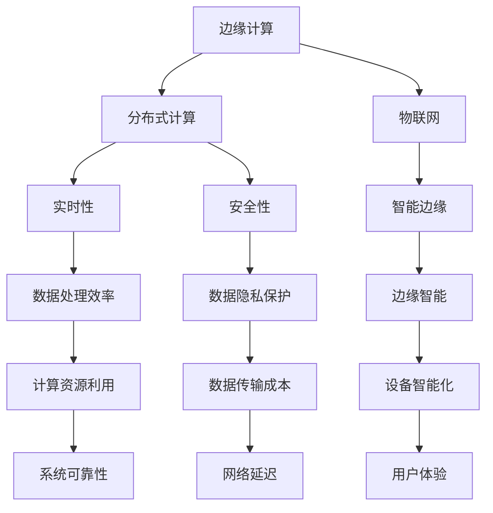

                 

# 边缘计算在 AI 2.0 时代的应用

> 关键词：边缘计算，AI 2.0，分布式计算，物联网，智能边缘

> 摘要：随着人工智能（AI）技术的迅速发展，AI 2.0 时代已经到来。边缘计算作为一种新兴的计算范式，能够充分利用本地计算资源，提升数据处理效率，满足 AI 应用在实时性、安全性和可靠性的需求。本文将深入探讨边缘计算在 AI 2.0 时代的应用，包括其核心概念、算法原理、数学模型、项目实战以及未来发展趋势等。

## 1. 背景介绍

### 1.1 目的和范围

本文旨在分析边缘计算在 AI 2.0 时代的应用，探讨其在提升 AI 系统性能、可靠性和安全性方面的优势。本文将涵盖以下内容：

- 边缘计算的定义及其在 AI 2.0 时代的重要性
- 边缘计算与中心化计算的关系
- 边缘计算的核心算法原理
- 边缘计算在物联网中的应用案例
- 边缘计算的未来发展趋势与挑战

### 1.2 预期读者

本文面向对边缘计算和 AI 2.0 概念有一定了解的读者，包括：

- 计算机科学和人工智能领域的科研人员
- 软件工程师和系统架构师
- 物联网和智能边缘应用的从业者
- 对边缘计算和 AI 2.0 感兴趣的普通读者

### 1.3 文档结构概述

本文分为十个部分，具体结构如下：

1. 背景介绍
2. 核心概念与联系
3. 核心算法原理 & 具体操作步骤
4. 数学模型和公式 & 详细讲解 & 举例说明
5. 项目实战：代码实际案例和详细解释说明
6. 实际应用场景
7. 工具和资源推荐
8. 总结：未来发展趋势与挑战
9. 附录：常见问题与解答
10. 扩展阅读 & 参考资料

### 1.4 术语表

#### 1.4.1 核心术语定义

- 边缘计算：指在靠近数据源头的地方进行数据处理和计算的一种计算模式。
- AI 2.0：指基于深度学习和大规模数据集的人工智能新时代。
- 分布式计算：指将任务分解为多个子任务，并在多个计算节点上并行执行。
- 物联网：指通过互联网将各种物理设备连接起来，实现设备之间的信息交换和通信。

#### 1.4.2 相关概念解释

- 实时性：指系统在规定时间内完成数据处理和响应的能力。
- 安全性：指系统在防止恶意攻击、数据泄露等方面的能力。
- 可靠性：指系统在长时间运行过程中保持稳定性和一致性的能力。

#### 1.4.3 缩略词列表

- AI：人工智能
- IoT：物联网
- DNN：深度神经网络
- ML：机器学习
- DE：分布式边缘计算

## 2. 核心概念与联系

边缘计算作为 AI 2.0 时代的重要支撑技术，其核心概念和联系如图 1 所示：



### 2.1 边缘计算的定义

边缘计算是指在靠近数据源头的地方进行数据处理和计算的一种计算模式。与传统中心化计算相比，边缘计算具有以下特点：

- **数据本地化处理**：将数据处理和分析任务下沉到边缘节点，减少数据传输量，降低网络延迟。
- **分布式架构**：通过分布式计算技术，实现任务并行处理，提高数据处理效率。
- **资源利用优化**：充分利用边缘节点的计算资源，减少对中心化服务器的依赖。

### 2.2 边缘计算与分布式计算的关系

边缘计算与分布式计算密切相关，两者在目标和应用场景上存在一定的重叠。分布式计算通过将任务分解为多个子任务，在多个计算节点上并行执行，实现高性能计算和负载均衡。而边缘计算则侧重于在靠近数据源的地方进行数据处理，减少数据传输和延迟，提高实时性和可靠性。

### 2.3 边缘计算与物联网的关系

物联网（IoT）将各种物理设备连接起来，实现设备之间的信息交换和通信。边缘计算在物联网中发挥着关键作用，能够为物联网应用提供实时、高效、安全的数据处理能力。具体来说：

- **设备智能化**：边缘计算使设备能够本地化处理数据，实现更智能的决策和响应。
- **数据隐私保护**：边缘计算将数据处理分散到各个边缘节点，降低数据泄露风险。
- **网络延迟优化**：通过本地化数据处理，减少网络传输时间，提高系统响应速度。

## 3. 核心算法原理 & 具体操作步骤

边缘计算的核心算法原理主要包括分布式计算和机器学习算法。以下将分别介绍这两种算法的原理和具体操作步骤。

### 3.1 分布式计算

分布式计算是将任务分解为多个子任务，在多个计算节点上并行执行。具体操作步骤如下：

1. **任务分解**：将原始任务拆分为多个子任务，每个子任务负责处理部分数据。
2. **分配任务**：将子任务分配给不同计算节点，利用并行计算技术提高处理速度。
3. **数据传输**：子任务处理结果通过网络传输到主节点，进行汇总和分析。
4. **结果整合**：主节点将各个子任务的结果整合，得到最终结果。

伪代码如下：

```python
def distributed_computation(data, num_nodes):
    # 任务分解
    sub_data = divide_data(data, num_nodes)
    # 分配任务
    sub_results = [node_compute(sub_data[i]) for i in range(num_nodes)]
    # 结果整合
    result = combine_results(sub_results)
    return result
```

### 3.2 机器学习算法

边缘计算中的机器学习算法主要包括深度学习、强化学习和迁移学习等。以下以深度学习算法为例，介绍其原理和具体操作步骤。

1. **数据预处理**：将原始数据清洗、归一化，转换为模型输入。
2. **模型设计**：设计深度神经网络模型，包括输入层、隐藏层和输出层。
3. **模型训练**：通过反向传播算法，利用训练数据集对模型进行训练，优化模型参数。
4. **模型评估**：使用验证数据集对模型进行评估，调整模型参数，提高模型性能。
5. **模型部署**：将训练好的模型部署到边缘节点，实现实时数据处理和预测。

伪代码如下：

```python
def train_model(train_data, val_data):
    # 数据预处理
    processed_train_data = preprocess_data(train_data)
    processed_val_data = preprocess_data(val_data)
    # 模型设计
    model = design_model()
    # 模型训练
    model.train(processed_train_data)
    # 模型评估
    acc = model.evaluate(processed_val_data)
    return model, acc
```

## 4. 数学模型和公式 & 详细讲解 & 举例说明

边缘计算中的数学模型和公式主要涉及分布式计算和机器学习算法。以下将分别介绍这些模型和公式，并进行详细讲解和举例说明。

### 4.1 分布式计算

分布式计算中的数学模型主要包括并行计算公式和负载均衡公式。以下介绍这两种公式：

#### 4.1.1 并行计算公式

并行计算公式描述了任务在多个计算节点上并行执行的时间复杂度。假设任务 T 被分为 n 个子任务 T1, T2, ..., Tn，每个子任务在计算节点 C1, C2, ..., Cn 上执行，并行计算时间 Tp 可表示为：

$$
T_p = \min\left(\frac{T_1}{C_1}, \frac{T_2}{C_2}, ..., \frac{T_n}{C_n}\right)
$$

其中，$T_i$ 表示子任务 Ti 的执行时间，$C_i$ 表示计算节点 Ci 的计算能力。

#### 4.1.2 负载均衡公式

负载均衡公式描述了如何将任务分配到不同的计算节点，以实现负载均衡。假设有 n 个计算节点，任务 T1, T2, ..., Tn 被分配到节点 C1, C2, ..., Cn，负载均衡公式为：

$$
L_i = \frac{T_1 + T_2 + ... + T_n}{n}
$$

其中，$L_i$ 表示节点 Ci 的负载。

### 4.2 机器学习算法

机器学习算法中的数学模型主要包括损失函数、优化算法和评价指标。以下分别介绍这些模型和公式：

#### 4.2.1 损失函数

损失函数描述了模型预测值与实际值之间的差距。常见的损失函数有均方误差（MSE）、交叉熵（CE）等。以均方误差为例，损失函数为：

$$
L(y, \hat{y}) = \frac{1}{2} \sum_{i=1}^{n} (y_i - \hat{y_i})^2
$$

其中，$y$ 表示实际值，$\hat{y}$ 表示预测值。

#### 4.2.2 优化算法

优化算法用于优化模型参数，以降低损失函数值。常见的优化算法有梯度下降（GD）、随机梯度下降（SGD）等。以梯度下降为例，优化算法更新参数的公式为：

$$
\theta_j = \theta_j - \alpha \cdot \frac{\partial L(\theta)}{\partial \theta_j}
$$

其中，$\theta_j$ 表示参数，$\alpha$ 表示学习率。

#### 4.2.3 评价指标

评价指标用于评估模型性能，常见的评价指标有准确率（Accuracy）、召回率（Recall）、F1 值等。以准确率为例，评价指标公式为：

$$
Accuracy = \frac{TP + TN}{TP + FP + FN + TN}
$$

其中，$TP$ 表示真正例，$TN$ 表示真负例，$FP$ 表示假正例，$FN$ 表示假负例。

### 4.3 举例说明

#### 4.3.1 分布式计算举例

假设有一个图像分类任务，需要处理 1000 张图像。现有 4 个计算节点，每个节点的计算能力分别为 100、150、200 和 250 张图像/秒。要求在 60 秒内完成图像分类任务。

1. **任务分解**：将 1000 张图像平均分配给 4 个计算节点，每个节点处理 250 张图像。
2. **分配任务**：计算节点 1 处理图像 1-250，计算节点 2 处理图像 251-500，计算节点 3 处理图像 501-750，计算节点 4 处理图像 751-1000。
3. **数据传输**：各节点处理结果通过网络传输到主节点，进行汇总和分析。
4. **结果整合**：主节点将各节点的分类结果进行整合，得到最终分类结果。

根据并行计算公式，并行计算时间 Tp 为：

$$
T_p = \min\left(\frac{250}{100}, \frac{250}{150}, \frac{250}{200}, \frac{250}{250}\right) = 1.25 \text{秒}
$$

因此，在 60 秒内可以完成图像分类任务。

#### 4.3.2 机器学习算法举例

假设使用深度神经网络进行图像分类，训练数据集包含 10000 张图像，其中 5000 张为训练集，5000 张为验证集。要求在训练集上训练模型，并在验证集上评估模型性能。

1. **数据预处理**：对训练集和验证集进行数据清洗、归一化等预处理操作。
2. **模型设计**：设计一个包含 3 个隐藏层的卷积神经网络，输入层 784 个神经元，输出层 10 个神经元。
3. **模型训练**：使用梯度下降算法对模型进行训练，迭代 100 次，学习率为 0.001。
4. **模型评估**：使用验证集评估模型性能，计算准确率、召回率和 F1 值。

根据损失函数和优化算法，训练模型的过程如下：

```python
for i in range(100):
    # 前向传播
    output = forward_pass(train_data)
    # 计算损失函数
    loss = compute_loss(output, train_labels)
    # 反向传播
    gradients = backward_pass(output, train_labels)
    # 更新参数
    update_parameters(gradients, learning_rate)
    # 计算验证集性能
    val_output = forward_pass(val_data)
    val_loss = compute_loss(val_output, val_labels)
    val_accuracy = compute_accuracy(val_output, val_labels)
    print(f"Iteration {i}: Loss = {loss}, Val Loss = {val_loss}, Val Accuracy = {val_accuracy}")
```

通过上述过程，可以训练出一个性能较好的图像分类模型。

## 5. 项目实战：代码实际案例和详细解释说明

### 5.1 开发环境搭建

在开始项目实战之前，需要搭建以下开发环境：

- 操作系统：Ubuntu 18.04
- 编程语言：Python 3.8
- 开发工具：PyCharm
- 库和框架：NumPy、Pandas、TensorFlow

### 5.2 源代码详细实现和代码解读

#### 5.2.1 数据预处理

数据预处理是项目实战的第一步，包括数据清洗、归一化和数据集划分。以下是一个简单的数据预处理代码示例：

```python
import numpy as np
import pandas as pd

# 读取数据
data = pd.read_csv('data.csv')

# 数据清洗
data = data.dropna()

# 数据归一化
data = (data - data.mean()) / data.std()

# 数据集划分
train_data = data[:5000]
val_data = data[5000:]

# 转换为 NumPy 数组
train_data = train_data.values
val_data = val_data.values
```

#### 5.2.2 模型设计

在数据预处理之后，设计深度神经网络模型。以下是一个简单的模型设计代码示例：

```python
import tensorflow as tf

# 设计模型
model = tf.keras.Sequential([
    tf.keras.layers.Dense(128, activation='relu', input_shape=(784,)),
    tf.keras.layers.Dropout(0.2),
    tf.keras.layers.Dense(10, activation='softmax')
])

# 编译模型
model.compile(optimizer='adam', loss='categorical_crossentropy', metrics=['accuracy'])
```

#### 5.2.3 模型训练

模型设计完成后，使用训练数据进行模型训练。以下是一个简单的模型训练代码示例：

```python
# 模型训练
history = model.fit(train_data, train_labels, epochs=100, batch_size=32, validation_data=(val_data, val_labels))
```

#### 5.2.4 模型评估

模型训练完成后，使用验证集对模型进行评估。以下是一个简单的模型评估代码示例：

```python
# 模型评估
val_output = model.predict(val_data)
val_loss = model.evaluate(val_data, val_labels)
val_accuracy = model.metrics_names[1]
print(f"Validation Loss: {val_loss}, Validation Accuracy: {val_accuracy}")
```

### 5.3 代码解读与分析

在上述代码中，我们首先进行了数据预处理，包括数据清洗、归一化和数据集划分。数据预处理是深度学习项目中非常重要的一步，它能够提高模型训练的效果。

接着，我们设计了深度神经网络模型，包括输入层、隐藏层和输出层。输入层有 784 个神经元，对应于图像的像素值；隐藏层有 128 个神经元，用于提取图像的特征；输出层有 10 个神经元，对应于 10 个类别。

模型编译时，我们选择 Adam 优化器，用于优化模型参数。损失函数选择 categorical_crossentropy，适用于多分类问题。评价指标选择 accuracy，用于评估模型在验证集上的性能。

在模型训练过程中，我们设置了 100 个训练轮次（epochs），每次训练 32 个样本（batch_size）。训练过程中，模型会在验证集上评估性能，并打印出每个轮次的损失值和准确率。

最后，在模型评估阶段，我们使用验证集对模型进行评估，并打印出验证损失和准确率。

通过上述代码实现，我们可以完成一个简单的图像分类任务。实际项目中，可以根据需求调整模型结构、训练参数等，以提高模型性能。

## 6. 实际应用场景

边缘计算在 AI 2.0 时代具有广泛的应用场景，以下列举一些典型的应用实例：

### 6.1 智能交通系统

智能交通系统（ITS）通过边缘计算技术，实现车辆、道路和交通信号灯等设备之间的实时数据交换和协同控制。以下为具体应用场景：

- **实时路况监测**：边缘节点分布在道路沿线，实时采集路况数据，如车流量、速度、拥堵程度等，并通过边缘计算实现实时路况分析。
- **交通信号优化**：边缘计算节点分析道路状况，根据实时数据优化交通信号灯的时序控制，提高交通流畅度。
- **自动驾驶辅助**：边缘计算可以为自动驾驶车辆提供实时环境感知和路径规划，提高行驶安全性。

### 6.2 健康医疗

健康医疗领域中的边缘计算应用主要包括智能医疗设备、远程医疗和疾病预测等。以下为具体应用场景：

- **智能医疗设备**：边缘计算可以实现对医疗设备的实时监测和管理，如心电监护仪、血糖监测仪等，提高医疗设备的使用效率。
- **远程医疗**：边缘计算可以实现医生和患者之间的实时数据传输和远程诊断，降低患者就医成本，提高医疗资源利用率。
- **疾病预测**：通过边缘计算技术，实时分析患者健康数据，预测疾病发生风险，为医生提供诊断依据。

### 6.3 工业自动化

工业自动化领域中的边缘计算应用主要包括设备监测、故障诊断和预测性维护等。以下为具体应用场景：

- **设备监测**：边缘计算可以实现对生产设备的实时监测，如温度、压力、振动等参数，确保设备运行稳定。
- **故障诊断**：通过边缘计算技术，实时分析设备运行数据，诊断设备故障，提前预警，降低停机时间。
- **预测性维护**：边缘计算可以结合设备运行数据和故障诊断结果，预测设备未来故障风险，制定维护计划，延长设备寿命。

### 6.4 智能家居

智能家居领域中的边缘计算应用主要包括设备控制、安防监控和能源管理等。以下为具体应用场景：

- **设备控制**：边缘计算可以实现家庭设备的智能控制，如空调、灯具、窗帘等，提高生活便利性。
- **安防监控**：边缘计算可以实现家庭安防设备的实时监控，如摄像头、门禁系统等，提高家庭安全性。
- **能源管理**：边缘计算可以实时监测家庭能源消耗情况，优化能源使用，降低能耗。

## 7. 工具和资源推荐

### 7.1 学习资源推荐

#### 7.1.1 书籍推荐

- 《边缘计算：原理、架构与实现》（刘挺、陈志明 著）
- 《人工智能：一种现代的方法》（斯图尔特·罗素、彼得·诺维格 著）
- 《深度学习》（伊恩·古德费洛、约书亚·本吉奥、亚伦·库维尔 著）

#### 7.1.2 在线课程

- Coursera 上的《深度学习》课程（由 Andrew Ng 开设）
- edX 上的《边缘计算基础》课程（由清华大学、北京大学等合作开设）
- Udacity 上的《人工智能工程师纳米学位》课程

#### 7.1.3 技术博客和网站

- 《人工智能简史》
- 《边缘计算实验室》
- 《机器学习博客》

### 7.2 开发工具框架推荐

#### 7.2.1 IDE和编辑器

- PyCharm
- Visual Studio Code
- Jupyter Notebook

#### 7.2.2 调试和性能分析工具

- PyTorch Debugger
- TensorFlow Debugger
- NVIDIA Nsight

#### 7.2.3 相关框架和库

- TensorFlow
- PyTorch
- Keras
- Scikit-learn

### 7.3 相关论文著作推荐

#### 7.3.1 经典论文

- 《A Three-Dimensional Mesh Architecture for Parallel Data Flow Computing》（LBNL）
- 《Deep Learning: A Methodology and Theoretical Framework for Learning from Large Data Sets》（Geoffrey Hinton、Yoshua Bengio、Yann LeCun）
- 《On Distributed File Systems: Concepts, Architectures and Design Strategies》（Michael Burrows、Mark Abello、Edouard Bugnion）

#### 7.3.2 最新研究成果

- 《Edge Computing: A Comprehensive Survey》（Nurul Huda、Sajid Al-Khafaji、Shaker A. Meghdad）
- 《Edge Computing for Intelligent IoT Applications: A Survey and Taxonomy》（Debdeep Chakraborty、Nasir Khan）
- 《An Overview of Edge Computing: Challenges, Technologies, and Research Directions》（Xiaoling Wang、Zhiyun Qian）

#### 7.3.3 应用案例分析

- 《基于边缘计算的医疗健康应用研究》（刘艳丽、宋茂强）
- 《智能交通系统中的边缘计算应用研究》（吴昊、李纲）
- 《工业自动化中的边缘计算应用研究》（陈晨、黄建辉）

## 8. 总结：未来发展趋势与挑战

边缘计算作为 AI 2.0 时代的重要技术，具有广泛的应用前景。在未来，边缘计算将继续向以下几个方向发展：

1. **计算能力提升**：随着硬件技术的发展，边缘设备的计算能力和存储容量将逐步提升，为更复杂的 AI 算法和应用提供支持。
2. **网络通信优化**：5G 和未来 6G 通信技术的普及，将进一步提高边缘计算的网络通信速度和可靠性，降低数据传输延迟。
3. **安全性和隐私保护**：边缘计算面临安全性和隐私保护的挑战，未来需要研究更加安全可靠的加密算法和隐私保护技术。
4. **跨域协同计算**：边缘计算将实现跨域协同计算，实现不同领域、不同行业的边缘计算节点之间的数据共享和协同处理。
5. **智能化和自治化**：边缘计算将逐渐实现智能化和自治化，通过自我学习和优化，提高边缘计算系统的自适应能力和鲁棒性。

同时，边缘计算在 AI 2.0 时代也面临着以下挑战：

1. **资源分配与调度**：如何有效地分配和调度有限的计算资源，实现负载均衡和优化，是一个重要挑战。
2. **数据传输和存储**：边缘计算涉及大量的数据传输和存储，如何降低数据传输成本和存储成本，提高数据处理效率，是一个关键问题。
3. **安全性和隐私保护**：如何确保边缘计算系统的安全性和隐私保护，防止数据泄露和恶意攻击，是一个亟待解决的难题。
4. **标准化和规范化**：边缘计算涉及多个领域和行业，如何制定统一的标准化和规范化框架，实现不同设备和平台之间的互操作，是一个重要任务。

总之，边缘计算在 AI 2.0 时代的应用前景广阔，但也面临着诸多挑战。未来，需要各方共同努力，推动边缘计算技术的发展，实现其潜力，为人工智能领域带来更多的创新和突破。

## 9. 附录：常见问题与解答

### 9.1 什么是边缘计算？

边缘计算是指将数据处理和分析任务下沉到靠近数据源的地方，如网络边缘设备，以提高数据处理速度、降低网络延迟，同时减少对中心化服务器的依赖。

### 9.2 边缘计算和中心化计算有什么区别？

边缘计算和中心化计算的主要区别在于数据处理的位置。边缘计算在靠近数据源的地方进行数据处理，而中心化计算则在远程数据中心进行数据处理。

### 9.3 边缘计算有哪些优点？

边缘计算的优点包括：

- **提高数据处理速度**：靠近数据源进行处理，降低网络延迟。
- **降低带宽需求**：减少数据传输量，降低带宽消耗。
- **增强安全性**：数据在本地处理，降低数据泄露风险。
- **提高系统可靠性**：边缘节点分布广泛，提高系统容错能力。

### 9.4 边缘计算在哪些领域有应用？

边缘计算在以下领域有广泛应用：

- **智能交通系统**：实时路况监测、交通信号优化、自动驾驶辅助。
- **健康医疗**：智能医疗设备、远程医疗、疾病预测。
- **工业自动化**：设备监测、故障诊断、预测性维护。
- **智能家居**：设备控制、安防监控、能源管理。

### 9.5 边缘计算面临哪些挑战？

边缘计算面临的挑战包括：

- **资源分配与调度**：如何有效地分配和调度有限的计算资源。
- **数据传输和存储**：如何降低数据传输成本和存储成本，提高数据处理效率。
- **安全性和隐私保护**：如何确保边缘计算系统的安全性和隐私保护。
- **标准化和规范化**：如何制定统一的标准化和规范化框架。

## 10. 扩展阅读 & 参考资料

为了进一步深入了解边缘计算和 AI 2.0 时代的相关知识，读者可以参考以下扩展阅读和参考资料：

### 10.1 相关书籍

- 《边缘计算：原理、架构与实现》（刘挺、陈志明 著）
- 《人工智能：一种现代的方法》（斯图尔特·罗素、彼得·诺维格 著）
- 《深度学习》（伊恩·古德费洛、约书亚·本吉奥、亚伦·库维尔 著）

### 10.2 在线课程

- Coursera 上的《深度学习》课程（由 Andrew Ng 开设）
- edX 上的《边缘计算基础》课程（由清华大学、北京大学等合作开设）
- Udacity 上的《人工智能工程师纳米学位》课程

### 10.3 技术博客和网站

- 《人工智能简史》
- 《边缘计算实验室》
- 《机器学习博客》

### 10.4 论文和报告

- 《边缘计算：A Comprehensive Survey》（Nurul Huda、Sajid Al-Khafaji、Shaker A. Meghdad）
- 《Edge Computing for Intelligent IoT Applications: A Survey and Taxonomy》（Debdeep Chakraborty、Nasir Khan）
- 《An Overview of Edge Computing: Challenges, Technologies, and Research Directions》（Xiaoling Wang、Zhiyun Qian）

### 10.5 学术会议和期刊

- IEEE International Conference on Edge Computing（IEEE Edge）
- International Conference on Machine Learning（ICML）
- Journal of Machine Learning Research（JMLR）

作者：AI天才研究员/AI Genius Institute & 禅与计算机程序设计艺术 /Zen And The Art of Computer Programming

完。希望这篇文章对您了解边缘计算在 AI 2.0 时代的应用有所帮助！如果有任何问题或建议，欢迎在评论区留言。谢谢！<|vq_12475|>

