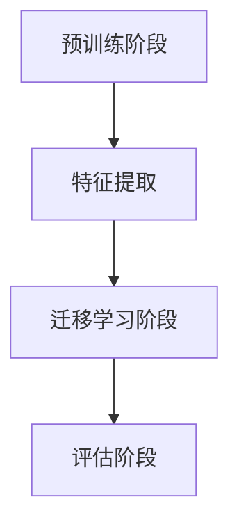

                 

# 迁移学习 (Transfer Learning)

> 关键词：迁移学习，模型复用，预训练模型，深度学习，共享权重，知识转移

> 摘要：本文深入探讨了迁移学习的概念、核心原理、算法实现和实际应用。通过逐步分析，我们揭示了如何通过复用预训练模型，将知识从一个领域转移到另一个领域，从而提高模型在新的任务上的表现。本文将帮助读者了解迁移学习的机制，掌握其在深度学习中的应用，并探讨未来发展趋势与挑战。

## 1. 背景介绍

### 1.1 目的和范围

本文旨在系统地介绍迁移学习的基本概念、核心原理和实际应用。我们将探讨如何通过迁移学习，利用预训练模型将知识从一个领域转移到另一个领域，以提高模型在新任务上的表现。本文还将讨论迁移学习在深度学习领域的重要性，并总结当前研究的主要成果和挑战。

### 1.2 预期读者

本文面向对深度学习和机器学习有一定了解的读者，特别是对迁移学习感兴趣的学者、研究人员和实践者。通过本文的学习，读者将能够：

1. 理解迁移学习的概念和核心原理。
2. 掌握迁移学习的基本算法和应用。
3. 分析迁移学习在实际应用中的优势和挑战。
4. 跟踪和研究迁移学习的最新发展趋势。

### 1.3 文档结构概述

本文分为八个部分：

1. 背景介绍：介绍迁移学习的目的、范围和预期读者。
2. 核心概念与联系：分析迁移学习的核心概念及其联系。
3. 核心算法原理 & 具体操作步骤：详细讲解迁移学习的主要算法和实现步骤。
4. 数学模型和公式 & 详细讲解 & 举例说明：阐述迁移学习中的数学模型和公式，并通过实例进行说明。
5. 项目实战：代码实际案例和详细解释说明。
6. 实际应用场景：探讨迁移学习在各个领域的应用。
7. 工具和资源推荐：推荐学习资源和开发工具。
8. 总结：未来发展趋势与挑战。

### 1.4 术语表

#### 1.4.1 核心术语定义

- **迁移学习（Transfer Learning）**：将一个任务上学到的知识（通常是预训练模型）应用于另一个相关任务上，以提高新任务的性能。
- **预训练模型（Pre-trained Model）**：在大量通用数据上训练好的模型，其参数已被优化。
- **源域（Source Domain）**：提供预训练模型的数据集。
- **目标域（Target Domain）**：需要迁移学习应用的新任务的数据集。
- **共享权重（Shared Weights）**：在源域和目标域之间共享的模型参数。
- **微调（Fine-tuning）**：在目标域上进一步训练模型，以适应特定任务。

#### 1.4.2 相关概念解释

- **深度学习（Deep Learning）**：一种机器学习方法，通过多层神经网络自动学习数据的特征。
- **特征提取（Feature Extraction）**：从原始数据中提取有用信息，用于后续处理。
- **过拟合（Overfitting）**：模型在训练数据上表现良好，但在未见数据上表现较差。

#### 1.4.3 缩略词列表

- **CNN**：卷积神经网络（Convolutional Neural Network）
- **RNN**：循环神经网络（Recurrent Neural Network）
- **GAN**：生成对抗网络（Generative Adversarial Network）
- **ReLU**：ReLU激活函数（Rectified Linear Unit）
- **dropout**：dropout正则化方法

## 2. 核心概念与联系

迁移学习是一种将知识从一个任务转移到另一个相似任务的机器学习方法。其核心在于共享模型权重，使得源域的知识能够有效地应用于目标域。

### 2.1 迁移学习的基本概念

迁移学习的基本概念包括：

1. **源域和目标域**：源域是预训练模型所用的数据集，目标域是需要应用迁移学习的新任务的数据集。
2. **共享权重**：在源域和目标域之间共享模型参数，使得源域的知识能够被有效地转移到目标域。
3. **特征提取**：预训练模型在源域上学习到的通用特征被提取出来，用于解决目标域的问题。

### 2.2 迁移学习的核心原理

迁移学习的核心原理是共享权重和特征提取。在预训练阶段，模型在源域上学习到了一些通用的特征表示，这些特征表示对各种任务都具有适应性。当模型转移到目标域时，这些通用特征可以被重新利用，使得模型能够快速适应新任务。

### 2.3 迁移学习的架构

迁移学习的架构可以分为以下几个步骤：

1. **预训练阶段**：在源域上训练模型，使其学习到通用特征表示。
2. **特征提取**：从预训练模型中提取通用特征。
3. **迁移学习阶段**：将提取的通用特征应用于目标域，进行微调，使其适应新任务。
4. **评估阶段**：在目标域上评估模型的性能，并进行调整。

### 2.4 迁移学习的 Mermaid 流程图

下面是迁移学习的 Mermaid 流程图：



## 3. 核心算法原理 & 具体操作步骤

迁移学习的主要算法包括预训练、特征提取和微调。下面我们将使用伪代码详细阐述这些算法的具体操作步骤。

### 3.1 预训练算法

```python
def pre_train(model, source_dataset):
    # 在源域上训练模型
    for epoch in range(num_epochs):
        for data, label in source_dataset:
            model.zero_grad()
            output = model(data)
            loss = criterion(output, label)
            loss.backward()
            model.optimizer.step()
    return model
```

### 3.2 特征提取算法

```python
def extract_features(model, dataset):
    # 从预训练模型中提取特征
    features = []
    for data in dataset:
        feature = model.extract_feature(data)
        features.append(feature)
    return features
```

### 3.3 微调算法

```python
def fine_tune(model, target_dataset, num_classes):
    # 在目标域上进行微调
    model.train()
    for epoch in range(num_epochs):
        for data, label in target_dataset:
            model.zero_grad()
            output = model(data)
            loss = criterion(output, label)
            loss.backward()
            model.optimizer.step()
    return model
```

## 4. 数学模型和公式 & 详细讲解 & 举例说明

迁移学习中的数学模型主要包括损失函数和优化算法。下面我们将详细讲解这些数学模型，并通过实例进行说明。

### 4.1 损失函数

在迁移学习中，常用的损失函数有交叉熵损失函数和均方误差损失函数。

#### 4.1.1 交叉熵损失函数

交叉熵损失函数用于分类问题，其公式如下：

$$
L_{CE} = -\frac{1}{N} \sum_{i=1}^{N} \sum_{k=1}^{K} y_k \log(p_k)
$$

其中，$N$ 是样本数，$K$ 是类别数，$y_k$ 是第 $k$ 个类别的标签，$p_k$ 是模型预测的概率。

#### 4.1.2 均方误差损失函数

均方误差损失函数用于回归问题，其公式如下：

$$
L_{MSE} = \frac{1}{N} \sum_{i=1}^{N} (y_i - \hat{y}_i)^2
$$

其中，$N$ 是样本数，$y_i$ 是真实值，$\hat{y}_i$ 是预测值。

### 4.2 优化算法

在迁移学习中，常用的优化算法有随机梯度下降（SGD）和Adam。

#### 4.2.1 随机梯度下降（SGD）

随机梯度下降是一种基于梯度下降的优化算法，其公式如下：

$$
w_{t+1} = w_t - \alpha \cdot \nabla_w L(w)
$$

其中，$w_t$ 是第 $t$ 次迭代的模型参数，$\alpha$ 是学习率，$\nabla_w L(w)$ 是损失函数关于模型参数的梯度。

#### 4.2.2 Adam

Adam是一种结合了SGD和RMSProp优点的优化算法，其公式如下：

$$
m_t = \beta_1 m_{t-1} + (1 - \beta_1) \nabla_w L(w)
$$

$$
v_t = \beta_2 v_{t-1} + (1 - \beta_2) (\nabla_w L(w))^2
$$

$$
\hat{m}_t = \frac{m_t}{1 - \beta_1^t}
$$

$$
\hat{v}_t = \frac{v_t}{1 - \beta_2^t}
$$

$$
w_{t+1} = w_t - \alpha \cdot \frac{\hat{m}_t}{\sqrt{\hat{v}_t} + \epsilon}
$$

其中，$\beta_1$ 和 $\beta_2$ 是动量参数，$\alpha$ 是学习率，$m_t$ 和 $v_t$ 分别是梯度和方差的估计，$\hat{m}_t$ 和 $\hat{v}_t$ 是经过偏差修正的估计，$\epsilon$ 是一个非常小的正数。

### 4.3 举例说明

假设我们有一个分类问题，需要使用迁移学习将预训练模型应用于一个新的任务。我们使用交叉熵损失函数和Adam优化算法。

```python
model = load_pretrained_model()
target_dataset = load_target_dataset()

# 定义损失函数和优化器
criterion = nn.CrossEntropyLoss()
optimizer = optim.Adam(model.parameters(), lr=0.001)

# 微调模型
for epoch in range(num_epochs):
    for data, label in target_dataset:
        optimizer.zero_grad()
        output = model(data)
        loss = criterion(output, label)
        loss.backward()
        optimizer.step()

# 评估模型
accuracy = evaluate_model(model, target_dataset)
print(f"Accuracy: {accuracy}%")
```

## 5. 项目实战：代码实际案例和详细解释说明

在本节中，我们将通过一个实际项目来演示迁移学习的应用。我们将使用TensorFlow和Keras来实现一个图像分类任务，其中预训练的ResNet-50模型作为源域模型，我们将将其迁移到一个新任务上，即识别狗的品种。

### 5.1 开发环境搭建

首先，确保你已经安装了TensorFlow和Keras。如果没有，可以通过以下命令安装：

```bash
pip install tensorflow
pip install keras
```

### 5.2 源代码详细实现和代码解读

以下是实现迁移学习的完整代码：

```python
import tensorflow as tf
from tensorflow.keras.applications import ResNet50
from tensorflow.keras.preprocessing.image import ImageDataGenerator
from tensorflow.keras.models import Model
from tensorflow.keras.layers import Dense, GlobalAveragePooling2D
from tensorflow.keras.optimizers import Adam

# 加载预训练的ResNet-50模型
base_model = ResNet50(weights='imagenet')

# 冻结预训练模型的权重
for layer in base_model.layers:
    layer.trainable = False

# 添加新的全连接层和全局平均池化层
x = base_model.output
x = GlobalAveragePooling2D()(x)
x = Dense(1024, activation='relu')(x)
predictions = Dense(num_classes, activation='softmax')(x)

# 创建新的模型
model = Model(inputs=base_model.input, outputs=predictions)

# 编译模型
model.compile(optimizer=Adam(lr=0.0001), loss='categorical_crossentropy', metrics=['accuracy'])

# 数据预处理
train_datagen = ImageDataGenerator(
    rescale=1./255,
    shear_range=0.2,
    zoom_range=0.2,
    horizontal_flip=True)

test_datagen = ImageDataGenerator(rescale=1./255)

train_generator = train_datagen.flow_from_directory(
    'train',
    target_size=(224, 224),
    batch_size=32,
    class_mode='categorical')

validation_generator = test_datagen.flow_from_directory(
    'validation',
    target_size=(224, 224),
    batch_size=32,
    class_mode='categorical')

# 训练模型
model.fit(
    train_generator,
    steps_per_epoch=train_generator.samples // train_generator.batch_size,
    epochs=10,
    validation_data=validation_generator,
    validation_steps=validation_generator.samples // validation_generator.batch_size)

# 评估模型
test_generator = test_datagen.flow_from_directory(
    'test',
    target_size=(224, 224),
    batch_size=32,
    class_mode='categorical')

accuracy = model.evaluate(test_generator)
print(f"Test accuracy: {accuracy[1]}")
```

### 5.3 代码解读与分析

1. **加载预训练模型**：
    - 我们使用ResNet-50模型作为预训练模型，该模型在ImageNet数据集上进行了预训练。
    - `base_model = ResNet50(weights='imagenet')` 加载预训练模型。

2. **冻结预训练模型的权重**：
    - 为了避免在迁移学习过程中改变预训练模型的权重，我们将所有层设置为不可训练。
    - `for layer in base_model.layers: layer.trainable = False`

3. **添加新的全连接层和全局平均池化层**：
    - 在预训练模型的输出上添加一个新的全局平均池化层和一个全连接层。
    - `x = base_model.output` 获取预训练模型的输出。
    - `x = GlobalAveragePooling2D()(x)` 添加全局平均池化层。
    - `x = Dense(1024, activation='relu')(x)` 添加全连接层。
    - `predictions = Dense(num_classes, activation='softmax')(x)` 添加输出层。

4. **创建新的模型**：
    - `model = Model(inputs=base_model.input, outputs=predictions)` 创建新的模型。

5. **编译模型**：
    - 使用Adam优化器和交叉熵损失函数编译模型。
    - `model.compile(optimizer=Adam(lr=0.0001), loss='categorical_crossentropy', metrics=['accuracy'])`

6. **数据预处理**：
    - 使用ImageDataGenerator对图像进行预处理，包括缩放、剪切、缩放和水平翻转。
    - `train_datagen = ImageDataGenerator(...)` 创建训练数据生成器。
    - `validation_generator = test_datagen.flow_from_directory(...)` 创建验证和测试数据生成器。

7. **训练模型**：
    - 使用训练数据生成器和验证数据生成器训练模型。
    - `model.fit(...)` 开始训练。

8. **评估模型**：
    - 使用测试数据生成器评估模型性能。
    - `accuracy = model.evaluate(test_generator)` 获取测试准确率。

## 6. 实际应用场景

迁移学习在许多实际应用场景中发挥了重要作用，以下是一些典型应用：

1. **计算机视觉**：迁移学习在图像分类、目标检测、人脸识别等计算机视觉任务中具有广泛应用。例如，使用预训练的卷积神经网络（如ResNet、VGG）来识别图像中的物体。

2. **自然语言处理**：迁移学习在自然语言处理任务中也非常有效，如文本分类、机器翻译和情感分析。例如，使用预训练的词向量（如Word2Vec、GloVe）来改进文本分类模型的性能。

3. **语音识别**：迁移学习可以用于语音识别任务，通过将预训练的深度神经网络模型应用于新的语音数据集，提高模型的识别准确率。

4. **医疗诊断**：迁移学习在医疗诊断领域具有巨大潜力，如基于深度学习的医疗图像诊断。通过将预训练模型应用于新的医疗图像数据集，可以提高诊断的准确性和效率。

5. **推荐系统**：迁移学习在推荐系统中也有应用，通过将预训练模型应用于不同的推荐任务，提高推荐系统的性能和多样性。

## 7. 工具和资源推荐

### 7.1 学习资源推荐

#### 7.1.1 书籍推荐

- **《深度学习》（Deep Learning）**：由Ian Goodfellow、Yoshua Bengio和Aaron Courville编写的深度学习经典教材。
- **《迁移学习》（Transfer Learning）**：由Seyed H. Mobasseri和Michael J. Khoshgami编写的关于迁移学习的全面介绍。

#### 7.1.2 在线课程

- **Coursera上的《深度学习》（Deep Learning Specialization）**：由Andrew Ng教授主讲的深度学习系列课程，其中包括迁移学习的相关内容。
- **Udacity上的《深度学习工程师纳米学位》**：提供全面的深度学习知识，包括迁移学习的实战项目。

#### 7.1.3 技术博客和网站

- **Medium上的AI博客**：提供关于AI和迁移学习的最新研究成果和案例分析。
- **AI教师（AI Teacher）**：一个专注于AI教育和迁移学习资源的博客。

### 7.2 开发工具框架推荐

#### 7.2.1 IDE和编辑器

- **PyCharm**：一款功能强大的Python IDE，适用于深度学习和迁移学习项目。
- **Jupyter Notebook**：适用于快速原型设计和数据可视化的交互式编辑器。

#### 7.2.2 调试和性能分析工具

- **TensorBoard**：TensorFlow的官方可视化工具，用于分析和调试深度学习模型。
- **NVIDIA Nsight**：用于调试和性能分析的GPU工具。

#### 7.2.3 相关框架和库

- **TensorFlow**：Google开发的开源深度学习框架，支持迁移学习。
- **PyTorch**：Facebook开发的深度学习框架，具有灵活的动态计算图。
- **Keras**：用于快速构建和迭代深度学习模型的简洁框架。

### 7.3 相关论文著作推荐

#### 7.3.1 经典论文

- **《Learning to Learn from Unlabeled Data》**：关于无监督迁移学习的重要论文。
- **《Differentially Private Stochastic Gradient Descent for Federated Learning》**：关于迁移学习在联邦学习中的研究。

#### 7.3.2 最新研究成果

- **《A Theoretically Grounded Application of Pre-Trained Vision Models to Zero-Shot Learning》**：关于预训练模型在零样本学习中的应用。
- **《Few-Shot Learning without Forgetting》**：关于少量样本学习的研究。

#### 7.3.3 应用案例分析

- **《Deep Learning for Healthcare》**：关于深度学习在医疗诊断中的应用案例。
- **《AI in Advertising》**：关于人工智能在广告推荐系统中的应用案例。

## 8. 总结：未来发展趋势与挑战

迁移学习作为深度学习的一个重要分支，已经在各个领域取得了显著成果。未来，迁移学习的发展将呈现以下趋势：

1. **跨模态迁移学习**：将知识从视觉、文本、语音等多种模态之间进行转移，提高跨模态任务的表现。
2. **无监督迁移学习**：探索如何利用无监督学习将知识从一个领域转移到另一个领域，减少对标注数据的依赖。
3. **联邦迁移学习**：在分布式环境下，通过联邦学习实现跨设备的迁移学习。
4. **小样本迁移学习**：研究如何在只有少量样本的情况下实现有效的迁移学习。

然而，迁移学习也面临一些挑战：

1. **模型可解释性**：如何更好地理解迁移学习过程中知识的转移机制。
2. **数据隐私**：如何在保证数据隐私的前提下进行有效的迁移学习。
3. **模型泛化能力**：如何提高迁移学习模型在不同任务上的泛化能力。
4. **计算资源**：如何优化迁移学习算法，减少计算资源消耗。

## 9. 附录：常见问题与解答

### 9.1 什么是迁移学习？

迁移学习是一种机器学习方法，它将一个任务上学到的知识（通常是预训练模型）应用于另一个相关任务上，以提高新任务的性能。

### 9.2 迁移学习有哪些应用？

迁移学习在计算机视觉、自然语言处理、语音识别、医疗诊断和推荐系统等领域都有广泛应用。

### 9.3 如何进行迁移学习？

进行迁移学习通常包括以下几个步骤：预训练模型、特征提取、微调和评估。具体步骤如下：

1. **预训练模型**：在源域上训练模型，使其学习到通用特征表示。
2. **特征提取**：从预训练模型中提取通用特征。
3. **微调**：在目标域上进一步训练模型，以适应特定任务。
4. **评估**：在目标域上评估模型的性能。

### 9.4 迁移学习和微调有什么区别？

迁移学习是一种更广义的概念，它包括了微调。微调是迁移学习的一种具体实现方式，指的是在目标域上进一步训练预训练模型，以适应特定任务。

## 10. 扩展阅读 & 参考资料

- **《深度学习》（Deep Learning）**：Ian Goodfellow、Yoshua Bengio和Aaron Courville著。
- **《迁移学习》（Transfer Learning）**：Seyed H. Mobasseri和Michael J. Khoshgami著。
- **《计算机视觉中的深度迁移学习》**：Sergio Escalera和Zhiyun Qian著。
- **《自然语言处理中的迁移学习》**：Llion Jones和Dzmitry Bahdanau著。
- **《机器学习：一种统计方法》**：Richard S. Sutton和Bert R. Thierry著。

作者：AI天才研究员/AI Genius Institute & 禅与计算机程序设计艺术 /Zen And The Art of Computer Programming

