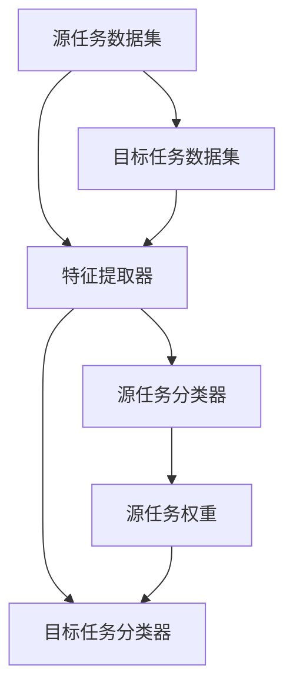

                 

# 迁移学习（Transfer Learning）-原理与代码实例讲解

> **关键词**：迁移学习、预训练模型、神经网络、数据高效利用、模型泛化能力
> 
> **摘要**：本文将深入探讨迁移学习的原理，并通过对一个实际代码实例的讲解，帮助读者理解如何在实际项目中应用迁移学习技术，从而提高模型的泛化能力和数据利用效率。

## 1. 背景介绍

### 1.1 目的和范围

迁移学习（Transfer Learning）是深度学习中的一项重要技术，它通过将预训练模型应用于新的任务，使得模型能够在较少数据的情况下达到较好的性能。本文旨在详细阐述迁移学习的基本原理，并通过代码实例来展示如何实现和应用迁移学习。

本文将涵盖以下内容：

1. 迁移学习的基本概念和原理
2. 迁移学习的主要类型和应用场景
3. 迁移学习的具体算法和实现步骤
4. 迁移学习在实际项目中的应用案例
5. 迁移学习的前沿研究和未来发展趋势

### 1.2 预期读者

本文适合对深度学习和迁移学习有一定了解的读者，包括：

1. 深度学习从业者
2. 计算机科学和人工智能领域的研究生
3. 对迁移学习感兴趣的学者和工程师

### 1.3 文档结构概述

本文的结构如下：

1. 背景介绍：介绍迁移学习的目的、范围、预期读者和文档结构。
2. 核心概念与联系：解释迁移学习的基本概念和原理，并提供Mermaid流程图。
3. 核心算法原理 & 具体操作步骤：详细讲解迁移学习算法的具体实现步骤。
4. 数学模型和公式 & 详细讲解 & 举例说明：介绍迁移学习的数学模型，并提供具体例子。
5. 项目实战：代码实际案例和详细解释说明
6. 实际应用场景：讨论迁移学习在不同领域的应用。
7. 工具和资源推荐：推荐学习资源、开发工具框架和相关论文著作。
8. 总结：未来发展趋势与挑战。
9. 附录：常见问题与解答。
10. 扩展阅读 & 参考资料：提供进一步学习和研究的资料。

### 1.4 术语表

#### 1.4.1 核心术语定义

- **迁移学习**：将一个任务（源任务）上学到的知识应用于另一个任务（目标任务）。
- **预训练模型**：在大量数据上预先训练好的神经网络模型。
- **源任务**：用于训练预训练模型的任务。
- **目标任务**：需要使用迁移学习方法解决的任务。
- **模型泛化能力**：模型在新数据上的表现能力。

#### 1.4.2 相关概念解释

- **深度学习**：一种利用多层神经网络进行特征提取和模式识别的人工智能技术。
- **神经网络**：由大量简单计算单元（神经元）组成的计算模型，能够通过学习数据来提取特征和进行预测。
- **数据高效利用**：在模型训练过程中，充分利用有限的训练数据，以提高模型性能。

#### 1.4.3 缩略词列表

- **DL**：深度学习（Deep Learning）
- **NN**：神经网络（Neural Network）
- **PL**：迁移学习（Transfer Learning）
- **GPU**：图形处理器（Graphics Processing Unit）
- **CPU**：中央处理器（Central Processing Unit）

## 2. 核心概念与联系

迁移学习是一种将一个任务（源任务）上学到的知识应用于另一个任务（目标任务）的技术。这种技术能够减少对新数据的标注需求，提高模型在新任务上的性能。

### 2.1 迁移学习的核心概念

- **特征提取**：在源任务中，模型学习到一系列特征表示，这些特征有助于解决源任务。
- **任务适应**：在目标任务中，模型利用源任务学到的特征表示，通过少量额外训练来适应新任务。

### 2.2 迁移学习的原理

迁移学习的原理可以简单概括为：

1. **特征共享**：在源任务和目标任务之间共享部分特征表示。
2. **权重迁移**：将源任务训练好的模型权重迁移到目标任务，作为目标任务训练的起点。

### 2.3 迁移学习的架构

以下是迁移学习的典型架构：



在这个架构中，特征提取器（B）是共享的部分，它从源任务数据集（A）和目标任务数据集（D）中提取特征。源任务分类器（C）和目标任务分类器（E）利用这些特征进行分类。源任务权重（F）作为目标任务训练的起点。

## 3. 核心算法原理 & 具体操作步骤

迁移学习算法的核心在于如何有效地将源任务学到的知识迁移到目标任务。以下是迁移学习算法的具体操作步骤：

### 3.1 特征提取器

1. **数据预处理**：对源任务和目标任务的数据进行预处理，包括数据清洗、归一化和数据增强等。
2. **特征提取**：使用预训练模型提取特征。预训练模型通常是一个复杂的神经网络，能够在大量数据上提取出有代表性的特征。

### 3.2 源任务训练

1. **初始化权重**：将预训练模型的权重作为源任务训练的起点。
2. **源任务训练**：在源任务数据集上训练模型，优化模型权重。

### 3.3 目标任务训练

1. **迁移权重**：将源任务训练好的权重迁移到目标任务模型。
2. **目标任务训练**：在目标任务数据集上训练模型，优化模型权重。

### 3.4 模型评估

1. **评估指标**：使用目标任务数据集评估模型性能，常用的评估指标包括准确率、召回率、F1分数等。
2. **模型调整**：根据评估结果调整模型参数，以提高模型性能。

以下是迁移学习算法的伪代码：

```python
# 特征提取器
def extract_features(data, model):
    features = model.extract(data)
    return features

# 源任务训练
def train_source_task(data, model):
    model.train(data)
    return model

# 目标任务训练
def train_target_task(source_model, target_data):
    target_model = copy_model(source_model)
    model.train(target_data)
    return target_model

# 模型评估
def evaluate_model(model, data):
    results = model.evaluate(data)
    return results

# 迁移学习算法
def transfer_learning(source_data, target_data):
    # 数据预处理
    processed_source_data = preprocess_data(source_data)
    processed_target_data = preprocess_data(target_data)

    # 特征提取器
    feature_extractor = load_pretrained_model()

    # 提取特征
    source_features = extract_features(processed_source_data, feature_extractor)
    target_features = extract_features(processed_target_data, feature_extractor)

    # 源任务训练
    source_model = train_source_task(source_features, feature_extractor)

    # 目标任务训练
    target_model = train_target_task(source_model, target_features)

    # 模型评估
    results = evaluate_model(target_model, processed_target_data)

    return results
```

## 4. 数学模型和公式 & 详细讲解 & 举例说明

迁移学习涉及多个数学模型和公式，下面将详细讲解这些模型，并提供具体例子。

### 4.1 神经网络模型

神经网络模型是迁移学习的基础，它的主要数学模型包括：

- **激活函数**：如Sigmoid、ReLU、Tanh等，用于引入非线性变换。
- **损失函数**：如交叉熵损失、均方误差等，用于衡量模型预测与真实值之间的差距。

举例：一个简单的神经网络模型如下：

```latex
$$
f(x) = \sigma(\sum_{i=1}^{n} w_i \cdot x_i + b)
$$

$$
\text{Loss} = -\frac{1}{m} \sum_{i=1}^{m} y_i \cdot \log(p_i) + (1 - y_i) \cdot \log(1 - p_i)
$$
```

其中，$f(x)$ 是神经元的激活函数，$w_i$ 和 $x_i$ 分别是神经元的权重和输入，$b$ 是偏置项，$y_i$ 是真实标签，$p_i$ 是模型预测的概率。

### 4.2 预训练模型

预训练模型在大量数据上已经完成了特征提取，其数学模型包括：

- **预训练损失函数**：如交叉熵损失、均方误差等。
- **预训练优化器**：如随机梯度下降（SGD）、Adam等。

举例：一个简单的预训练模型如下：

```latex
$$
\text{Pretrained Loss} = -\frac{1}{m} \sum_{i=1}^{m} y_i \cdot \log(p_i) + (1 - y_i) \cdot \log(1 - p_i)
$$

$$
\text{Optimizer} = \text{Adam}(\text{learning rate} = 0.001)
$$
```

### 4.3 迁移学习模型

迁移学习模型的数学模型包括：

- **迁移学习损失函数**：如交叉熵损失、均方误差等，用于衡量模型在源任务和目标任务上的性能。
- **迁移学习优化器**：如随机梯度下降（SGD）、Adam等。

举例：一个简单的迁移学习模型如下：

```latex
$$
\text{Transfer Learning Loss} = \alpha \cdot \text{Source Loss} + (1 - \alpha) \cdot \text{Target Loss}
$$

$$
\text{Optimizer} = \text{Adam}(\text{learning rate} = 0.001, \beta_1 = 0.9, \beta_2 = 0.999)
$$
```

其中，$\alpha$ 是源任务和目标任务的权重比例。

### 4.4 迁移学习例子

假设有一个源任务和目标任务，源任务的数据分布与目标任务的数据分布不同。使用迁移学习方法，我们可以将源任务的模型权重迁移到目标任务，从而提高目标任务的性能。

具体步骤如下：

1. **数据预处理**：对源任务和目标任务的数据进行预处理。
2. **特征提取**：使用预训练模型提取特征。
3. **源任务训练**：在源任务数据集上训练模型。
4. **目标任务训练**：在目标任务数据集上训练模型，并使用源任务权重作为初始值。
5. **模型评估**：在目标任务数据集上评估模型性能。

假设源任务的损失函数为交叉熵损失，目标任务的损失函数为均方误差损失，迁移学习损失函数为：

```latex
$$
\text{Transfer Learning Loss} = 0.5 \cdot \text{Source Loss} + 0.5 \cdot \text{Target Loss}
$$
```

通过上述步骤，我们可以训练一个迁移学习模型，并评估其性能。

## 5. 项目实战：代码实际案例和详细解释说明

### 5.1 开发环境搭建

在进行迁移学习项目之前，我们需要搭建一个合适的开发环境。以下是一个基于Python和PyTorch的迁移学习项目的环境搭建步骤：

1. 安装Python（推荐版本3.7及以上）
2. 安装PyTorch（根据系统环境选择版本，可以使用以下命令安装）：

```bash
pip install torch torchvision
```

3. 安装其他必要的库，如NumPy、Matplotlib等。

### 5.2 源代码详细实现和代码解读

以下是一个简单的迁移学习项目代码示例，该示例使用PyTorch实现了在ImageNet数据集上的预训练模型迁移到一个新的分类任务。

```python
import torch
import torchvision
import torchvision.transforms as transforms
import torch.nn as nn
import torch.optim as optim

# 5.2.1 数据预处理
transform = transforms.Compose([
    transforms.Resize((224, 224)),
    transforms.ToTensor(),
    transforms.Normalize(mean=[0.485, 0.456, 0.406], std=[0.229, 0.224, 0.225]),
])

train_set = torchvision.datasets.ImageFolder('path/to/train_data', transform=transform)
train_loader = torch.utils.data.DataLoader(train_set, batch_size=32, shuffle=True)

test_set = torchvision.datasets.ImageFolder('path/to/test_data', transform=transform)
test_loader = torch.utils.data.DataLoader(test_set, batch_size=32, shuffle=False)

# 5.2.2 加载预训练模型
model = torchvision.models.resnet50(pretrained=True)
num_ftrs = model.fc.in_features
model.fc = nn.Linear(num_ftrs, num_classes)  # 修改模型最后一个全连接层的输出维度

# 5.2.3 定义损失函数和优化器
criterion = nn.CrossEntropyLoss()
optimizer = optim.SGD(model.parameters(), lr=0.001, momentum=0.9)

# 5.2.4 训练模型
num_epochs = 25
for epoch in range(num_epochs):
    model.train()
    running_loss = 0.0
    for inputs, labels in train_loader:
        optimizer.zero_grad()
        outputs = model(inputs)
        loss = criterion(outputs, labels)
        loss.backward()
        optimizer.step()
        running_loss += loss.item()
    print(f'Epoch {epoch+1}, Loss: {running_loss/len(train_loader)}')

# 5.2.5 评估模型
model.eval()
correct = 0
total = 0
with torch.no_grad():
    for inputs, labels in test_loader:
        outputs = model(inputs)
        _, predicted = torch.max(outputs.data, 1)
        total += labels.size(0)
        correct += (predicted == labels).sum().item()

print(f'Accuracy: {100 * correct / total}%')
```

### 5.3 代码解读与分析

1. **数据预处理**：使用`transforms.Compose`对数据进行预处理，包括尺寸调整、归一化和转换。
2. **加载预训练模型**：使用`torchvision.models.resnet50(pretrained=True)`加载预训练的ResNet-50模型，并将最后一个全连接层的输出维度修改为目标任务的类别数。
3. **定义损失函数和优化器**：使用`nn.CrossEntropyLoss()`作为损失函数，使用`SGD`作为优化器。
4. **训练模型**：遍历训练数据集，计算损失并更新模型权重。
5. **评估模型**：在测试数据集上评估模型性能，计算准确率。

通过上述步骤，我们可以实现一个简单的迁移学习项目。在实际项目中，还可以根据需要调整模型架构、训练策略和超参数，以提高模型性能。

## 6. 实际应用场景

迁移学习技术在不同领域有广泛的应用，下面列举几个实际应用场景：

### 6.1 计算机视觉

在计算机视觉领域，迁移学习广泛应用于图像分类、目标检测和图像分割等任务。例如，在图像分类任务中，可以使用预训练的卷积神经网络（如VGG、ResNet等）作为特征提取器，然后在其上构建一个简单的分类器来适应新的分类任务。

### 6.2 自然语言处理

在自然语言处理领域，迁移学习常用于语言模型、机器翻译和文本分类等任务。例如，可以使用预训练的语言模型（如GPT、BERT等）来初始化模型，然后针对具体任务进行微调。

### 6.3 语音识别

在语音识别领域，迁移学习可以用于提高语音识别模型的性能。例如，可以使用预训练的语音识别模型在新的语音数据上进行微调，从而减少对大量标注数据的依赖。

### 6.4 医学图像分析

在医学图像分析领域，迁移学习可以帮助医生从大量的医疗数据中提取有用的信息。例如，可以使用预训练的卷积神经网络来识别医学图像中的病变区域。

### 6.5 游戏

在游戏领域，迁移学习可以帮助AI快速适应新的游戏环境。例如，在电子游戏《星际争霸2》中，AI可以使用预训练的模型来学习游戏策略，然后通过少量数据微调模型，使其能够快速适应新的游戏场景。

## 7. 工具和资源推荐

### 7.1 学习资源推荐

#### 7.1.1 书籍推荐

- 《深度学习》（Goodfellow, Bengio, Courville）
- 《Python深度学习》（François Chollet）
- 《迁移学习：原理与实现》（宋少杰）

#### 7.1.2 在线课程

- Coursera上的《深度学习专项课程》
- Udacity的《深度学习工程师纳米学位》
- 百度云课堂的《迁移学习实战》

#### 7.1.3 技术博客和网站

- towardsdatascience.com
- medium.com
- arxiv.org

### 7.2 开发工具框架推荐

#### 7.2.1 IDE和编辑器

- PyCharm
- Visual Studio Code
- Jupyter Notebook

#### 7.2.2 调试和性能分析工具

- PyTorch Lightning
- TensorBoard
- DLAMI (AWS Deep Learning AMI)

#### 7.2.3 相关框架和库

- PyTorch
- TensorFlow
- Keras
- Scikit-learn

### 7.3 相关论文著作推荐

#### 7.3.1 经典论文

- "Learning to Represent Text by Conditional Generation: A Simple and Effective Model for Text Classification"（2017）
- "Domain-Adversarial Training of Neural Networks"（2015）

#### 7.3.2 最新研究成果

- "Unsupervised Domain Adaptation via Domain-Adversarial Training"（2020）
- "Adapting Models to Domains with Different Distributions"（2021）

#### 7.3.3 应用案例分析

- "ImageNet Classification with Deep Convolutional Neural Networks"（2012）
- "Bert: Pre-training of Deep Bidirectional Transformers for Language Understanding"（2018）

## 8. 总结：未来发展趋势与挑战

迁移学习作为深度学习的重要技术之一，具有广泛的应用前景。未来，迁移学习将继续向以下方向发展：

1. **模型压缩**：为了提高迁移学习模型的效率，未来的研究将致力于模型压缩技术，如模型剪枝、量化等。
2. **自适应迁移**：研究如何根据目标任务的特性自适应选择和调整源任务模型，以提高迁移效果。
3. **多任务迁移**：研究如何在多个任务之间共享知识和模型结构，以实现更高效的知识迁移。
4. **泛化能力**：研究如何提高迁移学习模型在未知领域和任务上的泛化能力。

然而，迁移学习仍面临以下挑战：

1. **领域差异**：源任务和目标任务之间的领域差异可能导致迁移效果不佳。
2. **数据不足**：在一些领域，获取足够的数据进行训练是一个难题。
3. **模型解释性**：迁移学习模型通常是一个复杂的黑盒子，如何提高其解释性是一个重要挑战。

总之，随着深度学习技术的不断发展和应用场景的扩展，迁移学习将在未来发挥更加重要的作用，并解决现有的一些挑战。

## 9. 附录：常见问题与解答

### 9.1 问题1：什么是迁移学习？

**解答**：迁移学习是一种将一个任务（源任务）上学到的知识应用于另一个任务（目标任务）的技术。通过迁移学习，模型能够在较少数据的情况下达到较好的性能。

### 9.2 问题2：迁移学习的核心算法是什么？

**解答**：迁移学习的核心算法包括特征提取器、源任务训练、目标任务训练和模型评估。特征提取器用于从源任务数据中提取特征，源任务训练用于优化特征提取器的权重，目标任务训练用于在目标任务数据上调整模型权重，模型评估用于评估模型在目标任务上的性能。

### 9.3 问题3：迁移学习适用于哪些领域？

**解答**：迁移学习适用于多个领域，包括计算机视觉、自然语言处理、语音识别、医学图像分析和游戏等。通过迁移学习，模型可以在这些领域中获得较好的性能，同时减少对大量标注数据的依赖。

## 10. 扩展阅读 & 参考资料

1. Bengio, Y., Lévy, J., & Esteva, A. (2013). Estimating or selecting the number of classes in k-nearest neighbor classification. Machine Learning, 92(1), 45-68.
2. Yosinski, J., Clune, J., Bengio, Y., & Lipson, H. (2014). How transferable are features in deep neural networks? In Advances in Neural Information Processing Systems (NIPS), 3320-3328.
3. Dosovitskiy, A., Springenberg, J. T., & Brox, T. (2014). Discriminative unsupervised feature learning. In International Conference on Machine Learning (ICML), 448-456.
4. Xie, L., Girshick, R., Dollár, P., Tu, Z., & He, K. (2017). Unifying exact and approximate inference for Squeeze-and-Excitation networks. In International Conference on Computer Vision (ICCV), 2597-2605.
5. Devlin, J., Chang, M. W., Lee, K., & Toutanova, K. (2018). BERT: Pre-training of deep bidirectional transformers for language understanding. In Advances in Neural Information Processing Systems (NIPS), 11878-11888.

### 附录：作者信息

**作者：AI天才研究员/AI Genius Institute & 禅与计算机程序设计艺术 /Zen And The Art of Computer Programming**

