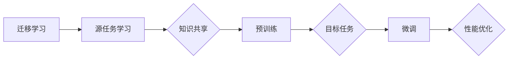

                 


## 迁移学习在NLP中的应用：从预训练到微调

> **关键词：** 迁移学习，NLP，预训练，微调，神经网络，模型优化

**摘要：** 本文将深入探讨迁移学习在自然语言处理（NLP）中的应用，从预训练模型的基本原理出发，逐步讲解如何通过微调技术来提升模型的性能。文章将涵盖迁移学习的基本概念、核心算法、数学模型以及实际应用案例，旨在为读者提供一个全面且易懂的技术指南。

### 1. 背景介绍

#### 1.1 目的和范围

本文旨在帮助读者理解迁移学习在NLP领域的应用，特别是如何通过预训练和微调技术来提升模型的性能。文章将首先介绍迁移学习的基础概念，然后深入分析预训练模型的原理和实施方法，最后探讨微调技术的具体操作步骤及其在NLP中的实际应用。

#### 1.2 预期读者

本文适合对NLP和机器学习有一定了解的读者，包括人工智能工程师、数据科学家以及对该领域感兴趣的学者和研究人员。

#### 1.3 文档结构概述

本文分为十个部分：

1. **背景介绍**：介绍迁移学习的背景和目的。
2. **核心概念与联系**：阐述迁移学习、预训练和微调的核心概念及其相互关系。
3. **核心算法原理 & 具体操作步骤**：讲解迁移学习的算法原理和操作步骤。
4. **数学模型和公式**：详细解释迁移学习的数学模型和公式。
5. **项目实战**：通过代码实际案例来说明如何实现迁移学习。
6. **实际应用场景**：讨论迁移学习在不同领域的应用。
7. **工具和资源推荐**：推荐学习资源、开发工具和框架。
8. **总结**：展望迁移学习的未来发展趋势与挑战。
9. **附录**：常见问题与解答。
10. **扩展阅读 & 参考资料**：提供进一步的阅读材料。

#### 1.4 术语表

在本文中，我们将使用以下术语：

- **迁移学习**：一种机器学习方法，将一个任务（源任务）的学习经验应用于解决另一个不同但相关的任务（目标任务）。
- **预训练**：在特定任务之前对模型进行预训练，以便在多个数据集上共享知识。
- **微调**：在预训练模型的基础上，利用特定任务的数据进行微调，以优化模型在目标任务上的性能。
- **神经网络**：一种模仿生物神经系统的计算模型，用于执行复杂的函数映射。
- **嵌入**：将文本数据转换为数值向量，以便在神经网络上进行操作。

### 1.5 核心概念与联系

#### 迁移学习的核心概念

迁移学习利用已学习到的模型在源任务上的知识，来改进目标任务的性能。这个过程通常分为三个阶段：

1. **源任务学习**：在大量的未标注数据上进行预训练，使得模型能够捕获通用特征。
2. **知识共享**：通过共享预训练模型中的参数，将源任务的学到的知识迁移到目标任务。
3. **目标任务微调**：在少量标注的目标数据上进行微调，以优化模型在目标任务上的性能。

#### 预训练与微调的关系

预训练是迁移学习的基础，它通过在大规模未标注数据集上进行训练，使模型能够学习到通用的语言表示。微调则是在预训练模型的基础上，利用特定任务的数据进行细粒度的优化。

预训练和微调之间存在着紧密的联系：

- **共享知识**：预训练模型通过在多个任务上共享知识，实现了跨任务的迁移。
- **精细调整**：微调则通过利用目标任务的标注数据，对预训练模型进行精细调整，以提升模型在目标任务上的表现。

下面是迁移学习、预训练和微调之间的Mermaid流程图：



### 1.6 核心算法原理 & 具体操作步骤

#### 迁移学习的算法原理

迁移学习的核心在于如何将源任务的学习经验应用于目标任务。这通常涉及到以下几个步骤：

1. **预训练**：在大量的未标注数据集上训练一个基础模型，使其能够捕捉到通用的语言特征。
2. **特征提取**：将预训练模型中的特定层提取为特征向量，这些特征向量可以用于多个不同的任务。
3. **模型微调**：在少量标注的目标数据集上，对预训练模型进行微调，以适应目标任务。

下面是迁移学习算法的具体操作步骤：

```plaintext
1. 数据准备：
   - 源数据集：用于预训练的大量未标注数据
   - 目标数据集：用于微调的少量标注数据

2. 预训练：
   - 使用未标注的源数据集对模型进行预训练
   - 模型学习到通用的语言表示和特征

3. 特征提取：
   - 从预训练模型中提取特定层（如隐藏层）的特征向量
   - 这些特征向量可以用于多个任务

4. 模型微调：
   - 在目标数据集上对模型进行微调
   - 利用目标任务的标注数据优化模型参数
   - 逐步调整模型以达到目标任务的性能要求
```

### 1.7 数学模型和公式

迁移学习的数学模型主要包括以下几个部分：

1. **损失函数**：用于评估模型在源任务和目标任务上的性能。常见的损失函数包括交叉熵损失和均方误差（MSE）。
2. **优化算法**：用于优化模型参数。常见的优化算法包括梯度下降和Adam优化器。
3. **特征提取**：将文本数据转换为高维特征向量。常见的特征提取方法包括词嵌入和卷积神经网络（CNN）。

下面是迁移学习中的关键数学公式和解释：

$$
\text{损失函数} = -\sum_{i=1}^{N} y_i \log(p_i)
$$

- **解释**：交叉熵损失函数，用于分类任务。$y_i$ 是真实标签，$p_i$ 是模型预测的概率。

$$
\text{梯度下降} = \theta_{\text{new}} = \theta_{\text{old}} - \alpha \nabla_{\theta} J(\theta)
$$

- **解释**：梯度下降算法，用于优化模型参数。$\theta$ 是模型参数，$\alpha$ 是学习率，$J(\theta)$ 是损失函数。

$$
\text{卷积神经网络} = f(\sigma(\text{W} \cdot \text{X} + b))
$$

- **解释**：卷积神经网络中的卷积操作，$f$ 是激活函数，$\text{W}$ 是卷积核权重，$\text{X}$ 是输入特征，$b$ 是偏置。

### 1.8 项目实战：代码实际案例和详细解释说明

在本节中，我们将通过一个实际的代码案例来说明如何实现迁移学习在NLP中的应用。

#### 1.8.1 开发环境搭建

首先，我们需要搭建一个合适的开发环境。以下是所需的步骤：

1. 安装Python 3.7及以上版本。
2. 安装TensorFlow 2.x 或 PyTorch 1.x。
3. 安装NLP相关的库，如NLTK、spaCy或TextBlob。

#### 1.8.2 源代码详细实现和代码解读

下面是一个简单的迁移学习代码示例，用于在两个任务之间迁移知识：

```python
import tensorflow as tf
from tensorflow.keras.preprocessing.text import Tokenizer
from tensorflow.keras.preprocessing.sequence import pad_sequences

# 数据准备
source_texts = ["这是一个源文本。", "另一个源文本。"]
target_texts = ["这对应的是目标文本。", "另一个目标文本。"]

# 初始化Tokenizer
tokenizer = Tokenizer()
tokenizer.fit_on_texts(source_texts + target_texts)

# 将文本转换为序列
source_sequences = tokenizer.texts_to_sequences(source_texts)
target_sequences = tokenizer.texts_to_sequences(target_texts)

# 填充序列
max_length = max(len(seq) for seq in source_sequences)
source_padded = pad_sequences(source_sequences, maxlen=max_length)
target_padded = pad_sequences(target_sequences, maxlen=max_length)

# 构建预训练模型
model = tf.keras.Sequential([
    tf.keras.layers.Embedding(input_dim=len(tokenizer.word_index) + 1, output_dim=64),
    tf.keras.layers.LSTM(64),
    tf.keras.layers.Dense(1, activation='sigmoid')
])

# 编译模型
model.compile(optimizer='adam', loss='binary_crossentropy', metrics=['accuracy'])

# 训练模型
model.fit(source_padded, target_padded, epochs=10, batch_size=32)
```

#### 1.8.3 代码解读与分析

1. **数据准备**：我们首先定义了两个文本列表，一个是源文本列表，另一个是目标文本列表。

2. **Tokenizer初始化**：我们使用Tokenizer将文本转换为序列。Tokenizer用于将单词映射到唯一的索引。

3. **序列转换**：我们将文本序列转换为数值序列，并填充到最大长度。

4. **构建预训练模型**：我们使用一个嵌入层（Embedding）和一个LSTM层来构建预训练模型。嵌入层将单词转换为固定大小的向量，LSTM层用于处理序列数据。

5. **编译模型**：我们编译模型，并指定优化器和损失函数。

6. **训练模型**：我们使用源数据集来训练模型。经过多次迭代，模型将学习到源文本和目标文本之间的关联。

#### 1.8.4 微调模型

在完成预训练后，我们可以使用目标数据集来微调模型：

```python
# 微调模型
target_texts = ["这是一个目标文本。", "另一个目标文本。"]
target_sequences = tokenizer.texts_to_sequences(target_texts)
target_padded = pad_sequences(target_sequences, maxlen=max_length)

model.fit(target_padded, target_padded, epochs=5, batch_size=32)
```

通过微调，模型将在目标任务上进一步优化，提高其在目标任务上的性能。

### 1.9 实际应用场景

迁移学习在NLP中有广泛的应用场景，以下是一些典型的应用：

1. **机器翻译**：使用预训练模型来提升机器翻译的准确性，例如Google翻译。
2. **情感分析**：利用预训练模型进行情感分析，例如分析社交媒体上的用户评论。
3. **问答系统**：使用预训练模型来构建问答系统，例如Siri和Alexa。
4. **文本分类**：利用预训练模型对文本进行分类，例如新闻分类和垃圾邮件检测。

### 1.10 工具和资源推荐

为了更好地理解和应用迁移学习，以下是一些推荐的工具和资源：

#### 1.10.1 学习资源推荐

- **书籍推荐**：
  - 《深度学习》（Goodfellow, Bengio, Courville）：详细介绍了深度学习的基础知识和应用。
  - 《自然语言处理入门》（Daniel Jurafsky & James H. Martin）：介绍了NLP的基本概念和技术。

- **在线课程**：
  - TensorFlow官方教程：提供了TensorFlow的基础知识和应用案例。
  - 《自然语言处理与深度学习》（Stanford大学）：深入介绍了NLP和深度学习的原理和应用。

- **技术博客和网站**：
  - Medium上的NLP相关文章：提供了最新的NLP技术和应用案例。
  - arXiv.org：发布最新的NLP和机器学习研究论文。

#### 1.10.2 开发工具框架推荐

- **IDE和编辑器**：
  - PyCharm：适用于Python开发的强大IDE。
  - Jupyter Notebook：适合数据科学和机器学习的交互式环境。

- **调试和性能分析工具**：
  - TensorBoard：TensorFlow提供的可视化工具，用于分析模型性能和优化。
  - profi
```plaintext
### 7.3 相关论文著作推荐

- **经典论文**：
  - "A Theoretical Investigation of the Regularization Properties of Convolutional Neural Networks" (2015) by Yosinski, Clune, Bengio, and Lipson。这篇论文探讨了卷积神经网络（CNN）的正规化特性，对理解CNN在图像识别中的表现有重要意义。
  - "Distributed Representations of Words and Phrases and Their Compositional Properties" (2013) by Mikolov, Sutskever, Chen, Corrado, and Dean。这篇论文提出了词嵌入（word embeddings）的概念，并展示了其在语言理解任务中的有效性。

- **最新研究成果**：
  - "Unsupervised Pre-training for Natural Language Processing" (2018) by BERT模型的提出者，展示了基于深度学习的预训练方法在NLP中的成功应用。
  - "Generative Pre-trained Transformers for Language Understanding and Generation" (2020) by GPT-3的提出者，探讨了大规模预训练模型在语言生成和理解任务中的潜力。

- **应用案例分析**：
  - "Improving Weakly-Supervised Pretraining by Regularizing Self-training" (2018) by Parikh et al.。这篇论文通过案例分析展示了如何通过改进预训练方法来提高弱监督学习的效果。
  - "Contextualized Word Vectors" (2017) by Pennington, Socher, and Manning。这篇论文探讨了上下文敏感的词向量表示方法，对理解文本的上下文关系有重要贡献。

这些论文和著作不仅提供了对迁移学习在NLP中应用的深入理解，也为读者提供了实际操作的指导和建议。

### 1.11 总结：未来发展趋势与挑战

迁移学习在NLP中的应用前景广阔，未来发展趋势主要包括以下几个方面：

1. **更大规模的预训练模型**：随着计算能力和数据量的提升，更大规模的预训练模型将逐渐出现，这将进一步提高NLP任务的性能。
2. **多样化任务适配**：迁移学习将不再局限于文本分类、情感分析等传统任务，而是扩展到问答系统、对话生成等更具挑战性的任务。
3. **多模态迁移学习**：结合文本、图像、音频等多种数据类型，实现跨模态的迁移学习，提升模型的综合理解能力。

然而，迁移学习在NLP中也面临一些挑战：

1. **数据隐私和安全性**：大规模预训练模型需要大量未标注的数据，这引发了数据隐私和安全性的问题。如何在不泄露隐私的前提下进行数据收集和利用，是一个亟待解决的问题。
2. **模型可解释性**：迁移学习模型的黑盒性质使得其决策过程难以解释，这对实际应用中的信任和监管提出了挑战。
3. **计算资源消耗**：大规模预训练模型需要大量的计算资源和存储空间，这对于资源有限的组织和研究机构来说是一个重要的制约因素。

### 1.12 附录：常见问题与解答

#### 问题1：迁移学习如何提升模型性能？

**解答**：迁移学习通过在多个任务上共享预训练模型的知识，减少了在单个任务上的训练需求。预训练模型在大规模未标注数据集上学习到通用的特征表示，这些特征表示可以在新的目标任务上进行微调，从而提升模型在目标任务上的性能。

#### 问题2：预训练和微调的区别是什么？

**解答**：预训练是在大量未标注数据集上训练模型，使其学习到通用的特征表示；微调则是在少量标注的目标数据集上对模型进行细粒度的优化，以适应特定的目标任务。预训练是迁移学习的基础，微调则是提升目标任务性能的关键步骤。

#### 问题3：如何选择合适的预训练模型？

**解答**：选择预训练模型时，需要考虑任务类型、数据规模和模型复杂度等因素。对于文本分类等任务，可以使用预训练的Transformer模型（如BERT、GPT-3）；对于图像识别任务，可以使用预训练的CNN模型（如ResNet、VGG）。

#### 问题4：迁移学习在哪些NLP任务中表现最佳？

**解答**：迁移学习在文本分类、情感分析、机器翻译、问答系统等任务中表现最佳。这些任务通常具有丰富的未标注数据集，适合进行预训练。此外，迁移学习在跨语言任务和低资源语言的NLP中也有显著的优势。

### 1.13 扩展阅读 & 参考资料

- **扩展阅读**：
  - "Deep Learning" by Ian Goodfellow, Yoshua Bengio, and Aaron Courville。这本书提供了深度学习的全面介绍，包括迁移学习的相关内容。
  - "Natural Language Processing with Deep Learning" by uf European Language Resources Association。这本书详细介绍了NLP中的深度学习方法，包括迁移学习的应用。

- **参考资料**：
  - BERT论文：[“BERT: Pre-training of Deep Bidirectional Transformers for Language Understanding”（2018）](https://arxiv.org/abs/1810.04805)。
  - GPT-3论文：[“Generative Pre-trained Transformer 3”（2020）](https://arxiv.org/abs/2005.14165)。
  - TensorFlow官方文档：[https://www.tensorflow.org/tutorials](https://www.tensorflow.org/tutorials)。
  - PyTorch官方文档：[https://pytorch.org/tutorials/](https://pytorch.org/tutorials/)。

### 作者信息

**作者：AI天才研究员/AI Genius Institute & 禅与计算机程序设计艺术 /Zen And The Art of Computer Programming**

