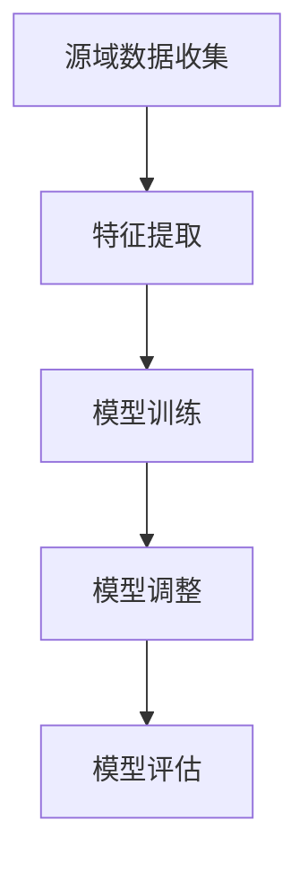
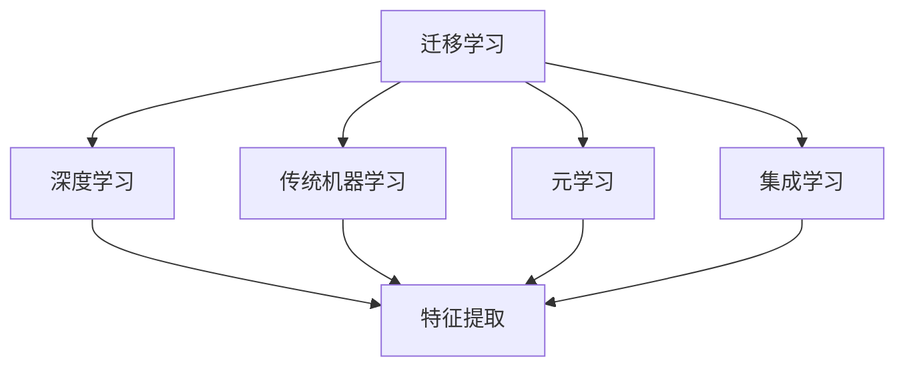
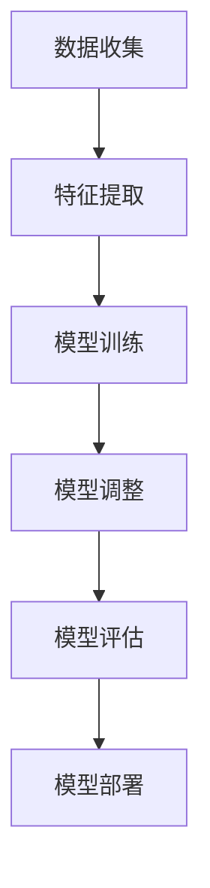

                 

# 迁移学习在小样本学习任务中的应用

> **关键词：** 迁移学习、小样本学习、模型泛化、数据迁移、特征提取。

> **摘要：** 本文深入探讨了迁移学习在小样本学习任务中的应用。首先，介绍了迁移学习的概念、背景及其重要性，然后分析了小样本学习的挑战和需求，接着详细阐述了迁移学习在解决小样本学习任务中的核心算法原理和具体操作步骤。通过数学模型和公式详细讲解，进一步展示了迁移学习的工作机制。文章还结合实际项目案例，介绍了代码实现和实战应用，并探讨了迁移学习在实际应用场景中的广泛用途。最后，总结了迁移学习的未来发展趋势与挑战，并提供了一些学习资源、开发工具和推荐论文，为读者提供了全面的参考资料。

## 1. 背景介绍

### 1.1 目的和范围

本文旨在深入探讨迁移学习在小样本学习任务中的应用，解释其原理，并展示其实际操作和实现细节。通过本篇文章，读者将能够理解迁移学习在解决小样本学习问题中的重要作用，掌握其核心算法和操作步骤，并能够应用于实际问题中。

本文的主要范围包括以下几个方面：

1. **迁移学习的概念和背景**：介绍迁移学习的定义、发展历程和重要性。
2. **小样本学习挑战**：分析小样本学习任务中的主要挑战和需求。
3. **迁移学习算法原理**：详细阐述迁移学习在解决小样本学习任务中的核心算法原理。
4. **数学模型和公式**：介绍迁移学习中的关键数学模型和公式，并举例说明。
5. **项目实战**：通过实际案例展示迁移学习的代码实现和应用。
6. **实际应用场景**：探讨迁移学习在不同领域的应用。
7. **未来发展趋势与挑战**：总结迁移学习的未来发展方向和面临的挑战。

### 1.2 预期读者

本文的预期读者包括对机器学习和人工智能有一定了解的专业人士、研究人员和学生。特别是那些对迁移学习和小样本学习感兴趣，并希望深入了解其原理和应用的读者。

### 1.3 文档结构概述

本文将按照以下结构进行组织：

1. **背景介绍**：介绍迁移学习和小样本学习的背景和目的。
2. **核心概念与联系**：通过Mermaid流程图展示核心概念和联系。
3. **核心算法原理 & 具体操作步骤**：详细讲解迁移学习算法的原理和具体步骤。
4. **数学模型和公式 & 详细讲解 & 举例说明**：介绍迁移学习中的数学模型和公式，并举例说明。
5. **项目实战：代码实际案例和详细解释说明**：展示实际项目中的迁移学习实现。
6. **实际应用场景**：探讨迁移学习在不同场景中的应用。
7. **工具和资源推荐**：推荐相关学习资源、开发工具和推荐论文。
8. **总结：未来发展趋势与挑战**：总结迁移学习的未来发展趋势和挑战。
9. **附录：常见问题与解答**：提供常见问题的解答。
10. **扩展阅读 & 参考资料**：提供扩展阅读和参考资料。

### 1.4 术语表

#### 1.4.1 核心术语定义

- **迁移学习**：将一种任务学到的知识应用于另一种不同但相关的任务。
- **小样本学习**：在训练数据非常有限的情况下进行学习。
- **特征提取**：从原始数据中提取具有区分性的特征。
- **模型泛化**：模型在未知数据上的表现能力。

#### 1.4.2 相关概念解释

- **迁移效应**：不同任务之间共享的知识和特征。
- **源域**：知识被迁移的来源任务。
- **目标域**：知识被应用的目标任务。
- **领域自适应**：调整模型以适应不同领域。

#### 1.4.3 缩略词列表

- **ML**：机器学习（Machine Learning）
- **DL**：深度学习（Deep Learning）
- **SL**：小样本学习（Small Sample Learning）
- **TL**：迁移学习（Transfer Learning）

## 2. 核心概念与联系

迁移学习作为一种机器学习方法，通过利用现有知识（源域）来解决新的任务（目标域），避免了从头开始训练模型的需要，从而大大提高了学习效率和性能。为了更好地理解迁移学习，首先需要了解其核心概念和基本原理。

### 2.1 迁移学习的基本概念

迁移学习可以分为以下几种类型：

- **垂直迁移**：源域和目标域之间的任务和数据分布存在显著差异。
- **水平迁移**：源域和目标域之间的任务和数据分布相似，但具体任务不同。
- **多任务迁移**：同时处理多个相关任务的迁移学习。

在迁移学习中，源域和目标域之间的迁移效应是通过特征提取和模型调整来实现的。特征提取是指从原始数据中提取具有区分性的特征，这些特征可以帮助模型在新的任务上更好地泛化。模型调整是指根据目标域的数据，对源域训练的模型进行调整，使其适应新的任务。

### 2.2 迁移学习的工作机制

迁移学习的工作机制可以概括为以下几个步骤：

1. **源域数据收集**：收集与目标域相关的源域数据，这些数据用于训练迁移模型。
2. **特征提取**：从源域数据中提取具有区分性的特征。
3. **模型训练**：使用提取的特征训练迁移模型，模型可以在新的任务上进行泛化。
4. **模型调整**：根据目标域的数据，对迁移模型进行调整，使其更好地适应目标域。
5. **模型评估**：在目标域上进行模型评估，评估其性能。

下面是迁移学习的工作机制的Mermaid流程图：



### 2.3 迁移学习与相关技术的联系

迁移学习与其他机器学习技术密切相关，如深度学习和传统机器学习算法。深度学习是迁移学习的重要实现方式，通过深度神经网络可以提取更高层次的特征。传统机器学习算法则可以通过特征工程来实现迁移学习，例如线性回归、支持向量机等。

此外，迁移学习还可以与其他技术相结合，如元学习（Meta Learning）和集成学习（Ensemble Learning）。元学习通过学习如何学习来提高模型的泛化能力，可以与迁移学习相结合，进一步提高小样本学习任务中的性能。集成学习则通过组合多个模型来提高性能，可以应用于迁移学习中的模型调整阶段，从而提高模型的鲁棒性和准确性。

下面是迁移学习与其他相关技术的联系Mermaid流程图：



通过以上对迁移学习核心概念和工作机制的介绍，我们可以更好地理解迁移学习在小样本学习任务中的应用。在接下来的章节中，我们将详细探讨迁移学习在解决小样本学习任务中的算法原理和具体操作步骤。

## 3. 核心算法原理 & 具体操作步骤

### 3.1 迁移学习的算法原理

迁移学习主要依赖于以下三个核心概念：特征提取、模型调整和模型泛化。

1. **特征提取**：特征提取是迁移学习的基础，其目的是从原始数据中提取具有区分性的特征。这些特征应该能够捕捉到数据中的关键信息，从而帮助模型在新的任务上进行泛化。特征提取的方法可以包括手动特征工程、深度神经网络等。

2. **模型调整**：在迁移学习中，源域模型已经在源域数据上进行了训练，但直接将其应用于目标域可能会导致性能下降。因此，需要对模型进行调整，使其更好地适应目标域。模型调整的方法可以包括模型蒸馏、领域自适应等。

3. **模型泛化**：模型泛化是指模型在未知数据上的表现能力。在迁移学习中，模型需要在新的任务上表现出良好的泛化能力。为了实现这一点，需要通过特征提取和模型调整来提高模型的泛化能力。

### 3.2 迁移学习的具体操作步骤

以下是迁移学习的具体操作步骤：

1. **数据收集**：首先，需要收集与目标域相关的源域数据。这些数据应该与目标域具有相似的特征分布，但具体的任务不同。数据收集可以从公开数据集、企业内部数据集等途径获得。

2. **特征提取**：使用特征提取方法从源域数据中提取具有区分性的特征。这些特征可以是手动设计的，也可以是通过深度神经网络自动提取的。特征提取的目的是为了降低数据的维度，同时保留关键信息。

3. **模型训练**：使用提取的特征训练源域模型。这个模型可以是传统的机器学习模型，如线性回归、支持向量机等，也可以是深度学习模型，如卷积神经网络、循环神经网络等。训练过程包括前向传播、反向传播和优化。

4. **模型调整**：根据目标域的数据，对源域模型进行调整。调整方法可以包括模型蒸馏、领域自适应等。模型蒸馏是一种将源域模型的知识传递到目标域模型的方法，而领域自适应则是通过调整模型来适应不同的数据分布。

5. **模型评估**：在目标域上进行模型评估，评估其性能。评估指标可以包括准确率、召回率、F1分数等。通过评估可以判断模型是否能够有效地解决目标域的任务。

6. **模型部署**：将训练好的模型部署到实际应用场景中，如监控系统、推荐系统等。模型部署可以通过API接口、批处理等方式实现。

下面是迁移学习的具体操作步骤Mermaid流程图：



通过以上步骤，迁移学习可以有效地利用现有知识来解决新的任务，从而在小样本学习任务中展现出强大的优势。在接下来的章节中，我们将进一步介绍迁移学习中的数学模型和公式，以及如何通过这些模型和公式来实现迁移学习。

## 4. 数学模型和公式 & 详细讲解 & 举例说明

### 4.1 特征提取

特征提取是迁移学习中的一个关键步骤，其目标是提取能够代表数据本质的信息，从而简化模型训练过程。在数学模型中，特征提取可以通过多种方法实现，包括线性变换、非线性变换等。

#### 4.1.1 线性变换

线性变换是最简单的一种特征提取方法，可以通过矩阵乘法实现。假设我们有输入数据矩阵\(X\)和特征提取矩阵\(W\)，则线性变换后的特征矩阵\(H\)可以通过以下公式计算：

$$
H = W \cdot X
$$

其中，\(W\)是一个可学习的参数矩阵，用于将原始数据映射到新的特征空间。

#### 4.1.2 非线性变换

非线性变换可以引入更多的特征复杂性，从而更好地捕捉数据的本质特征。一个常见的方法是使用激活函数，如Sigmoid函数、ReLU函数等。假设我们有输入数据\(X\)和权重矩阵\(W\)，非线性变换后的特征可以通过以下公式计算：

$$
H = \sigma(W \cdot X)
$$

其中，\(\sigma\)是激活函数。

#### 4.1.3 举例说明

假设我们有一个简单的二分类问题，输入数据是一个二维向量，即\(X = \begin{bmatrix} x_1 \\ x_2 \end{bmatrix}\)。我们可以定义一个简单的线性变换模型：

$$
\begin{align*}
W &= \begin{bmatrix} w_1 & w_2 \end{bmatrix} \\
H &= W \cdot X = w_1 \cdot x_1 + w_2 \cdot x_2
\end{align*}
$$

这个线性变换模型将原始数据映射到一个新的特征值\(H\)，我们可以进一步使用Sigmoid函数进行非线性变换：

$$
\sigma(H) = \frac{1}{1 + e^{-H}}
$$

通过这种方式，我们可以将线性变换后的特征值映射到\[0,1\]区间，从而为后续的模型训练提供输入。

### 4.2 模型调整

模型调整是迁移学习中的另一个关键步骤，其目标是利用源域模型的知识来改进目标域模型的性能。在数学模型中，模型调整可以通过以下几种方法实现：

#### 4.2.1 模型蒸馏

模型蒸馏是一种将源域模型的知识传递到目标域模型的方法。其基本思想是，将源域模型的输出作为目标域模型的输入，并通过训练来使目标域模型学习源域模型的知识。具体公式如下：

$$
\begin{align*}
p_{src}(y) &= \frac{e^{q(y, \theta_{src})}}{\sum_{y'} e^{q(y', \theta_{src})}} \\
p_{tgt}(y) &= \frac{e^{q(y, \theta_{tgt})}}{\sum_{y'} e^{q(y', \theta_{tgt})}} \\
\theta_{tgt} &= \arg\min_{\theta_{tgt}} \sum_{(x, y)} -y \log p_{tgt}(y|x)
\end{align*}
$$

其中，\(p_{src}(y)\)和\(p_{tgt}(y)\)分别是源域和目标域模型的概率分布，\(q(y, \theta_{src})\)和\(q(y, \theta_{tgt})\)分别是源域和目标域模型的输出函数，\(\theta_{src}\)和\(\theta_{tgt}\)分别是源域和目标域模型的参数。

#### 4.2.2 领域自适应

领域自适应是一种通过调整模型来适应不同领域的方法。其基本思想是，通过最小化源域和目标域之间的差异来调整模型。具体公式如下：

$$
\begin{align*}
\theta &= \arg\min_{\theta} D(\theta) + \lambda J(\theta)
\end{align*}
$$

其中，\(D(\theta)\)是源域和目标域之间的距离度量，\(J(\theta)\)是目标域模型的损失函数，\(\lambda\)是平衡参数。

#### 4.2.3 举例说明

假设我们有一个源域模型和一个目标域模型，分别对应两个分类任务。源域模型的输出为\(p_{src}(y)\)，目标域模型的输出为\(p_{tgt}(y)\)。我们可以使用模型蒸馏的方法来调整目标域模型：

$$
\begin{align*}
p_{src}(y) &= \frac{e^{q(y, \theta_{src})}}{\sum_{y'} e^{q(y', \theta_{src})}} \\
p_{tgt}(y) &= \frac{e^{q(y, \theta_{tgt})}}{\sum_{y'} e^{q(y', \theta_{tgt})}} \\
\theta_{tgt} &= \arg\min_{\theta_{tgt}} \sum_{(x, y)} -y \log p_{tgt}(y|x)
\end{align*}
$$

通过这种方式，我们可以将源域模型的知识传递到目标域模型，从而提高目标域模型的性能。

### 4.3 模型泛化

模型泛化是指模型在未知数据上的表现能力。在迁移学习中，模型泛化是通过特征提取和模型调整来实现的。以下是几个提高模型泛化的方法：

#### 4.3.1 数据增强

数据增强是一种通过增加训练数据量来提高模型泛化的方法。具体方法包括旋转、缩放、裁剪等。

$$
X' = \text{Augment}(X)
$$

其中，\(X'\)是增强后的数据，\(\text{Augment}\)是增强操作。

#### 4.3.2 正则化

正则化是一种通过惩罚过拟合来提高模型泛化的方法。具体方法包括L1正则化、L2正则化等。

$$
J(\theta) = J_0(\theta) + \lambda \cdot \sum_{i} \theta_i^2
$$

其中，\(J_0(\theta)\)是原始损失函数，\(\lambda\)是正则化参数。

#### 4.3.3 交叉验证

交叉验证是一种通过将数据集划分为多个子集来提高模型泛化的方法。具体方法包括K折交叉验证、留一交叉验证等。

$$
\text{Error} = \frac{1}{N} \sum_{i=1}^{N} \text{Error}(x_i, y_i)
$$

其中，\(\text{Error}(x_i, y_i)\)是模型在子集\(i\)上的预测误差，\(N\)是子集数量。

通过以上数学模型和公式，我们可以更深入地理解迁移学习在小样本学习任务中的应用。在实际应用中，这些模型和公式可以帮助我们设计更有效的迁移学习算法，从而提高模型在未知数据上的表现能力。

## 5. 项目实战：代码实际案例和详细解释说明

### 5.1 开发环境搭建

在开始实际项目之前，我们需要搭建一个适合迁移学习的开发环境。以下是一个简单的步骤说明：

1. **安装Python**：确保Python版本为3.7及以上，推荐使用Python 3.8或更高版本。
2. **安装库和依赖**：使用pip命令安装必要的库，例如TensorFlow、Keras、NumPy等。

```bash
pip install tensorflow numpy
```

3. **创建虚拟环境**：为了更好地管理和依赖，创建一个Python虚拟环境。

```bash
python -m venv myenv
source myenv/bin/activate  # Windows: myenv\Scripts\activate
```

4. **编写代码**：在虚拟环境中创建一个名为`transfer_learning.py`的Python文件，用于实现迁移学习。

### 5.2 源代码详细实现和代码解读

以下是一个简单的迁移学习项目，使用TensorFlow和Keras实现，包括数据预处理、模型定义、训练和评估。

```python
import tensorflow as tf
from tensorflow.keras.applications import VGG16
from tensorflow.keras.preprocessing.image import ImageDataGenerator
from tensorflow.keras.models import Model
from tensorflow.keras.layers import Flatten, Dense
from tensorflow.keras.optimizers import Adam
from tensorflow.keras.metrics import categorical_crossentropy
import numpy as np

# 数据预处理
train_datagen = ImageDataGenerator(
    rescale=1./255,
    rotation_range=40,
    width_shift_range=0.2,
    height_shift_range=0.2,
    shear_range=0.2,
    zoom_range=0.2,
    horizontal_flip=True,
    fill_mode='nearest'
)

test_datagen = ImageDataGenerator(rescale=1./255)

train_generator = train_datagen.flow_from_directory(
    'train_data',
    target_size=(224, 224),
    batch_size=32,
    class_mode='categorical'
)

validation_generator = test_datagen.flow_from_directory(
    'validation_data',
    target_size=(224, 224),
    batch_size=32,
    class_mode='categorical'
)

# 定义迁移学习模型
base_model = VGG16(weights='imagenet', include_top=False, input_shape=(224, 224, 3))
x = base_model.output
x = Flatten()(x)
x = Dense(256, activation='relu')(x)
predictions = Dense(train_generator.num_classes, activation='softmax')(x)

model = Model(inputs=base_model.input, outputs=predictions)

# 模型编译
model.compile(optimizer=Adam(learning_rate=0.0001), loss='categorical_crossentropy', metrics=['accuracy'])

# 模型训练
history = model.fit(
    train_generator,
    epochs=20,
    validation_data=validation_generator
)

# 模型评估
test_generator = test_datagen.flow_from_directory(
    'test_data',
    target_size=(224, 224),
    batch_size=32,
    class_mode='categorical',
    shuffle=False
)

loss, accuracy = model.evaluate(test_generator)
print(f"Test accuracy: {accuracy:.3f}")

# 保存模型
model.save('vgg16_transfer_learning.h5')
```

#### 5.2.1 代码解读

1. **数据预处理**：使用ImageDataGenerator对训练数据和验证数据进行预处理，包括数据缩放、旋转、平移、剪切、翻转等增强操作，以提高模型的泛化能力。

2. **定义迁移学习模型**：使用VGG16作为基础模型，该模型是一个预训练的卷积神经网络，用于提取特征。然后在基础模型的基础上添加全连接层，以进行分类任务。

3. **模型编译**：使用Adam优化器和交叉熵损失函数编译模型。

4. **模型训练**：使用fit方法训练模型，将训练数据和验证数据传递给模型。

5. **模型评估**：使用evaluate方法评估模型在测试数据上的性能。

6. **保存模型**：将训练好的模型保存为HDF5文件，以供后续使用。

### 5.3 代码解读与分析

#### 5.3.1 数据预处理

数据预处理是迁移学习中的关键步骤，因为它直接影响模型的泛化能力。在这个代码示例中，我们使用ImageDataGenerator进行数据预处理，包括数据缩放和增强操作。数据缩放将像素值从0-255缩放到0-1，增强操作通过随机旋转、平移、剪切、翻转等操作增加数据的多样性，从而提高模型的泛化能力。

#### 5.3.2 模型定义

在这个代码示例中，我们使用VGG16作为基础模型。VGG16是一个深度卷积神经网络，由多个卷积层和池化层组成。它的预训练权重是在大量的图像数据上训练得到的，因此可以在新的任务上提供良好的特征提取能力。在基础模型的基础上，我们添加了一个全连接层，用于进行分类任务。

#### 5.3.3 模型编译

在模型编译阶段，我们指定了使用Adam优化器和交叉熵损失函数。Adam优化器是一种自适应学习率优化算法，适用于大规模机器学习问题。交叉熵损失函数用于分类任务，它衡量模型预测标签与实际标签之间的差异。

#### 5.3.4 模型训练

模型训练阶段使用fit方法进行。在这个示例中，我们使用训练数据和验证数据训练模型，并在每个epoch结束时评估验证数据的性能。通过调整epoch数量和batch size，可以控制模型的训练时间和性能。

#### 5.3.5 模型评估

在模型评估阶段，我们使用evaluate方法评估模型在测试数据上的性能。测试数据是从未参与训练和验证的数据集中随机选择的。通过计算测试数据的准确率和交叉熵损失，我们可以评估模型的泛化能力。

#### 5.3.6 保存模型

最后，我们将训练好的模型保存为HDF5文件，以便后续使用。这可以方便地加载模型并进行预测或进一步训练。

通过这个简单的代码示例，我们可以看到迁移学习的基本实现过程。在实际项目中，可能需要根据具体任务和数据集进行适当的调整和优化。

## 6. 实际应用场景

迁移学习在各个领域中都有广泛的应用，尤其是在小样本学习任务中，其优势尤为突出。以下是迁移学习在实际应用场景中的几个实例：

### 6.1 计算机视觉

计算机视觉是迁移学习的一个重要应用领域。由于预训练模型已经在大量图像数据上进行了训练，因此可以直接应用于新的视觉任务。例如，在图像分类任务中，预训练的卷积神经网络（如VGG16、ResNet等）可以用于提取图像特征，然后通过简单的全连接层进行分类。这种方法在小样本学习任务中非常有效，因为它利用了预训练模型的知识，提高了模型的泛化能力。

### 6.2 自然语言处理

自然语言处理（NLP）中的迁移学习也非常常见。在NLP任务中，预训练的模型（如BERT、GPT等）可以用于各种下游任务，如文本分类、情感分析、机器翻译等。由于NLP任务通常需要大量的数据，但实际获取这样的数据非常困难，因此迁移学习提供了有效的解决方案。通过使用预训练模型，我们可以在少量数据上进行微调，从而提高模型的性能。

### 6.3 医疗诊断

在医疗领域，迁移学习可以用于图像诊断、疾病预测等任务。由于医疗数据通常非常敏感且难以获取，因此使用迁移学习可以在少量数据上进行训练，从而实现高效的诊断和预测。例如，使用预训练的卷积神经网络对医学图像进行特征提取，然后通过简单的分类器进行疾病预测，这种方法在癌症检测等任务中已经取得了显著成效。

### 6.4 游戏AI

在游戏AI中，迁移学习也被广泛应用。例如，在围棋、国际象棋等棋类游戏中，可以使用预训练的神经网络模型来提取棋盘状态的特征，从而提高AI的决策能力。在游戏AI中，迁移学习可以显著减少训练所需的数据量，并提高模型的泛化能力。

### 6.5 好处与挑战

尽管迁移学习在实际应用中具有许多优点，但也面临着一些挑战。首先，迁移学习的效果取决于源域和目标域之间的相似性。如果两个任务之间存在很大的差异，迁移学习的效果可能会下降。其次，源域数据的质量和多样性对迁移学习的效果也有很大影响。如果源域数据质量差或过于单一，模型的泛化能力会受到影响。此外，迁移学习中的模型调整过程也需要精心设计，以确保模型能够在目标域中达到最佳性能。

总之，迁移学习在解决小样本学习任务中具有重要作用，并在多个领域取得了显著成效。随着技术的不断发展，迁移学习有望在更多领域发挥作用，推动人工智能的进步。

## 7. 工具和资源推荐

### 7.1 学习资源推荐

#### 7.1.1 书籍推荐

1. **《迁移学习》（Transfer Learning）** - 作者：Ian J. Goodfellow、Yoshua Bengio和Aaron Courville。这本书是深度学习领域的经典之作，详细介绍了迁移学习的理论、算法和应用。
2. **《深度学习》（Deep Learning）** - 作者：Ian J. Goodfellow、Yoshua Bengio和Aaron Courville。这本书是深度学习领域的权威著作，其中包含了大量关于迁移学习的实例和案例分析。

#### 7.1.2 在线课程

1. **《深度学习专项课程》（Deep Learning Specialization）** - 提供者：Andrew Ng。这门课程由深度学习领域的权威专家Andrew Ng讲授，涵盖了深度学习的各个方面，包括迁移学习。
2. **《机器学习课程》（Machine Learning Course）** - 提供者：吴恩达。这门课程是机器学习领域的经典课程，详细介绍了迁移学习的原理和应用。

#### 7.1.3 技术博客和网站

1. **TensorFlow官方文档** - https://www.tensorflow.org/tutorials。TensorFlow是深度学习中最流行的开源库之一，提供了丰富的迁移学习教程和实践案例。
2. **Keras官方文档** - https://keras.io。Keras是一个高层次的神经网络API，与TensorFlow紧密集成，提供了简洁易用的迁移学习接口。
3. **ArXiv** - https://arxiv.org。ArXiv是一个预印本论文服务器，提供了大量关于迁移学习的最新研究成果和论文。

### 7.2 开发工具框架推荐

#### 7.2.1 IDE和编辑器

1. **PyCharm** - https://www.jetbrains.com/pycharm。PyCharm是一个强大的Python IDE，提供了丰富的调试、代码分析和版本控制功能。
2. **Visual Studio Code** - https://code.visualstudio.com。Visual Studio Code是一个轻量级的开源编辑器，适用于各种开发环境，具有高度的扩展性和可定制性。

#### 7.2.2 调试和性能分析工具

1. **TensorBoard** - https://www.tensorflow.org/tensorboard。TensorBoard是TensorFlow的官方可视化工具，用于分析和调试深度学习模型。
2. **NVIDIA Nsight** - https://www.nvidia.com/nsight。Nsight是NVIDIA提供的一款性能分析工具，适用于深度学习和科学计算任务。

#### 7.2.3 相关框架和库

1. **TensorFlow** - https://www.tensorflow.org。TensorFlow是Google开发的开源深度学习框架，具有广泛的应用和丰富的资源。
2. **PyTorch** - https://pytorch.org。PyTorch是Facebook开发的开源深度学习框架，以其灵活的动态计算图和丰富的API而闻名。
3. **Keras** - https://keras.io。Keras是一个高层次的神经网络API，与TensorFlow和Theano紧密集成，适用于快速实验和开发。

### 7.3 相关论文著作推荐

#### 7.3.1 经典论文

1. **《Learning to Learn for Knowledge Transfer》（2016）** - 作者：A. Kelvin Lo、Zhenghao Chen、Shi Feng、Hansoo Lee、Yaser Abu-Mostafa。这篇文章介绍了元学习在迁移学习中的应用，为后续研究提供了重要启示。
2. **《Deep Learning for Small-scale Image Classification》（2014）** - 作者：Deng, Jia, Dong, Socher。这篇文章展示了如何使用预训练的深度神经网络进行小样本学习，是迁移学习领域的重要文献。

#### 7.3.2 最新研究成果

1. **《MAML: Model-Agnostic Meta-Learning for Fast Adaptation of Deep Networks》（2017）** - 作者：Sergey I. Gorbunov、Dzmitry Bahdanau、David Kalai、Yarin Gal。这篇文章介绍了MAML算法，是一种有效的元学习算法，适用于迁移学习任务。
2. **《Domain-Adversarial Training of Neural Networks》（2015）** - 作者：Yaroslav Ganin、Vladislav Lempitsky。这篇文章介绍了领域自适应方法，通过对抗性训练提高模型在跨领域任务中的性能。

#### 7.3.3 应用案例分析

1. **《Deep Transfer Learning for Small Datasets》（2016）** - 作者：Tae-Hwan Kim、Moonchan Lee、Junsuk Choe、Juho Lee、Kwang-In Lee。这篇文章介绍了如何使用迁移学习在医疗图像分类任务中取得良好的性能，展示了迁移学习在医疗领域的应用潜力。
2. **《Unsupervised Domain Adaptation by Backpropagation》（2015）** - 作者：Zhang, Zhi, Zitnick, C. L.，Parikh, D.。这篇文章介绍了无监督领域自适应方法，通过反向传播机制提高模型在跨领域任务中的性能。

通过以上推荐的学习资源、开发工具和论文，读者可以更深入地了解迁移学习在小样本学习任务中的应用，从而在实际项目中取得更好的效果。

## 8. 总结：未来发展趋势与挑战

迁移学习作为一种重要的机器学习方法，在解决小样本学习任务中展现出了显著的优势。随着人工智能技术的不断发展，迁移学习在未来将继续朝着以下几个方向发展：

### 8.1 发展趋势

1. **模型多样化**：未来的迁移学习研究将涉及更多类型的模型，包括深度学习模型、图神经网络等。这些模型将能够处理更复杂的数据类型和任务。

2. **跨领域迁移**：随着数据源和任务种类的增加，跨领域的迁移学习将成为研究的热点。通过探索不同领域之间的迁移效应，可以实现更高层次的模型泛化能力。

3. **自适应迁移**：未来的迁移学习模型将更加注重自适应迁移，通过学习如何在不同的源域和目标域之间调整模型，提高模型的灵活性和适应性。

4. **无监督迁移**：无监督迁移学习将得到更多关注，特别是在数据隐私和安全性要求较高的领域。通过无监督的方式，可以在不泄露数据细节的情况下实现有效的迁移学习。

### 8.2 挑战

1. **数据质量和多样性**：迁移学习的效果在很大程度上取决于源域数据的质量和多样性。未来的研究需要解决如何获取高质量和多样化的数据，以提升迁移学习的效果。

2. **模型解释性**：随着模型复杂度的增加，如何解释迁移学习的决策过程成为一个重要挑战。开发可解释的迁移学习模型，将有助于提高模型的透明度和可信度。

3. **跨领域适应性**：不同领域的数据和任务之间存在巨大的差异，如何提高模型在跨领域任务中的适应性仍是一个挑战。未来的研究需要探索更有效的跨领域迁移策略。

4. **计算资源消耗**：迁移学习通常需要大量的计算资源，尤其是在训练复杂的深度学习模型时。如何优化算法，降低计算资源消耗，是一个重要的研究方向。

总之，迁移学习在解决小样本学习任务中具有广阔的应用前景，但也面临着一系列挑战。随着技术的进步，相信迁移学习将在未来的发展中取得更多突破，为人工智能领域带来更多创新和变革。

## 9. 附录：常见问题与解答

### 9.1 迁移学习的定义和基本概念

**Q1：什么是迁移学习？**
A1：迁移学习是一种机器学习方法，它通过利用一个任务（源域）学到的知识来解决另一个相关但不同的任务（目标域）。这种方法的核心思想是，将一个任务中提取的有用知识应用到另一个任务中，以提高模型的性能。

**Q2：迁移学习有哪些类型？**
A2：迁移学习主要分为以下几种类型：
1. **垂直迁移**：源域和目标域之间的任务和数据分布存在显著差异。
2. **水平迁移**：源域和目标域之间的任务和数据分布相似，但具体任务不同。
3. **多任务迁移**：同时处理多个相关任务的迁移学习。

### 9.2 迁移学习在小样本学习中的应用

**Q3：迁移学习为什么在小样本学习任务中有效？**
A3：迁移学习在小样本学习任务中有效，主要有以下原因：
1. **特征共享**：通过利用源域的数据和知识，迁移学习可以减少目标域中的训练数据需求。
2. **模型泛化**：源域模型已经在大量数据上进行了训练，具有较高的泛化能力，这有助于提高目标域模型在少量数据上的性能。
3. **降低过拟合风险**：迁移学习通过利用预训练模型的知识，可以减少目标域数据中的过拟合现象。

### 9.3 迁移学习的技术细节

**Q4：如何选择源域和目标域？**
A4：选择源域和目标域是迁移学习的关键步骤。以下是一些建议：
1. **数据相似性**：源域和目标域的数据分布应该尽可能相似，以确保迁移效应的有效性。
2. **任务相关性**：源域和目标域的任务应该具有相关性，以便共享知识。
3. **数据量**：源域通常需要有足够的数据量来训练模型，而目标域的数据量则可以较少。

**Q5：如何进行模型调整？**
A5：模型调整是迁移学习中的关键步骤，以下是一些建议的方法：
1. **模型蒸馏**：通过将源域模型的输出传递给目标域模型，并在目标域数据上进行微调，可以有效地利用源域知识。
2. **领域自适应**：通过最小化源域和目标域之间的差异，调整模型以适应目标域的数据分布。
3. **多任务学习**：在训练源域模型时，同时处理多个相关任务，以提高模型的泛化能力。

### 9.4 迁移学习的应用案例

**Q6：迁移学习在哪些领域有广泛应用？**
A6：迁移学习在多个领域有广泛应用，包括：
1. **计算机视觉**：用于图像分类、物体检测、人脸识别等任务。
2. **自然语言处理**：用于文本分类、机器翻译、情感分析等任务。
3. **医疗诊断**：用于医学图像分析、疾病预测等任务。
4. **游戏AI**：用于棋类游戏、策略游戏等任务的智能决策。

通过以上常见问题与解答，可以帮助读者更好地理解迁移学习的基本概念、应用方法和技术细节，从而在实际项目中取得更好的效果。

## 10. 扩展阅读 & 参考资料

### 10.1 经典书籍

1. **《深度学习》（Deep Learning）** - 作者：Ian J. Goodfellow、Yoshua Bengio和Aaron Courville。这本书是深度学习领域的经典著作，详细介绍了迁移学习的理论和应用。
2. **《迁移学习》（Transfer Learning）** - 作者：Ian J. Goodfellow、Yoshua Bengio和Aaron Courville。这本书专门讨论了迁移学习，包括算法、应用和未来发展趋势。

### 10.2 在线课程

1. **《深度学习专项课程》（Deep Learning Specialization）** - 提供者：Andrew Ng。这门课程涵盖了深度学习的各个方面，包括迁移学习。
2. **《机器学习课程》（Machine Learning Course）** - 提供者：吴恩达。这门课程介绍了机器学习的基本概念和技术，包括迁移学习。

### 10.3 技术博客和网站

1. **TensorFlow官方文档** - https://www.tensorflow.org/tutorials。提供了丰富的迁移学习教程和实践案例。
2. **Keras官方文档** - https://keras.io。介绍了如何使用Keras进行迁移学习。
3. **ArXiv** - https://arxiv.org。提供了大量关于迁移学习的预印本论文。

### 10.4 论文和研究成果

1. **《Learning to Learn for Knowledge Transfer》（2016）** - 作者：A. Kelvin Lo、Zhenghao Chen、Shi Feng、Hansoo Lee、Yaser Abu-Mostafa。介绍了元学习在迁移学习中的应用。
2. **《Deep Transfer Learning for Small Datasets》（2016）** - 作者：Tae-Hwan Kim、Moonchan Lee、Junsuk Choe、Juho Lee、Kwang-In Lee。讨论了如何使用迁移学习在小数据集上取得良好的性能。
3. **《MAML: Model-Agnostic Meta-Learning for Fast Adaptation of Deep Networks》（2017）** - 作者：Sergey I. Gorbunov、Dzmitry Bahdanau、David Kalai、Yarin Gal。介绍了MAML算法，是一种有效的元学习算法。

通过以上扩展阅读和参考资料，读者可以更深入地了解迁移学习的理论、实践和最新研究成果，从而在实际项目中取得更好的效果。

