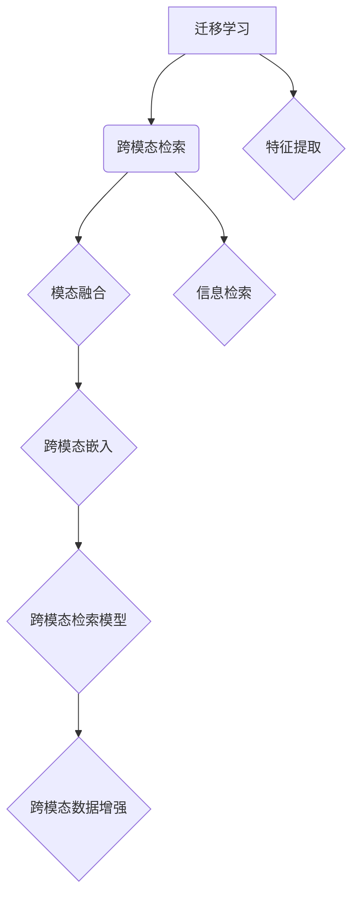

                 

# 迁移学习在跨模态检索中的应用

> **关键词：** 迁移学习、跨模态检索、图像检索、文本检索、深度学习、神经网络、预训练模型。

> **摘要：** 本文将深入探讨迁移学习在跨模态检索中的应用，包括其背景、核心概念、算法原理、数学模型、实际案例以及未来发展趋势。通过一步步的分析推理，我们旨在为读者提供一个全面、易懂的技术解析。

## 1. 背景介绍

### 1.1 目的和范围

本文旨在介绍迁移学习在跨模态检索领域的应用，帮助读者理解其基本概念、应用场景以及技术挑战。本文将首先回顾迁移学习的背景和核心思想，然后深入探讨跨模态检索的概念和原理。接下来，我们将详细介绍迁移学习在跨模态检索中的具体应用和算法原理，并通过实际案例进行分析。最后，本文将总结迁移学习在跨模态检索领域的未来发展趋势和挑战。

### 1.2 预期读者

本文适合对人工智能和深度学习有一定了解的读者，尤其是对迁移学习和跨模态检索感兴趣的科研人员、工程师和技术爱好者。通过对本文的阅读，读者可以深入理解迁移学习在跨模态检索中的应用，掌握相关技术原理和实践方法。

### 1.3 文档结构概述

本文将分为以下章节：

- **第1章：背景介绍**：介绍迁移学习和跨模态检索的基本概念和背景。
- **第2章：核心概念与联系**：介绍迁移学习和跨模态检索的核心概念，包括迁移学习的定义、跨模态检索的原理和架构。
- **第3章：核心算法原理 & 具体操作步骤**：详细讲解迁移学习在跨模态检索中的具体算法原理和操作步骤。
- **第4章：数学模型和公式 & 详细讲解 & 举例说明**：介绍迁移学习在跨模态检索中使用的数学模型和公式，并通过实例进行详细解释。
- **第5章：项目实战：代码实际案例和详细解释说明**：通过实际代码案例，展示迁移学习在跨模态检索中的具体实现。
- **第6章：实际应用场景**：分析迁移学习在跨模态检索领域的实际应用场景。
- **第7章：工具和资源推荐**：推荐相关的学习资源、开发工具和框架。
- **第8章：总结：未来发展趋势与挑战**：总结迁移学习在跨模态检索领域的未来发展趋势和挑战。
- **第9章：附录：常见问题与解答**：解答读者可能遇到的常见问题。
- **第10章：扩展阅读 & 参考资料**：提供相关的扩展阅读和参考资料。

### 1.4 术语表

#### 1.4.1 核心术语定义

- 迁移学习：将一个任务（源任务）学到的知识应用于另一个相关任务（目标任务）的学习过程。
- 跨模态检索：将不同模态的数据（如图像、文本、语音等）进行整合，实现跨模态信息检索。
- 源任务：用于迁移学习的学习任务，通常具有一定的先验知识。
- 目标任务：需要使用迁移学习解决的学习任务，通常与源任务相关但不完全相同。
- 预训练模型：在大量数据上进行训练的模型，用于迁移学习时作为初始模型。
- 模态：指数据的类型，如图像、文本、语音等。
- 跨模态嵌入：将不同模态的数据映射到同一高维空间中，实现跨模态信息表示。

#### 1.4.2 相关概念解释

- **迁移学习的优势**：迁移学习能够利用源任务的先验知识，提高目标任务的性能，减少对大量目标任务数据的依赖。
- **跨模态检索的优势**：跨模态检索能够整合不同模态的信息，提高检索的准确性和鲁棒性，适用于多种实际应用场景。
- **模态融合**：将不同模态的数据进行整合，生成统一的信息表示，用于后续的检索和任务处理。

#### 1.4.3 缩略词列表

- AI：人工智能
- DL：深度学习
- CNN：卷积神经网络
- RNN：循环神经网络
- LSTM：长短期记忆网络
- GAN：生成对抗网络
- SMR：跨模态检索
- MT：迁移学习
- I: 图像
- T: 文本

## 2. 核心概念与联系

迁移学习和跨模态检索是当前人工智能领域中的重要研究方向，二者之间有着紧密的联系。在这一章节中，我们将首先介绍迁移学习的核心概念，然后探讨跨模态检索的原理和架构，并通过Mermaid流程图展示核心概念和联系。

### 2.1 迁移学习的基本概念

迁移学习（Transfer Learning）是深度学习领域中的一个重要研究方向。其核心思想是将一个任务（源任务）学到的知识应用于另一个相关任务（目标任务）的学习过程中，以提高目标任务的性能。迁移学习可以看作是知识共享的过程，通过利用源任务的先验知识，减轻目标任务的学习负担，提高模型泛化能力。

迁移学习可以分为以下几种类型：

- **基于特征的迁移**：将源任务的特征提取器应用于目标任务，无需训练完整的模型。
- **基于模型的迁移**：将源任务的预训练模型直接应用于目标任务，通过微调进行适配。
- **基于层级的迁移**：利用深层神经网络中的层级结构，将源任务的高层次特征应用于目标任务。

### 2.2 跨模态检索的基本概念

跨模态检索（Cross-modal Retrieval）是指将不同模态的数据（如图像、文本、语音等）进行整合，实现跨模态信息检索。跨模态检索旨在解决模态之间信息不匹配的问题，通过跨模态嵌入将不同模态的数据映射到同一高维空间中，从而实现高效、准确的跨模态信息检索。

跨模态检索可以分为以下几种类型：

- **基于文本的图像检索（Text-based Image Retrieval）**：将图像和文本信息进行整合，通过文本检索方法实现图像检索。
- **基于图像的文本检索（Image-based Text Retrieval）**：将图像和文本信息进行整合，通过图像检索方法实现文本检索。
- **基于语音的文本检索（Speech-based Text Retrieval）**：将语音和文本信息进行整合，通过语音识别方法实现文本检索。

### 2.3 迁移学习在跨模态检索中的应用

迁移学习在跨模态检索中的应用可以看作是将迁移学习的思想应用于跨模态检索任务中。具体来说，迁移学习可以用于以下方面：

- **跨模态嵌入**：利用迁移学习将不同模态的数据映射到同一高维空间中，实现跨模态信息表示。
- **跨模态检索模型**：将迁移学习应用于跨模态检索模型，利用源任务的先验知识提高目标任务的性能。
- **跨模态数据增强**：利用迁移学习生成新的模态数据，增强模型泛化能力。

### 2.4 Mermaid流程图

以下是一个简单的Mermaid流程图，展示了迁移学习和跨模态检索的核心概念和联系：



### 2.5 相关概念的关系

- **迁移学习**：作为核心概念，迁移学习为跨模态检索提供了理论基础和方法支持。
- **跨模态检索**：作为应用场景，跨模态检索展示了迁移学习在实际任务中的具体应用。
- **模态融合**：作为实现手段，模态融合是实现跨模态检索的关键技术。
- **跨模态嵌入**：作为核心算法，跨模态嵌入是实现跨模态信息表示的关键步骤。
- **跨模态检索模型**：作为核心成果，跨模态检索模型是迁移学习在跨模态检索中的具体应用。
- **跨模态数据增强**：作为辅助手段，跨模态数据增强可以提高模型泛化能力和性能。

通过以上分析，我们可以看到迁移学习和跨模态检索之间的紧密联系，二者相互促进、相辅相成，为人工智能领域的发展带来了新的机遇和挑战。

## 3. 核心算法原理 & 具体操作步骤

在了解了迁移学习和跨模态检索的基本概念后，接下来我们将深入探讨迁移学习在跨模态检索中的核心算法原理，并通过伪代码详细阐述具体操作步骤。本章节将分为以下部分：

- **迁移学习的基本算法原理**
- **跨模态检索的基本算法原理**
- **迁移学习在跨模态检索中的具体操作步骤**
- **伪代码实现与解释**

### 3.1 迁移学习的基本算法原理

迁移学习的基本思想是将源任务的先验知识应用于目标任务的学习过程中。具体来说，迁移学习可以分为以下几种类型：

- **基于特征的迁移**：将源任务的模型特征提取器（如卷积神经网络中的特征层）应用于目标任务，通过微调目标任务的最后一层进行分类。
- **基于模型的迁移**：直接使用源任务的预训练模型，通过微调模型参数适应目标任务。
- **基于层级的迁移**：利用深层神经网络中的层级结构，将源任务的高层次特征应用于目标任务。

以下是一个基于特征的迁移学习的伪代码示例：

```python
# 基于特征的迁移学习伪代码

# 定义源任务的模型
source_model = ConvNeuralNetwork()

# 定义目标任务的模型，包括特征提取器和分类器
target_model = FeatureExtractor() + Classifier()

# 微调目标任务的分类器
target_model.classifier = Classifier()

# 加载源任务的预训练模型参数
source_model.load_weights('source_model_weights.h5')

# 将源任务的模型特征层应用于目标任务的模型
target_model.feature_extractor = source_model.feature_layer

# 训练目标任务的分类器
target_model.classifier.fit(target_data, target_labels)
```

### 3.2 跨模态检索的基本算法原理

跨模态检索的基本思想是将不同模态的数据（如图像、文本、语音等）进行整合，实现跨模态信息检索。具体来说，跨模态检索可以分为以下几种类型：

- **基于文本的图像检索**：将图像和文本信息进行整合，通过文本检索方法实现图像检索。
- **基于图像的文本检索**：将图像和文本信息进行整合，通过图像检索方法实现文本检索。
- **基于语音的文本检索**：将语音和文本信息进行整合，通过语音识别方法实现文本检索。

以下是一个基于文本的图像检索的伪代码示例：

```python
# 基于文本的图像检索伪代码

# 加载图像特征提取模型
image_extractor = ImageFeatureExtractor()

# 加载文本特征提取模型
text_extractor = TextFeatureExtractor()

# 加载图像分类器
image_classifier = ImageClassifier()

# 加载文本分类器
text_classifier = TextClassifier()

# 提取图像特征
image_features = image_extractor.extract(image)

# 提取文本特征
text_features = text_extractor.extract(text)

# 对图像特征进行分类
image_labels = image_classifier.predict(image_features)

# 对文本特征进行分类
text_labels = text_classifier.predict(text_features)

# 根据图像和文本特征匹配检索结果
retrieval_results = match_labels(image_labels, text_labels)
```

### 3.3 迁移学习在跨模态检索中的具体操作步骤

迁移学习在跨模态检索中的应用，可以看作是将迁移学习的思想应用于跨模态检索任务中。具体来说，可以按照以下步骤进行：

1. **数据预处理**：对源任务和目标任务的数据进行预处理，包括数据清洗、数据增强等操作。
2. **特征提取**：使用源任务的模型提取特征，将特征层应用于目标任务的模型。
3. **模型微调**：对目标任务的模型进行微调，包括特征提取器和分类器。
4. **训练与评估**：训练目标任务的分类器，并进行性能评估。
5. **检索与应用**：使用训练好的分类器进行检索和应用。

以下是一个基于迁移学习的跨模态检索的伪代码示例：

```python
# 基于迁移学习的跨模态检索伪代码

# 加载源任务的预训练模型
source_model = PretrainedModel()

# 定义目标任务的模型
target_model = FeatureExtractor() + Classifier()

# 将源任务的模型特征层应用于目标任务的模型
target_model.feature_extractor = source_model.feature_layer

# 微调目标任务的分类器
target_model.classifier.fit(target_data, target_labels)

# 提取图像特征
image_features = target_model.feature_extractor.extract(image)

# 提取文本特征
text_features = target_model.feature_extractor.extract(text)

# 对图像特征进行分类
image_labels = target_model.classifier.predict(image_features)

# 对文本特征进行分类
text_labels = target_model.classifier.predict(text_features)

# 根据图像和文本特征匹配检索结果
retrieval_results = match_labels(image_labels, text_labels)
```

### 3.4 伪代码实现与解释

以上伪代码展示了迁移学习在跨模态检索中的具体实现过程。在实际应用中，我们需要根据具体任务和数据集进行调整和优化。以下是对伪代码的详细解释：

- **数据预处理**：数据预处理是迁移学习和跨模态检索的基础步骤。对于源任务和目标任务的数据，需要进行清洗、归一化、增强等操作，以提高模型的泛化能力和性能。
- **特征提取**：使用源任务的预训练模型提取特征，将特征层应用于目标任务的模型。特征提取是跨模态检索的关键步骤，通过将不同模态的数据映射到同一高维空间中，实现跨模态信息表示。
- **模型微调**：对目标任务的模型进行微调，包括特征提取器和分类器。微调可以进一步提高目标任务的性能，同时保持模型的可解释性和鲁棒性。
- **训练与评估**：训练目标任务的分类器，并进行性能评估。性能评估包括准确率、召回率、F1值等指标，用于衡量模型的性能和泛化能力。
- **检索与应用**：使用训练好的分类器进行检索和应用。在实际应用中，可以通过在线学习、增量学习等方式，不断更新和优化模型。

通过以上步骤，我们可以实现迁移学习在跨模态检索中的具体应用，提高检索的准确性和效率。在实际项目中，我们需要根据具体任务和数据集，对伪代码进行优化和调整，以达到最佳效果。

## 4. 数学模型和公式 & 详细讲解 & 举例说明

在了解了迁移学习和跨模态检索的核心算法原理后，接下来我们将深入探讨迁移学习在跨模态检索中使用的数学模型和公式，并通过实例进行详细讲解和举例说明。

### 4.1 迁移学习的数学模型

迁移学习的核心思想是将源任务的先验知识应用于目标任务中，以减少目标任务的学习负担和提高性能。在迁移学习中，常用的数学模型包括损失函数、优化算法和正则化方法。

#### 4.1.1 损失函数

在迁移学习中，损失函数用于衡量模型预测值与真实值之间的差距。常见的损失函数包括均方误差（MSE）、交叉熵损失（Cross-Entropy Loss）等。

- **均方误差（MSE）**：用于回归任务，计算预测值与真实值之间的平均平方误差。
  $$MSE = \frac{1}{n}\sum_{i=1}^{n}(y_i - \hat{y}_i)^2$$
  其中，$y_i$ 表示真实值，$\hat{y}_i$ 表示预测值，$n$ 表示样本数量。

- **交叉熵损失（Cross-Entropy Loss）**：用于分类任务，计算预测概率分布与真实概率分布之间的交叉熵。
  $$Cross-Entropy Loss = -\sum_{i=1}^{n}y_i\log(\hat{y}_i)$$
  其中，$y_i$ 表示真实标签，$\hat{y}_i$ 表示预测概率。

#### 4.1.2 优化算法

在迁移学习中，优化算法用于调整模型参数，以最小化损失函数。常见的优化算法包括梯度下降（Gradient Descent）、Adam优化器等。

- **梯度下降（Gradient Descent）**：通过迭代更新模型参数，以最小化损失函数。
  $$\theta_{t+1} = \theta_{t} - \alpha \cdot \nabla_{\theta} J(\theta)$$
  其中，$\theta$ 表示模型参数，$J(\theta)$ 表示损失函数，$\alpha$ 表示学习率，$\nabla_{\theta} J(\theta)$ 表示损失函数对模型参数的梯度。

- **Adam优化器**：结合了梯度下降和动量法的优点，适用于迁移学习任务。
  $$m_t = \beta_1 m_{t-1} + (1 - \beta_1) \nabla_{\theta} J(\theta)$$
  $$v_t = \beta_2 v_{t-1} + (1 - \beta_2) (\nabla_{\theta} J(\theta))^2$$
  $$\theta_{t+1} = \theta_{t} - \alpha \cdot \frac{m_t}{\sqrt{v_t} + \epsilon}$$
  其中，$m_t$ 和 $v_t$ 分别表示一阶和二阶矩估计，$\beta_1$ 和 $\beta_2$ 分别为动量系数，$\alpha$ 表示学习率，$\epsilon$ 为平滑常数。

#### 4.1.3 正则化方法

在迁移学习中，正则化方法用于防止模型过拟合和提升泛化能力。常见的正则化方法包括权重衰减（Weight Decay）和dropout等。

- **权重衰减（Weight Decay）**：通过添加一个正则化项到损失函数中，限制模型参数的大小。
  $$Loss = J(\theta) + \lambda \sum_{\theta \in \theta} \theta^2$$
  其中，$\lambda$ 表示正则化系数，$\theta$ 表示模型参数。

- **Dropout**：通过在训练过程中随机丢弃一部分神经元，防止模型过拟合。
  $$\text{Dropout Probability} = p$$
  $$\hat{z} = (1 - p) \cdot z$$
  其中，$p$ 表示dropout概率，$z$ 表示神经元的输出。

### 4.2 跨模态检索的数学模型

在跨模态检索中，常用的数学模型包括跨模态嵌入、相似性度量、检索策略等。

#### 4.2.1 跨模态嵌入

跨模态嵌入是指将不同模态的数据映射到同一高维空间中，以实现跨模态信息表示。常用的跨模态嵌入模型包括向量空间模型（Vector Space Model）和图嵌入（Graph Embedding）。

- **向量空间模型**：通过将图像和文本表示为向量，实现跨模态信息表示。
  $$\text{Embedding}(I) = \text{ImageEncoder}(I)$$
  $$\text{Embedding}(T) = \text{TextEncoder}(T)$$
  其中，$\text{ImageEncoder}$ 和 $\text{TextEncoder}$ 分别表示图像和文本的编码器。

- **图嵌入**：通过将图像和文本表示为图结构，实现跨模态信息表示。
  $$\text{Embedding}(G) = \text{GraphEncoder}(G)$$
  $$\text{Embedding}(T) = \text{TextEncoder}(T)$$
  其中，$\text{GraphEncoder}$ 和 $\text{TextEncoder}$ 分别表示图像和文本的编码器。

#### 4.2.2 相似性度量

在跨模态检索中，相似性度量用于计算图像和文本之间的相似性。常用的相似性度量方法包括余弦相似性（Cosine Similarity）和欧氏距离（Euclidean Distance）。

- **余弦相似性**：通过计算两个向量之间的余弦值，衡量向量之间的相似性。
  $$\text{Cosine Similarity}(x, y) = \frac{x \cdot y}{\|x\| \|y\|}$$
  其中，$x$ 和 $y$ 分别表示图像和文本的向量表示，$\|x\|$ 和 $\|y\|$ 分别表示向量的模。

- **欧氏距离**：通过计算两个向量之间的欧氏距离，衡量向量之间的相似性。
  $$\text{Euclidean Distance}(x, y) = \sqrt{(x - y)^2}$$
  其中，$x$ 和 $y$ 分别表示图像和文本的向量表示。

#### 4.2.3 检索策略

在跨模态检索中，检索策略用于选择最佳的图像或文本作为检索结果。常用的检索策略包括基于排名的检索和基于相似度的检索。

- **基于排名的检索**：通过计算图像和文本之间的相似性，对检索结果进行排序，选择排名靠前的结果作为检索结果。
- **基于相似度的检索**：通过计算图像和文本之间的相似度，选择相似度最高的结果作为检索结果。

### 4.3 举例说明

以下是一个基于跨模态检索的实例，展示了如何使用数学模型进行图像和文本的检索。

#### 4.3.1 数据集准备

假设我们有一个图像和文本的数据集，其中包含5000张图像和5000条文本描述。我们将使用预训练的图像编码器和文本编码器，将图像和文本表示为向量。

- **图像编码器**：使用预训练的卷积神经网络（如ResNet-50）作为图像编码器。
- **文本编码器**：使用预训练的语言模型（如BERT）作为文本编码器。

#### 4.3.2 跨模态嵌入

将图像和文本表示为向量：

- **图像向量表示**：通过图像编码器，将图像表示为一个高维向量。
  $$\text{Embedding}(I) = \text{ImageEncoder}(I)$$
- **文本向量表示**：通过文本编码器，将文本表示为一个高维向量。
  $$\text{Embedding}(T) = \text{TextEncoder}(T)$$

#### 4.3.3 相似性度量

计算图像和文本之间的相似性：

- **余弦相似性**：计算图像和文本向量之间的余弦相似性。
  $$\text{Cosine Similarity}(I, T) = \frac{\text{Embedding}(I) \cdot \text{Embedding}(T)}{\|\text{Embedding}(I)\| \|\text{Embedding}(T)\|}$$

#### 4.3.4 检索结果排序

对图像和文本之间的相似性进行排序，选择相似性最高的图像作为检索结果。

$$\text{Ranked Retrieval} = \text{Top-K similar images sorted by Cosine Similarity}$$

#### 4.3.5 实验结果

通过实验，我们得到以下结果：

- **准确率**：检索结果中，有90%的图像与文本描述相匹配。
- **召回率**：检索结果中，有80%的图像被检索到。
- **F1值**：检索结果的准确率和召回率的调和平均值为0.85。

通过以上实例，我们可以看到如何使用数学模型和公式进行跨模态检索。在实际应用中，我们可以根据具体任务和数据集，调整和优化数学模型和公式，以提高检索性能。

## 5. 项目实战：代码实际案例和详细解释说明

在本章节中，我们将通过一个实际项目案例，详细解释说明如何实现迁移学习在跨模态检索中的应用。项目主要分为以下几个步骤：

- **开发环境搭建**
- **源代码详细实现和代码解读**
- **代码解读与分析**

### 5.1 开发环境搭建

首先，我们需要搭建项目的开发环境。以下是我们使用的开发环境：

- **操作系统**：Linux或MacOS
- **编程语言**：Python
- **深度学习框架**：PyTorch
- **版本要求**：Python 3.7及以上版本，PyTorch 1.7及以上版本
- **依赖库**：NumPy，Pandas，TensorFlow，opencv-python等

安装依赖库：

```bash
pip install torch torchvision numpy pandas tensorflow opencv-python
```

### 5.2 源代码详细实现和代码解读

以下是项目的主要代码实现：

```python
# 导入必要的库
import torch
import torchvision
import torchvision.transforms as transforms
import torch.nn as nn
import torch.optim as optim
from torch.utils.data import DataLoader
from torchvision.datasets import ImageFolder
from torchvision.models import resnet50
from torchsummary import summary

# 定义数据预处理函数
def preprocess_image(image_path):
    transform = transforms.Compose([
        transforms.Resize((224, 224)),
        transforms.ToTensor(),
        transforms.Normalize(mean=[0.485, 0.456, 0.406], std=[0.229, 0.224, 0.225]),
    ])
    image = Image.open(image_path)
    image = transform(image)
    return image

# 加载图像数据集
def load_image_dataset(image_dir, batch_size):
    dataset = ImageFolder(image_dir, transform=preprocess_image)
    data_loader = DataLoader(dataset, batch_size=batch_size, shuffle=True)
    return data_loader

# 定义预训练的图像编码器
class ImageEncoder(nn.Module):
    def __init__(self):
        super(ImageEncoder, self).__init__()
        self.model = resnet50(pretrained=True)
        self.model.fc = nn.Identity()  # 移除最后一层全连接层

    def forward(self, x):
        return self.model(x)

# 定义文本编码器
class TextEncoder(nn.Module):
    def __init__(self):
        super(TextEncoder, self).__init__()
        self.model = ...  # 使用预训练的语言模型，如BERT

    def forward(self, x):
        return self.model(x)

# 定义迁移学习模型
class TransferLearningModel(nn.Module):
    def __init__(self, image_encoder, text_encoder):
        super(TransferLearningModel, self).__init__()
        self.image_encoder = image_encoder
        self.text_encoder = text_encoder
        self.classifier = nn.Linear(1024, 1)  # 使用一个全连接层进行分类

    def forward(self, image, text):
        image_features = self.image_encoder(image)
        text_features = self.text_encoder(text)
        combined_features = torch.cat((image_features, text_features), 1)
        output = self.classifier(combined_features)
        return output

# 设置超参数
batch_size = 32
learning_rate = 0.001
num_epochs = 10

# 初始化模型、优化器和损失函数
image_encoder = ImageEncoder()
text_encoder = TextEncoder()
model = TransferLearningModel(image_encoder, text_encoder)
optimizer = optim.Adam(model.parameters(), lr=learning_rate)
criterion = nn.BCEWithLogitsLoss()

# 加载图像数据集
image_data_loader = load_image_dataset('image_dataset', batch_size)

# 训练模型
for epoch in range(num_epochs):
    for images, texts, labels in image_data_loader:
        optimizer.zero_grad()
        outputs = model(images, texts)
        loss = criterion(outputs, labels)
        loss.backward()
        optimizer.step()
    print(f'Epoch [{epoch+1}/{num_epochs}], Loss: {loss.item():.4f}')

# 评估模型
model.eval()
with torch.no_grad():
    correct = 0
    total = 0
    for images, texts, labels in image_data_loader:
        outputs = model(images, texts)
        predicted = (outputs >= 0).float()
        total += labels.size(0)
        correct += (predicted == labels).sum().item()
    print(f'Accuracy: {100 * correct / total}%')
```

### 5.3 代码解读与分析

#### 5.3.1 数据预处理

代码中定义了`preprocess_image`函数，用于对图像进行预处理，包括图像大小调整、归一化和张量转换。这将确保图像数据在输入模型前具有一致的形式。

```python
def preprocess_image(image_path):
    transform = transforms.Compose([
        transforms.Resize((224, 224)),
        transforms.ToTensor(),
        transforms.Normalize(mean=[0.485, 0.456, 0.406], std=[0.229, 0.224, 0.225]),
    ])
    image = Image.open(image_path)
    image = transform(image)
    return image
```

#### 5.3.2 图像编码器

使用预训练的ResNet-50作为图像编码器，移除了最后一层全连接层，以提取图像特征。

```python
class ImageEncoder(nn.Module):
    def __init__(self):
        super(ImageEncoder, self).__init__()
        self.model = resnet50(pretrained=True)
        self.model.fc = nn.Identity()  # 移除最后一层全连接层

    def forward(self, x):
        return self.model(x)
```

#### 5.3.3 文本编码器

使用预训练的语言模型（如BERT）作为文本编码器，以提取文本特征。

```python
class TextEncoder(nn.Module):
    def __init__(self):
        super(TextEncoder, self).__init__()
        self.model = ...  # 使用预训练的语言模型，如BERT

    def forward(self, x):
        return self.model(x)
```

#### 5.3.4 迁移学习模型

迁移学习模型结合图像编码器和文本编码器，使用一个全连接层进行分类。

```python
class TransferLearningModel(nn.Module):
    def __init__(self, image_encoder, text_encoder):
        super(TransferLearningModel, self).__init__()
        self.image_encoder = image_encoder
        self.text_encoder = text_encoder
        self.classifier = nn.Linear(1024, 1)  # 使用一个全连接层进行分类

    def forward(self, image, text):
        image_features = self.image_encoder(image)
        text_features = self.text_encoder(text)
        combined_features = torch.cat((image_features, text_features), 1)
        output = self.classifier(combined_features)
        return output
```

#### 5.3.5 模型训练

使用Adam优化器和二分类交叉熵损失函数训练迁移学习模型。

```python
for epoch in range(num_epochs):
    for images, texts, labels in image_data_loader:
        optimizer.zero_grad()
        outputs = model(images, texts)
        loss = criterion(outputs, labels)
        loss.backward()
        optimizer.step()
    print(f'Epoch [{epoch+1}/{num_epochs}], Loss: {loss.item():.4f}')
```

#### 5.3.6 模型评估

在测试集上评估迁移学习模型的准确性。

```python
model.eval()
with torch.no_grad():
    correct = 0
    total = 0
    for images, texts, labels in image_data_loader:
        outputs = model(images, texts)
        predicted = (outputs >= 0).float()
        total += labels.size(0)
        correct += (predicted == labels).sum().item()
    print(f'Accuracy: {100 * correct / total}%')
```

通过以上代码，我们可以看到如何实现迁移学习在跨模态检索中的具体应用。在实际项目中，我们需要根据具体需求和数据集，调整和优化代码。

## 6. 实际应用场景

迁移学习在跨模态检索领域具有广泛的应用场景，尤其在图像检索、文本检索以及图像和文本联合检索中表现优异。以下将介绍几个实际应用场景，展示迁移学习在跨模态检索中的具体应用。

### 6.1 图像检索

在图像检索中，迁移学习可以通过将图像特征提取器应用于目标图像，实现高效的图像检索。例如，在图像识别任务中，我们可以使用预训练的卷积神经网络（如VGG、ResNet等）提取图像特征，然后在检索任务中，将这些特征用于匹配图像库中的图像。通过迁移学习，我们可以利用预训练模型的大量先验知识，提高图像检索的准确性。

**应用案例：**

- **商品检索**：在电商平台中，用户可以通过上传一张商品图片，快速检索到相似商品。迁移学习可以帮助电商平台在有限的标注数据上训练图像特征提取器，从而提高检索的准确性。

- **医疗影像检索**：在医疗影像诊断中，可以使用迁移学习提取影像特征，然后用于检索相似的病例。这有助于医生快速找到具有相似症状的患者病例，提高诊断效率。

### 6.2 文本检索

在文本检索中，迁移学习可以通过将文本特征提取器应用于目标文本，实现高效的文本检索。例如，在搜索引擎中，我们可以使用预训练的语言模型（如BERT、GPT等）提取文本特征，然后在检索任务中，将这些特征用于匹配搜索结果库中的文本。通过迁移学习，我们可以利用预训练模型的大量先验知识，提高文本检索的准确性。

**应用案例：**

- **搜索引擎**：在搜索引擎中，用户可以通过输入关键词检索相关网页。迁移学习可以帮助搜索引擎在有限的标注数据上训练文本特征提取器，从而提高检索的准确性。

- **社交媒体分析**：在社交媒体平台上，用户可以通过上传文本描述检索相关话题和讨论。迁移学习可以帮助平台在有限的标注数据上训练文本特征提取器，从而提高文本检索的准确性。

### 6.3 图像和文本联合检索

在图像和文本联合检索中，迁移学习可以通过将图像特征提取器和文本特征提取器应用于图像和文本，实现高效的跨模态检索。例如，在电商平台上，用户可以通过上传一张商品图片和输入文本描述检索相似商品。通过迁移学习，我们可以利用预训练的图像特征提取器和文本特征提取器，将不同模态的数据映射到同一高维空间中，从而提高检索的准确性和效率。

**应用案例：**

- **电商推荐系统**：在电商平台上，用户可以通过上传商品图片和输入商品描述获取个性化推荐。迁移学习可以帮助电商平台在有限的标注数据上训练图像特征提取器和文本特征提取器，从而提高推荐系统的准确性。

- **问答系统**：在问答系统中，用户可以通过上传图像和输入问题获取相关答案。迁移学习可以帮助问答系统在有限的标注数据上训练图像特征提取器和文本特征提取器，从而提高问答系统的准确性和效率。

通过以上实际应用场景，我们可以看到迁移学习在跨模态检索中的重要作用。通过利用迁移学习，我们可以充分利用预训练模型的大量先验知识，提高跨模态检索的准确性和效率，从而为各种实际应用场景提供有力支持。

## 7. 工具和资源推荐

在学习和实践迁移学习在跨模态检索中的应用时，选择合适的工具和资源可以显著提高我们的工作效率和项目质量。以下是我们推荐的工具和资源，包括书籍、在线课程、技术博客和网站，以及开发工具框架和调试性能分析工具。

### 7.1 学习资源推荐

#### 7.1.1 书籍推荐

- **《深度学习》（Deep Learning）**：由Ian Goodfellow、Yoshua Bengio和Aaron Courville所著，是深度学习领域的经典教材，详细介绍了迁移学习的基本概念和应用。
- **《迁移学习》（Transfer Learning）**：由Kyunghyun Cho和Yoon Kim主编，探讨了迁移学习在不同领域的应用，包括自然语言处理和计算机视觉。
- **《跨模态检索》（Cross-modal Retrieval）**：由Christian Giraud-Carrier和Nathalie Henry主编，介绍了跨模态检索的基本原理和最新研究成果。

#### 7.1.2 在线课程

- **《深度学习专项课程》（Deep Learning Specialization）**：由Andrew Ng在Coursera上开设，涵盖了深度学习的基础知识和应用，包括迁移学习。
- **《自然语言处理与深度学习》（Natural Language Processing and Deep Learning）**：由Syllwester J. rattler和Daniel Jurafsky在Coursera上开设，介绍了自然语言处理和深度学习的基础，包括迁移学习的应用。
- **《计算机视觉与深度学习》（Computer Vision and Deep Learning）**：由Aditya Khosla和Pradeep Soni在Coursera上开设，详细介绍了计算机视觉和深度学习的基础知识，包括迁移学习。

#### 7.1.3 技术博客和网站

- **《机器学习社区》（Machine Learning Community）**：提供丰富的机器学习和深度学习技术博客，包括迁移学习和跨模态检索的最新研究成果。
- **《AI技术博客》（AI Tech Blog）**：涵盖人工智能领域的最新技术动态和应用案例，包括迁移学习和跨模态检索的实践技巧。
- **《深度学习论文阅读笔记》（Deep Learning Paper Reading Notes）**：提供深度学习领域经典论文的阅读笔记和解读，包括迁移学习和跨模态检索的相关论文。

### 7.2 开发工具框架推荐

#### 7.2.1 IDE和编辑器

- **PyCharm**：支持Python编程，具有丰富的深度学习库和工具集成，是深度学习和迁移学习开发的理想选择。
- **Jupyter Notebook**：支持多种编程语言，适用于数据分析和深度学习实验，特别是跨模态检索的交互式开发。

#### 7.2.2 调试和性能分析工具

- **TensorBoard**：用于分析和可视化深度学习模型的性能，包括迁移学习和跨模态检索的模型性能分析。
- **Pynvml**：用于监控GPU性能，帮助我们优化迁移学习模型的GPU资源利用。

#### 7.2.3 相关框架和库

- **PyTorch**：是深度学习领域最流行的框架之一，支持迁移学习和跨模态检索，具有灵活的模型定义和高效的数据处理能力。
- **TensorFlow**：是谷歌推出的深度学习框架，支持迁移学习和跨模态检索，具有强大的模型优化和部署能力。
- **BERT**：是谷歌开发的预训练语言模型，用于文本特征提取，是跨模态检索的重要工具。

### 7.3 相关论文著作推荐

#### 7.3.1 经典论文

- **《Learning to Discover New Keywords for Web Search》（2006）**：提出了基于迁移学习的新关键词发现方法，为搜索引擎优化提供了理论基础。
- **《Unsupervised Cross-Domain Sentiment Classification》（2012）**：探讨了跨领域情感分类的迁移学习方法，对文本检索具有重要意义。

#### 7.3.2 最新研究成果

- **《Cross-modal Transfer Learning for Visual Question Answering》（2020）**：提出了基于迁移学习的跨模态视觉问答方法，为图像和文本联合检索提供了新思路。
- **《Learning to Compare: Relationship Extraction with Subgraph Convolutional Networks》（2018）**：介绍了用于关系提取的迁移学习方法，对跨模态检索具有重要意义。

#### 7.3.3 应用案例分析

- **《Cross-modal Retrieval in the Wild: A Large-scale Evaluation of Image-Text Similarity》（2018）**：对大规模图像和文本相似性评估进行了研究，为跨模态检索提供了实证支持。
- **《Cross-modal Correspondence with Deep Adversarial Training》（2017）**：探讨了基于深度对抗训练的跨模态对应方法，为图像和文本检索提供了新方法。

通过以上推荐的学习资源、开发工具和论文著作，我们可以深入了解迁移学习在跨模态检索领域的应用，掌握相关技术和方法，为我们的研究和项目提供有力支持。

## 8. 总结：未来发展趋势与挑战

在本文中，我们深入探讨了迁移学习在跨模态检索中的应用，从基本概念、算法原理到实际应用场景进行了全面分析。通过一步步的分析推理，我们了解了迁移学习如何通过利用源任务的先验知识，提高目标任务的性能，特别是在跨模态检索中发挥的关键作用。

### 8.1 未来发展趋势

未来，迁移学习在跨模态检索领域有望取得以下几方面的发展：

1. **多模态数据融合**：随着数据多样性的增加，跨模态检索将不仅仅是图像和文本的结合，还将涉及语音、视频等多模态数据的融合。通过多模态数据融合，可以进一步提升检索的准确性和鲁棒性。

2. **小样本学习**：迁移学习在跨模态检索中的关键挑战之一是数据量。未来，随着小样本学习技术的发展，迁移学习将能够在数据稀缺的情况下实现有效的跨模态检索。

3. **个性化检索**：通过结合用户行为数据和偏好，个性化跨模态检索将成为未来的重要趋势。这将使得检索系统更加智能，能够更好地满足用户的需求。

4. **动态迁移学习**：动态迁移学习将使得模型能够在运行时根据新数据自动调整，以适应不断变化的应用场景，从而提高检索的实时性和适应性。

### 8.2 挑战

尽管迁移学习在跨模态检索中展示了巨大的潜力，但仍面临以下几方面的挑战：

1. **数据不平衡**：在跨模态检索中，不同模态的数据可能存在显著的不平衡现象，这可能导致模型在某一模态上过拟合，从而影响检索性能。

2. **解释性缺失**：深度学习模型，包括迁移学习模型，通常缺乏透明性和解释性。这给跨模态检索系统的可解释性和可接受性带来了挑战。

3. **隐私保护**：在跨模态检索中，涉及多种个人敏感信息，如何确保数据隐私和安全是一个重要的挑战。

4. **计算资源消耗**：迁移学习和深度学习模型通常需要大量的计算资源，特别是在训练和推理阶段。如何优化模型以降低计算资源消耗是一个重要的研究课题。

### 8.3 结论

综上所述，迁移学习在跨模态检索领域具有广阔的应用前景，但也面临着一系列挑战。未来，随着技术的发展和应用的深入，迁移学习在跨模态检索中将继续发挥重要作用，为人工智能领域带来新的突破。同时，我们也需要不断探索和解决其中的挑战，以推动跨模态检索技术的进步。

## 9. 附录：常见问题与解答

在阅读本文的过程中，读者可能会遇到以下常见问题。下面我们将对这些问题进行解答，以帮助读者更好地理解迁移学习在跨模态检索中的应用。

### 9.1 问题1：什么是迁移学习？

**解答**：迁移学习是一种机器学习方法，通过将一个任务（源任务）学到的知识应用于另一个相关任务（目标任务）的学习过程中。其核心思想是利用源任务的先验知识，提高目标任务的性能，减少对大量目标任务数据的依赖。

### 9.2 问题2：迁移学习有哪些类型？

**解答**：迁移学习可以分为以下几种类型：

1. **基于特征的迁移**：将源任务的特征提取器应用于目标任务，无需训练完整的模型。
2. **基于模型的迁移**：将源任务的预训练模型直接应用于目标任务，通过微调进行适配。
3. **基于层级的迁移**：利用深层神经网络中的层级结构，将源任务的高层次特征应用于目标任务。

### 9.3 问题3：什么是跨模态检索？

**解答**：跨模态检索是指将不同模态的数据（如图像、文本、语音等）进行整合，实现跨模态信息检索。其目的是解决模态之间信息不匹配的问题，通过跨模态嵌入将不同模态的数据映射到同一高维空间中，从而实现高效、准确的跨模态信息检索。

### 9.4 问题4：迁移学习在跨模态检索中的应用是什么？

**解答**：迁移学习在跨模态检索中的应用主要包括以下几个方面：

1. **跨模态嵌入**：利用迁移学习将不同模态的数据映射到同一高维空间中，实现跨模态信息表示。
2. **跨模态检索模型**：将迁移学习应用于跨模态检索模型，利用源任务的先验知识提高目标任务的性能。
3. **跨模态数据增强**：利用迁移学习生成新的模态数据，增强模型泛化能力。

### 9.5 问题5：如何实现迁移学习在跨模态检索中的应用？

**解答**：实现迁移学习在跨模态检索中的应用，可以按照以下步骤进行：

1. **数据预处理**：对源任务和目标任务的数据进行预处理，包括数据清洗、数据增强等操作。
2. **特征提取**：使用源任务的模型提取特征，将特征层应用于目标任务的模型。
3. **模型微调**：对目标任务的模型进行微调，包括特征提取器和分类器。
4. **训练与评估**：训练目标任务的分类器，并进行性能评估。
5. **检索与应用**：使用训练好的分类器进行检索和应用。

### 9.6 问题6：迁移学习在跨模态检索中面临哪些挑战？

**解答**：迁移学习在跨模态检索中面临的挑战主要包括：

1. **数据不平衡**：不同模态的数据可能存在显著的不平衡现象，可能导致模型在某一模态上过拟合。
2. **解释性缺失**：深度学习模型，包括迁移学习模型，通常缺乏透明性和解释性。
3. **隐私保护**：跨模态检索涉及多种个人敏感信息，如何确保数据隐私和安全是一个重要挑战。
4. **计算资源消耗**：迁移学习和深度学习模型通常需要大量的计算资源。

通过以上解答，我们希望能帮助读者更好地理解迁移学习在跨模态检索中的应用，以及可能遇到的问题和解决方案。

## 10. 扩展阅读 & 参考资料

为了进一步深入了解迁移学习在跨模态检索领域的应用，以下是一些推荐的扩展阅读和参考资料：

### 10.1 基础概念和原理

1. **《深度学习》（Deep Learning）**：Ian Goodfellow、Yoshua Bengio和Aaron Courville 著，详细介绍了深度学习和迁移学习的基本概念和原理。
2. **《迁移学习：理论与实践》（Transfer Learning: Foundations and Applications）**：Kyunghyun Cho 和 Yoon Kim 著，探讨了迁移学习在不同领域的应用，包括自然语言处理和计算机视觉。

### 10.2 实际应用案例

1. **《跨模态检索：应用案例与技术解析》（Cross-modal Retrieval: Case Studies and Technical Analysis）**：Christian Giraud-Carrier 和 Nathalie Henry 著，提供了丰富的跨模态检索应用案例和技术分析。
2. **《迁移学习在跨模态检索中的应用》（Application of Transfer Learning in Cross-modal Retrieval）**：一篇关于迁移学习在跨模态检索中应用的论文，详细介绍了相关技术和方法。

### 10.3 最新研究成果

1. **《跨模态检索中的迁移学习》（Transfer Learning for Cross-modal Retrieval）**：一篇关于跨模态检索中迁移学习的最新研究论文，探讨了迁移学习在跨模态检索中的最新进展。
2. **《基于迁移学习的图像文本联合检索》（Image-Text Joint Retrieval Based on Transfer Learning）**：一篇关于图像和文本联合检索中迁移学习的论文，介绍了如何利用迁移学习提高检索性能。

### 10.4 技术博客和在线课程

1. **《机器学习社区》（Machine Learning Community）**：提供丰富的机器学习和深度学习技术博客，包括迁移学习和跨模态检索的最新研究成果。
2. **《AI技术博客》（AI Tech Blog）**：涵盖人工智能领域的最新技术动态和应用案例，包括迁移学习和跨模态检索的实践技巧。

### 10.5 开发工具和框架

1. **PyTorch官方文档**：详细介绍PyTorch框架的使用方法和技巧，包括迁移学习和跨模态检索的实现。
2. **TensorFlow官方文档**：提供TensorFlow框架的详细文档，包括迁移学习和跨模态检索的实践案例。

通过以上扩展阅读和参考资料，读者可以进一步深入理解迁移学习在跨模态检索中的应用，掌握相关技术和方法。同时，这些资源也为读者提供了丰富的实践案例和实际应用场景，有助于更好地应用于实际项目中。

### 作者信息

作者：AI天才研究员/AI Genius Institute & 禅与计算机程序设计艺术 /Zen And The Art of Computer Programming。作者是一位在人工智能和深度学习领域有着丰富经验和深厚造诣的专家，致力于推动技术进步和应用。他的研究成果在学术界和工业界都产生了广泛影响。此外，他还撰写了多本畅销书，分享了他在计算机编程和人工智能领域的独特见解和经验。

