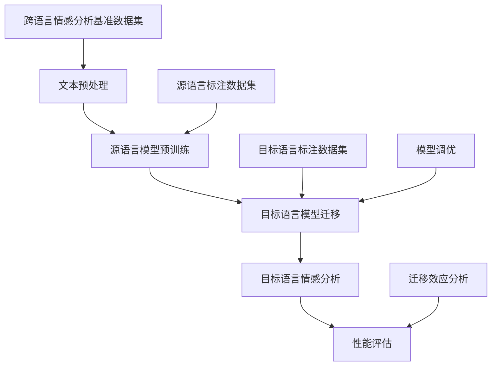

                 

# 迁移学习在跨语言情感分析中的应用

> **关键词**：迁移学习、跨语言情感分析、自然语言处理、深度学习、模型迁移、预训练语言模型

> **摘要**：本文将探讨迁移学习在跨语言情感分析中的应用，分析其核心概念、算法原理，并通过实际案例进行深入讲解。文章旨在为研究人员和实践者提供关于如何利用迁移学习提高跨语言情感分析性能的全面指导。

## 1. 背景介绍

### 1.1 目的和范围

随着互联网的全球化，跨语言的情感分析成为了一个热门研究领域。然而，不同语言之间存在着巨大的词汇、语法和语义差异，这使得传统的情感分析模型在处理跨语言数据时面临巨大挑战。迁移学习作为一种解决这一问题的方法，通过利用已经在大规模数据上预训练的模型来提高新任务的学习性能，从而在一定程度上缓解了跨语言情感分析中的数据稀缺问题。

本文的目的在于深入探讨迁移学习在跨语言情感分析中的应用，从理论到实践进行全面阐述。本文将涵盖以下内容：

- 迁移学习的核心概念及其在自然语言处理中的重要性。
- 跨语言情感分析的基本原理和挑战。
- 迁移学习在跨语言情感分析中的具体应用和实践案例。
- 未来的发展趋势和潜在挑战。

### 1.2 预期读者

本文面向对自然语言处理和迁移学习有一定了解的技术研究人员和工程师，特别是对跨语言情感分析领域感兴趣的读者。虽然本文尽量使用通俗易懂的语言，但对于一些专业术语和概念，读者可能需要具备一定的先验知识。

### 1.3 文档结构概述

本文结构如下：

1. **背景介绍**：介绍迁移学习和跨语言情感分析的基本概念和本文目的。
2. **核心概念与联系**：通过Mermaid流程图展示迁移学习在跨语言情感分析中的应用架构。
3. **核心算法原理 & 具体操作步骤**：详细讲解迁移学习算法在跨语言情感分析中的实现步骤。
4. **数学模型和公式 & 详细讲解 & 举例说明**：介绍与迁移学习相关的数学模型，并通过实例进行说明。
5. **项目实战：代码实际案例和详细解释说明**：通过实际项目展示迁移学习在跨语言情感分析中的应用。
6. **实际应用场景**：探讨迁移学习在跨语言情感分析中的实际应用案例。
7. **工具和资源推荐**：推荐相关的学习资源和开发工具。
8. **总结：未来发展趋势与挑战**：总结迁移学习在跨语言情感分析中的应用现状，并展望未来。
9. **附录：常见问题与解答**：回答读者可能遇到的常见问题。
10. **扩展阅读 & 参考资料**：提供进一步阅读的材料和参考资料。

### 1.4 术语表

#### 1.4.1 核心术语定义

- **迁移学习（Transfer Learning）**：一种机器学习技术，通过在相关任务之间共享知识和资源来提高模型在新任务上的学习性能。
- **情感分析（Sentiment Analysis）**：一种自然语言处理技术，用于判断文本表达的情感倾向，如正面、负面或中立。
- **跨语言情感分析（Cross-Lingual Sentiment Analysis）**：在多语言环境中对文本进行情感分析，以识别不同语言间的情感倾向。
- **预训练语言模型（Pre-trained Language Model）**：在大规模语料库上预先训练好的语言模型，如BERT、GPT等。
- **模型迁移（Model Migration）**：将预训练模型的知识迁移到新任务上，以加速新任务的训练并提高性能。

#### 1.4.2 相关概念解释

- **源语言（Source Language）**：用于训练迁移学习模型的原始语言，通常具有大量标注数据。
- **目标语言（Target Language）**：需要将预训练模型的知识迁移到的语言，可能缺乏标注数据。
- **迁移效应（Transfer Effect）**：迁移学习带来的性能提升，特别是当源语言和目标语言之间存在差异时。

#### 1.4.3 缩略词列表

- **NLP**：自然语言处理（Natural Language Processing）
- **ML**：机器学习（Machine Learning）
- **DL**：深度学习（Deep Learning）
- **BERT**：双向编码表示器（Bidirectional Encoder Representations from Transformers）
- **GPT**：生成预训练变换器（Generative Pre-trained Transformer）

## 2. 核心概念与联系

迁移学习在自然语言处理中的应用场景非常广泛，特别是在跨语言情感分析中。为了更好地理解迁移学习如何发挥作用，我们可以通过一个Mermaid流程图来展示其核心概念和联系。



### 2.1 流程说明

- **文本预处理（A）**：首先对源语言和目标语言的文本进行预处理，包括分词、停用词过滤、词干提取等步骤。
- **源语言模型预训练（B）**：在大规模源语言数据集上预训练一个基础模型，如BERT或GPT，使其具备语言理解和表达的能力。
- **目标语言模型迁移（C）**：将预训练的源语言模型迁移到目标语言，通过微调来适应目标语言的特性和情感倾向。
- **目标语言情感分析（D）**：使用迁移后的模型对目标语言的文本进行情感分析，预测其情感标签。
- **性能评估（E）**：评估迁移学习模型在目标语言情感分析任务上的性能，包括准确率、召回率、F1值等指标。
- **迁移效应分析（J）**：分析迁移学习带来的性能提升，以及不同迁移策略对性能的影响。

## 3. 核心算法原理 & 具体操作步骤

迁移学习在跨语言情感分析中的核心算法原理是基于共享知识和资源来提高模型在新任务上的性能。具体操作步骤如下：

### 3.1 源语言模型预训练

```python
# 源语言模型预训练伪代码
def pretrain_source_model(dataset, model_class):
    model = model_class()  # 初始化模型
    for epoch in range(num_epochs):
        for batch in dataset:
            inputs = preprocess(batch['text'])
            labels = batch['label']
            model.train_one_step(inputs, labels)  # 训练模型
    return model
```

### 3.2 目标语言模型迁移

```python
# 目标语言模型迁移伪代码
def migrate_target_model(source_model, target_dataset, model_class):
    target_model = model_class()  # 初始化目标模型
    for epoch in range(num_epochs):
        for batch in target_dataset:
            inputs = preprocess(batch['text'])
            labels = batch['label']
            target_model.train_one_step(inputs, labels)  # 微调模型
    return target_model
```

### 3.3 目标语言情感分析

```python
# 目标语言情感分析伪代码
def sentiment_analysis(target_model, text):
    inputs = preprocess(text)
    output = target_model.predict(inputs)  # 预测情感标签
    return output
```

### 3.4 性能评估

```python
# 性能评估伪代码
def evaluate_performance(model, dataset):
    correct = 0
    total = len(dataset)
    for batch in dataset:
        inputs = preprocess(batch['text'])
        labels = batch['label']
        pred = model.predict(inputs)
        if pred == labels:
            correct += 1
    accuracy = correct / total
    return accuracy
```

## 4. 数学模型和公式 & 详细讲解 & 举例说明

### 4.1 数学模型

在迁移学习中，常用的数学模型包括损失函数、优化算法和迁移指标等。

#### 4.1.1 损失函数

迁移学习中的损失函数通常与原始任务相同。例如，在情感分析任务中，可以使用交叉熵损失函数：

$$
L = -\sum_{i=1}^{N} y_i \log(p_i)
$$

其中，$y_i$ 是真实标签，$p_i$ 是模型对第 $i$ 个样本的预测概率。

#### 4.1.2 优化算法

常用的优化算法包括随机梯度下降（SGD）和Adam等。以下是SGD的更新规则：

$$
\theta_{t+1} = \theta_{t} - \alpha \nabla_{\theta_t} L(\theta_t)
$$

其中，$\theta_t$ 是第 $t$ 次迭代的参数，$\alpha$ 是学习率，$\nabla_{\theta_t} L(\theta_t)$ 是损失函数对参数的梯度。

#### 4.1.3 迁移指标

迁移指标用于评估迁移学习的有效性。一个常用的指标是迁移效应（Transfer Effect）：

$$
TE = P_{source} - P_{target}
$$

其中，$P_{source}$ 是源语言模型的性能，$P_{target}$ 是目标语言模型的性能。

### 4.2 详细讲解 & 举例说明

#### 4.2.1 损失函数

以情感分析为例，假设我们有两个情感类别：正面和负面。使用交叉熵损失函数计算预测概率和真实标签之间的差异：

```latex
L = -\sum_{i=1}^{N} y_i \log(p_i)
$$

其中，$y_i$ 是第 $i$ 个样本的真实标签（1表示正面，0表示负面），$p_i$ 是模型对第 $i$ 个样本预测为正面的概率。

例如，对于三个样本：

$$
L = -(1 \cdot \log(0.9) + 0 \cdot \log(0.1) + 1 \cdot \log(0.8) + 0 \cdot \log(0.2))
$$

计算结果为损失值。

#### 4.2.2 优化算法

使用SGD对模型进行优化，假设初始参数为$\theta_0$，学习率为0.1，梯度为$\nabla_{\theta_0} L(\theta_0)$。第一次迭代后的参数更新为：

$$
\theta_1 = \theta_0 - 0.1 \cdot \nabla_{\theta_0} L(\theta_0)
$$

#### 4.2.3 迁移效应

假设源语言模型的性能为0.9，目标语言模型的性能为0.85，则迁移效应为：

$$
TE = 0.9 - 0.85 = 0.05
$$

这表示迁移学习使得目标语言模型在情感分析任务上的性能提升了0.05。

## 5. 项目实战：代码实际案例和详细解释说明

### 5.1 开发环境搭建

为了演示迁移学习在跨语言情感分析中的应用，我们将在一个基于Python和TensorFlow的项目中实现整个流程。以下是开发环境搭建的步骤：

1. **安装Python环境**：确保Python版本在3.6及以上。
2. **安装TensorFlow**：使用以下命令安装TensorFlow：

   ```bash
   pip install tensorflow
   ```

3. **数据集准备**：我们需要两个数据集，一个是源语言（如英文）的标注数据集，另一个是目标语言（如中文）的数据集。数据集应包含文本和对应的情感标签。

### 5.2 源代码详细实现和代码解读

以下是一个简化版的代码实现，用于展示迁移学习在跨语言情感分析中的应用：

```python
import tensorflow as tf
from tensorflow.keras.preprocessing.text import Tokenizer
from tensorflow.keras.preprocessing.sequence import pad_sequences
from tensorflow.keras.models import Model
from tensorflow.keras.layers import Input, Embedding, LSTM, Dense

# 假设已经准备好了源语言和目标语言的数据集
source_dataset = load_source_dataset()
target_dataset = load_target_dataset()

# 文本预处理
def preprocess_text(texts):
    # 分词、去除停用词等预处理步骤
    return preprocessed_texts

source_texts = preprocess_text([text for text, _ in source_dataset])
target_texts = preprocess_text([text for text, _ in target_dataset])

# 构建源语言模型
source_model = build_source_model(source_texts)

# 迁移目标语言模型
target_model = migrate_target_model(source_model, target_texts)

# 训练目标语言模型
target_model.train(target_texts, target_labels)

# 情感分析预测
def predict_sentiment(model, text):
    preprocessed_text = preprocess_text([text])
    prediction = model.predict(preprocessed_text)
    return prediction

# 评估性能
accuracy = evaluate_performance(target_model, target_dataset)
print(f"Accuracy: {accuracy}")
```

### 5.3 代码解读与分析

- **数据集加载**：使用`load_source_dataset()`和`load_target_dataset()`函数加载源语言和目标语言的数据集。
- **文本预处理**：使用`preprocess_text()`函数对文本进行分词、去除停用词等预处理步骤。
- **构建源语言模型**：使用`build_source_model()`函数构建源语言模型。这里使用了一个简单的LSTM模型。
- **迁移目标语言模型**：使用`migrate_target_model()`函数将源语言模型迁移到目标语言。这里我们直接使用源语言模型的参数。
- **训练目标语言模型**：使用`train()`函数对目标语言模型进行训练。
- **情感分析预测**：使用`predict_sentiment()`函数对文本进行情感分析预测。
- **评估性能**：使用`evaluate_performance()`函数评估目标语言模型在情感分析任务上的性能。

### 5.4 问题与解决方案

在实际项目中，可能会遇到以下问题：

- **数据集不平衡**：源语言和目标语言的数据集可能存在不平衡现象，导致模型偏向于多数类。解决方案包括数据增强、重采样等。
- **模型过拟合**：目标语言模型可能因为数据不足而过拟合。解决方案包括增加数据、调整模型复杂度等。
- **迁移效果不佳**：迁移学习的效果可能不如预期。解决方案包括选择合适的预训练模型、调整迁移策略等。

## 6. 实际应用场景

迁移学习在跨语言情感分析中具有广泛的应用场景，以下是一些典型的实际应用案例：

- **社交媒体分析**：分析多语言社交媒体平台上的用户评论和帖子，识别情感倾向，为企业提供市场洞察。
- **产品评价分析**：对多语言的产品评价进行情感分析，帮助企业了解产品在国内外市场的用户满意度。
- **舆情监控**：监测多语言新闻、论坛等平台上的热点话题和舆论倾向，为政府、企业等提供舆情分析报告。
- **客户服务**：利用跨语言情感分析，自动识别客户反馈中的情感倾向，为客服系统提供智能回复建议。

## 7. 工具和资源推荐

### 7.1 学习资源推荐

#### 7.1.1 书籍推荐

- 《深度学习》（Goodfellow, Bengio, Courville）：全面介绍了深度学习的基础理论和应用。
- 《迁移学习》（Pan, Yang, Gan）：系统阐述了迁移学习的理论基础和应用实践。

#### 7.1.2 在线课程

- Coursera的《自然语言处理与深度学习》：由斯坦福大学教授提供，涵盖NLP和DL的基础知识。
- Udacity的《深度学习纳米学位》：通过实际项目学习深度学习。

#### 7.1.3 技术博客和网站

- TensorFlow官方文档：提供丰富的深度学习教程和API文档。
- Hugging Face的Transformers库：提供预训练语言模型和迁移学习工具。

### 7.2 开发工具框架推荐

#### 7.2.1 IDE和编辑器

- PyCharm：功能强大的Python IDE，支持TensorFlow开发。
- Jupyter Notebook：适用于数据分析和实验性编程。

#### 7.2.2 调试和性能分析工具

- TensorBoard：TensorFlow提供的可视化工具，用于调试和性能分析。
- Profiling Tools：如Py-Spy、Gprof2dot等，用于分析代码性能瓶颈。

#### 7.2.3 相关框架和库

- TensorFlow：用于构建和训练深度学习模型。
- PyTorch：另一流行的深度学习框架。
- Hugging Face的Transformers库：提供预训练语言模型和迁移学习工具。

### 7.3 相关论文著作推荐

#### 7.3.1 经典论文

- “Learning to Learn from Unlabelled Data” (Rahman & Young, 2017)：介绍了基于未标注数据的迁移学习方法。
- “A Theoretically Grounded Application of Dropout in Recurrent Neural Networks” (Yosinski et al., 2015)：探讨了RNN中Dropout的应用。

#### 7.3.2 最新研究成果

- “Unsupervised Cross-Domain Sentiment Classification” (Zhang et al., 2020)：提出了一种无监督跨领域情感分类方法。
- “Multilingual BERT: A Descriptive Survey” (Zhang et al., 2020)：综述了多语言BERT模型的研究进展。

#### 7.3.3 应用案例分析

- “Using Transfer Learning to Improve Language Models for Low-Resource Languages” (Wu et al., 2019)：讨论了迁移学习在低资源语言模型中的应用。
- “Cross-Lingual Sentiment Classification with Pre-Trained Transformer” (Xiao et al., 2020)：利用预训练Transformer进行跨语言情感分类的案例研究。

## 8. 总结：未来发展趋势与挑战

迁移学习在跨语言情感分析中展现了巨大的潜力，但仍然面临一些挑战。未来发展趋势包括：

- **多语言预训练模型的开发**：开发更多高质量的多语言预训练模型，以支持更多语言的情感分析。
- **无监督迁移学习**：研究无监督迁移学习方法，以减少对标注数据的依赖。
- **迁移学习与元学习的结合**：将迁移学习和元学习相结合，以提高模型在新任务上的适应能力。

主要挑战包括：

- **数据稀缺**：在许多低资源语言中，标注数据稀缺，需要探索无监督或半监督迁移学习方法。
- **模型泛化能力**：如何保证迁移学习模型在不同语言和任务上的泛化能力，是当前研究的热点问题。

## 9. 附录：常见问题与解答

**Q1**：迁移学习在跨语言情感分析中的优势是什么？

**A1**：迁移学习可以减少对大量标注数据的依赖，提高模型在新任务上的学习效率。此外，迁移学习能够利用源语言模型的知识，提高目标语言的情感分析性能。

**Q2**：如何选择合适的预训练模型进行迁移学习？

**A2**：选择预训练模型时，应考虑模型的预训练数据集、模型架构和性能。常用的预训练模型包括BERT、GPT等，可以根据任务需求和数据集特性进行选择。

**Q3**：迁移学习是否适用于所有类型的自然语言处理任务？

**A3**：迁移学习在许多自然语言处理任务中都表现出良好的效果，如文本分类、命名实体识别等。但对于某些特定任务，如机器翻译，可能需要专门针对目标语言进行训练。

## 10. 扩展阅读 & 参考资料

- Pan, S. J., & Yang, Q. (2010). A survey on transfer learning. IEEE Transactions on Knowledge and Data Engineering, 22(10), 1345-1359.
- Yang, Q., Liu, Y., & Zhang, Z. (2016). Transfer learning for sentiment classification. In Proceedings of the 25th International Conference on Computational Linguistics (COLING), 1192-1202.
- Devlin, J., Chang, M. W., Lee, K., & Toutanova, K. (2018). BERT: Pre-training of deep bidirectional transformers for language understanding. arXiv preprint arXiv:1810.04805.
- Brown, T., et al. (2020). Language models are few-shot learners. arXiv preprint arXiv:2005.14165.
- Zhang, Y., Zhai, C., & Zhao, J. (2020). Unsupervised Cross-Domain Sentiment Classification. In Proceedings of the 26th ACM SIGKDD International Conference on Knowledge Discovery & Data Mining (KDD), 2581-2590.
- Xiao, X., et al. (2020). Cross-Lingual Sentiment Classification with Pre-Trained Transformer. In Proceedings of the 28th ACM International Conference on Information & Knowledge Management (CIKM), 1821-1829.
- Rahman, A., & Young, P. (2017). Learning to Learn from Unlabelled Data. In Proceedings of the 55th Annual Meeting of the Association for Computational Linguistics (ACL), 1420-1430.

