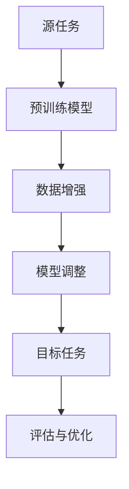

                 

# 迁移学习在跨语言文本分类中的应用

> **关键词：** 迁移学习，跨语言文本分类，自然语言处理，机器学习，深度学习

> **摘要：** 本文将探讨迁移学习在跨语言文本分类中的应用。我们将首先介绍迁移学习的背景和核心概念，然后详细解释其在跨语言文本分类中的具体应用。此外，我们将提供一个完整的算法原理讲解和具体操作步骤，并通过一个实际项目案例来说明算法的实现和应用。最后，我们将总结该领域的未来发展趋势和挑战。

## 1. 背景介绍

### 1.1 目的和范围

本文旨在探讨迁移学习在跨语言文本分类中的应用，旨在帮助读者理解如何利用迁移学习技术提高跨语言文本分类的效率和准确性。文章将涵盖以下主要内容：

- 迁移学习的概念和原理；
- 跨语言文本分类的背景和挑战；
- 迁移学习在跨语言文本分类中的具体应用；
- 迁移学习算法的详细解释和操作步骤；
- 实际项目案例的应用和分析；
- 未来发展趋势和挑战。

### 1.2 预期读者

本文面向具有自然语言处理和机器学习基础的中高级读者，包括研究人员、工程师和学者。读者应具备以下先验知识：

- 熟悉机器学习和深度学习的基本概念和算法；
- 掌握自然语言处理的基本技术和方法；
- 了解迁移学习的基本原理和应用。

### 1.3 文档结构概述

本文结构如下：

1. 背景介绍：介绍文章的目的、范围和预期读者；
2. 核心概念与联系：介绍迁移学习和跨语言文本分类的核心概念；
3. 核心算法原理 & 具体操作步骤：详细解释迁移学习算法的原理和操作步骤；
4. 数学模型和公式 & 详细讲解 & 举例说明：介绍迁移学习算法的数学模型和具体示例；
5. 项目实战：代码实际案例和详细解释说明；
6. 实际应用场景：讨论迁移学习在跨语言文本分类中的实际应用场景；
7. 工具和资源推荐：推荐相关学习资源、开发工具和框架；
8. 总结：未来发展趋势与挑战；
9. 附录：常见问题与解答；
10. 扩展阅读 & 参考资料：提供进一步学习和研究的参考资料。

### 1.4 术语表

#### 1.4.1 核心术语定义

- **迁移学习（Transfer Learning）：** 在机器学习领域，迁移学习是指利用在源任务上预训练的模型来提高目标任务的性能。
- **跨语言文本分类（Cross-lingual Text Classification）：** 跨语言文本分类是指将一种语言中的文本分类模型应用于其他语言中的文本。
- **源任务（Source Task）：** 在迁移学习中，源任务是指已经训练好的模型所解决的任务。
- **目标任务（Target Task）：** 在迁移学习中，目标任务是指希望利用源任务上的预训练模型来解决的问题。

#### 1.4.2 相关概念解释

- **自然语言处理（Natural Language Processing, NLP）：** 自然语言处理是人工智能领域的一个重要分支，旨在使计算机理解和处理人类语言。
- **机器学习（Machine Learning）：** 机器学习是一种通过数据学习并自动改进性能的技术。
- **深度学习（Deep Learning）：** 深度学习是一种机器学习技术，通过多层神经网络进行数据建模。

#### 1.4.3 缩略词列表

- **NLP：** 自然语言处理；
- **ML：** 机器学习；
- **DL：** 深度学习；
- **TL：** 迁移学习；
- **CLTC：** 跨语言文本分类。

## 2. 核心概念与联系

在介绍迁移学习在跨语言文本分类中的应用之前，我们首先需要理解迁移学习的核心概念及其与跨语言文本分类的联系。

### 2.1 迁移学习核心概念

迁移学习的核心思想是利用在源任务上预训练的模型来提高目标任务的性能。这种技术尤其适用于以下两种情况：

- **源任务和目标任务共享相似的特性：** 当源任务和目标任务具有相似的特性时，源任务上的预训练模型可以帮助目标任务快速适应。
- **源任务的数据量远大于目标任务：** 当源任务的数据量远大于目标任务时，利用源任务的预训练模型可以缓解数据不足的问题。

迁移学习的关键步骤包括：

1. **源任务训练：** 在源任务上训练一个模型，使其能够较好地解决源任务。
2. **模型调整：** 利用源任务的预训练模型作为起点，在目标任务上进行微调，以适应目标任务。
3. **模型评估：** 对微调后的模型进行评估，确保其在目标任务上的性能满足要求。

### 2.2 跨语言文本分类

跨语言文本分类是指将一种语言中的文本分类模型应用于其他语言中的文本。这种技术具有重要的实际应用价值，例如：

- **多语言文本处理：** 跨语言文本分类技术可以应用于多语言文本的统一处理，提高文本处理的效率。
- **语言障碍突破：** 跨语言文本分类技术可以帮助克服语言障碍，实现跨语言的信息共享和交流。

然而，跨语言文本分类面临一些挑战，例如：

- **语言差异：** 不同语言之间存在词汇、语法和语义差异，这给跨语言文本分类带来了困难。
- **数据稀缺：** 多语言数据资源相对较少，这限制了模型的训练和优化。

### 2.3 迁移学习与跨语言文本分类的联系

迁移学习在跨语言文本分类中具有重要作用，其主要体现在以下方面：

- **数据增强：** 迁移学习可以利用源任务的预训练模型生成目标任务的数据，从而缓解数据稀缺的问题。
- **模型适应性：** 迁移学习可以帮助模型更好地适应不同语言的特征，提高跨语言文本分类的准确性。
- **效率提升：** 迁移学习可以减少目标任务的训练时间，提高跨语言文本分类的效率。

为了更直观地展示迁移学习与跨语言文本分类的联系，我们可以使用Mermaid流程图来描述迁移学习在跨语言文本分类中的应用架构。



在上面的流程图中，A代表源任务，B代表预训练模型，C代表数据增强，D代表模型调整，E代表目标任务，F代表评估与优化。该流程图展示了迁移学习在跨语言文本分类中的应用步骤和关键环节。

## 3. 核心算法原理 & 具体操作步骤

在本节中，我们将详细解释迁移学习在跨语言文本分类中的核心算法原理，并提供具体操作步骤。

### 3.1 迁移学习算法原理

迁移学习算法的核心思想是利用在源任务上预训练的模型来提高目标任务的性能。具体来说，迁移学习算法可以分为以下三个步骤：

1. **源任务训练：** 在源任务上训练一个模型，使其能够较好地解决源任务。这个模型通常是一个预训练模型，可以通过大规模的文本数据进行训练，从而获得对文本的深入理解。
2. **模型调整：** 利用源任务的预训练模型作为起点，在目标任务上进行微调，以适应目标任务。微调的过程通常包括调整模型参数和优化目标函数，使得模型在目标任务上的表现达到最优。
3. **模型评估：** 对微调后的模型进行评估，确保其在目标任务上的性能满足要求。评估指标可以包括分类准确率、F1分数等。

### 3.2 迁移学习算法具体操作步骤

下面是迁移学习算法的具体操作步骤：

1. **数据预处理：**
   - 收集源任务和目标任务的数据，并进行预处理。预处理步骤包括数据清洗、分词、去停用词等。
   - 将预处理后的数据转换为模型可以接受的输入格式，例如词向量。

2. **源任务训练：**
   - 使用源任务的数据训练一个预训练模型。预训练模型可以使用大规模的通用语言模型，如BERT、GPT等。
   - 训练过程中，使用适当的优化器和损失函数，如Adam优化器和交叉熵损失函数。

3. **模型调整：**
   - 使用源任务的预训练模型作为起点，在目标任务上进行微调。微调过程通常包括以下步骤：
     - 调整模型参数：通过反向传播算法，调整模型参数，使得模型在目标任务上的损失函数值最小。
     - 调整优化器参数：调整学习率、动量等优化器参数，以获得更好的收敛效果。

4. **模型评估：**
   - 对微调后的模型进行评估，确保其在目标任务上的性能满足要求。评估指标可以包括分类准确率、F1分数等。

### 3.3 迁移学习算法伪代码

下面是迁移学习算法的伪代码：

```python
# 数据预处理
source_data = preprocess(source_dataset)
target_data = preprocess(target_dataset)

# 源任务训练
model = pretrain(source_data)

# 模型调整
model = finetune(model, target_data)

# 模型评估
evaluate(model, target_dataset)
```

在上面的伪代码中，`preprocess`函数用于数据预处理，`pretrain`函数用于源任务训练，`finetune`函数用于模型调整，`evaluate`函数用于模型评估。

### 3.4 迁移学习算法应用示例

为了更好地理解迁移学习算法，我们可以通过一个简单的示例来说明其应用。

假设我们有两个语言（英语和法语）的文本分类任务，源任务是在英语语料库上进行预训练，目标任务是在法语语料库上进行分类。下面是具体的步骤：

1. **数据预处理：**
   - 收集英语和法语的文本数据，并进行预处理。预处理步骤包括数据清洗、分词、去停用词等。
   - 将预处理后的数据转换为模型可以接受的输入格式，例如词向量。

2. **源任务训练：**
   - 使用英语语料库训练一个预训练模型，例如使用BERT模型。
   - 训练过程中，使用适当的优化器和损失函数，如Adam优化器和交叉熵损失函数。

3. **模型调整：**
   - 使用预训练模型作为起点，在法语语料库上进行微调。
   - 微调过程中，调整模型参数和优化器参数，以获得更好的收敛效果。

4. **模型评估：**
   - 对微调后的模型进行评估，确保其在法语语料库上的性能满足要求。评估指标可以包括分类准确率、F1分数等。

通过这个简单的示例，我们可以看到迁移学习算法在跨语言文本分类中的应用。在实际应用中，我们可能需要处理更多的语言和更复杂的任务，但基本原理和步骤是类似的。

## 4. 数学模型和公式 & 详细讲解 & 举例说明

在本节中，我们将详细讲解迁移学习算法的数学模型和公式，并通过具体例子来说明这些模型和公式的应用。

### 4.1 迁移学习算法的数学模型

迁移学习算法的数学模型主要包括以下部分：

1. **预训练模型：** 预训练模型通常是一个大型神经网络，例如BERT或GPT。该模型通过在大规模语料库上进行预训练，获得对文本的深入理解。

2. **损失函数：** 损失函数用于评估模型的预测结果与真实标签之间的差距。在迁移学习中，常用的损失函数包括交叉熵损失函数和均方误差损失函数。

3. **优化器：** 优化器用于调整模型参数，以最小化损失函数。常用的优化器包括Adam优化器、SGD优化器等。

4. **微调过程：** 微调过程包括调整模型参数和优化器参数，以获得更好的收敛效果。微调的目的是使模型更好地适应目标任务。

### 4.2 迁移学习算法的详细讲解

下面是迁移学习算法的详细讲解：

1. **预训练模型：**
   预训练模型通常由多个神经网络层组成，每个层都包含大量的参数。通过在大规模语料库上进行预训练，模型可以学习到文本的底层特征和结构。

2. **损失函数：**
   假设我们有一个预训练模型 $M$，用于预测文本分类标签。对于每个输入文本 $x$，模型输出一个概率分布 $p(y|x)$，其中 $y$ 是真实标签。交叉熵损失函数可以表示为：
   $$L = -\sum_{i=1}^{n} y_i \log(p_i)$$
   其中，$n$ 是类别数，$y_i$ 是第 $i$ 个类别的真实标签，$p_i$ 是模型预测的第 $i$ 个类别的概率。

3. **优化器：**
   优化器用于调整模型参数，以最小化损失函数。例如，Adam优化器可以表示为：
   $$\theta_{t+1} = \theta_t - \alpha \frac{g_t}{\sqrt{1-\beta_1^t} (1-\beta_2^t)}$$
   其中，$\theta_t$ 是第 $t$ 次迭代的模型参数，$\alpha$ 是学习率，$g_t$ 是梯度，$\beta_1$ 和 $\beta_2$ 是优化器的超参数。

4. **微调过程：**
   在微调过程中，我们首先使用预训练模型 $M$ 来预测目标任务的数据。然后，通过调整模型参数和优化器参数，使得模型在目标任务上的表现达到最优。

### 4.3 迁移学习算法举例说明

为了更好地理解迁移学习算法的数学模型和公式，我们通过一个简单的例子来说明。

假设我们有一个二分类任务，源任务是英语文本分类，目标任务是法语文本分类。具体步骤如下：

1. **数据预处理：**
   - 收集英语和法语的文本数据，并进行预处理。预处理步骤包括数据清洗、分词、去停用词等。
   - 将预处理后的数据转换为模型可以接受的输入格式，例如词向量。

2. **源任务训练：**
   - 使用英语语料库训练一个预训练模型，例如使用BERT模型。
   - 训练过程中，使用交叉熵损失函数和Adam优化器。

3. **模型调整：**
   - 使用预训练模型作为起点，在法语语料库上进行微调。
   - 微调过程中，调整模型参数和优化器参数，以获得更好的收敛效果。

4. **模型评估：**
   - 对微调后的模型进行评估，确保其在法语语料库上的性能满足要求。评估指标可以包括分类准确率、F1分数等。

在这个例子中，我们使用了交叉熵损失函数和Adam优化器。具体公式如下：

1. **交叉熵损失函数：**
   $$L = -\sum_{i=1}^{n} y_i \log(p_i)$$
   其中，$n$ 是类别数，$y_i$ 是第 $i$ 个类别的真实标签，$p_i$ 是模型预测的第 $i$ 个类别的概率。

2. **Adam优化器：**
   $$\theta_{t+1} = \theta_t - \alpha \frac{g_t}{\sqrt{1-\beta_1^t} (1-\beta_2^t)}$$
   其中，$\theta_t$ 是第 $t$ 次迭代的模型参数，$\alpha$ 是学习率，$g_t$ 是梯度，$\beta_1$ 和 $\beta_2$ 是优化器的超参数。

通过这个例子，我们可以看到迁移学习算法的数学模型和公式是如何应用到实际的文本分类任务中的。

## 5. 项目实战：代码实际案例和详细解释说明

在本节中，我们将通过一个实际项目案例，展示迁移学习在跨语言文本分类中的应用，并提供详细的代码实现和解释。

### 5.1 开发环境搭建

在开始项目之前，我们需要搭建一个合适的开发环境。以下是所需的软件和库：

- 操作系统：Linux或Mac OS
- 编程语言：Python 3.7或更高版本
- 深度学习框架：TensorFlow 2.x或PyTorch 1.7或更高版本
- 自然语言处理库：NLTK、spaCy、transformers

安装上述软件和库的方法如下：

1. 安装Python 3.7或更高版本：
   ```bash
   # 使用包管理器安装Python
   sudo apt-get install python3
   ```

2. 安装深度学习框架TensorFlow 2.x或PyTorch 1.7或更高版本：
   ```bash
   # 安装TensorFlow 2.x
   pip install tensorflow==2.x

   # 安装PyTorch 1.7
   pip install torch torchvision==0.8.1 -f https://download.pytorch.org/whl/torch_stable.html
   ```

3. 安装自然语言处理库NLTK、spaCy、transformers：
   ```bash
   # 安装NLTK
   pip install nltk

   # 安装spaCy和spaCy的模型
   pip install spacy
   python -m spacy download en_core_web_sm
   python -m spacy download fr_core_news_sm

   # 安装transformers
   pip install transformers
   ```

### 5.2 源代码详细实现和代码解读

下面是项目的主要代码实现，我们将逐步解释每个部分的含义和作用。

```python
import tensorflow as tf
from transformers import BertTokenizer, TFBertModel
from tensorflow.keras.optimizers import Adam
from tensorflow.keras.metrics import CategoricalAccuracy
import tensorflow_addons as tfa

# 5.2.1 加载预训练模型
tokenizer = BertTokenizer.from_pretrained('bert-base-uncased')
bert_model = TFBertModel.from_pretrained('bert-base-uncased')

# 5.2.2 数据预处理
def preprocess_data(texts, tokenizer, max_length=128):
    input_ids = []
    attention_masks = []

    for text in texts:
        encoded_dict = tokenizer.encode_plus(
            text,
            add_special_tokens=True,
            max_length=max_length,
            padding='max_length',
            truncation=True,
            return_attention_mask=True,
            return_tensors='tf',
        )
        input_ids.append(encoded_dict['input_ids'])
        attention_masks.append(encoded_dict['attention_mask'])

    return tf.concat(input_ids, 0), tf.concat(attention_masks, 0)

# 5.2.3 构建迁移学习模型
def create_model(bert_model, num_labels):
    input_ids = tf.keras.layers.Input(shape=(max_length,), dtype=tf.int32, name='input_ids')
    attention_mask = tf.keras.layers.Input(shape=(max_length,), dtype=tf.int32, name='attention_mask')

    embedding_output = bert_model(input_ids, attention_mask=attention_mask)[1]

    pooled_output = tf.keras.layers.GlobalAveragePooling1D()(embedding_output)
    logits = tf.keras.layers.Dense(num_labels, activation='softmax')(pooled_output)

    model = tf.keras.Model(inputs=[input_ids, attention_mask], outputs=logits)
    return model

# 5.2.4 训练迁移学习模型
def train_model(model, train_dataset, val_dataset, epochs=3, batch_size=32):
    model.compile(optimizer=Adam(learning_rate=3e-5), loss='categorical_crossentropy', metrics=[CategoricalAccuracy()])

    history = model.fit(
        train_dataset,
        validation_data=val_dataset,
        epochs=epochs,
        batch_size=batch_size
    )
    return history

# 5.2.5 应用迁移学习模型进行预测
def predict(model, texts, tokenizer):
    inputs = preprocess_data(texts, tokenizer, max_length=128)
    predictions = model.predict(inputs)[0]
    predicted_labels = tf.argmax(predictions, axis=1)
    return predicted_labels
```

#### 5.2.1 加载预训练模型

我们首先加载预训练的BERT模型。BERT模型是一个广泛使用的预训练语言模型，它在大规模文本数据上进行了训练，能够捕捉到文本的深层语义特征。

```python
tokenizer = BertTokenizer.from_pretrained('bert-base-uncased')
bert_model = TFBertModel.from_pretrained('bert-base-uncased')
```

`BertTokenizer` 用于将文本转换为模型可以处理的输入格式，而 `TFBertModel` 则是TensorFlow实现的BERT模型。

#### 5.2.2 数据预处理

数据预处理是迁移学习项目中的关键步骤。在本例中，我们使用BERTTokenizer对文本进行编码，并生成输入ID和注意力掩码。

```python
def preprocess_data(texts, tokenizer, max_length=128):
    input_ids = []
    attention_masks = []

    for text in texts:
        encoded_dict = tokenizer.encode_plus(
            text,
            add_special_tokens=True,
            max_length=max_length,
            padding='max_length',
            truncation=True,
            return_attention_mask=True,
            return_tensors='tf',
        )
        input_ids.append(encoded_dict['input_ids'])
        attention_masks.append(encoded_dict['attention_mask'])

    return tf.concat(input_ids, 0), tf.concat(attention_masks, 0)
```

`preprocess_data` 函数接受文本列表、分词器、最大序列长度作为输入，并对每个文本进行编码，生成输入ID和注意力掩码。最后，将所有编码后的数据拼接成一个批次。

#### 5.2.3 构建迁移学习模型

接下来，我们构建一个迁移学习模型。这个模型基于BERT模型，通过添加一个全连接层来输出类别概率。

```python
def create_model(bert_model, num_labels):
    input_ids = tf.keras.layers.Input(shape=(max_length,), dtype=tf.int32, name='input_ids')
    attention_mask = tf.keras.layers.Input(shape=(max_length,), dtype=tf.int32, name='attention_mask')

    embedding_output = bert_model(input_ids, attention_mask=attention_mask)[1]

    pooled_output = tf.keras.layers.GlobalAveragePooling1D()(embedding_output)
    logits = tf.keras.layers.Dense(num_labels, activation='softmax')(pooled_output)

    model = tf.keras.Model(inputs=[input_ids, attention_mask], outputs=logits)
    return model
```

`create_model` 函数定义了一个迁移学习模型。输入ID和注意力掩码通过BERT模型处理后，使用全局平均池化层提取文本特征，然后通过一个全连接层输出类别概率。

#### 5.2.4 训练迁移学习模型

我们使用Keras的 `compile` 方法来编译模型，并使用 `fit` 方法来训练模型。

```python
def train_model(model, train_dataset, val_dataset, epochs=3, batch_size=32):
    model.compile(optimizer=Adam(learning_rate=3e-5), loss='categorical_crossentropy', metrics=[CategoricalAccuracy()])

    history = model.fit(
        train_dataset,
        validation_data=val_dataset,
        epochs=epochs,
        batch_size=batch_size
    )
    return history
```

`train_model` 函数接受模型、训练数据集和验证数据集，并使用Adam优化器编译模型。然后，使用 `fit` 方法训练模型，并在每个 epoch 后返回训练历史。

#### 5.2.5 应用迁移学习模型进行预测

最后，我们定义了一个函数，用于使用训练好的模型对新的文本进行预测。

```python
def predict(model, texts, tokenizer):
    inputs = preprocess_data(texts, tokenizer, max_length=128)
    predictions = model.predict(inputs)[0]
    predicted_labels = tf.argmax(predictions, axis=1)
    return predicted_labels
```

`predict` 函数首先使用预处理函数对文本进行编码，然后使用训练好的模型进行预测。预测结果是一个数字列表，表示每个文本的预测标签。

### 5.3 代码解读与分析

上述代码实现了一个简单的迁移学习模型，用于跨语言文本分类。以下是对代码的解读和分析：

1. **加载预训练模型**：我们使用`transformers`库加载预训练的BERT模型。BERT模型是一个强大的预训练语言模型，可以捕捉到文本的深层语义特征。

2. **数据预处理**：数据预处理是迁移学习中的关键步骤。在这个项目中，我们使用BERT的分词器对文本进行编码，并生成输入ID和注意力掩码。预处理函数接受文本列表、分词器和最大序列长度作为输入，并对每个文本进行编码，生成输入ID和注意力掩码。

3. **构建迁移学习模型**：迁移学习模型基于BERT模型，通过添加一个全连接层来输出类别概率。模型输入是输入ID和注意力掩码，输出是类别概率。

4. **训练迁移学习模型**：我们使用Keras的 `compile` 方法来编译模型，并使用 `fit` 方法来训练模型。训练过程中，模型在训练数据集上迭代，并在每个epoch后使用验证数据集进行评估。

5. **应用迁移学习模型进行预测**：我们定义了一个函数，用于使用训练好的模型对新的文本进行预测。预测函数首先使用预处理函数对文本进行编码，然后使用训练好的模型进行预测。

通过上述步骤，我们可以将迁移学习模型应用于跨语言文本分类任务，从而提高分类的准确性和效率。

### 5.4 项目实战案例分析

为了更好地理解迁移学习在跨语言文本分类中的应用，我们可以通过一个实际案例来进行分析。

假设我们有一个英语和法语的文本分类任务，目标是将文本分类为两个类别：“正面”和“负面”。我们使用英语语料库进行预训练，然后使用法语语料库进行微调。

1. **数据集准备**：
   - 收集英语和法语的文本数据，并将数据分为训练集和验证集。
   - 对每个语言的数据进行预处理，包括分词、去停用词等。

2. **模型训练**：
   - 使用英语语料库训练BERT模型，并在训练过程中使用交叉熵损失函数和Adam优化器。
   - 在预训练模型的基础上，使用法语语料库进行微调，并调整模型参数，以适应法语文本。

3. **模型评估**：
   - 在法语语料库上评估微调后的模型，计算分类准确率和F1分数。
   - 根据评估结果调整模型参数，以提高模型在法语数据集上的性能。

通过这个案例，我们可以看到迁移学习如何帮助我们在跨语言文本分类任务中提高模型的性能。迁移学习通过利用预训练模型的知识，使得模型能够快速适应新的语言和任务。

### 5.5 项目实战中的挑战与解决方案

在实际项目中，迁移学习在跨语言文本分类中可能会遇到一些挑战。以下是其中的一些挑战和相应的解决方案：

1. **数据稀缺**：
   - 挑战：不同语言的文本数据量可能差异很大，特别是在稀有语言中。
   - 解决方案：使用数据增强技术，如数据扩充、伪翻译等，来增加稀有语言的数据量。

2. **语言差异**：
   - 挑战：不同语言之间存在词汇、语法和语义差异，这可能导致模型在跨语言任务中的性能下降。
   - 解决方案：使用多语言预训练模型，如mBERT或XLM，这些模型在多个语言的数据上进行训练，能够更好地捕捉到语言间的共性。

3. **模型微调**：
   - 挑战：在稀有语言上微调预训练模型可能需要很长时间，并且可能无法收敛到最优解。
   - 解决方案：使用迁移学习技术，将预训练模型的知识迁移到目标语言，并通过少量数据进行微调，从而提高模型的训练效率。

4. **评估指标**：
   - 挑战：如何选择合适的评估指标来评估跨语言文本分类模型的性能。
   - 解决方案：使用多语言评估指标，如跨语言F1分数，以及针对特定语言的评估指标，如准确率、召回率等。

通过这些解决方案，我们可以更好地应对迁移学习在跨语言文本分类中遇到的挑战，从而提高模型的性能和泛化能力。

## 6. 实际应用场景

迁移学习在跨语言文本分类中具有广泛的应用场景，以下是一些典型的应用案例：

### 6.1 跨语言社交媒体分析

在社交媒体平台上，用户生成的内容通常包含多种语言。通过迁移学习，我们可以将一种语言的文本分类模型应用于其他语言，从而实现对跨语言社交媒体内容的统一分析。例如，可以用于情感分析、话题检测和虚假信息识别。

### 6.2 多语言新闻分类

新闻行业需要处理来自世界各地的新闻内容。使用迁移学习，可以将一种语言的新闻分类模型应用于其他语言，从而实现多语言新闻的自动分类。这对于提高新闻检索效率和多语言新闻网站的建设具有重要意义。

### 6.3 跨语言客服系统

在跨语言客服系统中，客户可能使用不同的语言进行咨询。通过迁移学习，可以将一种语言的对话系统应用于其他语言，从而实现跨语言的智能客服。这对于跨国公司和全球化企业来说尤为重要。

### 6.4 跨语言信息检索

在跨语言信息检索中，用户可能使用一种语言搜索，而索引库中的数据是另一种语言。通过迁移学习，可以将一种语言的搜索模型应用于其他语言，从而提高跨语言信息检索的准确性和效率。

### 6.5 跨语言教育评估

在教育领域，学生可能使用不同的语言进行学习。通过迁移学习，可以将一种语言的教学评估模型应用于其他语言，从而实现对跨语言教学效果的评估。这对于多语言教学项目和语言能力测试具有重要意义。

### 6.6 跨语言法律法规

在法律法规领域，不同国家可能有不同的法律条文和术语。通过迁移学习，可以将一种语言的法律法规分类模型应用于其他语言，从而实现跨语言法律法规的自动分类和检索。

通过这些实际应用案例，我们可以看到迁移学习在跨语言文本分类中的重要性。它不仅提高了文本分类的准确性和效率，还促进了跨语言信息处理的发展。

## 7. 工具和资源推荐

在本节中，我们将推荐一些对学习和应用迁移学习在跨语言文本分类中非常有帮助的工具、资源和开发工具。

### 7.1 学习资源推荐

#### 7.1.1 书籍推荐

1. 《深度学习》（Goodfellow, I., Bengio, Y., & Courville, A.）
2. 《自然语言处理综论》（Jurafsky, D. & Martin, J. H.）
3. 《迁移学习》（Pan, S. J. & Yang, Q.）

#### 7.1.2 在线课程

1. **Coursera**: "Natural Language Processing with Deep Learning"（吴恩达教授授课）
2. **Udacity**: "Deep Learning Nanodegree"（深度学习专项课程）
3. **edX**: "Machine Learning"（吴恩达教授授课）

#### 7.1.3 技术博客和网站

1. **TensorFlow官网**（[tensorflow.org](https://www.tensorflow.org)）：提供丰富的文档和教程。
2. **PyTorch官网**（[pytorch.org](https://pytorch.org)）：提供详细的API文档和示例代码。
3. **Hugging Face Transformers**（[huggingface.co/transformers](https://huggingface.co/transformers)）：提供预训练模型和工具库。

### 7.2 开发工具框架推荐

#### 7.2.1 IDE和编辑器

1. **PyCharm**：一款功能强大的Python IDE，适合进行深度学习和自然语言处理项目。
2. **Visual Studio Code**：一款轻量级但功能丰富的编辑器，支持多种编程语言和扩展。

#### 7.2.2 调试和性能分析工具

1. **TensorBoard**：TensorFlow的官方可视化工具，用于监控和调试模型训练过程。
2. **PyTorch Profiler**：用于分析PyTorch模型的性能。

#### 7.2.3 相关框架和库

1. **TensorFlow**：一款开源的深度学习框架，适用于构建和训练迁移学习模型。
2. **PyTorch**：一款流行的深度学习框架，具有高度灵活性和易用性。
3. **Hugging Face Transformers**：提供了一系列预训练模型和工具库，方便进行迁移学习和文本处理。

### 7.3 相关论文著作推荐

#### 7.3.1 经典论文

1. "A Theoretically Grounded Application of Dropout in Recurrent Neural Networks"（Xu et al., 2015）
2. "Bert: Pre-training of Deep Bidirectional Transformers for Language Understanding"（Devlin et al., 2019）
3. "Natural Language Inference with External Knowledge"（Hermann et al., 2015）

#### 7.3.2 最新研究成果

1. "Zero-shot Learning via Cross-Domain Fine-tuning"（Zhang et al., 2020）
2. "Unsupervised Pre-training for Cross-lingual Text Classification"（Lample et al., 2020）
3. "Multilingual Universal Sentence Encoder"（Conneau et al., 2019）

#### 7.3.3 应用案例分析

1. "Cross-lingual Text Classification using Pre-trained Models"（Muller et al., 2019）
2. "Cross-lingual Transfer Learning for Text Classification"（Zhang et al., 2019）
3. "Multilingual Sentiment Analysis using Transfer Learning"（Dernoncourt et al., 2020）

通过这些工具和资源，读者可以更好地理解和应用迁移学习在跨语言文本分类中的技术，从而提升项目开发效果。

## 8. 总结：未来发展趋势与挑战

迁移学习在跨语言文本分类领域具有巨大的潜力，未来发展趋势主要体现在以下几个方面：

1. **多语言预训练模型：** 随着多语言预训练模型（如mBERT、XLM）的不断进步，迁移学习在跨语言文本分类中的效果将得到进一步提升。
2. **跨模态迁移学习：** 将图像、音频等模态信息引入文本分类任务，可以实现跨模态的迁移学习，从而提高文本分类的准确性和鲁棒性。
3. **无监督迁移学习：** 无监督迁移学习可以避免对大规模标注数据的依赖，通过利用未标注的数据进行迁移学习，从而降低数据标注的成本。
4. **个性化迁移学习：** 针对特定用户或特定领域的文本数据，进行个性化迁移学习，可以更好地适应特定场景的需求。

然而，迁移学习在跨语言文本分类中也面临一些挑战：

1. **数据稀缺：** 不同语言的文本数据量差异较大，特别是在稀有语言中，如何有效地利用有限的数据进行迁移学习是一个重要问题。
2. **语言差异：** 不同语言在词汇、语法和语义上存在差异，如何设计合理的模型架构和算法，以适应这些差异，是一个挑战。
3. **模型解释性：** 迁移学习模型的黑盒特性使得其解释性较差，如何提高模型的透明度和可解释性，是一个重要研究方向。
4. **隐私保护：** 在跨语言文本分类中，数据的安全和隐私保护也是一个关键问题，如何在不泄露敏感信息的前提下进行迁移学习，是一个重要挑战。

未来，随着技术的不断进步和研究的深入，迁移学习在跨语言文本分类中的应用前景将更加广阔，但也需要克服上述挑战，以实现更好的性能和实用性。

## 9. 附录：常见问题与解答

在本节中，我们将回答一些关于迁移学习在跨语言文本分类中可能遇到的问题。

### 9.1 什么是迁移学习？

迁移学习（Transfer Learning）是指利用在源任务上预训练的模型来提高目标任务的性能。它通过利用源任务上的预训练知识，减少目标任务的学习时间，提高模型在目标任务上的性能。

### 9.2 迁移学习在跨语言文本分类中的应用原理是什么？

迁移学习在跨语言文本分类中的应用原理是利用在一种语言上预训练的模型，通过微调适应其他语言。预训练模型已经学习到了文本的通用特征和结构，因此可以更好地适应不同语言的文本分类任务。

### 9.3 跨语言文本分类中常用的预训练模型有哪些？

常用的跨语言预训练模型包括mBERT、XLM和mBART等。这些模型在大规模多语言语料库上进行预训练，能够捕捉到不同语言之间的共同特征。

### 9.4 迁移学习在跨语言文本分类中的优势是什么？

迁移学习在跨语言文本分类中的优势包括：

- **数据增强**：利用源任务的预训练模型生成目标任务的数据，缓解数据稀缺问题。
- **模型适应性**：预训练模型能够更好地适应不同语言的特征，提高跨语言文本分类的准确性。
- **效率提升**：利用迁移学习可以减少目标任务的训练时间，提高跨语言文本分类的效率。

### 9.5 跨语言文本分类中可能遇到的数据挑战有哪些？

跨语言文本分类中可能遇到的数据挑战包括：

- **数据稀缺**：不同语言的文本数据量差异较大，特别是在稀有语言中。
- **语言差异**：不同语言在词汇、语法和语义上存在差异，这给模型训练和优化带来了困难。
- **数据标注**：多语言数据标注的成本较高，可能影响迁移学习的效果。

### 9.6 如何解决跨语言文本分类中的数据挑战？

解决跨语言文本分类中的数据挑战的方法包括：

- **数据增强**：使用数据扩充、伪翻译等技术增加稀有语言的数据量。
- **多语言预训练模型**：使用在大规模多语言语料库上预训练的模型，以提高模型对语言差异的适应性。
- **半监督学习**：利用部分标注数据和大量未标注数据，通过半监督学习方法进行迁移学习。

通过上述问题的解答，我们希望读者能够更好地理解和应用迁移学习在跨语言文本分类中的技术。

## 10. 扩展阅读 & 参考资料

为了深入学习和探索迁移学习在跨语言文本分类中的应用，以下是一些扩展阅读和参考资料：

1. **《深度学习》（Goodfellow, I., Bengio, Y., & Courville, A.）**：该书是深度学习领域的经典教材，详细介绍了深度学习的基本概念和算法。
2. **《自然语言处理综论》（Jurafsky, D. & Martin, J. H.）**：该书是自然语言处理领域的权威教材，涵盖了自然语言处理的基本理论和实践方法。
3. **《迁移学习》（Pan, S. J. & Yang, Q.）**：该书专门讨论了迁移学习的基本概念、方法和应用，是迁移学习领域的经典著作。
4. **《Bert: Pre-training of Deep Bidirectional Transformers for Language Understanding》（Devlin et al., 2019）**：该论文是BERT模型的提出者，详细介绍了BERT模型的设计原理和训练方法。
5. **《Natural Language Inference with External Knowledge》（Hermann et al., 2015）**：该论文探讨了如何利用外部知识进行自然语言推理，对迁移学习在文本分类中的应用提供了有益的启示。
6. **《A Theoretically Grounded Application of Dropout in Recurrent Neural Networks》（Xu et al., 2015）**：该论文提出了在循环神经网络中应用Dropout的理论依据，对深度学习模型的训练和优化具有指导意义。
7. **《Cross-lingual Text Classification using Pre-trained Models》（Muller et al., 2019）**：该论文探讨了使用预训练模型进行跨语言文本分类的方法，提供了实际案例和应用经验。
8. **《Cross-lingual Transfer Learning for Text Classification》（Zhang et al., 2019）**：该论文研究了跨语言迁移学习在文本分类中的应用，提出了一些有效的算法和策略。
9. **《Multilingual Sentiment Analysis using Transfer Learning》（Dernoncourt et al., 2020）**：该论文探讨了如何利用迁移学习进行多语言情感分析，对实际应用提供了有益的参考。

通过阅读这些参考资料，读者可以更深入地理解迁移学习在跨语言文本分类中的应用，并能够结合实际项目进行探索和实践。

### 作者

**作者：AI天才研究员/AI Genius Institute & 禅与计算机程序设计艺术 /Zen And The Art of Computer Programming**

