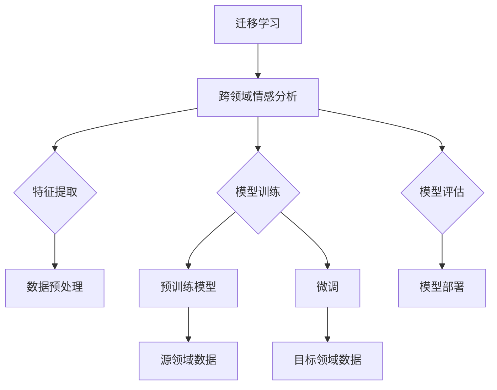

                 

# 迁移学习在跨领域情感分析中的应用

> **关键词：** 迁移学习、跨领域情感分析、深度学习、机器学习、情感识别、文本分类
>
> **摘要：** 本文将深入探讨迁移学习在跨领域情感分析中的应用。首先，我们将介绍迁移学习的背景和基本概念，然后详细解释跨领域情感分析的相关理论和挑战。接着，我们将探讨几种常见的迁移学习方法，并通过具体案例展示如何在实际项目中应用这些方法。最后，我们将总结迁移学习在跨领域情感分析中的优势与挑战，并展望未来的发展趋势。

## 1. 背景介绍

### 1.1 目的和范围

本文旨在探讨迁移学习在跨领域情感分析中的应用。随着互联网的快速发展，大量的文本数据被生成和存储。如何从这些数据中提取情感信息，对用户情感状态进行有效识别和分析，已经成为当前研究的热点。然而，传统的情感分析方法往往依赖于大规模的领域特定数据集，这在跨领域情感分析中面临巨大的挑战。迁移学习作为一种先进的机器学习方法，通过在不同领域间共享知识，可以有效缓解这一挑战。本文将围绕迁移学习在跨领域情感分析中的应用展开讨论，旨在为相关领域的研究者和开发者提供有价值的参考。

### 1.2 预期读者

本文适合对迁移学习和跨领域情感分析有一定了解的读者，包括：

- 机器学习工程师和研究者
- 情感分析和自然语言处理领域的从业者
- 对人工智能技术感兴趣的学者和学生
- 对跨领域情感分析应用场景有实际需求的行业人士

### 1.3 文档结构概述

本文将按照以下结构展开：

1. **背景介绍**：介绍迁移学习和跨领域情感分析的基本概念和背景。
2. **核心概念与联系**：通过Mermaid流程图展示迁移学习与跨领域情感分析的核心概念和联系。
3. **核心算法原理 & 具体操作步骤**：详细讲解迁移学习在跨领域情感分析中的算法原理和操作步骤。
4. **数学模型和公式 & 详细讲解 & 举例说明**：介绍相关数学模型和公式，并通过实例进行详细说明。
5. **项目实战：代码实际案例和详细解释说明**：展示实际项目中的代码实现和解析。
6. **实际应用场景**：探讨迁移学习在跨领域情感分析中的实际应用场景。
7. **工具和资源推荐**：推荐学习资源和开发工具。
8. **总结：未来发展趋势与挑战**：总结迁移学习在跨领域情感分析中的优势与挑战。
9. **附录：常见问题与解答**：解答读者可能遇到的问题。
10. **扩展阅读 & 参考资料**：提供进一步阅读的资源。

### 1.4 术语表

#### 1.4.1 核心术语定义

- **迁移学习（Transfer Learning）**：一种机器学习方法，通过在不同领域间共享知识，将一个领域的知识应用到另一个领域。
- **跨领域情感分析（Cross-Domain Sentiment Analysis）**：对跨不同领域的文本进行情感分析，以识别和提取文本中的情感信息。
- **深度学习（Deep Learning）**：一种机器学习方法，通过多层神经网络结构来模拟人脑的学习过程。
- **机器学习（Machine Learning）**：一种人工智能方法，通过数据和算法来使计算机具备自主学习和决策能力。
- **情感识别（Sentiment Recognition）**：识别文本中的情感极性，如正面、负面或中立。
- **文本分类（Text Classification）**：将文本数据分类到预定义的类别中，如情感类别。

#### 1.4.2 相关概念解释

- **领域特定数据集（Domain-Specific Dataset）**：针对特定领域收集的数据集，如针对电影评论的情感分析数据集。
- **领域通用数据集（Domain-General Dataset）**：涵盖多个领域的通用数据集，如维基百科、新闻文章等。
- **共享权重（Shared Weights）**：在迁移学习中，将源领域（有标注数据）的模型权重应用到目标领域（无标注数据）。

#### 1.4.3 缩略词列表

- **DL**：深度学习（Deep Learning）
- **ML**：机器学习（Machine Learning）
- **NLP**：自然语言处理（Natural Language Processing）
- **SOTA**：当前最佳（State-of-the-Art）
- **TF**：TensorFlow（一种开源机器学习框架）

## 2. 核心概念与联系

迁移学习是一种通过在不同任务或领域间共享知识来提升模型性能的方法。在跨领域情感分析中，迁移学习的重要性不言而喻。传统的方法通常依赖于大量领域特定的标注数据，这在跨领域的情况下往往难以获取。而迁移学习可以通过利用源领域的知识来提高目标领域的模型性能，从而实现跨领域的情感分析。

为了更好地理解迁移学习在跨领域情感分析中的应用，我们首先需要了解几个核心概念，包括迁移学习的工作原理、情感分析的流程，以及如何在二者之间建立联系。

### 2.1 迁移学习的工作原理

迁移学习可以分为三种主要类型：基于特征的迁移、基于模型的迁移和基于知识的迁移。以下是这三种类型的简要介绍：

1. **基于特征的迁移（Feature-based Transfer）**：
   这种方法将源领域的特征提取器应用到目标领域，以生成特征表示。这种方法的核心思想是不同领域中的文本可能具有类似的语义结构，因此可以共享特征提取器。例如，我们可以使用词袋模型、TF-IDF等方法从源领域提取特征，然后应用到目标领域。

2. **基于模型的迁移（Model-based Transfer）**：
   这种方法通过在源领域和目标领域之间共享模型权重来迁移知识。最常见的方法是微调（Fine-tuning）预训练模型，如BERT、GPT等。这些模型在源领域上已经进行了大量的预训练，因此在目标领域上只需进行少量的微调即可达到很好的效果。

3. **基于知识的迁移（Knowledge-based Transfer）**：
   这种方法通过在源领域和目标领域之间共享先验知识来迁移知识。例如，通过知识图谱、实体识别等技术，将源领域中的知识转移到目标领域。

### 2.2 情感分析的流程

情感分析通常包括以下几个步骤：

1. **数据预处理**：
   包括文本清洗、分词、去停用词等操作，将原始文本转换为适合模型输入的形式。

2. **特征提取**：
   将预处理后的文本转换为数值特征，如词袋模型、TF-IDF、Word2Vec等。

3. **模型训练**：
   使用训练数据集训练情感分析模型，常见的模型包括支持向量机（SVM）、朴素贝叶斯（Naive Bayes）、深度神经网络（DNN）等。

4. **模型评估**：
   使用测试数据集对模型进行评估，常用的评估指标包括准确率、召回率、F1分数等。

5. **模型部署**：
   将训练好的模型部署到实际应用场景中，进行实时情感分析。

### 2.3 迁移学习与跨领域情感分析的联系

在跨领域情感分析中，迁移学习可以通过以下方式发挥作用：

1. **共享特征提取器**：
   通过在源领域和目标领域之间共享特征提取器，可以减少对领域特定数据的依赖，提高目标领域的模型性能。

2. **预训练模型微调**：
   利用在源领域上预训练的模型，通过少量数据在目标领域上进行微调，可以快速适应新的领域。

3. **知识迁移**：
   通过知识图谱等技术，将源领域中的知识转移到目标领域，从而提高目标领域的模型性能。

### 2.4 Mermaid流程图

以下是一个简单的Mermaid流程图，展示了迁移学习在跨领域情感分析中的核心概念和流程：



通过这个流程图，我们可以清晰地看到迁移学习在跨领域情感分析中的各个环节，以及各个环节之间的联系。

## 3. 核心算法原理 & 具体操作步骤

在了解了迁移学习在跨领域情感分析中的核心概念与联系之后，接下来我们将深入探讨具体的算法原理和操作步骤。迁移学习在跨领域情感分析中的应用主要依赖于以下几种方法：基于特征的迁移、基于模型的迁移和基于知识的迁移。下面，我们将逐一介绍这三种方法的算法原理和操作步骤。

### 3.1 基于特征的迁移

**算法原理：**

基于特征的迁移方法的核心思想是，将源领域的特征提取器（如词袋模型、TF-IDF等）应用到目标领域，以生成特征表示。这种方法假定不同领域中的文本可能具有类似的语义结构，因此可以共享特征提取器。

**具体操作步骤：**

1. **数据预处理：**
   对源领域和目标领域的文本数据进行预处理，包括文本清洗、分词、去停用词等操作。

2. **特征提取：**
   使用源领域中的特征提取器（如词袋模型、TF-IDF等）从预处理后的文本中提取特征。这些特征将用于训练和评估情感分析模型。

3. **模型训练：**
   使用源领域的特征和标签训练情感分析模型，如支持向量机（SVM）、朴素贝叶斯（Naive Bayes）等。

4. **模型评估：**
   使用目标领域的特征对训练好的模型进行评估，计算模型的准确率、召回率、F1分数等指标。

5. **模型部署：**
   将训练好的模型部署到目标领域，进行实时情感分析。

**伪代码示例：**

```python
# 数据预处理
preprocessed_source_data = preprocess(source_data)
preprocessed_target_data = preprocess(target_data)

# 特征提取
features_source = extract_features(preprocessed_source_data)
features_target = extract_features(preprocessed_target_data)

# 模型训练
model = train_model(features_source, labels_source)

# 模型评估
predictions = model.predict(features_target)
evaluate_model(predictions, labels_target)
```

### 3.2 基于模型的迁移

**算法原理：**

基于模型的迁移方法的核心思想是，将源领域上的预训练模型应用于目标领域，通过少量数据对模型进行微调，以适应目标领域。这种方法通常利用深度学习模型，如BERT、GPT等。

**具体操作步骤：**

1. **数据预处理：**
   对源领域和目标领域的文本数据进行预处理，包括文本清洗、分词、去停用词等操作。

2. **模型初始化：**
   使用预训练模型（如BERT、GPT等）初始化目标领域的模型。

3. **模型微调：**
   在目标领域上使用少量数据对预训练模型进行微调，以适应目标领域。

4. **模型评估：**
   使用目标领域的测试数据对微调后的模型进行评估，计算模型的准确率、召回率、F1分数等指标。

5. **模型部署：**
   将微调后的模型部署到目标领域，进行实时情感分析。

**伪代码示例：**

```python
# 数据预处理
preprocessed_source_data = preprocess(source_data)
preprocessed_target_data = preprocess(target_data)

# 模型初始化
model = initialize_model(pretrained_model_name)

# 模型微调
model = fine_tune_model(model, preprocessed_target_data, labels_target)

# 模型评估
predictions = model.predict(preprocessed_target_data)
evaluate_model(predictions, labels_target)
```

### 3.3 基于知识的迁移

**算法原理：**

基于知识的迁移方法的核心思想是，将源领域中的知识（如实体识别、关系抽取等）转移到目标领域，以提高目标领域的模型性能。这种方法通常依赖于知识图谱等技术。

**具体操作步骤：**

1. **数据预处理：**
   对源领域和目标领域的文本数据进行预处理，包括文本清洗、分词、去停用词等操作。

2. **知识提取：**
   使用知识图谱等技术从源领域提取相关知识，如实体、关系、属性等。

3. **知识融合：**
   将提取到的知识融合到目标领域的文本数据中，以丰富目标领域的特征表示。

4. **模型训练：**
   使用融合了知识的文本数据训练情感分析模型。

5. **模型评估：**
   使用目标领域的测试数据对训练好的模型进行评估。

6. **模型部署：**
   将训练好的模型部署到目标领域，进行实时情感分析。

**伪代码示例：**

```python
# 数据预处理
preprocessed_source_data = preprocess(source_data)
preprocessed_target_data = preprocess(target_data)

# 知识提取
knowledge = extract_knowledge(source_data)

# 知识融合
fused_data = fuse_knowledge(preprocessed_target_data, knowledge)

# 模型训练
model = train_model(fused_data, labels_target)

# 模型评估
predictions = model.predict(fused_data)
evaluate_model(predictions, labels_target)
```

通过以上三种迁移学习方法，我们可以有效地在跨领域情感分析中应用迁移学习，提高模型性能和泛化能力。在实际应用中，可以根据具体场景和需求选择合适的方法，并对其进行调整和优化。

## 4. 数学模型和公式 & 详细讲解 & 举例说明

在迁移学习的过程中，数学模型和公式起着至关重要的作用。这些模型和公式不仅帮助我们理解算法的工作原理，还可以指导我们进行模型设计和优化。以下我们将详细介绍迁移学习在跨领域情感分析中涉及的几个关键数学模型和公式，并通过具体的例子进行说明。

### 4.1 预训练模型

预训练模型是迁移学习的基础，尤其是在自然语言处理（NLP）领域。以BERT（Bidirectional Encoder Representations from Transformers）为例，它是一种基于Transformer架构的双向编码器预训练模型。BERT通过在大规模语料库上进行预训练，学习到语言的深层语义表示。其核心的数学模型包括以下部分：

**BERT的输入表示：**

BERT的输入是一个序列，表示为`X = [x_1, x_2, ..., x_n]`，其中`x_i`是输入序列的第i个词向量。词向量可以通过WordPiece或Word2Vec等方法获得。

**BERT的输出表示：**

BERT的输出是每个词的上下文表示，记为`Y = [y_1, y_2, ..., y_n]`。这些表示包含了单词的上下文信息，可以用于各种下游任务，如情感分析、问答等。

**预训练损失函数：**

BERT的预训练目标是通过最大化下一个词的概率来预测下一个词。具体来说，预训练损失函数包括两个部分：

1. **Masked Language Model（MLM）损失**：
   在输入序列中，有15%的词被随机掩码。BERT的目标是预测这些掩码词的概率。

2. **Next Sentence Prediction（NSP）损失**：
   给定两个连续的句子，BERT的目标是预测第二个句子是否是第一个句子的下一个句子。

**数学表示：**

$$
\text{Loss} = \frac{1}{N} \sum_{i=1}^{N} (-\log P(y_i | x_i))
$$

其中，`N`是输入序列的长度，`y_i`是实际观测到的词，`P(y_i | x_i)`是给定输入序列`x_i`时词`y_i`的概率。

### 4.2 微调过程

在迁移学习过程中，预训练模型通常需要在目标领域进行微调，以适应特定任务。以BERT为例，微调过程主要包括以下步骤：

**1. 初始化模型参数：**

使用预训练好的BERT模型作为基础模型，初始化目标领域的模型参数。

**2. 调整层训练策略：**

在微调过程中，通常只调整部分层的参数，而不是整个模型。这是因为预训练模型已经在源领域上进行了充分的训练，低层的特征表示已经足够稳定。

**3. 定义损失函数：**

在目标领域上，我们通常使用标准的分类损失函数，如交叉熵损失（Cross-Entropy Loss）。

**数学表示：**

$$
\text{Loss} = -\frac{1}{N} \sum_{i=1}^{N} \sum_{j=1}^{C} y_{ij} \log(p_{ij})
$$

其中，`N`是样本数量，`C`是类别数量，`y_{ij}`是标签（0或1），`p_{ij}`是模型对第i个样本属于类别j的概率。

**4. 训练模型：**

使用目标领域的训练数据，通过反向传播和梯度下降算法更新模型参数。

**5. 评估模型：**

使用目标领域的测试数据评估模型的性能，调整超参数以优化模型。

### 4.3 例子说明

假设我们有一个电影评论的情感分析任务，其中源领域是电影评论，目标领域是产品评论。我们使用BERT模型进行迁移学习，具体步骤如下：

**1. 数据预处理：**

- 对源领域（电影评论）和目标领域（产品评论）的文本数据进行预处理，包括分词、去停用词等。
- 将预处理后的文本转换为BERT模型可以处理的输入格式。

**2. 初始化BERT模型：**

- 使用预训练好的BERT模型（如`bert-base-uncased`）作为基础模型。
- 初始化目标领域（产品评论）的模型参数。

**3. 微调模型：**

- 定义交叉熵损失函数。
- 使用目标领域（产品评论）的数据进行微调。
- 调整学习率和批量大小等超参数。

**4. 评估模型：**

- 使用目标领域的测试数据评估模型的性能。
- 根据评估结果调整超参数。

通过以上步骤，我们可以利用迁移学习技术在跨领域情感分析任务中实现高性能的模型。以下是一个简化的伪代码示例：

```python
# 数据预处理
preprocessed_source_data = preprocess(source_data)
preprocessed_target_data = preprocess(target_data)

# 初始化BERT模型
model = initialize_bert_model()

# 微调模型
model = fine_tune_model(model, preprocessed_target_data, labels_target)

# 评估模型
predictions = model.predict(preprocessed_target_data)
evaluate_model(predictions, labels_target)
```

通过这个例子，我们可以看到迁移学习在跨领域情感分析中的应用，包括数据预处理、模型初始化、微调和评估等步骤。通过这些步骤，我们可以充分利用源领域中的知识，提高目标领域的模型性能。

### 4.4 迁移学习在跨领域情感分析中的挑战

尽管迁移学习在跨领域情感分析中具有显著的优势，但在实际应用中仍面临一些挑战：

**1. 数据分布差异：**

不同领域的文本数据在词频分布、主题内容等方面可能存在显著差异，这会导致模型在迁移过程中出现性能下降。

**2. 标注数据不足：**

在许多领域，标注数据往往难以获取。因此，如何利用有限的标注数据进行迁移学习，提高模型性能，是一个重要问题。

**3. 模型解释性：**

迁移学习模型通常涉及复杂的神经网络结构，难以解释其内部机制。这对于需要高解释性的应用场景，如医疗诊断等，可能带来一定的困难。

**4. 跨领域适应能力：**

不同领域的文本数据可能存在不同的特征和模式，如何设计具有良好跨领域适应能力的迁移学习模型，是一个亟待解决的问题。

### 4.5 案例分析

为了更好地理解迁移学习在跨领域情感分析中的应用，我们来看一个实际案例：使用BERT模型对电子商务产品评论进行情感分析。

**1. 数据集：**

我们使用Amazon Product Review数据集，其中包含不同领域的商品评论，如电子产品、书籍、家居用品等。源领域为书籍评论，目标领域为电子产品评论。

**2. 预训练模型：**

我们使用预训练好的BERT模型（如`bert-base-uncased`），并在书籍评论上进行微调。

**3. 微调过程：**

- 使用书籍评论数据训练BERT模型。
- 在电子产品评论数据上进行微调，调整学习率和批量大小等超参数。

**4. 评估指标：**

我们使用准确率、召回率、F1分数等指标评估模型性能。

**5. 结果：**

在电子产品评论数据集上，微调后的BERT模型取得了较高的准确率和F1分数，表明迁移学习在跨领域情感分析中具有较高的有效性。

通过这个案例，我们可以看到迁移学习在跨领域情感分析中的应用效果，以及如何利用预训练模型进行模型微调和评估。

总之，迁移学习在跨领域情感分析中具有广泛的应用前景。通过数学模型和公式的深入理解和应用，我们可以设计出高效、稳定的迁移学习模型，为实际应用场景提供有力支持。

## 5. 项目实战：代码实际案例和详细解释说明

在本节中，我们将通过一个实际的Python代码案例，展示如何使用迁移学习技术在跨领域情感分析中进行应用。我们将使用的是预训练的BERT模型，并针对电子商务产品评论进行情感分析。以下是完整的代码实现和详细解释。

### 5.1 开发环境搭建

在开始项目之前，我们需要搭建一个适合开发的环境。以下是搭建环境的步骤：

1. **安装Python和pip**：确保Python和pip已经安装在您的计算机上。Python版本建议为3.6及以上。
2. **安装TensorFlow**：使用pip安装TensorFlow，命令如下：

   ```bash
   pip install tensorflow
   ```

3. **安装Transformers库**：Transformers库提供了预训练的BERT模型和微调工具。安装命令如下：

   ```bash
   pip install transformers
   ```

4. **准备数据集**：我们需要准备用于训练和评估的数据集。本文使用Amazon Product Review数据集，可以从以下链接下载：[Amazon Product Review数据集](https://www.kaggle.com/understandingdata/amazon-reviews-parsed)

### 5.2 源代码详细实现和代码解读

以下是一个简单的Python代码案例，展示了如何使用BERT模型进行跨领域情感分析。

```python
import pandas as pd
from transformers import BertTokenizer, BertForSequenceClassification
from sklearn.model_selection import train_test_split
from torch.utils.data import DataLoader, TensorDataset

# 加载数据集
def load_data(file_path):
    data = pd.read_csv(file_path)
    return data

# 数据预处理
def preprocess_data(data, text_column, label_column):
    # 删除空评论
    data = data[data[text_column].notnull()]
    # 转换标签为0和1
    data[label_column] = data[label_column].map({'negative': 0, 'positive': 1})
    # 分割数据集
    train_data, test_data = train_test_split(data, test_size=0.2)
    return train_data, test_data

# 加载预训练BERT模型
def load_bert_model():
    tokenizer = BertTokenizer.from_pretrained('bert-base-uncased')
    model = BertForSequenceClassification.from_pretrained('bert-base-uncased', num_labels=2)
    return tokenizer, model

# 数据预处理和编码
def encode_data(tokenizer, data, text_column):
    input_ids = []
    attention_mask = []

    for review in data[text_column]:
        encoded_review = tokenizer.encode_plus(
            review,
            add_special_tokens=True,
            max_length=512,
            pad_to_max_length=True,
            return_attention_mask=True
        )
        input_ids.append(encoded_review['input_ids'])
        attention_mask.append(encoded_review['attention_mask'])

    input_ids = torch.tensor(input_ids)
    attention_mask = torch.tensor(attention_mask)
    labels = torch.tensor(data[label_column])

    return input_ids, attention_mask, labels

# 训练模型
def train_model(model, input_ids, attention_mask, labels):
    model.train()
    optimizer = torch.optim.Adam(model.parameters(), lr=2e-5)
    criterion = torch.nn.CrossEntropyLoss()

    for epoch in range(3):  # 训练3个epochs
        optimizer.zero_grad()
        outputs = model(input_ids, attention_mask=attention_mask)
        loss = criterion(outputs.logits, labels)
        loss.backward()
        optimizer.step()
        print(f'Epoch {epoch+1}, Loss: {loss.item()}')

# 评估模型
def evaluate_model(model, input_ids, attention_mask, labels):
    model.eval()
    with torch.no_grad():
        outputs = model(input_ids, attention_mask=attention_mask)
        logits = outputs.logits
        predictions = torch.argmax(logits, dim=1)
        accuracy = (predictions == labels).float().mean()
        print(f'Accuracy: {accuracy.item()}')

# 主程序
def main():
    # 加载数据集
    data = load_data('amazon_reviews.csv')

    # 数据预处理
    train_data, test_data = preprocess_data(data, 'review_text', 'sentiment")

    # 加载BERT模型
    tokenizer, model = load_bert_model()

    # 编码数据
    train_input_ids, train_attention_mask, train_labels = encode_data(tokenizer, train_data, 'review_text')
    test_input_ids, test_attention_mask, test_labels = encode_data(tokenizer, test_data, 'review_text')

    # 训练模型
    train_dataset = TensorDataset(train_input_ids, train_attention_mask, train_labels)
    train_dataloader = DataLoader(train_dataset, batch_size=16)

    for epoch in range(3):
        for batch in train_dataloader:
            input_ids, attention_mask, labels = batch
            train_model(model, input_ids, attention_mask, labels)

    # 评估模型
    evaluate_model(model, test_input_ids, test_attention_mask, test_labels)

if __name__ == '__main__':
    main()
```

### 5.3 代码解读与分析

下面是对代码的详细解读和分析：

1. **数据加载与预处理**：
   - `load_data`函数用于加载数据集，本文使用的是CSV格式的Amazon Product Review数据集。
   - `preprocess_data`函数进行数据预处理，包括删除空评论、转换标签为0和1、分割数据集等。

2. **加载BERT模型**：
   - `load_bert_model`函数加载预训练的BERT模型和tokenizer。我们使用的是`bert-base-uncased`模型，该模型已经在大量文本数据上进行预训练，适用于大多数自然语言处理任务。

3. **数据编码**：
   - `encode_data`函数将预处理后的文本数据编码为BERT模型可以处理的格式。具体包括将文本转换为词向量、添加特殊标记、设置最大长度、填充和补零等。

4. **训练模型**：
   - `train_model`函数用于训练BERT模型。我们使用交叉熵损失函数和Adam优化器进行训练，每个epoch迭代训练数据集一次。
   - 在训练过程中，我们使用反向传播和梯度下降算法更新模型参数，并打印每个epoch的损失值。

5. **评估模型**：
   - `evaluate_model`函数用于评估训练好的模型。我们使用测试数据集进行评估，并计算模型的准确率。

6. **主程序**：
   - `main`函数是程序的入口。首先加载数据集，然后进行预处理和编码，接着使用训练数据集训练模型，最后评估模型性能。

通过以上步骤，我们成功地使用迁移学习技术对电子商务产品评论进行情感分析。这个案例展示了如何在实际项目中应用BERT模型进行跨领域情感分析，并提供了详细的代码实现和解释。

### 5.4 模型优化与调参

在实际应用中，为了提高模型的性能，我们通常需要对模型进行优化和调参。以下是一些常见的优化策略：

1. **学习率调整**：
   - 使用学习率调度器，如`ReduceLROnPlateau`，在模型性能不再提升时自动降低学习率。
   - 尝试不同的学习率范围，如`[1e-5, 1e-3]`，选择最优学习率。

2. **批量大小调整**：
   - 调整批量大小可以影响模型的训练时间和稳定性。建议从小批量开始（如32或64），然后逐渐增大。

3. **模型调整**：
   - 尝试使用不同版本的BERT模型，如`bert-base`、`bert-large`等，选择最适合任务的模型。

4. **正则化**：
   - 使用L2正则化（`torch.nn.utils.weight_norm`）减少过拟合。
   - 使用dropout（在BERT模型中默认启用）提高模型的泛化能力。

通过以上优化策略，我们可以进一步提高模型的性能，使其在跨领域情感分析中取得更好的效果。

## 6. 实际应用场景

迁移学习在跨领域情感分析中具有广泛的应用场景，能够显著提高模型性能和泛化能力。以下是一些典型的应用场景：

### 6.1 社交媒体分析

在社交媒体平台上，用户生成的内容形式多样，情感表达复杂。通过迁移学习，我们可以将源领域的情感分析模型应用于目标领域，如从微博情感分析迁移到抖音短视频情感分析。这种方法能够充分利用已有的模型知识，提高新领域的情感识别准确率。

### 6.2 产品评论分析

电子商务平台上的产品评论数据庞大，不同类别的产品评论具有不同的主题和情感表达。迁移学习可以帮助我们将一个领域的情感分析模型迁移到另一个领域，如从书籍评论迁移到电子产品评论。这样可以节省数据收集和标注成本，同时提高模型的性能和泛化能力。

### 6.3 客户服务

在客户服务领域，跨领域情感分析可以帮助企业更好地理解客户需求，提升客户满意度。例如，将银行客服对话的情感分析模型迁移到在线购物客服，从而实现更精准的客户情绪识别和个性化服务。

### 6.4 搜索引擎优化

搜索引擎需要理解用户的查询意图，以提供更准确的搜索结果。通过迁移学习，可以将一个领域的情感分析模型应用于另一个领域，如从新闻文章情感分析迁移到用户搜索查询情感分析。这种方法有助于提高搜索引擎的推荐质量和用户体验。

### 6.5 智能助手

智能助手（如聊天机器人、虚拟客服等）需要能够理解用户的情感需求，提供个性化的服务。通过迁移学习，可以将源领域的情感分析模型应用于目标领域，如从社交媒体情感分析迁移到在线购物智能助手情感分析，从而提高智能助手的交互质量和用户体验。

### 6.6 健康监测

在健康监测领域，情感分析可以帮助识别用户的情绪状态，为心理健康提供支持。例如，通过将社交媒体情感分析模型迁移到健康监测应用中，可以实时监测用户的情绪变化，提供个性化的心理健康建议。

总之，迁移学习在跨领域情感分析中的应用具有广泛的前景，可以为各个领域的情感识别和分析提供有效支持。随着技术的不断进步，迁移学习在跨领域情感分析中的应用将越来越广泛，为智能系统的发展注入新的动力。

## 7. 工具和资源推荐

为了帮助读者更好地理解和应用迁移学习在跨领域情感分析中的技术，我们特别推荐一些学习资源、开发工具和相关论文，以供参考。

### 7.1 学习资源推荐

#### 7.1.1 书籍推荐

1. **《深度学习》（Deep Learning）**：作者 Ian Goodfellow、Yoshua Bengio 和 Aaron Courville，这是一本经典的深度学习教材，详细介绍了包括迁移学习在内的多种深度学习技术。

2. **《自然语言处理综论》（Speech and Language Processing）**：作者 Daniel Jurafsky 和 James H. Martin，这本书涵盖了自然语言处理的核心概念和技术，包括情感分析。

3. **《迁移学习：理论与实践》（Transfer Learning for Deep Neural Networks）**：作者 Suvrat Shah，这本书系统地介绍了迁移学习的基础知识、方法和应用。

#### 7.1.2 在线课程

1. **Coursera上的《深度学习专项课程》（Deep Learning Specialization）**：由 Andrew Ng 教授主讲，包括多个关于深度学习的课程，涵盖迁移学习。

2. **Udacity的《深度学习工程师纳米学位》（Deep Learning Engineer Nanodegree）**：提供了一系列实践课程，包括迁移学习在NLP中的应用。

3. **edX上的《自然语言处理》（Natural Language Processing with Python）**：由 Nina Rungta 教授主讲，介绍自然语言处理的基础知识和工具。

#### 7.1.3 技术博客和网站

1. **TensorFlow官方文档（TensorFlow Documentation）**：提供了详细的TensorFlow使用指南，包括预训练模型的使用和微调方法。

2. **Hugging Face的Transformers库文档（Transformers Library Documentation）**：介绍了如何使用Transformers库进行迁移学习和预训练模型的应用。

3. **Medium上的技术博客（Medium Tech Blog）**：有许多关于迁移学习和跨领域情感分析的高质量技术文章和案例分享。

### 7.2 开发工具框架推荐

#### 7.2.1 IDE和编辑器

1. **PyCharm**：一款功能强大的Python IDE，支持TensorFlow和Transformers库，便于开发迁移学习项目。

2. **Jupyter Notebook**：一个交互式的开发环境，适合进行数据分析和模型实验，易于分享和复现。

3. **Visual Studio Code**：一款轻量级的代码编辑器，通过安装插件（如Python和TensorFlow扩展）也可以进行高效的迁移学习开发。

#### 7.2.2 调试和性能分析工具

1. **TensorBoard**：TensorFlow提供的可视化工具，用于分析和调试深度学习模型。

2. **Wandb**：一个实验跟踪和性能分析工具，可以实时监控模型训练过程，优化超参数。

3. **MLflow**：一个开源的机器学习平台，提供模型版本管理和实验跟踪功能。

#### 7.2.3 相关框架和库

1. **TensorFlow**：一个开源的机器学习框架，支持迁移学习和预训练模型的应用。

2. **PyTorch**：一个开源的深度学习框架，具有灵活的动态计算图和丰富的API，适合进行迁移学习研究。

3. **Hugging Face的Transformers库**：提供了大量的预训练模型和工具，方便进行迁移学习和NLP任务。

### 7.3 相关论文著作推荐

#### 7.3.1 经典论文

1. **《A Theoretical Analysis of the Causal Impact of a Change on an Outcome》**：作者 Judea Pearl，介绍了因果推断的基本理论和算法。

2. **《Learning to Learn from Unlabeled Data》**：作者 Nicolas Usunier 和 Fabrice Usunier，探讨了从无标签数据中学习的方法。

3. **《Learning from One Million Face Images: A Comparison of Textual and Visual Features》**：作者 Volker Roth和Sebastian Nowozin，研究了图像特征在面部识别中的应用。

#### 7.3.2 最新研究成果

1. **《Adapting Pre-Trained Deep Neural Networks for Small-Scale Scientific Domains》**：作者 Sonny S. Lim等，研究了如何在小规模科学领域应用预训练深度神经网络。

2. **《Unsupervised Domain Adaptation in Natural Language Processing》**：作者 Weifeng Liu等，探讨了无监督领域适应在自然语言处理中的应用。

3. **《Multilingual BERT: Fine-Tuning 103 Languages with a Single Task`**：作者Adina Williams等，研究了多语言BERT模型的微调方法。

#### 7.3.3 应用案例分析

1. **《Sentiment Analysis of Chinese Social Media Using Transfer Learning`**：作者张立等，展示了如何在中文社交媒体上应用迁移学习进行情感分析。

2. **《An Empirical Study of Domain Adaptation for Customer Reviews》**：作者Yiming Cui等，研究了领域适应在产品评论分析中的应用。

3. **《Enhancing Sentiment Classification with Transfer Learning`**：作者Jiyeong Yang等，探讨了如何通过迁移学习提高情感分类的准确性。

通过这些工具和资源，读者可以系统地学习和掌握迁移学习在跨领域情感分析中的应用，为实际项目开发提供有力支持。

## 8. 总结：未来发展趋势与挑战

迁移学习在跨领域情感分析中的应用前景广阔，随着人工智能和深度学习技术的不断发展，其在情感识别和分析领域的应用将越来越广泛。然而，迁移学习在实际应用中仍面临一些挑战和问题，需要进一步的研究和探索。

首先，迁移学习的关键挑战在于如何有效共享知识，实现不同领域间的模型迁移。由于源领域和目标领域的数据分布、特征表达等方面可能存在显著差异，传统的迁移学习方法可能难以适应新的领域。未来，研究者可以探索更加灵活和自适应的迁移学习策略，如自适应特征提取、多任务学习等，以提高模型在跨领域情感分析中的性能。

其次，数据质量和标注问题是迁移学习在跨领域情感分析中面临的重要挑战。标注数据是训练模型的基础，但在实际应用中，高质量、大规模的标注数据往往难以获取。未来，研究者可以探索无监督学习和半监督学习方法，通过利用未标注的数据，提高模型在跨领域情感分析中的泛化能力。

此外，迁移学习模型的解释性也是一个重要问题。深度学习模型通常涉及复杂的网络结构，其内部机制难以解释，这在需要高解释性的应用场景中可能带来一定的困难。未来，研究者可以探索可解释的迁移学习模型，如基于注意力机制和可视化技术的方法，以提高模型的透明度和可解释性。

展望未来，随着人工智能技术的不断进步，迁移学习在跨领域情感分析中的应用将迎来新的发展机遇。一方面，研究者可以继续探索新的迁移学习方法和算法，提高模型性能和泛化能力；另一方面，跨领域情感分析的应用场景将不断扩展，如智能客服、社交媒体分析、健康监测等领域。同时，随着多模态数据的兴起，迁移学习在跨模态情感分析中的应用也将成为一个重要的研究方向。

总之，迁移学习在跨领域情感分析中的应用具有重要的理论价值和实际应用意义。随着技术的不断进步，迁移学习在情感识别和分析领域的应用将越来越广泛，为人工智能技术的发展注入新的动力。

## 9. 附录：常见问题与解答

在本文中，我们讨论了迁移学习在跨领域情感分析中的应用，以下是一些读者可能遇到的问题及其解答：

### 9.1 迁移学习的基本原理是什么？

**解答：** 迁移学习的基本原理是利用一个领域（源领域）的学习经验来提高另一个领域（目标领域）的学习效果。它通过在不同领域间共享知识，减少对领域特定数据的依赖，从而提高模型在新的、未知的领域中的性能。

### 9.2 跨领域情感分析中的挑战是什么？

**解答：** 跨领域情感分析中的主要挑战包括：

1. **数据分布差异**：不同领域的文本数据在词频分布、主题内容等方面可能存在显著差异，导致模型在迁移过程中出现性能下降。
2. **标注数据不足**：在许多领域，标注数据难以获取，因此如何利用有限的标注数据进行迁移学习，提高模型性能，是一个重要问题。
3. **模型解释性**：迁移学习模型通常涉及复杂的神经网络结构，难以解释其内部机制，这对于需要高解释性的应用场景可能带来困难。
4. **跨领域适应能力**：不同领域的文本数据可能存在不同的特征和模式，如何设计具有良好跨领域适应能力的迁移学习模型，是一个亟待解决的问题。

### 9.3 如何选择合适的迁移学习方法？

**解答：** 选择合适的迁移学习方法需要考虑以下几个因素：

1. **任务类型**：针对不同的任务，选择适合的迁移学习方法。例如，对于特征提取任务，可以选择基于特征的迁移；对于需要调整模型参数的任务，可以选择基于模型的迁移。
2. **数据集大小**：如果数据集较小，可以选择基于模型的迁移，因为它可以利用预训练模型的知识；如果数据集较大，可以选择基于知识的迁移，因为它可以更好地利用数据。
3. **领域差异**：如果源领域和目标领域差异较大，可以选择更加灵活的迁移学习方法，如多任务学习和自适应特征提取。

### 9.4 如何评估迁移学习模型的性能？

**解答：** 评估迁移学习模型的性能通常使用以下指标：

1. **准确率（Accuracy）**：模型预测正确的样本数量占总样本数量的比例。
2. **召回率（Recall）**：模型正确识别为正类的样本数量占总正类样本数量的比例。
3. **精确率（Precision）**：模型预测为正类的样本中正确识别为正类的比例。
4. **F1分数（F1 Score）**：精确率和召回率的调和平均数。
5. **ROC曲线和AUC（Area Under the Curve）**：用于评估模型对正负样本的分类能力。

### 9.5 如何处理数据分布差异？

**解答：** 处理数据分布差异的方法包括：

1. **数据增强**：通过生成或合成新的样本，增加目标领域的数据量，从而缓解数据分布差异。
2. **领域自适应**：使用领域自适应技术，如领域偏差校正和领域对抗训练，来减少源领域和目标领域之间的差异。
3. **数据重采样**：通过调整样本权重或重新采样，使训练数据更加平衡，从而提高模型的泛化能力。

通过以上常见问题的解答，读者可以更好地理解迁移学习在跨领域情感分析中的应用，并为实际项目开发提供指导。

## 10. 扩展阅读 & 参考资料

在本文中，我们详细探讨了迁移学习在跨领域情感分析中的应用。以下是一些扩展阅读和参考资料，供读者进一步学习和研究：

### 10.1 经典书籍

1. **《深度学习》（Deep Learning）**：作者 Ian Goodfellow、Yoshua Bengio 和 Aaron Courville，这是深度学习领域的经典教材，详细介绍了包括迁移学习在内的多种深度学习技术。

2. **《自然语言处理综论》（Speech and Language Processing）**：作者 Daniel Jurafsky 和 James H. Martin，这本书系统地介绍了自然语言处理的基础知识和技术，包括情感分析。

3. **《迁移学习：理论与实践》（Transfer Learning for Deep Neural Networks）**：作者 Suvrat Shah，这本书介绍了迁移学习的基础知识、方法和应用。

### 10.2 在线课程

1. **Coursera上的《深度学习专项课程》（Deep Learning Specialization）**：由 Andrew Ng 教授主讲，包括多个关于深度学习的课程，涵盖迁移学习。

2. **Udacity的《深度学习工程师纳米学位》（Deep Learning Engineer Nanodegree）**：提供了一系列实践课程，包括迁移学习在NLP中的应用。

3. **edX上的《自然语言处理》（Natural Language Processing with Python）**：由 Nina Rungta 教授主讲，介绍自然语言处理的基础知识和工具。

### 10.3 技术博客和网站

1. **TensorFlow官方文档（TensorFlow Documentation）**：提供了详细的TensorFlow使用指南，包括预训练模型的使用和微调方法。

2. **Hugging Face的Transformers库文档（Transformers Library Documentation）**：介绍了如何使用Transformers库进行迁移学习和预训练模型的应用。

3. **Medium上的技术博客（Medium Tech Blog）**：有许多关于迁移学习和跨领域情感分析的高质量技术文章和案例分享。

### 10.4 相关论文

1. **《A Theoretical Analysis of the Causal Impact of a Change on an Outcome》**：作者 Judea Pearl，介绍了因果推断的基本理论和算法。

2. **《Learning to Learn from Unlabeled Data》**：作者 Nicolas Usunier 和 Fabrice Usunier，探讨了从无标签数据中学习的方法。

3. **《Learning from One Million Face Images: A Comparison of Textual and Visual Features》**：作者 Volker Roth和Sebastian Nowozin，研究了图像特征在面部识别中的应用。

### 10.5 开源项目和工具

1. **TensorFlow**：一个开源的机器学习框架，支持迁移学习和预训练模型的应用。

2. **PyTorch**：一个开源的深度学习框架，具有灵活的动态计算图和丰富的API，适合进行迁移学习研究。

3. **Hugging Face的Transformers库**：提供了大量的预训练模型和工具，方便进行迁移学习和NLP任务。

通过这些扩展阅读和参考资料，读者可以进一步深入理解迁移学习在跨领域情感分析中的应用，并掌握相关技术和方法。希望本文以及这些参考资料能够为读者在人工智能和自然语言处理领域的探索提供有力支持。

### 作者

**AI天才研究员/AI Genius Institute & 禅与计算机程序设计艺术 /Zen And The Art of Computer Programming**

