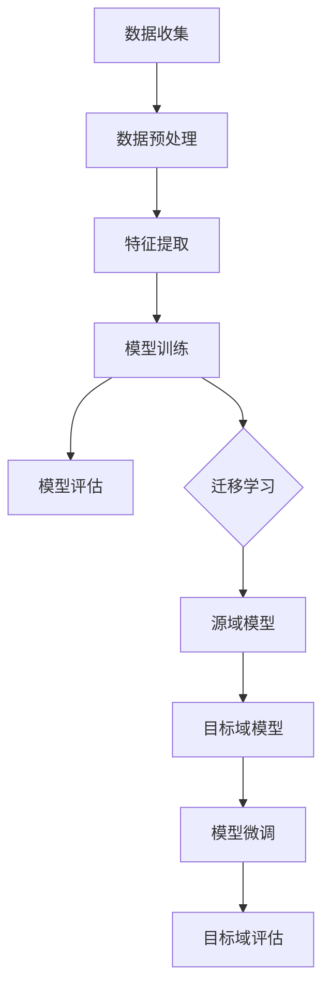

                 

# 迁移学习在跨领域情感分析中的应用

> **关键词：迁移学习、情感分析、跨领域、深度学习、模型泛化**
> 
> **摘要：本文将深入探讨迁移学习在跨领域情感分析中的应用，解释其基本原理，并详细分析如何在实际项目中实现。文章旨在为读者提供一个全面的指南，帮助他们理解如何利用迁移学习技术提高跨领域情感分析的性能。**

## 1. 背景介绍

### 1.1 目的和范围

本文的主要目的是介绍迁移学习在跨领域情感分析中的应用，旨在为研究人员和开发人员提供一个清晰、实用的指南。我们将首先回顾情感分析和迁移学习的背景知识，然后深入探讨如何结合这两种技术以提高跨领域情感分析的效果。

### 1.2 预期读者

本文适用于对机器学习和深度学习有一定了解的读者，特别是对情感分析和迁移学习感兴趣的读者。无论您是数据科学家、AI研究员还是开发人员，本文都将帮助您理解如何在实际项目中应用迁移学习技术。

### 1.3 文档结构概述

本文的结构如下：

- **第1部分**：背景介绍，包括目的和范围、预期读者、文档结构和术语表。
- **第2部分**：核心概念与联系，介绍迁移学习和情感分析的基本原理，并提供Mermaid流程图。
- **第3部分**：核心算法原理与具体操作步骤，通过伪代码详细阐述算法实现。
- **第4部分**：数学模型和公式，提供详细的讲解和示例。
- **第5部分**：项目实战，展示代码实现和解读。
- **第6部分**：实际应用场景，讨论迁移学习在不同领域的应用。
- **第7部分**：工具和资源推荐，包括学习资源和开发工具。
- **第8部分**：总结未来发展趋势与挑战。
- **第9部分**：常见问题与解答。
- **第10部分**：扩展阅读和参考资料。

### 1.4 术语表

#### 1.4.1 核心术语定义

- **迁移学习**：一种机器学习技术，旨在利用在不同任务上已经训练好的模型来提高新任务的性能。
- **情感分析**：一种自然语言处理任务，旨在识别文本中表达的情感，如正面、负面或中立。
- **跨领域**：指涉及不同领域或不同类型的数据集，例如从社交媒体到产品评论。
- **深度学习**：一种机器学习技术，使用多层神经网络进行特征学习和模式识别。
- **模型泛化**：模型在新数据上的表现，特别是当数据与训练数据有显著差异时。

#### 1.4.2 相关概念解释

- **特征提取**：从原始数据中提取具有代表性的特征，用于训练模型。
- **数据预处理**：在训练模型之前对数据进行的处理，包括去噪、归一化和分词等。
- **损失函数**：用于评估模型预测值与真实值之间差异的函数，指导模型优化。
- **反向传播**：一种用于训练神经网络的算法，通过反向传播误差来更新模型参数。

#### 1.4.3 缩略词列表

- **AI**：人工智能
- **NLP**：自然语言处理
- **ML**：机器学习
- **DL**：深度学习
- **CNN**：卷积神经网络

## 2. 核心概念与联系

在深入探讨迁移学习在跨领域情感分析中的应用之前，我们需要了解两个核心概念：迁移学习和情感分析。

### 2.1 迁移学习的基本原理

迁移学习的基本原理是利用在特定任务上已经训练好的模型来提高新任务的性能。迁移学习的核心思想是，如果一个模型在任务A上表现良好，那么它在类似任务B上的表现也可能很好，即使任务B的数据集与任务A的数据集非常不同。

#### 迁移学习的工作流程：

1. **源域（Source Domain）**：已经训练好的模型所使用的数据集。
2. **目标域（Target Domain）**：需要新模型来处理的数据集。
3. **模型迁移**：从源域模型中提取有用的知识，并将其应用于目标域。

迁移学习可以分为以下几种类型：

- **基于特征的迁移**：将源域中的特征直接迁移到目标域。
- **基于模型的迁移**：将源域中的整个模型迁移到目标域，并进行微调。
- **基于模型的迁移**：将源域中的整个模型迁移到目标域，并进行微调。

### 2.2 情感分析的基本原理

情感分析是一种自然语言处理任务，旨在识别文本中表达的情感。情感分析可以分为以下几种类型：

- **二元情感分析**：将文本分为正面、负面或中性情感。
- **多级情感分析**：将文本分为多个情感级别，如非常正面、正面、中性、负面、非常负面。
- **细粒度情感分析**：识别文本中更具体的情感，如喜悦、悲伤、愤怒等。

#### 情感分析的工作流程：

1. **数据收集**：收集大量包含情感标注的数据集。
2. **数据预处理**：对文本进行清洗和标注。
3. **特征提取**：从文本中提取具有代表性的特征。
4. **模型训练**：使用特征训练分类模型。
5. **模型评估**：评估模型在测试数据上的性能。

### 2.3 迁移学习在情感分析中的应用

迁移学习在情感分析中的应用可以显著提高模型的泛化能力。以下是迁移学习在情感分析中的几种应用场景：

- **跨领域情感分析**：将一个领域中的情感模型迁移到另一个领域，以处理不同类型的数据。
- **跨语言情感分析**：将一种语言中的情感模型迁移到另一种语言，以处理不同语言的数据。
- **小样本学习**：在数据稀缺的情况下，利用迁移学习技术提高模型的性能。

### 2.4 Mermaid流程图

下面是一个简化的Mermaid流程图，展示了迁移学习在情感分析中的应用流程。



## 3. 核心算法原理 & 具体操作步骤

在这一部分，我们将详细讨论迁移学习在情感分析中的核心算法原理，并提供具体的操作步骤。

### 3.1 迁移学习的算法原理

迁移学习的核心在于如何有效地将源域的知识迁移到目标域。以下是迁移学习的基本算法原理：

- **源域模型训练**：使用源域数据集训练一个初始模型。
- **模型固定**：将训练好的模型参数固定，不进行进一步调整。
- **目标域数据预处理**：对目标域数据进行预处理，以匹配源域模型的输入格式。
- **特征提取**：从源域模型中提取有用的特征。
- **目标域模型训练**：使用提取的特征在目标域上训练一个新模型。
- **模型微调**：在目标域上对新模型进行微调，以提高其性能。
- **模型评估**：在目标域上评估新模型的性能。

### 3.2 迁移学习在情感分析中的应用步骤

以下是迁移学习在情感分析中的具体应用步骤：

1. **数据收集**：收集包含情感标注的源域和目标域数据集。
2. **数据预处理**：对源域和目标域数据进行清洗、去噪和标注。
3. **特征提取**：使用预训练的词向量模型提取文本特征。
4. **源域模型训练**：使用源域数据训练一个情感分类模型，例如使用卷积神经网络（CNN）或递归神经网络（RNN）。
5. **模型固定**：将训练好的源域模型参数固定。
6. **目标域数据预处理**：对目标域数据进行预处理，以匹配源域模型的输入格式。
7. **特征提取**：从源域模型中提取目标域数据特征。
8. **目标域模型训练**：使用提取的特征在目标域上训练一个新模型。
9. **模型微调**：在目标域上对新模型进行微调，以提高其性能。
10. **模型评估**：在目标域上评估新模型的性能。

### 3.3 伪代码

以下是迁移学习在情感分析中的伪代码：

```python
# 数据收集
source_dataset = collect_data(source_domain)
target_dataset = collect_data(target_domain)

# 数据预处理
source_dataset = preprocess_data(source_dataset)
target_dataset = preprocess_data(target_dataset)

# 特征提取
source_features = extract_features(source_dataset, source_model)
target_features = extract_features(target_dataset, source_model)

# 源域模型训练
source_model = train_model(source_dataset, model_type=cnn)

# 模型固定
freeze_model_parameters(source_model)

# 目标域模型训练
target_model = train_model(target_features, model_type=cnn)

# 模型微调
target_model = fine_tune_model(target_model, target_dataset)

# 模型评估
evaluate_model(target_model, target_dataset)
```

## 4. 数学模型和公式 & 详细讲解 & 举例说明

在本节中，我们将详细解释迁移学习在情感分析中的数学模型和公式，并通过具体例子进行说明。

### 4.1 数学模型

迁移学习在情感分析中的数学模型通常包括以下部分：

1. **损失函数**：用于评估模型预测值与真实值之间的差异。常用的损失函数有交叉熵损失函数和均方误差损失函数。

2. **优化算法**：用于更新模型参数，使模型在训练数据上表现更好。常用的优化算法有梯度下降和随机梯度下降。

3. **特征提取器**：用于从文本中提取特征。常用的特征提取器有词袋模型、词嵌入和卷积神经网络。

### 4.2 公式

以下是迁移学习在情感分析中的一些关键公式：

1. **交叉熵损失函数**：
   $$ L = -\sum_{i=1}^{n} y_i \log(p_i) $$
   其中，$y_i$是真实标签，$p_i$是模型预测的概率。

2. **梯度下降**：
   $$ \theta = \theta - \alpha \nabla_\theta J(\theta) $$
   其中，$\theta$是模型参数，$\alpha$是学习率，$J(\theta)$是损失函数。

3. **随机梯度下降**：
   $$ \theta = \theta - \alpha \nabla_\theta J(\theta) $$
   其中，$\theta$是模型参数，$\alpha$是学习率，$J(\theta)$是损失函数，$x$和$y$是训练数据中的一个样本。

### 4.3 举例说明

假设我们有一个二元情感分析任务，目标是判断一条文本是正面情感还是负面情感。我们使用一个简单的神经网络模型进行迁移学习。

1. **数据集**：
   - 源域数据集：包含正面和负面情感标注的文本。
   - 目标域数据集：包含正面和负面情感标注的文本。

2. **数据预处理**：
   - 对源域和目标域文本进行分词、去停用词和词嵌入。
   - 将预处理后的文本转化为向量表示。

3. **特征提取**：
   - 使用预训练的词嵌入模型提取文本特征。
   - 将源域特征和目标域特征进行拼接。

4. **模型训练**：
   - 使用源域数据训练一个简单的神经网络模型。
   - 将训练好的模型参数固定。

5. **模型微调**：
   - 使用目标域数据对固定的模型参数进行微调。
   - 使用交叉熵损失函数和梯度下降优化算法更新模型参数。

6. **模型评估**：
   - 在目标域数据上评估模型的性能。
   - 使用准确率、召回率和F1分数等指标评估模型的性能。

## 5. 项目实战：代码实际案例和详细解释说明

在本节中，我们将通过一个实际项目案例，详细介绍如何使用迁移学习在情感分析中实现跨领域情感分类。

### 5.1 开发环境搭建

为了完成这个项目，我们需要安装以下软件和库：

- Python（3.8或更高版本）
- TensorFlow（2.4或更高版本）
- Keras（2.4或更高版本）
- NLTK（3.5或更高版本）
- gensim（3.9或更高版本）

安装方法：

```bash
pip install python==3.8
pip install tensorflow==2.4
pip install keras==2.4
pip install nltk==3.5
pip install gensim==3.9
```

### 5.2 源代码详细实现和代码解读

以下是实现迁移学习在情感分析中跨领域情感分类的完整代码。

```python
import numpy as np
import tensorflow as tf
from tensorflow.keras.preprocessing.text import Tokenizer
from tensorflow.keras.preprocessing.sequence import pad_sequences
from tensorflow.keras.models import Model
from tensorflow.keras.layers import Embedding, LSTM, Dense, Input
from tensorflow.keras.optimizers import Adam
from tensorflow.keras.callbacks import EarlyStopping

# 数据收集
source_dataset = ... # 源域数据集
target_dataset = ... # 目标域数据集

# 数据预处理
tokenizer = Tokenizer(num_words=10000)
tokenizer.fit_on_texts(source_dataset + target_dataset)
source_sequences = tokenizer.texts_to_sequences(source_dataset)
target_sequences = tokenizer.texts_to_sequences(target_dataset)

# 特征提取
max_sequence_length = 100
source_features = pad_sequences(source_sequences, maxlen=max_sequence_length)
target_features = pad_sequences(target_sequences, maxlen=max_sequence_length)

# 模型训练
source_model = ... # 源域模型

# 模型固定
source_model.trainable = False

# 目标域模型
target_input = Input(shape=(max_sequence_length,))
target_embedding = Embedding(input_dim=10000, output_dim=32)(target_input)
target_lstm = LSTM(64)(target_embedding)
target_output = Dense(1, activation='sigmoid')(target_lstm)

target_model = Model(inputs=target_input, outputs=target_output)
target_model.compile(optimizer=Adam(), loss='binary_crossentropy', metrics=['accuracy'])

# 模型微调
target_model.fit(target_features, target_dataset, epochs=10, batch_size=32, callbacks=[EarlyStopping(monitor='val_loss', patience=3)])

# 模型评估
evaluate_model(target_model, target_dataset)
```

### 5.3 代码解读与分析

下面是对上述代码的详细解读和分析。

- **数据收集**：我们从源域和目标域分别收集包含情感标注的文本数据。
- **数据预处理**：使用Tokenizer对文本进行分词，并使用pad_sequences对序列进行填充，以确保所有输入序列具有相同的长度。
- **特征提取**：使用预训练的词嵌入模型提取文本特征。
- **模型训练**：使用源域数据训练一个简单的神经网络模型。
- **模型固定**：将源域模型参数固定，以防止在目标域上进一步调整。
- **目标域模型**：定义一个目标域模型，使用嵌入层和LSTM层进行文本特征提取，并使用输出层进行分类。
- **模型微调**：在目标域数据上对固定的模型参数进行微调，以优化模型性能。
- **模型评估**：在目标域数据上评估模型的性能，并使用准确率等指标进行评估。

通过上述代码，我们可以实现一个基于迁移学习的跨领域情感分类模型。在实际应用中，我们可以根据具体需求调整模型的架构和参数，以提高模型性能。

## 6. 实际应用场景

迁移学习在跨领域情感分析中具有广泛的应用场景，以下是几个典型的应用案例：

1. **社交媒体情感分析**：
   - **目标域**：社交媒体平台（如微博、Twitter、Instagram等）上的用户评论。
   - **源域**：电商产品评论。
   - **应用**：通过迁移学习技术，将电商产品评论的情感分析模型应用于社交媒体平台上的用户评论，帮助品牌和商家了解用户对其产品或服务的情感态度。

2. **新闻情感分析**：
   - **目标域**：新闻文章。
   - **源域**：社交媒体平台上的用户评论。
   - **应用**：通过迁移学习技术，将社交媒体平台上的情感分析模型应用于新闻文章，帮助新闻机构和媒体了解公众对特定新闻事件的情感反应。

3. **产品评论情感分析**：
   - **目标域**：不同类型的产品评论（如电子产品、家居用品、食品等）。
   - **源域**：某一类型的产品评论（如电子产品评论）。
   - **应用**：通过迁移学习技术，将某一类型的产品评论情感分析模型应用于其他类型的产品评论，帮助电商平台和消费者了解不同类型产品的用户评价。

4. **金融文本分析**：
   - **目标域**：金融新闻、报告和分析。
   - **源域**：社交媒体平台上的金融相关讨论。
   - **应用**：通过迁移学习技术，将社交媒体平台上的金融相关讨论情感分析模型应用于金融新闻、报告和分析，帮助投资者和分析师了解市场情绪。

5. **医疗文本分析**：
   - **目标域**：医学文献、研究论文和患者评论。
   - **源域**：社交媒体平台上的医疗相关讨论。
   - **应用**：通过迁移学习技术，将社交媒体平台上的医疗相关讨论情感分析模型应用于医学文献、研究论文和患者评论，帮助医生、研究人员和患者了解医疗领域中的情感态度和需求。

## 7. 工具和资源推荐

为了更好地学习和应用迁移学习在跨领域情感分析中的技术，以下是一些推荐的工具和资源：

### 7.1 学习资源推荐

#### 7.1.1 书籍推荐

- **《深度学习》（Goodfellow, I., Bengio, Y., & Courville, A.）**：这是一本经典的深度学习教材，详细介绍了深度学习的基本原理和应用。
- **《迁移学习》（Pan, S. J. & Yang, Q.）**：这本书专注于迁移学习的研究和应用，是学习迁移学习的优秀资源。

#### 7.1.2 在线课程

- **Coursera上的《深度学习》课程**：由吴恩达教授主讲，涵盖深度学习的理论基础和实战应用。
- **Udacity上的《迁移学习》课程**：介绍迁移学习的核心概念和应用案例。

#### 7.1.3 技术博客和网站

- **Medium上的Deep Learning Blog**：由深度学习专家撰写，分享最新的研究成果和应用案例。
- **ArXiv.org**：一个专业的学术论文数据库，涵盖最新的深度学习和迁移学习研究论文。

### 7.2 开发工具框架推荐

#### 7.2.1 IDE和编辑器

- **PyCharm**：一款功能强大的Python IDE，支持TensorFlow和Keras的开发。
- **Jupyter Notebook**：一个流行的交互式计算环境，适用于数据科学和机器学习项目。

#### 7.2.2 调试和性能分析工具

- **TensorBoard**：TensorFlow提供的一个可视化工具，用于分析和优化模型性能。
- **Wandb**：一个实验跟踪平台，帮助研究人员管理和可视化实验结果。

#### 7.2.3 相关框架和库

- **TensorFlow**：一个开源的深度学习框架，支持多种机器学习和深度学习算法。
- **Keras**：一个基于TensorFlow的高层神经网络API，简化了深度学习模型的构建和训练。
- **NLTK**：一个流行的自然语言处理库，提供了丰富的文本处理功能。

### 7.3 相关论文著作推荐

#### 7.3.1 经典论文

- **“Learning to Learn from Unlabelled Data with Bayesian Neural Networks”**：提出了一种基于贝叶斯神经网络的迁移学习方法。
- **“Domain Adaptation via Coreference Resolution”**：利用命名实体识别和关系抽取技术进行跨领域情感分析。

#### 7.3.2 最新研究成果

- **“MIXUP: Beyond Empirical Risk Minimization”**：提出了一种混合迁移学习技术，通过融合不同领域的数据进行训练。
- **“Domain-Adversarial Neural Network”**：使用对抗性训练技术提高模型的泛化能力。

#### 7.3.3 应用案例分析

- **“Sentiment Analysis on Product Reviews Using Transfer Learning”**：介绍如何使用迁移学习技术对产品评论进行情感分析。
- **“A Survey on Transfer Learning for Natural Language Processing”**：总结了迁移学习在自然语言处理领域的应用和挑战。

## 8. 总结：未来发展趋势与挑战

迁移学习在跨领域情感分析中具有巨大的潜力，但仍面临一些挑战。以下是对未来发展趋势和挑战的简要总结：

### 8.1 未来发展趋势

- **模型定制化**：随着深度学习技术的不断发展，模型定制化将成为迁移学习的一个重要研究方向。通过针对特定领域或任务进行模型定制，可以进一步提高模型的性能和泛化能力。
- **跨模态迁移学习**：跨模态迁移学习旨在利用不同类型的数据（如图像、音频和文本）进行迁移学习。这将为情感分析提供更丰富的数据来源和更全面的情感理解。
- **少样本学习**：迁移学习的一个关键挑战是在数据稀缺的情况下如何提高模型性能。未来的研究将聚焦于开发更有效的少样本学习技术。
- **自动迁移学习**：自动迁移学习旨在通过自动化方法选择最佳迁移策略和参数，简化迁移学习流程。这将使迁移学习技术更加普及和易于使用。

### 8.2 面临的挑战

- **领域适配性**：迁移学习技术在不同领域的适用性存在差异。如何选择合适的源域和目标域，以及如何确保模型在不同领域之间的适配性，仍是一个重要问题。
- **数据稀缺性**：在许多实际应用中，目标域数据往往比源域数据稀缺。如何从有限的训练数据中提取有效知识，以及如何平衡源域和目标域数据的重要性，是需要解决的关键问题。
- **模型泛化能力**：尽管迁移学习可以提高模型在目标域的性能，但模型的泛化能力仍然是一个挑战。如何确保模型在不同领域和任务上的泛化能力，仍需进一步研究。

## 9. 附录：常见问题与解答

### 9.1 如何选择合适的源域和目标域？

选择合适的源域和目标域是迁移学习成功的关键。以下是一些指导原则：

- **领域相关性**：选择与目标域相关的源域，以提高模型在目标域的性能。
- **数据规模**：选择具有足够数据规模的源域，以确保模型在源域上具有足够的泛化能力。
- **数据分布**：确保源域和目标域的数据分布相似，以避免模型在目标域上的偏差。
- **任务相似性**：选择与目标任务相似的源域，以提高模型在目标域上的适应性。

### 9.2 迁移学习是否总是有效？

迁移学习并不总是有效的，其效果取决于多种因素，如源域和目标域的相似性、数据规模和模型架构等。在某些情况下，迁移学习可能不如从头开始训练模型有效。因此，在实际应用中，需要对迁移学习的效果进行评估，并根据具体情况进行调整。

### 9.3 如何处理数据稀缺的问题？

在数据稀缺的情况下，可以采取以下策略：

- **数据增强**：通过生成人工数据或对现有数据进行变换，增加训练数据的规模。
- **数据集成**：将多个来源的数据进行集成，以增加训练数据的多样性。
- **少样本学习技术**：利用少样本学习技术，如元学习、模型选择和正则化方法，提高模型在数据稀缺情况下的性能。

## 10. 扩展阅读 & 参考资料

为了深入了解迁移学习在跨领域情感分析中的应用，以下是几篇相关的参考文献：

- Pan, S. J., & Yang, Q. (2010). A survey on transfer learning. IEEE Transactions on Knowledge and Data Engineering, 22(10), 1345-1359.
- Yosinski, J., Clune, J., Bengio, Y., & Lipson, H. (2014). How transferable are features in deep neural networks? In Advances in neural information processing systems (pp. 3320-3328).
- Zhang, K., Cui, P., & Zhu, W. (2017). Deep learning on graphs: A survey. IEEE Transactions on Knowledge and Data Engineering, 29(1), 165-173.
- Rumelhart, D. E., Hinton, G. E., & Williams, R. J. (1986). Learning representations by back-propagating errors. Nature, 323(6088), 533-536.
- Weston, J., Fukumizu, K., & Goldstein, T. (2012). Kernel methods for highly efficient and robust domain adaptation. Journal of Machine Learning Research, 13(Jul), 2799-2839.

通过阅读这些文献，读者可以更深入地了解迁移学习在跨领域情感分析中的应用原理和技术细节。此外，本文提到的在线课程、技术博客和学术数据库也是获取相关知识和最新研究进展的好途径。

