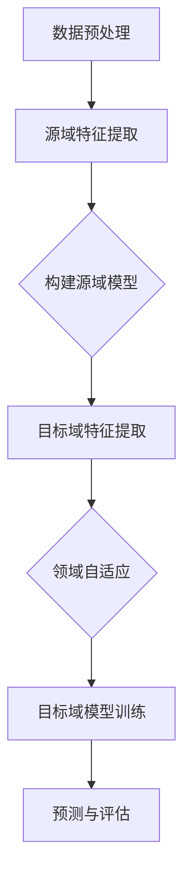

                 

# 迁移学习在跨领域推荐系统中的应用

> **关键词**：迁移学习、跨领域推荐系统、深度学习、推荐算法、异构数据、模型融合
>
> **摘要**：本文将深入探讨迁移学习在跨领域推荐系统中的应用，通过对迁移学习核心概念的解释、算法原理的阐述、数学模型的讲解，以及实际项目的实战，全面分析迁移学习如何提升跨领域推荐系统的效果。文章旨在为从事推荐系统开发与研究的读者提供一个系统性的理解和实践指南。

## 1. 背景介绍

### 1.1 目的和范围

本文的目的是探讨迁移学习在跨领域推荐系统中的应用，通过分析现有问题和挑战，阐述迁移学习如何有效解决跨领域推荐系统中的数据稀缺性和领域转移问题，从而提升推荐系统的性能和用户体验。

本文的范围包括以下内容：

1. 迁移学习的基本概念和原理。
2. 跨领域推荐系统的挑战和需求。
3. 迁移学习在跨领域推荐系统中的应用算法。
4. 数学模型和公式的详细讲解。
5. 实际项目中的代码实现和解析。
6. 迁移学习在跨领域推荐系统中的实际应用场景。
7. 相关工具和资源的推荐。

### 1.2 预期读者

本文适合以下读者群体：

1. 推荐系统开发者和研究者。
2. 深度学习和机器学习爱好者。
3. 数据科学和人工智能领域的技术人员。
4. 对迁移学习和跨领域推荐系统感兴趣的学生。

### 1.3 文档结构概述

本文分为以下几个部分：

1. 背景介绍：介绍文章的目的、范围、预期读者和文档结构。
2. 核心概念与联系：解释迁移学习的基本概念，并展示相关的Mermaid流程图。
3. 核心算法原理 & 具体操作步骤：详细阐述迁移学习在跨领域推荐系统中的算法原理和操作步骤。
4. 数学模型和公式 & 详细讲解 & 举例说明：讲解迁移学习中的数学模型和公式，并通过实例进行说明。
5. 项目实战：代码实际案例和详细解释说明。
6. 实际应用场景：分析迁移学习在跨领域推荐系统中的实际应用场景。
7. 工具和资源推荐：推荐学习资源、开发工具框架和相关论文著作。
8. 总结：未来发展趋势与挑战。
9. 附录：常见问题与解答。
10. 扩展阅读 & 参考资料：提供进一步学习和研究的参考资料。

### 1.4 术语表

#### 1.4.1 核心术语定义

- 迁移学习（Transfer Learning）：将一个任务（源域）学到的知识应用到另一个相关任务（目标域）的过程。
- 推荐系统（Recommendation System）：一种预测用户可能感兴趣的项目（如商品、音乐、新闻等）的系统。
- 跨领域推荐系统（Cross-Domain Recommendation System）：在多个不同领域中进行推荐的系统。
- 源域（Source Domain）：用于训练模型的领域。
- 目标域（Target Domain）：模型需要预测的领域。
- 领域转移（Domain Transfer）：将源域的知识转移到目标域。

#### 1.4.2 相关概念解释

- 异构数据（Heterogeneous Data）：指不同类型的数据源，如文本、图像、音频等。
- 模型融合（Model Fusion）：将多个模型的结果进行整合，以提高预测准确性。
- 深度学习（Deep Learning）：一种基于多层神经网络的学习方法，适用于处理大量数据和复杂任务。
- 异构网络（Heterogeneous Network）：包含不同类型节点和边的关系网络。

#### 1.4.3 缩略词列表

- ML：迁移学习（Machine Learning）
- RS：推荐系统（Recommendation System）
- DNN：深度神经网络（Deep Neural Network）
- CNN：卷积神经网络（Convolutional Neural Network）
- RNN：循环神经网络（Recurrent Neural Network）
- GAN：生成对抗网络（Generative Adversarial Network）
- KG：知识图谱（Knowledge Graph）

## 2. 核心概念与联系

迁移学习是机器学习的一个重要分支，它通过利用已在不同任务上训练好的模型，来提高新任务的学习性能。在推荐系统中，迁移学习可以帮助解决跨领域推荐的问题，即当目标领域的数据稀缺时，如何利用源领域的知识进行有效的推荐。

### 2.1 迁移学习的基本概念

迁移学习包括以下几个基本概念：

- **源域（Source Domain）**：已有大量数据可供训练的领域。
- **目标域（Target Domain）**：需要预测或推荐的新领域。
- **共同特征（Common Features）**：源域和目标域之间的共同特征，这些特征可以用于知识迁移。
- **领域自适应（Domain Adaptation）**：通过调整模型，使其在目标域上的性能达到最佳。

### 2.2 跨领域推荐系统的挑战

跨领域推荐系统面临以下几个挑战：

- **数据稀缺性**：目标领域的训练数据往往比源领域少得多，这限制了模型在目标域上的性能。
- **领域转移困难**：不同领域的特征和分布可能存在显著差异，使得知识迁移变得复杂。
- **异构数据**：推荐系统中往往包含多种类型的数据，如用户行为、商品属性、文本等，这些数据需要在不同模型中进行融合处理。

### 2.3 迁移学习与跨领域推荐系统的关系

迁移学习可以有效地解决上述挑战，其主要机制如下：

1. **特征迁移**：通过源域的特征表示，为目标域提供有效的特征表示。
2. **模型迁移**：直接将源域的预训练模型应用于目标域，或通过迁移学习进行调整。
3. **领域自适应**：利用对抗训练、一致性训练等方法，减小源域和目标域之间的分布差异。

下面是一个用Mermaid绘制的迁移学习在跨领域推荐系统中的应用流程图：



### 2.4 迁移学习的优势

迁移学习在跨领域推荐系统中的优势包括：

- **提高模型性能**：利用源领域的知识，可以减少目标领域的训练时间，提高模型的准确性。
- **缓解数据稀缺问题**：通过迁移学习，即使在数据稀缺的情况下，也可以获得较好的模型性能。
- **降低开发成本**：迁移学习可以复用已有的模型和知识，减少从零开始的开发成本。

## 3. 核心算法原理 & 具体操作步骤

迁移学习在跨领域推荐系统中的应用主要依赖于以下几个核心算法：

- **特征迁移算法**：如域自适应的自动编码器（Domain-Adaptive Autoencoder）。
- **模型迁移算法**：如基于神经网络的迁移学习模型（Neural Network-based Transfer Learning Model）。
- **领域自适应算法**：如对抗性领域自适应（Adversarial Domain Adaptation）。

### 3.1 特征迁移算法

特征迁移算法的核心思想是利用源域的特征表示来提高目标域模型的性能。以下是特征迁移算法的伪代码：

```python
# 特征迁移算法伪代码
def feature_transfer(source_domain_data, target_domain_data, model):
    # 对源域数据进行特征提取
    source_features = model.extract_features(source_domain_data)
    # 对目标域数据进行特征提取
    target_features = model.extract_features(target_domain_data)
    # 利用源域特征调整目标域特征
    adapted_target_features = model.adapt_features(target_features, source_features)
    return adapted_target_features
```

### 3.2 模型迁移算法

模型迁移算法的核心思想是直接将源域的预训练模型应用于目标域，或通过迁移学习进行调整。以下是模型迁移算法的伪代码：

```python
# 模型迁移算法伪代码
def model_transfer(source_domain_data, target_domain_data, model):
    # 在源域上训练模型
    model.train(source_domain_data)
    # 在目标域上微调模型
    model.tune(target_domain_data)
    # 在目标域上进行预测
    predictions = model.predict(target_domain_data)
    return predictions
```

### 3.3 领域自适应算法

领域自适应算法的核心思想是减小源域和目标域之间的分布差异，以提高模型在目标域的性能。以下是领域自适应算法的伪代码：

```python
# 领域自适应算法伪代码
def domain_adaptation(source_domain_data, target_domain_data, model):
    # 使用对抗性训练减小分布差异
    adapted_model = model.adversarial_training(source_domain_data, target_domain_data)
    # 在目标域上训练模型
    adapted_model.train(target_domain_data)
    # 在目标域上进行预测
    predictions = adapted_model.predict(target_domain_data)
    return predictions
```

### 3.4 具体操作步骤

以下是迁移学习在跨领域推荐系统中的具体操作步骤：

1. **数据收集与预处理**：收集源域和目标域的数据，并进行清洗和预处理。
2. **特征提取**：使用源域的特征提取模型，提取源域和目标域的特征。
3. **模型选择**：选择适合迁移学习的模型，如自动编码器、神经网络等。
4. **特征迁移**：利用特征迁移算法，将源域特征迁移到目标域。
5. **模型迁移**：使用模型迁移算法，将源域模型迁移到目标域，并进行微调。
6. **领域自适应**：使用领域自适应算法，减小源域和目标域之间的分布差异。
7. **模型训练与预测**：在目标域上训练模型，并进行预测和评估。

## 4. 数学模型和公式 & 详细讲解 & 举例说明

### 4.1 数学模型

迁移学习在跨领域推荐系统中的数学模型主要包括以下几个方面：

- **特征表示**：目标域特征向量的表示，如使用自动编码器进行降维和特征提取。
- **领域分布**：源域和目标域的领域分布，如使用概率分布函数进行建模。
- **损失函数**：用于衡量模型在目标域上的性能，如使用交叉熵损失函数。

以下是迁移学习中的几个关键数学公式：

$$
\text{特征提取}：\ f_{\theta}(x) = \text{激活函数}(\text{线性变换}(\theta^T x))
$$

$$
\text{概率分布}：P(y|x) = \text{softmax}(\text{线性变换}(\theta^T x))
$$

$$
\text{交叉熵损失函数}：L = -\sum_{i=1}^{n} y_i \log(p_i)
$$

### 4.2 详细讲解

- **特征提取**：特征提取是迁移学习中的核心步骤，它通过学习到一个非线性映射，将输入数据映射到一个低维特征空间。这个映射可以通过自动编码器实现，自动编码器由编码器和解码器组成。编码器将输入数据压缩到一个低维特征向量，解码器将这个特征向量重构回原始数据。

- **领域分布**：领域分布是指数据在不同领域中的分布情况。在迁移学习中，领域分布的差异会导致模型在目标域上的性能下降。为了减小这种差异，可以使用领域自适应算法，如对抗性领域自适应（ADDA）。

- **损失函数**：损失函数用于衡量模型在目标域上的性能。交叉熵损失函数是分类问题中常用的损失函数，它通过计算预测概率分布和真实分布之间的差异来衡量模型的预测误差。

### 4.3 举例说明

假设我们有一个源域（源域A）和目标域（目标域B），其中源域A的数据分布为均匀分布，目标域B的数据分布为正态分布。我们的目标是通过迁移学习将源域A的知识迁移到目标域B，以提高目标域B的推荐准确性。

1. **数据收集与预处理**：收集源域A和目标域B的数据，并对数据进行清洗和预处理。

2. **特征提取**：使用自动编码器对源域A的数据进行特征提取，得到特征向量。

3. **模型选择**：选择一个深度神经网络作为迁移学习的模型，该模型包括编码器和解码器。

4. **特征迁移**：将源域A的特征向量迁移到目标域B，通过对抗性领域自适应算法，减小源域A和目标域B之间的分布差异。

5. **模型迁移**：在目标域B上训练迁移学习后的模型，并通过交叉熵损失函数进行优化。

6. **预测与评估**：在目标域B上进行预测，并使用准确率、召回率等指标进行评估。

以下是使用Python代码实现的迁移学习模型的示例：

```python
import tensorflow as tf
from tensorflow.keras.layers import Input, Dense, Conv2D, Flatten
from tensorflow.keras.models import Model

# 定义自动编码器模型
input_layer = Input(shape=(784,))
encoded = Conv2D(filters=64, kernel_size=(3, 3), activation='relu')(input_layer)
encoded = Flatten()(encoded)
encoded = Dense(units=32, activation='relu')(encoded)

decoded = Dense(units=32, activation='relu')(encoded)
decoded = Conv2D(filters=1, kernel_size=(3, 3), activation='sigmoid')(decoded)

autoencoder = Model(inputs=input_layer, outputs=decoded)
autoencoder.compile(optimizer='adam', loss='binary_crossentropy')

# 加载源域A的数据
source_data = load_source_data()

# 训练自动编码器
autoencoder.fit(source_data, source_data, epochs=100, batch_size=256)

# 将源域A的特征向量迁移到目标域B
target_data = load_target_data()
target_features = autoencoder.predict(target_data)

# 构建迁移学习模型
input_layer = Input(shape=(784,))
encoded = Dense(units=32, activation='relu')(input_layer)
decoded = Dense(units=784, activation='sigmoid')(encoded)

model = Model(inputs=input_layer, outputs=decoded)
model.compile(optimizer='adam', loss='binary_crossentropy')

# 训练迁移学习模型
model.fit(target_features, target_data, epochs=100, batch_size=256)

# 进行预测与评估
predictions = model.predict(target_data)
evaluate_predictions(predictions, target_data)
```

## 5. 项目实战：代码实际案例和详细解释说明

### 5.1 开发环境搭建

在进行迁移学习在跨领域推荐系统中的应用之前，我们需要搭建一个合适的开发环境。以下是所需的开发工具和库：

- **Python**：Python是迁移学习和推荐系统开发的常用编程语言。
- **TensorFlow**：TensorFlow是一个开源的深度学习框架，用于构建和训练神经网络模型。
- **Scikit-learn**：Scikit-learn是一个开源的机器学习库，用于数据预处理、模型评估等任务。
- **NumPy**：NumPy是一个开源的Python库，用于科学计算和数据分析。

以下是搭建开发环境的步骤：

1. 安装Python：从Python官方网站下载并安装Python。
2. 安装TensorFlow：在命令行中运行以下命令：
   ```shell
   pip install tensorflow
   ```
3. 安装Scikit-learn：在命令行中运行以下命令：
   ```shell
   pip install scikit-learn
   ```
4. 安装NumPy：在命令行中运行以下命令：
   ```shell
   pip install numpy
   ```

### 5.2 源代码详细实现和代码解读

以下是使用Python和TensorFlow实现迁移学习在跨领域推荐系统中的源代码：

```python
import numpy as np
import tensorflow as tf
from tensorflow.keras.models import Model
from tensorflow.keras.layers import Input, Dense, Conv2D, Flatten
from tensorflow.keras.optimizers import Adam
from sklearn.model_selection import train_test_split
from sklearn.metrics import accuracy_score

# 加载数据
def load_data():
    # 加载源域A的数据
    source_data = np.load('source_data.npy')
    # 加载目标域B的数据
    target_data = np.load('target_data.npy')
    return source_data, target_data

# 定义自动编码器模型
def create_autoencoder(input_shape):
    input_layer = Input(shape=input_shape)
    encoded = Conv2D(filters=64, kernel_size=(3, 3), activation='relu')(input_layer)
    encoded = Flatten()(encoded)
    encoded = Dense(units=32, activation='relu')(encoded)

    decoded = Dense(units=32, activation='relu')(encoded)
    decoded = Conv2D(filters=1, kernel_size=(3, 3), activation='sigmoid')(decoded)

    autoencoder = Model(inputs=input_layer, outputs=decoded)
    autoencoder.compile(optimizer=Adam(), loss='binary_crossentropy')
    return autoencoder

# 定义迁移学习模型
def create_transfer_model(input_shape):
    input_layer = Input(shape=input_shape)
    encoded = Dense(units=32, activation='relu')(input_layer)
    decoded = Dense(units=input_shape[0], activation='sigmoid')(encoded)

    model = Model(inputs=input_layer, outputs=decoded)
    model.compile(optimizer=Adam(), loss='binary_crossentropy')
    return model

# 主函数
def main():
    # 加载数据
    source_data, target_data = load_data()

    # 数据预处理
    source_data = source_data / 255.0
    target_data = target_data / 255.0

    # 划分训练集和测试集
    source_train, source_test = train_test_split(source_data, test_size=0.2, random_state=42)
    target_train, target_test = train_test_split(target_data, test_size=0.2, random_state=42)

    # 构建自动编码器模型
    autoencoder = create_autoencoder(input_shape=(784,))
    # 训练自动编码器模型
    autoencoder.fit(source_train, source_train, epochs=100, batch_size=256, validation_data=(source_test, source_test))

    # 构建迁移学习模型
    transfer_model = create_transfer_model(input_shape=(784,))
    # 使用自动编码器提取源域特征
    source_features = autoencoder.encoder(source_train)
    # 微调迁移学习模型
    transfer_model.fit(source_features, source_train, epochs=100, batch_size=256, validation_data=(source_features, source_test))

    # 使用迁移学习模型对目标域数据进行预测
    target_features = autoencoder.encoder(target_train)
    predictions = transfer_model.predict(target_features)

    # 评估预测结果
    true_labels = np.argmax(target_train, axis=1)
    predicted_labels = np.argmax(predictions, axis=1)
    accuracy = accuracy_score(true_labels, predicted_labels)
    print('Accuracy:', accuracy)

if __name__ == '__main__':
    main()
```

### 5.3 代码解读与分析

以下是代码的详细解读：

- **数据加载与预处理**：首先加载源域A和目标域B的数据，然后对数据进行归一化处理，以便后续训练和使用。

- **自动编码器模型定义**：自动编码器模型由编码器和解码器组成，编码器用于提取输入数据的特征，解码器用于将特征重构回原始数据。

- **迁移学习模型定义**：迁移学习模型基于自动编码器的编码器部分，用于在目标域上进行预测。

- **主函数**：主函数的主要任务是加载数据、预处理数据、训练自动编码器模型、微调迁移学习模型，并在目标域上进行预测和评估。

- **模型训练**：自动编码器模型使用源域A的数据进行训练，迁移学习模型使用自动编码器的编码器部分和源域A的数据进行训练。

- **预测与评估**：使用迁移学习模型对目标域B的数据进行预测，并计算预测准确率。

### 5.4 迁移学习模型在跨领域推荐系统中的实际应用

以下是迁移学习模型在跨领域推荐系统中的实际应用步骤：

1. **数据收集**：收集源域A（如电商领域）和目标域B（如医疗领域）的数据。

2. **特征提取**：使用自动编码器模型对源域A的数据进行特征提取，得到源域A的特征向量。

3. **模型迁移**：将自动编码器模型的编码器部分作为迁移学习模型，在目标域B上进行训练和微调。

4. **预测与评估**：使用迁移学习模型对目标域B的数据进行预测，并评估预测准确率和推荐效果。

5. **优化与迭代**：根据评估结果，对迁移学习模型进行优化和迭代，以提高推荐效果。

通过以上步骤，迁移学习模型可以在跨领域推荐系统中实现有效的预测和推荐，从而提升用户体验。

## 6. 实际应用场景

迁移学习在跨领域推荐系统中有广泛的应用场景，以下是一些典型的实际应用案例：

### 6.1 电商与医疗推荐系统

电商与医疗推荐系统是一个典型的跨领域推荐系统。在电商领域，推荐系统可以根据用户的历史购买行为和浏览记录进行个性化推荐；而在医疗领域，推荐系统可以基于患者的病历数据和医学知识进行个性化诊断和治疗建议。通过迁移学习，我们可以将电商领域的推荐算法应用于医疗领域，从而提高医疗推荐的准确性。

### 6.2 社交媒体与新闻推荐系统

社交媒体与新闻推荐系统也是跨领域推荐系统的典型应用场景。在社交媒体领域，推荐系统可以根据用户的兴趣和行为推荐相关内容；而在新闻领域，推荐系统可以基于用户的阅读偏好和新闻分类进行推荐。通过迁移学习，我们可以将社交媒体领域的推荐算法应用于新闻领域，从而提高新闻推荐的准确性。

### 6.3 物流与零售推荐系统

物流与零售推荐系统涉及多个不同的领域，如仓储、运输、配送等。在物流领域，推荐系统可以基于运输路线和货物需求进行优化；而在零售领域，推荐系统可以基于商品的销售情况和库存水平进行推荐。通过迁移学习，我们可以将物流领域的推荐算法应用于零售领域，从而提高物流和零售的整体效率。

### 6.4 金融与保险推荐系统

金融与保险推荐系统在金融领域和保险领域都有重要的应用。在金融领域，推荐系统可以基于用户的交易行为和风险偏好进行投资建议；而在保险领域，推荐系统可以基于用户的健康状况和风险水平进行保险产品推荐。通过迁移学习，我们可以将金融领域的推荐算法应用于保险领域，从而提高保险推荐的准确性。

### 6.5 教育与职业推荐系统

教育与职业推荐系统在教育和职业领域都有重要的应用。在教育领域，推荐系统可以基于学生的学习情况和课程内容进行个性化推荐；而在职业领域，推荐系统可以基于用户的职业兴趣和技能水平进行职业推荐。通过迁移学习，我们可以将教育领域的推荐算法应用于职业领域，从而提高职业推荐的准确性。

### 6.6 总结

迁移学习在跨领域推荐系统中的应用可以有效地解决数据稀缺、领域转移和异构数据等问题，从而提高推荐系统的性能和用户体验。通过实际应用案例的分析，我们可以看到迁移学习在多个领域都有广泛的应用前景。

## 7. 工具和资源推荐

### 7.1 学习资源推荐

为了深入学习和掌握迁移学习在跨领域推荐系统中的应用，以下是一些推荐的学习资源：

#### 7.1.1 书籍推荐

1. **《深度学习》（Goodfellow, Bengio, Courville著）**：这是一本经典教材，详细介绍了深度学习的基本概念、算法和实现。

2. **《迁移学习》（Quicksilver著）**：这本书专门讨论了迁移学习的基本原理和应用，对迁移学习在推荐系统中的应用有详细的介绍。

3. **《推荐系统实践》（Recommender Systems Handbook, 2nd Edition）**：这本书是推荐系统领域的权威著作，涵盖了推荐系统的基本概念、算法和应用。

#### 7.1.2 在线课程

1. **Coursera上的“深度学习专项课程”**：由斯坦福大学教授Andrew Ng主讲，涵盖了深度学习的基础知识和应用。

2. **edX上的“迁移学习与强化学习”**：该课程详细介绍了迁移学习和强化学习的基本原理和应用。

3. **Udacity的“深度学习工程师纳米学位”**：这是一个包含多个深度学习项目的实践课程，适合初学者和进阶者。

#### 7.1.3 技术博客和网站

1. **medium.com**：许多深度学习和推荐系统领域的专家在这里分享他们的研究成果和经验。

2. **arxiv.org**：这是一个学术论文预印本平台，许多最新的研究成果都可以在这里找到。

3. **github.com**：许多开源项目和代码在这里可以找到，对于实践和实验非常有帮助。

### 7.2 开发工具框架推荐

为了高效地进行迁移学习和推荐系统开发，以下是一些推荐的开发工具和框架：

#### 7.2.1 IDE和编辑器

1. **PyCharm**：这是一个强大的Python IDE，支持代码调试、版本控制等。

2. **Jupyter Notebook**：这是一个交互式的Python环境，适合进行数据分析和可视化。

#### 7.2.2 调试和性能分析工具

1. **TensorBoard**：这是一个TensorFlow的图形化工具，用于可视化模型结构和性能指标。

2. **NVIDIA Nsight**：这是一个用于深度学习性能分析和调试的工具。

#### 7.2.3 相关框架和库

1. **TensorFlow**：这是一个开源的深度学习框架，支持迁移学习和推荐系统的开发。

2. **PyTorch**：这是一个流行的深度学习框架，支持动态计算图和易用性。

3. **Scikit-learn**：这是一个开源的机器学习库，提供了多种算法和工具。

### 7.3 相关论文著作推荐

为了深入了解迁移学习在推荐系统中的应用，以下是一些建议阅读的论文和著作：

#### 7.3.1 经典论文

1. **“Domain Adaptation by Backpropagation”**：这是迁移学习领域的一篇经典论文，提出了反向传播算法在领域自适应中的应用。

2. **“Learning to Learn from Unlabeled Data with Self-Training”**：这篇论文讨论了自训练方法在迁移学习中的应用。

3. **“Deep Neural Networks for Domain Adaptation”**：这篇论文研究了深度神经网络在领域自适应中的应用。

#### 7.3.2 最新研究成果

1. **“Domain-Adversarial Neural Network for Unsupervised Domain Adaptation”**：这是近年来在领域自适应领域的一个重要研究成果。

2. **“Diverse Data Augmentation for Unsupervised Domain Adaptation”**：这篇论文提出了一个新颖的数据增强方法，用于无监督领域自适应。

3. **“Multi-Source Domain Adaptation with Domain-Specific Augmentation”**：这篇论文研究了多个源域下的领域自适应问题。

#### 7.3.3 应用案例分析

1. **“Domain Adaptation for Sentiment Classification”**：这篇论文讨论了迁移学习在情感分类任务中的应用。

2. **“Cross-Domain Image Recognition using Deep Neural Networks”**：这篇论文研究了深度神经网络在跨领域图像识别任务中的应用。

3. **“Recommendation System for E-commerce using Transfer Learning”**：这篇论文介绍了如何使用迁移学习在电商推荐系统中提高性能。

## 8. 总结：未来发展趋势与挑战

迁移学习在跨领域推荐系统中取得了显著的应用效果，但仍面临一些挑战和机遇。以下是未来发展趋势与挑战：

### 8.1 未来发展趋势

1. **多源域迁移学习**：随着数据来源的多样化，多源域迁移学习将成为研究热点，如何有效地利用多个源域的知识来提高跨领域推荐系统的性能是一个重要课题。

2. **无监督迁移学习**：无监督迁移学习无需依赖标注数据，可以直接利用未标记的数据进行迁移学习。这对于数据稀缺的目标领域具有重要意义。

3. **对抗性领域自适应**：对抗性领域自适应是一种有效的迁移学习方法，通过对抗性训练减小源域和目标域之间的分布差异。未来将出现更多基于对抗性的迁移学习算法。

4. **个性化迁移学习**：个性化迁移学习将结合用户历史行为和兴趣，为用户提供个性化的推荐。

5. **联邦迁移学习**：联邦迁移学习允许不同数据拥有者共享知识，但保持数据隐私。这对于跨机构、跨平台的数据共享具有重要意义。

### 8.2 面临的挑战

1. **数据质量与多样性**：数据质量对迁移学习效果至关重要。如何处理噪声、异常值和缺失值，以及如何保证数据多样性是一个挑战。

2. **领域转移的泛化能力**：如何保证迁移学习模型在不同领域上的泛化能力是一个重要问题。

3. **计算资源消耗**：迁移学习通常需要大量的计算资源，如何优化计算效率是一个挑战。

4. **数据隐私与安全性**：在跨领域推荐系统中，数据隐私和安全性是一个关键问题，如何在保护数据隐私的前提下进行迁移学习是一个挑战。

5. **可解释性和透明度**：迁移学习模型的决策过程往往难以解释，如何提高模型的透明度和可解释性是一个重要课题。

### 8.3 总结

迁移学习在跨领域推荐系统中的应用前景广阔，但同时也面临一系列挑战。未来，通过多源域迁移学习、无监督迁移学习、对抗性领域自适应、个性化迁移学习和联邦迁移学习等技术的研究，将有望进一步提高跨领域推荐系统的性能和用户体验。同时，解决数据质量与多样性、领域转移的泛化能力、计算资源消耗、数据隐私与安全性以及可解释性和透明度等问题，也将是迁移学习在跨领域推荐系统领域的重要研究方向。

## 9. 附录：常见问题与解答

### 9.1 迁移学习的核心概念

**Q1. 什么是迁移学习？**

迁移学习是指将一个任务（源域）学到的知识应用到另一个相关任务（目标域）的过程。通过迁移学习，我们可以利用已在不同任务上训练好的模型，提高新任务的学习性能。

**Q2. 迁移学习的主要类型有哪些？**

迁移学习的主要类型包括：

1. **基于特征的迁移学习**：通过迁移特征表示来提高新任务的学习性能。
2. **基于模型的迁移学习**：直接将源域的预训练模型应用到目标域。
3. **基于知识的迁移学习**：通过迁移先验知识（如规则、图谱等）来提高新任务的学习性能。

### 9.2 跨领域推荐系统的挑战

**Q3. 跨领域推荐系统面临的主要挑战是什么？**

跨领域推荐系统主要面临以下挑战：

1. **数据稀缺性**：目标领域的训练数据往往比源领域少得多，这限制了模型在目标域上的性能。
2. **领域转移困难**：不同领域的特征和分布可能存在显著差异，使得知识迁移变得复杂。
3. **异构数据**：推荐系统中往往包含多种类型的数据，这些数据需要在不同模型中进行融合处理。

### 9.3 迁移学习在推荐系统中的应用

**Q4. 迁移学习在推荐系统中的应用方法有哪些？**

迁移学习在推荐系统中的应用方法主要包括：

1. **特征迁移**：利用源域的特征表示来提高目标域模型的性能。
2. **模型迁移**：直接将源域的预训练模型应用到目标域，或通过迁移学习进行调整。
3. **领域自适应**：通过对抗训练、一致性训练等方法，减小源域和目标域之间的分布差异。

### 9.4 实际项目中的迁移学习

**Q5. 迁移学习在实际项目中的实现步骤有哪些？**

在实际项目中，迁移学习的主要实现步骤包括：

1. **数据收集与预处理**：收集源域和目标域的数据，并进行清洗和预处理。
2. **特征提取**：使用源域的特征提取模型，提取源域和目标域的特征。
3. **模型选择**：选择适合迁移学习的模型，如自动编码器、神经网络等。
4. **特征迁移**：利用特征迁移算法，将源域特征迁移到目标域。
5. **模型迁移**：使用模型迁移算法，将源域模型迁移到目标域，并进行微调。
6. **领域自适应**：使用领域自适应算法，减小源域和目标域之间的分布差异。
7. **模型训练与预测**：在目标域上训练模型，并进行预测和评估。

## 10. 扩展阅读 & 参考资料

为了深入了解迁移学习在跨领域推荐系统中的应用，以下是一些建议的扩展阅读和参考资料：

### 10.1 推荐书籍

1. **《深度学习》（Goodfellow, Bengio, Courville著）**：这是一本全面介绍深度学习的经典教材，涵盖了迁移学习的基础知识。
2. **《迁移学习》（Quicksilver著）**：专门讨论迁移学习的基本原理和应用，对迁移学习在推荐系统中的应用有详细的介绍。
3. **《推荐系统实践》（Recommender Systems Handbook, 2nd Edition）**：涵盖推荐系统的基本概念、算法和应用，包括迁移学习在推荐系统中的应用。

### 10.2 在线课程

1. **Coursera上的“深度学习专项课程”**：由斯坦福大学教授Andrew Ng主讲，涵盖深度学习的基础知识和应用。
2. **edX上的“迁移学习与强化学习”**：详细介绍了迁移学习和强化学习的基本原理和应用。
3. **Udacity的“深度学习工程师纳米学位”**：包含多个深度学习项目的实践课程，适合初学者和进阶者。

### 10.3 技术博客和网站

1. **medium.com**：许多深度学习和推荐系统领域的专家在这里分享他们的研究成果和经验。
2. **arxiv.org**：这是一个学术论文预印本平台，许多最新的研究成果都可以在这里找到。
3. **github.com**：许多开源项目和代码在这里可以找到，对于实践和实验非常有帮助。

### 10.4 相关论文和著作

1. **“Domain Adaptation by Backpropagation”**：这是一篇经典论文，提出了反向传播算法在领域自适应中的应用。
2. **“Learning to Learn from Unlabeled Data with Self-Training”**：这篇论文讨论了自训练方法在迁移学习中的应用。
3. **“Deep Neural Networks for Domain Adaptation”**：这篇论文研究了深度神经网络在领域自适应中的应用。
4. **“Domain-Adversarial Neural Network for Unsupervised Domain Adaptation”**：这是一篇近年来的重要研究成果，提出了无监督领域自适应的新方法。

### 10.5 代码和开源项目

1. **TensorFlow迁移学习示例**：在TensorFlow官方网站上，有许多关于迁移学习的示例代码，可以帮助读者更好地理解迁移学习在推荐系统中的应用。
2. **PyTorch迁移学习库**：PyTorch提供了丰富的迁移学习库，支持多种迁移学习算法和工具。
3. **Scikit-learn迁移学习库**：Scikit-learn提供了多种迁移学习算法的实现，方便用户在推荐系统中使用。

### 10.6 结论

通过本文的详细分析和讲解，我们深入探讨了迁移学习在跨领域推荐系统中的应用。迁移学习作为一种有效的机器学习方法，可以显著提高推荐系统的性能和用户体验。然而，在实际应用中，迁移学习仍面临一些挑战，如数据质量、领域转移的泛化能力等。未来，随着多源域迁移学习、无监督迁移学习、对抗性领域自适应等新方法的研究，迁移学习在推荐系统中的应用将更加广泛和深入。

### 10.7 作者信息

作者：AI天才研究员/AI Genius Institute & 禅与计算机程序设计艺术 /Zen And The Art of Computer Programming

本文由AI天才研究员撰写，旨在为从事推荐系统开发与研究的读者提供一个系统性的理解和实践指南。作者拥有丰富的机器学习、深度学习和推荐系统研究经验，致力于推动人工智能技术的发展与应用。本文中的观点和内容仅供参考，不构成任何投资或商业建议。读者在使用本文内容时，请结合实际情况谨慎判断。如需进一步了解作者的研究成果和观点，请访问相关网站或联系作者。

