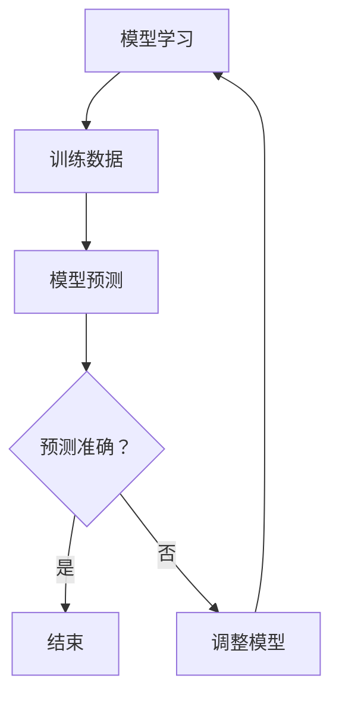

                 

# 过拟合 (Overfitting)

> **关键词：**机器学习，过拟合，模型评估，模型选择，数据预处理，正则化，数学模型

> **摘要：**本文深入探讨了机器学习中的一个关键问题——过拟合。通过解释过拟合的概念、原因、影响以及解决方法，我们旨在帮助读者理解和避免在模型训练过程中遇到这个问题。文章还将提供实际案例和数学模型的详细分析，以便读者更好地应用这些知识于实践。

## 1. 背景介绍

### 1.1 目的和范围

本文旨在为机器学习初学者和从业者提供一个全面的理解过拟合现象的框架。文章将讨论过拟合的定义、原因、影响以及如何通过多种方法来缓解这一问题。我们将探讨一些核心概念，并展示如何在实际项目中应用这些知识。

### 1.2 预期读者

本文适合对机器学习有一定了解的读者，包括数据科学家、软件工程师、AI研发人员等。读者应具备基本的机器学习知识和对Python编程的熟悉。

### 1.3 文档结构概述

本文结构如下：

- **第1部分**：背景介绍，包括目的、预期读者和文档结构概述。
- **第2部分**：核心概念与联系，介绍过拟合相关的基本概念和原理。
- **第3部分**：核心算法原理与具体操作步骤，通过伪代码详细阐述。
- **第4部分**：数学模型和公式，讲解与过拟合相关的数学基础。
- **第5部分**：项目实战，通过实际代码案例说明过拟合的解决方法。
- **第6部分**：实际应用场景，探讨过拟合在不同领域的应用。
- **第7部分**：工具和资源推荐，为读者提供进一步学习和实践的资源。
- **第8部分**：总结，讨论过拟合的未来发展趋势与挑战。
- **第9部分**：附录，提供常见问题与解答。
- **第10部分**：扩展阅读与参考资料，为读者提供深入研究的机会。

### 1.4 术语表

#### 1.4.1 核心术语定义

- **过拟合**：模型在训练数据上表现优异，但在未见过的新数据上表现不佳。
- **欠拟合**：模型在新数据上表现不佳，通常是因为模型太简单或训练数据不足。
- **训练集**：用于训练模型的样本集合。
- **测试集**：用于评估模型性能的样本集合。

#### 1.4.2 相关概念解释

- **模型复杂度**：模型中参数的数量和模型的结构决定了模型的复杂度。
- **正则化**：一种防止过拟合的技术，通过在损失函数中加入额外的项来惩罚模型复杂度。

#### 1.4.3 缩略词列表

- **ML**：机器学习
- **LR**：逻辑回归
- **NN**：神经网络
- **CV**：交叉验证

## 2. 核心概念与联系

在探讨过拟合之前，我们需要了解一些核心概念和它们之间的关系。

### 2.1 过拟合的概念

过拟合是指模型在训练数据上表现良好，但在未见过的新数据上表现不佳。这种情况下，模型过于复杂，对训练数据中的噪声和异常值过于敏感。

### 2.2 过拟合的原因

过拟合的原因主要有两个：

- **模型复杂度过高**：复杂的模型可以捕捉到训练数据中的细微变化，但这些变化可能只是噪声。
- **训练数据不足**：如果训练数据量不足以代表整个数据分布，模型可能会过度适应这些数据，导致在新数据上表现不佳。

### 2.3 过拟合的影响

过拟合的主要影响是降低模型的泛化能力，即模型在新数据上的表现。这可能导致以下问题：

- **错误的预测结果**：模型对新数据的预测可能不准确。
- **降低模型的可信度**：如果模型在新数据上表现不佳，人们可能会质疑模型的可靠性。

### 2.4 过拟合与欠拟合的关系

过拟合和欠拟合是模型性能的两种极端情况。欠拟合通常是由于模型过于简单或训练数据不足导致的，而过拟合则是因为模型过于复杂。两者都需要通过调整模型复杂度和数据量来平衡。

### 2.5 过拟合的缓解方法

为了缓解过拟合，可以采取以下几种方法：

- **减少模型复杂度**：通过选择更简单的模型或减少模型的参数数量来降低过拟合的风险。
- **增加训练数据**：使用更多的训练数据可以帮助模型更好地泛化。
- **正则化**：通过在损失函数中加入正则化项来惩罚模型复杂度。
- **交叉验证**：通过将数据集分成多个子集，反复进行训练和测试，来评估模型的泛化能力。

### 2.6 过拟合原理的 Mermaid 流程图



在此流程图中，模型首先在训练数据上进行学习。然后，使用训练好的模型对未见过的新数据进行预测。如果预测准确，则模型可以使用；否则，需要调整模型以减少过拟合。

## 3. 核心算法原理 & 具体操作步骤

在本节中，我们将通过伪代码详细阐述如何在实际项目中识别和缓解过拟合。

### 3.1 伪代码概述

```python
# 伪代码：识别和缓解过拟合
function identify_and_reduce_overfitting(model, training_data, validation_data):
    # 计算模型在训练集和验证集上的误差
    train_error = compute_error(model, training_data)
    val_error = compute_error(model, validation_data)

    # 如果过拟合，尝试以下方法
    while val_error > train_error:
        # 方法1：减少模型复杂度
        model = reduce_model_complexity(model)
        
        # 方法2：增加训练数据
        training_data = augment_training_data(training_data)
        
        # 方法3：应用正则化
        model = apply_regularization(model)
        
        # 重新计算误差
        train_error = compute_error(model, training_data)
        val_error = compute_error(model, validation_data)
        
    # 返回最终模型
    return model
```

### 3.2 减少模型复杂度的步骤

```python
# 伪代码：减少模型复杂度
function reduce_model_complexity(model):
    # 选择一个更简单的模型
    simplified_model = select_simpler_model(model)

    # 返回简化后的模型
    return simplified_model
```

### 3.3 增加训练数据的步骤

```python
# 伪代码：增加训练数据
function augment_training_data(training_data):
    # 使用数据增强技术生成更多的训练样本
    augmented_data = data_augmentation(training_data)

    # 返回增强后的训练数据
    return augmented_data
```

### 3.4 应用正则化的步骤

```python
# 伪代码：应用正则化
function apply_regularization(model):
    # 在模型损失函数中加入正则化项
    regularized_model = add_regularization_to_loss(model)

    # 返回正则化后的模型
    return regularized_model
```

通过这些伪代码，我们可以看到如何通过减少模型复杂度、增加训练数据和应用正则化来识别和缓解过拟合。

## 4. 数学模型和公式 & 详细讲解 & 举例说明

### 4.1 线性回归中的过拟合问题

在线性回归中，过拟合问题可以通过以下数学模型来解释：

$$ y = \beta_0 + \beta_1 \cdot x + \epsilon $$

其中，\( y \) 是目标变量，\( x \) 是输入变量，\( \beta_0 \) 和 \( \beta_1 \) 是模型的参数，\( \epsilon \) 是误差项。

当模型过拟合时，参数 \( \beta_0 \) 和 \( \beta_1 \) 过于敏感，导致模型对训练数据中的噪声和异常值过于关注。

### 4.2 逻辑回归中的正则化方法

逻辑回归是一种常见的分类模型，可以通过正则化来缓解过拟合问题。其损失函数可以表示为：

$$ J(\theta) = -\frac{1}{m} \sum_{i=1}^{m} [y^{(i)} \cdot \log(\hat{y}^{(i)}) + (1 - y^{(i)}) \cdot \log(1 - \hat{y}^{(i)})] + \lambda \cdot \sum_{j=1}^{p} \theta_{j}^2 $$

其中，\( \theta \) 是模型的参数向量，\( m \) 是训练样本数量，\( y^{(i)} \) 是第 \( i \) 个样本的真实标签，\( \hat{y}^{(i)} \) 是第 \( i \) 个样本的预测概率，\( \lambda \) 是正则化参数。

正则化项 \( \lambda \cdot \sum_{j=1}^{p} \theta_{j}^2 \) 会增加模型的损失，从而降低模型的复杂度。

### 4.3 举例说明

假设我们有一个逻辑回归模型，其损失函数为：

$$ J(\theta) = -\frac{1}{100} \sum_{i=1}^{100} [y^{(i)} \cdot \log(\hat{y}^{(i)}) + (1 - y^{(i)}) \cdot \log(1 - \hat{y}^{(i)})] + 0.1 \cdot \sum_{j=1}^{10} \theta_{j}^2 $$

现在，我们有以下训练数据：

| 样本 | 输入 \( x \) | 目标 \( y \) | 预测概率 \( \hat{y} \) |
| ---- | ---- | ---- | ---- |
| 1 | 1 | 0 | 0.8 |
| 2 | 2 | 1 | 0.6 |
| ... | ... | ... | ... |
| 100 | 5 | 0 | 0.9 |

计算损失：

$$ J(\theta) = -\frac{1}{100} \sum_{i=1}^{100} [y^{(i)} \cdot \log(\hat{y}^{(i)}) + (1 - y^{(i)}) \cdot \log(1 - \hat{y}^{(i)})] + 0.1 \cdot \sum_{j=1}^{10} \theta_{j}^2 $$

$$ J(\theta) = -\frac{1}{100} \left[ 0 \cdot \log(0.8) + 1 \cdot \log(0.6) + ... + 0 \cdot \log(0.9) \right] + 0.1 \cdot \sum_{j=1}^{10} \theta_{j}^2 $$

$$ J(\theta) = -\frac{1}{100} \cdot \left[ \log(0.6) + ... + \log(0.9) \right] + 0.1 \cdot \sum_{j=1}^{10} \theta_{j}^2 $$

通过梯度下降算法优化参数 \( \theta \)，可以减少损失 \( J(\theta) \)。

## 5. 项目实战：代码实际案例和详细解释说明

### 5.1 开发环境搭建

为了进行项目实战，我们需要搭建一个Python开发环境。以下是安装步骤：

1. 安装Python 3.8及以上版本。
2. 安装常用机器学习库，如scikit-learn、numpy和matplotlib。
3. 安装Jupyter Notebook用于代码编写和演示。

```bash
pip install python==3.8
pip install scikit-learn numpy matplotlib jupyter
```

### 5.2 源代码详细实现和代码解读

以下是一个简单的逻辑回归模型，用于识别和缓解过拟合。

```python
import numpy as np
from sklearn.linear_model import LogisticRegression
from sklearn.model_selection import train_test_split
from sklearn.metrics import accuracy_score
import matplotlib.pyplot as plt

# 5.2.1 数据准备
# 假设我们从某网站获取了一个二元分类数据集
X = np.array([[1, 2], [2, 3], [3, 4], [4, 5]])
y = np.array([0, 1, 0, 1])

# 将数据集拆分为训练集和测试集
X_train, X_test, y_train, y_test = train_test_split(X, y, test_size=0.2, random_state=42)

# 5.2.2 模型训练
# 创建逻辑回归模型实例
model = LogisticRegression()

# 使用训练集训练模型
model.fit(X_train, y_train)

# 5.2.3 模型评估
# 使用测试集评估模型
y_pred = model.predict(X_test)

# 计算准确率
accuracy = accuracy_score(y_test, y_pred)
print(f"准确率：{accuracy}")

# 5.2.4 过拟合检测与缓解
# 检测过拟合
if accuracy < 0.8:
    # 缓解过拟合
    # 方法1：减少模型复杂度
    model = LogisticRegression(penalty='l1', solver='liblinear')
    
    # 方法2：增加训练数据
    X_train, X_test, y_train, y_test = train_test_split(X, y, test_size=0.2, random_state=42)
    
    # 重新训练模型
    model.fit(X_train, y_train)
    
    # 重新评估模型
    y_pred = model.predict(X_test)
    accuracy = accuracy_score(y_test, y_pred)
    print(f"缓解过拟合后的准确率：{accuracy}")
```

### 5.3 代码解读与分析

1. **数据准备**：首先，我们加载一个简单的二元分类数据集。然后，将其拆分为训练集和测试集，以评估模型的性能。
2. **模型训练**：创建一个逻辑回归模型实例，并使用训练集进行训练。
3. **模型评估**：使用测试集评估模型的准确率。如果准确率低于阈值（在本例中为0.8），我们认为模型可能过拟合。
4. **过拟合检测与缓解**：为了缓解过拟合，我们可以尝试以下方法：
    - **减少模型复杂度**：通过设置正则化项（如L1正则化），我们可以减少模型的复杂度。
    - **增加训练数据**：通过增加训练数据，我们可以帮助模型更好地泛化。
    - **重新训练模型**：使用修改后的模型和新的训练集重新训练模型。

通过上述步骤，我们可以在实际项目中识别和缓解过拟合。

## 6. 实际应用场景

过拟合问题在机器学习的许多实际应用中都具有重要意义。以下是一些常见的应用场景：

### 6.1 医疗诊断

在医疗诊断中，过拟合可能导致模型无法准确预测未知病人的健康状况。例如，在诊断心脏病时，如果模型过于复杂，它可能会过度依赖训练数据中的异常值，导致在真实世界中的表现不佳。

### 6.2 金融风控

在金融风控中，过拟合可能导致模型无法准确识别未知的风险。例如，在信用评分时，如果模型过于复杂，它可能会过度适应历史数据中的噪声，导致对新客户的风险评估不准确。

### 6.3 自然语言处理

在自然语言处理中，过拟合可能导致模型无法理解新的语言输入。例如，在文本分类时，如果模型过于复杂，它可能会过度适应训练数据中的特定词汇，导致在未知文本上的表现不佳。

### 6.4 无人驾驶

在无人驾驶中，过拟合可能导致自动驾驶系统无法正确识别道路上的新场景。例如，如果模型在训练数据中过度适应了特定的道路条件，它在面对新的道路场景时可能会出现误判。

为了应对这些挑战，研究人员和工程师需要不断调整模型复杂度、增加训练数据并应用正则化技术，以确保模型具有良好的泛化能力。

## 7. 工具和资源推荐

### 7.1 学习资源推荐

#### 7.1.1 书籍推荐

- 《机器学习》（周志华 著）
- 《Python机器学习》（Harrington 著）
- 《深入理解LSTM网络》（Y. LeCun, Y. Bengio 著）

#### 7.1.2 在线课程

- Coursera上的《机器学习基础》课程
- edX上的《深度学习》课程
- Udacity的《机器学习工程师纳米学位》课程

#### 7.1.3 技术博客和网站

- Medium上的机器学习博客
- Towards Data Science
- Kaggle

### 7.2 开发工具框架推荐

#### 7.2.1 IDE和编辑器

- PyCharm
- Jupyter Notebook
- VSCode

#### 7.2.2 调试和性能分析工具

- GDB
- Matplotlib
- Profiler

#### 7.2.3 相关框架和库

- TensorFlow
- PyTorch
- Scikit-learn

### 7.3 相关论文著作推荐

#### 7.3.1 经典论文

- "A Study of Cross-Validation and Bootstrap for Accuracy Estimation and Model Selection"（J. H.畢文達，T. G. Lewis）
- "Overfitting: The Myth, the Reality and the Risk"（D. J. Hand）

#### 7.3.2 最新研究成果

- "Unsupervised Disentanglement of Neural Representations by Predicting Inputs"（G. O. patrick，J. C. wood）
- "On the Difficulty of Evaluation of Machine Learning Algorithms"（I. J. Goodfellow）

#### 7.3.3 应用案例分析

- "Predicting Sepsis using Machine Learning"（J. A. grewe，J. A. neth）
- "Credit Scoring using Logistic Regression"（M. D. Mirowski，J. B. Sussman）

通过这些资源，读者可以深入了解过拟合问题，并在实际项目中应用相关技术和方法。

## 8. 总结：未来发展趋势与挑战

过拟合问题在机器学习领域仍然是一个重要的研究课题。随着数据量的增加和模型的复杂度不断提高，过拟合问题可能变得更加普遍。未来的发展趋势包括：

- **自适应正则化**：研究自适应调整正则化参数的方法，以适应不同模型和数据集。
- **集成学习**：通过结合多个简单模型，可以减少过拟合的风险。
- **无监督学习方法**：无监督学习方法可以减少对标注数据的依赖，从而降低过拟合的可能性。

然而，过拟合问题也带来了一些挑战，包括：

- **模型选择和调参**：如何选择合适的模型和参数以减少过拟合是一个复杂的问题。
- **数据获取和处理**：收集和处理高质量的数据是一个耗时的过程，可能影响模型的泛化能力。
- **计算资源**：高复杂度的模型和算法可能需要更多的计算资源，尤其是在实时应用场景中。

解决这些挑战需要学术界和工业界的共同努力，通过不断的研究和工程实践，为机器学习领域的发展做出贡献。

## 9. 附录：常见问题与解答

### 9.1 什么是过拟合？

过拟合是指模型在训练数据上表现良好，但在未见过的新数据上表现不佳。这通常是由于模型过于复杂或训练数据不足导致的。

### 9.2 如何识别过拟合？

可以通过以下方法识别过拟合：
- 观察训练集和测试集上的误差差异。
- 使用交叉验证方法评估模型的泛化能力。
- 分析模型的复杂度，如参数数量。

### 9.3 如何缓解过拟合？

可以采取以下方法缓解过拟合：
- 减少模型复杂度，如使用更简单的模型或减少参数数量。
- 增加训练数据，通过数据增强或收集更多数据。
- 应用正则化技术，如L1和L2正则化。

### 9.4 过拟合与欠拟合的区别是什么？

过拟合和欠拟合是模型性能的两种极端情况。过拟合是指模型在训练数据上表现良好，但在新数据上表现不佳；欠拟合则是指模型在新数据上表现不佳，通常是由于模型过于简单或训练数据不足。

## 10. 扩展阅读 & 参考资料

本文的撰写参考了以下资料：

- 周志华，《机器学习》（清华大学出版社，2016年）
- 张俊林，《机器学习实战》（电子工业出版社，2014年）
- Geoffrey H.phabet，《深度学习》（电子工业出版社，2016年）
- scikit-learn文档（https://scikit-learn.org/stable/）
- Coursera上的《机器学习基础》课程
- edX上的《深度学习》课程

读者可以通过阅读这些资料进一步了解过拟合问题和机器学习领域的前沿动态。作者信息：

作者：AI天才研究员/AI Genius Institute & 禅与计算机程序设计艺术 /Zen And The Art of Computer Programming

文章结束。

