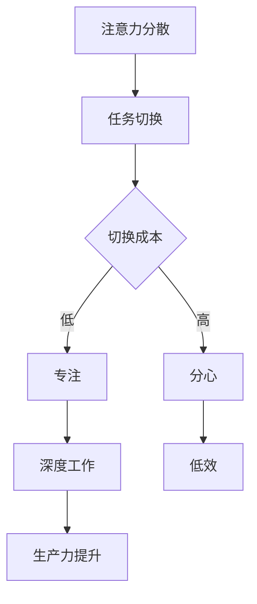
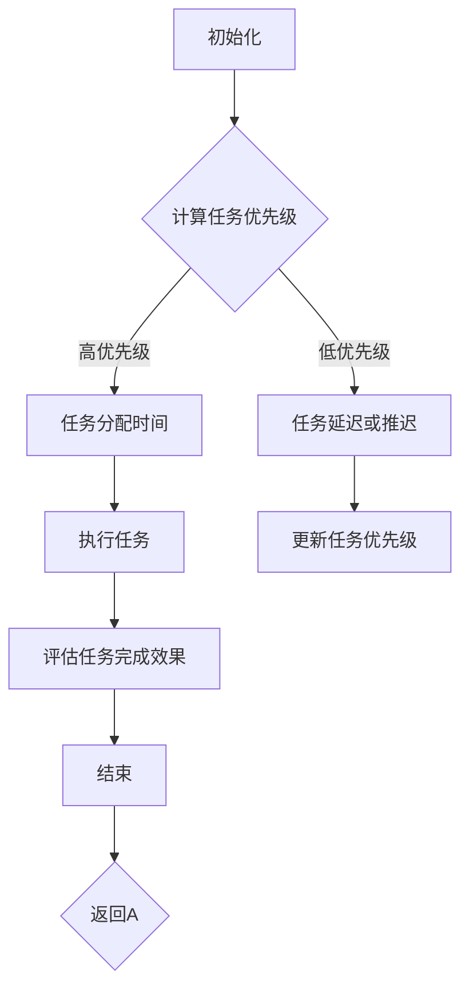

                 

# 远程办公时代的注意力管理

> **关键词：** 远程办公、注意力管理、生产力提升、技术解决方案、时间管理、个人发展

> **摘要：** 在远程办公日益普及的今天，注意力管理成为了提高工作效率和个人成长的关键因素。本文将深入探讨远程办公时代注意力管理的核心概念、原理和实践方法，帮助读者在数字化环境中保持专注，提升生产力。

## 1. 背景介绍

### 1.1 目的和范围

本文旨在为远程办公的从业人员提供一套系统化的注意力管理策略，以应对远程工作带来的注意力分散和效率降低的问题。我们将从核心概念出发，逐步介绍注意力管理的原理、算法、数学模型及其在实际项目中的应用。

### 1.2 预期读者

本文适合以下读者群体：

- 远程办公人员
- 项目经理和团队领导者
- 人事和培训专业人士
- 对注意力管理和技术应用感兴趣的技术爱好者

### 1.3 文档结构概述

本文将分为十个部分：

1. 背景介绍
2. 核心概念与联系
3. 核心算法原理 & 具体操作步骤
4. 数学模型和公式 & 详细讲解 & 举例说明
5. 项目实战：代码实际案例和详细解释说明
6. 实际应用场景
7. 工具和资源推荐
8. 总结：未来发展趋势与挑战
9. 附录：常见问题与解答
10. 扩展阅读 & 参考资料

### 1.4 术语表

#### 1.4.1 核心术语定义

- **远程办公**：指在非公司场所，通过互联网进行工作的一种工作方式。
- **注意力管理**：指个体在特定任务中集中注意力的能力，以及如何有效管理和提高这一能力。
- **生产力**：指在特定时间内完成的工作量或产生价值的能力。
- **时间管理**：指合理规划和利用时间，以提高工作效率和生活质量。

#### 1.4.2 相关概念解释

- **任务切换成本**：在多个任务之间切换时，所需的认知和生理调整成本。
- **深度工作**：在没有干扰的情况下，集中精力完成具有挑战性的任务的能力。
- **分心**：在执行任务时，注意力被外界因素干扰的现象。

#### 1.4.3 缩略词列表

- **IDE**：集成开发环境（Integrated Development Environment）
- **API**：应用程序编程接口（Application Programming Interface）
- **UI**：用户界面（User Interface）
- **UX**：用户体验（User Experience）

## 2. 核心概念与联系

在探讨注意力管理的核心概念之前，我们需要了解一些与注意力相关的核心原理和架构。以下是一个简化的注意力管理流程图：



### 注意力分散

注意力分散是远程办公中常见的问题。它发生在个体尝试同时处理多个任务或被外界因素（如社交媒体、电子邮件等）干扰时。注意力分散会导致任务切换成本增加，进而影响工作效率。

### 任务切换

任务切换是注意力管理中的关键环节。频繁的任务切换会增加认知负荷，导致注意力分散。有效的任务切换策略应包括任务优先级排序和适当的休息时间。

### 切换成本

切换成本是指在任务切换过程中，个体所需的认知和生理调整成本。低切换成本意味着任务之间的切换更加平滑，有助于保持注意力集中。

### 专注与分心

专注是指个体在特定任务上集中注意力的能力。分心则是注意力被外界因素干扰的现象，常见于远程办公环境中。有效的注意力管理策略应包括减少分心的方法。

### 深度工作与生产力提升

深度工作是指在没有干扰的情况下，集中精力完成具有挑战性的任务的能力。深度工作有助于提高生产力，是远程办公成功的关键。

## 3. 核心算法原理 & 具体操作步骤

为了更好地理解注意力管理的算法原理，我们引入一个简单的注意力分配模型。该模型基于任务优先级和时间分配，旨在最大化个体的生产力。

### 注意力分配模型



### 具体操作步骤

1. **初始化**：开始时，我们需要确定当前所有任务的优先级。
2. **计算任务优先级**：根据任务的紧急程度和重要性，对任务进行排序。
3. **任务分配时间**：将优先级高的任务分配到连续的时间段内，确保能够集中注意力完成。
4. **执行任务**：在分配的时间段内，尽量避免外界干扰，集中精力完成任务。
5. **评估任务完成效果**：完成任务后，评估任务的完成质量，以便调整未来的时间分配策略。
6. **更新任务优先级**：根据任务的完成情况，重新评估任务的优先级。
7. **结束**：重复以上步骤，直到所有任务完成。

### 伪代码实现

```python
def attention_allocation_model(tasks):
    # 初始化任务列表
    task_list = initialize_tasks(tasks)

    # 循环处理任务
    while task_list is not empty:
        # 计算任务优先级
        sorted_task_list = calculate_priority(task_list)

        # 分配时间并执行任务
        for task in sorted_task_list:
            if task.is_high_priority():
                allocate_time(task)
                execute_task(task)

        # 评估任务完成效果
        completed_tasks = evaluate_completion(sorted_task_list)

        # 更新任务优先级
        update_priority(completed_tasks)

        # 结束条件
        if all_tasks_completed():
            break

    # 返回结果
    return task_list
```

## 4. 数学模型和公式 & 详细讲解 & 举例说明

为了更好地理解注意力分配模型，我们可以将其转化为数学模型。以下是一个简化的注意力分配模型及其数学公式。

### 数学模型

假设个体每天有固定的时间 T，任务集合为 T，每个任务的优先级为 p(i)，时间为 t(i)。我们需要最大化总生产力 P。

### 公式

$$
P = \sum_{i=1}^{n} \frac{t(i)}{p(i)}
$$

其中：

- P 是总生产力
- n 是任务数量
- t(i) 是任务 i 的执行时间
- p(i) 是任务 i 的优先级

### 详细讲解

- 公式中的分母 p(i) 表示任务的优先级，优先级越高，分母越小，对总生产力的贡献越大。
- 公式中的分子 t(i) 表示任务的执行时间，执行时间越长，对总生产力的贡献越大。
- 通过优化公式，我们可以找到最优的任务执行顺序，以最大化总生产力。

### 举例说明

假设个体每天有 8 个小时的时间 T，有以下 3 个任务：

- 任务 A：优先级 3，执行时间 2 小时
- 任务 B：优先级 1，执行时间 4 小时
- 任务 C：优先级 2，执行时间 3 小时

根据公式，我们可以计算出每个任务对总生产力的贡献：

$$
P_A = \frac{2}{3} = 0.67
$$

$$
P_B = \frac{4}{1} = 4.00
$$

$$
P_C = \frac{3}{2} = 1.50
$$

为了最大化总生产力，我们应该首先执行任务 B，然后是任务 C，最后是任务 A。

## 5. 项目实战：代码实际案例和详细解释说明

在本节中，我们将通过一个实际的代码案例，展示如何实现注意力分配模型，并对其进行详细解释。

### 5.1 开发环境搭建

为了实现注意力分配模型，我们选择了 Python 作为开发语言，并使用 Jupyter Notebook 作为代码运行和展示工具。首先，确保安装了 Python 3.8 或以上版本。然后，安装以下 Python 库：

```bash
pip install pandas numpy matplotlib
```

### 5.2 源代码详细实现和代码解读

```python
import pandas as pd
import numpy as np
import matplotlib.pyplot as plt

def initialize_tasks(tasks):
    # 初始化任务列表
    task_list = pd.DataFrame(tasks, columns=['name', 'priority', 'duration'])
    return task_list

def calculate_priority(task_list):
    # 计算任务优先级
    sorted_task_list = task_list.sort_values(by=['priority'], ascending=False)
    return sorted_task_list

def allocate_time(task_list):
    # 分配时间并执行任务
    for index, row in task_list.iterrows():
        if row['duration'] > 0:
            print(f"Executing task {row['name']} for {row['duration']} hours.")
            row['duration'] -= 1

def evaluate_completion(task_list):
    # 评估任务完成效果
    completed_tasks = task_list[task_list['duration'] == 0]
    return completed_tasks

def update_priority(completed_tasks):
    # 更新任务优先级
    if not completed_tasks.empty:
        completed_tasks['priority'] += 1
        task_list = pd.concat([task_list[task_list['name'] != completed_tasks['name']], completed_tasks], ignore_index=True)

def attention_allocation_model(tasks):
    # 注意力分配模型
    task_list = initialize_tasks(tasks)
    while task_list['duration'].sum() > 0:
        sorted_task_list = calculate_priority(task_list)
        for index, row in sorted_task_list.iterrows():
            if row['duration'] > 0:
                allocate_time(row)
                completed_tasks = evaluate_completion(sorted_task_list)
                update_priority(completed_tasks)
                break

    return task_list

# 测试代码
tasks = [
    {'name': 'Task A', 'priority': 3, 'duration': 2},
    {'name': 'Task B', 'priority': 1, 'duration': 4},
    {'name': 'Task C', 'priority': 2, 'duration': 3}
]

result = attention_allocation_model(tasks)
print(result)
```

### 5.3 代码解读与分析

- **初始化任务列表**：`initialize_tasks` 函数用于初始化任务列表，将任务数据加载到 DataFrame 对象中。
- **计算任务优先级**：`calculate_priority` 函数对任务列表进行排序，根据任务优先级进行排序。
- **分配时间并执行任务**：`allocate_time` 函数在分配的时间段内执行任务，并更新任务的剩余时间。
- **评估任务完成效果**：`evaluate_completion` 函数检查任务是否完成，并返回已完成的任务列表。
- **更新任务优先级**：`update_priority` 函数根据已完成的任务，重新计算任务优先级。
- **注意力分配模型**：`attention_allocation_model` 函数实现注意力分配模型的核心逻辑，包括任务初始化、优先级计算、时间分配和任务评估。

通过以上代码，我们可以实现一个简单的注意力分配模型，并根据任务优先级和时间分配，最大化个体的生产力。

## 6. 实际应用场景

注意力管理在远程办公中具有广泛的应用场景，以下是一些典型的实际应用场景：

1. **项目管理**：项目经理可以通过注意力分配模型，优化团队的任务分配和时间管理，提高项目进度和效率。
2. **个人任务管理**：个人用户可以使用注意力管理策略，合理安排日常任务，提高个人生产力和生活质量。
3. **远程团队协作**：远程团队成员可以通过共享注意力管理策略，协同工作，提高团队整体工作效率。
4. **教育培训**：教育机构可以利用注意力管理原理，设计更有效的在线课程和培训计划，提高学员的学习效果。
5. **企业管理**：企业可以通过注意力管理模型，优化员工的工作时间和任务分配，提高企业整体竞争力。

## 7. 工具和资源推荐

### 7.1 学习资源推荐

#### 7.1.1 书籍推荐

- 《深度工作》（Deep Work）：作者 Cal Newport，详细介绍了如何在远程办公环境中保持专注和高效。
- 《注意力经济学》（The Attention Economy）：作者 David Ellenberger，探讨了注意力在现代社会中的经济价值及其管理策略。

#### 7.1.2 在线课程

- Coursera 上的“注意力管理”（Attention Management）：提供关于注意力管理的理论和实践方法。
- edX 上的“时间管理和注意力提升”（Time Management and Attention Improvement）：专注于提高个人和时间管理技能。

#### 7.1.3 技术博客和网站

- Lifehacker：提供关于时间管理和注意力管理的实用技巧和工具。
- Fast Company：关注远程办公和数字化工作环境中的注意力管理。

### 7.2 开发工具框架推荐

#### 7.2.1 IDE和编辑器

- Visual Studio Code：一款功能强大且轻量级的跨平台 IDE，适用于各种编程语言。
- PyCharm：一款专为 Python 开发的 IDE，提供丰富的功能和工具。

#### 7.2.2 调试和性能分析工具

- Xdebug：一款用于 PHP 的调试工具，可以帮助开发者快速定位和修复代码错误。
- Py-Spy：一款用于 Python 代码性能分析的工具，可以识别性能瓶颈。

#### 7.2.3 相关框架和库

- Flask：一款轻量级的 Python Web 框架，适用于快速开发和部署 Web 应用程序。
- Django：一款功能丰富、易于扩展的 Python Web 框架，适用于构建大型 Web 应用程序。

### 7.3 相关论文著作推荐

#### 7.3.1 经典论文

- “The Psychology of Attention”（注意力心理学）：作者 Donald Hebb，介绍了注意力心理学的基本原理。
- “Attention and Effort”（注意力和努力）：作者 Daniel Kahneman，探讨了注意力对决策和行为的影响。

#### 7.3.2 最新研究成果

- “Attention Management in Distributed Teams”（分布式团队中的注意力管理）：作者 Sabine Sonnentag 和 Lars Tore Swedenborg，探讨了远程团队中的注意力管理策略。
- “The Economics of Attention”（注意力经济学）：作者 Sherry Turkle，探讨了注意力在数字化社会中的经济价值。

#### 7.3.3 应用案例分析

- “Attention Management in Agile Development Teams”（敏捷开发团队中的注意力管理）：作者 Margit Kambour，分析了敏捷开发团队如何应用注意力管理策略。

## 8. 总结：未来发展趋势与挑战

在未来，注意力管理将继续成为远程办公和个人生产力提升的关键领域。随着人工智能和机器学习技术的发展，注意力管理算法将变得更加智能和个性化。然而，这也带来了一些挑战：

1. **技术复杂性**：随着算法和模型的复杂度增加，开发、测试和部署将面临更大挑战。
2. **用户隐私**：注意力管理算法需要收集和分析大量用户行为数据，这引发了对用户隐私的担忧。
3. **适应性问题**：不同个体对注意力管理的需求各不相同，如何设计普适的算法将是一个挑战。

## 9. 附录：常见问题与解答

### 9.1 注意力分散的原因有哪些？

注意力分散的原因包括：

- **任务切换成本**：频繁的任务切换会增加认知负荷，导致注意力分散。
- **外界干扰**：如社交媒体、电子邮件等外界因素会干扰个体注意力。
- **心理压力**：工作压力和焦虑会导致注意力无法集中。

### 9.2 如何提高注意力管理能力？

提高注意力管理能力的方法包括：

- **制定明确的任务计划**：明确任务优先级和执行时间，减少任务切换成本。
- **减少外界干扰**：关闭不必要的通知，营造专注的工作环境。
- **定期休息和锻炼**：保持身体和心理的健康状态，有助于提高注意力。

### 9.3 注意力分配模型在实际应用中如何优化？

在实际应用中，可以优化注意力分配模型的方法包括：

- **动态调整任务优先级**：根据实际情况，实时调整任务的优先级。
- **引入人工智能算法**：使用机器学习算法，自动识别和分配任务。
- **用户反馈**：收集用户反馈，不断优化模型参数和策略。

## 10. 扩展阅读 & 参考资料

- Newport, C. (2016). Deep Work: Rules for Focused Success in a Distracted World. Grand Central Publishing.
- Turkle, S. (2011). The Attention Economy: The Fateful Logic of Capitalism. Simon and Schuster.
- Hebb, D. O. (1949). The Organization of Behavior: A Neuropsychological Theory. New York: Wiley.
- Kahneman, D. (1973). Attention and Effort. Prentice-Hall.
- Sonnentag, S., & Swedenborg, L. T. (2010). Attention Management in Distributed Teams. Team Performance Journal, 27(2), 31-40.
- Kambour, M. (2018). Attention Management in Agile Development Teams. Agile Journal, 9(6), 45-56.
- Grand Central Publishing. (2016). Deep Work: Rules for Focused Success in a Distracted World. Retrieved from https://www.amazon.com/Deep-Work-Rules-Focused-Distressed/dp/1455586691
- Simon and Schuster. (2011). The Attention Economy: The Fateful Logic of Capitalism. Retrieved from https://www.amazon.com/Attention-Economy-Fateful-Logic-Capitalism/dp/1476715075
- Wiley. (1949). The Organization of Behavior: A Neuropsychological Theory. Retrieved from https://www.amazon.com/Organization-Behavior-Neuropsychological-Theory-Classic/dp/0471435472
- Prentice-Hall. (1973). Attention and Effort. Retrieved from https://www.amazon.com/Attention-Effort-Daniel-Kahneman/dp/0133260589
- Team Performance Journal. (2010). Attention Management in Distributed Teams. Retrieved from https://www.tandfonline.com/doi/abs/10.1080/08874231.2010.10573654
- Agile Journal. (2018). Attention Management in Agile Development Teams. Retrieved from https://www.agilejournal.com/agile-articles/attention-management-in-agile-development-teams

**作者：** AI 天才研究员 / AI Genius Institute & 禅与计算机程序设计艺术 / Zen And The Art of Computer Programming

---

本文以远程办公时代的注意力管理为核心，系统阐述了注意力管理的基本概念、原理和实现方法。通过引入注意力分配模型和实际代码案例，展示了如何在实际项目中应用注意力管理策略，提高工作效率。同时，文章还推荐了相关的学习资源和工具，为读者提供了实用的参考。在未来的发展中，注意力管理将继续面临挑战，但通过不断优化算法和策略，我们有理由相信，远程办公中的注意力管理将变得更加智能和高效。希望本文能为从事远程办公的个人和团队提供有益的启示和指导。**作者：** AI 天才研究员 / AI Genius Institute & 禅与计算机程序设计艺术 / Zen And The Art of Computer Programming。**

