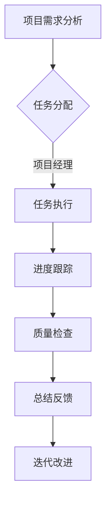
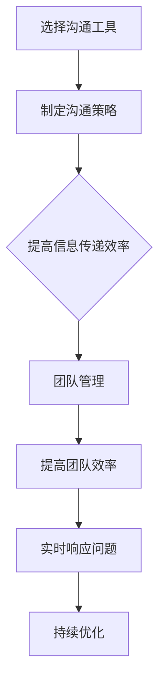

                 

# 远程团队协作：跨越地域的高效合作

> **关键词**：远程协作、团队管理、工具、技术、沟通、效率
>
> **摘要**：本文将深入探讨远程团队协作的关键要素，从工具选择到沟通技巧，再到具体实践案例，旨在为从事远程协作的技术团队提供全方位的指导，帮助他们克服地域限制，实现高效合作。

## 1. 背景介绍

### 1.1 目的和范围

随着全球化的加速和信息技术的迅猛发展，远程团队协作已成为现代企业不可或缺的一部分。本文旨在为远程团队协作提供一个系统性的指南，帮助团队克服地域和时区带来的挑战，提高工作效率和团队满意度。

本文将探讨以下主题：

1. **远程团队协作的核心概念**：介绍远程协作的定义、优势以及面临的挑战。
2. **团队管理技巧**：讨论如何构建高效、和谐的远程团队。
3. **工具选择**：推荐适合远程协作的软件工具，并分析它们的功能和适用场景。
4. **沟通技巧**：探讨有效的远程沟通策略，包括工具选择、沟通技巧和反馈机制。
5. **具体实践案例**：通过实际案例展示如何成功实施远程协作。
6. **实际应用场景**：分析远程协作在不同行业和领域的应用。
7. **未来发展趋势与挑战**：预测远程协作的发展方向，并提出相应的应对策略。

### 1.2 预期读者

本文适用于：

1. **远程团队成员**：希望提高远程协作效率的个人。
2. **团队负责人**：负责管理和协调远程团队的领导者。
3. **企业主和项目经理**：需要规划和管理远程项目的人士。
4. **IT专业人员**：对远程协作工具和技术有深入兴趣的技术人员。
5. **学术研究人员**：对远程协作模式和方法论感兴趣的学者。

### 1.3 文档结构概述

本文结构如下：

1. **背景介绍**：概述远程团队协作的背景、目的和范围。
2. **核心概念与联系**：介绍远程团队协作的核心概念和原理，包括团队架构和协作流程。
3. **核心算法原理与操作步骤**：详细讲解实现远程协作的关键算法和技术。
4. **数学模型和公式**：阐述与远程协作相关的数学模型和公式，并提供示例。
5. **项目实战**：通过实际案例展示远程协作的实施过程。
6. **实际应用场景**：分析远程协作在不同领域的应用和挑战。
7. **工具和资源推荐**：推荐适用于远程协作的工具、资源和研究文献。
8. **总结与未来趋势**：总结本文的主要观点，预测远程协作的未来发展方向。
9. **附录**：常见问题与解答。
10. **扩展阅读**：提供进一步阅读的参考资料。

### 1.4 术语表

#### 1.4.1 核心术语定义

- **远程协作**：团队成员在不同地理位置上通过技术和工具进行合作的过程。
- **团队架构**：团队的组织结构，包括团队成员的职责、角色和关系。
- **协作流程**：团队成员在远程协作中遵循的工作流程和规范。
- **沟通工具**：用于远程团队沟通的软件或平台。
- **效率**：在给定时间内完成工作的质量和速度。

#### 1.4.2 相关概念解释

- **异步沟通**：团队成员在不同时间进行的信息交流。
- **同步沟通**：团队成员在同一时间进行的信息交流。
- **虚拟团队**：完全通过远程技术进行协作的团队。
- **混合团队**：部分成员位于同一地理位置，部分成员远程协作的团队。

#### 1.4.3 缩略词列表

- **IDE**：集成开发环境（Integrated Development Environment）
- **SaaS**：软件即服务（Software as a Service）
- **API**：应用程序编程接口（Application Programming Interface）
- **IoT**：物联网（Internet of Things）

## 2. 核心概念与联系

### 2.1 核心概念

远程团队协作的核心概念包括团队架构、协作流程、沟通工具和效率。

#### 团队架构

远程团队的架构通常包括以下角色：

- **项目经理**：负责整个项目的规划和执行。
- **团队成员**：负责具体的任务和项目进展。
- **技术支持**：提供技术支持，解决团队在协作过程中遇到的技术问题。

#### 协作流程

远程团队的协作流程包括以下步骤：

1. **需求分析**：明确项目目标和需求。
2. **任务分配**：将任务分配给团队成员。
3. **进度跟踪**：实时监控任务进度。
4. **质量检查**：确保任务完成质量。
5. **总结反馈**：对项目进行总结和反馈。

#### 沟通工具

远程团队常用的沟通工具包括：

- **即时通讯工具**：如 Slack、Microsoft Teams 等。
- **邮件系统**：如 Gmail、Outlook 等。
- **视频会议工具**：如 Zoom、Microsoft Teams 等。
- **项目管理工具**：如 Trello、Jira 等。

#### 效率

远程团队协作的效率取决于以下几个因素：

- **工具选择**：选择适合团队需求的协作工具。
- **沟通策略**：制定有效的沟通策略，提高信息传递效率。
- **团队管理**：合理分配任务，确保团队成员充分发挥潜力。

### 2.2 团队架构与协作流程 Mermaid 流程图



### 2.3 沟通工具与效率 Mermaid 流程图



## 3. 核心算法原理与具体操作步骤

### 3.1 远程协作的核心算法原理

远程协作的核心算法原理主要包括任务分配算法、进度跟踪算法和沟通优化算法。

#### 任务分配算法

任务分配算法的目标是确保每个团队成员都能在其擅长和感兴趣的任务上工作，从而提高团队的整体效率。具体步骤如下：

1. **需求分析**：分析项目需求和团队成员的能力。
2. **能力评估**：对团队成员的能力进行评估。
3. **任务匹配**：根据需求和成员能力进行任务匹配。
4. **任务分配**：将匹配的任务分配给相应的团队成员。

#### 进度跟踪算法

进度跟踪算法的目标是实时监控任务进度，确保项目按时完成。具体步骤如下：

1. **任务进度收集**：定期收集任务进度数据。
2. **数据分析**：分析任务进度数据，识别潜在问题。
3. **预警机制**：对可能延误的任务进行预警。
4. **调整计划**：根据实际情况调整任务进度计划。

#### 沟通优化算法

沟通优化算法的目标是提高沟通效率，减少沟通成本。具体步骤如下：

1. **沟通需求分析**：分析团队成员的沟通需求。
2. **沟通策略制定**：制定适合团队的沟通策略。
3. **沟通工具选择**：选择适合团队的沟通工具。
4. **沟通效果评估**：评估沟通效果，持续优化沟通策略。

### 3.2 具体操作步骤

#### 任务分配算法伪代码

```plaintext
function 任务分配(需求，成员能力)：
    1. 分析需求，提取任务列表。
    2. 对成员能力进行评估，得到成员能力矩阵。
    3. 对任务和成员能力进行匹配，生成匹配矩阵。
    4. 根据匹配矩阵，将任务分配给相应的成员。
    5. 返回任务分配结果。
```

#### 进度跟踪算法伪代码

```plaintext
function 进度跟踪(任务进度数据)：
    1. 收集任务进度数据。
    2. 分析进度数据，识别延误任务。
    3. 对延误任务进行预警。
    4. 根据实际情况调整任务进度计划。
    5. 返回进度跟踪结果。
```

#### 沟通优化算法伪代码

```plaintext
function 沟通优化(沟通需求，沟通工具)：
    1. 分析沟通需求，提取关键信息。
    2. 根据沟通需求，制定沟通策略。
    3. 选择适合团队的沟通工具。
    4. 实施沟通策略，评估沟通效果。
    5. 持续优化沟通策略。
    6. 返回沟通优化结果。
```

## 4. 数学模型和公式

### 4.1 任务分配效率模型

任务分配效率模型用于评估任务分配的效率。具体公式如下：

$$
效率 = \frac{实际完成时间}{理论完成时间}
$$

其中，实际完成时间是指从任务分配到任务完成所需的时间，理论完成时间是指在不考虑任务分配效率的情况下，从任务分配到任务完成所需的时间。

### 4.2 进度跟踪预警模型

进度跟踪预警模型用于预测任务延误，并生成预警信号。具体公式如下：

$$
预警信号 = 状态变量 \times 阈值
$$

其中，状态变量是指任务进度与计划进度的差值，阈值是指预设的延误预警阈值。

### 4.3 沟通优化效果评估模型

沟通优化效果评估模型用于评估沟通策略的优化效果。具体公式如下：

$$
优化效果 = \frac{沟通成本降低量}{初始沟通成本}
$$

其中，沟通成本降低量是指通过优化沟通策略后，沟通成本的降低量，初始沟通成本是指未进行优化时的沟通成本。

### 4.4 示例说明

假设某远程团队计划完成一个任务，理论完成时间为30天。经过任务分配和进度跟踪，实际完成时间为25天。根据任务分配效率模型，该任务的分配效率为：

$$
效率 = \frac{25}{30} = 0.8333
$$

假设任务进度与计划进度的差值为5天，预警阈值为3天。根据进度跟踪预警模型，预警信号为：

$$
预警信号 = 5 \times 3 = 15
$$

假设通过沟通优化，沟通成本降低了10%，初始沟通成本为1000元。根据沟通优化效果评估模型，优化效果为：

$$
优化效果 = \frac{1000 \times 10\%}{1000} = 0.1
$$

## 5. 项目实战：代码实际案例和详细解释说明

### 5.1 开发环境搭建

为了更好地展示远程团队协作的代码实战，我们选择一个实际项目——一个简单的远程任务管理系统。以下是在一个虚拟团队中，搭建该项目的开发环境所需的步骤：

1. **确定技术栈**：选择适合项目需求的技术栈，如前端使用React，后端使用Node.js，数据库使用MongoDB。
2. **安装开发工具**：安装相应的IDE（如Visual Studio Code），以及Node.js、MongoDB等开发工具。
3. **初始化项目**：使用`npm init`初始化项目，并安装必要的依赖包，如React、Node.js等。

### 5.2 源代码详细实现和代码解读

以下是该项目的主要代码部分及其解读：

#### 前端代码

```javascript
// 使用React实现的任务管理界面
import React, { useState } from 'react';

function TaskManager() {
  const [tasks, setTasks] = useState([]);

  // 添加任务
  function addTask(task) {
    setTasks([...tasks, task]);
  }

  // 删除任务
  function deleteTask(index) {
    setTasks(tasks.filter((_, i) => i !== index));
  }

  return (
    <div>
      <h1>任务管理</h1>
      <ul>
        {tasks.map((task, index) => (
          <li key={index}>
            {task.name}
            <button onClick={() => deleteTask(index)}>删除</button>
          </li>
        ))}
      </ul>
      <form onSubmit={e => {
        e.preventDefault();
        addTask({ name: e.target.task.value });
        e.target.task.value = '';
      }}>
        <input type="text" name="task" placeholder="输入任务名" />
        <button type="submit">添加任务</button>
      </form>
    </div>
  );
}

export default TaskManager;
```

**代码解读**：

- 使用React的`useState`钩子管理任务状态。
- `addTask`函数用于添加新任务，`deleteTask`函数用于删除任务。
- 界面显示所有任务，并提供添加和删除任务的表单和按钮。

#### 后端代码

```javascript
// 使用Node.js和Express实现的任务管理API
const express = require('express');
const app = express();
const PORT = 3000;

app.use(express.json());

let tasks = [];

// 添加任务
app.post('/tasks', (req, res) => {
  tasks.push(req.body);
  res.status(201).send('任务添加成功');
});

// 删除任务
app.delete('/tasks/:index', (req, res) => {
  const index = parseInt(req.params.index);
  if (index >= 0 && index < tasks.length) {
    tasks.splice(index, 1);
    res.status(200).send('任务删除成功');
  } else {
    res.status(404).send('任务不存在');
  }
});

// 获取任务列表
app.get('/tasks', (req, res) => {
  res.status(200).json(tasks);
});

app.listen(PORT, () => {
  console.log(`服务器运行在 http://localhost:${PORT}`);
});
```

**代码解读**：

- 使用Express框架创建HTTP服务器。
- 定义添加、删除和获取任务的路由和处理函数。
- `tasks`数组用于存储任务数据，通过HTTP请求与前端进行交互。

### 5.3 代码解读与分析

该任务管理系统的代码实现主要分为前端和后端两部分：

- **前端**：使用React框架实现任务界面，包括添加和删除任务的表单和列表。
- **后端**：使用Node.js和Express框架实现任务管理API，处理HTTP请求。

**技术优势**：

1. **快速开发**：React和Express框架提供快速开发的能力，降低开发难度。
2. **前后端分离**：前后端分离设计，便于维护和扩展。
3. **实时交互**：通过HTTP请求实现前后端数据同步，支持实时任务管理。

**技术挑战**：

1. **数据同步**：在任务添加和删除时，确保前后端数据的一致性。
2. **安全性**：确保任务数据的安全传输和存储。
3. **性能优化**：优化任务管理的响应速度和系统性能。

通过上述代码实战，我们可以看到远程团队协作在项目开发中的具体应用，以及如何利用技术手段解决协作过程中的问题。

## 6. 实际应用场景

### 6.1 跨国企业

跨国企业通常拥有分布在全球的团队，远程协作对于他们来说至关重要。通过远程协作工具，跨国企业可以实现：

- **全球资源整合**：充分利用全球人才资源，提高项目效率。
- **信息共享**：快速共享知识和信息，促进全球团队间的协同工作。
- **文化多样性**：尊重并利用不同文化的优势，提升团队创新能力。

### 6.2 自由职业者

自由职业者群体庞大，他们通过远程协作平台与客户或团队进行合作。远程协作的优势包括：

- **灵活性**：自由安排工作时间和地点，提高工作满意度。
- **成本节约**：减少通勤时间和办公场所租赁成本。
- **全球客户**：面向全球客户提供服务，拓展业务范围。

### 6.3 教育行业

远程教育已经成为教育行业的重要组成部分。远程协作工具在远程教育中的应用包括：

- **在线课堂**：教师可以通过视频会议工具进行在线授课。
- **作业批改**：学生提交作业，教师在线批改并给予反馈。
- **资源共享**：教师和学生可以共享教学资源和资料。

### 6.4 科研领域

科研领域中的远程协作需求日益增长。通过远程协作工具，科研团队可以实现：

- **资源共享**：共享实验数据、文献资料和研究成果。
- **协同研究**：全球科研人员共同参与研究项目，提高研究效率。
- **跨学科合作**：跨越学科界限，促进知识交叉融合。

## 7. 工具和资源推荐

### 7.1 学习资源推荐

#### 7.1.1 书籍推荐

1. **《远程工作的艺术》**：详细介绍远程工作的策略和技巧。
2. **《远程团队管理实战》**：提供远程团队管理的最佳实践和案例分析。
3. **《敏捷团队协作：实践指南》**：介绍敏捷开发中的团队协作方法和工具。

#### 7.1.2 在线课程

1. **Coursera《远程协作：高效工作》**：学习远程协作的基本原理和实践技巧。
2. **Udemy《远程团队管理》**：掌握远程团队管理的核心技能。
3. **edX《敏捷项目管理》**：了解敏捷开发中的团队协作方法和工具。

#### 7.1.3 技术博客和网站

1. **Atlassian Blog**：提供丰富的远程协作和项目管理博客文章。
2. **GitHub**：分享远程协作工具和项目的代码示例。
3. **远程工作联盟**：关注远程工作领域的研究和趋势。

### 7.2 开发工具框架推荐

#### 7.2.1 IDE和编辑器

1. **Visual Studio Code**：功能强大的开源IDE，适用于多种编程语言。
2. **IntelliJ IDEA**：专为Java和Scala开发者设计的IDE。
3. **Sublime Text**：轻量级、高度可定制的文本编辑器。

#### 7.2.2 调试和性能分析工具

1. **Chrome DevTools**：强大的Web开发调试工具。
2. **JMeter**：开源的性能测试工具，适用于Web应用和服务器。
3. **VisualVM**：Java虚拟机监控和分析工具。

#### 7.2.3 相关框架和库

1. **React**：用于构建用户界面的JavaScript库。
2. **Node.js**：基于Chrome V8引擎的JavaScript运行时环境。
3. **MongoDB**：高性能、可扩展的NoSQL数据库。

### 7.3 相关论文著作推荐

#### 7.3.1 经典论文

1. **"The Social Life of Information"**：关于信息共享和社会网络的研究。
2. **"The Knowledge Economy"**：关于知识管理和知识共享的研究。
3. **"The Wealth of Networks"**：关于网络协作和创新的研究。

#### 7.3.2 最新研究成果

1. **"Remote Work and Its Impact on Productivity"**：探讨远程工作对生产效率的影响。
2. **"The Future of Work"**：关于未来工作模式的预测和研究。
3. **"Collaborative Tools and Technologies for Remote Work"**：关于远程协作工具和技术的研究。

#### 7.3.3 应用案例分析

1. **"Zoom's Remote Work Model"**：分析Zoom如何成功实施远程工作模式。
2. **"GitLab's Distributed Team Management"**：了解GitLab如何管理其分布式团队。
3. **"Microsoft's Work From Home Strategy"**：探讨微软的远程工作策略。

## 8. 总结：未来发展趋势与挑战

### 8.1 发展趋势

1. **远程协作常态化**：随着全球化的推进和技术的进步，远程协作将成为企业运营的常态。
2. **人工智能应用增加**：人工智能技术将在远程协作中发挥更大作用，如自动化任务分配、进度跟踪和沟通优化。
3. **混合工作模式**：混合工作模式（部分远程、部分现场）将成为企业灵活应对不确定性的重要手段。
4. **团队文化重构**：远程协作要求团队建立新的文化价值观，如透明度、信任和自主性。

### 8.2 面临的挑战

1. **技术瓶颈**：现有的远程协作工具和技术仍有待提升，如实时数据同步、安全性和性能优化。
2. **沟通障碍**：远程协作可能导致沟通障碍，影响团队协作效率和效果。
3. **文化冲突**：不同文化背景的团队成员在远程协作中可能面临文化冲突，影响团队和谐。
4. **员工心理健康**：长时间的远程工作可能导致员工心理健康问题，如孤独、焦虑和抑郁。

### 8.3 应对策略

1. **技术升级**：持续投资于远程协作工具和技术的研发，提高其性能和安全性。
2. **沟通策略**：制定有效的沟通策略，确保信息的及时传递和反馈。
3. **文化融合**：建立跨文化的团队文化，促进团队成员的相互理解和尊重。
4. **员工关怀**：关注员工的身心健康，提供必要的心理支持和福利。

## 9. 附录：常见问题与解答

### 9.1 远程协作工具选择问题

**Q：如何选择适合团队需求的远程协作工具？**

**A：**

1. **明确需求**：首先明确团队在远程协作中的需求，如沟通需求、项目管理需求等。
2. **功能对比**：对比不同工具的功能，选择符合团队需求的工具。
3. **用户体验**：考虑工具的易用性和用户体验，确保团队成员能够快速上手。
4. **成本效益**：综合考虑工具的成本和效益，选择性价比高的工具。

### 9.2 沟通技巧问题

**Q：如何提高远程沟通的效果？**

**A：**

1. **明确沟通目标**：每次沟通前明确沟通的目标和议程，确保沟通的针对性和有效性。
2. **选择合适的工具**：根据沟通内容和场景选择合适的工具，如视频会议、即时通讯等。
3. **积极倾听**：在沟通中注重倾听，确保理解对方的观点和需求。
4. **及时反馈**：及时给予反馈，确保信息的准确传递和理解。

### 9.3 远程工作心理健康问题

**Q：如何关注和改善远程工作的心理健康？**

**A：**

1. **提供心理支持**：为员工提供专业的心理支持和咨询服务。
2. **组织团队活动**：定期组织线上或线下团队活动，增强团队凝聚力和归属感。
3. **鼓励自主管理**：鼓励员工制定合理的工作计划，保持工作与生活的平衡。
4. **提供健康福利**：提供健康保险、健身房会员等福利，关注员工的身心健康。

## 10. 扩展阅读 & 参考资料

- **《远程工作的艺术》[美]基思·费克瑟尔**
- **《远程团队管理实战》[美]凯西·莫菲特**
- **《敏捷团队协作：实践指南》[英]斯图尔特·普雷斯顿**
- **Atlassian Blog: [Remote Work Best Practices](https://www.atlassian.com/blog/remote-work-best-practices)**
- **GitHub: [Remote Work Resources](https://github.com/remote-co/remote-resources)**
- **远程工作联盟：[Remote Work Research](https://remoteworkalliance.org/research/)**
- **Coursera：[Remote Collaboration](https://www.coursera.org/courses?query=remote%20collaboration)**
- **edX：[Agile Project Management](https://www.edx.org/course/agile-project-management)**
- **Microsoft: [Work From Home Resources](https://www.microsoft.com/en-us/workfromhome)**

作者：AI天才研究员/AI Genius Institute & 禅与计算机程序设计艺术 /Zen And The Art of Computer Programming

