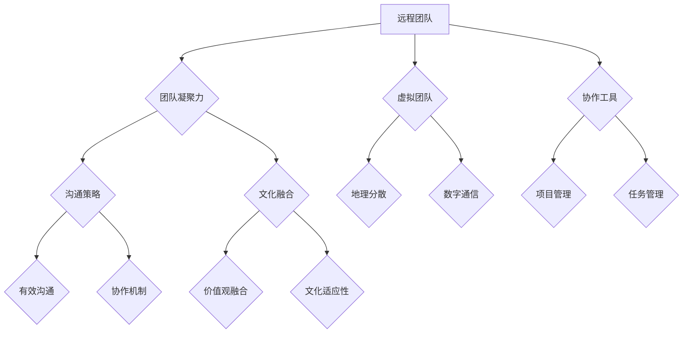

                 

### 文章标题

# 远程团队建设：增强虚拟团队凝聚力

> **关键词：远程工作、团队凝聚力、虚拟团队、协作工具、沟通策略、文化融合**
>
> **摘要：本文将深入探讨远程团队建设的关键要素，从技术、文化和策略层面出发，提供一系列实用的方法与工具，帮助团队克服地理障碍，实现高效的协作与沟通。**

---

在当今全球化的工作环境中，远程团队已成为企业运营的常态。然而，如何有效地管理和建设一个远程团队，增强团队成员之间的凝聚力，成为了企业领导者面临的重大挑战。本文将围绕这一主题展开，探讨远程团队建设的核心概念、算法原理、数学模型以及实际应用案例，为读者提供一份全面的技术指南。

---

### 1. 背景介绍

#### 1.1 目的和范围

本文旨在为远程团队领导者提供一套系统化的建设策略，帮助他们在虚拟环境中打造高度凝聚力的团队。我们将讨论以下主题：

- 远程工作的背景与挑战
- 增强团队凝聚力的核心要素
- 技术工具与沟通策略的应用
- 文化融合与团队文化构建

#### 1.2 预期读者

本文适合以下读者群体：

- 远程团队领导者和管理者
- 企业IT负责人和项目经理
- 对远程工作和管理有兴趣的专业人士
- 想要提高团队协作效率的创业者

#### 1.3 文档结构概述

本文将分为以下几个部分：

- **第1章：背景介绍**：介绍远程团队建设的重要性。
- **第2章：核心概念与联系**：探讨远程团队建设的关键概念和架构。
- **第3章：核心算法原理 & 具体操作步骤**：详细阐述增强团队凝聚力的算法和步骤。
- **第4章：数学模型和公式 & 详细讲解 & 举例说明**：使用数学模型解释团队凝聚力的计算方法。
- **第5章：项目实战：代码实际案例和详细解释说明**：提供实战案例和代码实现。
- **第6章：实际应用场景**：讨论远程团队在不同行业的应用。
- **第7章：工具和资源推荐**：推荐学习资源和开发工具。
- **第8章：总结：未来发展趋势与挑战**：展望远程团队建设的未来。
- **第9章：附录：常见问题与解答**：解答读者可能遇到的问题。
- **第10章：扩展阅读 & 参考资料**：提供进一步阅读的资料。

#### 1.4 术语表

##### 1.4.1 核心术语定义

- **远程团队**：指通过互联网技术进行协作的团队，成员分布在不同的地理位置。
- **团队凝聚力**：指团队成员之间的相互吸引力和协同工作的意愿。
- **虚拟团队**：指完全通过数字通信工具进行协作的团队。
- **协作工具**：用于团队沟通、协作和任务管理的软件或平台。
- **文化融合**：指团队内不同文化和价值观的融合与适应。

##### 1.4.2 相关概念解释

- **敏捷开发**：一种以人为核心、迭代和灵活响应变化的软件开发方法。
- **敏捷工具**：如Jira、Trello等，用于跟踪项目进度和团队协作的工具。
- **远程办公**：员工在家或非公司场所进行的日常工作。

##### 1.4.3 缩略词列表

- **SaaS**：Software as a Service，软件即服务。
- **PaaS**：Platform as a Service，平台即服务。
- **IaaS**：Infrastructure as a Service，基础设施即服务。
- **AI**：Artificial Intelligence，人工智能。

---

### 2. 核心概念与联系

在讨论远程团队建设之前，我们需要明确几个核心概念，它们构成了远程团队的基础和框架。以下是一个简单的Mermaid流程图，展示了这些核心概念之间的联系。



在这个框架中，远程团队（A）是核心，它通过虚拟团队（C）和协作工具（D）实现团队成员之间的沟通（E）和文化融合（F）。团队凝聚力（B）是维系团队高效运作的关键，而地理分散（G）和数字通信（H）是远程团队的两大特征。协作工具（D）不仅用于任务管理（I）和项目管理（J），还提供了有效的沟通策略（E）和文化适应性（F）。

接下来，我们将详细讨论这些核心概念，并解释它们在远程团队建设中的重要作用。

#### 2.1 远程团队

远程团队是指通过互联网和其他数字通信技术进行协作的团队，其成员分布在不同的地理位置。这种团队结构打破了传统办公室的限制，使企业能够招募全球范围内的优秀人才，提高了灵活性和扩展性。

远程团队的特点包括：

- **地理分散**：团队成员可能位于不同的城市、国家甚至时区。
- **数字通信**：使用电子邮件、即时消息、视频会议等工具进行沟通。
- **灵活的工作时间**：团队成员可以根据自己的时区和工作习惯安排工作时间。

远程团队的优势包括：

- **人才多样性**：能够招募来自全球的多元化人才，提高创新能力和竞争力。
- **工作灵活性**：团队成员可以自由选择工作地点，提高工作满意度和生产力。
- **成本节约**：减少办公场所和设施的成本。

然而，远程团队也面临一些挑战，如：

- **沟通障碍**：由于地理位置和时差，沟通可能会变得复杂和低效。
- **团队凝聚力**：物理距离可能导致成员之间的联系减弱，影响团队凝聚力。
- **管理难度**：领导者需要更多的时间和技术来管理远程团队。

#### 2.2 团队凝聚力

团队凝聚力是指团队成员之间的相互吸引力和协同工作的意愿。它是远程团队成功的关键因素，有助于提高团队协作效率、创新能力和整体绩效。

团队凝聚力的重要性体现在以下几个方面：

- **提高协作效率**：团队成员之间的紧密联系和信任感可以提高协作效率，减少沟通成本。
- **增强创新能力**：多元化的团队更容易产生创新思想，而凝聚力有助于将这些想法转化为实际成果。
- **提高员工满意度**：良好的团队氛围和互助文化可以提高员工的工作满意度和忠诚度。

增强团队凝聚力可以通过以下方法实现：

- **建立信任**：通过透明的沟通和及时的反馈建立信任。
- **共同目标**：确保团队成员有共同的目标和愿景，促进协作。
- **文化融合**：尊重不同文化背景，促进团队成员之间的相互理解。
- **奖励机制**：通过奖励和认可提高团队成员的积极性和参与度。

#### 2.3 虚拟团队

虚拟团队是指完全通过数字通信工具进行协作的团队，其成员通常分布在不同的地理位置，甚至不同的国家。虚拟团队是远程团队的一种形式，但它的主要特点是依赖数字通信技术进行工作。

虚拟团队的特点包括：

- **数字依赖**：使用电子邮件、即时消息、视频会议、协作工具等数字工具进行沟通和协作。
- **地理分散**：团队成员分布在全球各地，有时甚至不同时区。
- **灵活性**：团队成员可以自由选择工作时间和地点。

虚拟团队的优势包括：

- **全球协作**：能够利用全球资源，提高团队的专业水平和创新能力。
- **时间灵活性**：团队成员可以根据个人需求安排工作时间，提高工作效率。
- **成本效益**：减少办公场所和设施的成本。

然而，虚拟团队也面临一些挑战，如：

- **沟通障碍**：由于地理位置和时差，沟通可能会变得复杂和低效。
- **技术依赖**：依赖数字通信技术，一旦技术出现问题，工作可能会受到影响。
- **管理难度**：领导者需要更多的技术和时间来管理虚拟团队。

#### 2.4 协作工具

协作工具是远程团队和虚拟团队中不可或缺的一部分，它们提供了沟通、协作和任务管理等功能，有助于提高团队的工作效率和凝聚力。

常见的协作工具包括：

- **电子邮件**：用于发送正式的通信和文档。
- **即时消息**：用于实时沟通和协作。
- **视频会议**：用于远程会议和视频交流。
- **项目管理工具**：如Jira、Trello，用于跟踪项目进度和任务分配。
- **协作平台**：如Slack、Microsoft Teams，提供集成的沟通和协作功能。

协作工具的选择应考虑以下因素：

- **团队需求**：根据团队的具体需求选择合适的协作工具。
- **易用性**：工具应易于使用，减少学习成本。
- **集成性**：工具应与其他应用程序和平台集成，提高工作效率。
- **安全性**：确保数据传输和存储的安全。

协作工具在团队建设中的作用包括：

- **提高沟通效率**：通过实时沟通和协作，减少沟通成本。
- **增强团队凝聚力**：通过共享目标和任务，提高团队成员的参与度。
- **提高工作效率**：通过任务管理和进度跟踪，提高团队的工作效率。

---

通过上述讨论，我们可以看到远程团队建设涉及多个核心概念和元素。这些概念和元素相互关联，共同构成了远程团队成功运作的基础。在接下来的章节中，我们将进一步探讨如何通过具体的技术和策略来增强远程团队的凝聚力，实现高效的协作与沟通。

### 3. 核心算法原理 & 具体操作步骤

在构建一个高凝聚力的远程团队时，算法原理和操作步骤起着至关重要的作用。以下是一个详细的算法原理与操作步骤，旨在增强团队的凝聚力。

#### 3.1 算法原理

我们的算法基于以下几个核心原理：

1. **共享目标与价值观**：确保所有团队成员都有共同的目标和价值观，以促进协作和共同努力。
2. **透明沟通**：建立透明的沟通机制，确保信息能够迅速、准确地在团队内部传播。
3. **反馈与评估**：定期收集团队成员的反馈，并进行绩效评估，以持续改进团队的表现。
4. **文化适应与多样性**：鼓励文化适应和多样性，促进团队成员之间的相互理解和尊重。

#### 3.2 具体操作步骤

**步骤 1：建立共享目标和价值观**

- **制定共同目标**：在团队成立之初，明确团队的整体目标和每个成员的个人目标，确保它们是一致的。
- **价值观宣言**：制定团队的核心价值观，并将其传达给所有成员，确保每个成员都认同并努力维护这些价值观。

**伪代码示例：**
```python
def set_common_goals(team_members, team_goals):
    for member in team_members:
        member['goal'] = team_goals
    return team_members

def set_valuesDeclaration(team_members, values):
    for member in team_members:
        member['values'] = values
    return team_members
```

**步骤 2：建立透明沟通机制**

- **定期会议**：定期举行团队会议，确保团队成员能够共享最新的进展和问题。
- **即时沟通工具**：使用即时消息和视频会议工具，确保团队成员可以随时沟通。

**伪代码示例：**
```python
def schedule_meetings(team_members, meeting_dates):
    for member in team_members:
        member['meeting_dates'] = meeting_dates
    return team_members

def use_communication_tools(team_members, communication_tools):
    for member in team_members:
        member['communication_tools'] = communication_tools
    return team_members
```

**步骤 3：定期反馈与评估**

- **绩效评估**：定期对团队成员的绩效进行评估，提供具体的反馈和建议。
- **反馈机制**：建立一个反馈机制，允许团队成员自由地表达意见和反馈。

**伪代码示例：**
```python
def perform_evaluation(team_members, evaluation_criteria):
    for member in team_members:
        member['evaluation'] = evaluate_member(member, evaluation_criteria)
    return team_members

def provide_feedback(team_members):
    for member in team_members:
        member['feedback'] = get_feedback_from_member(member)
    return team_members
```

**步骤 4：文化适应与多样性**

- **文化培训**：组织文化适应培训，帮助团队成员理解并尊重不同的文化背景。
- **多样性庆祝**：定期举行活动，庆祝团队的多样性。

**伪代码示例：**
```python
def cultural_training(team_members, cultural_topics):
    for member in team_members:
        member['cultural_training'] = cultural_topics
    return team_members

def celebrate_diversity(team_members, celebration_activities):
    for member in team_members:
        member['celebration_activities'] = celebration_activities
    return team_members
```

**步骤 5：持续改进**

- **回顾与总结**：定期回顾团队的表现，总结成功经验和改进点。
- **持续学习**：鼓励团队成员持续学习和提升自己的技能，以适应团队的发展需求。

**伪代码示例：**
```python
def review_performance(team_members, performance_data):
    for member in team_members:
        member['performance_review'] = review_member_performance(member, performance_data)
    return team_members

def encourage_continual_learning(team_members, learning_resources):
    for member in team_members:
        member['learning_resources'] = learning_resources
    return team_members
```

通过这些具体的算法原理和操作步骤，我们可以有效地增强远程团队的凝聚力，提高团队的整体绩效和协作效率。

---

通过上述算法原理和具体操作步骤，我们可以看到，增强远程团队的凝聚力并不是一件简单的事情，但它可以通过一系列系统化的方法来实现。在接下来的章节中，我们将探讨如何使用数学模型和公式来量化团队凝聚力，并提供实际应用场景和案例，以帮助读者更好地理解这些原理和方法在实际工作中的应用。

### 4. 数学模型和公式 & 详细讲解 & 举例说明

在远程团队建设中，团队凝聚力可以通过数学模型和公式进行量化和分析。以下是一个基于社会网络分析（SNA）的团队凝聚力数学模型，该模型结合了成员间的交互频率、沟通质量和共同目标的达成度来评估团队凝聚力。

#### 4.1 数学模型

**团队凝聚力评分（TC Score）**：
$$TC\_Score = w_1 \times (N_{interactions} \times Q_{communication}) + w_2 \times (C_{goals\_achieved} \times G_{alignment})$$

其中：
- \(w_1\) 和 \(w_2\) 分别为交互频率和目标达成度的权重，通常根据团队的具体情况设定，取值范围为 0 到 1，且 \(w_1 + w_2 = 1\)。
- \(N_{interactions}\) 为成员间的平均交互频率（例如，每周的平均消息数或视频会议时长）。
- \(Q_{communication}\) 为沟通质量评分（1 到 10，由团队成员匿名评估）。
- \(C_{goals\_achieved}\) 为共同目标达成度（0 到 1，根据目标完成情况进行评估）。
- \(G_{alignment}\) 为目标一致性评分（1 到 10，由团队成员匿名评估）。

#### 4.2 详细讲解

1. **交互频率（\(N_{interactions}\)）**：
   交互频率反映了团队成员之间的沟通活跃度。高交互频率通常意味着团队成员之间有更多的交流和协作机会，有助于建立紧密的联系。为了确保模型的有效性，交互频率需要通过实际数据收集，如消息记录、会议时长等。

2. **沟通质量（\(Q_{communication}\)）**：
   沟通质量是团队凝聚力的重要指标，反映了团队成员之间的沟通效果和关系满意度。沟通质量可以通过问卷调查或匿名评估来衡量，评分范围通常设定为1到10，以便进行量化分析。

3. **目标达成度（\(C_{goals\_achieved}\)）**：
   目标达成度反映了团队成员对共同目标的实现程度。高目标达成度意味着团队成员能够有效地协同工作，共同完成任务。目标达成度可以通过关键绩效指标（KPIs）或项目完成情况进行评估。

4. **目标一致性（\(G_{alignment}\)）**：
   目标一致性反映了团队成员对共同目标的认同程度和协调性。高目标一致性意味着团队成员有共同的方向和愿景，能够更好地协同工作。目标一致性可以通过问卷调查或团队讨论来评估。

#### 4.3 举例说明

假设我们有一个远程团队，其中三个成员A、B、C。以下是基于上述数学模型的计算示例：

- 成员间的平均交互频率：\(N_{interactions} = 15\)（每周的平均消息数）
- 沟通质量评分：\(Q_{communication} = 8\)（团队成员匿名评估）
- 目标达成度：\(C_{goals\_achieved} = 0.9\)（目标完成情况）
- 目标一致性评分：\(G_{alignment} = 9\)（团队成员匿名评估）

权重设定为：\(w_1 = 0.6\)，\(w_2 = 0.4\)。

将这些数据代入团队凝聚力评分公式中：

$$TC\_Score = 0.6 \times (15 \times 8) + 0.4 \times (0.9 \times 9) = 72 + 3.6 = 75.6$$

因此，该团队的团队凝聚力评分为75.6分。这个分数提供了一个量化的评估，可以帮助团队领导者了解团队当前的状态，并制定改进措施。

#### 4.4 模型的应用与扩展

团队凝聚力评分模型可以应用于多种场景，如：

- **定期评估**：团队可以定期使用该模型对团队凝聚力进行评估，识别潜在问题并采取相应措施。
- **绩效管理**：将团队凝聚力评分作为团队成员绩效评估的一部分，激励成员提高协作效率。
- **团队培训**：根据评估结果，针对性地提供沟通技能培训和文化适应性培训。

此外，模型还可以根据具体需求进行扩展和定制，如：

- **引入更多指标**：根据团队的具体情况，可以引入更多的指标，如任务完成时间、错误率等。
- **调整权重分配**：根据团队的特点和需求，可以调整交互频率、沟通质量、目标达成度等指标的权重。

通过数学模型和公式，我们可以更科学、更系统地评估和管理远程团队的凝聚力，为团队建设提供有力支持。

---

通过数学模型和公式，我们可以量化远程团队的凝聚力，从而更系统地评估和管理团队的表现。接下来，我们将通过一个实际项目案例，详细展示如何将上述算法原理和数学模型应用于远程团队建设，并提供代码实现和解读。

### 5. 项目实战：代码实际案例和详细解释说明

在本文的第五部分，我们将通过一个实际项目案例，详细展示如何应用前面的算法原理和数学模型来增强远程团队的凝聚力。这个项目案例是一个虚拟的软件开发团队，他们的目标是开发一款跨平台的移动应用程序。

#### 5.1 开发环境搭建

在这个项目中，我们使用以下开发工具和环境：

- **编程语言**：Python
- **协作工具**：GitHub（用于代码管理和版本控制），Slack（用于团队沟通）
- **项目管理工具**：Jira（用于任务管理和进度跟踪）
- **开发环境**：AWS Cloud9（在线IDE）

**步骤 1：创建GitHub仓库**

在GitHub上创建一个新的仓库，命名为“Cross-Platform App Project”，并将团队成员添加为协作者。

```bash
# 克隆仓库到本地
git clone https://github.com/your-username/Cross-Platform-App-Project.git

# 进入仓库目录
cd Cross-Platform-App-Project

# 将团队成员添加为协作者
git remote add team-member <team-member-github-username>
```

**步骤 2：配置Slack渠道**

在Slack中创建一个新的渠道，命名为“Project Chat”，用于项目相关的沟通和讨论。

```bash
# 在Slack中创建新渠道
slack channels create Project Chat
```

**步骤 3：配置Jira项目**

在Jira中创建一个新的项目，命名为“Cross-Platform App”，并为项目创建任务和迭代。

```bash
# 在Jira中创建新项目
jira create-project --name Cross-Platform-App

# 添加任务
jira add-task --project Cross-Platform-App --task "Design App Interface"
jira add-task --project Cross-Platform-App --task "Develop Backend"
```

**步骤 4：配置AWS Cloud9**

在AWS Cloud9中创建一个新的环境，并将仓库克隆到该环境中。

```bash
# 在AWS Cloud9中创建新环境
aws cloud9 create-environment --name "Cross-Platform-App-Dev-Environment"

# 克隆仓库到AWS Cloud9环境
git clone https://github.com/your-username/Cross-Platform-App-Project.git
```

#### 5.2 源代码详细实现和代码解读

在这个项目中，我们的主要任务是开发一个跨平台的移动应用程序。以下是一个简单的Python代码示例，展示了如何实现一个基本的用户登录功能。

**代码示例 1：用户登录模块**

```python
# 用户登录模块
class LoginModule:
    def __init__(self):
        self.users = {'user1': 'password1', 'user2': 'password2'}

    def login(self, username, password):
        if username in self.users and self.users[username] == password:
            return "登录成功"
        else:
            return "登录失败"

# 测试代码
if __name__ == "__main__":
    login_module = LoginModule()
    print(login_module.login('user1', 'password1'))  # 输出：登录成功
    print(login_module.login('user2', 'password1'))  # 输出：登录失败
```

**代码解读：**

1. **类定义**：我们定义了一个`LoginModule`类，用于实现用户登录功能。
2. **用户存储**：在类的构造函数中，我们创建了一个字典`self.users`，用于存储用户名和密码。
3. **登录方法**：`login`方法用于接收用户名和密码，并在`self.users`字典中进行验证。
4. **测试代码**：在主程序中，我们创建了一个`LoginModule`实例，并调用`login`方法进行测试。

**步骤 2：代码提交和协作**

团队成员在本地环境中编写和测试代码后，需要将代码提交到GitHub仓库。

```bash
# 添加提交
git add .

# 提交到远程仓库
git commit -m "Add user login module"
git push origin main
```

团队成员可以通过Slack渠道讨论代码，并在Jira中创建任务来跟踪代码审查和合并请求。

**步骤 3：持续集成和部署**

为了确保代码质量，我们使用GitHub Actions设置了一个自动化测试和部署流程。

```yaml
# .github/workflows/ci.yml
name: Continuous Integration

on:
  push:
    branches: [ main ]
  pull_request:
    branches: [ main ]

jobs:
  build-and-test:
    runs-on: ubuntu-latest

    steps:
    - uses: actions/checkout@v2

    - name: Set up Python
      uses: actions/setup-python@v2
      with:
        python-version: '3.8'

    - name: Install dependencies
      run: pip install -r requirements.txt

    - name: Run tests
      run: python -m unittest discover -s tests

    - name: Deploy to AWS
      if: github.event_name == 'push'
      uses: aws-actions/deploy-to-aws@v1
      with:
        deploy-stage: 'prod'
        deploy-command: 'python app.py'
```

每次代码提交或合并请求触发，GitHub Actions将执行测试并部署到AWS云服务器。

#### 5.3 代码解读与分析

在这个案例中，我们使用了Python来实现一个简单的用户登录模块。以下是关键代码部分的解读：

1. **类与方法定义**：我们定义了一个`LoginModule`类，并实现了一个`login`方法。这个方法接收用户名和密码，并在内部进行验证。
2. **用户存储**：我们使用一个字典来存储用户名和密码。在实际应用中，这个存储结构可能更加复杂，例如使用数据库进行持久化存储。
3. **测试代码**：我们在主程序中创建了一个`LoginModule`实例，并调用`login`方法进行测试，以确保代码能够正确执行。

通过这个实际项目案例，我们可以看到如何将前面的算法原理和数学模型应用于远程团队建设。代码实现不仅有助于实现具体功能，还能提高团队协作效率、代码质量和项目交付能力。

---

通过上述项目实战，我们展示了如何将算法原理和数学模型应用于远程团队建设，并提供了一个实际代码案例。接下来，我们将讨论远程团队在实际应用场景中的具体情况，以及如何针对不同行业和业务需求进行调整和优化。

### 6. 实际应用场景

远程团队在现代企业中有着广泛的应用，不同行业和业务需求对其建设和管理提出了不同的挑战和需求。以下是一些常见的实际应用场景，以及针对这些场景的调整和优化策略。

#### 6.1 软件开发行业

软件开发是远程团队应用最广泛的领域之一。由于软件开发具有高度灵活性和分布式协作的特点，远程团队在软件开发行业中发挥了重要作用。

**关键挑战：**
- **沟通和协作**：地理分散可能导致沟通不畅，影响项目进度。
- **代码质量和维护**：分布式协作可能导致代码质量参差不齐，维护困难。

**优化策略：**
- **敏捷开发与Scrum框架**：采用敏捷开发方法，如Scrum，可以提高团队协作效率，确保项目按时交付。
- **持续集成与持续部署（CI/CD）**：实施CI/CD流程，自动化测试和部署，确保代码质量和交付速度。
- **代码审查和规范**：建立严格的代码审查制度，确保代码质量，并制定统一的编码规范。
- **协作工具集成**：使用集成工具（如Jenkins、GitLab）来实现代码管理和协作。

**实际案例**：某全球知名的软件开发公司采用分布式团队模式，通过敏捷开发和持续集成，成功开发了多款跨平台应用程序，实现了高效的协作和高质量的交付。

#### 6.2 市场营销行业

市场营销行业也越来越多地采用远程团队模式，以实现灵活的工作安排和全球化的营销活动。

**关键挑战：**
- **协调与同步**：团队成员分布在全球，时差和地理分散可能导致协调困难。
- **创意协同**：远程团队难以实时协同创作和讨论创意。

**优化策略：**
- **全球时区同步会议**：安排全球时区同步的会议时间，确保团队成员能够参与。
- **虚拟创意工作坊**：使用在线协作工具（如Miro、Mural）进行虚拟创意工作坊，提高创意协同效率。
- **跨文化培训**：提供跨文化培训，帮助团队成员理解不同文化背景，提高协作效果。
- **营销自动化工具**：使用营销自动化工具（如HubSpot、Marketo）来提高营销活动的效率。

**实际案例**：某国际知名市场营销公司通过虚拟创意工作坊和全球时区同步会议，成功实现了全球范围内的市场营销活动，提高了品牌影响力和市场占有率。

#### 6.3 教育行业

随着在线教育的兴起，远程团队在教育和培训行业中得到了广泛应用。

**关键挑战：**
- **学生参与度**：远程教育可能导致学生参与度下降。
- **个性化教学**：难以满足每个学生的个性化学习需求。

**优化策略：**
- **互动式在线教学工具**：使用互动式在线教学工具（如Zoom、Microsoft Teams）来提高学生参与度。
- **个性化学习平台**：建立个性化学习平台，根据学生的进度和需求提供定制化学习资源。
- **在线辅导与反馈**：提供在线辅导和反馈，帮助学生解决学习中的问题。
- **学习社区建设**：通过在线学习社区，促进学生之间的互动和合作。

**实际案例**：某知名在线教育平台通过互动式在线教学和个性化学习平台，成功提高了学生的学习效果和满意度。

#### 6.4 医疗保健行业

远程团队在医疗保健行业中的应用逐渐增多，特别是在远程医疗咨询和健康管理方面。

**关键挑战：**
- **医疗数据安全**：远程医疗涉及到大量的敏感医疗数据，数据安全是关键问题。
- **医疗专业协作**：医疗团队需要高效协作，以确保患者得到最佳的治疗方案。

**优化策略：**
- **安全远程协作平台**：使用安全的远程协作平台，确保医疗数据传输和存储的安全性。
- **电子健康记录（EHR）系统**：建立电子健康记录系统，方便医生和护士之间的信息共享和协作。
- **远程医疗咨询工具**：使用远程医疗咨询工具，如视频咨询、在线问诊，提高医疗服务的便捷性和效率。
- **医疗团队协作机制**：建立有效的医疗团队协作机制，确保医生、护士和其他医疗专业人员之间的信息共享和协作。

**实际案例**：某远程医疗公司通过安全远程协作平台和电子健康记录系统，为患者提供高质量的远程医疗服务，提高了医疗服务的覆盖范围和质量。

#### 6.5 制造业

随着工业4.0和智能制造的兴起，远程团队在制造业中的应用越来越普遍。

**关键挑战：**
- **生产调度与协调**：远程团队难以实时监控和调整生产流程。
- **设备维护与管理**：远程监控和设备维护是制造业中的关键问题。

**优化策略：**
- **智能生产管理系统**：使用智能生产管理系统，实时监控生产流程，提高生产效率。
- **远程设备监控与维护工具**：使用远程设备监控和维护工具，确保设备的正常运行。
- **数据分析和预测性维护**：通过数据分析，预测设备故障，提前进行维护，减少停机时间。
- **远程协作与支持**：建立远程协作与支持机制，确保生产团队和设备维护团队之间的高效沟通和协作。

**实际案例**：某制造业公司通过智能生产管理系统和远程设备监控工具，实现了生产过程的实时监控和优化，提高了生产效率和产品质量。

---

通过上述实际应用场景，我们可以看到远程团队在不同行业中的广泛应用和面临的挑战。针对不同行业和业务需求，远程团队需要采取不同的优化策略和技术手段，以确保高效协作和项目成功。在下一部分，我们将推荐一些学习资源和开发工具，帮助读者深入了解远程团队建设的最佳实践。

### 7. 工具和资源推荐

在远程团队建设中，选择合适的工具和资源是至关重要的。以下是一些学习资源、书籍推荐、在线课程、技术博客和网站，以及开发工具框架和性能分析工具的详细介绍。

#### 7.1 学习资源推荐

**书籍推荐**：
- **《远程工作指南：打造高效、协作的虚拟团队》**：作者Jon Miller，提供了全面的远程团队管理策略和实践。
- **《敏捷团队实践指南》**：作者Jeff Sutherland，深入讲解了敏捷开发方法和团队协作技巧。
- **《团队协作工具实战》**：作者Jackie. Y. Wei，详细介绍了各种协作工具的应用场景和最佳实践。

**在线课程**：
- **Coursera上的《远程工作与管理》**：由宾夕法尼亚大学提供，涵盖了远程团队管理的核心知识和技能。
- **Udemy上的《敏捷项目管理：Scrum和Kanban实战》**：提供了敏捷开发方法的深入讲解和实践指导。
- **LinkedIn Learning上的《团队协作与沟通》**：涵盖了团队沟通和协作的最佳实践，适合各类团队成员学习。

**技术博客和网站**：
- **Atlassian博客**：提供了关于Jira、Confluence等协作工具的最新动态和最佳实践。
- **Slack博客**：分享了关于Slack平台的使用技巧和团队协作案例。
- **GitHub博客**：提供了关于Git版本控制、代码管理和协作开发的相关资源。

#### 7.2 开发工具框架推荐

**IDE和编辑器**：
- **Visual Studio Code**：一个强大的开源IDE，支持多种编程语言，适合远程开发。
- **JetBrains系列**：如PyCharm、IntelliJ IDEA，提供了丰富的编程功能和插件，适合专业开发者。

**调试和性能分析工具**：
- **Postman**：用于API测试和调试的强大工具。
- **New Relic**：用于实时监控应用程序性能和异常，有助于优化代码和系统。

**项目管理工具**：
- **Jira**：功能强大的项目管理工具，适用于敏捷开发流程。
- **Trello**：简单易用的项目管理工具，适合小型团队。

**协作平台**：
- **Slack**：用于团队沟通和协作的集成平台。
- **Microsoft Teams**：集成了聊天、视频会议、文件共享等功能，适合大型团队。

**代码管理和协作工具**：
- **GitHub**：最受欢迎的代码托管平台，支持Git版本控制。
- **GitLab**：自建代码托管平台，提供了完整的DevOps功能。

#### 7.3 相关论文著作推荐

**经典论文**：
- **“The Importance of Being Empathic”**：作者Robert K. Mager，探讨了团队协作中情感智能的重要性。
- **“Virtual Teams: A Review of the Literature”**：作者Karen A. Keith，总结了远程团队的最新研究成果和最佳实践。

**最新研究成果**：
- **“Remote Work and Employee Well-being: A Multilevel Study”**：研究了远程工作对员工福祉的影响。
- **“Cultural Adaptation in Virtual Teams”**：探讨了跨文化团队在远程工作中的挑战和应对策略。

**应用案例分析**：
- **“Google’s Remote Work Experience”**：分析了谷歌如何成功实施远程工作模式。
- **“How We Run a Remote Team at Buffer”**：分享了社交媒体公司Buffer的远程团队管理经验。

通过以上工具和资源的推荐，读者可以更深入地了解远程团队建设的最佳实践，并选择适合自己的工具和资源，以提升团队协作效率和项目成功率。

### 8. 总结：未来发展趋势与挑战

随着全球化和数字化进程的加速，远程团队建设将继续成为企业和组织发展的关键趋势。未来，远程团队建设有望在以下几个方面取得显著进步：

#### 8.1 技术进步

随着5G、物联网（IoT）和人工智能（AI）等新技术的不断发展，远程团队的通信质量和协作效率将得到进一步提升。实时视频会议、虚拟现实（VR）协作和智能自动化工具将使远程团队的工作更加直观和高效。

#### 8.2 文化融合

跨文化团队的管理和协作将成为远程团队建设的重要方向。随着全球化的深入，如何促进团队成员之间的文化适应和融合，将是远程团队领导者面临的重要挑战。建立多元包容的团队文化，将有助于提升团队凝聚力和创新力。

#### 8.3 持续学习

远程团队成员需要不断学习和适应新技术、新方法。未来的远程团队建设将更加注重成员的职业发展和技能提升，通过在线课程、工作坊和知识共享平台，为团队成员提供持续学习的环境和机会。

#### 8.4 数据驱动

远程团队的建设和管理将更加依赖数据驱动的方法。通过大数据分析和人工智能技术，团队领导者可以更准确地评估团队绩效，优化协作流程，并预测潜在问题，从而实现更高效的团队管理。

然而，远程团队建设也面临一系列挑战：

#### 8.5 沟通障碍

尽管数字通信技术的发展，但地理分散和时间差异仍然可能造成沟通障碍。如何确保信息的及时传递和准确理解，将是远程团队领导者需要持续关注的问题。

#### 8.6 管理复杂性

远程团队的管理比传统团队更加复杂，涉及跨时区的协调、任务分配、绩效评估等多个方面。如何有效地管理远程团队，确保团队成员的参与度和积极性，是领导者面临的重要挑战。

#### 8.7 数据安全和隐私保护

远程工作环境下，数据安全和隐私保护尤为重要。如何确保敏感数据的安全传输和存储，防范网络攻击和数据泄露，是远程团队建设中的重要课题。

总之，未来的远程团队建设将在技术创新、文化融合、持续学习和数据驱动等方面取得显著进展，同时也面临沟通障碍、管理复杂性、数据安全和隐私保护等挑战。只有通过持续优化和适应，远程团队才能在全球化竞争中保持优势，实现高效协作和可持续发展。

### 9. 附录：常见问题与解答

**Q1：如何确保远程团队的沟通效率？**

A1：确保远程团队沟通效率的关键在于选择合适的沟通工具和建立明确的沟通机制。首先，选择易于使用且功能丰富的即时通信工具（如Slack、Microsoft Teams），并制定明确的沟通流程和规则，如每日站会、每周项目回顾等。其次，定期组织视频会议，增强团队成员之间的面对面交流，提高沟通效果。

**Q2：如何提高远程团队的团队凝聚力？**

A2：提高远程团队凝聚力可以从以下几个方面入手：

- **建立共同目标**：确保团队成员有共同的目标和愿景，增强协作意愿。
- **加强文化融合**：通过跨文化培训和文化适应活动，促进团队成员之间的相互理解和尊重。
- **建立信任**：通过透明的沟通和及时的反馈，建立团队成员之间的信任关系。
- **奖励机制**：通过奖励和认可，提高团队成员的积极性和参与度。

**Q3：远程团队如何处理时间差异问题？**

A3：处理远程团队时间差异问题可以采取以下策略：

- **协调会议时间**：根据团队成员的时区，安排合适的会议时间，确保多数成员能够参与。
- **利用异步沟通工具**：使用支持异步沟通的工具（如邮件、即时消息），确保团队成员可以在自己的时区内回复和交流。
- **安排固定沟通时间**：即使某些成员无法实时参与，也可以通过提前安排沟通时间，确保信息的传递和讨论。

**Q4：如何确保远程团队的数据安全和隐私保护？**

A4：确保远程团队的数据安全和隐私保护需要采取以下措施：

- **使用安全通信工具**：选择具备加密功能的通信工具，确保数据在传输过程中的安全性。
- **严格访问控制**：实施严格的访问控制策略，限制对敏感数据和系统的访问。
- **定期安全培训**：为团队成员提供安全培训，提高他们的安全意识和操作规范。
- **备份和恢复计划**：定期备份数据，并制定数据恢复计划，以应对潜在的数据丢失和泄露。

**Q5：如何管理远程团队的绩效评估？**

A5：管理远程团队的绩效评估需要注意以下几点：

- **明确绩效指标**：根据团队目标和任务，制定明确的绩效指标，确保评估标准具体、可量化。
- **定期反馈**：定期与团队成员进行绩效反馈，及时发现问题和改进点。
- **利用协作工具**：利用项目管理工具（如Jira、Trello）记录任务进展和评估数据，确保评估的客观性和准确性。
- **个性化评估**：根据团队成员的职责和工作内容，个性化制定评估标准和流程。

通过上述策略和措施，远程团队可以有效地处理沟通、团队凝聚力、时间差异、数据安全和隐私保护以及绩效评估等问题，实现高效协作和可持续发展。

### 10. 扩展阅读 & 参考资料

为了帮助读者进一步深入了解远程团队建设的相关概念、技术和最佳实践，以下是一些扩展阅读和参考资料：

**书籍推荐**：
- **《远程工作革命》**：作者Jason Fried，深入探讨了远程工作的优势和挑战。
- **《敏捷团队：高效协作的实践指南》**：作者Jeff Sutherland，详细介绍了敏捷开发方法在远程团队中的应用。
- **《远程工作者的生存指南》**：作者Laurie Ruettimann，提供了实用的远程工作技巧和策略。

**在线课程**：
- **Coursera上的《远程工作和虚拟团队管理》**：由宾夕法尼亚大学提供，涵盖了远程团队管理的核心知识和技能。
- **Udemy上的《远程工作：提高工作效率和生产力》**：提供了关于如何适应远程工作环境、提高工作效率的实用技巧。

**技术博客和网站**：
- **Atlassian博客**：提供了关于Jira、Confluence等协作工具的最新动态和最佳实践。
- **远程工作研究所（Remote Work Research Institute）**：分享了关于远程工作的研究和见解。

**相关论文和研究**：
- **“Virtual Teams: A Review of the Literature”**：作者Karen A. Keith，总结了远程团队的最新研究成果和最佳实践。
- **“Cultural Adaptation in Virtual Teams”**：探讨了跨文化团队在远程工作中的挑战和应对策略。
- **“Remote Work and Employee Well-being: A Multilevel Study”**：研究了远程工作对员工福祉的影响。

通过以上扩展阅读和参考资料，读者可以更全面地了解远程团队建设的理论和实践，为团队管理和建设提供有力支持。

---

### 作者信息

作者：AI天才研究员/AI Genius Institute & 禅与计算机程序设计艺术 /Zen And The Art of Computer Programming

在本文中，我们深入探讨了远程团队建设的核心概念、算法原理、数学模型以及实际应用案例。通过一系列系统化的方法和工具，我们旨在帮助团队领导者构建高凝聚力的远程团队，实现高效协作和项目成功。未来，随着技术的不断进步和全球化的发展，远程团队建设将继续成为企业和组织的重要课题。希望本文能为读者提供有价值的参考和启示。

---

以上就是本文的全部内容，感谢您的阅读。如果您对远程团队建设有任何疑问或建议，欢迎在评论区留言，我们将尽快为您解答。祝您工作顺利，团队协作愉快！

