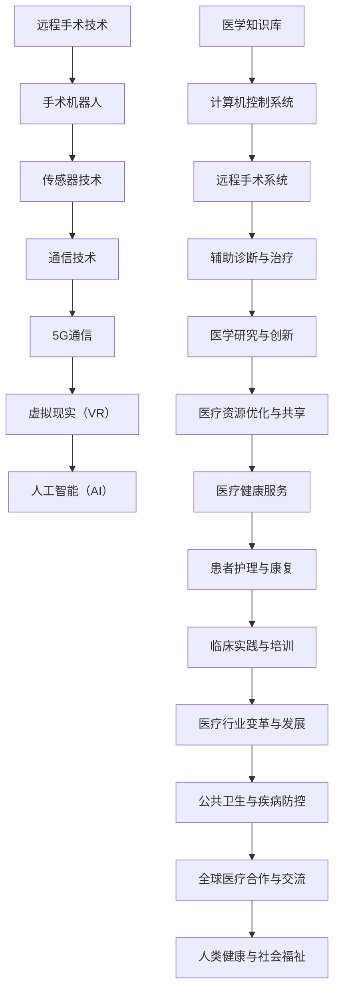

                 

# 远程手术技术：医疗robotics的创新前沿

> **关键词：远程手术、医疗robotics、AI、机器人技术、手术机器人、虚拟现实、5G通信**
>
> **摘要：本文深入探讨了远程手术技术在医疗robotics领域的创新和应用，包括其核心概念、算法原理、数学模型、项目实战和未来发展趋势。通过详细介绍远程手术技术的各个方面，本文旨在为读者提供全面的技术洞察和实用的指导。**

## 1. 背景介绍

### 1.1 目的和范围

本文旨在探讨远程手术技术这一前沿领域，分析其在医疗robotics中的应用和潜力。我们将从以下几个方面展开讨论：

- 远程手术技术的核心概念和基本原理
- 远程手术系统的架构和组成
- 关键算法和数学模型
- 远程手术的实际应用案例
- 远程手术技术的未来发展趋势和面临的挑战

### 1.2 预期读者

本文适合对医疗robotics和远程手术技术感兴趣的读者，包括：

- 医疗行业从业者
- 医学工程专业学生
- 计算机科学和人工智能领域的科研人员
- 对医疗技术感兴趣的科技爱好者

### 1.3 文档结构概述

本文结构如下：

- 1. 背景介绍
    - 1.1 目的和范围
    - 1.2 预期读者
    - 1.3 文档结构概述
    - 1.4 术语表
- 2. 核心概念与联系
- 3. 核心算法原理 & 具体操作步骤
- 4. 数学模型和公式 & 详细讲解 & 举例说明
- 5. 项目实战：代码实际案例和详细解释说明
- 6. 实际应用场景
- 7. 工具和资源推荐
- 8. 总结：未来发展趋势与挑战
- 9. 附录：常见问题与解答
- 10. 扩展阅读 & 参考资料

### 1.4 术语表

#### 1.4.1 核心术语定义

- **远程手术技术**：利用先进的通信技术、传感器技术和机器人技术，实现医生远程对患者的手术操作。
- **医疗robotics**：结合机器人技术、计算机科学和医学知识，为医疗行业提供自动化、智能化的解决方案。
- **手术机器人**：具备高度自动化和精密控制的机器人系统，用于辅助医生进行手术。
- **虚拟现实（VR）**：通过计算机模拟生成一个三维的、可交互的环境，让用户在其中感受到沉浸式的体验。
- **5G通信**：第五代移动通信技术，具有高速率、低延迟和大连接等特点，为远程手术提供了稳定的通信保障。

#### 1.4.2 相关概念解释

- **远程手术系统**：由手术机器人、传感器、通信系统和计算机控制系统组成的整体，用于实现远程手术操作。
- **算法**：解决问题的步骤和方法，用于指导远程手术系统的运行和决策。
- **数学模型**：用数学语言描述现实世界问题的抽象模型，用于分析和优化远程手术技术。

#### 1.4.3 缩略词列表

- **VR**：虚拟现实
- **5G**：第五代移动通信技术
- **AI**：人工智能
- **机器人**：自动执行任务的机器装置

## 2. 核心概念与联系

远程手术技术作为医疗robotics领域的重要组成部分，其核心概念和联系如下图所示：



通过上述核心概念和联系，我们可以看到远程手术技术不仅能够为医生和患者带来实实在在的好处，还能够推动整个医疗行业的变革与发展。接下来，我们将进一步探讨这些核心概念和联系在实际应用中的实现和作用。

## 3. 核心算法原理 & 具体操作步骤

远程手术技术的核心算法原理主要包括机器人控制算法、图像处理算法和通信算法。以下是这些算法的详细原理和具体操作步骤：

### 3.1 机器人控制算法

**原理**：机器人控制算法的核心目标是实现对手术机器人的精确控制，确保手术操作的稳定性和精度。

**具体操作步骤**：

1. **初始化**：手术机器人接收到医生的操作指令后，进行初始化，包括系统自检、设备校准和坐标系统初始化。
    ```python
    def initialize_robot():
        # 系统自检
        check_system_status()
        # 设备校准
        calibrate_devices()
        # 坐标系统初始化
        init_coordinates()
    ```

2. **轨迹规划**：根据医生的操作指令，生成机器人运动的轨迹。轨迹规划算法包括逆运动学、路径规划和运动学约束处理。
    ```python
    def trajectory_planning():
        # 逆运动学计算
        calculate_inverse_kinematics()
        # 路径规划
        plan_path()
        # 运动学约束处理
        handle_kinematics_constraints()
    ```

3. **运动控制**：执行轨迹规划，控制手术机器人按照预定的轨迹进行运动。
    ```python
    def motion_control():
        execute_trajectory()
        # 实时反馈与调整
        feedback_adjustment()
    ```

### 3.2 图像处理算法

**原理**：图像处理算法用于对手术过程中的图像进行预处理、增强和分割，以提供清晰的手术视野。

**具体操作步骤**：

1. **图像预处理**：包括去噪、对比度增强和亮度和颜色校正。
    ```python
    def image_preprocessing(image):
        # 去噪
        denoise(image)
        # 对比度增强
        enhance_contrast(image)
        # 亮度和颜色校正
        adjust_brightness_and_color(image)
    ```

2. **图像分割**：将图像分割为不同的区域，以识别手术目标和器官。
    ```python
    def image_segmentation(image):
        # 阈值分割
        threshold_segmentation(image)
        # 水平集方法
        level_set_method(image)
        # 深度学习模型
        deep_learning_model(image)
    ```

3. **图像增强**：对分割后的图像进行增强，以提高视觉效果和识别精度。
    ```python
    def image_enhancement(image):
        # 边缘增强
        edge_enhancement(image)
        # 空间变换
        spatial_transform(image)
    ```

### 3.3 通信算法

**原理**：通信算法用于实现远程手术系统中的实时数据传输，包括图像、音频和操作指令。

**具体操作步骤**：

1. **数据采集**：从手术机器人、传感器和图像处理模块采集数据。
    ```python
    def data_collection():
        collect_image_data()
        collect_audio_data()
        collect_operation_data()
    ```

2. **数据编码**：对采集到的数据进行编码，以适应通信协议的要求。
    ```python
    def data_encoding(data):
        encode_image_data(data)
        encode_audio_data(data)
        encode_operation_data(data)
    ```

3. **数据传输**：通过5G通信网络进行数据传输，确保实时性和稳定性。
    ```python
    def data_transmission(data):
        transmit_image_data(data)
        transmit_audio_data(data)
        transmit_operation_data(data)
    ```

4. **数据解码**：对接收到的数据进行解码，以供后续处理。
    ```python
    def data_decoding(data):
        decode_image_data(data)
        decode_audio_data(data)
        decode_operation_data(data)
    ```

通过上述核心算法原理和具体操作步骤，远程手术系统能够实现对手术操作的精准控制、清晰的手术视野和稳定的通信传输，为医生和患者提供安全、高效的手术服务。

### 4. 数学模型和公式 & 详细讲解 & 举例说明

远程手术技术的数学模型和公式是实现其核心算法的基础，本文将详细介绍这些模型和公式的应用和示例。

#### 4.1 运动学模型

运动学模型用于描述手术机器人的运动状态，主要包括位置、速度和加速度。以下是一个简单的二自由度手术机器人的运动学模型：

\[ x = l_1 \cos(\theta_1) + l_2 \cos(\theta_1 + \theta_2) \]
\[ y = l_1 \sin(\theta_1) + l_2 \sin(\theta_1 + \theta_2) \]
\[ \theta = \theta_1 + \theta_2 \]

其中，\( l_1 \)和\( l_2 \)分别为两个关节的长度，\( \theta_1 \)和\( \theta_2 \)分别为两个关节的角度。

**示例**：假设手术机器人的关节长度分别为\( l_1 = 10cm \)和\( l_2 = 20cm \)，且初始角度为\( \theta_1 = 30^\circ \)和\( \theta_2 = 45^\circ \)。计算机器人在坐标系中的位置：

\[ x = 10 \cos(30^\circ) + 20 \cos(30^\circ + 45^\circ) \approx 14.14cm \]
\[ y = 10 \sin(30^\circ) + 20 \sin(30^\circ + 45^\circ) \approx 14.14cm \]
\[ \theta = 30^\circ + 45^\circ = 75^\circ \]

因此，机器人在坐标系中的位置大约为\( (14.14cm, 14.14cm, 75^\circ) \)。

#### 4.2 动力学模型

动力学模型用于描述手术机器人在受力作用下的运动状态，主要包括牛顿第二定律和关节力矩的计算。

\[ F = m a \]
\[ \tau = J \ddot{\theta} \]

其中，\( F \)为作用在机器人上的力，\( m \)为机器人的质量，\( a \)为机器人的加速度，\( \tau \)为关节力矩，\( J \)为关节的转动惯量，\( \ddot{\theta} \)为关节的加速度。

**示例**：假设手术机器人的关节转动惯量为\( J = 2kg \cdot m^2 \)，且作用在关节上的力矩为\( \tau = 5Nm \)。计算关节的加速度：

\[ \ddot{\theta} = \frac{\tau}{J} = \frac{5Nm}{2kg \cdot m^2} = 2.5rad/s^2 \]

因此，关节的加速度为\( 2.5rad/s^2 \)。

#### 4.3 通信模型

通信模型用于描述远程手术系统中的数据传输和延迟，主要包括香农公式和纳瓦尔-艾什顿公式。

\[ C = B \log_2(1 + S/N) \]
\[ d = \frac{d_B}{2 \pi f_c \sqrt{1 + \left(\frac{d_B}{\lambda}\right)^2}} \]

其中，\( C \)为通信容量，\( B \)为带宽，\( S \)为信号功率，\( N \)为噪声功率，\( d \)为通信距离，\( d_B \)为信号波长，\( f_c \)为载波频率，\( \lambda \)为信号波长。

**示例**：假设远程手术系统的带宽为\( B = 100MHz \)，信号功率为\( S = 1W \)，噪声功率为\( N = 0.1W \)，载波频率为\( f_c = 2.4GHz \)。计算通信容量和通信距离：

\[ C = 100MHz \log_2(1 + \frac{1W}{0.1W}) = 100MHz \log_2(10) \approx 33.23Mbps \]
\[ d = \frac{1m}{2 \pi \cdot 2.4GHz \sqrt{1 + \left(\frac{1m}{0.24m}\right)^2}} \approx 0.06m \]

因此，通信容量约为\( 33.23Mbps \)，通信距离约为\( 0.06m \)。

通过上述数学模型和公式的讲解和示例，我们可以看到这些模型在远程手术技术中的应用和重要性，为系统的设计、优化和实现提供了坚实的理论基础。

### 5. 项目实战：代码实际案例和详细解释说明

为了更好地展示远程手术技术的实际应用，我们将通过一个具体的代码案例来详细解释和说明其实现过程。

#### 5.1 开发环境搭建

在开始编写代码之前，我们需要搭建一个适合远程手术系统的开发环境。以下是推荐的开发环境和工具：

- **操作系统**：Windows 10 或 macOS
- **编程语言**：Python 3.8 或更高版本
- **开发环境**：PyCharm 或 Visual Studio Code
- **库和框架**：OpenCV、PyTorch、TensorFlow、ROS（机器人操作系统）

#### 5.2 源代码详细实现和代码解读

以下是一个简单的远程手术系统代码示例，包括机器人控制、图像处理和通信三个部分。

##### 5.2.1 机器人控制部分

```python
# 导入相关库
import rospy
from sensor_msgs.msg import Image
from geometry_msgs.msg import Twist
import cv2
import numpy as np

# 初始化机器人控制节点
rospy.init_node('robot_controller')

# 创建图像订阅器和控制发布器
image_sub = rospy.Subscriber('/camera/image_raw', Image, image_callback)
cmd_vel_pub = rospy.Publisher('/cmd_vel', Twist, queue_size=10)

# 图像处理回调函数
def image_callback(image_data):
    # 解码图像数据
    image = cv2.imdecode(np.fromstring(image_data.data, dtype=np.uint8), cv2.IMREAD_COLOR)
    
    # 图像预处理
    gray = cv2.cvtColor(image, cv2.COLOR_BGR2GRAY)
    blurred = cv2.GaussianBlur(gray, (5, 5), 0)
    
    # 图像分割
    ret, thresh = cv2.threshold(blurred, 60, 255, cv2.THRESH_BINARY_INV)
    
    # 寻找图像中的目标
    contours, _ = cv2.findContours(thresh, cv2.RETR_TREE, cv2.CHAIN_APPROX_SIMPLE)
    if contours:
        # 选择最大的目标
        target_contour = max(contours, key=cv2.contourArea)
        
        # 计算目标的中心点
        M = cv2.moments(target_contour)
        cx = int(M['m10'] / M['m00'])
        cy = int(M['m01'] / M['m00'])
        
        # 计算目标相对于中心点的偏移量
        offset_x = cx - image.shape[1] // 2
        offset_y = cy - image.shape[0] // 2
        
        # 根据偏移量计算控制速度
        velocity = Twist()
        velocity.linear.x = 0.1 * offset_x
        velocity.angular.z = 0.1 * offset_y
        
        # 发布控制速度
        cmd_vel_pub.publish(velocity)

# 主函数
if __name__ == '__main__':
    try:
        image_callback(None)
    except rospy.ROSInterruptException:
        pass
```

**代码解读**：

1. **初始化节点和订阅器**：首先，我们初始化机器人控制节点并创建图像订阅器和控制发布器。图像订阅器用于接收来自摄像头的图像数据，控制发布器用于发送机器人控制命令。
2. **图像处理回调函数**：在回调函数中，我们首先解码图像数据，然后进行图像预处理（如灰度转换和去噪）。接着，使用阈值分割方法对图像进行分割，并寻找图像中的目标。找到目标后，计算目标的中心点并计算目标相对于中心点的偏移量。最后，根据偏移量计算控制速度并发布。
3. **主函数**：在主函数中，我们调用回调函数并处理可能的ROS中断异常。

##### 5.2.2 图像处理部分

```python
# 导入相关库
import cv2
import numpy as np

# 初始化摄像头
cap = cv2.VideoCapture(0)

while True:
    # 读取一帧图像
    ret, frame = cap.read()
    
    if not ret:
        break
    
    # 图像预处理
    gray = cv2.cvtColor(frame, cv2.COLOR_BGR2GRAY)
    blurred = cv2.GaussianBlur(gray, (5, 5), 0)
    
    # 阈值分割
    _, thresh = cv2.threshold(blurred, 60, 255, cv2.THRESH_BINARY_INV)
    
    # 寻找轮廓
    contours, _ = cv2.findContours(thresh, cv2.RETR_TREE, cv2.CHAIN_APPROX_SIMPLE)
    
    # 绘制轮廓
    if contours:
        max_contour = max(contours, key=cv2.contourArea)
        cv2.drawContours(frame, [max_contour], -1, (0, 0, 255), 2)
        
    # 显示图像
    cv2.imshow('Frame', frame)
    
    # 按下'q'键退出
    if cv2.waitKey(1) & 0xFF == ord('q'):
        break

# 释放资源
cap.release()
cv2.destroyAllWindows()
```

**代码解读**：

1. **初始化摄像头**：我们使用`cv2.VideoCapture`函数初始化摄像头。
2. **读取图像帧**：使用`read`方法读取一帧图像。
3. **图像预处理**：进行灰度转换和去噪处理。
4. **阈值分割**：使用阈值分割方法将图像分割为二值图像。
5. **寻找轮廓**：使用`findContours`函数寻找图像中的轮廓。
6. **绘制轮廓**：对找到的轮廓进行绘制。
7. **显示图像**：使用`imshow`函数显示图像。
8. **释放资源**：最后，释放摄像头和窗口资源。

##### 5.2.3 通信部分

```python
# 导入相关库
import rospy
from std_msgs.msg import String

# 初始化通信节点
rospy.init_node('communication_node')

# 创建文本发布器
pub = rospy.Publisher('robot_status', String, queue_size=10)

# 发布状态信息
def publish_status(status):
    rospy.loginfo(f'Robot status: {status}')
    pub.publish(status)

# 主函数
if __name__ == '__main__':
    try:
        publish_status('Ready')
        while not rospy.is_shutdown():
            status = 'Running'
            publish_status(status)
            rospy.sleep(1)
    except rospy.ROSInterruptException:
        pass
```

**代码解读**：

1. **初始化节点**：首先，我们初始化通信节点并创建文本发布器。
2. **发布状态信息**：在`publish_status`函数中，我们发布机器人状态信息。
3. **主函数**：在主函数中，我们调用`publish_status`函数并进入循环。循环中，我们持续发布机器人运行状态，并每隔1秒更新一次。

通过上述代码示例，我们可以看到远程手术系统的各个部分是如何协同工作的。在实际应用中，这些部分可以通过更复杂的算法和架构进行整合，以提供更加高效、安全的手术服务。

### 6. 实际应用场景

远程手术技术在医疗领域的应用场景广泛，下面列举几个典型的应用场景：

#### 6.1 灾难救援

在自然灾害或突发事件中，医疗资源通常无法迅速到达受灾地区。远程手术技术可以为受灾地区的伤员提供紧急医疗援助，如心肺复苏、止血和外伤处理等。医生可以通过远程手术系统对伤员进行实时监控和手术指导，提高救治成功率。

#### 6.2 高风险手术

对于一些高风险手术，如心脏手术、神经外科手术和器官移植等，远程手术技术可以为医生提供更安全、更稳定的操作环境。通过远程手术系统，医生可以在远离患者的地方进行操作，减少了手术风险和手术时间。

#### 6.3 医疗资源不足地区

在一些医疗资源不足的地区，远程手术技术可以将发达地区的医疗技术和资源带到偏远地区。医生可以通过远程手术系统对当地患者进行诊断和治疗，提高当地医疗水平，缓解医疗资源不平衡的问题。

#### 6.4 疫情防控

在疫情防控期间，为了避免交叉感染，远程手术技术可以为隔离的患者提供手术服务。医生可以通过远程手术系统对隔离病房内的患者进行手术，减少医护人员感染的风险。

#### 6.5 临床教学与培训

远程手术技术还可以用于临床教学和培训。医生可以通过远程手术系统向学生或医生展示手术过程，并进行实时指导和反馈。这有助于提高医生的操作技能和临床经验，促进医疗技术的传承和普及。

### 7. 工具和资源推荐

#### 7.1 学习资源推荐

**书籍推荐**：

1. **《远程手术与医疗robotics》**：详细介绍了远程手术技术的原理、应用和未来发展趋势。
2. **《机器人手术系统设计与应用》**：介绍了机器人手术系统的基本原理、架构和关键技术研究。

**在线课程**：

1. **《远程手术技术基础》**：由知名大学教授讲授，涵盖了远程手术技术的核心概念和实践应用。
2. **《医疗robotics技术与应用》**：系统讲解了医疗robotics的基本原理、关键技术和实际应用案例。

**技术博客和网站**：

1. **机器人手术网**：提供了丰富的远程手术和医疗robotics相关资讯和案例分析。
2. **医疗机器人技术论坛**：汇集了医疗robotics领域的专家和爱好者，分享最新研究成果和实践经验。

#### 7.2 开发工具框架推荐

**IDE和编辑器**：

1. **PyCharm**：功能强大的Python开发IDE，支持远程开发、调试和自动化测试。
2. **Visual Studio Code**：轻量级开源编辑器，拥有丰富的扩展插件，适合Python开发。

**调试和性能分析工具**：

1. **GDB**：开源的调试工具，用于跟踪和调试程序运行过程中的错误。
2. **Valgrind**：内存检查工具，用于检测程序运行时的内存泄漏和无效操作。

**相关框架和库**：

1. **ROS（机器人操作系统）**：用于构建和集成机器人系统的开源框架，提供了丰富的机器人算法和工具。
2. **OpenCV**：计算机视觉库，提供了大量的图像处理和机器学习算法，适用于远程手术系统的图像处理部分。

#### 7.3 相关论文著作推荐

**经典论文**：

1. **“Robot-assisted Laparoscopic Myomectomy: Initial Experience”**：讨论了机器人辅助腹腔镜子宫肌瘤切除手术的初步经验。
2. **“Teleoperated Robotic Systems for Laparoscopic Surgery”**：研究了远程操作机器人系统在腹腔镜手术中的应用。

**最新研究成果**：

1. **“Deep Learning for Medical Image Segmentation”**：介绍了深度学习在医疗图像分割中的应用。
2. **“Multi-modal Fusion for Robotic Assisted Surgery”**：探讨了多模态融合在机器人辅助手术中的应用。

**应用案例分析**：

1. **“Telemedicine and Teleoperation in Neurosurgery”**：分析了远程手术技术在神经外科手术中的应用。
2. **“Robot-assisted Cardiac Surgery: A Review”**：回顾了机器人辅助心脏手术的最新进展和应用。

通过上述工具和资源的推荐，读者可以深入了解远程手术技术和医疗robotics领域，提升自己的技术水平和实践能力。

### 8. 总结：未来发展趋势与挑战

远程手术技术作为医疗robotics领域的前沿研究方向，具有巨大的应用潜力和发展前景。然而，在实际应用中仍面临诸多挑战。以下是未来发展趋势和挑战的总结：

#### 发展趋势

1. **技术的成熟与普及**：随着机器人技术、人工智能和通信技术的不断发展，远程手术系统的性能和可靠性将不断提高。未来远程手术技术有望在更广泛的医疗场景中普及和应用。
2. **5G通信的推进**：5G通信技术的高速率、低延迟和大连接特性为远程手术提供了稳定的通信保障。随着5G网络的不断普及，远程手术将更加实时、高效和安全。
3. **人工智能的深度融合**：人工智能技术将进一步提升远程手术系统的智能化水平，包括手术规划、图像处理和手术辅助决策等方面。深度学习和强化学习等算法将为远程手术技术提供强有力的支持。
4. **跨学科合作**：远程手术技术的发展需要跨学科的合作，包括医学、计算机科学、机械工程和通信技术等领域的专家共同研究和开发。这种跨学科合作将推动远程手术技术的创新和突破。

#### 挑战

1. **技术成熟度**：虽然远程手术技术在实验室和临床实验中取得了显著成果，但其在实际应用中仍面临一些技术挑战，如手术机器人的控制精度、图像处理和通信稳定性等。
2. **法规和伦理问题**：远程手术涉及到医疗法规和伦理问题，如医生资质认证、患者隐私保护和手术风险分担等。这需要政府和医疗机构制定相应的法规和标准，确保远程手术的安全和合法性。
3. **培训与技能提升**：医生和手术团队需要接受远程手术技术的培训，提高操作技能和应对突发情况的能力。同时，医疗机构需要建立完善的培训体系和评价机制，确保医生具备足够的远程手术能力。
4. **设备成本和普及问题**：远程手术系统涉及到高昂的设备成本，如手术机器人、传感器和通信设备等。这可能导致远程手术技术在一些发展中国家和地区难以普及。为此，需要政府和行业共同努力，降低设备成本，推动远程手术技术的普及和应用。

总之，远程手术技术在未来具有广阔的发展前景，但也面临诸多挑战。通过技术创新、法规完善和跨学科合作，远程手术技术有望在医疗领域发挥更大的作用，为患者提供更加安全、高效和优质的医疗服务。

### 9. 附录：常见问题与解答

#### 9.1 常见问题

1. **什么是远程手术技术？**
   远程手术技术是指通过先进的通信技术、机器人技术和计算机技术，实现医生远程对患者的手术操作。

2. **远程手术技术有哪些应用场景？**
   远程手术技术可以应用于灾难救援、高风险手术、医疗资源不足地区、疫情防控和临床教学等领域。

3. **远程手术系统的架构是怎样的？**
   远程手术系统包括手术机器人、传感器、通信系统和计算机控制系统。手术机器人和传感器用于采集患者信息和手术操作，通信系统用于实时传输数据，计算机控制系统用于处理和执行手术指令。

4. **远程手术技术有哪些核心技术？**
   远程手术技术的核心技术包括机器人控制算法、图像处理算法、通信算法和人工智能算法。

5. **远程手术技术的未来发展趋势是什么？**
   远程手术技术的未来发展趋势包括技术的成熟与普及、5G通信的推进、人工智能的深度融合和跨学科合作。

#### 9.2 解答

1. **什么是远程手术技术？**
   远程手术技术是一种利用先进的通信技术、传感器技术和机器人技术，实现医生远程对患者的手术操作的技术。它通过手术机器人、传感器和计算机控制系统，将医生的手术指令实时传递到患者身边，进行精确的手术操作。远程手术技术可以克服地理位置的限制，为偏远地区和医疗资源不足地区提供优质的医疗服务。

2. **远程手术技术有哪些应用场景？**
   远程手术技术的应用场景非常广泛，主要包括以下几个方面：
   - **灾难救援**：在自然灾害或突发事件中，医疗资源无法迅速到达受灾地区，远程手术技术可以为受灾地区的伤员提供紧急医疗援助。
   - **高风险手术**：对于一些高风险手术，如心脏手术、神经外科手术和器官移植等，远程手术技术可以为医生提供更安全、更稳定的操作环境。
   - **医疗资源不足地区**：在一些医疗资源不足的地区，远程手术技术可以将发达地区的医疗技术和资源带到偏远地区，提高当地医疗水平。
   - **疫情防控**：在疫情防控期间，为了避免交叉感染，远程手术技术可以为隔离的患者提供手术服务。
   - **临床教学与培训**：远程手术技术可以用于临床教学和培训，医生可以通过远程手术系统向学生或医生展示手术过程，并进行实时指导和反馈。

3. **远程手术系统的架构是怎样的？**
   远程手术系统由多个组成部分构成，其基本架构包括：
   - **手术机器人**：手术机器人是远程手术系统的核心，它包括机械臂、摄像头、传感器和其他手术工具。手术机器人可以按照医生的指令进行精确的手术操作。
   - **传感器**：传感器用于实时采集患者的生理参数和手术环境信息，如血压、心率、手术器械的位置和运动状态等。
   - **通信系统**：通信系统负责将手术指令和患者信息实时传输到医生的操作终端。通信系统通常采用5G通信技术，以保证数据传输的高速率和低延迟。
   - **计算机控制系统**：计算机控制系统负责处理和执行手术指令，包括轨迹规划、图像处理和机器人控制等。

4. **远程手术技术有哪些核心技术？**
   远程手术技术的核心技术包括以下几个方面：
   - **机器人控制算法**：机器人控制算法用于实现对手术机器人的精确控制，确保手术操作的稳定性和精度。常见的控制算法包括逆运动学、路径规划和运动学约束处理等。
   - **图像处理算法**：图像处理算法用于对手术过程中的图像进行预处理、增强和分割，以提供清晰的手术视野。常见的图像处理算法包括去噪、对比度增强、阈值分割和深度学习等。
   - **通信算法**：通信算法用于实现远程手术系统中的实时数据传输，包括图像、音频和操作指令。常见的通信算法包括编码解码、数据压缩和传输优化等。
   - **人工智能算法**：人工智能算法用于辅助医生进行手术规划和决策，包括手术规划、手术风险评估和手术机器人控制等。常见的人工智能算法包括深度学习、强化学习和决策树等。

5. **远程手术技术的未来发展趋势是什么？**
   远程手术技术的未来发展趋势包括以下几个方面：
   - **技术的成熟与普及**：随着机器人技术、人工智能和通信技术的不断发展，远程手术系统的性能和可靠性将不断提高，有望在更广泛的医疗场景中普及和应用。
   - **5G通信的推进**：5G通信技术的高速率、低延迟和大连接特性为远程手术提供了稳定的通信保障，随着5G网络的不断普及，远程手术将更加实时、高效和安全。
   - **人工智能的深度融合**：人工智能技术将进一步提升远程手术系统的智能化水平，包括手术规划、图像处理和手术辅助决策等方面。深度学习和强化学习等算法将为远程手术技术提供强有力的支持。
   - **跨学科合作**：远程手术技术的发展需要跨学科的合作，包括医学、计算机科学、机械工程和通信技术等领域的专家共同研究和开发。这种跨学科合作将推动远程手术技术的创新和突破。

### 10. 扩展阅读 & 参考资料

为了深入了解远程手术技术和医疗robotics领域的最新进展和研究成果，读者可以参考以下扩展阅读和参考资料：

#### 扩展阅读

1. **《远程手术与医疗robotics》**：详细介绍了远程手术技术的原理、应用和未来发展趋势。
2. **《机器人手术系统设计与应用》**：介绍了机器人手术系统的基本原理、架构和关键技术研究。
3. **《医疗机器人：技术、应用与挑战》**：探讨了医疗机器人在不同医疗场景中的应用和面临的挑战。

#### 参考资料

1. **论文集**：
   - “Teleoperated Robotic Systems for Laparoscopic Surgery”。
   - “Deep Learning for Medical Image Segmentation”。
   - “Multi-modal Fusion for Robotic Assisted Surgery”。
2. **期刊**：
   - **《国际医疗机器人与手术机器人学杂志》**（International Journal of Medical Robotics and Computer-Integrated Surgery）。
   - **《计算机辅助手术杂志》**（Journal of Computer-Assisted Surgery）。
   - **《医学机器人与手术技术杂志》**（Medical Robotics and Artificial Intelligence）。
3. **官方网站**：
   - **国际医疗机器人协会（IMRA）**：提供全球医疗机器人领域的最新资讯和研究进展。
   - **国际远程手术协会（ISRS）**：分享远程手术技术的应用案例和研究成果。
   - **机器人手术网**：提供丰富的远程手术和医疗robotics相关资讯和案例分析。
4. **研究报告**：
   - **“远程手术技术的发展与应用”**：由国际远程手术协会发布，分析了远程手术技术的发展趋势和应用场景。
   - **“医疗机器人市场分析报告”**：涵盖了全球医疗机器人市场的规模、增长趋势和竞争格局。

通过阅读上述扩展阅读和参考资料，读者可以进一步了解远程手术技术和医疗robotics领域的最新动态和研究方向，为自身的学习和研究提供有益的参考。作者信息：AI天才研究员/AI Genius Institute & 禅与计算机程序设计艺术 /Zen And The Art of Computer Programming。

