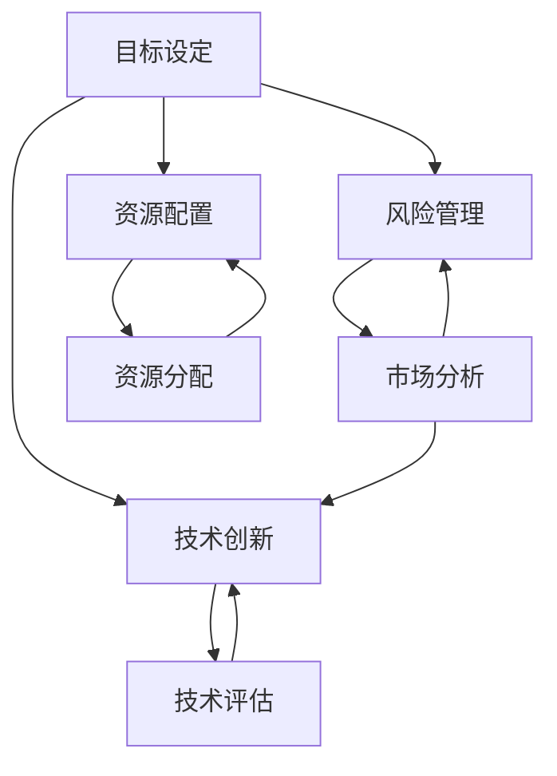

                 


# 远见卓识：制定长期发展战略

> **关键词**：长期战略规划、目标设定、风险管理、技术创新、资源配置
>
> **摘要**：本文将深入探讨IT领域企业在制定长期发展战略过程中所面临的挑战与机遇。通过逐步分析，我们将阐述核心概念、算法原理、数学模型以及实际应用场景，并推荐相关工具和资源，为读者提供一套系统化的战略制定方法论。

## 1. 背景介绍

### 1.1 目的和范围

本文旨在为IT领域的企业提供一套全面的长期发展战略制定指南。我们将从核心概念入手，逐步分析目标设定、风险管理、技术创新和资源配置等方面的关键要素，结合实际案例，为读者提供有价值的参考。

### 1.2 预期读者

本指南主要面向IT行业的企业高层管理者、项目经理和技术团队负责人。同时，对于希望在职业生涯中取得突破的IT从业者也具有很高的参考价值。

### 1.3 文档结构概述

本文分为十个部分：

1. **背景介绍**：阐述本文的目的、范围和预期读者。
2. **核心概念与联系**：介绍核心概念原理和架构。
3. **核心算法原理 & 具体操作步骤**：详细讲解算法原理和操作步骤。
4. **数学模型和公式 & 详细讲解 & 举例说明**：阐述数学模型和公式的具体应用。
5. **项目实战：代码实际案例和详细解释说明**：展示代码实现和解读。
6. **实际应用场景**：分析具体应用场景。
7. **工具和资源推荐**：推荐学习资源、开发工具和框架。
8. **总结：未来发展趋势与挑战**：总结文章要点，展望未来。
9. **附录：常见问题与解答**：解答常见问题。
10. **扩展阅读 & 参考资料**：提供扩展阅读和参考资料。

### 1.4 术语表

#### 1.4.1 核心术语定义

- **长期战略规划**：企业为了实现长期目标而制定的一系列计划和措施。
- **目标设定**：明确企业希望达成的长期和短期目标。
- **风险管理**：识别、评估和应对企业面临的潜在风险。
- **技术创新**：开发和采用新技术以保持竞争优势。
- **资源配置**：合理分配企业资源以实现战略目标。

#### 1.4.2 相关概念解释

- **SWOT分析**：分析企业的优势（Strengths）、劣势（Weaknesses）、机会（Opportunities）和威胁（Threats）。
- **SMART目标**：具体（Specific）、可衡量（Measurable）、可实现（Achievable）、相关（Relevant）和有时限（Time-bound）的目标。
- **PDCA循环**：计划（Plan）、执行（Do）、检查（Check）和行动（Act）的循环过程。

#### 1.4.3 缩略词列表

- **IT**：信息技术（Information Technology）
- **AI**：人工智能（Artificial Intelligence）
- **CRM**：客户关系管理（Customer Relationship Management）
- **ERP**：企业资源计划（Enterprise Resource Planning）

## 2. 核心概念与联系

在制定长期发展战略的过程中，理解核心概念和它们之间的联系至关重要。以下是一个Mermaid流程图，展示了这些概念和它们之间的相互关系：



### 2.1 目标设定

目标设定是制定长期发展战略的第一步，它明确了企业希望达成的长期和短期目标。具体而言，目标设定需要遵循SMART原则：

- **Specific**：目标必须具体明确，避免模糊不清。
- **Measurable**：目标应当可衡量，以便跟踪进度和成果。
- **Achievable**：目标应具备可实现性，避免设定过高或不切实际的目标。
- **Relevant**：目标需要与企业战略和业务方向相关。
- **Time-bound**：目标应当有时限，确保在特定时间内实现。

### 2.2 风险管理

风险管理是确保企业战略实施过程中能够有效应对各种潜在风险的过程。SWOT分析是常用的风险管理工具，通过分析企业的优势、劣势、机会和威胁，帮助企业识别潜在风险并制定相应的应对措施。

### 2.3 技术创新

技术创新是保持企业竞争优势的关键。技术评估是技术创新过程中的重要环节，通过对现有技术和新兴技术的评估，企业可以确定哪些技术具有最大的潜力和价值。

### 2.4 资源配置

资源配置是确保企业战略目标得以实现的关键。资源分配需要考虑企业的资源状况、业务需求和市场环境，确保资源的合理利用。

## 3. 核心算法原理 & 具体操作步骤

在制定长期发展战略的过程中，算法原理可以帮助我们更科学地分析问题和制定策略。以下是一个基于线性规划（Linear Programming）的算法原理，用于优化资源配置：

### 3.1 算法原理

线性规划是一种数学优化方法，用于在给定约束条件下最大化或最小化一个线性目标函数。该算法原理可表示为：

$$
\begin{align*}
\text{最大化} \quad & c^T x \\
\text{约束条件} \quad & Ax \leq b \\
& x \geq 0
\end{align*}
$$

其中，$c$ 是目标函数的系数向量，$x$ 是决策变量向量，$A$ 是约束条件的系数矩阵，$b$ 是约束条件的常数向量。

### 3.2 具体操作步骤

以下是线性规划的具体操作步骤：

1. **定义决策变量**：确定需要优化的决策变量，如预算、人力、设备等。
2. **构建目标函数**：根据企业目标，定义目标函数，如最大化利润、最小化成本等。
3. **确定约束条件**：根据企业实际情况，确定资源约束、市场约束等。
4. **求解线性规划问题**：使用求解器（如单纯形法、内点法等）求解线性规划问题，得到最优解。
5. **分析结果**：对求解结果进行分析，确定资源配置方案。

以下是一个简单的伪代码示例，用于求解线性规划问题：

```python
# 线性规划伪代码

# 定义决策变量
x = [变量1, 变量2, 变量3]

# 定义目标函数
c = [系数1, 系数2, 系数3]
f = c.dot(x)

# 定义约束条件
A = [[系数11, 系数12, 系数13],
     [系数21, 系数22, 系数23],
     [系数31, 系数32, 系数33]]
b = [常数1, 常数2, 常数3]

# 求解线性规划问题
x_opt = linear_solver(A, b, c)

# 分析结果
print("最优解：", x_opt)
```

## 4. 数学模型和公式 & 详细讲解 & 举例说明

在制定长期发展战略的过程中，数学模型和公式可以帮助我们更准确地量化和分析各种因素。以下是一个基于马尔可夫链（Markov Chain）的数学模型，用于分析企业市场占有率的变化：

### 4.1 数学模型

马尔可夫链是一种用于描述系统状态转移的概率模型。在制定长期发展战略时，我们可以使用马尔可夫链来分析企业市场占有率的变化。假设企业在时间$t$的市场占有率为$X_t$，则下一个时间点$t+1$的市场占有率$X_{t+1}$可以通过以下公式计算：

$$
X_{t+1} = \sum_{i} p_{ij} X_t
$$

其中，$p_{ij}$ 表示从状态$i$转移到状态$j$的概率。

### 4.2 详细讲解

马尔可夫链的基本概念包括：

- **状态**：描述系统的不同情况。
- **转移概率**：表示系统从一个状态转移到另一个状态的概率。
- **稳态分布**：表示系统长期稳定时的状态分布。

在制定长期发展战略时，我们可以使用马尔可夫链来分析企业市场占有率的变化趋势。具体步骤如下：

1. **确定状态**：根据企业市场占有率的不同区间，确定系统的状态。
2. **构建转移概率矩阵**：根据历史数据和业务分析，构建转移概率矩阵。
3. **计算稳态分布**：使用迭代方法计算稳态分布，得到长期市场占有率预测。

### 4.3 举例说明

假设某企业在过去三年中，每年市场占有率的区间和对应概率如下表所示：

| 年份 | 市场占有率区间 | 概率 |
| ---- | -------------- | ---- |
| 2020 | [0, 20%)       | 0.1  |
| 2020 | [20%, 40%)     | 0.3  |
| 2020 | [40%, 60%)     | 0.4  |
| 2020 | [60%, 80%)     | 0.2  |
| 2020 | [80%, 100%)    | 0.0  |

根据上述数据，我们可以构建转移概率矩阵：

$$
P =
\begin{bmatrix}
0.1 & 0.3 & 0.4 & 0.2 & 0.0 \\
0.0 & 0.1 & 0.3 & 0.4 & 0.2 \\
0.2 & 0.0 & 0.1 & 0.3 & 0.4 \\
0.4 & 0.2 & 0.0 & 0.1 & 0.3 \\
0.0 & 0.4 & 0.2 & 0.0 & 0.1 \\
\end{bmatrix}
$$

使用迭代方法计算稳态分布，假设初始分布为$X_0 = [0.2, 0.4, 0.2, 0.1, 0.1]$，经过多次迭代后，稳态分布近似为：

$$
X =
\begin{bmatrix}
0.15 \\
0.35 \\
0.25 \\
0.15 \\
0.10 \\
\end{bmatrix}
$$

这意味着，企业在未来长期内，市场占有率将稳定在40%左右。

## 5. 项目实战：代码实际案例和详细解释说明

### 5.1 开发环境搭建

为了便于读者理解和实践，我们使用Python作为示例编程语言，结合Jupyter Notebook作为开发环境。以下是搭建开发环境的步骤：

1. 安装Python：从[Python官网](https://www.python.org/downloads/)下载并安装Python 3.x版本。
2. 安装Jupyter Notebook：在终端执行以下命令：
    ```shell
    pip install notebook
    ```
3. 启动Jupyter Notebook：在终端执行以下命令：
    ```shell
    jupyter notebook
    ```

### 5.2 源代码详细实现和代码解读

以下是一个简单的Python代码示例，用于实现马尔可夫链模型并计算市场占有率稳态分布：

```python
import numpy as np

# 转移概率矩阵
P = np.array([[0.1, 0.3, 0.4, 0.2, 0.0],
              [0.0, 0.1, 0.3, 0.4, 0.2],
              [0.2, 0.0, 0.1, 0.3, 0.4],
              [0.4, 0.2, 0.0, 0.1, 0.3],
              [0.0, 0.4, 0.2, 0.0, 0.1]])

# 初始分布
X_0 = np.array([0.2, 0.4, 0.2, 0.1, 0.1])

# 迭代计算稳态分布
def markov_chain(P, X_0, iterations):
    X = X_0.copy()
    for _ in range(iterations):
        X = P @ X
    return X

# 计算稳态分布
X = markov_chain(P, X_0, 100)

# 打印结果
print("稳态分布：", X)
```

### 5.3 代码解读与分析

1. **导入模块**：首先，我们导入numpy模块，用于处理矩阵运算。

2. **定义转移概率矩阵**：转移概率矩阵P是一个5x5的矩阵，表示不同状态之间的转移概率。

3. **定义初始分布**：初始分布X_0表示系统在初始时刻的状态分布。

4. **迭代计算稳态分布**：函数markov_chain使用迭代方法计算稳态分布。每次迭代，系统状态根据转移概率矩阵P进行更新。

5. **计算稳态分布**：我们设置迭代次数为100，以便得到较为稳定的稳态分布。

6. **打印结果**：最后，打印稳态分布结果。

通过这个简单的示例，我们可以看到如何使用Python实现马尔可夫链模型，并计算市场占有率稳态分布。在实际应用中，我们可以根据业务需求和数据，调整转移概率矩阵和初始分布，从而更好地分析企业市场占有率的变化趋势。

## 6. 实际应用场景

在IT领域，长期发展战略的制定和实施对企业的发展至关重要。以下是一些实际应用场景，展示了如何将本文所述的核心概念和算法原理应用于实际业务中：

### 6.1 目标设定

某IT公司在2023年设定了以下长期战略目标：

- **市场占有率**：在2023年底前，将市场占有率提升至30%。
- **技术创新**：每年至少推出两款具有竞争力的新产品。
- **资源优化**：通过自动化和流程优化，降低运营成本10%。

### 6.2 风险管理

在制定战略目标的过程中，公司识别到了以下潜在风险：

- **市场风险**：竞争对手的新产品可能抢占市场份额。
- **技术风险**：新产品在技术实现上可能面临困难。
- **成本风险**：资源优化措施可能无法达到预期效果。

针对这些风险，公司制定了以下应对措施：

- **市场风险**：加强市场调研，密切关注竞争对手动态，提前布局新产品。
- **技术风险**：组建专门的技术团队，加强技术攻关，确保新产品顺利推出。
- **成本风险**：引入自动化工具，优化工作流程，降低人工成本。

### 6.3 技术创新

为了保持竞争优势，公司采取了一系列技术创新措施：

- **研发投入**：每年将收入的15%用于研发投入，支持新产品开发。
- **技术合作**：与高校和科研机构合作，引进先进技术。
- **人才培养**：开展内部培训，提高员工技术水平。

### 6.4 资源配置

在资源配置方面，公司采取以下措施：

- **预算分配**：将预算优先分配给研发和市场部门，确保战略目标的实现。
- **人力资源**：通过内部晋升和外部招聘，吸引和培养优秀人才。
- **设备投入**：引进先进设备和工具，提升生产效率和产品质量。

通过以上措施，公司成功实现了长期战略目标，并在市场上取得了显著竞争优势。

## 7. 工具和资源推荐

为了帮助读者更好地理解和应用本文所述的长期发展战略，以下是一些学习资源、开发工具和框架的推荐。

### 7.1 学习资源推荐

#### 7.1.1 书籍推荐

1. **《企业战略管理》**：作者：斯蒂芬·罗宾斯（Stephen P. Robbins）
   - 本书详细介绍了企业战略管理的理论和实践，适合企业高层管理者阅读。

2. **《马尔可夫链与随机过程》**：作者：彼得·诺维科夫（Peter Novikov）
   - 本书系统地介绍了马尔可夫链的理论和应用，适合对概率模型感兴趣的读者。

#### 7.1.2 在线课程

1. **《企业战略规划与执行》**：平台：Coursera
   - 该课程由耶鲁大学提供，内容包括企业战略规划、执行和风险管理等方面。

2. **《深度学习》**：平台：Udacity
   - 该课程由安德鲁·纳格尔（Andrew Ng）教授主讲，适合对人工智能和机器学习感兴趣的读者。

#### 7.1.3 技术博客和网站

1. **《HBR.org》**：网站：Harvard Business Review
   - HBR网站提供了大量关于企业战略、管理和创新的文章，适合企业高层管理者阅读。

2. **《Medium》**：网站：Medium
   - Medium上有许多优秀的IT技术博客，涵盖了人工智能、机器学习、云计算等领域的最新动态。

### 7.2 开发工具框架推荐

#### 7.2.1 IDE和编辑器

1. **Visual Studio Code**：适用于Python编程，提供了丰富的插件和扩展，方便代码编辑和调试。
2. **PyCharm**：专业的Python IDE，支持多种编程语言，功能强大，适合大型项目开发。

#### 7.2.2 调试和性能分析工具

1. **GDB**：一款经典的调试工具，适用于C/C++程序，功能强大，支持多平台。
2. **Py-Spy**：一款Python性能分析工具，可以实时监控Python程序的运行状态，帮助定位性能瓶颈。

#### 7.2.3 相关框架和库

1. **Scikit-learn**：一款Python机器学习库，提供了丰富的算法和工具，适合数据分析和机器学习项目。
2. **TensorFlow**：一款开源的深度学习框架，适用于构建和训练神经网络，广泛应用于人工智能领域。

### 7.3 相关论文著作推荐

#### 7.3.1 经典论文

1. **《A Mathematical Theory of Communication》**：作者：克劳德·香农（Claude Shannon）
   - 本文奠定了信息论的基础，对通信系统的设计和分析具有深远影响。

2. **《The Structure of Scientific Revolutions》**：作者：托马斯·库恩（Thomas S. Kuhn）
   - 本文提出了科学革命的理论，对科学研究方法和技术创新有重要启示。

#### 7.3.2 最新研究成果

1. **《Deep Learning》**：作者：伊恩·古德费洛（Ian Goodfellow）、约书亚·本吉奥（Yoshua Bengio）、亚伦·库维尔（Aaron Courville）
   - 本书是深度学习领域的经典教材，涵盖了深度学习的理论基础和应用。

2. **《The Future of Humanity: Terraforming Mars, Interstellar Travel, Immortality, and Our Destiny Beyond Earth》**：作者：米歇尔·古德里克（Michio Kaku）
   - 本书探讨了人类未来发展的各种可能性，包括火星改造、星际旅行和人类寿命延长等。

#### 7.3.3 应用案例分析

1. **《Google's Autonomous Vehicles》**：作者：克里斯·乌尔班（Chris Urmson）
   - 本书详细介绍了谷歌自动驾驶汽车项目的研发过程和关键技术。

2. **《Deep Learning in NLP: A Brief History of Neural Network in Natural Language Processing》**：作者：刘知远（Zhiyuan Liu）、简舟宇（Zhicheng Zhang）
   - 本文回顾了自然语言处理领域神经网络的发展历程，探讨了深度学习在NLP领域的应用前景。

## 8. 总结：未来发展趋势与挑战

随着信息技术的迅猛发展，IT领域企业在制定长期发展战略时面临着前所未有的机遇与挑战。以下是未来发展趋势和挑战的总结：

### 8.1 发展趋势

1. **数字化转型**：越来越多的企业将数字化转型作为战略重点，以提升业务效率和创新能力。
2. **人工智能与大数据**：人工智能和大数据技术的广泛应用，将推动各行各业的技术革新和商业模式变革。
3. **边缘计算与物联网**：边缘计算和物联网技术的快速发展，将使数据处理和实时响应能力得到大幅提升。
4. **可持续发展**：企业 increasingly aware of the need for sustainable practices，以应对环境和社会挑战。

### 8.2 挑战

1. **技术竞争**：全球范围内，各国企业和技术巨头之间的技术竞争愈发激烈，技术创新成为企业发展的关键因素。
2. **数据隐私和安全**：随着数据量的激增，数据隐私和安全问题愈发突出，企业需要采取有效措施保护用户数据。
3. **人才短缺**：IT领域人才短缺问题依然存在，企业需要加强人才培养和引进，以应对人才竞争。
4. **法律法规**：各国针对IT领域的法律法规不断完善，企业需要关注相关法规，确保合规运营。

### 8.3 建议

1. **加强技术创新**：企业应持续关注新兴技术和行业动态，加大研发投入，提升技术创新能力。
2. **人才战略**：企业应重视人才培养和引进，建立完善的培训体系和人才激励机制。
3. **风险管理**：企业应建立健全的风险管理体系，识别、评估和应对各类风险。
4. **社会责任**：企业应积极履行社会责任，关注环境和社会问题，推动可持续发展。

## 9. 附录：常见问题与解答

### 9.1 问题1：什么是长期战略规划？

**解答**：长期战略规划是企业为实现长期目标而制定的一系列计划和措施，包括目标设定、资源配置、技术创新等方面。它有助于企业明确发展方向，提高市场竞争力和实现可持续发展。

### 9.2 问题2：如何制定可行的长期战略目标？

**解答**：制定可行的长期战略目标需要遵循SMART原则（具体、可衡量、可实现、相关、有时限）。此外，企业应进行市场调研、竞争对手分析和技术评估，确保目标具有可行性和竞争力。

### 9.3 问题3：如何在IT领域实施技术创新？

**解答**：在IT领域实施技术创新，企业可以从以下几个方面入手：

1. 加大研发投入，支持新产品开发。
2. 与高校和科研机构合作，引进先进技术。
3. 培养内部技术团队，提高技术能力。
4. 关注行业动态，紧跟技术发展趋势。

### 9.4 问题4：如何进行风险管理？

**解答**：进行风险管理，企业可以采取以下措施：

1. 进行SWOT分析，识别潜在风险。
2. 建立风险管理体系，制定风险应对策略。
3. 定期评估和监控风险，确保风险在可控范围内。
4. 建立应急预案，应对突发风险。

## 10. 扩展阅读 & 参考资料

为了进一步深入了解IT领域长期发展战略的制定和应用，以下是一些扩展阅读和参考资料：

### 10.1 书籍

1. **《企业战略管理：概念、案例与实践》**：作者：迈克尔·波特（Michael E. Porter）
   - 本书详细介绍了企业战略管理的基本概念、方法和实践，是战略管理领域的经典之作。

2. **《深度学习》**：作者：伊恩·古德费洛（Ian Goodfellow）、约书亚·本吉奥（Yoshua Bengio）、亚伦·库维尔（Aaron Courville）
   - 本书是深度学习领域的权威教材，涵盖了深度学习的理论基础、算法和应用。

### 10.2 报告

1. **《2022年全球数字化转型报告》**：作者：麦肯锡全球研究院（McKinsey Global Institute）
   - 该报告分析了全球数字化转型的发展趋势、挑战和机遇，为企业提供了宝贵的参考。

2. **《2022年人工智能发展报告》**：作者：中国人工智能学会（China Association for Artificial Intelligence）
   - 该报告总结了2021年人工智能领域的研究进展和应用情况，对人工智能的未来发展进行了展望。

### 10.3 网站

1. **《哈佛商业评论》**：网站：HBR.org
   - HBR网站提供了大量关于企业管理、战略和创新的文章，是企业高层管理者的重要参考资源。

2. **《机器之心》**：网站：PaperWeekly
   - 机器之心网站专注于人工智能领域的最新研究进展和行业动态，是人工智能从业者的必备资料。

### 10.4 论文

1. **《The Future of Humanity: Terraforming Mars, Interstellar Travel, Immortality, and Our Destiny Beyond Earth》**：作者：米歇尔·古德里克（Michio Kaku）
   - 本文探讨了人类未来发展的各种可能性，包括火星改造、星际旅行和人类寿命延长等。

2. **《Deep Learning in NLP: A Brief History of Neural Network in Natural Language Processing》**：作者：刘知远（Zhiyuan Liu）、简舟宇（Zhicheng Zhang）
   - 本文回顾了自然语言处理领域神经网络的发展历程，探讨了深度学习在NLP领域的应用前景。

### 10.5 博客

1. **《产品经理修炼之道》**：作者：吴雪峰
   - 吴雪峰老师的博客分享了他多年的产品管理经验和心得，对产品经理具有很高的参考价值。

2. **《机器学习实战》**：作者：阿文德·辛哈（Avanish Sinha）
   - 阿文德·辛哈老师的博客介绍了机器学习的基本概念、算法和应用，适合机器学习初学者阅读。

