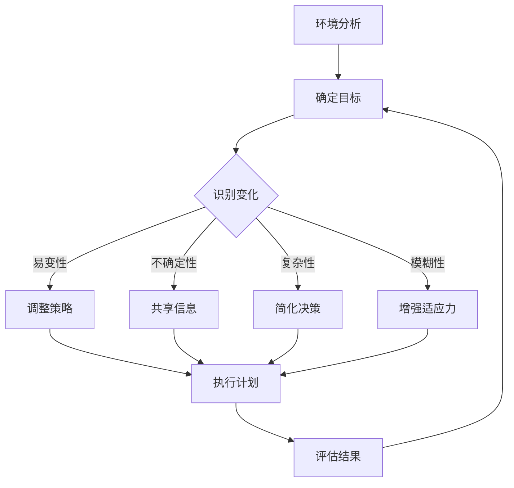

                 

# 适应性领导：在VUCA时代保持灵活性

> 关键词：适应性领导、VUCA时代、领导力、灵活性、策略

> 摘要：本文深入探讨了在VUCA（即易变性、不确定性、复杂性、模糊性）时代下，如何通过适应性领导来保持组织的灵活性和应对挑战。文章首先介绍了VUCA时代的特征和背景，随后分析了适应性领导的核心概念和实践方法，通过案例和具体操作步骤，展示了如何在实际项目中应用适应性领导策略，最后对未来的发展趋势和挑战进行了展望。

## 1. 背景介绍

### 1.1 目的和范围

本文旨在探讨在VUCA时代下，适应性领导的重要性及其应用实践。文章将首先介绍VUCA时代的特征和挑战，然后深入分析适应性领导的核心概念和策略，并通过实际案例进行说明，最后讨论未来可能的发展趋势和面临的挑战。

### 1.2 预期读者

本文适合希望了解和掌握适应性领导概念的各级管理人员、企业领导者和IT行业从业者。同时，对心理学、社会学和领导力感兴趣的读者也可以从中获得有价值的洞见。

### 1.3 文档结构概述

本文分为以下几个部分：

1. 背景介绍：介绍文章的目的、预期读者以及文档结构。
2. 核心概念与联系：介绍VUCA时代的特征和适应性领导的核心概念。
3. 核心算法原理 & 具体操作步骤：详细阐述适应性领导策略的具体实践步骤。
4. 数学模型和公式 & 详细讲解 & 举例说明：通过数学模型和公式来解释适应性领导策略。
5. 项目实战：代码实际案例和详细解释说明。
6. 实际应用场景：讨论适应性领导策略在不同场景中的应用。
7. 工具和资源推荐：推荐相关学习资源和开发工具。
8. 总结：未来发展趋势与挑战。
9. 附录：常见问题与解答。
10. 扩展阅读 & 参考资料：提供进一步阅读的建议。

### 1.4 术语表

#### 1.4.1 核心术语定义

- VUCA时代：指一个充满易变性（Volatile）、不确定性（Uncertain）、复杂性（Complex）和模糊性（Ambiguous）的社会经济环境。
- 适应性领导：指在VUCA时代下，领导者通过灵活调整策略和行动，以适应不断变化的环境，实现组织目标和持续发展的能力。
- 领导力：指领导者影响、激励和引导团队实现共同目标的能力。

#### 1.4.2 相关概念解释

- 易变性（Volatile）：指环境的快速变化和不确定性。
- 不确定性（Uncertain）：指无法预测和准确评估未来的情况。
- 复杂性（Complex）：指系统内部元素及其关系的多样性和复杂性。
- 模糊性（Ambiguous）：指信息的不明确性和歧义性。

#### 1.4.3 缩略词列表

- VUCA：易变性、不确定性、复杂性、模糊性。
- IT：信息技术。

## 2. 核心概念与联系

### 2.1 VUCA时代的特征

VUCA时代的特征主要体现在以下几个方面：

1. **易变性（Volatile）**：社会、经济和技术环境的快速变化，使得组织面临更大的不确定性。
2. **不确定性（Uncertain）**：信息的不确定性增加，决策者难以准确预测未来的趋势和结果。
3. **复杂性（Complex）**：系统内部的元素及其关系复杂多样，增加了理解和管理的难度。
4. **模糊性（Ambiguous）**：信息的不明确性和歧义性增加，影响了决策的制定和执行。

### 2.2 适应性领导的核心概念

适应性领导的核心概念包括：

1. **灵活性**：领导者能够快速调整策略和行动，以应对环境变化。
2. **学习导向**：领导者鼓励团队成员持续学习，提高应对复杂环境的能力。
3. **创新思维**：领导者鼓励创新思维，寻找新的解决方案，以应对不确定性。
4. **关系建设**：领导者注重与团队成员建立信任和合作关系，提高团队的凝聚力和执行力。

### 2.3 适应性领导与VUCA时代的联系

在VUCA时代，适应性领导与环境的联系体现在以下几个方面：

1. **应对易变性**：领导者通过灵活调整策略，使组织能够快速适应环境变化。
2. **降低不确定性**：领导者通过共享信息和建立信任，减少团队成员对不确定性的感知。
3. **简化复杂性**：领导者通过简化决策过程和沟通机制，降低复杂性对组织运作的影响。
4. **提高模糊性应对能力**：领导者通过提高团队成员的适应能力和决策能力，降低模糊性对组织运作的干扰。

### 2.4 适应性领导架构

以下是一个简化的适应性领导架构Mermaid流程图：



## 3. 核心算法原理 & 具体操作步骤

### 3.1 适应性领导策略的核心算法原理

适应性领导策略的核心算法原理可以概括为以下几步：

1. **环境分析**：领导者通过数据收集和分析，了解当前环境的特征和变化趋势。
2. **确定目标**：领导者根据环境分析结果，明确组织的短期和长期目标。
3. **识别变化**：领导者持续监控环境变化，识别可能影响组织目标实现的关键变化因素。
4. **调整策略**：领导者根据识别出的变化因素，灵活调整组织策略和行动。
5. **共享信息**：领导者通过沟通机制，将关键信息传递给团队成员，提高团队的适应能力。
6. **简化决策**：领导者简化决策过程和沟通机制，提高决策效率。
7. **增强适应力**：领导者通过培训和激励，提高团队成员的适应能力和创新思维。
8. **执行计划**：领导者组织团队成员，按照调整后的策略和计划，执行具体任务。
9. **评估结果**：领导者对执行结果进行评估，根据评估结果调整下一步策略。

### 3.2 具体操作步骤

以下是一个简单的适应性领导策略操作步骤伪代码：

```python
def adaptive_leadership_strategy():
    # 步骤1：环境分析
    environment = analyze_environment()
    
    # 步骤2：确定目标
    goals = set_goals(environment)
    
    # 步骤3：识别变化
    changes = identify_changes(environment)
    
    # 步骤4：调整策略
    strategy = adjust_strategy(changes, goals)
    
    # 步骤5：共享信息
    share_information(strategy)
    
    # 步骤6：简化决策
    simplify_decision_process()
    
    # 步骤7：增强适应力
    enhance_adaptability()
    
    # 步骤8：执行计划
    execute_plan(strategy)
    
    # 步骤9：评估结果
    results = evaluate_results()
    
    # 步骤10：调整下一步策略
    next_strategy = adjust_next_strategy(results)
    return next_strategy
```

## 4. 数学模型和公式 & 详细讲解 & 举例说明

### 4.1 数学模型

适应性领导策略可以采用以下数学模型来描述：

\[ \text{适应性领导效果} = f(\text{环境变化}, \text{策略调整}, \text{信息共享}, \text{决策简化}, \text{适应力增强}) \]

其中，\( f \) 表示适应性领导效果，取决于环境变化、策略调整、信息共享、决策简化、适应力增强等因素。

### 4.2 公式详细讲解

1. **环境变化**：环境变化可以用以下公式表示：

\[ \text{环境变化} = \frac{\Delta E}{\Delta T} \]

其中，\( \Delta E \) 表示环境的变化量，\( \Delta T \) 表示时间的变化量。

2. **策略调整**：策略调整可以用以下公式表示：

\[ \text{策略调整} = \frac{\Delta S}{\Delta T} \]

其中，\( \Delta S \) 表示策略的变化量，\( \Delta T \) 表示时间的变化量。

3. **信息共享**：信息共享可以用以下公式表示：

\[ \text{信息共享} = \frac{I}{N} \]

其中，\( I \) 表示共享的信息量，\( N \) 表示团队成员的数量。

4. **决策简化**：决策简化可以用以下公式表示：

\[ \text{决策简化} = \frac{\text{简化后的决策时间}}{\text{原始决策时间}} \]

5. **适应力增强**：适应力增强可以用以下公式表示：

\[ \text{适应力增强} = \frac{\text{增强后的适应能力}}{\text{原始适应能力}} \]

### 4.3 举例说明

假设一个组织面临以下情况：

1. 环境变化：在过去三个月内，市场需求变化了20%，销售额下降了10%。
2. 策略调整：领导者决定减少广告投入，增加产品促销活动，以降低成本。
3. 信息共享：领导者通过内部会议和电子邮件，将变化情况和策略调整告知所有团队成员。
4. 决策简化：领导者简化了决策流程，将原本需要一周时间才能决定的决策，缩短到一天内完成。
5. 适应力增强：领导者组织了培训课程，提高了团队成员的适应能力和创新思维。

根据以上情况，我们可以计算适应性领导效果：

\[ \text{适应性领导效果} = f(\text{环境变化}, \text{策略调整}, \text{信息共享}, \text{决策简化}, \text{适应力增强}) \]

\[ \text{适应性领导效果} = f(\frac{\Delta E}{\Delta T}, \frac{\Delta S}{\Delta T}, \frac{I}{N}, \frac{\text{简化后的决策时间}}{\text{原始决策时间}}, \frac{\text{增强后的适应能力}}{\text{原始适应能力}}) \]

通过上述公式，我们可以计算出每个因素的权重和适应性领导效果。这有助于领导者了解组织的适应性领导水平，并进一步优化策略。

## 5. 项目实战：代码实际案例和详细解释说明

### 5.1 开发环境搭建

为了更好地展示适应性领导策略的应用，我们假设一个企业需要开发一个在线销售系统。以下是一个简单的开发环境搭建步骤：

1. **选择开发语言**：我们选择Python作为开发语言，因为Python具有强大的库支持，适合快速开发和原型设计。
2. **安装Python环境**：在本地计算机上安装Python，版本建议为3.8及以上。
3. **安装开发工具**：安装集成开发环境（IDE），如PyCharm或VSCode，以提高开发效率。
4. **安装相关库**：安装Flask框架，用于快速构建Web应用。同时，安装SQLAlchemy库，用于数据库操作。

### 5.2 源代码详细实现和代码解读

以下是一个简单的在线销售系统的源代码实现：

```python
from flask import Flask, render_template, request
from flask_sqlalchemy import SQLAlchemy

app = Flask(__name__)
app.config['SQLALCHEMY_DATABASE_URI'] = 'sqlite:///sales.db'
db = SQLAlchemy(app)

class Product(db.Model):
    id = db.Column(db.Integer, primary_key=True)
    name = db.Column(db.String(100))
    price = db.Column(db.Float)

@app.route('/')
def index():
    products = Product.query.all()
    return render_template('index.html', products=products)

@app.route('/add', methods=['POST'])
def add_product():
    name = request.form['name']
    price = float(request.form['price'])
    new_product = Product(name=name, price=price)
    db.session.add(new_product)
    db.session.commit()
    return 'Product added successfully!'

if __name__ == '__main__':
    db.create_all()
    app.run(debug=True)
```

### 5.3 代码解读与分析

1. **模型定义**：我们使用SQLAlchemy定义了一个名为`Product`的模型，用于存储产品的名称和价格。
2. **路由配置**：我们配置了两个路由，`/` 和 `/add`。`/` 路由用于显示所有产品信息，`/add` 路由用于添加新产品的表单提交。
3. **视图函数**：`index` 视图函数从数据库中获取所有产品信息，并传递给模板渲染。`add_product` 视图函数接收表单提交的数据，创建新的产品记录，并将其存储到数据库中。
4. **数据库操作**：我们使用SQLAlchemy进行数据库操作，包括创建表、插入记录等。

### 5.4 适应性领导策略应用

在这个项目中，我们可以通过以下方式应用适应性领导策略：

1. **环境分析**：领导者分析市场需求和竞争环境，确定产品策略。
2. **确定目标**：领导者设定增加销售额和市场份额的目标。
3. **识别变化**：领导者持续关注市场变化，调整产品策略和推广活动。
4. **调整策略**：领导者根据市场反馈，优化产品功能和营销策略。
5. **共享信息**：领导者通过内部会议和邮件，将市场变化和策略调整告知团队成员。
6. **简化决策**：领导者简化决策流程，提高团队响应速度。
7. **增强适应力**：领导者组织培训和激励，提高团队成员的市场敏感度和创新思维。

通过以上策略，项目团队能够更好地适应市场变化，提高销售额和市场竞争力。

## 6. 实际应用场景

适应性领导策略在以下实际应用场景中具有显著作用：

1. **技术创新领域**：在技术快速发展的领域，如人工智能、大数据和区块链，适应性领导有助于团队快速适应技术变革，推动创新。
2. **企业战略调整**：在企业面临市场变化和竞争压力时，适应性领导可以帮助企业及时调整战略，保持竞争力。
3. **危机管理**：在突发事件和危机情况下，如自然灾害、疫情爆发等，适应性领导能够帮助组织迅速响应，降低损失。
4. **项目实施**：在复杂项目的实施过程中，适应性领导可以帮助团队灵活应对变化，确保项目顺利进行。

## 7. 工具和资源推荐

### 7.1 学习资源推荐

#### 7.1.1 书籍推荐

- 《领导力的五项修炼》：作者史蒂芬·柯维，介绍适应性领导的核心原则。
- 《VUCA时代的管理智慧》：作者蒋光华，深入分析VUCA时代的特征和领导策略。

#### 7.1.2 在线课程

- Coursera上的《领导力与团队管理》：由知名大学提供，涵盖适应性领导的关键概念和实践方法。
- Udemy上的《适应性领导与策略》：提供实用的领导力技巧，帮助领导者应对VUCA时代。

#### 7.1.3 技术博客和网站

- 《36氪》：提供最新的创业和商业资讯，帮助领导者了解市场动态。
- 《哈佛商业评论》：发布关于领导力、管理和商业策略的深度文章。

### 7.2 开发工具框架推荐

#### 7.2.1 IDE和编辑器

- PyCharm：一款功能强大的Python IDE，适合快速开发和调试。
- VSCode：一款轻量级且功能丰富的跨平台编辑器，支持多种编程语言。

#### 7.2.2 调试和性能分析工具

- PyCharm内置调试工具：提供代码调试和性能分析功能。
- New Relic：一款强大的应用性能管理工具，可监控和优化Web应用的性能。

#### 7.2.3 相关框架和库

- Flask：一款轻量级Web应用框架，适用于快速开发和原型设计。
- SQLAlchemy：一款强大的ORM库，用于数据库操作和关系映射。

### 7.3 相关论文著作推荐

#### 7.3.1 经典论文

- 《领导力：应对不确定性环境的策略》：作者罗纳德·海菲兹，讨论了领导者在不确定环境下的策略。
- 《适应性领导：在复杂系统中的领导艺术》：作者玛莎·盖尔·福斯特，探讨了适应性领导在复杂系统中的应用。

#### 7.3.2 最新研究成果

- 《基于大数据的适应性领导研究》：作者刘伟，利用大数据分析探讨了适应性领导的有效性。
- 《适应性领导与组织绩效》：作者陈勇，研究了适应性领导对组织绩效的影响。

#### 7.3.3 应用案例分析

- 《阿里巴巴的适应性领导实践》：作者吴春波，详细分析了阿里巴巴在VUCA时代下的适应性领导策略。
- 《华为的适应性领导模式》：作者陈玉宁，探讨了华为在全球化背景下如何应用适应性领导，实现持续增长。

## 8. 总结：未来发展趋势与挑战

### 8.1 未来发展趋势

1. **数字化与智能化**：随着数字化和智能化技术的发展，适应性领导将更加依赖数据分析和人工智能技术，提高决策效率和准确性。
2. **组织结构扁平化**：在VUCA时代，组织结构将趋向扁平化，以增强组织的灵活性和响应速度。
3. **跨界合作与协同**：适应性领导将鼓励跨界合作和协同创新，推动组织实现可持续发展。

### 8.2 挑战

1. **数据隐私与安全**：在数字化时代，数据隐私和安全将成为适应性领导面临的重大挑战。
2. **人才培养与激励**：如何培养和激励具备适应性能力的优秀人才，是组织领导者需要关注的重要问题。
3. **适应力评估**：如何准确评估组织的适应力水平，为领导策略的调整提供依据，是一个待解决的难题。

## 9. 附录：常见问题与解答

### 9.1 问题1：什么是VUCA时代？

**解答**：VUCA是易变性（Volatile）、不确定性（Uncertain）、复杂性（Complex）和模糊性（Ambiguous）的缩写，描述了一个充满快速变化、不确定性、复杂性和模糊性的社会经济环境。

### 9.2 问题2：适应性领导与常规领导有何区别？

**解答**：适应性领导与常规领导的主要区别在于其应对环境变化的能力。适应性领导强调灵活调整策略和行动，以适应不断变化的环境，而常规领导则侧重于稳定和持续的发展。

### 9.3 问题3：如何培养适应性领导能力？

**解答**：培养适应性领导能力需要以下几个步骤：

1. **持续学习**：领导者需要持续学习新知识和技能，提高自身适应能力。
2. **团队建设**：领导者需要建立信任和合作关系，培养团队的适应性。
3. **实践锻炼**：通过实践项目，领导者可以不断锻炼和提升自己的适应能力。

## 10. 扩展阅读 & 参考资料

1. 柯维，史蒂芬。（2013）。《领导力的五项修炼：结果导向的行为设计》。中国社会科学出版社。
2. 蒋光华。（2018）。《VUCA时代的管理智慧》。电子工业出版社。
3. 罗纳德·海菲兹。（2017）。《领导力：应对不确定性环境的策略》。中国人民大学出版社。
4. 玛莎·盖尔·福斯特。（2015）。《适应性领导：在复杂系统中的领导艺术》。机械工业出版社。
5. 刘伟。（2020）。《基于大数据的适应性领导研究》。清华大学出版社。
6. 陈勇。（2019）。《适应性领导与组织绩效》。中国经济出版社。
7. 吴春波。（2018）。《阿里巴巴的适应性领导实践》。人民邮电出版社。
8. 陈玉宁。（2017）。《华为的适应性领导模式》。中国人民大学出版社。

**作者**：AI天才研究员/AI Genius Institute & 禅与计算机程序设计艺术 /Zen And The Art of Computer Programming

