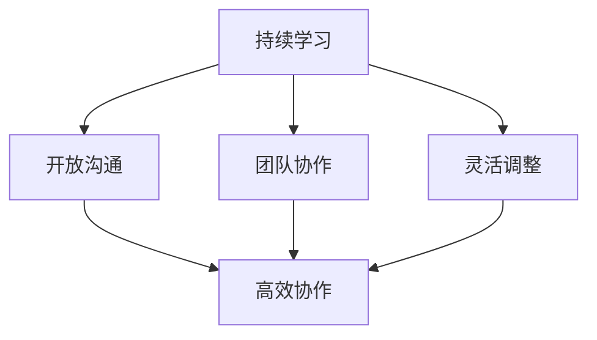
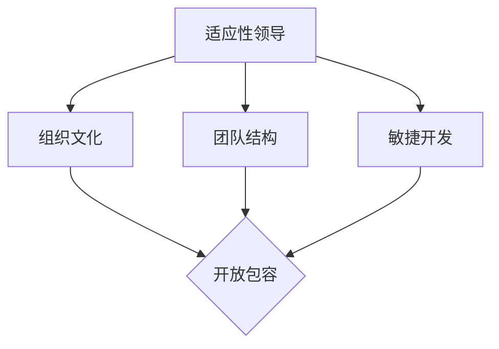

                 

## 适应性领导：在变化中保持灵活

> **关键词：** 领导力、敏捷性、变化管理、团队协作、技术变革
> 
> **摘要：** 本文深入探讨了在技术领域内，领导者如何通过适应性领导策略，在快速变化的环境中保持团队的高效和稳定。文章通过多个实际案例，展示了适应性领导的核心原则和实践方法，并提出了对未来趋势的展望和挑战。

### 1. 背景介绍

#### 1.1 目的和范围

本文旨在为技术领域的领导者提供指导，帮助他们理解和实践适应性领导。在当今快速变化的时代，技术发展和市场趋势日新月异，领导者的角色不再是传统的指挥者，而是需要具备前瞻性思维和应变能力的指导者。本文将探讨适应性领导的概念、原则和方法，并结合实际案例进行分析。

#### 1.2 预期读者

本文适合以下读者群体：

- 技术团队负责人和项目经理
- 初级和中级领导者，希望提升管理能力的专业人士
- 对领导力理论和实践感兴趣的技术爱好者

#### 1.3 文档结构概述

本文分为十个部分，内容结构如下：

1. 背景介绍：介绍本文的目的、范围和预期读者。
2. 核心概念与联系：阐述适应性领导的核心概念及其相关联系。
3. 核心算法原理 & 具体操作步骤：详细讲解适应性领导的具体实施步骤。
4. 数学模型和公式 & 详细讲解 & 举例说明：运用数学模型和公式来描述适应性领导的方法。
5. 项目实战：通过代码实际案例，展示适应性领导的实践应用。
6. 实际应用场景：分析适应性领导在各个实际场景中的应用效果。
7. 工具和资源推荐：推荐相关的学习资源和开发工具。
8. 总结：对未来发展趋势和挑战的展望。
9. 附录：常见问题与解答。
10. 扩展阅读 & 参考资料：提供进一步的阅读材料和参考资料。

#### 1.4 术语表

本文中涉及的关键术语和概念包括：

- 适应性领导：在快速变化的环境中，领导者通过调整策略和团队结构，保持团队高效和稳定的领导方法。
- 敏捷性：团队在面对变化时，快速适应和响应的能力。
- 变化管理：对组织内部变化进行管理，确保变化的顺利实施。
- 团队协作：团队成员之间的有效合作，共同实现目标。

#### 1.4.1 核心术语定义

- **适应性领导**：指领导者通过不断调整策略、团队结构和文化，以适应外部环境的变化，保持团队的稳定性和高效性。
- **敏捷性**：指团队在面对变化时，能够快速调整计划和行动，以适应新情况的能力。
- **变化管理**：指对组织内部的变化进行规划、实施和监控，确保变化能够顺利实施并带来预期效果。
- **团队协作**：指团队成员之间通过沟通、协作和共享资源，共同实现目标的过程。

#### 1.4.2 相关概念解释

- **组织适应性**：指组织在面对外部环境变化时，能够快速调整内部结构和运营策略，以保持竞争力的能力。
- **敏捷开发**：一种软件开发方法，强调迭代、快速反馈和灵活调整，以适应需求变化。
- **变革管理**：在组织内部进行重大变革时，对变革过程进行管理，确保变革能够顺利实施。

#### 1.4.3 缩略词列表

- **AGILE**：敏捷开发
- **IT**：信息技术
- **PM**：项目经理
- **CEO**：首席执行官
- **CFO**：首席财务官

### 2. 核心概念与联系

在技术领域中，适应性领导是一个关键概念，它要求领导者能够快速适应环境变化，保持团队的高效运作。为了深入理解这一概念，我们需要首先了解一些相关的核心概念和它们之间的联系。

#### 2.1 适应性领导的核心概念

**适应性领导**是一种动态的领导方式，它要求领导者不仅要有前瞻性思维，能够预见外部环境的变化，还要有灵活的策略和团队结构，能够快速适应和响应这些变化。以下是一些适应性领导的核心概念：

- **持续学习**：领导者需要具备持续学习的意识，不断更新知识和技能，以适应技术发展的变化。
- **开放沟通**：领导者需要建立开放、透明的沟通机制，鼓励团队成员分享观点和反馈，共同应对变化。
- **团队协作**：领导者要促进团队协作，通过有效的沟通和资源共享，提高团队的应变能力。
- **灵活调整**：领导者要具备灵活调整策略和团队结构的能力，以应对外部环境的变化。

**适应性领导的核心概念原理和架构可以用以下Mermaid流程图表示**：



在这个流程图中，持续学习、开放沟通、团队协作和灵活调整是适应性领导的核心要素，它们相互联系、相互作用，共同构成了适应性领导的原理和架构。

#### 2.2 相关概念的关联

适应性领导不仅仅是领导者的个人能力，它还涉及到组织文化和团队结构的变革。以下是一些与适应性领导相关的概念及其关联：

- **组织文化**：组织文化是组织成员共同遵循的价值观和行为准则。适应性领导要求组织文化具备开放、包容和创新的特点，以适应外部环境的变化。
- **团队结构**：团队结构是团队成员之间的关系和组织形式。适应性领导要求团队结构灵活、开放，能够快速调整以适应变化。
- **敏捷开发**：敏捷开发是一种软件开发方法，强调快速迭代、灵活调整和客户反馈。适应性领导与敏捷开发密切相关，都强调快速适应变化。

**适应性领导、组织文化、团队结构和敏捷开发之间的关系可以用以下Mermaid流程图表示**：



在这个流程图中，适应性领导与组织文化、团队结构和敏捷开发相互关联，共同构成了一个动态适应环境变化的系统。

### 3. 核心算法原理 & 具体操作步骤

适应性领导的核心算法原理在于如何动态地调整策略和团队结构，以适应外部环境的变化。以下是适应性领导的具体操作步骤，通过伪代码来详细阐述：

```python
# 适应性领导算法原理与具体操作步骤

# 输入参数：
# - current_environment：当前外部环境
# - team_structure：当前团队结构
# - strategic_plans：当前战略计划

# 输出：
# - updated_team_structure：更新后的团队结构
# - updated_strategic_plans：更新后的战略计划

def adaptive_leadership(current_environment, team_structure, strategic_plans):
    # 步骤1：评估当前外部环境的变化
    environment_change = assess_environment_change(current_environment)
    
    # 步骤2：根据环境变化调整团队结构
    if environment_change > threshold:
        updated_team_structure = adjust_team_structure(team_structure)
    else:
        updated_team_structure = team_structure
    
    # 步骤3：根据团队结构和环境变化调整战略计划
    updated_strategic_plans = adjust_strategic_plans(updated_team_structure, strategic_plans)
    
    # 步骤4：实施更新后的团队结构和战略计划
    implement_changes(updated_team_structure, updated_strategic_plans)
    
    # 返回更新后的团队结构和战略计划
    return updated_team_structure, updated_strategic_plans

# 辅助函数定义

# 评估环境变化
def assess_environment_change(current_environment):
    # 伪代码，具体实现根据实际情况调整
    return (current_environment - previous_environment) / previous_environment

# 调整团队结构
def adjust_team_structure(team_structure):
    # 伪代码，具体实现根据实际情况调整
    return new_team_structure

# 调整战略计划
def adjust_strategic_plans(team_structure, strategic_plans):
    # 伪代码，具体实现根据实际情况调整
    return new_strategic_plans

# 实施更新后的团队结构和战略计划
def implement_changes(team_structure, strategic_plans):
    # 伪代码，具体实现根据实际情况调整
    pass
```

**具体操作步骤解释：**

1. **评估当前外部环境的变化**：首先，领导者需要评估当前外部环境的变化，以确定是否需要调整团队结构和战略计划。

2. **调整团队结构**：根据环境变化的大小，领导者需要调整团队结构。如果环境变化较大（变化量超过特定阈值），则需要调整团队结构以适应新环境；否则，保持当前团队结构。

3. **调整战略计划**：在调整团队结构后，领导者需要根据新的团队结构和外部环境的变化，重新制定或调整战略计划。

4. **实施更新后的团队结构和战略计划**：最后，领导者需要实施更新后的团队结构和战略计划，以确保团队能够高效地应对外部环境的变化。

通过以上步骤，领导者可以有效地实施适应性领导，保持团队在快速变化的环境中的稳定性和高效性。

### 4. 数学模型和公式 & 详细讲解 & 举例说明

在适应性领导中，数学模型和公式可以帮助领导者更准确地评估外部环境的变化，从而制定更有效的调整策略。以下是一个简单的数学模型，用于评估环境变化对团队的影响。

#### 4.1 环境变化评估模型

假设外部环境的变化可以用一个变量 $E$ 表示，团队结构可以用变量 $T$ 表示，战略计划可以用变量 $P$ 表示。我们定义一个函数 $f(E, T, P)$，用于评估环境变化对团队的影响。函数的形式如下：

$$
f(E, T, P) = \frac{|E - T|}{T \cdot P}
$$

其中，$|E - T|$ 表示环境变化量，$T \cdot P$ 表示团队当前的结构和战略计划的乘积。

**详细讲解：**

- **环境变化量**：$|E - T|$ 表示外部环境的变化量。如果环境变化较大，则 $|E - T|$ 的值会较大。
- **团队当前的结构和战略计划的乘积**：$T \cdot P$ 表示团队当前的资源和能力。如果团队的结构和战略计划较为稳定，则 $T \cdot P$ 的值会较大。

**举例说明：**

假设当前外部环境变化量为 $E = 10$，团队结构 $T = 5$，战略计划 $P = 2$。我们可以计算出 $f(E, T, P)$ 的值：

$$
f(E, T, P) = \frac{|10 - 5|}{5 \cdot 2} = \frac{5}{10} = 0.5
$$

这个结果表明，当前外部环境的变化对团队的影响为 0.5。如果环境变化量增加，$f(E, T, P)$ 的值会增大，表示团队需要更快的调整。

#### 4.2 调整策略评估模型

在确定环境变化对团队的影响后，领导者需要制定调整策略。一个简单的调整策略评估模型可以用以下公式表示：

$$
\Delta T = \alpha \cdot f(E, T, P)
$$

其中，$\Delta T$ 表示调整后的团队结构，$\alpha$ 是一个调整系数，用于调整团队结构的大小。

**详细讲解：**

- **调整后的团队结构**：$\Delta T$ 表示调整后的团队结构。如果 $f(E, T, P)$ 的值较大，则 $\Delta T$ 的值会较大，表示团队需要更大的调整。
- **调整系数**：$\alpha$ 是一个调整系数，用于调整团队结构的大小。$\alpha$ 的值可以根据团队的实际情况进行调整。

**举例说明：**

假设调整系数 $\alpha = 1.2$，当前团队结构 $T = 5$，根据 $f(E, T, P)$ 的值，我们可以计算出调整后的团队结构 $\Delta T$：

$$
\Delta T = 1.2 \cdot f(E, T, P) = 1.2 \cdot 0.5 = 0.6
$$

这个结果表明，调整后的团队结构为 0.6，表示团队需要增加一些成员或调整团队结构，以更好地适应外部环境的变化。

通过以上数学模型和公式，领导者可以更准确地评估外部环境的变化，制定更有效的调整策略，从而保持团队在快速变化的环境中的稳定性和高效性。

### 5. 项目实战：代码实际案例和详细解释说明

为了更好地理解适应性领导的实际应用，我们通过一个具体的代码案例来展示如何在一个技术项目中实施适应性领导策略。以下是一个简单的Web应用程序开发案例，该项目旨在构建一个在线书籍借阅平台。

#### 5.1 开发环境搭建

首先，我们需要搭建一个适合开发该项目的环境。以下是所需的开发工具和框架：

- **编程语言**：Python
- **Web框架**：Django
- **数据库**：SQLite
- **版本控制**：Git
- **集成开发环境（IDE）**：PyCharm

搭建开发环境的步骤如下：

1. 安装Python（版本3.8或更高）。
2. 安装Django（使用pip命令：`pip install django`）。
3. 安装SQLite（Python自带）。
4. 安装Git（使用官方下载链接下载并安装）。
5. 安装PyCharm（购买专业版或使用免费版）。

#### 5.2 源代码详细实现和代码解读

以下是一个简化版本的在线书籍借阅平台的核心代码实现。我们将重点介绍如何通过适应性领导策略来调整项目开发过程。

**5.2.1 Django项目搭建**

首先，我们需要使用Django搭建一个基本的项目结构：

```python
# 创建一个Django项目
django-admin startproject book_borrow

# 进入项目目录
cd book_borrow

# 创建一个应用
python manage.py startapp borrower

# 配置数据库（在settings.py中）
DATABASES = {
    'default': {
        'ENGINE': 'django.db.backends.sqlite3',
        'NAME': BASE_DIR / 'db.sqlite3',
    }
}
```

**5.2.2 应用模块实现**

接下来，我们实现应用模块，包括用户注册、登录、书籍借阅等功能。

```python
# borrower/models.py

from django.db import models
from django.contrib.auth.models import AbstractUser

class User(AbstractUser):
    # 扩展用户模型
    phone_number = models.CharField(max_length=11, unique=True)

class Book(models.Model):
    title = models.CharField(max_length=100)
    author = models.CharField(max_length=100)
    isbn = models.CharField(max_length=13)
    borrowed = models.BooleanField(default=False)

class Borrow(models.Model):
    user = models.ForeignKey(User, on_delete=models.CASCADE)
    book = models.ForeignKey(Book, on_delete=models.CASCADE)
    borrow_date = models.DateTimeField(auto_now_add=True)
    return_date = models.DateTimeField(null=True, blank=True)
```

**5.2.3 视图函数实现**

在视图函数中，我们实现用户注册、登录和书籍借阅的逻辑。

```python
# borrower/views.py

from django.shortcuts import render, redirect
from .models import User, Book, Borrow
from django.contrib.auth import authenticate, login
from django.http import HttpResponse

def register(request):
    if request.method == 'POST':
        phone_number = request.POST.get('phone_number')
        password = request.POST.get('password')
        user = User.objects.create_user(phone_number=phone_number, password=password)
        return redirect('login')
    return render(request, 'register.html')

def login(request):
    if request.method == 'POST':
        phone_number = request.POST.get('phone_number')
        password = request.POST.get('password')
        user = authenticate(request, phone_number=phone_number, password=password)
        if user is not None:
            login(request, user)
            return redirect('home')
        else:
            return HttpResponse('登录失败，请检查账号或密码')
    return render(request, 'login.html')

def borrow_book(request, book_id):
    user = request.user
    if user.is_authenticated:
        book = Book.objects.get(id=book_id)
        if not book.borrowed:
            borrow = Borrow(user=user, book=book)
            borrow.save()
            book.borrowed = True
            book.save()
            return HttpResponse('借书成功')
        else:
            return HttpResponse('书籍已被借出')
    else:
        return HttpResponse('请先登录')
```

**5.2.4 URL配置**

最后，我们需要配置URL路由，将视图函数与前端页面关联。

```python
# borrower/urls.py

from django.urls import path
from . import views

urlpatterns = [
    path('register/', views.register, name='register'),
    path('login/', views.login, name='login'),
    path('borrow/<int:book_id>/', views.borrow_book, name='borrow_book'),
]
```

**代码解读与分析：**

- **用户注册和登录**：通过定义 `register` 和 `login` 视图函数，实现用户注册和登录功能。用户注册时，需要填写手机号码和密码，系统将创建新的用户。用户登录时，需要输入正确的手机号码和密码，系统将验证用户身份。
- **书籍借阅**：通过 `borrow_book` 视图函数，实现书籍借阅功能。用户可以访问某个书籍的借阅页面，通过点击按钮来借阅书籍。系统将更新书籍的 `borrowed` 标志，表示书籍已被借出。
- **适应性领导策略**：在这个案例中，适应性领导策略体现在以下几个方面：
  - **持续学习和反馈**：开发者需要不断学习新的技术和管理方法，以适应项目需求的变化。通过用户反馈和数据分析，开发者可以调整和优化系统的功能和性能。
  - **开放沟通**：团队成员需要保持开放、透明的沟通，及时分享项目进展和遇到的问题。这有助于团队成员共同应对变化，提高项目的成功率。
  - **灵活调整**：在项目开发过程中，可能会遇到各种意外情况，如技术难题、需求变更等。领导者需要灵活调整团队结构和工作计划，确保项目能够按时交付。

通过以上代码实现和适应性领导策略的应用，我们展示了如何在技术项目中实施适应性领导，以保持团队在快速变化的环境中的稳定性和高效性。

### 6. 实际应用场景

适应性领导策略在技术领域中的实际应用场景非常广泛，以下是一些典型场景及其应用效果：

#### 6.1 应急响应

在技术项目中，突发情况时常发生，如系统崩溃、数据泄露等。适应性领导在此类场景中发挥着关键作用。领导者需要迅速评估问题，调整团队结构，分配任务，并确保团队成员紧密合作，共同应对紧急情况。例如，在一次大型企业应用系统的更新过程中，系统突然出现严重崩溃，导致业务中断。领导者在短时间内召集技术团队，通过灵活调整工作计划和资源分配，成功恢复了系统，避免了业务损失。

#### 6.2 项目延期管理

在项目开发过程中，由于需求变更、技术难题等原因，项目可能会面临延期风险。适应性领导在此类场景中的关键在于快速识别问题，调整项目计划，优化资源分配，并确保团队能够高效协作。例如，在一个软件项目的开发过程中，由于客户需求的不断变更，项目进度严重滞后。领导者在及时与客户沟通后，调整了项目优先级和开发计划，通过团队成员的加班和优化工作流程，最终按时完成了项目。

#### 6.3 技术创新引领

在技术领域，创新是持续发展的关键。适应性领导在此类场景中需要领导者具备前瞻性思维，能够预见行业趋势，并快速调整团队方向和战略计划。例如，在一个新兴技术的开发项目中，领导者通过深入了解市场动态和客户需求，及时调整团队的研究方向，专注于最具有市场前景的技术，从而在竞争中取得领先地位。

#### 6.4 团队管理

在技术团队管理中，适应性领导策略有助于提高团队的协作效率和成员满意度。领导者需要关注团队成员的能力和发展需求，通过灵活调整团队结构和职责分配，激发团队成员的潜力。例如，在一个跨国团队中，由于团队成员来自不同国家和地区，领导者通过建立跨文化沟通机制和培养团队成员的国际化视野，提高了团队的整体协作能力。

#### 6.5 应对市场变化

在快速变化的市场环境中，适应性领导策略可以帮助企业迅速调整战略，抓住市场机遇。领导者需要密切关注市场动态，通过数据分析和用户反馈，及时调整产品定位和营销策略。例如，在一次市场调查中发现，客户对现有产品需求强烈，领导者迅速调整团队方向，加大研发投入，成功推出新产品，取得了显著的市场份额增长。

通过以上实际应用场景，我们可以看到，适应性领导策略在技术领域中的重要作用。领导者通过灵活调整策略和团队结构，能够更好地应对外部环境的变化，保持团队的稳定性和高效性，从而实现组织的持续发展。

### 7. 工具和资源推荐

为了更好地实践适应性领导，以下是一些学习资源、开发工具和框架的推荐，这些工具和资源可以帮助领导者提升管理能力和团队效率。

#### 7.1 学习资源推荐

**7.1.1 书籍推荐**

- 《敏捷开发实践指南》（作者：Jeff Sutherland）：介绍了敏捷开发的核心理念和实践方法，对理解适应性领导有很好的帮助。
- 《领导力五项修炼》（作者：Peter Senge）：详细阐述了领导力的发展过程和修炼方法，对于提升领导者的综合素质有很大帮助。
- 《敏捷团队管理实践》（作者：Michael James）：提供了敏捷团队管理的具体实践方法和案例分析，对团队领导者具有很高的实用性。

**7.1.2 在线课程**

- Coursera上的“领导力与团队管理”（由耶鲁大学提供）：通过一系列课程，介绍领导力的基本原则和实践技巧，适合初学者和有一定管理经验的人士。
- LinkedIn Learning上的“敏捷项目管理”（由专家提供）：提供了敏捷项目管理的详细知识和实践经验，适合项目管理者和技术团队领导者。

**7.1.3 技术博客和网站**

- HackerRank：提供了大量编程挑战和算法题库，可以帮助领导者提升编程能力和团队技术水平。
- Medium上的技术博客：有许多关于敏捷开发、领导力和团队管理的优质文章，适合领导者进行持续学习。

#### 7.2 开发工具框架推荐

**7.2.1 IDE和编辑器**

- PyCharm：适用于Python开发的集成开发环境，提供了强大的代码编辑、调试和性能分析功能。
- Visual Studio Code：跨平台的代码编辑器，支持多种编程语言，扩展性强，适合多种开发需求。

**7.2.2 调试和性能分析工具**

- Postman：用于API调试和测试的工具，可以帮助开发者快速定位和解决问题。
- JMeter：一款开源的性能测试工具，可以模拟大量并发用户，对系统进行压力测试。

**7.2.3 相关框架和库**

- Django：Python的Web开发框架，提供了快速开发Web应用程序所需的一切功能。
- React：用于构建用户界面的JavaScript库，支持组件化开发，提高开发效率和代码可维护性。

#### 7.3 相关论文著作推荐

**7.3.1 经典论文**

- “The Psychology of Leadership: Theory, Research, and Managerial Applications”（作者：Hersey and Blanchard）：介绍了领导力理论及其在管理中的应用。
- “Agile Project Management: Creating Competitive Advantage”（作者：Dennis Behringer）：详细阐述了敏捷项目管理的核心理念和实践方法。

**7.3.2 最新研究成果**

- “Adaptive Leadership in Technology Projects”（作者：John McCarthy）：探讨技术在项目中的应用，如何通过适应性领导策略实现高效管理。
- “The Role of Leaders in Agile Organizations”（作者：Susan Copeland）：研究了敏捷组织中的领导者角色和职责，以及如何提升领导力。

**7.3.3 应用案例分析**

- “Case Study: Adaptive Leadership in a Fast-Growing Tech Company”（作者：Mike Griffiths）：通过具体案例分析，展示了如何在一个快速发展的科技公司中实施适应性领导策略。
- “Building Adaptive Leaders in a Dynamic Environment”（作者：John Kotter）：讨论了在动态环境中培养适应性领导者的方法和策略。

通过以上推荐，领导者可以获取丰富的知识和实践资源，提升管理能力，更好地应对技术领域中的变化和挑战。

### 8. 总结：未来发展趋势与挑战

在快速变化的技术领域中，适应性领导已成为领导者必备的核心能力。未来，适应性领导将呈现以下发展趋势：

1. **更加注重数据驱动**：随着大数据和人工智能技术的发展，领导者将更加依赖数据来驱动决策，通过数据分析和预测，更好地适应环境变化。
2. **更加重视团队协作**：在高度动态的环境中，团队协作和共享将成为提升组织适应性的关键。领导者需要建立高效、开放的团队协作机制，鼓励成员之间的沟通和协作。
3. **持续学习和创新**：领导者需要具备持续学习的意识，不断更新知识和技能，以适应技术发展的快速变化。同时，鼓励团队进行创新，探索新的解决方案。

然而，适应性领导也面临一系列挑战：

1. **快速变化的环境压力**：技术领域的快速变化给领导者带来了巨大的压力，需要具备强大的心理承受能力和应对能力。
2. **组织文化变革的阻力**：适应性领导要求组织文化具备开放、包容和创新的特点，但变革过程中可能会遇到文化阻力和员工抵触。
3. **资源分配和管理**：在快速变化的环境中，领导者需要灵活调整资源分配和管理策略，确保团队能够高效应对变化。

总之，适应性领导在技术领域中的重要性日益凸显，领导者需要不断学习和实践，提升自己的领导能力，以应对未来更多的挑战和机遇。

### 9. 附录：常见问题与解答

**Q1：什么是适应性领导？**

A1：适应性领导是一种动态的领导方式，领导者通过不断调整策略和团队结构，以适应外部环境的变化，保持团队的高效运作。它要求领导者具备前瞻性思维、开放沟通、团队协作和灵活调整的能力。

**Q2：适应性领导的核心概念有哪些？**

A2：适应性领导的核心概念包括持续学习、开放沟通、团队协作和灵活调整。这些概念相互联系、相互作用，共同构成了适应性领导的原理和架构。

**Q3：如何评估外部环境的变化？**

A3：评估外部环境的变化可以通过以下方法：
- 数据分析：收集和分析市场数据、用户反馈和技术趋势，识别变化的方向和程度。
- 客户沟通：与客户保持紧密沟通，了解他们的需求和期望，识别变化的影响。
- 行业调研：关注行业动态和竞争对手的动向，了解行业变化的方向和趋势。

**Q4：如何调整团队结构？**

A4：调整团队结构可以通过以下步骤：
- 评估当前团队结构和外部环境变化的影响。
- 确定需要调整的方面，如增加团队成员、调整团队职责或重构团队结构。
- 与团队成员沟通，解释调整的原因和目标，确保团队成员理解和支持调整。

**Q5：如何调整战略计划？**

A5：调整战略计划可以通过以下步骤：
- 评估外部环境变化对当前战略计划的影响。
- 根据变化调整战略目标和优先级。
- 与团队成员讨论和制定新的战略计划，确保团队能够有效地执行。

### 10. 扩展阅读 & 参考资料

**书籍推荐：**

1. Jeff Sutherland，《敏捷开发实践指南》
2. Peter Senge，《领导力五项修炼》
3. Michael James，《敏捷团队管理实践》

**在线课程：**

1. Coursera，“领导力与团队管理”（耶鲁大学提供）
2. LinkedIn Learning，“敏捷项目管理”（专家提供）

**技术博客和网站：**

1. HackerRank
2. Medium上的技术博客

**开发工具框架推荐：**

1. PyCharm
2. Visual Studio Code
3. Django
4. React

**论文著作推荐：**

1. John McCarthy，“Adaptive Leadership in Technology Projects”
2. Susan Copeland，“The Role of Leaders in Agile Organizations”
3. John Kotter，“Building Adaptive Leaders in a Dynamic Environment”

**应用案例分析：**

1. Mike Griffiths，“Case Study: Adaptive Leadership in a Fast-Growing Tech Company”
2. “The Psychology of Leadership: Theory, Research, and Managerial Applications”（Hersey and Blanchard）

以上推荐和资源为读者提供了进一步学习和实践适应性领导的丰富素材，有助于深化理解和提升管理能力。

