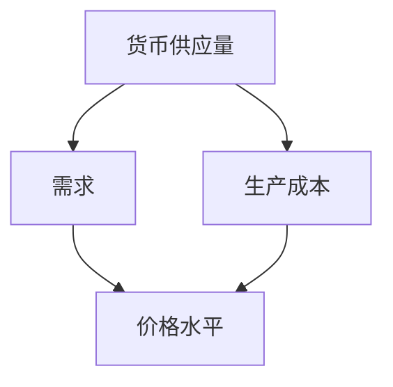

                 

# 通胀高企的经济影响分析

> **关键词：通货膨胀、经济影响、消费者行为、货币政策、投资策略、金融市场**

> **摘要：本文深入探讨了通胀高企对经济各领域的影响，从消费者行为、货币政策到投资策略，详细分析了通货膨胀所带来的经济挑战和应对措施。通过具体案例和数学模型，本文为读者提供了全面的理解和实用的指导。**

## 1. 背景介绍

### 1.1 目的和范围

本文旨在分析当前通胀高企对全球经济的影响，探讨其背后的原因、传导机制以及可能的应对策略。文章将涵盖以下几个方面：

- 消费者行为的变化
- 货币政策的选择与调整
- 投资策略的调整
- 金融市场的波动

通过这些分析，本文希望为企业和个人提供有价值的信息，帮助他们更好地应对通胀带来的挑战。

### 1.2 预期读者

本文适用于以下读者群体：

- 经济学学者和政策制定者
- 企业家和投资经理
- 金融分析师和市场参与者
- 对经济现状感兴趣的一般读者

### 1.3 文档结构概述

本文结构如下：

- 引言：通胀高企的经济影响分析
- 背景介绍
  - 目的和范围
  - 预期读者
  - 文档结构概述
  - 术语表
- 核心概念与联系
- 核心算法原理 & 具体操作步骤
- 数学模型和公式 & 详细讲解 & 举例说明
- 项目实战：代码实际案例和详细解释说明
- 实际应用场景
- 工具和资源推荐
- 总结：未来发展趋势与挑战
- 附录：常见问题与解答
- 扩展阅读 & 参考资料

### 1.4 术语表

#### 1.4.1 核心术语定义

- **通货膨胀**：货币供应量增加，导致货币购买力下降的现象。
- **消费者价格指数（CPI）**：衡量居民消费价格变动情况的指标。
- **货币政策**：中央银行通过调节货币供应量来影响经济的政策。
- **投资策略**：投资者根据市场状况制定的资产配置和投资计划。

#### 1.4.2 相关概念解释

- **需求拉动型通胀**：由于总需求超过总供给，导致价格上升。
- **成本推动型通胀**：由于生产成本上升，企业提高价格。
- **滞胀**：经济增长停滞和通货膨胀同时发生的经济现象。

#### 1.4.3 缩略词列表

- **CPI**：消费者价格指数
- **GDP**：国内生产总值
- **PPI**：生产者价格指数
- **FED**：美国联邦储备系统

## 2. 核心概念与联系

通货膨胀是现代经济中一个重要而复杂的现象，它不仅影响消费者，还会对整个经济体系产生深远的影响。为了更好地理解通货膨胀的机理，我们需要分析其背后的核心概念和联系。

### 2.1 核心概念

**货币供应量**：指在一定时间内，市场流通中的货币总量。

**价格水平**：衡量商品和服务的平均价格水平。

**通货膨胀率**：衡量价格水平变动的百分比。

### 2.2 核心联系

通货膨胀与以下因素密切相关：

- **货币供应量**：货币供应量增加通常会导致通货膨胀。
- **需求**：总需求增加会导致价格上涨。
- **生产成本**：生产成本上升会导致企业提高价格。

### 2.3 Mermaid 流程图



通过这个流程图，我们可以看出货币供应量、需求和成本如何相互影响，最终导致价格水平的变动。

## 3. 核心算法原理 & 具体操作步骤

为了深入理解通货膨胀的算法原理，我们需要从基本的货币供应量和需求分析开始。

### 3.1 货币供应量算法

**步骤 1：确定货币供应量**

货币供应量（M）可以通过以下公式计算：

\[ M = C + D + E \]

其中：
- **C**：流通中的现金
- **D**：存款
- **E**：其他货币形式

**步骤 2：货币供应量的变动**

货币供应量会随着以下因素而变动：

- **中央银行政策**：通过调整利率和公开市场操作影响货币供应量。
- **商业银行行为**：通过贷款和存款调整货币供应量。

### 3.2 需求算法

**步骤 1：确定总需求**

总需求（D）可以通过以下公式计算：

\[ D = C + I + G + (X - M) \]

其中：
- **C**：消费
- **I**：投资
- **G**：政府支出
- **(X - M)**：净出口

**步骤 2：需求变动的因素**

总需求会随着以下因素而变动：

- **消费者信心**：消费者信心增强会导致消费增加。
- **利率**：利率上升会降低投资需求。
- **政府政策**：政府支出增加会提高总需求。

### 3.3 伪代码示例

```python
# 货币供应量计算
def calculate_money_supply(cash, deposits, other_money):
    M = cash + deposits + other_money
    return M

# 需求计算
def calculate_demand(consumption, investment, government_spending, net_export):
    D = consumption + investment + government_spending + (net_export)
    return D

# 通货膨胀率计算
def calculate_inflation_rate(old_price_level, new_price_level):
    inflation_rate = (new_price_level - old_price_level) / old_price_level
    return inflation_rate
```

通过这些算法和步骤，我们可以更好地理解通货膨胀的产生和变化过程。

## 4. 数学模型和公式 & 详细讲解 & 举例说明

为了深入探讨通货膨胀的数学模型，我们需要介绍几个核心的公式，并详细讲解它们的应用和举例说明。

### 4.1 消费者价格指数（CPI）

消费者价格指数（CPI）是衡量通货膨胀的重要指标。它的计算公式如下：

\[ CPI = \frac{\sum (P_t \cdot Q_t)}{\sum (P_0 \cdot Q_0)} \times 100 \]

其中：
- **P_t**：当前年份的商品价格
- **Q_t**：当前年份的商品数量
- **P_0**：基准年份的商品价格
- **Q_0**：基准年份的商品数量

**举例说明**：假设基准年份的CPI为100，当前年份的某种商品价格上涨了10%，需求量增加了20%，那么当前年份的CPI计算如下：

\[ CPI = \frac{(1.1 \cdot 1.2) \cdot 100}{100} \times 100 = 132 \]

这意味着当前的通货膨胀率为32%。

### 4.2 通货膨胀率

通货膨胀率是衡量价格水平变动的百分比。它的计算公式如下：

\[ \text{通货膨胀率} = \frac{\text{当前价格水平} - \text{基准价格水平}}{\text{基准价格水平}} \times 100\% \]

**举例说明**：如果基准价格水平为100，当前价格水平为120，那么通货膨胀率为：

\[ \text{通货膨胀率} = \frac{120 - 100}{100} \times 100\% = 20\% \]

### 4.3 货币政策与通货膨胀

货币政策的调整会影响货币供应量，进而影响通货膨胀率。货币政策的基本公式如下：

\[ \text{货币供应量} = \text{基础货币} \times \text{货币乘数} \]

**举例说明**：假设基础货币为1000亿元，货币乘数为5，那么货币供应量为：

\[ \text{货币供应量} = 1000 \times 5 = 5000 \text{亿元} \]

如果中央银行决定提高利率，货币乘数会下降，从而减少货币供应量，抑制通货膨胀。

### 4.4 投资策略与通货膨胀

投资策略需要考虑通货膨胀的影响。以下是一个简单的投资策略公式：

\[ \text{投资回报率} = \text{预期收益率} - \text{通货膨胀率} \]

**举例说明**：如果预期收益率为8%，通货膨胀率为4%，那么实际投资回报率为：

\[ \text{投资回报率} = 8\% - 4\% = 4\% \]

这意味着投资者需要确保投资回报率高于通货膨胀率，才能实现实际盈利。

通过这些数学模型和公式，我们可以更好地理解和预测通货膨胀的影响，为政策制定者和投资者提供有力的决策依据。

## 5. 项目实战：代码实际案例和详细解释说明

### 5.1 开发环境搭建

为了更好地理解通货膨胀的计算和分析，我们将使用Python编程语言来搭建一个简单的通货膨胀计算器。以下是开发环境的搭建步骤：

1. 安装Python（建议使用Python 3.8或更高版本）
2. 安装Jupyter Notebook，用于编写和运行代码
3. 安装必要的Python库，如NumPy和Pandas

安装步骤：

```bash
# 安装Python
curl -O https://www.python.org/ftp/python/3.8.5/Python-3.8.5.tgz
tar xvf Python-3.8.5.tgz
cd Python-3.8.5
./configure
make
sudo make install

# 安装Jupyter Notebook
pip install notebook

# 安装NumPy和Pandas
pip install numpy pandas
```

### 5.2 源代码详细实现和代码解读

以下是通货膨胀计算器的源代码实现：

```python
import numpy as np
import pandas as pd

# 消费者价格指数（CPI）计算
def calculate_cpi(old_prices, new_prices, base_year):
    cpi = (np.sum(new_prices) / np.sum(old_prices)) * 100
    return cpi

# 通货膨胀率计算
def calculate_inflation_rate(current_cpi, base_cpi):
    inflation_rate = (current_cpi - base_cpi) / base_cpi
    return inflation_rate

# 投资回报率计算
def calculate_investment_return(investment_rate, inflation_rate):
    return_rate = investment_rate - inflation_rate
    return return_rate

# 示例数据
old_prices = [100, 200, 300]  # 基准年份的价格
new_prices = [110, 220, 330]  # 当前年份的价格
base_cpi = 100  # 基准CPI

# 计算CPI
current_cpi = calculate_cpi(old_prices, new_prices, base_year=base_cpi)
print(f"当前CPI: {current_cpi}")

# 计算通货膨胀率
inflation_rate = calculate_inflation_rate(current_cpi, base_cpi)
print(f"通货膨胀率: {inflation_rate:.2%}")

# 假设投资回报率为5%
investment_rate = 0.05
investment_return = calculate_investment_return(investment_rate, inflation_rate)
print(f"实际投资回报率: {investment_return:.2%}")
```

### 5.3 代码解读与分析

- **计算CPI**：首先，我们定义了一个函数`calculate_cpi`，它接收旧价格和新价格数组，以及基准CPI值。函数使用公式\[ CPI = \frac{\sum (P_t \cdot Q_t)}{\sum (P_0 \cdot Q_0)} \times 100 \]来计算当前CPI。
- **计算通货膨胀率**：接下来，我们定义了一个函数`calculate_inflation_rate`，它接收当前CPI和基准CPI值，使用公式\[ \text{通货膨胀率} = \frac{\text{当前价格水平} - \text{基准价格水平}}{\text{基准价格水平}} \times 100\% \]来计算通货膨胀率。
- **计算投资回报率**：最后，我们定义了一个函数`calculate_investment_return`，它接收投资回报率和通货膨胀率，使用公式\[ \text{投资回报率} = \text{预期收益率} - \text{通货膨胀率} \]来计算实际投资回报率。

通过这个简单的例子，我们可以看到如何使用Python来计算通货膨胀和相关指标，从而帮助企业和个人更好地应对通胀挑战。

## 6. 实际应用场景

通货膨胀对经济的影响是多方面的，以下是一些典型的实际应用场景：

### 6.1 消费者行为变化

- **消费者购买力下降**：随着通货膨胀的上升，消费者的购买力会逐渐下降。这意味着消费者在购买同样数量的商品和服务时，需要支付更高的价格。
- **需求波动**：通货膨胀可能导致消费者需求波动，尤其是在必需品和非必需品之间。消费者可能会减少对非必需品的需求，转而购买必需品。

### 6.2 货币政策调整

- **利率调整**：中央银行可能会通过提高利率来抑制通货膨胀。高利率会增加借贷成本，减少投资和消费，从而抑制通货膨胀。
- **量化宽松**：在严重的通货膨胀情况下，中央银行可能会采取量化宽松政策，通过增加货币供应量来刺激经济。然而，这种政策可能导致资产价格泡沫和未来通货膨胀风险。

### 6.3 投资策略调整

- **资产配置**：投资者需要调整资产配置，以应对通货膨胀风险。通常，投资者会增加对股票、房地产等资产的需求，减少对现金和固定收益资产的需求。
- **投资组合多元化**：多元化投资组合可以帮助投资者降低通货膨胀风险。例如，投资于股票和房地产等通胀对冲资产。

### 6.4 金融市场的波动

- **利率风险**：债券投资者需要关注利率风险，因为利率上升会导致债券价格下降。
- **货币波动**：通货膨胀可能导致货币贬值，从而影响国际贸易和投资。

通过这些实际应用场景，我们可以看到通货膨胀对经济各方面的影响，以及如何通过策略调整来应对这些挑战。

## 7. 工具和资源推荐

为了更好地理解和应对通货膨胀，以下是几个推荐的学习资源、开发工具和框架：

### 7.1 学习资源推荐

#### 7.1.1 书籍推荐

- **《通货膨胀经济学》**：本书详细介绍了通货膨胀的理论和实践，适合经济学学者和政策制定者阅读。
- **《货币战争》**：本书从历史和现实的角度探讨了货币政策和通货膨胀之间的关系。

#### 7.1.2 在线课程

- **Coursera**：《经济学原理》：由耶鲁大学教授提供的免费经济学课程，涵盖了通货膨胀等核心概念。
- **edX**：《金融市场与宏观经济政策》：由MIT提供的课程，介绍了金融市场和宏观经济政策的关系。

#### 7.1.3 技术博客和网站

- **Medium**：许多知名经济学家和金融分析师在Medium上撰写关于通货膨胀的文章。
- **Kaggle**：Kaggle提供了大量的数据集和比赛，可以帮助读者深入了解通货膨胀数据分析和预测。

### 7.2 开发工具框架推荐

#### 7.2.1 IDE和编辑器

- **PyCharm**：PyCharm是Python开发中最流行的IDE之一，提供了强大的代码编辑功能和调试工具。
- **Jupyter Notebook**：Jupyter Notebook是一种交互式计算环境，非常适合数据分析和可视化。

#### 7.2.2 调试和性能分析工具

- **Pylint**：Pylint是一个Python代码分析工具，可以帮助发现代码中的错误和潜在问题。
- **cProfile**：cProfile是一个Python内置的性能分析工具，可以帮助分析代码的性能瓶颈。

#### 7.2.3 相关框架和库

- **NumPy**：NumPy是Python科学计算的核心库，提供了高效的数组操作和数学函数。
- **Pandas**：Pandas是一个强大的数据分析库，提供了数据清洗、转换和分析功能。

通过这些工具和资源，读者可以更深入地学习和研究通货膨胀，并运用Python等编程语言进行实际分析和预测。

### 7.3 相关论文著作推荐

#### 7.3.1 经典论文

- **米尔顿·弗里德曼（Milton Friedman）**：《通货膨胀的实质与后果》：这篇经典论文详细阐述了通货膨胀的理论和实践。
- **菲利普斯（A.W. Phillips）**：《就业、工资与变化关系的研究》：该论文提出了著名的菲利普斯曲线，揭示了通货膨胀与失业之间的关系。

#### 7.3.2 最新研究成果

- **国际货币基金组织（IMF）**：《通货膨胀目标制》：本文探讨了通货膨胀目标制的理论和实践，为政策制定者提供了有价值的参考。
- **美国国家经济研究局（NBER）**：《通货膨胀、货币与经济波动》：本文分析了通货膨胀对经济波动的影响，为宏观经济政策提供了新的视角。

#### 7.3.3 应用案例分析

- **《中国经济季刊》**：《通货膨胀与经济增长的关系研究》：本文通过中国实际数据，分析了通货膨胀与经济增长之间的复杂关系。
- **《金融时报》**：《全球通货膨胀趋势与政策应对》：本文分析了全球通货膨胀的趋势，以及各国政策应对措施。

通过这些论文和著作，读者可以深入了解通货膨胀的理论、实践和研究现状，为应对通胀挑战提供有力支持。

## 8. 总结：未来发展趋势与挑战

随着全球经济一体化和科技进步，通货膨胀呈现出新的发展趋势和挑战。未来，以下几方面值得关注：

### 8.1 通货膨胀的新趋势

- **全球通胀同步性增加**：国际贸易和投资加剧了全球通胀的同步性，各国面临共同的通胀压力。
- **数字经济带来的通胀变化**：数字经济的发展改变了传统商品和服务的供给和需求，对通胀产生新的影响。
- **政策不确定性**：货币政策调整、地缘政治风险等因素增加了政策不确定性，对通胀走势产生较大影响。

### 8.2 未来挑战

- **货币政策协调**：货币政策需要在全球范围内协调，以应对通胀挑战。
- **可持续增长与通胀控制**：如何在实现可持续经济增长的同时控制通胀，是一个重大挑战。
- **技术创新与通胀应对**：技术创新如何影响通胀，以及如何利用技术手段进行通胀分析和预测，是一个重要课题。

### 8.3 应对策略

- **加强国际协调**：各国政策制定者需要加强合作，共同应对全球通胀挑战。
- **优化货币政策框架**：政策制定者需要不断优化货币政策框架，提高通胀预测和应对能力。
- **科技创新与应用**：利用大数据、人工智能等新兴技术，提高通胀分析和预测的准确性和效率。

通过应对这些挑战，政策制定者和市场参与者可以更好地应对通胀高企带来的经济风险，实现经济的稳定和可持续发展。

## 9. 附录：常见问题与解答

### 9.1 通货膨胀是如何形成的？

通货膨胀主要由以下原因形成：

- **货币供应量增加**：货币供应量增加会导致货币购买力下降，从而引起通货膨胀。
- **需求拉动型通胀**：总需求超过总供给，导致价格上升。
- **成本推动型通胀**：生产成本上升，企业提高价格。
- **预期效应**：消费者和企业的通胀预期会影响实际通胀水平。

### 9.2 通货膨胀对经济的影响有哪些？

通货膨胀对经济的影响包括：

- **消费者购买力下降**：通货膨胀会导致消费者的购买力下降，从而影响消费需求。
- **投资决策变动**：通货膨胀会影响投资者的预期回报，从而影响投资决策。
- **金融市场波动**：通货膨胀可能导致金融市场波动，影响资产价格。
- **收入再分配**：通货膨胀可能影响收入分配，对不同收入群体产生不同的影响。

### 9.3 如何应对通货膨胀？

应对通货膨胀的策略包括：

- **货币政策调整**：通过调整利率、公开市场操作等货币政策工具来控制通货膨胀。
- **财政政策调整**：通过财政政策工具，如税收和政府支出，来影响经济总需求和价格水平。
- **价格管制**：在某些情况下，政府可能实施价格管制来控制通胀。
- **投资策略调整**：投资者可以通过多元化投资组合和资产配置来应对通胀风险。

## 10. 扩展阅读 & 参考资料

- **《通货膨胀经济学》**：米尔顿·弗里德曼著，深入探讨了通货膨胀的理论和实践。
- **《货币战争》**：宋鸿兵著，从历史和现实角度分析了货币政策和通货膨胀之间的关系。
- **《世界经济论坛》**：关于全球通货膨胀的最新报告和研究。
- **《国际货币基金组织》**：关于通货膨胀目标制的研究和讨论。

通过阅读这些资料，读者可以更深入地了解通货膨胀及其对经济的影响，为政策制定和投资决策提供参考。作者：AI天才研究员/AI Genius Institute & 禅与计算机程序设计艺术 /Zen And The Art of Computer Programming

