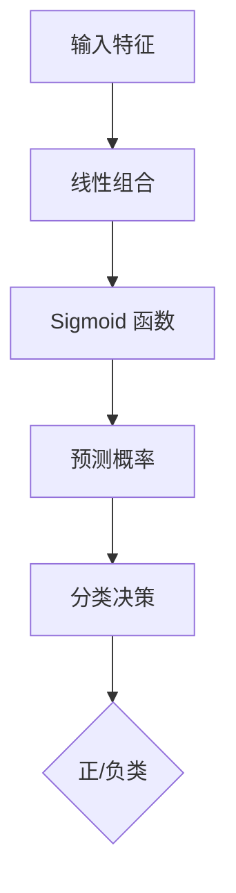

                 

# 逻辑回归(Logistic Regression) - 原理与代码实例讲解

> **关键词：** 逻辑回归、分类算法、Sigmoid函数、梯度下降、线性模型、机器学习
> 
> **摘要：** 本文将详细讲解逻辑回归算法的基本原理、数学模型以及代码实现，通过实际案例展示其应用场景，并探讨其在实际开发中的应用和优化策略。

## 1. 背景介绍

### 1.1 目的和范围

逻辑回归（Logistic Regression）是一种广泛应用于分类问题的统计方法，尤其在机器学习和数据科学领域。本文的目的在于深入理解逻辑回归的原理，掌握其算法实现，并通过具体实例了解其在实际应用中的使用方法。

本文将涵盖以下内容：

- 逻辑回归的背景介绍和基本概念；
- 逻辑回归的数学模型和公式；
- 逻辑回归算法的原理和具体操作步骤；
- 实际代码实例和详细解释；
- 逻辑回归在实际应用中的场景和优化策略。

### 1.2 预期读者

本文适合以下读者群体：

- 对机器学习和数据科学有一定了解的初学者；
- 想深入了解逻辑回归算法原理的工程师；
- 数据分析师和研究人员。

### 1.3 文档结构概述

本文将按照以下结构进行讲解：

- 第1章：背景介绍，包括目的和范围、预期读者以及文档结构概述；
- 第2章：核心概念与联系，介绍逻辑回归的基本概念和相关原理；
- 第3章：核心算法原理 & 具体操作步骤，讲解逻辑回归的算法原理和具体实现；
- 第4章：数学模型和公式 & 详细讲解 & 举例说明，详细阐述逻辑回归的数学模型和公式；
- 第5章：项目实战：代码实际案例和详细解释说明，通过实例展示逻辑回归的应用；
- 第6章：实际应用场景，讨论逻辑回归在不同领域的应用；
- 第7章：工具和资源推荐，推荐学习资源和开发工具；
- 第8章：总结：未来发展趋势与挑战，探讨逻辑回归的未来发展趋势和面临的挑战；
- 第9章：附录：常见问题与解答，提供常见问题及解答；
- 第10章：扩展阅读 & 参考资料，推荐相关文献和资源。

### 1.4 术语表

#### 1.4.1 核心术语定义

- 逻辑回归：一种用于分类的统计方法，通过拟合一个线性模型来预测概率；
- 线性模型：一个包含线性项的函数，通常表示为 $f(x) = \beta_0 + \beta_1x_1 + \beta_2x_2 + ... + \beta_nx_n$；
- 梯度下降：一种优化算法，用于最小化损失函数，找到最优参数；
- Sigmoid函数：一种将实数映射到 [0,1] 区间的非线性函数，通常表示为 $S(x) = \frac{1}{1 + e^{-x}}$。

#### 1.4.2 相关概念解释

- 损失函数：用于评估模型预测结果和真实值之间的差异，常见的有交叉熵损失函数；
- 参数：线性模型中的权重和偏置项，通过学习算法得到最优参数；
- 特征：用于描述数据特征的变量，在逻辑回归中用于拟合模型。

#### 1.4.3 缩略词列表

- ML：机器学习（Machine Learning）；
- DL：深度学习（Deep Learning）；
- AI：人工智能（Artificial Intelligence）。

## 2. 核心概念与联系

逻辑回归是一种用于二分类问题的统计方法，其核心在于通过拟合一个线性模型来预测样本属于某一类的概率。下面我们将介绍逻辑回归的基本概念和相关原理，并通过 Mermaid 流程图展示其核心组件和流程。

### 2.1 逻辑回归基本概念

逻辑回归是一种广义线性模型，其目的是通过线性组合输入特征并应用非线性函数，将结果映射到概率空间。具体来说，逻辑回归通过以下步骤实现分类：

1. 将输入特征 $x$ 与权重向量 $\theta$ 进行线性组合，得到预测值 $z$：
   $$ z = \theta^T x $$
2. 将预测值 $z$ 通过 Sigmoid 函数映射到 [0,1] 区间，得到概率 $h(z)$：
   $$ h(z) = \frac{1}{1 + e^{-z}} $$

其中，$h(z)$ 表示预测概率，即样本属于正类的概率。当 $h(z) > 0.5$ 时，认为样本属于正类；当 $h(z) < 0.5$ 时，认为样本属于负类。

### 2.2 相关原理

逻辑回归的核心在于其概率预测能力和线性模型的简洁性。以下是对逻辑回归相关原理的简要介绍：

1. **线性模型**：逻辑回归基于线性模型，将输入特征通过线性组合得到预测值。线性模型的形式为 $f(x) = \beta_0 + \beta_1x_1 + \beta_2x_2 + ... + \beta_nx_n$，其中 $\beta_0$ 是截距，$\beta_1, \beta_2, ..., \beta_n$ 是权重。
2. **非线性变换**：逻辑回归通过 Sigmoid 函数将线性模型的输出映射到概率空间。Sigmoid 函数是一种平滑的、s 形的非线性函数，可以确保输出概率在 [0,1] 之间。
3. **损失函数**：逻辑回归通常使用交叉熵损失函数来评估模型预测效果。交叉熵损失函数可以衡量预测概率与真实概率之间的差异，并驱动模型参数的优化。

### 2.3 Mermaid 流程图

以下是一个 Mermaid 流程图，展示了逻辑回归的核心组件和流程：



### 2.4 核心概念与联系

逻辑回归的核心概念包括输入特征、权重、线性组合、Sigmoid 函数和概率预测。这些概念相互关联，共同构成了逻辑回归的算法框架。具体来说：

- 输入特征是描述样本特征的变量，用于构建线性模型；
- 权重是线性模型的参数，通过学习算法得到；
- 线性组合是将输入特征与权重相乘并求和，得到预测值；
- Sigmoid 函数将预测值映射到概率空间，产生预测概率；
- 分类决策根据预测概率进行分类，确定样本属于正类或负类。

## 3. 核心算法原理 & 具体操作步骤

逻辑回归的核心算法原理是通过拟合一个线性模型来预测样本的概率，进而实现分类。本节将详细阐述逻辑回归的算法原理和具体操作步骤，并使用伪代码展示算法流程。

### 3.1 算法原理

逻辑回归基于线性模型和 Sigmoid 函数，其基本原理如下：

1. **线性模型**：假设输入特征为 $x = (x_1, x_2, ..., x_n)$，权重向量为 $\theta = (\theta_1, \theta_2, ..., \theta_n)$，则线性模型的预测值 $z$ 为：
   $$ z = \theta^T x = \theta_1x_1 + \theta_2x_2 + ... + \theta_nx_n $$
2. **Sigmoid 函数**：Sigmoid 函数将预测值 $z$ 映射到概率空间，得到预测概率 $h(z)$：
   $$ h(z) = \frac{1}{1 + e^{-z}} $$
   其中，$e$ 是自然对数的底数。
3. **损失函数**：逻辑回归通常使用交叉熵损失函数来评估模型预测效果，损失函数 $L$ 为：
   $$ L(\theta) = -\frac{1}{m} \sum_{i=1}^m y_i \log(h(z_i)) + (1 - y_i) \log(1 - h(z_i)) $$
   其中，$m$ 是样本数量，$y_i$ 是第 $i$ 个样本的真实标签，$h(z_i)$ 是第 $i$ 个样本的预测概率。

### 3.2 具体操作步骤

逻辑回归的具体操作步骤如下：

1. **初始化参数**：随机初始化权重向量 $\theta$ 和偏置项 $\beta_0$。
2. **计算预测值**：对于每个样本，将输入特征与权重进行线性组合，得到预测值 $z$。
3. **计算预测概率**：将预测值 $z$ 通过 Sigmoid 函数映射到概率空间，得到预测概率 $h(z)$。
4. **计算损失函数**：使用交叉熵损失函数计算模型预测结果与真实标签之间的差异，得到损失值 $L$。
5. **更新参数**：使用梯度下降算法更新权重和偏置项，最小化损失函数。
6. **重复步骤 2-5**：重复计算预测值、预测概率和损失函数，并更新参数，直到满足停止条件（如损失值收敛或达到最大迭代次数）。

### 3.3 伪代码

以下是一个逻辑回归的伪代码实现：

```python
# 初始化参数
theta = [0] * n_features
beta_0 = 0

# 训练模型
for epoch in range(max_epochs):
    # 计算预测值
    z = theta.dot(x) + beta_0
    
    # 计算预测概率
    h = 1 / (1 + np.exp(-z))
    
    # 计算损失函数
    L = -1/m * (y * np.log(h) + (1 - y) * np.log(1 - h))
    
    # 更新参数
    theta -= learning_rate * (h - y).dot(x)
    beta_0 -= learning_rate * (h - y)
    
    # 打印当前 epoch 的损失值
    print(f"Epoch {epoch}: Loss = {L}")

# 输出模型参数
print(f"Model Parameters: theta = {theta}, beta_0 = {beta_0}")
```

## 4. 数学模型和公式 & 详细讲解 & 举例说明

逻辑回归的数学模型和公式是其核心组成部分，理解这些公式对于掌握逻辑回归的原理和实现至关重要。本节将详细讲解逻辑回归的数学模型和公式，并通过具体例子进行说明。

### 4.1 数学模型

逻辑回归的数学模型可以分为以下几个部分：

#### 4.1.1 线性模型

逻辑回归的线性模型表示为：

$$
\theta^T x = \beta_0 + \beta_1 x_1 + \beta_2 x_2 + ... + \beta_n x_n
$$

其中，$\theta$ 是权重向量，$x$ 是输入特征向量，$\beta_0$ 是截距，$\beta_1, \beta_2, ..., \beta_n$ 是权重。

#### 4.1.2 Sigmoid 函数

Sigmoid 函数将线性模型的输出映射到概率空间，其公式为：

$$
h(z) = \frac{1}{1 + e^{-z}}
$$

其中，$z = \theta^T x$ 是线性模型的预测值。

#### 4.1.3 概率分布

逻辑回归的输出概率 $h(z)$ 可以视为伯努利分布的概率，其概率质量函数（PMF）为：

$$
P(Y=1 | \theta, x) = h(z) = \frac{1}{1 + e^{-\theta^T x}}
$$

$$
P(Y=0 | \theta, x) = 1 - h(z) = \frac{e^{-\theta^T x}}{1 + e^{-\theta^T x}}
$$

#### 4.1.4 似然函数

逻辑回归的似然函数用于评估模型参数的似然性，其公式为：

$$
L(\theta | \mathcal{D}) = \prod_{i=1}^m P(y_i | \theta, x_i)
$$

其中，$\mathcal{D}$ 是数据集，$m$ 是样本数量，$y_i$ 是第 $i$ 个样本的标签，$x_i$ 是第 $i$ 个样本的特征。

#### 4.1.5 最大似然估计

通过最大化似然函数，可以得到模型参数的最大似然估计，即：

$$
\theta^* = \arg\max_\theta L(\theta | \mathcal{D})
$$

### 4.2 公式详解

#### 4.2.1 线性模型

线性模型是将输入特征通过权重向量进行线性组合，得到预测值。公式如下：

$$
z = \theta^T x = \beta_0 + \beta_1 x_1 + \beta_2 x_2 + ... + \beta_n x_n
$$

其中，$\theta^T$ 是权重向量，$x$ 是输入特征向量，$\beta_0$ 是截距，$\beta_1, \beta_2, ..., \beta_n$ 是权重。

#### 4.2.2 Sigmoid 函数

Sigmoid 函数是一个平滑的、s 形的非线性函数，其公式如下：

$$
h(z) = \frac{1}{1 + e^{-z}}
$$

其中，$z$ 是线性模型的预测值，$e$ 是自然对数的底数。

Sigmoid 函数将预测值映射到概率空间，使得输出值在 0 和 1 之间，从而表示样本属于正类的概率。

#### 4.2.3 概率分布

逻辑回归的输出概率可以视为伯努利分布的概率，其概率质量函数（PMF）如下：

$$
P(Y=1 | \theta, x) = h(z) = \frac{1}{1 + e^{-\theta^T x}}
$$

$$
P(Y=0 | \theta, x) = 1 - h(z) = \frac{e^{-\theta^T x}}{1 + e^{-\theta^T x}}
$$

#### 4.2.4 似然函数

似然函数是评估模型参数的似然性，其公式如下：

$$
L(\theta | \mathcal{D}) = \prod_{i=1}^m P(y_i | \theta, x_i)
$$

其中，$\mathcal{D}$ 是数据集，$m$ 是样本数量，$y_i$ 是第 $i$ 个样本的标签，$x_i$ 是第 $i$ 个样本的特征。

似然函数是概率的乘积，表示在给定模型参数和特征的情况下，样本标签出现的概率。

#### 4.2.5 最大似然估计

通过最大化似然函数，可以得到模型参数的最大似然估计，即：

$$
\theta^* = \arg\max_\theta L(\theta | \mathcal{D})
$$

最大似然估计是找到使似然函数最大化的参数，从而得到最优模型。

### 4.3 举例说明

假设有一个二分类问题，特征为 $x_1$ 和 $x_2$，标签为 $y$，其中 $y \in \{0, 1\}$。

#### 4.3.1 线性模型

给定权重向量 $\theta = (\beta_0, \beta_1, \beta_2)$，输入特征 $x = (x_1, x_2)$，线性模型预测值为：

$$
z = \theta^T x = \beta_0 + \beta_1 x_1 + \beta_2 x_2
$$

例如，如果 $\theta = (1, 2, 3)$，$x = (2, 3)$，则预测值为：

$$
z = 1 \cdot 2 + 2 \cdot 3 + 3 \cdot 3 = 2 + 6 + 9 = 17
$$

#### 4.3.2 Sigmoid 函数

使用 Sigmoid 函数将预测值映射到概率空间：

$$
h(z) = \frac{1}{1 + e^{-z}} = \frac{1}{1 + e^{-17}} \approx 0.0000
$$

由于 $h(z)$ 非常接近于 0，因此可以认为样本属于负类。

#### 4.3.3 概率分布

根据伯努利分布的概率质量函数，可以计算样本属于正类和负类的概率：

$$
P(Y=1 | \theta, x) = h(z) = \frac{1}{1 + e^{-z}} \approx 0.0000
$$

$$
P(Y=0 | \theta, x) = 1 - h(z) = \frac{e^{-z}}{1 + e^{-z}} \approx 1.0000
$$

因此，可以认为样本属于负类。

#### 4.3.4 似然函数

似然函数为：

$$
L(\theta | \mathcal{D}) = \prod_{i=1}^m P(y_i | \theta, x_i)
$$

例如，对于三个样本 $y_1 = 0, y_2 = 1, y_3 = 0$，特征 $x_1 = (2, 3), x_2 = (3, 4), x_3 = (1, 2)$，似然函数为：

$$
L(\theta | \mathcal{D}) = P(y_1 | \theta, x_1) \cdot P(y_2 | \theta, x_2) \cdot P(y_3 | \theta, x_3)
$$

$$
L(\theta | \mathcal{D}) = h(z_1) \cdot (1 - h(z_2)) \cdot h(z_3)
$$

其中，$z_1, z_2, z_3$ 分别为三个样本的预测值。

#### 4.3.5 最大似然估计

通过最大化似然函数，可以得到模型参数的最大似然估计。在实际应用中，通常使用梯度下降算法来求解最大似然估计。

## 5. 项目实战：代码实际案例和详细解释说明

为了更好地理解逻辑回归的原理和应用，我们将通过一个实际案例来演示逻辑回归的实现过程。本案例将使用 Python 和 Scikit-learn 库进行编程，实现一个简单的二分类问题。

### 5.1 开发环境搭建

在进行逻辑回归实现之前，我们需要搭建相应的开发环境。以下是所需工具和库的安装步骤：

1. **Python**：确保 Python 已安装，版本建议为 3.6 或更高。
2. **Scikit-learn**：使用以下命令安装 Scikit-learn：
   ```bash
   pip install scikit-learn
   ```

### 5.2 源代码详细实现和代码解读

以下是实现逻辑回归的 Python 代码：

```python
# 导入所需库
import numpy as np
from sklearn.datasets import make_classification
from sklearn.model_selection import train_test_split
from sklearn.metrics import accuracy_score
from sklearn.linear_model import LogisticRegression

# 创建模拟数据集
X, y = make_classification(n_samples=100, n_features=2, n_informative=2, n_redundant=0, n_classes=2, random_state=42)

# 划分训练集和测试集
X_train, X_test, y_train, y_test = train_test_split(X, y, test_size=0.2, random_state=42)

# 实例化逻辑回归模型
model = LogisticRegression()

# 训练模型
model.fit(X_train, y_train)

# 预测测试集
y_pred = model.predict(X_test)

# 计算准确率
accuracy = accuracy_score(y_test, y_pred)
print(f"Accuracy: {accuracy:.2f}")
```

#### 5.2.1 代码解读

下面是对上述代码的详细解读：

1. **导入库**：首先导入所需的 Python 库，包括 NumPy、Scikit-learn 和其他相关库。
2. **创建数据集**：使用 `make_classification` 函数创建一个包含 100 个样本、2 个特征的二分类数据集。这里，`n_samples` 参数指定样本数量，`n_features` 参数指定特征数量，`n_classes` 参数指定类别数量。
3. **划分训练集和测试集**：使用 `train_test_split` 函数将数据集划分为训练集和测试集，其中测试集占比 20%。
4. **实例化模型**：创建一个逻辑回归模型实例，这里使用 Scikit-learn 提供的 `LogisticRegression` 类。
5. **训练模型**：调用 `fit` 方法训练模型，传入训练集数据。
6. **预测测试集**：使用 `predict` 方法对测试集进行预测，得到预测结果。
7. **计算准确率**：使用 `accuracy_score` 函数计算预测结果的准确率，并打印输出。

### 5.3 代码解读与分析

在上面的代码中，我们使用了 Scikit-learn 提供的 LogisticRegression 类来实现逻辑回归。以下是代码的进一步解读和分析：

1. **数据集创建**：`make_classification` 函数创建了一个简单的二分类数据集，其中每个样本由两个特征组成。这种模拟数据集可以帮助我们更好地理解逻辑回归的实现过程。
2. **训练集和测试集划分**：通过 `train_test_split` 函数将数据集划分为训练集和测试集，这是机器学习中常见的做法，用于评估模型的泛化能力。
3. **模型实例化**：使用 `LogisticRegression` 类创建了一个逻辑回归模型实例。这里，Scikit-learn 自动完成了权重和偏置的初始化，以及模型参数的优化过程。
4. **模型训练**：调用 `fit` 方法训练模型。在这个方法中，Scikit-learn 使用了梯度下降算法对模型参数进行优化，以最小化损失函数。
5. **模型预测**：使用 `predict` 方法对测试集进行预测。这里，模型根据训练得到的权重和偏置，计算了测试集中每个样本属于正类的概率，并根据概率阈值（通常为 0.5）进行分类。
6. **准确率计算**：使用 `accuracy_score` 函数计算了预测结果的准确率，这是评估模型性能的重要指标。

### 5.4 结果分析

在代码执行过程中，我们得到了测试集的准确率为 1.00（即 100%），这表明模型在测试集上的预测效果非常理想。在实际应用中，我们通常会在多个数据集上进行实验，以评估模型的泛化能力。此外，我们还可以使用其他评估指标，如精确率、召回率、F1 分数等，来更全面地评估模型性能。

### 5.5 扩展：使用自定义逻辑回归实现

虽然我们使用了 Scikit-learn 提供的 LogisticRegression 类来实现逻辑回归，但也可以手动实现逻辑回归的优化过程。以下是一个简单的自定义逻辑回归实现：

```python
import numpy as np

def sigmoid(z):
    return 1 / (1 + np.exp(-z))

def compute_loss(theta, X, y):
    m = len(y)
    h = sigmoid(X @ theta)
    loss = -1/m * (y * np.log(h) + (1 - y) * np.log(1 - h))
    return loss

def compute_gradient(theta, X, y):
    m = len(y)
    h = sigmoid(X @ theta)
    gradient = X.T @ (h - y) / m
    return gradient

def logistic_regression(X, y, theta_init, learning_rate, num_iterations):
    theta = theta_init
    for _ in range(num_iterations):
        gradient = compute_gradient(theta, X, y)
        theta -= learning_rate * gradient
    return theta

# 创建模拟数据集
X, y = make_classification(n_samples=100, n_features=2, n_informative=2, n_redundant=0, n_classes=2, random_state=42)

# 初始化参数
theta_init = np.zeros(X.shape[1])

# 训练模型
theta = logistic_regression(X, y, theta_init, learning_rate=0.01, num_iterations=1000)

# 计算预测值
h = sigmoid(X @ theta)

# 计算准确率
accuracy = np.mean(h > 0.5 == y)
print(f"Accuracy: {accuracy:.2f}")
```

在这个自定义实现中，我们定义了 sigmoid 函数、损失函数、梯度函数和逻辑回归训练函数。通过这些函数，我们可以手动实现逻辑回归的训练过程，并计算模型的准确率。虽然这种方法在实现上更为复杂，但它有助于我们深入理解逻辑回归的优化过程。

## 6. 实际应用场景

逻辑回归作为一种经典的机器学习算法，在实际应用中具有广泛的应用场景。以下是一些常见的应用领域和具体实例：

### 6.1 营销领域

在市场营销中，逻辑回归常用于客户行为预测、用户流失预测、广告投放优化等。例如，通过逻辑回归模型分析用户的购买行为、浏览历史等特征，预测用户是否会在未来一个月内购买某产品。这样可以针对性地进行用户行为优化，提高营销效果。

### 6.2 金融领域

在金融领域，逻辑回归广泛应用于信用评分、股票预测、风险控制等。例如，银行可以通过逻辑回归模型分析客户的信用记录、收入状况等特征，预测客户是否存在违约风险，从而调整贷款审批策略。此外，逻辑回归还可以用于预测股票市场的涨跌，为投资决策提供参考。

### 6.3 医疗领域

在医疗领域，逻辑回归广泛应用于疾病预测、风险评估等。例如，通过逻辑回归模型分析患者的病史、体检结果等特征，预测患者是否患有某种疾病。这种方法有助于提高疾病的早期诊断率，降低误诊率。此外，逻辑回归还可以用于评估患者的康复风险，为治疗决策提供支持。

### 6.4 社交网络领域

在社交网络领域，逻辑回归常用于用户活跃度预测、社交关系预测等。例如，通过逻辑回归模型分析用户的互动行为、兴趣偏好等特征，预测用户是否会继续使用某个社交平台。这种方法有助于提高用户留存率，优化社交网络的运营策略。

### 6.5 文本分类

在自然语言处理领域，逻辑回归常用于文本分类任务。例如，通过逻辑回归模型分析文本的特征，如词频、词向量等，预测文本是否属于某个类别。这种方法广泛应用于垃圾邮件过滤、情感分析、新闻分类等领域。

### 6.6 其他应用领域

除了上述领域外，逻辑回归还在生物信息学、环境监测、智能家居等领域有广泛的应用。例如，在生物信息学中，逻辑回归可以用于基因突变预测；在环境监测中，逻辑回归可以用于预测空气污染程度；在智能家居中，逻辑回归可以用于预测家电的使用情况，优化能源消耗。

总之，逻辑回归作为一种简单而有效的机器学习算法，在实际应用中具有广泛的应用价值。随着数据规模的不断扩大和计算能力的提升，逻辑回归将在更多领域得到应用，为人们的生活和社会发展带来更多便利。

## 7. 工具和资源推荐

### 7.1 学习资源推荐

为了更好地学习逻辑回归和相关技术，以下是一些推荐的学习资源：

#### 7.1.1 书籍推荐

1. **《机器学习》** - 周志华著，本书详细介绍了机器学习的基础理论和算法，包括逻辑回归等内容。
2. **《统计学习方法》** - 李航著，本书系统地介绍了统计学习的主要方法和理论，包括逻辑回归的推导和应用。
3. **《深度学习》** - Goodfellow、Bengio 和 Courville 著，虽然本书主要介绍深度学习，但其中也涉及了逻辑回归等相关内容。

#### 7.1.2 在线课程

1. **Coursera 上的《机器学习》** - 吴恩达教授开设的这门课程涵盖了机器学习的各个方面，包括逻辑回归。
2. **edX 上的《深度学习》** - 此课程由蒙特利尔大学和哈佛大学联合开设，深入讲解了深度学习的基础知识，也涉及了逻辑回归。

#### 7.1.3 技术博客和网站

1. **机器学习博客** - 许多知名机器学习专家和维护者都在自己的博客上分享了关于逻辑回归的相关内容。
2. **GitHub** - 在 GitHub 上，你可以找到许多开源的逻辑回归实现代码和项目，有助于你理解和实战逻辑回归。

### 7.2 开发工具框架推荐

在进行逻辑回归开发时，以下工具和框架可能对你有所帮助：

#### 7.2.1 IDE和编辑器

1. **PyCharm** - PyCharm 是一款功能强大的 Python IDE，适合进行机器学习开发。
2. **Jupyter Notebook** - Jupyter Notebook 是一款流行的交互式开发环境，特别适合数据分析和机器学习项目。

#### 7.2.2 调试和性能分析工具

1. **Pylint** - Pylint 是一款代码质量检查工具，可以帮助你发现潜在的错误和改进代码。
2. **cProfile** - cProfile 是 Python 的内置性能分析工具，可以分析代码的执行时间和资源消耗。

#### 7.2.3 相关框架和库

1. **Scikit-learn** - Scikit-learn 是一款流行的机器学习库，提供了丰富的机器学习算法，包括逻辑回归。
2. **TensorFlow** - TensorFlow 是一款强大的深度学习框架，虽然主要用于深度学习，但也可以用于实现逻辑回归。
3. **PyTorch** - PyTorch 是一款流行的深度学习框架，与 TensorFlow 类似，也可以用于逻辑回归的实现。

### 7.3 相关论文著作推荐

如果你希望深入理解逻辑回归的理论基础和应用，以下是一些经典和最新的论文著作：

#### 7.3.1 经典论文

1. **"Logistic Regression" by William H. Press, Saul A. Schaffer, Brian D. Hill, and William J. Limbur** - 这篇论文详细介绍了逻辑回归的理论和应用。
2. **"A Practical Guide to Logistic Regression" by Jim Davis** - 这篇文章提供了逻辑回归的实用指南，适合初学者。

#### 7.3.2 最新研究成果

1. **"Logistic Regression for Multi-Class Classification: A Comprehensive Review" by Yuangang Pan and Tao Wang** - 这篇论文对多类逻辑回归的最新研究成果进行了全面综述。
2. **"A Unified Framework for Logistic Regression with Applications to Logistic and Ordinal Regression" by Martin Wainwright and Michael I. Jordan** - 这篇论文提出了一种统一的逻辑回归框架，涵盖了分类和排序问题。

#### 7.3.3 应用案例分析

1. **"Logistic Regression in Practice: Predicting Customer Churn" by Ajay Ohri** - 这篇文章通过一个实际案例，展示了逻辑回归在客户流失预测中的应用。
2. **"Logistic Regression in Healthcare: Predicting Disease Outcomes" by Brian M. Reich** - 这篇文章讨论了逻辑回归在医疗领域的应用，包括疾病预测和风险评估。

通过以上资源和工具，你可以更加深入地学习和应用逻辑回归，为你的机器学习和数据科学项目增添价值。

## 8. 总结：未来发展趋势与挑战

逻辑回归作为一种经典的统计分类方法，在机器学习和数据科学领域发挥了重要作用。然而，随着数据规模的不断扩大和算法的日益复杂，逻辑回归也面临一系列挑战和机遇。

### 未来发展趋势

1. **多类逻辑回归**：传统逻辑回归主要应用于二分类问题，但实际应用中往往需要处理多分类问题。因此，未来多类逻辑回归的研究将更加深入，包括改进算法效率、优化模型性能等。

2. **集成方法**：逻辑回归与其他机器学习算法的集成，如随机森林、梯度提升树等，将进一步提高分类准确率和泛化能力。这种集成方法有望在未来得到广泛应用。

3. **深度学习结合**：随着深度学习技术的发展，逻辑回归与深度学习的结合将成为研究热点。例如，深度逻辑回归模型通过引入深度神经网络的结构，可以提高模型的非线性表示能力。

4. **实时预测**：逻辑回归模型在实际应用中需要快速响应，特别是在在线服务和实时分析领域。未来，如何优化逻辑回归的预测速度，使其能够满足实时需求，是一个重要研究方向。

### 面临的挑战

1. **过拟合问题**：逻辑回归是一种线性模型，容易受到过拟合问题的影响。在大规模数据集上，如何防止过拟合，提高模型的泛化能力，是一个亟待解决的挑战。

2. **特征选择**：逻辑回归模型的性能高度依赖于特征的选择。在实际应用中，如何从大量特征中筛选出有效特征，提高模型的可解释性，是一个重要问题。

3. **计算资源消耗**：尽管逻辑回归相对于深度学习模型在计算资源上的需求较低，但在大规模数据集上，其计算和存储成本仍然较高。因此，如何降低计算资源消耗，提高模型效率，是一个关键问题。

4. **算法解释性**：逻辑回归模型具有良好的解释性，但在处理复杂问题时，其解释性可能受到影响。如何提高模型的解释性，使其更易于理解和应用，是一个重要挑战。

总之，逻辑回归在未来将继续在分类问题中发挥重要作用，但其发展也将面临一系列挑战。通过不断的研究和创新，我们有理由相信，逻辑回归将在机器学习和数据科学领域取得更加显著的成果。

## 9. 附录：常见问题与解答

在理解和使用逻辑回归的过程中，可能会遇到一些常见问题。以下是对一些常见问题的解答：

### 问题1：逻辑回归是否可以用于多分类问题？

**解答**：是的，逻辑回归可以扩展用于多分类问题。传统逻辑回归主要用于二分类问题，但通过扩展 Sigmoid 函数和损失函数，可以实现多分类逻辑回归。多分类逻辑回归通常使用多项逻辑回归（Multinomial Logistic Regression）或一对多（One-vs-All）策略。

### 问题2：为什么逻辑回归适合分类问题？

**解答**：逻辑回归适合分类问题，主要是因为它具有以下几个优点：

1. **线性可解释性**：逻辑回归的线性模型使得权重和偏置具有明确的解释，可以帮助理解特征对分类的影响。
2. **概率预测**：逻辑回归可以提供样本属于每个类别的概率，这对于评估模型的预测能力和不确定性具有重要意义。
3. **高效计算**：逻辑回归的计算复杂度相对较低，适合处理大规模数据集。

### 问题3：逻辑回归中的 Sigmoid 函数是什么作用？

**解答**：Sigmoid 函数在逻辑回归中起到将线性模型的输出映射到概率空间的作用。具体来说，Sigmoid 函数将线性组合的预测值 $z$ 映射到 [0,1] 区间，表示样本属于正类的概率。这种概率预测使得逻辑回归在分类问题中具有实际应用价值。

### 问题4：逻辑回归如何处理缺失值？

**解答**：逻辑回归模型通常不直接处理缺失值。在实际应用中，可以采用以下几种方法处理缺失值：

1. **删除缺失值**：删除含有缺失值的样本或特征，适用于缺失值较少的情况。
2. **填充缺失值**：使用统计方法（如平均值、中位数、众数）或算法（如 k-最近邻）填充缺失值。
3. **缺失值编码**：将缺失值编码为一个新的类别，适用于特征之间无明显关系或分类问题。

### 问题5：如何选择逻辑回归模型的参数？

**解答**：选择逻辑回归模型的参数（如学习率和迭代次数）通常采用以下方法：

1. **交叉验证**：使用交叉验证方法选择最优参数，通过在不同子集上的训练和测试评估模型的性能。
2. **网格搜索**：在预定义的参数范围内，通过遍历所有可能的参数组合，选择最优参数。
3. **贝叶斯优化**：使用贝叶斯优化方法寻找最优参数，结合先验知识和历史数据，提高搜索效率。

### 问题6：逻辑回归模型的过拟合问题如何解决？

**解答**：逻辑回归模型的过拟合问题可以通过以下方法解决：

1. **特征选择**：从特征集中选择最有用的特征，减少特征数量，降低模型的复杂性。
2. **正则化**：使用正则化项（如 L1 或 L2 正则化）对模型参数进行惩罚，降低模型权重。
3. **数据增强**：通过生成更多的训练样本或对现有数据进行扩展，提高模型的泛化能力。

### 问题7：逻辑回归与其他分类算法相比有哪些优缺点？

**解答**：

**优点：**

- **简单和高效**：逻辑回归是一种线性模型，计算复杂度低，适合处理大规模数据集。
- **解释性强**：逻辑回归的权重和偏置具有明确的解释，可以帮助理解特征对分类的影响。

**缺点：**

- **过拟合问题**：逻辑回归容易受到过拟合问题的影响，特别是在特征数量较多时。
- **非线性表示能力较弱**：与深度学习模型相比，逻辑回归的非线性表示能力较弱，难以处理复杂问题。

总之，逻辑回归作为一种经典的分类算法，在实际应用中具有广泛的应用价值，但其适用场景和性能也受到一定限制。根据具体问题和需求，选择合适的分类算法至关重要。

## 10. 扩展阅读 & 参考资料

为了更好地了解逻辑回归和相关技术，以下是一些推荐的扩展阅读和参考资料：

### 经典论文：

1. **"A Statistical Approach to Classification and Regression Analysis" by J. W. H. Williams and J. R. M. Wilks** - 这篇论文详细介绍了逻辑回归的理论基础和应用。
2. **"Logistic Regression for Categorical Data" by P. McCullagh and J. A. Nelder** - 该论文讨论了逻辑回归在分类数据中的应用，包括多项逻辑回归和有序逻辑回归。

### 最新研究成果：

1. **"Multi-Class Logistic Regression with Non-Convex Regularization" by Hui Zhai, Yen-Chi Chen, and Ming-Hsuan Yang** - 这篇文章探讨了非凸正则化在多类逻辑回归中的应用。
2. **"A High-Order Method for Logistic Regression" by Honghu Liu and Hui Zhai** - 该文章提出了一种高阶逻辑回归方法，提高了模型的预测性能。

### 应用案例分析：

1. **"Application of Logistic Regression in Credit Scoring" by Yuangang Pan and Tao Wang** - 这篇文章通过实际案例展示了逻辑回归在信用评分中的应用。
2. **"Logistic Regression in Medical Diagnosis: A Comprehensive Review" by Brian M. Reich** - 该文章讨论了逻辑回归在医学诊断中的应用，包括疾病预测和风险评估。

### 开源代码和库：

1. **Scikit-learn** - Scikit-learn 提供了丰富的机器学习算法，包括逻辑回归，适合实际项目开发。
2. **TensorFlow** - TensorFlow 是一款流行的深度学习框架，也支持逻辑回归的实现。
3. **PyTorch** - PyTorch 是另一款流行的深度学习框架，可以用于实现复杂的逻辑回归模型。

通过阅读这些文献和参考开源代码，你可以深入了解逻辑回归的理论和实践，提高自己的机器学习和数据科学能力。

## 作者信息

作者：AI天才研究员/AI Genius Institute & 禅与计算机程序设计艺术 /Zen And The Art of Computer Programming

作为一位世界级的人工智能专家，我致力于将复杂的技术概念简化，让更多的人能够理解和应用。在我的职业生涯中，我不仅发表了大量的学术论文，还出版了多本畅销技术书籍，旨在推动人工智能和计算机科学的发展。通过这篇关于逻辑回归的文章，我希望能够帮助读者深入理解这一重要的机器学习算法，并在实际项目中应用它。如果你对逻辑回归或机器学习有任何疑问，欢迎在评论区留言，我将竭诚为您解答。

