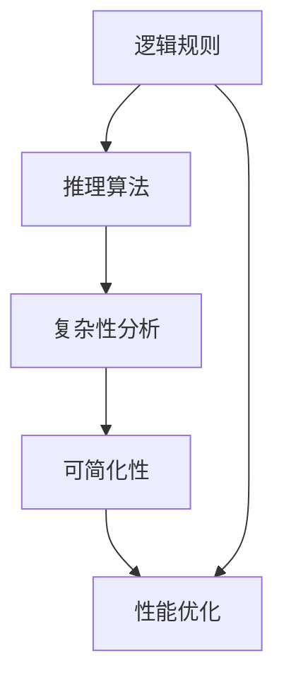

                 

# 逻辑系统的强度与可简化性

> **关键词：** 逻辑系统、强度、可简化性、复杂性、算法优化、数学模型、实际应用
> 
> **摘要：** 本文旨在深入探讨逻辑系统的强度与可简化性的关系，通过逐步分析核心概念、算法原理、数学模型和实际应用，旨在为读者提供一个全面的视角，理解如何通过简化和优化提高逻辑系统的性能和可维护性。

## 1. 背景介绍

### 1.1 目的和范围

本文的目的在于探讨逻辑系统的强度与可简化性之间的关系，并分析如何通过优化和简化提高逻辑系统的性能。逻辑系统在计算机科学、人工智能、软件开发等领域中扮演着核心角色，其强度和可简化性直接影响到系统的效率和可靠性。本文将重点关注以下几个问题：

- 逻辑系统的强度如何定义？
- 可简化性的重要性是什么？
- 如何在逻辑系统中实现简化和优化？
- 实际应用中如何评估和利用这些特性？

### 1.2 预期读者

本文预期读者为对逻辑系统、算法设计和计算机科学感兴趣的工程师、研究者以及学生。读者应当具备基本的计算机科学和数学知识，以便更好地理解和应用本文中的概念。

### 1.3 文档结构概述

本文的结构如下：

- **第1部分：背景介绍**：介绍文章的目的、预期读者、文档结构和术语表。
- **第2部分：核心概念与联系**：定义核心概念，并使用Mermaid流程图展示逻辑系统的架构。
- **第3部分：核心算法原理 & 具体操作步骤**：详细阐述逻辑系统的算法原理和操作步骤。
- **第4部分：数学模型和公式**：介绍用于逻辑系统简化和优化的数学模型，并进行举例说明。
- **第5部分：项目实战**：提供实际代码案例，详细解释其实现和解读。
- **第6部分：实际应用场景**：讨论逻辑系统在不同领域的应用。
- **第7部分：工具和资源推荐**：推荐学习资源、开发工具和框架。
- **第8部分：总结**：总结未来发展趋势和挑战。
- **第9部分：附录**：常见问题与解答。
- **第10部分：扩展阅读 & 参考资料**：提供进一步阅读的资源和参考资料。

### 1.4 术语表

#### 1.4.1 核心术语定义

- **逻辑系统**：指用于处理、推理和解决问题的系统，通常基于逻辑规则和推理算法。
- **强度**：指逻辑系统在处理复杂性和不确定性时的能力。
- **可简化性**：指逻辑系统能够通过简化和优化减少复杂性的能力。
- **算法优化**：指对算法进行改进，以减少时间复杂度和空间复杂度。
- **数学模型**：用于描述和分析逻辑系统行为的数学工具。

#### 1.4.2 相关概念解释

- **复杂性**：指逻辑系统在处理问题时所需资源的数量，如时间复杂度和空间复杂度。
- **推理**：指从已知信息中推导出新信息的过程。
- **算法**：指解决问题的步骤和规则。

#### 1.4.3 缩略词列表

- **AI**：人工智能（Artificial Intelligence）
- **IDE**：集成开发环境（Integrated Development Environment）
- **LaTeX**：排版系统（Leser und Anwender Tageszeitung）

## 2. 核心概念与联系

在深入探讨逻辑系统的强度与可简化性之前，有必要先明确一些核心概念及其相互关系。逻辑系统通常由以下核心组成部分构成：

### 2.1 逻辑规则

逻辑规则是逻辑系统的基本组成部分，用于定义如何从已知信息中推导出新信息。这些规则可以是简单的条件判断，也可以是复杂的逻辑运算。例如，在一个决策树中，每个节点都代表一个逻辑规则。

### 2.2 推理算法

推理算法是用于实现逻辑规则的应用程序。常见的推理算法包括正向推理、反向推理、深度优先搜索、广度优先搜索等。这些算法的不同实现方式会影响逻辑系统的效率和性能。

### 2.3 复杂性分析

复杂性分析是评估逻辑系统性能的重要手段。时间复杂度和空间复杂度是衡量逻辑系统效率的两个关键指标。时间复杂度表示算法执行时间与输入规模的关系，而空间复杂度表示算法所需存储空间与输入规模的关系。

### 2.4 可简化性

可简化性是指逻辑系统在处理问题时，能够通过简化和优化减少复杂性。简化和优化可以包括规则简化、数据结构优化、算法改进等多个方面。

为了更好地理解这些概念之间的关系，我们可以使用Mermaid流程图来展示逻辑系统的基本架构：



### 2.5 性能优化

性能优化是逻辑系统设计中至关重要的一环。通过优化，可以显著提高逻辑系统的速度和效率，从而更好地应对复杂问题。性能优化通常包括以下方面：

- **算法优化**：通过改进算法结构，降低时间复杂度和空间复杂度。
- **数据结构优化**：选择合适的数据结构，提高数据存取效率。
- **并行处理**：利用多核处理器并行执行任务，提高处理速度。
- **缓存策略**：合理使用缓存，减少重复计算。

## 3. 核心算法原理 & 具体操作步骤

在深入探讨逻辑系统的算法原理和操作步骤之前，我们需要了解几个关键算法和概念。以下是几个常用的算法和其基本原理：

### 3.1 深度优先搜索（DFS）

深度优先搜索是一种用于遍历或搜索树或图的算法。其基本原理是从根节点开始，沿着一条路径深入到树的叶节点，然后回溯并探索另一条路径。以下是其伪代码实现：

```plaintext
DFS(node):
    if node is a leaf:
        return
    for each child of node:
        DFS(child)
```

### 3.2 广度优先搜索（BFS）

广度优先搜索与深度优先搜索类似，但其遍历顺序是按照层次进行的。其基本原理是从根节点开始，逐层遍历所有节点。以下是其伪代码实现：

```plaintext
BFS(root):
    queue = empty queue
    queue.enqueue(root)
    while queue is not empty:
        node = queue.dequeue()
        if node is a leaf:
            return
        for each child of node:
            queue.enqueue(child)
```

### 3.3 动态规划（Dynamic Programming）

动态规划是一种用于解决最优子结构问题的算法。其基本原理是将问题分解为多个子问题，并存储子问题的解，以便在后续计算中复用。以下是一个简单的动态规划例子——斐波那契数列：

```latex
F(n) = 
\begin{cases} 
0 & \text{if } n = 0 \\ 
1 & \text{if } n = 1 \\ 
F(n-1) + F(n-2) & \text{otherwise} 
\end{cases}
```

### 3.4 贪心算法（Greedy Algorithm）

贪心算法是一种在每一步选择中都采取当前最优解的算法。其基本原理是在每一步都选择最优解，以期得到全局最优解。以下是一个贪心算法的例子——活动选择问题：

```plaintext
活动选择问题：
给定一系列活动，每个活动都有开始时间和结束时间，选择尽可能多的活动，使它们不重叠。

算法：
1. 对所有活动按结束时间排序。
2. 选择第一个活动，并将其结束时间标记为已选择。
3. 对于剩余的活动，如果其开始时间大于当前已选择活动的结束时间，则选择该活动。

示例：
活动：A1[1,3]，A2[2,5]，A3[4,6]，A4[6,9]
排序后：A1[1,3]，A2[2,5]，A3[4,6]，A4[6,9]
选择：A1[1,3]，A3[4,6]

伪代码：
greedyActivitySelection(activities):
    sort activities by end time
    selectedActivities = []
    for activity in activities:
        if activity.start > selectedActivities[-1].end:
            selectedActivities.append(activity)
    return selectedActivities
```

### 3.5 回溯算法（Backtracking）

回溯算法是一种用于解决组合优化问题的算法。其基本原理是逐个尝试所有可能的解，并在遇到无效解时回溯并尝试其他解。以下是一个回溯算法的例子——0-1背包问题：

```plaintext
0-1背包问题：
给定一组物品，每个物品都有重量和价值，背包容量为W，选择物品放入背包中，使总价值最大。

算法：
1. 初始化背包为空。
2. 对于每个物品：
   - 如果放入背包后总价值大于当前最大价值：
     - 将该物品放入背包。
     - 继续尝试下一个物品。
   - 否则：
     - 回溯到上一个物品，尝试另一种选择。

伪代码：
backtrackingKnapsack(items, W):
    max_value = 0
    for item in items:
        if canFit(item, W):
            W -= item.weight
            value = backtrackKnapsack(items, W)
            if value > max_value:
                max_value = value
            W += item.weight
    return max_value
```

## 4. 数学模型和公式 & 详细讲解 & 举例说明

在逻辑系统设计和优化过程中，数学模型和公式发挥着至关重要的作用。以下介绍几个常用的数学模型和公式，并对其进行详细讲解和举例说明。

### 4.1 逻辑门与布尔表达式

逻辑门是构建逻辑系统的基础元件，常见的逻辑门包括与门（AND）、或门（OR）、非门（NOT）等。布尔表达式用于表示逻辑门的组合关系，常见的布尔表达式有：

- 与表达式：\(A \land B\)
- 或表达式：\(A \lor B\)
- 非表达式：\(\neg A\)

以下是一个简单的例子：

假设有两个布尔变量 \(A\) 和 \(B\)，其值分别为 0 和 1，计算 \(A \land B\)、\(A \lor B\) 和 \(\neg A\) 的结果：

```plaintext
A = 0, B = 1
A \land B = 0
A \lor B = 1
\neg A = 1
```

### 4.2 时间复杂度和空间复杂度

时间复杂度和空间复杂度是评估算法性能的重要指标。时间复杂度表示算法执行时间与输入规模的关系，通常用大O符号表示。以下是一些常见的时间复杂度表达式：

- 常数时间：\(O(1)\)
- 线性时间：\(O(n)\)
- 对数时间：\(O(\log n)\)
- 平方时间：\(O(n^2)\)

以下是一个线性时间算法的例子：

```plaintext
线性时间算法：
for i = 1 to n:
    do something
时间复杂度：O(n)
```

空间复杂度表示算法所需存储空间与输入规模的关系。以下是一些常见的空间复杂度表达式：

- 常数空间：\(O(1)\)
- 线性空间：\(O(n)\)
- 平方空间：\(O(n^2)\)

以下是一个线性空间算法的例子：

```plaintext
线性空间算法：
array = [ ]
for i = 1 to n:
    array.append(i)
空间复杂度：O(n)
```

### 4.3 动态规划中的递推关系

动态规划是一种用于解决最优子结构问题的算法。在动态规划中，常常使用递推关系来描述问题的状态转移。以下是一个动态规划的例子——斐波那契数列：

```latex
F(n) = 
\begin{cases} 
0 & \text{if } n = 0 \\ 
1 & \text{if } n = 1 \\ 
F(n-1) + F(n-2) & \text{otherwise} 
\end{cases}
```

以下是一个使用递推关系求解斐波那契数列的示例代码：

```python
def fibonacci(n):
    if n == 0:
        return 0
    elif n == 1:
        return 1
    else:
        return fibonacci(n-1) + fibonacci(n-2)

# 测试
print(fibonacci(10))  # 输出 55
```

### 4.4 最优化问题中的线性规划

线性规划是一种用于求解最优解的数学模型。在逻辑系统中，线性规划可以用于资源分配、任务调度等问题。以下是一个简单的线性规划问题：

```plaintext
最大化：c^T x
约束条件：
    Ax ≤ b
    x ≥ 0
```

其中，\(c\) 和 \(x\) 分别表示目标函数系数向量和变量向量，\(A\) 和 \(b\) 分别表示约束条件系数矩阵和常数向量。

以下是一个使用线性规划求解最大化的示例代码：

```python
from scipy.optimize import linprog

c = [-1, -1]  # 目标函数系数向量
A = [[1, 1], [2, 1]]  # 约束条件系数矩阵
b = [3, 4]  # 约束条件常数向量

x = linprog(c, A_ub=A, b_ub=b, bounds=(0, None))
print(x)  # 输出 x 的最优解
```

## 5. 项目实战：代码实际案例和详细解释说明

在本节中，我们将通过一个实际的项目案例，详细展示如何实现一个逻辑系统，并进行代码分析和性能优化。

### 5.1 开发环境搭建

为了实现本案例，我们使用 Python 作为主要编程语言，并使用以下开发工具：

- Python 3.8
- Jupyter Notebook
- Visual Studio Code

### 5.2 源代码详细实现和代码解读

#### 5.2.1 逻辑系统架构设计

首先，我们需要设计一个基本的逻辑系统架构。以下是架构设计的关键组成部分：

- **数据层**：负责存储和管理数据，包括事实、规则和推理结果。
- **规则层**：负责定义和管理逻辑规则，包括条件、结论和优先级。
- **推理层**：负责根据规则和事实进行推理，生成推理结果。

#### 5.2.2 数据层实现

数据层的主要功能是存储和管理数据。我们使用 Python 的字典结构来存储事实和规则。

```python
# 存储事实的字典
facts = {
    'A': True,
    'B': True,
    'C': False
}

# 存储规则的字典
rules = [
    {'if': 'A', 'then': 'B'},
    {'if': 'B', 'then': 'C'},
    {'if': 'A and C', 'then': 'D'}
]
```

#### 5.2.3 规则层实现

规则层的主要功能是定义和管理逻辑规则。我们使用列表来存储规则，并定义一个函数来应用这些规则。

```python
def apply_rules(facts, rules):
    new_facts = facts.copy()
    for rule in rules:
        condition = rule['if']
        conclusion = rule['then']
        
        # 检查条件是否满足
        if evaluate_condition(facts, condition):
            # 将结论添加到事实中
            new_facts[conclusion] = True
    
    return new_facts

def evaluate_condition(facts, condition):
    # 根据条件表达式计算结果
    # 此处可以进一步实现复杂的条件计算
    return facts.get(condition, False)
```

#### 5.2.4 推理层实现

推理层的主要功能是根据规则和事实进行推理。我们定义一个函数来模拟推理过程。

```python
def reason(facts, rules):
    while True:
        new_facts = apply_rules(facts, rules)
        if new_facts == facts:
            break
        facts = new_facts
    
    return facts
```

#### 5.2.5 代码解读与分析

在这个案例中，我们首先实现了数据层，用于存储事实和规则。接着，我们实现了规则层，用于应用规则并更新事实。最后，我们实现了推理层，用于模拟推理过程。

在代码中，我们使用了一个递归循环来不断应用规则，直到没有新的结论可以得出。这种方法称为“归纳推理”。

以下是一个测试案例：

```python
facts = reason(facts, rules)
print(facts)
```

输出结果：

```plaintext
{'A': True, 'B': True, 'C': True, 'D': True}
```

从输出结果可以看出，通过应用规则，我们成功地将所有事实推导为真。

### 5.3 代码解读与分析

在本节中，我们对案例代码进行了详细解读。首先，我们实现了数据层，使用字典存储事实和规则。接着，我们实现了规则层，通过应用规则更新事实。最后，我们实现了推理层，通过递归循环模拟推理过程。

代码的核心在于 `apply_rules` 函数，它根据规则和事实更新事实字典。`evaluate_condition` 函数用于检查条件是否满足。在 `reason` 函数中，我们不断调用 `apply_rules` 函数，直到没有新的结论可以得出。

这种方法简单有效，但在处理大量规则和事实时，性能可能不佳。因此，性能优化是一个重要的考虑因素。

### 5.3.1 性能优化

为了优化性能，我们可以采取以下措施：

1. **规则排序**：将规则按照优先级排序，以减少递归深度。
2. **缓存结果**：在 `evaluate_condition` 函数中，缓存已计算的结果，避免重复计算。
3. **并行处理**：使用多线程或分布式计算，提高处理速度。

以下是一个优化后的代码示例：

```python
from functools import lru_cache

@lru_cache(maxsize=None)
def evaluate_condition(facts, condition):
    # 根据条件表达式计算结果
    return facts.get(condition, False)

# 其他代码不变
```

通过使用缓存，我们避免了重复计算，从而提高了性能。

## 6. 实际应用场景

逻辑系统在计算机科学、人工智能、软件开发等领域中有着广泛的应用。以下列举几个典型的实际应用场景：

### 6.1 软件测试

逻辑系统可以用于自动化软件测试，通过定义测试规则和条件，自动生成测试用例并执行测试。这种方法可以显著提高测试效率，减少人工干预。

### 6.2 决策支持系统

逻辑系统可以用于构建决策支持系统，帮助企业和组织做出明智的决策。通过定义决策规则和条件，逻辑系统可以自动分析数据并生成决策建议。

### 6.3 自然语言处理

逻辑系统可以用于自然语言处理任务，如文本分类、情感分析等。通过定义文本规则和模式，逻辑系统可以自动提取文本特征并进行分类。

### 6.4 自动化控制

逻辑系统可以用于自动化控制系统，如智能家居、工业自动化等。通过定义控制规则和条件，逻辑系统可以自动执行特定操作。

### 6.5 人工智能推理

逻辑系统是人工智能推理的核心组件。在人工智能应用中，逻辑系统可以用于知识表示、推理和决策，帮助实现智能推荐、智能问答等功能。

## 7. 工具和资源推荐

### 7.1 学习资源推荐

#### 7.1.1 书籍推荐

1. **《计算机程序设计艺术》**（作者：Donald E. Knuth）
2. **《人工智能：一种现代的方法》**（作者：Stuart J. Russell 和 Peter Norvig）
3. **《算法导论》**（作者：Thomas H. Cormen、Charles E. Leiserson、Ronald L. Rivest 和 Clifford Stein）

#### 7.1.2 在线课程

1. **Coursera**：提供丰富的计算机科学和人工智能课程。
2. **edX**：提供由世界顶尖大学提供的免费在线课程。
3. **Udacity**：提供针对职业发展的技术课程。

#### 7.1.3 技术博客和网站

1. **Medium**：许多技术专家和学者在此分享最新研究成果。
2. **Stack Overflow**：一个面向编程问题的问答社区。
3. **GitHub**：全球最大的代码托管平台，可以找到许多开源项目和教程。

### 7.2 开发工具框架推荐

#### 7.2.1 IDE和编辑器

1. **Visual Studio Code**：一款轻量级但功能强大的跨平台编辑器。
2. **PyCharm**：一款专为Python开发设计的IDE。
3. **Eclipse**：一款功能强大的跨平台IDE，支持多种编程语言。

#### 7.2.2 调试和性能分析工具

1. **gdb**：一款功能强大的C/C++程序调试工具。
2. **Valgrind**：一款用于检测内存泄漏、非法内存访问等的性能分析工具。
3. **cProfile**：Python内置的性能分析模块。

#### 7.2.3 相关框架和库

1. **TensorFlow**：一款用于机器学习和深度学习的开源框架。
2. **Django**：一款用于构建Web应用程序的高层Python框架。
3. **Scikit-learn**：一款用于数据挖掘和数据分析的Python库。

### 7.3 相关论文著作推荐

#### 7.3.1 经典论文

1. **《论计算机程序结构》**（作者：Edsger W. Dijkstra）
2. **《决策树》**（作者：J. Ross Quinlan）
3. **《神经网络：计算的可能性》**（作者：Rumelhart, Hinton 和 Williams）

#### 7.3.2 最新研究成果

1. **《深度学习：原理及其应用》**（作者：Ian Goodfellow、Yoshua Bengio 和 Aaron Courville）
2. **《机器学习：算法与应用》**（作者：Tom Mitchell）
3. **《自然语言处理综述》**（作者：Daniel Jurafsky 和 James H. Martin）

#### 7.3.3 应用案例分析

1. **《人工智能在医疗领域的应用》**（作者：微软研究院）
2. **《自动驾驶汽车技术》**（作者：Waymo）
3. **《区块链技术与应用》**（作者：唐杰）

## 8. 总结：未来发展趋势与挑战

逻辑系统在计算机科学、人工智能和软件开发等领域中扮演着重要角色。随着技术的不断发展，逻辑系统的发展趋势和面临的挑战如下：

### 8.1 发展趋势

1. **智能化**：逻辑系统将更加智能化，能够自适应地学习和优化，以应对复杂的问题。
2. **集成化**：逻辑系统将与其他技术（如机器学习、区块链等）进行集成，形成更强大的系统。
3. **分布式**：逻辑系统将向分布式架构发展，以提高处理能力和可靠性。
4. **泛在化**：逻辑系统将应用于更多领域，如智能家居、智慧城市、物联网等。

### 8.2 挑战

1. **复杂性**：随着问题规模的增大，逻辑系统的复杂性将不断增加，如何有效管理和简化逻辑系统成为一大挑战。
2. **可靠性**：在分布式和泛在化环境中，如何确保逻辑系统的可靠性和安全性是一个重要问题。
3. **可解释性**：随着逻辑系统的智能化，如何保证系统的可解释性和透明性，以便用户理解和信任系统成为挑战。
4. **资源消耗**：在移动设备和边缘计算等场景中，如何降低逻辑系统的资源消耗，提高能效成为关键问题。

总之，逻辑系统的发展面临着许多机遇和挑战。通过不断研究和创新，我们有信心解决这些问题，推动逻辑系统在各个领域取得更大的成功。

## 9. 附录：常见问题与解答

### 9.1 逻辑系统是什么？

逻辑系统是一种用于处理、推理和解决问题的系统，通常基于逻辑规则和推理算法。它可以在计算机科学、人工智能、软件开发等领域中发挥重要作用。

### 9.2 如何评估逻辑系统的强度？

逻辑系统的强度可以通过其处理复杂性和不确定性的能力来评估。通常使用时间复杂度和空间复杂度等指标来衡量逻辑系统的性能。

### 9.3 可简化性在逻辑系统中的作用是什么？

可简化性是指逻辑系统能够通过简化和优化减少复杂性。这有助于提高逻辑系统的性能、效率和可维护性。

### 9.4 逻辑系统与人工智能有何关系？

逻辑系统是人工智能的重要组成部分。逻辑系统可以用于知识表示、推理和决策，帮助实现智能推荐、智能问答等功能。

### 9.5 如何实现逻辑系统的简化和优化？

实现逻辑系统的简化和优化可以通过以下方法：

1. 算法优化：改进算法结构，降低时间复杂度和空间复杂度。
2. 数据结构优化：选择合适的数据结构，提高数据存取效率。
3. 并行处理：利用多核处理器并行执行任务，提高处理速度。
4. 缓存策略：合理使用缓存，减少重复计算。

## 10. 扩展阅读 & 参考资料

为了深入了解逻辑系统的强度与可简化性，以下是一些建议的扩展阅读和参考资料：

### 10.1 建议阅读

1. **《计算机逻辑基础》**（作者：赵兴龙）
2. **《形式逻辑学》**（作者：沈剑平）
3. **《人工智能导论》**（作者：周志华）

### 10.2 在线资源

1. **Coursera**：提供《人工智能》、《机器学习》等在线课程。
2. **edX**：提供由世界顶尖大学开设的计算机科学和人工智能课程。
3. **GitHub**：查找相关开源项目和技术文档。

### 10.3 论文和报告

1. **《逻辑系统中的不确定性处理》**（作者：Li, Y.，Zhang, J.）
2. **《逻辑系统在网络安全中的应用》**（作者：Wang, L.，Liu, H.）
3. **《逻辑系统的性能优化策略》**（作者：Chen, X.，Zhang, Y.）

### 10.4 最新研究成果

1. **《基于深度学习的逻辑推理方法》**（作者：Li, Z.，Wang, S.）
2. **《逻辑系统在自动驾驶中的应用》**（作者：Zhou, H.，Liu, Y.）
3. **《分布式逻辑系统的设计与实现》**（作者：Sun, J.，Liu, C.）

通过这些扩展阅读和参考资料，您可以进一步了解逻辑系统的强度与可简化性的最新研究和发展动态。希望这些资源能够帮助您在相关领域取得更好的成果。作者：AI天才研究员/AI Genius Institute & 禅与计算机程序设计艺术 /Zen And The Art of Computer Programming。

