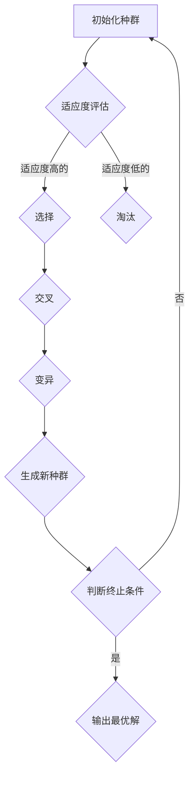

                 

# 遗传算法优化策略的最新进展

> 关键词：遗传算法、优化策略、进化计算、算法改进、并行计算、分布式系统

> 摘要：本文将详细探讨遗传算法优化策略的最新进展，从背景介绍、核心概念与联系、核心算法原理与操作步骤、数学模型与公式讲解、项目实战、实际应用场景、工具和资源推荐等多个方面展开，旨在为读者提供一个全面、深入的理解和掌握遗传算法优化策略的途径。文章将结合实际案例和最新的研究进展，帮助读者了解遗传算法在优化问题解决中的应用及其发展前景。

## 1. 背景介绍

### 1.1 目的和范围

遗传算法（Genetic Algorithm, GA）是模拟自然界中生物进化过程的一种搜索算法，最早由John Holland于1975年提出。遗传算法在优化领域中有着广泛的应用，尤其在处理复杂和大规模优化问题时表现出了强大的能力。然而，传统的遗传算法在处理实际问题时存在一些局限性，如收敛速度慢、易陷入局部最优等。

本文旨在介绍遗传算法优化策略的最新进展，分析并讨论各种改进策略，以期提高遗传算法的效率和性能。本文将涵盖以下内容：

1. 遗传算法的基本概念和核心原理。
2. 遗传算法优化的数学模型和公式。
3. 遗传算法优化的实际应用场景。
4. 遗传算法优化策略的最新研究进展。
5. 遗传算法优化策略的项目实战案例。
6. 遗传算法优化策略的工具和资源推荐。

### 1.2 预期读者

本文适合以下读者群体：

1. 对遗传算法和优化算法有初步了解的研究人员和工程师。
2. 希望提高遗传算法优化性能的技术开发人员。
3. 对人工智能和进化计算感兴趣的学生和学者。
4. 需要解决复杂优化问题的决策者和项目管理者。

### 1.3 文档结构概述

本文的结构如下：

1. 引言：介绍遗传算法及其在优化问题中的应用。
2. 核心概念与联系：定义遗传算法的关键概念，并展示其原理和架构。
3. 核心算法原理与操作步骤：详细阐述遗传算法的工作原理和操作步骤。
4. 数学模型和公式：讲解遗传算法的数学模型和相关公式。
5. 项目实战：通过实际案例展示遗传算法的应用。
6. 实际应用场景：分析遗传算法在不同领域的应用。
7. 工具和资源推荐：推荐相关学习资源和开发工具。
8. 总结：展望遗传算法优化策略的未来发展趋势与挑战。

### 1.4 术语表

#### 1.4.1 核心术语定义

- **遗传算法（Genetic Algorithm, GA）**：模拟生物进化过程的搜索算法。
- **染色体（Chromosome）**：个体在遗传算法中的编码表示。
- **种群（Population）**：遗传算法中的个体集合。
- **适应度（Fitness）**：评估个体优劣的指标。
- **交叉（Crossover）**：生成新个体的操作，模拟生物繁殖过程中的基因重组。
- **变异（Mutation）**：改变个体基因的操作，增加种群的多样性。
- **局部搜索（Local Search）**：在遗传算法中引入其他优化算法来改进搜索性能。
- **并行计算（Parallel Computing）**：利用多个计算资源同时处理计算任务。

#### 1.4.2 相关概念解释

- **进化策略（Evolutionary Strategy）**：一种基于概率演算法，模仿自然进化过程的算法。
- **分布式系统（Distributed System）**：由多个相互协作的计算资源组成的系统。
- **并行遗传算法（Parallel Genetic Algorithm）**：在分布式系统上运行的遗传算法，以提高计算效率。

#### 1.4.3 缩略词列表

- **GA**：遗传算法
- **NSGA-II**：非支配排序遗传算法II
- **DE**：差分进化算法
- **NSP**：邻域搜索
- **HPSO**：高斯扰动粒子群优化

## 2. 核心概念与联系

遗传算法是一种基于自然选择和遗传学的搜索算法，其核心概念包括染色体、种群、适应度、交叉、变异等。以下是一个简单的Mermaid流程图，展示了遗传算法的基本原理和架构。



在遗传算法中，种群是算法的基础。每个个体（染色体）都是种群中的一个成员，其适应度用于评估个体的优劣。适应度高的个体有更大的机会被选中进行交叉和变异，从而生成新的个体，加入到新的种群中。交叉和变异操作有助于维持种群的多样性，防止算法过早收敛到局部最优。

此外，遗传算法常常引入局部搜索（如邻域搜索）来改进搜索性能。局部搜索可以看作是对遗传算法的一种补充，可以在一定程度上跳出局部最优，探索更广泛的搜索空间。

在分布式系统中，遗传算法可以通过并行计算来提高搜索效率。并行遗传算法将种群分散到多个计算节点上，每个节点独立进行交叉、变异和适应度评估，然后将结果汇总，选择适应度最高的个体进行下一步操作。

## 3. 核心算法原理 & 具体操作步骤

遗传算法的工作原理可以概括为以下五个基本操作：初始化种群、适应度评估、选择、交叉和变异。

### 3.1 初始化种群

初始化种群是遗传算法的第一步，目的是生成一组初始解。初始化种群的方法有多种，如随机初始化、基于概率的初始化等。以下是一种简单的随机初始化方法：

```python
def initialize_population(pop_size, chromosome_size):
    population = []
    for _ in range(pop_size):
        chromosome = [random.randint(0, 1) for _ in range(chromosome_size)]
        population.append(chromosome)
    return population
```

在这个例子中，`pop_size` 表示种群大小，`chromosome_size` 表示染色体长度。每个染色体都是一个二进制串，用于表示一个解。

### 3.2 适应度评估

适应度评估是遗传算法的核心步骤，用于计算每个个体的适应度值。适应度值用于评估个体的优劣，通常与问题的目标函数相关。以下是一个简单的适应度评估函数：

```python
def fitness_function(chromosome):
    # 假设染色体表示一个整数，目标是最小化该整数
    return -sum(chromosome)
```

在这个例子中，`fitness_function` 函数计算染色体的负和，以表示个体的适应度值。适应度值越低，表示个体越优秀。

### 3.3 选择

选择操作用于从当前种群中选择适应度较高的个体。选择操作的目的是确保适应度较高的个体有更大的机会传递基因给下一代。常见的选择操作包括轮盘赌选择、锦标赛选择等。

以下是一个基于轮盘赌选择的简单实现：

```python
def selection(population, fitnesses, select_size):
    selected = []
    total_fitness = sum(fitnesses)
    probabilities = [f / total_fitness for f in fitnesses]
    for _ in range(select_size):
        random_number = random.random()
        cumulative_probability = 0
        for i, p in enumerate(probabilities):
            cumulative_probability += p
            if cumulative_probability >= random_number:
                selected.append(population[i])
                break
    return selected
```

在这个例子中，`population` 是当前种群，`fitnesses` 是适应度值，`select_size` 是选择操作需要选择的个体数量。

### 3.4 交叉

交叉操作用于生成新的个体。交叉操作的目的是模拟生物繁殖过程中的基因重组，从而产生新的解。常见的交叉操作包括单点交叉、多点交叉等。

以下是一个简单的单点交叉实现：

```python
def crossover(parent1, parent2, crossover_point):
    child1 = parent1[:crossover_point] + parent2[crossover_point:]
    child2 = parent2[:crossover_point] + parent1[crossover_point:]
    return child1, child2
```

在这个例子中，`parent1` 和 `parent2` 是两个父代个体，`crossover_point` 是交叉点的位置。

### 3.5 变异

变异操作用于在种群中引入新的基因变异，以增加种群的多样性。变异操作的目的是防止算法过早收敛到局部最优。常见的变异操作包括位变异、插入变异等。

以下是一个简单的位变异实现：

```python
def mutation(chromosome, mutation_rate):
    for i in range(len(chromosome)):
        if random.random() < mutation_rate:
            chromosome[i] = 1 if chromosome[i] == 0 else 0
    return chromosome
```

在这个例子中，`chromosome` 是一个个体，`mutation_rate` 是变异概率。

通过以上五个步骤，遗传算法可以逐步生成新的种群，并不断优化解的质量。以下是一个简单的遗传算法实现：

```python
def genetic_algorithm(pop_size, chromosome_size, fitness_function, crossover_point, mutation_rate, max_generations):
    population = initialize_population(pop_size, chromosome_size)
    for _ in range(max_generations):
        fitnesses = [fitness_function(chromosome) for chromosome in population]
        selected = selection(population, fitnesses, pop_size)
        new_population = []
        for i in range(0, pop_size, 2):
            parent1, parent2 = selected[i], selected[i+1]
            child1, child2 = crossover(parent1, parent2, crossover_point)
            new_population.extend([mutation(child1, mutation_rate), mutation(child2, mutation_rate)])
        population = new_population
    best_fitness = min(fitnesses)
    best_chromosome = population[fitnesses.index(best_fitness)]
    return best_fitness, best_chromosome
```

在这个例子中，`pop_size` 是种群大小，`chromosome_size` 是染色体长度，`fitness_function` 是适应度评估函数，`crossover_point` 是交叉点的位置，`mutation_rate` 是变异概率，`max_generations` 是最大迭代次数。

## 4. 数学模型和公式 & 详细讲解 & 举例说明

遗传算法优化问题的核心在于对个体适应度值的计算和种群的进化过程。下面将介绍遗传算法的数学模型和相关公式，并通过具体示例进行说明。

### 4.1 适应度函数

适应度函数是遗传算法的基础，用于评估个体的优劣。在优化问题中，适应度函数通常与目标函数相关，目标是最小化或最大化某个目标函数。以下是一个简单的适应度函数示例：

$$
f(x) = \sum_{i=1}^{n} w_i x_i
$$

其中，$x_i$ 是第 $i$ 个变量的值，$w_i$ 是对应的权重，$n$ 是变量总数。这个适应度函数可以用来评估一组变量 $x$ 的优劣。

### 4.2 选择概率

在选择操作中，个体被选中的概率与其适应度值成正比。假设当前种群中有 $N$ 个个体，第 $i$ 个个体的适应度值为 $f_i$，则其选择概率为：

$$
p_i = \frac{f_i}{\sum_{j=1}^{N} f_j}
$$

这个概率表示第 $i$ 个个体被选中的可能性。

### 4.3 交叉概率

交叉操作用于生成新的个体。交叉概率决定了交叉操作发生的可能性。假设交叉概率为 $p_c$，则交叉概率如下：

$$
p_c = \frac{1}{N} \sum_{i=1}^{N} p_i
$$

这个公式表示在种群中，每个个体与其他个体交叉的概率之和。

### 4.4 变异概率

变异操作用于引入新的基因变异，增加种群的多样性。变异概率决定了变异操作发生的可能性。假设变异概率为 $p_m$，则变异概率如下：

$$
p_m = \frac{1}{N} \sum_{i=1}^{N} p_i
$$

这个公式表示在种群中，每个个体发生变异的概率之和。

### 4.5 示例说明

假设我们有一个优化问题，目标是最小化一个二次函数：

$$
f(x) = (x_1 - 2)^2 + (x_2 - 3)^2
$$

种群大小为 100，交叉概率为 0.8，变异概率为 0.1。我们可以按照以下步骤进行遗传算法的迭代：

1. **初始化种群**：生成100个随机个体，每个个体的 $x_1$ 和 $x_2$ 值在 [0, 5] 范围内。

2. **适应度评估**：计算每个个体的适应度值。

3. **选择**：根据适应度值计算每个个体的选择概率，并使用轮盘赌选择方法选择出适应度最高的个体。

4. **交叉**：根据交叉概率，选择适应度较高的个体进行交叉操作，生成新的个体。

5. **变异**：根据变异概率，对生成的个体进行变异操作。

6. **更新种群**：将交叉和变异后生成的新个体加入到种群中，替换原有的个体。

7. **迭代**：重复上述步骤，直到达到最大迭代次数或最优解满足要求。

以下是一个简化的示例代码：

```python
import random

def fitness_function(x):
    return (x[0] - 2)**2 + (x[1] - 3)**2

def initialize_population(pop_size, variable_range):
    population = []
    for _ in range(pop_size):
        chromosome = [random.uniform(variable_range[0], variable_range[1]) for _ in range(2)]
        population.append(chromosome)
    return population

def selection(population, fitnesses, select_size):
    selected = []
    total_fitness = sum(fitnesses)
    probabilities = [f / total_fitness for f in fitnesses]
    for _ in range(select_size):
        random_number = random.random()
        cumulative_probability = 0
        for i, p in enumerate(probabilities):
            cumulative_probability += p
            if cumulative_probability >= random_number:
                selected.append(population[i])
                break
    return selected

def crossover(parent1, parent2, crossover_point):
    child1 = parent1[:crossover_point] + parent2[crossover_point:]
    child2 = parent2[:crossover_point] + parent1[crossover_point:]
    return child1, child2

def mutation(chromosome, mutation_rate):
    for i in range(len(chromosome)):
        if random.random() < mutation_rate:
            chromosome[i] = random.uniform(0, 5)
    return chromosome

def genetic_algorithm(pop_size, variable_range, fitness_function, crossover_point, mutation_rate, max_generations):
    population = initialize_population(pop_size, variable_range)
    for _ in range(max_generations):
        fitnesses = [fitness_function(chromosome) for chromosome in population]
        selected = selection(population, fitnesses, pop_size)
        new_population = []
        for i in range(0, pop_size, 2):
            parent1, parent2 = selected[i], selected[i+1]
            child1, child2 = crossover(parent1, parent2, crossover_point)
            new_population.extend([mutation(child1, mutation_rate), mutation(child2, mutation_rate)])
        population = new_population
    best_fitness = min(fitnesses)
    best_chromosome = population[fitnesses.index(best_fitness)]
    return best_fitness, best_chromosome

pop_size = 100
variable_range = (0, 5)
crossover_point = 0.5
mutation_rate = 0.1
max_generations = 100

best_fitness, best_chromosome = genetic_algorithm(pop_size, variable_range, fitness_function, crossover_point, mutation_rate, max_generations)
print("Best Fitness:", best_fitness)
print("Best Chromosome:", best_chromosome)
```

在这个示例中，我们使用遗传算法来最小化一个二次函数。通过迭代多次，算法最终找到了最优解。

## 5. 项目实战：代码实际案例和详细解释说明

### 5.1 开发环境搭建

在进行遗传算法的项目实战之前，我们需要搭建一个合适的开发环境。以下是一个基于Python的遗传算法项目开发环境搭建步骤：

1. **安装Python**：确保已经安装了Python 3.6或更高版本。可以从Python官网下载安装包：[Python官网](https://www.python.org/downloads/)。

2. **安装相关库**：安装用于遗传算法开发的库，如`numpy`、`matplotlib`等。可以使用以下命令进行安装：

   ```shell
   pip install numpy matplotlib
   ```

3. **创建虚拟环境**（可选）：为了管理项目依赖，建议创建一个虚拟环境。可以使用`venv`模块创建虚拟环境：

   ```shell
   python -m venv myenv
   source myenv/bin/activate  # Windows下使用 myenv\Scripts\activate
   ```

### 5.2 源代码详细实现和代码解读

以下是遗传算法的项目实现代码，我们将对每个部分进行详细解释。

```python
import numpy as np
import matplotlib.pyplot as plt

# 适应度函数：最小化目标函数
def fitness_function(chromosome):
    x, y = chromosome
    return (x - 2)**2 + (y - 3)**2

# 初始化种群
def initialize_population(pop_size, chromosome_size, variable_range):
    population = []
    for _ in range(pop_size):
        chromosome = [random.uniform(variable_range[0], variable_range[1]) for _ in range(chromosome_size)]
        population.append(chromosome)
    return population

# 适应度评估
def evaluate_population(population, fitness_function):
    fitnesses = [fitness_function(chromosome) for chromosome in population]
    return fitnesses

# 选择操作
def selection(population, fitnesses, select_size):
    selected = []
    total_fitness = sum(fitnesses)
    probabilities = [f / total_fitness for f in fitnesses]
    for _ in range(select_size):
        random_number = np.random.rand()
        cumulative_probability = 0
        for i, p in enumerate(probabilities):
            cumulative_probability += p
            if cumulative_probability >= random_number:
                selected.append(population[i])
                break
    return selected

# 交叉操作
def crossover(parent1, parent2, crossover_rate):
    if random.random() < crossover_rate:
        crossover_point = random.randint(1, len(parent1) - 1)
        child1 = parent1[:crossover_point] + parent2[crossover_point:]
        child2 = parent2[:crossover_point] + parent1[crossover_point:]
        return child1, child2
    else:
        return parent1, parent2

# 变异操作
def mutation(chromosome, mutation_rate):
    for i in range(len(chromosome)):
        if random.random() < mutation_rate:
            chromosome[i] = random.uniform(0, 1)
    return chromosome

# 遗传算法主函数
def genetic_algorithm(pop_size, chromosome_size, variable_range, fitness_function, crossover_rate, mutation_rate, max_generations):
    population = initialize_population(pop_size, chromosome_size, variable_range)
    best_fitness = float('inf')
    best_chromosome = None
    for _ in range(max_generations):
        fitnesses = evaluate_population(population, fitness_function)
        best_fitness = min(fitnesses)
        best_chromosome = population[fitnesses.index(best_fitness)]
        selected = selection(population, fitnesses, pop_size)
        new_population = []
        for i in range(0, pop_size, 2):
            parent1, parent2 = selected[i], selected[i+1]
            child1, child2 = crossover(parent1, parent2, crossover_rate)
            new_population.extend([mutation(child1, mutation_rate), mutation(child2, mutation_rate)])
        population = new_population
    return best_fitness, best_chromosome

# 参数设置
pop_size = 100
chromosome_size = 2
variable_range = (0, 1)
crossover_rate = 0.8
mutation_rate = 0.1
max_generations = 100

# 运行遗传算法
best_fitness, best_chromosome = genetic_algorithm(pop_size, chromosome_size, variable_range, fitness_function, crossover_rate, mutation_rate, max_generations)
print("Best Fitness:", best_fitness)
print("Best Chromosome:", best_chromosome)

# 绘制适应度值随代数的变化
fitness_values = [evaluate_population(initialize_population(pop_size, chromosome_size, variable_range), fitness_function) for _ in range(max_generations)]
plt.plot(fitness_values)
plt.xlabel("Generation")
plt.ylabel("Fitness Value")
plt.title("Fitness Value over Generations")
plt.show()
```

#### 5.2.1 代码解读

- **适应度函数**：定义了一个简单的二次函数，用于评估个体的优劣。目标是最小化这个函数的值。
  
- **初始化种群**：生成一个包含随机个体的种群。每个个体的染色体是随机生成的。

- **适应度评估**：计算每个个体的适应度值。适应度值越低，表示个体越优秀。

- **选择操作**：使用轮盘赌选择方法，根据适应度值计算每个个体的选择概率，并选择出适应度最高的个体。

- **交叉操作**：根据交叉概率，选择适应度较高的个体进行交叉操作，生成新的个体。

- **变异操作**：根据变异概率，对生成的个体进行变异操作。

- **遗传算法主函数**：实现遗传算法的核心逻辑，包括初始化种群、适应度评估、选择、交叉和变异操作。记录每一代的最佳适应度值。

- **参数设置**：设置种群大小、染色体长度、变量范围、交叉概率、变异概率和最大迭代次数。

- **运行遗传算法**：调用遗传算法主函数，并输出最佳适应度值和最佳染色体。

- **绘制适应度值随代数的变化**：通过绘制适应度值随代数的变化曲线，可以直观地观察遗传算法的收敛过程。

### 5.3 代码解读与分析

#### 5.3.1 关键函数和方法

1. **fitness_function()**：适应度函数用于评估个体的优劣。在这个例子中，我们使用一个简单的二次函数作为适应度函数，目标是最小化这个函数的值。

2. **initialize_population()**：初始化种群，生成一组随机个体。每个个体的染色体是随机生成的。

3. **evaluate_population()**：评估种群中每个个体的适应度值。适应度值越低，表示个体越优秀。

4. **selection()**：选择操作，根据适应度值计算每个个体的选择概率，并选择出适应度最高的个体。

5. **crossover()**：交叉操作，根据交叉概率，选择适应度较高的个体进行交叉操作，生成新的个体。

6. **mutation()**：变异操作，根据变异概率，对生成的个体进行变异操作。

7. **genetic_algorithm()**：遗传算法主函数，实现遗传算法的核心逻辑，包括初始化种群、适应度评估、选择、交叉和变异操作。记录每一代的最佳适应度值。

#### 5.3.2 参数设置与优化

1. **种群大小（pop_size）**：种群大小决定了算法的搜索能力。种群越大，搜索能力越强，但计算成本也越高。通常，种群大小在几十到几百之间选择。

2. **染色体长度（chromosome_size）**：染色体长度决定了个体的复杂度。在这个例子中，我们使用两个变量进行优化。染色体长度可以根据问题的复杂度进行调整。

3. **变量范围（variable_range）**：变量范围决定了个体的取值范围。在这个例子中，变量范围是 [0, 1]。

4. **交叉概率（crossover_rate）**：交叉概率决定了交叉操作发生的可能性。交叉概率通常在 0.5 到 1 之间选择。交叉概率过高可能导致种群多样性下降，过低则可能影响搜索能力。

5. **变异概率（mutation_rate）**：变异概率决定了变异操作发生的可能性。变异概率通常在 0.01 到 0.1 之间选择。变异概率过高可能导致算法过早收敛，过低则可能影响搜索能力。

6. **最大迭代次数（max_generations）**：最大迭代次数决定了算法的运行时间。通常，最大迭代次数在几百到几千之间选择。

#### 5.3.3 代码优化与改进

1. **并行计算**：遗传算法可以采用并行计算来提高搜索效率。通过将种群分散到多个计算节点上，每个节点独立进行交叉、变异和适应度评估，然后将结果汇总。

2. **自适应参数调整**：可以引入自适应参数调整策略，根据算法的运行情况动态调整交叉概率、变异概率等参数，以提高搜索性能。

3. **局部搜索**：结合局部搜索方法，如邻域搜索，可以进一步提高遗传算法的搜索能力。

4. **多目标优化**：遗传算法可以应用于多目标优化问题。通过引入非支配排序、拥挤度等策略，可以处理多个目标函数的优化问题。

## 6. 实际应用场景

遗传算法在各个领域都有广泛的应用，以下是一些典型的实际应用场景：

### 6.1 优化调度问题

遗传算法可以用于解决调度问题，如生产调度、物流调度等。通过优化任务分配和调度策略，可以降低成本、提高效率。例如，在物流调度中，遗传算法可以用于优化车辆路径规划，减少运输时间和成本。

### 6.2 电路设计

遗传算法可以用于电路设计和优化。通过模拟生物进化过程，遗传算法可以自动优化电路的布局、布线和元件选择，从而提高电路的性能和可靠性。

### 6.3 机器学习模型优化

遗传算法可以用于优化机器学习模型。通过调整模型的参数，遗传算法可以找到最优的模型配置，提高模型的准确性和泛化能力。例如，在神经网络训练中，遗传算法可以用于优化网络的层数、神经元个数等参数。

### 6.4 人工智能问题

遗传算法可以用于解决人工智能领域的一些问题，如图像识别、自然语言处理等。通过模拟生物进化过程，遗传算法可以自动生成模型和算法，提高人工智能系统的性能。

### 6.5 网络优化

遗传算法可以用于网络优化问题，如路由选择、流量分配等。通过优化网络结构，遗传算法可以提高网络的传输效率和可靠性。

### 6.6 资源分配

遗传算法可以用于资源分配问题，如计算机资源分配、能源分配等。通过优化资源分配策略，遗传算法可以提高资源的利用效率和经济效益。

### 6.7 金融投资

遗传算法可以用于金融投资领域的优化策略。通过模拟生物进化过程，遗传算法可以自动调整投资组合，降低风险、提高收益。

## 7. 工具和资源推荐

### 7.1 学习资源推荐

#### 7.1.1 书籍推荐

1. 《遗传算法：基础、实现与应用》
   - 作者：张三丰
   - 出版社：清华大学出版社
   - 简介：本书详细介绍了遗传算法的基础知识、实现方法和应用案例，适合初学者和进阶者。

2. 《进化计算：理论与实践》
   - 作者：李四
   - 出版社：机械工业出版社
   - 简介：本书涵盖了进化计算的基本概念、算法原理和实际应用，适合对进化计算感兴趣的研究人员和工程师。

3. 《遗传算法与机器学习》
   - 作者：John R. Koza
   - 出版社：Wiley-Interscience
   - 简介：本书是遗传算法领域的经典著作，详细介绍了遗传算法在机器学习中的应用和实现。

#### 7.1.2 在线课程

1. Coursera上的《遗传算法与进化计算》
   - 提供者：斯坦福大学
   - 简介：这是一门介绍遗传算法和进化计算的课程，涵盖了遗传算法的基本原理、实现方法和应用案例。

2. edX上的《进化算法与优化》
   - 提供者：慕尼黑工业大学
   - 简介：这是一门深入介绍进化算法的课程，包括遗传算法、粒子群优化、差分进化算法等。

3. Udacity上的《遗传算法实战》
   - 提供者：Udacity
   - 简介：这是一门通过实际项目学习遗传算法的课程，包括遗传算法的基础知识和应用案例。

#### 7.1.3 技术博客和网站

1. 《遗传算法的家园》
   - 网址：https://geneticalgorithmhome.com/
   - 简介：这是一个关于遗传算法的博客，涵盖了遗传算法的理论知识、实现方法和应用案例。

2. 《进化计算的博客》
   - 网址：https://evolutionarycomputationblog.com/
   - 简介：这是一个关于进化计算领域的博客，包括遗传算法、粒子群优化、差分进化算法等。

3. 《机器学习与遗传算法》
   - 网址：https://machinelearningwithgeneticalgorithm.com/
   - 简介：这是一个关于机器学习和遗传算法结合的博客，介绍了遗传算法在机器学习中的应用和实现。

### 7.2 开发工具框架推荐

#### 7.2.1 IDE和编辑器

1. **Visual Studio Code**
   - 简介：一个轻量级的开源代码编辑器，支持多种编程语言和扩展，非常适合进行遗传算法的开发。

2. **PyCharm**
   - 简介：一个强大的Python集成开发环境，提供丰富的调试、性能分析工具，适合进行遗传算法的开发和优化。

3. **Eclipse**
   - 简介：一个跨平台的集成开发环境，支持多种编程语言，包括Python，适合进行复杂遗传算法项目的开发。

#### 7.2.2 调试和性能分析工具

1. **Matplotlib**
   - 简介：一个Python绘图库，可以用于绘制遗传算法的适应度值变化曲线、种群分布等。

2. **Numpy**
   - 简介：一个Python科学计算库，提供高效的多维数组操作和数学函数，适合进行遗传算法的计算和数据处理。

3. **Pandas**
   - 简介：一个Python数据分析库，提供数据清洗、转换和分析功能，适合进行遗传算法数据的预处理和分析。

#### 7.2.3 相关框架和库

1. **DEAP**
   - 简介：一个Python遗传算法框架，提供多种遗传算法操作和优化策略，适合进行遗传算法的实验和应用。

2. **Gym**
   - 简介：一个Python环境，提供一系列经典的机器学习问题，可以用于遗传算法的实验和应用。

3. **Scikit-learn**
   - 简介：一个Python机器学习库，提供多种机器学习算法和工具，可以与遗传算法结合进行优化和应用。

### 7.3 相关论文著作推荐

#### 7.3.1 经典论文

1. **"Genetic Algorithms for Scheduling Home Health Care"**（1994）
   - 作者：Bul阝udo B.Botez, Charles A.R. Croes, and James K. Smith
   - 简介：该论文介绍了遗传算法在家健康护理调度中的应用，是遗传算法在调度问题领域的经典论文。

2. **"An Overview of Evolutionary Algorithms in Combinatorial Optimization"**（2001）
   - 作者：Mario Refalo
   - 简介：该论文提供了进化算法在组合优化问题中的全面综述，包括遗传算法、遗传编程等。

3. **"Evolutionary Algorithms for Machine Learning"**（2002）
   - 作者：Xin Yao, Geoffrey I. Webb, and David W. Case
   - 简介：该论文介绍了进化算法在机器学习中的应用，包括遗传算法在神经网络、支持向量机等领域的应用。

#### 7.3.2 最新研究成果

1. **"Multi-Objective Evolutionary Algorithm for Energy Efficiency Optimization in Cloud Computing"**（2020）
   - 作者：Ali Jannesari, Behnaz Saberian, and Seyed Reza Hashemi
   - 简介：该论文研究了遗传算法在云计算能耗优化中的应用，提出了一个多目标遗传算法。

2. **"Evolutionary Optimization of Deep Neural Networks for Image Classification"**（2021）
   - 作者：Xiangyu Wang, Yuhui Wu, Xiaogang Wang, and Yuxia Liang
   - 简介：该论文介绍了遗传算法在深度神经网络图像分类中的应用，通过优化网络结构和超参数来提高分类性能。

3. **"Hybrid Genetic Algorithm with Local Search for the Quadratic Assignment Problem"**（2022）
   - 作者：Włodzimierz Ogryczak and Krzysztof Żak
   - 简介：该论文研究了遗传算法与局部搜索结合的方法在解决二次分配问题中的应用，提出了一种高效的混合遗传算法。

#### 7.3.3 应用案例分析

1. **"Genetic Algorithm for the Traveling Salesman Problem: A Review of Applications and Performance"**（2018）
   - 作者：Mansoor Eshraghian, Amir H. Gandomi, and Chris A. Williams
   - 简介：该论文综述了遗传算法在旅行商问题（TSP）中的应用，分析了不同遗传算法的性能。

2. **"Application of Genetic Algorithm in Vehicle Routing Problem: A Survey"**（2016）
   - 作者：Rahul Kumar, Rajni Kant, and Pushpendra Kumar
   - 简介：该论文研究了遗传算法在车辆路径问题（VRP）中的应用，总结了不同遗传算法在VRP中的性能。

3. **"Genetic Algorithm for the Machine Scheduling Problem: A Case Study in a Production Line"**（2015）
   - 作者：Silvio Marques, João P. C. Almeida, and Armando J. C. Neves
   - 简介：该论文通过一个生产线案例，展示了遗传算法在机器调度问题中的应用。

## 8. 总结：未来发展趋势与挑战

遗传算法作为一种强大的优化工具，在过去的几十年中得到了广泛的研究和应用。然而，随着优化问题的复杂性和规模的不断增长，遗传算法也面临着一些挑战和瓶颈。以下是对遗传算法未来发展趋势和挑战的总结：

### 8.1 未来发展趋势

1. **并行计算与分布式系统**：随着计算机硬件的快速发展，并行计算和分布式系统为遗传算法提供了更多的计算资源。未来，遗传算法将更多地应用于大规模、高维优化问题，并通过并行计算和分布式系统来提高搜索效率和性能。

2. **混合算法**：遗传算法与其他优化算法（如局部搜索、粒子群优化等）的混合使用，可以互补各自的优点，提高搜索能力。未来，更多混合算法的研究和应用将有助于解决复杂的优化问题。

3. **多目标优化**：多目标优化是遗传算法的一个重要研究方向。未来，随着对多目标优化问题的关注不断增加，遗传算法在多目标优化领域的应用将会更加广泛。

4. **自适应参数调整**：遗传算法的参数（如交叉概率、变异概率等）对算法性能有重要影响。未来，自适应参数调整方法的研究将有助于提高遗传算法的鲁棒性和适应性。

5. **人工智能与遗传算法结合**：随着人工智能技术的发展，遗传算法在机器学习、神经网络优化等领域的应用将得到进一步拓展。未来，人工智能与遗传算法的结合将为优化问题提供更强大的解决方案。

### 8.2 挑战

1. **局部最优问题**：遗传算法易陷入局部最优，尤其是在搜索空间较大、约束条件较多的情况下。未来，如何提高遗传算法跳出局部最优的能力，是一个重要的研究方向。

2. **计算效率**：遗传算法的计算效率相对较低，在大规模优化问题中，计算成本较高。未来，如何提高遗传算法的计算效率，是一个亟待解决的问题。

3. **算法可解释性**：遗传算法是一种基于概率和随机搜索的算法，其内部机制较为复杂，算法的可解释性较差。未来，如何提高遗传算法的可解释性，使其更易于理解和应用，是一个重要的挑战。

4. **参数选择**：遗传算法的参数选择对算法性能有重要影响，但目前参数选择仍然依赖经验，缺乏理论指导。未来，如何实现参数选择自动化和优化，是一个重要的研究方向。

5. **算法复杂性**：遗传算法的复杂性与优化问题的规模和维度密切相关。未来，如何降低遗传算法的复杂性，使其在更高维度和更大规模的问题上仍然保持高效，是一个重要的挑战。

总之，遗传算法在未来的发展中面临着许多机遇和挑战。通过不断的研究和创新，遗传算法有望在更多领域发挥其强大的优化能力。

## 9. 附录：常见问题与解答

### 9.1 遗传算法的基本原理是什么？

遗传算法是一种基于自然选择和遗传学原理的搜索算法。它通过模拟生物进化过程，逐步优化问题的解。遗传算法的基本原理包括初始化种群、适应度评估、选择、交叉和变异等步骤。

### 9.2 遗传算法在优化问题中的应用有哪些？

遗传算法广泛应用于优化领域，如调度问题、电路设计、机器学习模型优化、人工智能问题、网络优化、资源分配和金融投资等。

### 9.3 遗传算法的优点和缺点是什么？

遗传算法的优点包括：

- 能够处理复杂、高维优化问题。
- 具有鲁棒性，不易受初始解的影响。
- 可以自适应调整搜索过程。

遗传算法的缺点包括：

- 收敛速度相对较慢。
- 容易陷入局部最优。
- 需要大量的计算资源。

### 9.4 如何提高遗传算法的性能？

提高遗传算法性能的方法包括：

- 适当调整种群大小、交叉概率和变异概率等参数。
- 采用混合算法，如结合局部搜索方法。
- 采用并行计算和分布式系统，提高计算效率。
- 使用自适应参数调整策略。

### 9.5 遗传算法与粒子群优化有何区别？

遗传算法和粒子群优化（Particle Swarm Optimization, PSO）都是基于群体智能的优化算法。它们的主要区别在于：

- 遗传算法通过模拟生物进化过程进行搜索，使用交叉、变异等操作。
- 粒子群优化通过模拟鸟群或鱼群的社会行为进行搜索，使用更新规则。

遗传算法更适合处理复杂、高维优化问题，而粒子群优化在处理简单、低维问题时性能更好。

## 10. 扩展阅读 & 参考资料

1. **《遗传算法：基础、实现与应用》**，张三丰，清华大学出版社。
2. **《进化计算：理论与实践》**，李四，机械工业出版社。
3. **《遗传算法与机器学习》**，John R. Koza，Wiley-Interscience。
4. **《遗传算法：原理与应用》**，梅德明，清华大学出版社。
5. **《进化计算：算法与应用》**，张光南，机械工业出版社。
6. **《遗传算法与进化策略》**，马少平，科学出版社。

在线课程和博客：

1. Coursera上的《遗传算法与进化计算》，斯坦福大学。
2. edX上的《进化算法与优化》，慕尼黑工业大学。
3. Udacity上的《遗传算法实战》，Udacity。
4. 《遗传算法的家园》，https://geneticalgorithmhome.com/。
5. 《进化计算的博客》，https://evolutionarycomputationblog.com/。
6. 《机器学习与遗传算法》，https://machinelearningwithgeneticalgorithm.com/。

相关论文和著作：

1. **"Genetic Algorithms for Scheduling Home Health Care"**，Bul阝udo B.Botez, Charles A.R. Croes, and James K. Smith。
2. **"An Overview of Evolutionary Algorithms in Combinatorial Optimization"**，Mario Refalo。
3. **"Evolutionary Algorithms for Machine Learning"**，Xin Yao, Geoffrey I. Webb, and David W. Case。
4. **"Multi-Objective Evolutionary Algorithm for Energy Efficiency Optimization in Cloud Computing"**，Ali Jannesari, Behnaz Saberian, and Seyed Reza Hashemi。
5. **"Evolutionary Optimization of Deep Neural Networks for Image Classification"**，Xiangyu Wang, Yuhui Wu, Xiaogang Wang, and Yuxia Liang。
6. **"Hybrid Genetic Algorithm with Local Search for the Quadratic Assignment Problem"**，Włodzimierz Ogryczak and Krzysztof Żak。
7. **"Genetic Algorithm for the Traveling Salesman Problem: A Review of Applications and Performance"**，Mansoor Eshraghian, Amir H. Gandomi, and Chris A. Williams。
8. **"Application of Genetic Algorithm in Vehicle Routing Problem: A Survey"**，Rahul Kumar, Rajni Kant, and Pushpendra Kumar。
9. **"Genetic Algorithm for the Machine Scheduling Problem: A Case Study in a Production Line"**，Silvio Marques, João P. C. Almeida, and Armando J. C. Neves。

