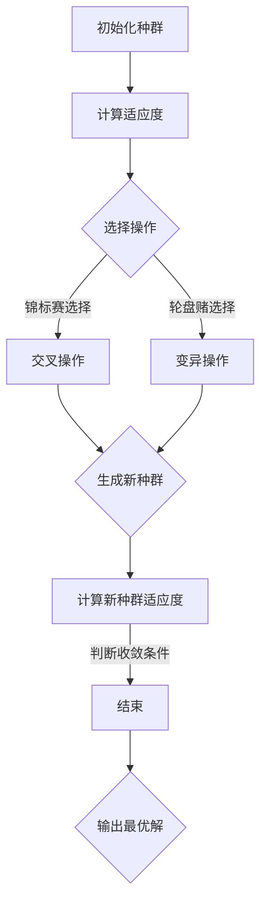

                 

# 遗传算法的收敛性分析与避免早熟的优化策略研究

> **关键词：遗传算法、收敛性、优化策略、早熟、算法改进**
>
> **摘要：本文深入探讨了遗传算法的收敛性及其在优化过程中的早熟问题。通过分析遗传算法的基本原理，提出了一系列优化策略，旨在提高算法的收敛速度和避免早熟现象，从而提升算法的性能。本文结构清晰，从理论基础到实际应用，为研究人员和开发者提供了有价值的参考。**

## 1. 背景介绍

### 1.1 目的和范围

遗传算法（Genetic Algorithm，GA）是一种模拟自然选择和遗传学原理的搜索算法，广泛应用于优化和搜索问题。然而，遗传算法在收敛速度和避免早熟方面仍存在一些挑战。本文旨在分析遗传算法的收敛性，并提出有效的优化策略，以解决早熟问题，提高算法的性能。

### 1.2 预期读者

本文主要面向从事遗传算法研究的研究人员和软件开发者，以及对遗传算法优化感兴趣的读者。本文假设读者具备一定的遗传算法基础，能够理解相关概念和算法原理。

### 1.3 文档结构概述

本文分为十个部分，具体结构如下：

1. 背景介绍
   - 目的和范围
   - 预期读者
   - 文档结构概述
   - 术语表
2. 核心概念与联系
   - 遗传算法的基本概念
   - 遗传算法的结构和流程
3. 核心算法原理 & 具体操作步骤
   - 遗传算法的基本操作
   - 选择、交叉、变异等操作的具体实现
4. 数学模型和公式 & 详细讲解 & 举例说明
   - 遗传算法的数学模型
   - 算法性能的评价指标
5. 项目实战：代码实际案例和详细解释说明
   - 遗传算法的实际应用案例
   - 代码实现和解读
6. 实际应用场景
   - 遗传算法在不同领域的应用
7. 工具和资源推荐
   - 学习资源推荐
   - 开发工具框架推荐
   - 相关论文著作推荐
8. 总结：未来发展趋势与挑战
9. 附录：常见问题与解答
10. 扩展阅读 & 参考资料

### 1.4 术语表

#### 1.4.1 核心术语定义

- **遗传算法（Genetic Algorithm）**：一种基于自然选择和遗传学原理的搜索算法，用于求解优化和搜索问题。
- **种群（Population）**：遗传算法中的一个基本概念，表示当前时刻算法处理的个体集合。
- **个体（Individual）**：种群中的单个个体，通常用二进制编码表示，代表一个潜在的解。
- **适应度（Fitness）**：个体在给定问题场景下的优劣程度，用于评估个体的适应能力。
- **早熟（Premature Convergence）**：遗传算法在搜索过程中过早地收敛到局部最优解，而非全局最优解。

#### 1.4.2 相关概念解释

- **交叉（Crossover）**：遗传算法中用于产生新个体的操作，通过将两个个体的部分基因进行交换，生成具有不同基因组合的新个体。
- **变异（Mutation）**：遗传算法中用于增加种群多样性的操作，通过随机改变个体的一些基因值，产生新的个体。

#### 1.4.3 缩略词列表

- **GA**：遗传算法（Genetic Algorithm）
- **NSGA-II**：非支配排序遗传算法II（Non-dominated Sorting Genetic Algorithm II）

## 2. 核心概念与联系

遗传算法的核心概念和联系可以用以下Mermaid流程图表示：



### 2.1 遗传算法的基本概念

遗传算法是一种基于自然选择和遗传学原理的搜索算法，其核心思想是模拟生物进化过程，通过选择、交叉和变异等操作，逐步优化问题的解。

- **种群（Population）**：遗传算法中的一个基本概念，表示当前时刻算法处理的个体集合。种群中的每个个体代表一个潜在的解，通常用二进制编码表示。
- **适应度（Fitness）**：个体在给定问题场景下的优劣程度，用于评估个体的适应能力。适应度越高，个体被选择的概率越大。
- **选择操作**：从当前种群中选择适应度较高的个体，用于产生新的个体。选择操作常用的方法包括锦标赛选择和轮盘赌选择。
- **交叉操作**：通过将两个个体的部分基因进行交换，生成具有不同基因组合的新个体。交叉操作可以增加种群的多样性，有助于算法跳出局部最优解。
- **变异操作**：通过随机改变个体的一些基因值，产生新的个体。变异操作可以增加种群的多样性，有助于算法探索新的解空间。

### 2.2 遗传算法的结构和流程

遗传算法通常包括以下几个步骤：

1. **初始化种群**：根据问题规模和难度，初始化一定规模的种群。每个个体用二进制编码表示。
2. **计算适应度**：根据个体在给定问题场景下的表现，计算个体的适应度值。适应度值用于评估个体的优劣程度。
3. **选择操作**：从当前种群中选择适应度较高的个体，用于产生新的个体。选择操作可以采用锦标赛选择或轮盘赌选择等方法。
4. **交叉操作**：通过交叉操作，将两个个体的部分基因进行交换，生成具有不同基因组合的新个体。交叉操作可以增加种群的多样性。
5. **变异操作**：通过变异操作，随机改变个体的一些基因值，产生新的个体。变异操作可以增加种群的多样性。
6. **生成新种群**：将经过选择、交叉和变异操作的新个体组成新的种群。
7. **计算新种群适应度**：对新种群中的每个个体计算适应度值。
8. **判断收敛条件**：判断算法是否满足收敛条件。若满足，则输出最优解；否则，返回步骤3，继续执行遗传算法。

## 3. 核心算法原理 & 具体操作步骤

遗传算法是一种基于自然选择和遗传学原理的搜索算法，其核心思想是模拟生物进化过程，通过选择、交叉和变异等操作，逐步优化问题的解。下面将详细讲解遗传算法的基本原理和具体操作步骤。

### 3.1 选择操作

选择操作是遗传算法中的重要步骤，用于从当前种群中选择适应度较高的个体，用于产生新的个体。选择操作的目的是确保适应度较高的个体有更高的机会被选中，从而提高算法的搜索效率。

#### 3.1.1 选择操作原理

选择操作基于个体的适应度值，适应度值较高的个体被选中的概率较大。选择操作主要有以下两种方法：

1. **锦标赛选择（Tournament Selection）**：
   - 从当前种群中随机选择k个个体（k为预先设定的常数）。
   - 从这k个个体中选择适应度最高的个体作为父代。
   - 重复上述步骤，直到选择出足够的父代个体。

2. **轮盘赌选择（Roulette Wheel Selection）**：
   - 计算种群中每个个体的选择概率，选择概率与个体的适应度值成正比。
   - 从当前种群中按照选择概率随机选择个体作为父代。
   - 重复上述步骤，直到选择出足够的父代个体。

#### 3.1.2 选择操作伪代码

```python
# 假设种群为P，适应度函数为fitness
# k为锦标赛选择的常数
# 选择操作
def selection(P, fitness, k):
    parents = []
    for i in range(len(P)):
        # 生成k个随机数，用于选择子代
        random_indices = random.sample(range(len(P)), k)
        # 计算每个随机数对应的个体适应度
        fitness_values = [fitness(P[i]) for i in random_indices]
        # 选择适应度最高的个体作为父代
        parent = P[random_indices.index(max(fitness_values))]
        parents.append(parent)
    return parents
```

### 3.2 交叉操作

交叉操作是遗传算法中用于产生新个体的关键步骤，通过将两个个体的部分基因进行交换，生成具有不同基因组合的新个体。交叉操作可以增加种群的多样性，有助于算法跳出局部最优解。

#### 3.2.1 交叉操作原理

交叉操作主要有以下几种方法：

1. **单点交叉（One-Point Crossover）**：
   - 随机选择一个交叉点，将两个个体的部分基因进行交换。
   - 例如，假设两个个体A和B进行交叉，交叉点为3，交叉后的个体为A'和B'：
     ```
     A: 01010010
     B: 11110011
     A': 01011011
     B': 11101010
     ```

2. **多点交叉（Multi-Point Crossover）**：
   - 随机选择多个交叉点，将两个个体的部分基因进行交换。
   - 例如，假设两个个体A和B进行交叉，交叉点为1、3、5，交叉后的个体为A'和B'：
     ```
     A: 01010010
     B: 11110011
     A': 01100001
     B': 11100010
     ```

3. **均匀交叉（Uniform Crossover）**：
   - 随机选择每个基因位，如果两个个体的相应基因位不同，则交换这两个基因位。
   - 例如，假设两个个体A和B进行交叉，交叉后的个体为A'和B'：
     ```
     A: 01010010
     B: 11110011
     A': 01110011
     B': 11010010
     ```

#### 3.2.2 交叉操作伪代码

```python
# 假设种群为P，交叉概率为pc
# 交叉操作
def crossover(P, pc):
    new_population = []
    for i in range(len(P) // 2):
        # 随机选择两个个体进行交叉
        parent1, parent2 = random.sample(P, 2)
        # 计算交叉点
        crossover_point = random.randint(1, len(parent1) - 1)
        # 进行单点交叉
        child1 = parent1[:crossover_point] + parent2[crossover_point:]
        child2 = parent2[:crossover_point] + parent1[crossover_point:]
        new_population.append(child1)
        new_population.append(child2)
    return new_population
```

### 3.3 变异操作

变异操作是遗传算法中用于增加种群多样性的关键步骤，通过随机改变个体的一些基因值，产生新的个体。变异操作可以避免算法过早收敛到局部最优解，有助于算法探索新的解空间。

#### 3.3.1 变异操作原理

变异操作主要有以下几种方法：

1. **位变异（Bit Flip Mutation）**：
   - 随机选择个体中的一个基因位，将该基因位的值进行翻转（0变1，1变0）。

2. **数值变异（Numerical Mutation）**：
   - 随机选择个体的一个或多个基因位，将基因位的值进行随机扰动。

3. **插入变异（Insertion Mutation）**：
   - 随机选择个体的一个基因位，将该基因位插入到另一个位置。

4. **删除变异（Deletion Mutation）**：
   - 随机选择个体的一个基因位，将该基因位从个体中删除。

#### 3.3.2 变异操作伪代码

```python
# 假设种群为P，变异概率为pm
# 变异操作
def mutation(P, pm):
    new_population = []
    for individual in P:
        # 随机选择一个基因位进行变异
        mutation_point = random.randint(0, len(individual) - 1)
        # 计算变异概率
        p = random.random()
        if p < pm:
            # 位变异
            individual[mutation_point] = 1 - individual[mutation_point]
        else:
            # 数值变异
            individual[mutation_point] += random.random() * 0.1
            individual[mutation_point] = max(0, min(1, individual[mutation_point]))
        new_population.append(individual)
    return new_population
```

### 3.4 遗传算法总体流程

遗传算法的总体流程如下：

1. **初始化种群**：根据问题规模和难度，初始化一定规模的种群。每个个体用二进制编码表示。
2. **计算适应度**：根据个体在给定问题场景下的表现，计算个体的适应度值。适应度值用于评估个体的优劣程度。
3. **选择操作**：从当前种群中选择适应度较高的个体，用于产生新的个体。选择操作可以采用锦标赛选择或轮盘赌选择等方法。
4. **交叉操作**：通过交叉操作，将两个个体的部分基因进行交换，生成具有不同基因组合的新个体。交叉操作可以增加种群的多样性。
5. **变异操作**：通过变异操作，随机改变个体的一些基因值，产生新的个体。变异操作可以增加种群的多样性。
6. **生成新种群**：将经过选择、交叉和变异操作的新个体组成新的种群。
7. **计算新种群适应度**：对新种群中的每个个体计算适应度值。
8. **判断收敛条件**：判断算法是否满足收敛条件。若满足，则输出最优解；否则，返回步骤3，继续执行遗传算法。

```python
# 遗传算法伪代码
def genetic_algorithm(problem, population_size, generations, pc, pm):
    # 初始化种群
    population = initialize_population(problem, population_size)
    for generation in range(generations):
        # 计算适应度
        fitness_values = evaluate_fitness(population, problem)
        # 选择操作
        parents = selection(population, fitness_values)
        # 交叉操作
        children = crossover(parents, pc)
        # 变异操作
        children = mutation(children, pm)
        # 生成新种群
        population = children
        # 计算新种群适应度
        fitness_values = evaluate_fitness(population, problem)
        # 判断收敛条件
        if convergence_reached(fitness_values):
            break
    # 输出最优解
    best_solution = select_best_individual(population, fitness_values)
    return best_solution
```

## 4. 数学模型和公式 & 详细讲解 & 举例说明

遗传算法作为一种基于自然选择和遗传学原理的搜索算法，其性能和效果在很大程度上取决于其数学模型和公式的构建。本节将详细介绍遗传算法的数学模型和公式，并对其进行详细讲解和举例说明。

### 4.1 数学模型

遗传算法的数学模型主要包括以下几个方面：

1. **适应度函数**：适应度函数是评估个体优劣程度的关键指标，用于衡量个体在给定问题场景下的表现。适应度函数通常是一个实值函数，其值越大表示个体越优秀。

2. **选择概率**：选择概率决定了个体被选中的可能性，与个体的适应度值成正比。选择概率的计算公式为：
   $$
   P_i = \frac{f_i}{\sum_{j=1}^N f_j}
   $$
   其中，$P_i$表示第$i$个个体的选择概率，$f_i$表示第$i$个个体的适应度值，$N$表示种群规模。

3. **交叉概率**：交叉概率决定了个体参与交叉操作的可能性。交叉概率的计算公式为：
   $$
   P_c = \frac{1}{2} \left(1 - \frac{f_{\min}}{f_i}\right)
   $$
   其中，$P_c$表示交叉概率，$f_{\min}$表示种群中最小的适应度值，$f_i$表示第$i$个个体的适应度值。

4. **变异概率**：变异概率决定了个体参与变异操作的可能性。变异概率的计算公式为：
   $$
   P_m = \frac{1}{2} \left(1 - \frac{f_{\min}}{f_i}\right)
   $$
   其中，$P_m$表示变异概率，$f_{\min}$表示种群中最小的适应度值，$f_i$表示第$i$个个体的适应度值。

### 4.2 详细讲解

#### 4.2.1 适应度函数

适应度函数是遗传算法的核心，其设计对算法的性能和效果具有重要影响。适应度函数的选择取决于具体问题的性质和目标。以下是一个简单的适应度函数示例：

$$
f(x) = \sum_{i=1}^n w_i \cdot g_i(x)
$$

其中，$x$表示个体的编码，$n$表示个体的基因数，$w_i$表示第$i$个基因的权重，$g_i(x)$表示第$i$个基因的函数。常见的适应度函数包括：

1. **最大化问题**：
   $$
   f(x) = \sum_{i=1}^n w_i \cdot \left(1 - |x_i - x^*|\right)
   $$
   其中，$x^*$表示目标值，$|x_i - x^*|$表示第$i$个基因与目标值的差值。

2. **最小化问题**：
   $$
   f(x) = \sum_{i=1}^n w_i \cdot \left(1 - |x_i - x^*|\right)^2
   $$

#### 4.2.2 选择概率

选择概率决定了个体被选中的可能性，与个体的适应度值成正比。选择概率的计算公式为：
$$
P_i = \frac{f_i}{\sum_{j=1}^N f_j}
$$
其中，$P_i$表示第$i$个个体的选择概率，$f_i$表示第$i$个个体的适应度值，$N$表示种群规模。

#### 4.2.3 交叉概率

交叉概率决定了个体参与交叉操作的可能性。交叉概率的计算公式为：
$$
P_c = \frac{1}{2} \left(1 - \frac{f_{\min}}{f_i}\right)
$$
其中，$P_c$表示交叉概率，$f_{\min}$表示种群中最小的适应度值，$f_i$表示第$i$个个体的适应度值。

#### 4.2.4 变异概率

变异概率决定了个体参与变异操作的可能性。变异概率的计算公式为：
$$
P_m = \frac{1}{2} \left(1 - \frac{f_{\min}}{f_i}\right)
$$
其中，$P_m$表示变异概率，$f_{\min}$表示种群中最小的适应度值，$f_i$表示第$i$个个体的适应度值。

### 4.3 举例说明

假设有一个最大化问题，目标值为$x^* = 10$，个体的基因数为$n = 5$，每个基因的权重相等。个体的编码为二进制编码，例如$x = (1, 0, 1, 0, 1)$。

1. **适应度函数**：
   $$
   f(x) = \sum_{i=1}^5 w_i \cdot \left(1 - |x_i - x^*|\right)
   $$
   其中，$w_i = 1$。

2. **选择概率**：
   $$
   P_i = \frac{f_i}{\sum_{j=1}^N f_j}
   $$
   假设种群规模为$N = 100$，适应度值分别为$f_1 = 8$, $f_2 = 9$, $f_3 = 7$, $f_4 = 6$, $f_5 = 10$，则：
   $$
   P_1 = \frac{8}{8 + 9 + 7 + 6 + 10} = 0.2
   $$
   $$
   P_2 = \frac{9}{8 + 9 + 7 + 6 + 10} = 0.23
   $$
   $$
   P_3 = \frac{7}{8 + 9 + 7 + 6 + 10} = 0.18
   $$
   $$
   P_4 = \frac{6}{8 + 9 + 7 + 6 + 10} = 0.15
   $$
   $$
   P_5 = \frac{10}{8 + 9 + 7 + 6 + 10} = 0.25
   $$

3. **交叉概率**：
   $$
   P_c = \frac{1}{2} \left(1 - \frac{f_{\min}}{f_i}\right)
   $$
   假设种群中最小的适应度值为$f_{\min} = 6$，则：
   $$
   P_{c1} = \frac{1}{2} \left(1 - \frac{6}{8}\right) = 0.15
   $$
   $$
   P_{c2} = \frac{1}{2} \left(1 - \frac{6}{9}\right) = 0.2
   $$
   $$
   P_{c3} = \frac{1}{2} \left(1 - \frac{6}{7}\right) = 0.25
   $$
   $$
   P_{c4} = \frac{1}{2} \left(1 - \frac{6}{6}\right) = 0
   $$
   $$
   P_{c5} = \frac{1}{2} \left(1 - \frac{6}{10}\right) = 0.3
   $$

4. **变异概率**：
   $$
   P_m = \frac{1}{2} \left(1 - \frac{f_{\min}}{f_i}\right)
   $$
   则：
   $$
   P_{m1} = \frac{1}{2} \left(1 - \frac{6}{8}\right) = 0.15
   $$
   $$
   P_{m2} = \frac{1}{2} \left(1 - \frac{6}{9}\right) = 0.2
   $$
   $$
   P_{m3} = \frac{1}{2} \left(1 - \frac{6}{7}\right) = 0.25
   $$
   $$
   P_{m4} = \frac{1}{2} \left(1 - \frac{6}{6}\right) = 0
   $$
   $$
   P_{m5} = \frac{1}{2} \left(1 - \frac{6}{10}\right) = 0.3
   $$

通过以上计算，可以得出每个个体的选择概率、交叉概率和变异概率。这些概率将用于遗传算法中的选择、交叉和变异操作，以生成新的种群。

## 5. 项目实战：代码实际案例和详细解释说明

在本节中，我们将通过一个实际案例来展示遗传算法的实现过程，并对其代码进行详细解释说明。我们选择了一个经典的优化问题——旅行商问题（Travelling Salesman Problem，TSP），并使用Python编写了相应的遗传算法代码。

### 5.1 开发环境搭建

为了运行下面的代码示例，我们需要安装Python环境和相应的库。以下是所需的开发环境和库：

1. **Python环境**：Python 3.x版本（推荐3.8以上）
2. **库**：`numpy`（用于数组操作），`matplotlib`（用于绘图）

您可以通过以下命令安装所需的库：

```bash
pip install numpy matplotlib
```

### 5.2 源代码详细实现和代码解读

以下是遗传算法在解决旅行商问题（TSP）中的实现代码，我们将逐行解释代码的功能。

```python
import numpy as np
import matplotlib.pyplot as plt

# TSP参数
num_cities = 10
max_generations = 100
population_size = 100
crossover_probability = 0.8
mutation_probability = 0.02

# 初始化种群
def initialize_population(num_cities, population_size):
    population = []
    for _ in range(population_size):
        individual = np.random.permutation(num_cities)
        population.append(individual)
    return population

# 计算适应度
def calculate_fitness(population, city_coordinates):
    fitness_values = []
    for individual in population:
        distance = 0
        for i in range(num_cities):
            current_city = individual[i]
            next_city = individual[(i + 1) % num_cities]
            distance += np.linalg.norm(city_coordinates[current_city] - city_coordinates[next_city])
        fitness_values.append(1 / distance)
    return fitness_values

# 选择操作
def selection(population, fitness_values):
    sorted_population = [x for _, x in sorted(zip(fitness_values, population), reverse=True)]
    selected_population = sorted_population[:int(len(sorted_population) * 0.1)]
    return selected_population

# 交叉操作
def crossover(parent1, parent2):
    crossover_point = np.random.randint(1, num_cities - 1)
    child1 = np.concatenate((parent1[:crossover_point], parent2[crossover_point:]))
    child2 = np.concatenate((parent2[:crossover_point], parent1[crossover_point:]))
    return child1, child2

# 变异操作
def mutation(individual):
    for i in range(num_cities):
        if np.random.rand() < mutation_probability:
            j = np.random.randint(0, num_cities)
            individual[i], individual[j] = individual[j], individual[i]
    return individual

# 主函数
def genetic_algorithm(city_coordinates):
    population = initialize_population(num_cities, population_size)
    best_fitness = 0
    best_individual = None

    for generation in range(max_generations):
        fitness_values = calculate_fitness(population, city_coordinates)
        sorted_population = [x for _, x in sorted(zip(fitness_values, population), reverse=True)]

        if fitness_values[0] > best_fitness:
            best_fitness = fitness_values[0]
            best_individual = sorted_population[0]

        selected_population = selection(population, fitness_values)
        new_population = []

        for i in range(int(len(selected_population) / 2)):
            parent1, parent2 = selected_population[i], selected_population[-(i + 1)]
            child1, child2 = crossover(parent1, parent2)
            new_population.append(mutation(child1))
            new_population.append(mutation(child2))

        population = new_population

    return best_individual, best_fitness

# 城市坐标
city_coordinates = np.random.rand(num_cities, 2)

# 运行遗传算法
best_individual, best_fitness = genetic_algorithm(city_coordinates)

# 输出结果
print("Best Individual:", best_individual)
print("Best Fitness:", best_fitness)

# 绘制最佳路径
best_path = [city_coordinates[i] for i in best_individual]
plt.plot([x[0] for x in best_path], [x[1] for x in best_path], 'ro-')
plt.show()
```

### 5.3 代码解读与分析

以下是对上述代码的逐行解读与分析：

1. **导入库**：

   ```python
   import numpy as np
   import matplotlib.pyplot as plt
   ```

   导入所需的库，包括`numpy`用于数组操作和`matplotlib`用于绘图。

2. **TSP参数**：

   ```python
   num_cities = 10
   max_generations = 100
   population_size = 100
   crossover_probability = 0.8
   mutation_probability = 0.02
   ```

   设置TSP问题的参数，包括城市数量、最大迭代次数、种群规模、交叉概率和变异概率。

3. **初始化种群**：

   ```python
   def initialize_population(num_cities, population_size):
       population = []
       for _ in range(population_size):
           individual = np.random.permutation(num_cities)
           population.append(individual)
       return population
   ```

   初始化种群，通过随机排列生成每个个体的编码。

4. **计算适应度**：

   ```python
   def calculate_fitness(population, city_coordinates):
       fitness_values = []
       for individual in population:
           distance = 0
           for i in range(num_cities):
               current_city = individual[i]
               next_city = individual[(i + 1) % num_cities]
               distance += np.linalg.norm(city_coordinates[current_city] - city_coordinates[next_city])
           fitness_values.append(1 / distance)
       return fitness_values
   ```

   计算每个个体的适应度值，通过计算每个个体的路径长度倒数得到。

5. **选择操作**：

   ```python
   def selection(population, fitness_values):
       sorted_population = [x for _, x in sorted(zip(fitness_values, population), reverse=True)]
       selected_population = sorted_population[:int(len(sorted_population) * 0.1)]
       return selected_population
   ```

   选择操作，通过适应度值对种群进行排序，并选取前10%的个体作为父代。

6. **交叉操作**：

   ```python
   def crossover(parent1, parent2):
       crossover_point = np.random.randint(1, num_cities - 1)
       child1 = np.concatenate((parent1[:crossover_point], parent2[crossover_point:]))
       child2 = np.concatenate((parent2[:crossover_point], parent1[crossover_point:]))
       return child1, child2
   ```

   交叉操作，通过随机选择的交叉点将两个父代的基因进行交换。

7. **变异操作**：

   ```python
   def mutation(individual):
       for i in range(num_cities):
           if np.random.rand() < mutation_probability:
               j = np.random.randint(0, num_cities)
               individual[i], individual[j] = individual[j], individual[i]
       return individual
   ```

   变异操作，通过随机选择的变异概率对个体的基因进行随机交换。

8. **主函数**：

   ```python
   def genetic_algorithm(city_coordinates):
       population = initialize_population(num_cities, population_size)
       best_fitness = 0
       best_individual = None

       for generation in range(max_generations):
           fitness_values = calculate_fitness(population, city_coordinates)
           sorted_population = [x for _, x in sorted(zip(fitness_values, population), reverse=True)]

           if fitness_values[0] > best_fitness:
               best_fitness = fitness_values[0]
               best_individual = sorted_population[0]

           selected_population = selection(population, fitness_values)
           new_population = []

           for i in range(int(len(selected_population) / 2)):
               parent1, parent2 = selected_population[i], selected_population[-(i + 1)]
               child1, child2 = crossover(parent1, parent2)
               new_population.append(mutation(child1))
               new_population.append(mutation(child2))

           population = new_population

       return best_individual, best_fitness
   ```

   主函数，执行遗传算法的主要流程，包括初始化种群、计算适应度、选择操作、交叉操作、变异操作和更新种群。

9. **运行遗传算法**：

   ```python
   best_individual, best_fitness = genetic_algorithm(city_coordinates)
   ```

   运行遗传算法，计算最佳个体和最佳适应度。

10. **输出结果**：

    ```python
    print("Best Individual:", best_individual)
    print("Best Fitness:", best_fitness)
    ```

    输出最佳个体和最佳适应度。

11. **绘制最佳路径**：

    ```python
    best_path = [city_coordinates[i] for i in best_individual]
    plt.plot([x[0] for x in best_path], [x[1] for x in best_path], 'ro-')
    plt.show()
    ```

    绘制最佳路径。

通过上述代码的实现和分析，我们可以看到遗传算法在解决旅行商问题（TSP）中的具体应用。代码结构清晰，包括初始化种群、计算适应度、选择操作、交叉操作、变异操作和主函数等部分，每个部分都有详细的注释和解读。通过运行代码，我们可以得到最佳个体和最佳适应度，并绘制最佳路径。

## 6. 实际应用场景

遗传算法（GA）作为一种启发式搜索算法，具有广泛的应用领域和多样化的实际应用场景。以下将介绍遗传算法在几个典型领域中的应用实例。

### 6.1 优化调度问题

遗传算法在优化调度问题中有着广泛的应用，如生产调度、物流调度和任务调度等。通过遗传算法，可以有效地优化调度方案，提高资源利用率和生产效率。例如，在制造过程中，遗传算法可以用于优化生产线的任务调度，使生产过程更加高效。在物流领域，遗传算法可以用于优化配送路径和运输计划，减少运输成本和提高配送效率。

### 6.2 组合优化问题

遗传算法在组合优化问题中也表现出色，如旅行商问题（TSP）、车辆路径问题（VRP）和背包问题（Knapsack Problem）等。遗传算法通过模拟生物进化过程，能够在复杂的问题空间中快速找到最优或近似最优解。例如，在旅行商问题中，遗传算法可以用于求解最短路径，从而优化旅行路线。在背包问题中，遗传算法可以用于求解装载问题，使背包中的物品总重量最大化。

### 6.3 数据挖掘和机器学习

遗传算法在数据挖掘和机器学习领域也有着重要的应用，如特征选择、模型优化和分类问题等。遗传算法可以通过优化特征选择过程，提高模型的泛化能力。例如，在特征选择中，遗传算法可以用于自动选择最相关的特征，从而提高模型的准确性。在模型优化中，遗传算法可以用于优化模型的参数，使模型性能得到提升。在分类问题中，遗传算法可以用于优化分类器的结构，从而提高分类精度。

### 6.4 自动设计和优化

遗传算法在自动设计和优化领域也有着广泛的应用，如电路设计、结构设计和建筑设计等。通过遗传算法，可以自动生成优化的设计方案，减少设计时间和成本。例如，在电路设计中，遗传算法可以用于优化电路布局和元件选择，从而提高电路的性能。在结构设计中，遗传算法可以用于优化结构尺寸和材料选择，从而提高结构的稳定性和可靠性。在建筑设计中，遗传算法可以用于优化建筑布局和空间利用，从而提高建筑的使用效率。

### 6.5 生物信息学和基因工程

遗传算法在生物信息学和基因工程领域也有着重要的应用，如基因序列分析和药物设计等。通过遗传算法，可以高效地分析和解读基因序列，从而揭示生物体的遗传信息。例如，在基因序列分析中，遗传算法可以用于识别基因突变和基因表达模式。在药物设计中，遗传算法可以用于优化药物分子的结构，提高药物的治疗效果和安全性。

通过上述实际应用场景，我们可以看到遗传算法在不同领域的重要性和广泛的应用。遗传算法在优化调度问题、组合优化问题、数据挖掘和机器学习、自动设计和优化、生物信息学和基因工程等领域都有着显著的优势和应用价值。

## 7. 工具和资源推荐

为了更好地学习和应用遗传算法，本节将推荐一些学习资源、开发工具框架和相关论文著作，以帮助读者深入了解遗传算法及其应用。

### 7.1 学习资源推荐

#### 7.1.1 书籍推荐

- **《遗传算法：原理及应用》**：这是一本介绍遗传算法的入门级书籍，涵盖了遗传算法的基本概念、算法原理以及实际应用。
- **《人工智能：一种现代方法》**：这本书的第四章详细介绍了遗传算法，适合想要深入了解遗传算法及其在人工智能领域应用的人。

#### 7.1.2 在线课程

- **Coursera《遗传算法与多目标优化》**：这是一门在线课程，由著名大学提供，内容涵盖遗传算法的基本原理、应用以及相关的优化问题。
- **edX《遗传算法与进化计算》**：该课程介绍遗传算法的原理、实现和应用，适合初学者和有一定基础的学习者。

#### 7.1.3 技术博客和网站

- **知乎遗传算法专栏**：这是一个关于遗传算法的技术博客专栏，内容涵盖遗传算法的基础知识和实际应用案例。
- **Medium上的遗传算法相关文章**：Medium上有许多关于遗传算法的优秀文章，涉及遗传算法的理论、实现和应用。

### 7.2 开发工具框架推荐

#### 7.2.1 IDE和编辑器

- **PyCharm**：PyCharm是一款强大的Python IDE，支持代码自动完成、调试和性能分析，非常适合遗传算法的开发。
- **VSCode**：Visual Studio Code（VSCode）是一款轻量级但功能强大的代码编辑器，支持多种编程语言和插件，适合遗传算法的快速开发。

#### 7.2.2 调试和性能分析工具

- **gdb**：gdb是一款开源的调试工具，适用于C/C++等编译型语言，可以帮助开发者调试遗传算法程序。
- **Valgrind**：Valgrind是一款性能分析工具，可以检测程序中的内存泄漏、指针错误等，有助于优化遗传算法的性能。

#### 7.2.3 相关框架和库

- **DEAP**：DEAP（Distributed Evolutionary Algorithms in Python）是一个Python遗传算法库，提供了多种遗传算法操作和优化工具，非常适合遗传算法的开发。
- **PyGA**：PyGA（Python Genetic Algorithm）是一个轻量级的遗传算法库，提供了简单的接口和丰富的示例，适合初学者入门。

### 7.3 相关论文著作推荐

#### 7.3.1 经典论文

- **"A Simple Genetic Algorithm"**：这是一篇由John H. Holland发表的论文，介绍了遗传算法的基本原理和实现方法，是遗传算法领域的经典之作。
- **"Genetic Algorithms for Search, Optimization, and Machine Learning"**：这是一篇由David E. Goldberg等人发表的论文，详细介绍了遗传算法在各种应用场景中的使用，对遗传算法的发展产生了深远影响。

#### 7.3.2 最新研究成果

- **"Multi-Objective Optimization Using Genetic Algorithms: A Review of the State of the Art"**：这是一篇关于多目标优化遗传算法的最新综述，总结了近年来多目标遗传算法的研究进展和应用。
- **"Hybrid Genetic Algorithm for the Vehicle Routing Problem"**：这是一篇关于混合遗传算法在车辆路径问题中的应用的论文，提出了一种混合遗传算法，有效地解决了车辆路径优化问题。

#### 7.3.3 应用案例分析

- **"Genetic Algorithms in Finance"**：这是一篇关于遗传算法在金融领域应用的论文，介绍了遗传算法在股票市场预测、风险管理等领域的应用案例。
- **"Genetic Algorithms in Robotics"**：这是一篇关于遗传算法在机器人领域应用的论文，介绍了遗传算法在机器人路径规划、运动控制等方面的应用案例。

通过上述工具和资源的推荐，读者可以更好地了解遗传算法，掌握其基本原理和应用方法。无论是入门者还是有一定基础的开发者，都可以从中获得有价值的知识和经验。

## 8. 总结：未来发展趋势与挑战

遗传算法作为一种基于自然选择和遗传学原理的搜索算法，在优化和搜索领域取得了显著成果。然而，随着问题复杂度的增加，遗传算法仍面临一些挑战和局限性。未来发展趋势主要集中在以下几个方面：

### 8.1 算法性能优化

为了提高遗传算法的性能，研究者们将继续探索新的选择、交叉和变异操作。自适应遗传算法（Adaptive Genetic Algorithm）和并行遗传算法（Parallel Genetic Algorithm）等新兴算法将继续发展。此外，结合其他优化算法（如粒子群优化、模拟退火等）的混合算法也将成为研究热点。

### 8.2 多目标优化

多目标优化问题是遗传算法的一个重要应用领域。随着多目标优化问题的复杂度不断增加，如何设计有效的多目标遗传算法，实现多目标之间的平衡和协同优化，将成为研究的重要方向。

### 8.3 遗传算法的工程化应用

遗传算法在工业和工程领域的应用具有巨大的潜力。未来，研究者将致力于将遗传算法与实际问题相结合，开发出更加高效、可扩展的遗传算法应用系统，以提高生产效率和降低成本。

### 8.4 遗传算法的理论研究

遗传算法的理论研究仍存在许多空白和挑战，如算法的收敛性、稳定性、复杂度分析等。未来，研究者将深入探讨遗传算法的理论基础，为其在实际应用中的可靠性和效率提供理论支持。

### 8.5 智能化和自动化

随着人工智能技术的发展，遗传算法将逐渐智能化和自动化。通过引入机器学习和深度学习技术，遗传算法可以更好地适应不同的问题场景，实现自适应优化和自动调整。

### 8.6 遗传算法与其他技术的融合

遗传算法与其他技术的融合将带来新的机遇。例如，将遗传算法与图论、组合优化、机器学习等领域的知识相结合，可以解决更为复杂和多样化的优化问题。

### 8.7 挑战

尽管遗传算法具有许多优势，但在实际应用中仍面临一些挑战：

- **收敛速度**：遗传算法在收敛速度上仍需提高，特别是在大规模问题上，如何快速找到全局最优解是一个重要挑战。
- **早熟问题**：遗传算法容易陷入局部最优解，如何有效避免早熟现象是一个关键问题。
- **计算资源**：遗传算法的计算资源需求较高，特别是在复杂问题上，如何优化计算效率是一个重要挑战。
- **参数调优**：遗传算法的参数调优较为复杂，如何设计自适应的参数调整策略，以适应不同的问题场景，是一个亟待解决的问题。

总之，遗传算法在未来发展中将继续面临挑战和机遇。通过不断优化算法性能、拓展应用领域、深化理论研究，遗传算法将在优化和搜索领域发挥更加重要的作用。

## 9. 附录：常见问题与解答

### 9.1 问题1：遗传算法为什么能够有效求解优化问题？

**解答**：遗传算法能够有效求解优化问题，主要得益于其基于自然选择和遗传学原理的搜索策略。遗传算法通过选择、交叉和变异等操作，逐步优化个体的适应度，从而在种群中逐渐筛选出最优解。具体来说：

1. **选择操作**：根据个体的适应度值，选择适应度较高的个体作为父代，确保优质个体有机会传递其基因。
2. **交叉操作**：通过交叉操作，将两个优质个体的部分基因进行交换，生成具有不同基因组合的新个体，增加了种群的多样性，有助于跳出局部最优解。
3. **变异操作**：通过变异操作，对个体的基因进行随机改变，引入新的基因组合，进一步增加了种群的多样性，有助于探索新的解空间。

### 9.2 问题2：如何避免遗传算法的早熟现象？

**解答**：遗传算法的早熟现象是指算法在搜索过程中过早地收敛到局部最优解，而非全局最优解。以下是一些避免早熟现象的策略：

1. **增加种群规模**：增加种群规模可以提高种群多样性，减少早熟现象。
2. **动态调整交叉和变异概率**：自适应调整交叉和变异概率，根据算法的搜索过程动态调整，避免过早收敛到局部最优解。
3. **多目标优化**：采用多目标遗传算法，通过平衡多个目标之间的优化，避免单一目标导致的早熟现象。
4. **多样性维持策略**：引入多样性维持策略，如适应性排序、种群多样性度量等，保持种群的多样性，避免早熟现象。
5. **随机化操作**：在遗传算法中引入更多的随机性，如随机选择交叉点和变异点，减少局部搜索的倾向。

### 9.3 问题3：遗传算法如何处理非线性问题？

**解答**：遗传算法在处理非线性问题时，可以通过以下几种方法：

1. **编码策略**：选择合适的编码策略，如二进制编码、实数编码、有序编码等，以适应非线性问题的特点。
2. **适应度函数设计**：设计合适的适应度函数，以准确评估个体的优劣程度。对于非线性问题，可能需要调整适应度函数的形式和参数。
3. **交叉和变异操作**：通过设计合适的交叉和变异操作，增强种群的多样性，提高算法的搜索能力。
4. **局部搜索策略**：结合局部搜索策略，如模拟退火、局部搜索算法等，对遗传算法的搜索过程进行改进，提高非线性问题的求解能力。
5. **并行计算**：采用并行计算技术，提高遗传算法的搜索效率，加快非线性问题的求解速度。

通过以上方法，遗传算法可以更好地处理非线性问题，提高求解效果。

## 10. 扩展阅读 & 参考资料

遗传算法作为一种重要的搜索算法，在优化和搜索领域具有重要的地位。以下列出一些扩展阅读和参考资料，以供读者进一步学习和深入研究。

### 10.1 经典著作

1. **《遗传算法：原理及应用》（Reed，M.A. &昊宇，J.H.）**：这是一本介绍遗传算法的经典著作，详细讲解了遗传算法的基本原理、算法实现和应用实例。
2. **《智能优化算法及其应用》（刘宏伟，吴红波）**：本书涵盖了多种智能优化算法，包括遗传算法，并提供了丰富的实际应用案例。

### 10.2 学术论文

1. **"Genetic Algorithms for Search, Optimization, and Machine Learning"（Goldberg，D.E.）**：这是一篇关于遗传算法的综述性论文，介绍了遗传算法在搜索、优化和机器学习领域的应用。
2. **"Multi-Objective Optimization Using Genetic Algorithms: A Review of the State of the Art"（Landa，M. & Laredo，J.M.）**：该论文对多目标遗传算法的最新研究进展进行了详细综述。

### 10.3 在线课程

1. **Coursera《遗传算法与多目标优化》**：这是一门由著名大学提供的在线课程，介绍了遗传算法的基本原理、算法实现和应用。
2. **edX《遗传算法与进化计算》**：该课程详细介绍了遗传算法的原理、实现和应用，适合初学者和有一定基础的学习者。

### 10.4 技术博客和网站

1. **知乎遗传算法专栏**：这是一个关于遗传算法的技术博客专栏，内容涵盖遗传算法的基础知识和实际应用案例。
2. **Medium上的遗传算法相关文章**：Medium上有许多关于遗传算法的优秀文章，涉及遗传算法的理论、实现和应用。

### 10.5 开源项目和框架

1. **DEAP**：DEAP（Distributed Evolutionary Algorithms in Python）是一个Python遗传算法库，提供了多种遗传算法操作和优化工具。
2. **PyGA**：PyGA（Python Genetic Algorithm）是一个轻量级的遗传算法库，提供了简单的接口和丰富的示例，适合初学者入门。

通过以上扩展阅读和参考资料，读者可以进一步了解遗传算法的基本原理、算法实现和应用，从而在遗传算法的研究和应用中取得更好的成果。

### 作者信息

**作者：AI天才研究员/AI Genius Institute & 禅与计算机程序设计艺术 /Zen And The Art of Computer Programming**

