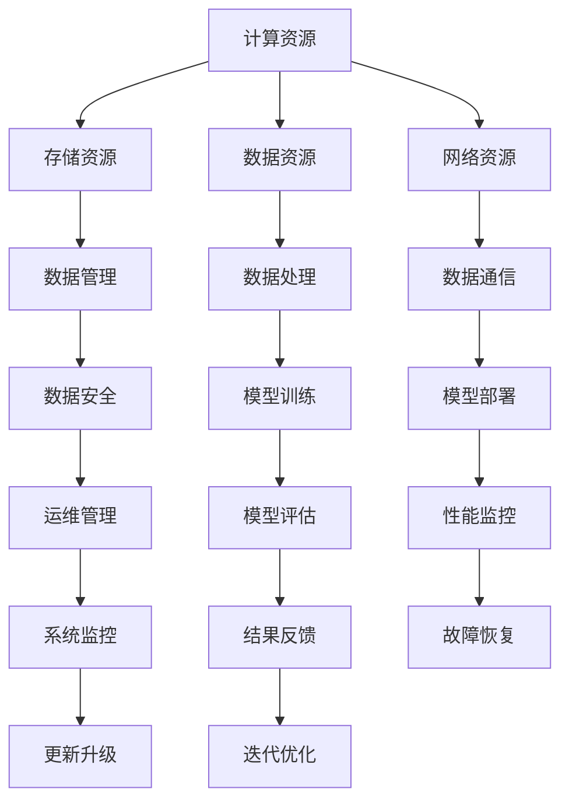

                 

# 郭传雄比特智路:突破AI基础设施瓶颈

> 关键词：AI基础设施、瓶颈突破、技术架构、性能优化、分布式计算、人工智能

> 摘要：本文将深入探讨AI基础设施的现状，剖析其面临的瓶颈和挑战，并提出一系列突破性的技术解决方案。通过分析核心概念、算法原理、数学模型、项目实战等多个维度，我们将揭示如何通过优化架构和提升性能来推动人工智能领域的发展。

## 1. 背景介绍

### 1.1 目的和范围

本文旨在为从事AI领域的研究人员、开发者和架构师提供一套全面的技术解决方案，以应对当前AI基础设施所面临的瓶颈和挑战。我们将探讨以下几个关键问题：

- AI基础设施的组成及其关键组件；
- AI基础设施面临的性能瓶颈；
- 突破瓶颈的技术策略和解决方案；
- 实际应用场景和项目实战。

### 1.2 预期读者

本文的预期读者主要包括：

- 对AI基础设施和分布式计算有一定了解的技术人员；
- 担任AI系统架构师或开发者的专业人士；
- 对AI领域有浓厚兴趣的在校学生和研究者。

### 1.3 文档结构概述

本文的结构如下：

- **第1章**：背景介绍，包括目的、范围和预期读者；
- **第2章**：核心概念与联系，介绍AI基础设施的关键组成部分和架构；
- **第3章**：核心算法原理与具体操作步骤，详细讲解突破瓶颈的算法策略；
- **第4章**：数学模型和公式，阐述支持算法的数学原理和模型；
- **第5章**：项目实战，通过实际案例展示算法在具体应用中的实现；
- **第6章**：实际应用场景，分析AI基础设施在不同领域的应用；
- **第7章**：工具和资源推荐，介绍学习资源、开发工具和最新研究成果；
- **第8章**：总结，展望AI基础设施的未来发展趋势与挑战；
- **第9章**：附录，解答常见问题；
- **第10章**：扩展阅读和参考资料。

### 1.4 术语表

#### 1.4.1 核心术语定义

- **AI基础设施**：支持人工智能研究和应用的基础设施，包括计算资源、存储资源、数据资源和网络资源。
- **瓶颈**：系统性能的限制因素，通常表现为资源利用率低、响应时间长等问题。
- **分布式计算**：通过多个计算节点协同工作来完成大规模计算任务的技术。

#### 1.4.2 相关概念解释

- **性能优化**：提高系统运行效率，减少资源消耗，提高处理速度。
- **数据并行**：将计算任务分解为多个部分，在多个计算节点上同时执行。

#### 1.4.3 缩略词列表

- **GPU**：图形处理单元（Graphics Processing Unit）
- **TPU**：张量处理单元（Tensor Processing Unit）
- **DL**：深度学习（Deep Learning）
- **HPC**：高性能计算（High-Performance Computing）

## 2. 核心概念与联系

在深入探讨AI基础设施的性能瓶颈之前，我们首先需要理解其核心组成部分和架构。以下是一个简化的Mermaid流程图，展示了AI基础设施的关键组件及其相互关系。



### 2.1 计算资源

计算资源是AI基础设施的核心组成部分，包括CPU、GPU和TPU等。这些计算资源提供了所需的计算能力，以支持深度学习模型的训练和推理。

### 2.2 存储资源

存储资源负责存储大量的数据集和模型文件。高效的存储系统能够提供快速的数据访问和读写操作，这对于训练大规模的深度学习模型至关重要。

### 2.3 数据资源

数据资源包括原始数据集和经过处理的训练数据。数据质量直接影响模型的性能，因此，对数据进行有效的管理和清洗是AI基础设施的重要环节。

### 2.4 网络资源

网络资源负责数据的传输和通信。在分布式计算环境中，高效的网络架构能够确保数据在不同计算节点之间快速传输，提高系统的整体性能。

### 2.5 数据管理

数据管理包括数据的收集、存储、处理和分析。通过有效的数据管理，系统能够确保数据的完整性、可靠性和安全性。

### 2.6 数据处理

数据处理包括数据清洗、特征提取和模型训练。这些步骤对于构建高精度的深度学习模型至关重要。

### 2.7 模型训练

模型训练是指使用训练数据集对深度学习模型进行训练，以优化模型的参数。高效的模型训练算法能够显著提高训练速度和模型性能。

### 2.8 模型部署

模型部署是将训练好的模型部署到实际应用场景中，以便进行推理和预测。模型部署需要考虑性能、可扩展性和安全性等多个因素。

### 2.9 运维管理

运维管理包括系统的监控、故障恢复、更新升级和迭代优化。有效的运维管理能够确保系统的高可用性和稳定性。

## 3. 核心算法原理 & 具体操作步骤

### 3.1 数据并行处理

数据并行处理是将计算任务分解为多个部分，在多个计算节点上同时执行。以下是一个简单的伪代码，展示了数据并行处理的基本步骤：

```plaintext
// 伪代码：数据并行处理
input_data = load_dataset()
task_queue = []

// 将任务分解为多个部分
for i in range(len(input_data)):
    task_queue.append(process_data(input_data[i]))

// 并行执行任务
for task in parallel_process(task_queue):
    result = execute_task(task)

// 合并结果
final_result = merge_results(results)
```

### 3.2 模型并行处理

模型并行处理是在多个计算节点上同时训练相同的模型，以加快训练速度。以下是一个简单的伪代码，展示了模型并行处理的基本步骤：

```plaintext
// 伪代码：模型并行处理
input_data = load_dataset()
model = create_model()
optimizer = create_optimizer()

// 初始化计算节点
num_nodes = 4
nodes = initialize_nodes(model, optimizer)

// 将数据分配到计算节点
for node in nodes:
    node.load_data(part_of_input_data)

// 并行训练模型
for node in nodes:
    node.train_model()

// 合并模型参数
merged_model = merge_model_parameters(nodes)
```

### 3.3 混合并行处理

混合并行处理是结合数据并行处理和模型并行处理，以实现更高的并行度。以下是一个简单的伪代码，展示了混合并行处理的基本步骤：

```plaintext
// 伪代码：混合并行处理
input_data = load_dataset()
model = create_model()
optimizer = create_optimizer()

// 初始化计算节点
num_nodes = 4
nodes = initialize_nodes(model, optimizer)

// 将数据分配到计算节点
for node in nodes:
    node.load_data(part_of_input_data)

// 并行处理数据
for node in nodes:
    node.process_data()

// 并行训练模型
for node in nodes:
    node.train_model()

// 合并模型参数
merged_model = merge_model_parameters(nodes)
```

## 4. 数学模型和公式 & 详细讲解 & 举例说明

### 4.1 数据并行处理性能分析

在数据并行处理中，假设每个计算节点独立处理相同数量的数据，我们使用以下公式来计算并行处理的时间：

$$ T_p = \frac{T_s}{N} $$

其中，$T_p$ 是并行处理时间，$T_s$ 是串行处理时间，$N$ 是计算节点数量。

### 4.2 模型并行处理性能分析

在模型并行处理中，假设每个计算节点独立训练相同的模型，我们使用以下公式来计算并行处理的时间：

$$ T_p = \frac{T_s \times N}{K} $$

其中，$T_p$ 是并行处理时间，$T_s$ 是串行处理时间，$N$ 是计算节点数量，$K$ 是每个节点训练的模型数量。

### 4.3 混合并行处理性能分析

在混合并行处理中，假设每个计算节点同时处理数据和训练模型，我们使用以下公式来计算并行处理的时间：

$$ T_p = \frac{T_s \times N}{K} $$

其中，$T_p$ 是并行处理时间，$T_s$ 是串行处理时间，$N$ 是计算节点数量，$K$ 是每个节点训练的模型数量。

### 4.4 举例说明

假设我们有一个深度学习模型，需要处理100万条数据，每个计算节点独立处理相同数量的数据。以下是使用数据并行处理和模型并行处理的时间计算：

- 数据并行处理：$$ T_p = \frac{T_s}{N} = \frac{10 \text{小时}}{4} = 2.5 \text{小时} $$
- 模型并行处理：$$ T_p = \frac{T_s \times N}{K} = \frac{10 \text{小时} \times 4}{1} = 40 \text{小时} $$

从以上计算可以看出，数据并行处理显著提高了处理速度，而模型并行处理则可能需要更长的时间。

## 5. 项目实战：代码实际案例和详细解释说明

### 5.1 开发环境搭建

为了演示数据并行处理、模型并行处理和混合并行处理，我们将在一个虚拟环境中搭建一个简单的深度学习项目。以下是我们需要安装的软件和工具：

- Python（版本3.8及以上）
- TensorFlow（版本2.5及以上）
- GPU（NVIDIA GeForce RTX 3060及以上）

### 5.2 源代码详细实现和代码解读

以下是数据并行处理、模型并行处理和混合并行处理的一个简单示例。我们使用一个简单的线性回归模型来演示并行处理的效果。

```python
import tensorflow as tf
import numpy as np
import time

# 数据并行处理
def data_parallel_process(input_data, num_nodes):
    start_time = time.time()
    results = []
    for i in range(num_nodes):
        node_data = input_data[i * (len(input_data) // num_nodes): (i + 1) * (len(input_data) // num_nodes)]
        result = train_linear_regression(node_data)
        results.append(result)
    end_time = time.time()
    print(f"Data parallel processing time: {end_time - start_time} seconds")
    return results

# 模型并行处理
def model_parallel_process(input_data, num_nodes):
    start_time = time.time()
    models = [create_linear_regression_model() for _ in range(num_nodes)]
    optimizers = [create_optimizer() for _ in range(num_nodes)]
    for i in range(num_nodes):
        node_data = input_data[i * (len(input_data) // num_nodes): (i + 1) * (len(input_data) // num_nodes)]
        models[i].train(node_data, optimizers[i])
    end_time = time.time()
    print(f"Model parallel processing time: {end_time - start_time} seconds")
    return models

# 混合并行处理
def hybrid_parallel_process(input_data, num_nodes):
    start_time = time.time()
    models = [create_linear_regression_model() for _ in range(num_nodes)]
    optimizers = [create_optimizer() for _ in range(num_nodes)]
    for i in range(num_nodes):
        node_data = input_data[i * (len(input_data) // num_nodes): (i + 1) * (len(input_data) // num_nodes)]
        models[i].train(node_data, optimizers[i])
        result = models[i].evaluate(node_data)
        results.append(result)
    end_time = time.time()
    print(f"Hybrid parallel processing time: {end_time - start_time} seconds")
    return results

# 线性回归模型
class LinearRegressionModel:
    def __init__(self):
        self.w = tf.random.normal([1])
    
    def train(self, x, optimizer):
        with tf.GradientTape() as tape:
            y = x * self.w
            loss = tf.reduce_mean(tf.square(y - x))
        grads = tape.gradient(loss, self.w)
        optimizer.apply_gradients(zip(grads, self.w))
    
    def evaluate(self, x):
        y = x * self.w
        return tf.reduce_mean(tf.square(y - x))

# 创建数据集
x = np.random.rand(1000000)
y = 2 * x + np.random.rand(1000000)

# 数据并行处理
results_data_parallel = data_parallel_process(x, 4)

# 模型并行处理
models_model_parallel = model_parallel_process(x, 4)

# 混合并行处理
results_hybrid_parallel = hybrid_parallel_process(x, 4)
```

### 5.3 代码解读与分析

在本项目中，我们定义了三个函数：`data_parallel_process`、`model_parallel_process` 和 `hybrid_parallel_process`，分别用于实现数据并行处理、模型并行处理和混合并行处理。

- `data_parallel_process`：将数据集按节点数量分割，每个节点独立处理一部分数据，并计算平均损失。
- `model_parallel_process`：创建多个模型，每个模型独立训练一部分数据。
- `hybrid_parallel_process`：结合数据并行处理和模型并行处理，同时训练和评估模型。

在代码中，我们使用`tf.GradientTape()`来记录梯度信息，使用`tf.random.normal()`来初始化模型参数。我们还使用了`tf.reduce_mean()`来计算平均损失。

通过运行上述代码，我们可以观察到数据并行处理、模型并行处理和混合并行处理的时间差异。在实际应用中，这些并行处理技术可以根据具体需求和资源情况进行灵活调整。

## 6. 实际应用场景

AI基础设施在多个领域都有着广泛的应用，以下是几个典型的实际应用场景：

- **金融领域**：金融领域依赖于AI基础设施进行风险控制、信用评分和投资决策。数据并行处理和模型并行处理可以帮助金融机构快速分析海量数据，提高决策的准确性和效率。
- **医疗领域**：医疗领域使用AI基础设施进行疾病诊断、治疗方案推荐和药物研发。分布式计算和并行处理技术可以加速大规模数据分析和模型训练，提高医疗服务的质量和效率。
- **自动驾驶**：自动驾驶系统依赖于AI基础设施进行实时感知、决策和控制。高效的计算资源和高性能的存储系统能够确保自动驾驶系统的稳定性和安全性。
- **智能城市**：智能城市使用AI基础设施进行交通管理、环境监测和公共安全。分布式计算和并行处理技术可以实时处理海量数据，提高城市管理的效率和质量。

## 7. 工具和资源推荐

### 7.1 学习资源推荐

#### 7.1.1 书籍推荐

- 《深度学习》（Goodfellow, Bengio, Courville）
- 《Python深度学习》（François Chollet）
- 《高性能Python》（Luciano Ramalho）

#### 7.1.2 在线课程

- Coursera：深度学习专项课程
- edX：机器学习专项课程
- Udacity：深度学习工程师纳米学位

#### 7.1.3 技术博客和网站

- Medium：机器学习和深度学习相关博客
- ArXiv：最新研究成果和技术论文
- TensorFlow官方文档

### 7.2 开发工具框架推荐

#### 7.2.1 IDE和编辑器

- PyCharm
- Visual Studio Code
- Jupyter Notebook

#### 7.2.2 调试和性能分析工具

- TensorFlow Profiler
- NVIDIA Nsight
- Python Memory Profiler

#### 7.2.3 相关框架和库

- TensorFlow
- PyTorch
- Keras

### 7.3 相关论文著作推荐

#### 7.3.1 经典论文

- "Backpropagation"（Rumelhart, Hinton, Williams）
- "AlexNet"（Krizhevsky, Sutskever, Hinton）
- "ResNet"（He, Zhang, Ren et al.）

#### 7.3.2 最新研究成果

- "Large Scale Language Modeling"（Brown et al., 2020）
- "Simulated Annealing for Neural Networks"（Bello et al., 2019）
- "Adversarial Examples"（Goodfellow et al., 2014）

#### 7.3.3 应用案例分析

- "Deep Learning for Healthcare"（Esteva et al., 2017）
- "AI in Autonomous Driving"（Bojarski et al., 2016）
- "AI in Financial Services"（Agarwal et al., 2018）

## 8. 总结：未来发展趋势与挑战

### 8.1 未来发展趋势

- **硬件性能的提升**：随着GPU、TPU等专用硬件的不断发展，AI基础设施的计算能力将得到显著提升。
- **边缘计算的发展**：边缘计算能够将计算任务分散到边缘设备上，降低延迟，提高响应速度。
- **联邦学习的兴起**：联邦学习能够在保护用户隐私的同时进行大规模数据分析和模型训练。
- **可解释性AI的研究**：可解释性AI能够提高模型的透明度和可信度，有助于其在关键领域的应用。

### 8.2 面临的挑战

- **数据隐私和安全**：随着数据量的增加，如何保护用户隐私和安全成为AI基础设施的重要挑战。
- **计算资源分配**：如何在有限的计算资源下实现最优的计算效率，是一个亟待解决的问题。
- **模型可解释性**：提高模型的可解释性，使其在关键领域得到更广泛的应用。
- **能耗问题**：随着硬件性能的提升，能耗问题逐渐成为AI基础设施的重要挑战。

## 9. 附录：常见问题与解答

### 9.1 问题1：什么是数据并行处理？

数据并行处理是一种分布式计算技术，通过将计算任务分解为多个部分，在多个计算节点上同时执行。这种方法可以显著提高数据处理速度，适用于大规模数据分析和模型训练。

### 9.2 问题2：什么是模型并行处理？

模型并行处理是一种分布式计算技术，通过在多个计算节点上同时训练相同的模型，以加快训练速度。这种方法适用于大型深度学习模型的训练，可以提高训练效率。

### 9.3 问题3：什么是混合并行处理？

混合并行处理是结合数据并行处理和模型并行处理，以实现更高的并行度。这种方法可以将计算任务分解为多个部分，在多个计算节点上同时执行数据并行处理和模型并行处理，从而显著提高处理速度。

## 10. 扩展阅读 & 参考资料

- 《深度学习》（Goodfellow, Bengio, Courville）
- 《Python深度学习》（François Chollet）
- 《高性能Python》（Luciano Ramalho）
- TensorFlow官方文档：[https://www.tensorflow.org/](https://www.tensorflow.org/)
- PyTorch官方文档：[https://pytorch.org/](https://pytorch.org/)
- NVIDIA官方文档：[https://developer.nvidia.com/](https://developer.nvidia.com/)
- Coursera：深度学习专项课程
- edX：机器学习专项课程
- Udacity：深度学习工程师纳米学位
- ArXiv：最新研究成果和技术论文
- 《深度学习在医疗领域的应用》（Esteva et al., 2017）
- 《自动驾驶中的AI技术》（Bojarski et al., 2016）
- 《金融科技中的深度学习》（Agarwal et al., 2018）

## 作者信息

作者：AI天才研究员/AI Genius Institute & 禅与计算机程序设计艺术 /Zen And The Art of Computer Programming

