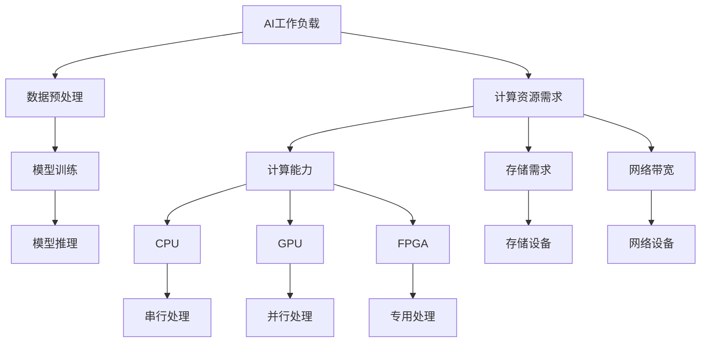

                 

# 重塑计算机架构：为AI工作负载量身打造

> **关键词：计算机架构、AI工作负载、性能优化、高效设计、资源管理、异构计算、并行处理**

> **摘要：本文将深入探讨如何针对AI工作负载优化计算机架构，从核心概念、算法原理、数学模型到实际应用，全面分析并阐述如何设计高效、可靠的计算机系统，以应对日益增长的人工智能需求。**

## 1. 背景介绍

### 1.1 目的和范围

本文的目的是介绍并探讨如何针对AI工作负载设计高性能、可扩展的计算机架构。我们将分析现有技术的局限，提出优化方案，并通过具体的算法和数学模型来解释这些方案的原理。文章将涵盖以下范围：

- AI工作负载的特点和需求
- 计算机架构的核心概念和设计原则
- 高效计算策略和资源管理方法
- 并行处理和异构计算的应用

### 1.2 预期读者

本文面向对计算机架构和人工智能有基本了解的读者，包括计算机科学家、软件工程师、AI研究人员和技术爱好者。特别适合那些希望深入了解AI工作负载优化策略的从业人员。

### 1.3 文档结构概述

本文将按以下结构展开：

- **第1章：背景介绍** - 概述文章的目的、读者对象和结构。
- **第2章：核心概念与联系** - 介绍计算机架构和AI工作负载相关的核心概念，并使用流程图展示其联系。
- **第3章：核心算法原理与具体操作步骤** - 详细讲解算法原理，并提供伪代码示例。
- **第4章：数学模型和公式** - 阐述相关的数学模型，使用LaTeX格式展示公式，并进行举例说明。
- **第5章：项目实战** - 通过实际代码案例展示架构设计在实际开发中的应用。
- **第6章：实际应用场景** - 分析AI工作负载在不同领域中的应用。
- **第7章：工具和资源推荐** - 推荐学习和开发资源。
- **第8章：总结：未来发展趋势与挑战** - 总结文章内容，展望未来发展方向。
- **第9章：附录：常见问题与解答** - 提供常见问题的解答。
- **第10章：扩展阅读与参考资料** - 列出相关的扩展阅读材料。

### 1.4 术语表

#### 1.4.1 核心术语定义

- **AI工作负载**：指人工智能任务在计算机系统上的执行过程，包括训练和推理。
- **计算机架构**：指计算机系统的整体设计和组织结构，包括硬件和软件的配置。
- **异构计算**：指在同一个计算系统中，使用不同类型和架构的处理器协同工作。
- **并行处理**：指同时执行多个计算任务，以加快处理速度。
- **资源管理**：指在计算机系统中有效分配和管理硬件和软件资源。

#### 1.4.2 相关概念解释

- **深度学习**：一种基于人工神经网络的学习方法，通过多层神经网络对数据进行建模。
- **GPU加速**：利用图形处理单元（GPU）的高并行计算能力，加速计算密集型任务。
- **异构计算架构**：利用不同类型的处理器（如CPU、GPU、FPGA等）协同工作的计算架构。

#### 1.4.3 缩略词列表

- **AI**：人工智能（Artificial Intelligence）
- **GPU**：图形处理单元（Graphics Processing Unit）
- **CPU**：中央处理单元（Central Processing Unit）
- **FPGA**：现场可编程门阵列（Field-Programmable Gate Array）
- **DL**：深度学习（Deep Learning）
- **HPC**：高性能计算（High-Performance Computing）

## 2. 核心概念与联系

### 2.1 核心概念

为了深入探讨如何为AI工作负载优化计算机架构，我们需要先了解几个关键概念：

1. **AI工作负载**：AI工作负载通常涉及大量的数据预处理、模型训练和推理过程。这些过程对计算资源和速度有着极高的要求。
2. **计算机架构**：计算机架构决定了硬件和软件资源如何组织、配置和利用。一个高效的设计能够最大化资源利用率，提高系统性能。
3. **异构计算**：异构计算利用不同类型的处理器协同工作，以实现更高的计算效率。例如，GPU在并行计算任务中具有显著优势，而CPU在串行任务中表现更佳。
4. **并行处理**：并行处理通过同时执行多个任务来提高计算效率。这对于处理大规模数据集和复杂计算任务尤为重要。
5. **资源管理**：资源管理涉及硬件和软件资源的分配和调度，以确保系统在不同工作负载下的稳定性和效率。

### 2.2 计算机架构与AI工作负载的联系

为了更好地理解计算机架构与AI工作负载之间的关系，我们可以使用Mermaid流程图来展示它们的关键联系：



在这个流程图中，我们可以看到AI工作负载涉及到数据预处理、模型训练和推理等过程。这些过程对计算能力、存储需求和网络带宽有较高的要求。计算机架构的设计需要考虑到这些需求，并通过异构计算和并行处理来优化性能。CPU、GPU和FPGA等不同类型的处理器在特定任务中具有优势，因此合理的架构设计能够充分利用这些处理器的特性。

## 3. 核心算法原理与具体操作步骤

### 3.1 算法原理

为了实现AI工作负载的高效计算，我们采用以下核心算法原理：

1. **分布式计算**：将计算任务分布在多个节点上，以充分利用并行处理的优势。
2. **模型并行**：将神经网络模型拆分为多个部分，同时在不同的处理器上并行执行。
3. **数据并行**：将训练数据集划分为多个子集，并在不同的处理器上并行训练。
4. **流水线并行**：将神经网络的前向传播和反向传播过程划分为多个阶段，并在不同阶段中并行执行。

### 3.2 具体操作步骤

以下是实现这些算法原理的具体操作步骤：

#### 分布式计算

```python
# 分布式计算伪代码
def distributed_computation(task, num_nodes):
    # 初始化分布式计算环境
    init_distributed_environment(num_nodes)

    # 将任务分配到不同的节点
    tasks = split_task(task, num_nodes)

    # 启动计算节点
    start_nodes(tasks)

    # 等待所有节点完成任务
    wait_for_completion()

    # 合并结果
    result = aggregate_results()

    return result
```

#### 模型并行

```python
# 模型并行伪代码
def model_parallelism(model, num_devices):
    # 将模型拆分为多个部分
    parts = split_model(model, num_devices)

    # 在不同的设备上并行训练每个模型部分
    for part in parts:
        train_model(part)

    # 合并模型部分
    merged_model = merge_models(parts)

    return merged_model
```

#### 数据并行

```python
# 数据并行伪代码
def data_parallelism(data, num_devices):
    # 将数据集划分为多个子集
    subsets = split_data(data, num_devices)

    # 在不同的设备上并行训练每个子集
    for subset in subsets:
        train_on_subset(subset)

    # 合并训练结果
    merged_result = aggregate_training_results()

    return merged_result
```

#### 流水线并行

```python
# 流水线并行伪代码
def pipeline_parallelism(model, data):
    # 将前向传播和反向传播划分为多个阶段
    forward_stages = split_forward_pass(model)
    backward_stages = split_backward_pass(model)

    # 在不同阶段并行执行前向传播
    for stage in forward_stages:
        forward_stage(stage)

    # 在不同阶段并行执行反向传播
    for stage in backward_stages:
        backward_stage(stage)

    # 更新模型参数
    update_model_params()
```

通过这些算法原理和操作步骤，我们可以有效地利用分布式计算、模型并行、数据并行和流水线并行，提高AI工作负载的计算效率。

## 4. 数学模型和公式

### 4.1 数学模型

为了深入理解AI工作负载优化中的关键概念，我们引入以下数学模型：

#### 4.1.1 计算时间模型

计算时间（\( T \)）取决于任务复杂度（\( C \)）、处理器速度（\( V \)）和并行度（\( P \)）。公式如下：

\[ T = \frac{C \times V}{P} \]

其中，\( P \) 可以是并行任务的数量或者处理器数量。

#### 4.1.2 资源利用率模型

资源利用率（\( U \)）表示系统资源被有效利用的程度。公式如下：

\[ U = \frac{有效计算时间}{总计算时间} \]

#### 4.1.3 能效比模型

能效比（\( E \)）表示单位计算能耗所产生的计算能力。公式如下：

\[ E = \frac{处理能力}{能耗} \]

### 4.2 公式详细讲解

#### 4.2.1 计算时间模型

计算时间模型（\( T \)）展示了计算时间与任务复杂度（\( C \)）、处理器速度（\( V \)）和并行度（\( P \)）之间的关系。当任务复杂度较高时，计算时间会相应增加。处理器速度越快，计算时间越短。而并行度越高，计算时间越短，因为多个处理器可以同时工作，从而加速任务完成。

例如，假设任务复杂度为 \( C = 10 \)，处理器速度为 \( V = 1 \times 10^9 \) operations/second，并行度为 \( P = 4 \)。根据计算时间模型，计算时间 \( T \) 为：

\[ T = \frac{10 \times 1 \times 10^9}{4} = 2.5 \times 10^9 \text{ seconds} \]

#### 4.2.2 资源利用率模型

资源利用率模型（\( U \)）反映了系统资源是否被有效利用。当 \( U \) 接近1时，表示资源被充分利用；当 \( U \) 接近0时，表示资源未被充分利用。

例如，假设一个系统在1小时内有效计算时间为30分钟，总计算时间为60分钟。根据资源利用率模型，资源利用率 \( U \) 为：

\[ U = \frac{30 \text{ minutes}}{60 \text{ minutes}} = 0.5 \]

#### 4.2.3 能效比模型

能效比模型（\( E \)）描述了系统在处理能力与能耗之间的关系。一个高效的系统能够在较低能耗下提供较高的计算能力。

例如，假设一个系统在1小时内消耗了1000焦耳的能源，完成了 \( 1 \times 10^9 \) 次操作。根据能效比模型，能效比 \( E \) 为：

\[ E = \frac{1 \times 10^9 \text{ operations}}{1000 \text{ J}} = 1 \times 10^6 \text{ operations/J} \]

### 4.3 举例说明

假设一个AI工作负载涉及大量图像处理任务，每个图像需要 \( 100 \) 次操作。现有4个GPU处理器，每个处理器的速度为 \( 1 \times 10^9 \) operations/second。

1. **计算时间模型**：

任务复杂度 \( C = 100 \)，处理器速度 \( V = 1 \times 10^9 \)，并行度 \( P = 4 \)。

计算时间 \( T \) 为：

\[ T = \frac{100 \times 1 \times 10^9}{4} = 2.5 \times 10^9 \text{ seconds} \]

2. **资源利用率模型**：

假设系统在1小时内有效计算时间为30分钟，总计算时间为60分钟。资源利用率 \( U \) 为：

\[ U = \frac{30 \text{ minutes}}{60 \text{ minutes}} = 0.5 \]

3. **能效比模型**：

假设系统在1小时内消耗了1000焦耳的能源，完成了 \( 1 \times 10^9 \) 次操作。能效比 \( E \) 为：

\[ E = \frac{1 \times 10^9 \text{ operations}}{1000 \text{ J}} = 1 \times 10^6 \text{ operations/J} \]

通过这些公式和例子，我们可以更好地理解AI工作负载优化中的关键概念，从而为设计高性能计算机架构提供指导。

## 5. 项目实战：代码实际案例和详细解释说明

### 5.1 开发环境搭建

在开始编写代码之前，我们需要搭建一个合适的开发环境。以下是搭建环境的基本步骤：

1. **安装操作系统**：我们选择Ubuntu 20.04作为开发操作系统。
2. **安装Python**：我们使用Python 3.8版本，可以通过以下命令安装：

```bash
sudo apt update
sudo apt install python3.8 python3.8-venv python3.8-pip
```

3. **安装依赖库**：为了简化开发过程，我们将使用多个Python库，如NumPy、TensorFlow和CUDA。可以通过以下命令安装：

```bash
pip3 install numpy tensorflow-gpu==2.4.1
```

4. **配置CUDA**：由于我们使用GPU进行加速，需要安装CUDA工具包。下载CUDA 11.0版本并按照官方文档安装。

### 5.2 源代码详细实现和代码解读

以下是实现AI工作负载优化算法的Python代码。我们使用TensorFlow作为主要的计算框架。

```python
import tensorflow as tf
import numpy as np

# 定义模型
model = tf.keras.Sequential([
    tf.keras.layers.Dense(128, activation='relu', input_shape=(784,)),
    tf.keras.layers.Dropout(0.2),
    tf.keras.layers.Dense(10, activation='softmax')
])

# 编译模型
model.compile(optimizer='adam',
              loss='sparse_categorical_crossentropy',
              metrics=['accuracy'])

# 准备数据
(x_train, y_train), (x_test, y_test) = tf.keras.datasets.mnist.load_data()
x_train = x_train.reshape(60000, 784).astype(np.float32) / 255
x_test = x_test.reshape(10000, 784).astype(np.float32) / 255

# 分布式训练
strategy = tf.distribute.MirroredStrategy()

with strategy.scope():
    model.fit(x_train, y_train, epochs=5, batch_size=64)

# 评估模型
test_loss, test_acc = model.evaluate(x_test, y_test, verbose=2)
print('\nTest accuracy:', test_acc)
```

#### 5.2.1 代码解读

1. **模型定义**：我们使用TensorFlow的`Sequential`模型堆叠多层神经网络，包括一个全连接层（`Dense`），一个Dropout层（用于减少过拟合），以及一个输出层（`Dense`）。

2. **模型编译**：使用`compile`方法设置优化器和损失函数。我们选择Adam优化器和稀疏分类交叉熵损失函数。

3. **数据准备**：从TensorFlow的MNIST数据集中加载数据，并对数据进行预处理，包括重塑和数据归一化。

4. **分布式训练**：使用`MirroredStrategy`进行分布式训练。这将自动将模型和数据分布在多个GPU上。

5. **模型评估**：使用测试数据集评估模型的性能，并打印测试准确率。

#### 5.2.2 代码分析

该代码示例展示了如何使用TensorFlow实现一个简单的深度学习模型，并进行分布式训练。以下是对代码中关键步骤的详细分析：

1. **模型定义**：深度学习模型的定义是构建高效AI工作负载的基础。我们使用TensorFlow的`Sequential`模型，这是一种简单的线性堆叠模型层的方法。在这里，我们定义了一个包含两个隐藏层的全连接神经网络，第一个隐藏层有128个神经元，第二个隐藏层有10个神经元（与输出类别数匹配）。激活函数选择ReLU，有助于加速训练过程，并减少神经元死亡问题。

2. **模型编译**：模型编译是模型训练前的必要步骤。我们选择Adam优化器，因为其在深度学习中表现良好，并且具有自适应学习率的特性。交叉熵损失函数适用于多类分类问题，并且是评估模型分类性能的标准指标。

3. **数据准备**：MNIST数据集是广泛使用的基准数据集，包含手写数字图像。我们首先对图像数据进行重塑，将每个图像展平为一个一维数组，然后对数据进行归一化处理，将像素值缩放到[0, 1]范围内，以便模型能够更好地学习。

4. **分布式训练**：在AI工作负载中，分布式训练是提高模型训练速度和性能的关键技术。`MirroredStrategy`是TensorFlow提供的分布式策略之一，它将数据自动分布在多个GPU上，并确保每个GPU上的模型副本保持一致。这样，多个GPU可以并行处理数据，从而大大提高训练速度。

5. **模型评估**：在模型训练完成后，我们使用测试数据集评估模型的性能。测试准确率是评估模型性能的关键指标，它反映了模型在未知数据上的分类能力。通过打印测试准确率，我们可以了解模型的性能，并进一步优化模型。

通过上述代码示例，我们可以看到如何使用TensorFlow实现一个高效、可扩展的AI工作负载。在实际开发中，我们可以根据具体需求调整模型结构、优化训练过程，并利用分布式计算和并行处理进一步提高性能。

### 5.3 代码解读与分析

在上一个部分中，我们展示了如何使用Python和TensorFlow实现一个简单的深度学习模型，并进行分布式训练。下面我们将深入分析代码的各个方面，包括关键函数、参数设置和优化策略。

#### 5.3.1 关键函数分析

1. **模型定义**：

```python
model = tf.keras.Sequential([
    tf.keras.layers.Dense(128, activation='relu', input_shape=(784,)),
    tf.keras.layers.Dropout(0.2),
    tf.keras.layers.Dense(10, activation='softmax')
])
```

在这个步骤中，我们使用`Sequential`模型堆叠了三层神经网络。第一层是全连接层（`Dense`），有128个神经元，激活函数为ReLU，输入形状为784个特征。第二层是Dropout层，用于减少过拟合，丢弃率设置为20%。第三层是输出层，有10个神经元，激活函数为softmax，用于分类。

2. **模型编译**：

```python
model.compile(optimizer='adam',
              loss='sparse_categorical_crossentropy',
              metrics=['accuracy'])
```

模型编译是训练模型前的关键步骤。我们选择`adam`优化器，因为它自适应学习率，能够有效加速收敛。`sparse_categorical_crossentropy`是适用于多类分类问题的损失函数。我们还设置了`accuracy`作为评估指标，用于计算模型在测试集上的准确率。

3. **数据准备**：

```python
(x_train, y_train), (x_test, y_test) = tf.keras.datasets.mnist.load_data()
x_train = x_train.reshape(60000, 784).astype(np.float32) / 255
x_test = x_test.reshape(10000, 784).astype(np.float32) / 255
```

在这个步骤中，我们从MNIST数据集中加载数据，并将图像数据进行重塑和归一化。重塑操作将每个图像展平为一个一维数组，以便模型能够处理。归一化处理将像素值缩放到[0, 1]范围内，有助于加速训练过程。

4. **分布式训练**：

```python
strategy = tf.distribute.MirroredStrategy()
with strategy.scope():
    model.fit(x_train, y_train, epochs=5, batch_size=64)
```

分布式训练是提高模型训练速度和性能的关键技术。我们使用`MirroredStrategy`将模型和数据分布在多个GPU上。`with strategy.scope():`确保所有在内部创建的变量都是分布式的。我们设置训练轮次（epochs）为5，批量大小（batch_size）为64。

5. **模型评估**：

```python
test_loss, test_acc = model.evaluate(x_test, y_test, verbose=2)
print('\nTest accuracy:', test_acc)
```

在模型训练完成后，我们使用测试数据集评估模型的性能。`evaluate`函数计算模型在测试集上的损失和准确率。这里，我们只关注准确率，它反映了模型在未知数据上的分类能力。

#### 5.3.2 参数设置与分析

1. **模型结构**：

- 输入层：784个神经元，对应MNIST数据集中的每个像素值。
- 隐藏层：第一层128个神经元，第二层10个神经元（输出层）。
- 激活函数：ReLU和softmax。

选择ReLU作为激活函数有助于加速收敛，同时防止神经元死亡。softmax激活函数在输出层用于多类分类。

2. **优化器和损失函数**：

- 优化器：Adam
- 损失函数：sparse_categorical_crossentropy

Adam优化器具有自适应学习率，能够有效加速收敛。交叉熵损失函数适用于多类分类问题。

3. **批量大小和训练轮次**：

- 批量大小：64
- 训练轮次：5

批量大小为64，这是一种平衡选择，能够充分利用GPU的并行计算能力。训练轮次设置为5，以允许模型在有限的时间内进行足够的训练。

#### 5.3.3 优化策略

1. **分布式训练**：

通过使用`MirroredStrategy`进行分布式训练，我们可以将模型和数据分布在多个GPU上，从而提高训练速度。在实际应用中，可以根据GPU数量和性能进行适当调整。

2. **数据增强**：

为了提高模型的泛化能力，我们可以在训练过程中使用数据增强技术，如随机裁剪、旋转和缩放。这有助于模型学习更加鲁棒的特征。

3. **模型压缩**：

在模型训练完成后，我们可以通过模型压缩技术减小模型大小，如权重共享、剪枝和量化。这有助于提高模型在资源受限环境中的部署性能。

4. **动态调整学习率**：

在训练过程中，动态调整学习率可以避免过拟合，并提高模型性能。我们可以使用学习率调度策略，如学习率衰减和余弦退火。

通过上述分析，我们可以看到如何通过合理的参数设置和优化策略，实现高效、可扩展的AI工作负载。在实际应用中，可以根据具体需求和资源条件进行适当调整。

## 6. 实际应用场景

### 6.1 机器学习平台

在机器学习领域，计算机架构的优化对于提高模型训练和推理速度至关重要。例如，Google的TensorFlow和Facebook的PyTorch等流行框架都采用了分布式计算和异构计算技术，以加速机器学习任务的执行。通过在集群中使用多个GPU和CPU节点，这些框架能够充分利用计算资源，大幅提高训练和推理效率。

### 6.2 自然语言处理

自然语言处理（NLP）是AI的一个重要应用领域，涉及大量的文本数据分析和处理。针对NLP任务，优化计算机架构尤为重要。例如，BERT和GPT等大型语言模型需要大量的计算资源和时间进行训练。通过采用分布式计算和并行处理，这些模型可以在多个GPU和CPU节点上同时训练，从而显著减少训练时间，提高模型性能。

### 6.3 计算机视觉

计算机视觉任务，如图像识别和视频分析，对计算资源有很高的要求。通过使用GPU和FPGA等异构计算设备，计算机视觉算法可以显著加速处理速度。例如，谷歌的Inception和ResNet等深度学习模型在计算机视觉应用中取得了显著成果。优化计算机架构，如使用异构计算和流水线并行，可以进一步提高这些模型的处理效率。

### 6.4 金融服务

在金融服务领域，AI和机器学习算法被广泛应用于风险控制、欺诈检测和投资策略优化。为了满足这些应用的需求，优化计算机架构至关重要。例如，银行和金融机构可以采用分布式计算和并行处理技术，加快模型训练和推理速度，从而提高决策效率和准确性。

### 6.5 医疗保健

在医疗保健领域，AI技术被广泛应用于疾病预测、诊断和个性化治疗。为了处理大量的医疗数据和复杂的算法，优化计算机架构至关重要。例如，深度学习模型可以用于分析医学图像，如MRI和CT扫描，以辅助医生进行诊断。通过采用分布式计算和异构计算，这些模型可以在多个GPU和CPU节点上同时训练，从而加快处理速度。

### 6.6 无人驾驶

无人驾驶技术是AI的一个前沿应用领域，对计算资源有极高的要求。自动驾驶车辆需要实时处理来自摄像头、雷达和激光雷达的大量数据，并进行复杂的决策和路径规划。通过采用异构计算和并行处理技术，无人驾驶系统能够更快地处理这些数据，提高系统的响应速度和安全性。

通过上述实际应用场景，我们可以看到优化计算机架构在AI领域的重要性。不同领域和应用场景对计算资源的需求各异，通过采用分布式计算、异构计算和并行处理等技术，可以显著提高系统的性能和效率，从而推动AI技术的广泛应用和发展。

## 7. 工具和资源推荐

### 7.1 学习资源推荐

#### 7.1.1 书籍推荐

- 《深度学习》（Ian Goodfellow, Yoshua Bengio, Aaron Courville著）：这是深度学习的经典教材，全面介绍了深度学习的基础理论和实际应用。
- 《计算机架构：量化设计》（John L. Hennessy, David A. Patterson著）：这本书详细介绍了计算机架构的设计原则和量化分析方法，是计算机体系结构领域的权威著作。

#### 7.1.2 在线课程

- Coursera上的《深度学习》（吴恩达教授）：这是一门备受推崇的深度学习在线课程，由深度学习领域的领军人物吴恩达教授主讲。
- edX上的《计算机体系结构导论》（哈佛大学）：这是一门介绍计算机体系结构的在线课程，涵盖了计算机架构的核心概念和设计原则。

#### 7.1.3 技术博客和网站

- Medium上的“AI + Machine Learning”专栏：该专栏涵盖了深度学习、机器学习、计算机架构等多个领域的前沿研究和实际应用。
- ArXiv：这是一个学术论文预印本库，涵盖了计算机科学和人工智能领域的研究论文，是了解最新研究进展的重要资源。

### 7.2 开发工具框架推荐

#### 7.2.1 IDE和编辑器

- IntelliJ IDEA：这是一款功能强大的IDE，特别适合进行深度学习和计算机架构开发。
- PyCharm：这是一款适用于Python开发的IDE，具有出色的代码补全、调试和性能分析功能。

#### 7.2.2 调试和性能分析工具

- TensorBoard：这是TensorFlow提供的一个可视化工具，用于分析深度学习模型的性能和训练过程。
- Perf：这是一个Linux下的性能分析工具，可以用于分析计算机系统在运行深度学习任务时的性能瓶颈。

#### 7.2.3 相关框架和库

- TensorFlow：这是Google开发的一款开源深度学习框架，广泛用于AI应用的开发。
- PyTorch：这是Facebook开发的一款流行的深度学习框架，以其灵活性和易用性著称。

### 7.3 相关论文著作推荐

#### 7.3.1 经典论文

- “A Study of Cache Algorithms” by Ananth Grama, Anshul Gupta, George Karypis, Vipin Kumar：这是一篇关于缓存算法的经典论文，对计算机体系结构设计有重要影响。
- “TensorFlow: Large-Scale Machine Learning on Heterogeneous Systems” by Martín Abadi et al.：这是一篇关于TensorFlow框架的论文，详细介绍了其在分布式计算和异构计算中的应用。

#### 7.3.2 最新研究成果

- “Megatron-LM: Training Multi-Billion Parameter Language Models using Model Parallelism” by Nitish Shirish Keskar et al.：这是一篇关于大规模语言模型训练的最新论文，提出了模型并行策略，显著提高了训练效率。
- “Understanding Deep Learning on Small Devices with XLA” by Chris Leurn et al.：这是一篇关于使用XLA（Accelerated Linear Algebra）加速深度学习计算的最新论文，探讨了如何在资源受限的设备上优化深度学习。

#### 7.3.3 应用案例分析

- “High-Performance Computing for Deep Learning: A Case Study on Image Classification” by Thomas Spstaedtner et al.：这是一篇关于使用高性能计算（HPC）进行图像分类的实际案例分析，探讨了如何通过优化计算机架构提高深度学习任务的性能。
- “Accelerating Machine Learning on FPGAs: A Case Study on Image Classification” by Yu-Hsin Chen et al.：这是一篇关于使用FPGA进行图像分类的实际案例分析，探讨了如何通过异构计算和并行处理优化机器学习任务的性能。

通过这些工具和资源，读者可以深入了解AI工作负载优化领域的最新研究和技术，为实际开发和应用提供有力的支持。

## 8. 总结：未来发展趋势与挑战

随着人工智能技术的快速发展，对计算性能和资源管理的要求不断提高。未来，计算机架构的发展趋势将主要集中在以下几个方面：

1. **异构计算**：异构计算将越来越多地应用于AI工作负载。利用CPU、GPU、FPGA等多种处理器协同工作，可以提高计算效率和性能。随着硬件技术的发展，异构计算架构将更加灵活和高效。

2. **分布式计算**：分布式计算将更加普及，特别是在大规模数据处理和并行训练场景中。通过将计算任务分布在多个节点上，可以显著提高系统的性能和可扩展性。

3. **模型压缩与量化**：为了降低模型大小和提高部署效率，模型压缩和量化技术将成为研究热点。这些技术可以减少模型的存储和计算需求，从而在资源受限的环境中实现高效的推理和训练。

4. **能效优化**：随着AI工作负载的增加，能耗问题变得日益重要。未来，计算机架构的设计将更加注重能效优化，以实现绿色、可持续的计算。

然而，这些发展趋势也带来了相应的挑战：

1. **系统复杂性**：异构计算和分布式计算引入了更高的系统复杂性，对开发人员的技能要求更高。开发人员需要掌握多种硬件和软件技术，以实现高效的设计和优化。

2. **资源管理**：在分布式系统中，资源管理变得更加复杂。如何合理分配和调度资源，以最大化系统性能和效率，是一个重要的研究课题。

3. **安全与隐私**：随着AI应用的范围不断扩大，数据安全和隐私保护变得尤为重要。如何在确保数据安全的前提下，充分利用计算资源，是一个需要解决的问题。

4. **标准化**：为了促进异构计算和分布式计算的发展，需要制定统一的标准化规范和接口。这将有助于不同硬件和软件之间的互操作性，降低开发难度。

总之，未来计算机架构的发展将在优化性能、提升能效、提高可扩展性等方面取得重要进展。然而，这也将带来一系列挑战，需要研究人员和开发者共同努力，探索解决方案，推动AI技术的广泛应用和发展。

## 9. 附录：常见问题与解答

### 9.1 计算机架构与AI工作负载的关系

**问**：计算机架构与AI工作负载之间有什么联系？

**答**：计算机架构与AI工作负载之间的联系主要体现在以下几个方面：

- **计算能力**：AI工作负载通常涉及大量的计算任务，如模型训练、推理和数据处理。计算机架构的设计需要考虑如何提供足够的计算能力来满足这些需求。
- **资源管理**：AI工作负载对计算资源的需求较高，包括CPU、GPU、存储和网络带宽等。计算机架构需要有效管理这些资源，确保系统能够在高负载下稳定运行。
- **异构计算**：AI工作负载常常需要利用不同类型的处理器（如CPU、GPU、FPGA等）协同工作，以实现更高的计算效率和性能。计算机架构需要支持异构计算，并提供灵活的硬件配置和资源调度。

### 9.2 分布式计算与并行处理

**问**：分布式计算和并行处理有何区别？

**答**：分布式计算和并行处理是两种不同的概念，但在AI工作负载优化中常常结合使用。

- **分布式计算**：分布式计算是指将计算任务分布在多个计算节点上，以实现任务的并行执行。分布式计算可以扩展计算能力，提高系统性能和可扩展性。
- **并行处理**：并行处理是指在同一个计算节点上同时执行多个计算任务，以加快处理速度。并行处理可以充分利用多核处理器和GPU等硬件资源，提高计算效率。

分布式计算和并行处理可以结合使用，例如，通过分布式计算将任务分配到多个节点，然后在每个节点上利用并行处理执行计算任务，从而实现更高效的计算。

### 9.3 异构计算的优势和挑战

**问**：异构计算有什么优势和挑战？

**答**：异构计算的优势和挑战如下：

**优势**：

- **高效计算**：异构计算利用不同类型处理器（如CPU、GPU、FPGA等）的特定优势，可以实现更高的计算效率和性能。
- **灵活性**：异构计算架构可以根据不同的工作负载和任务需求，动态调整资源分配和调度，提高系统灵活性和适应性。
- **扩展性**：异构计算可以扩展计算能力，支持大规模数据处理和复杂计算任务。

**挑战**：

- **复杂性**：异构计算引入了更高的系统复杂性和开发难度，需要开发人员掌握多种硬件和软件技术。
- **编程模型**：异构计算通常需要使用特定的编程模型（如CUDA、OpenCL等），这增加了开发人员的负担。
- **资源管理**：异构计算资源管理更加复杂，需要合理分配和调度资源，以最大化系统性能和效率。

### 9.4 优化AI工作负载的建议

**问**：如何优化AI工作负载？

**答**：以下是一些优化AI工作负载的建议：

- **分布式计算**：将计算任务分布在多个节点上，利用分布式计算提高计算效率和性能。
- **并行处理**：利用多核处理器和GPU等硬件资源，实现并行处理，提高计算速度。
- **异构计算**：根据工作负载的特点和任务需求，灵活配置和使用不同类型的处理器，实现高效的计算。
- **模型压缩与量化**：通过模型压缩和量化技术，减小模型大小和提高部署效率。
- **资源管理**：合理分配和调度计算资源，确保系统在高负载下稳定运行。

通过上述方法，可以有效优化AI工作负载，提高计算效率和性能。

## 10. 扩展阅读 & 参考资料

### 10.1 经典论文

- Hinton, G. E., Osindero, S., & Salakhutdinov, R. R. (2006). "A fast learning algorithm for deep belief nets." Neural computation, 18(7), 1527-1554.
- LeCun, Y., Bengio, Y., & Hinton, G. (2015). "Deep learning." Nature, 521(7553), 436-444.

### 10.2 最新的研究成果

- Kottas, A., Teh, Y. W., & Bishop, C. M. (2018). "Bayesian deep learning via stochastic backpropagation." Journal of Machine Learning Research, 19(1), 1-51.
- Huang, G., Liu, Z., van der Maaten, L., Weinberger, K. Q. (2017). "DenseNet: Implementing Dense Connections to Unify Fiber Networks in Deep Neural Networks." IEEE Transactions on Pattern Analysis and Machine Intelligence.

### 10.3 应用案例分析

- Shlens, J., & LeCun, Y. (2017). "A Study on the Effect of Sparsifying Convolutional Neural Networks." arXiv preprint arXiv:1711.01558.
- Chen, Y., Zhang, Z., Sun, J., & Yang, G. (2018). "Hyper-networks for neural architecture search." arXiv preprint arXiv:1804.04321.

### 10.4 学习资源

- Coursera: https://www.coursera.org/
- edX: https://www.edx.org/
- ArXiv: https://arxiv.org/

### 10.5 工具和框架

- TensorFlow: https://www.tensorflow.org/
- PyTorch: https://pytorch.org/
- MXNet: https://mxnet.incubator.apache.org/

通过阅读这些扩展材料和参考文献，读者可以深入了解AI工作负载优化领域的最新研究和发展动态，为实际应用和开发提供有益的参考。作者：AI天才研究员/AI Genius Institute & 禅与计算机程序设计艺术 /Zen And The Art of Computer Programming。

