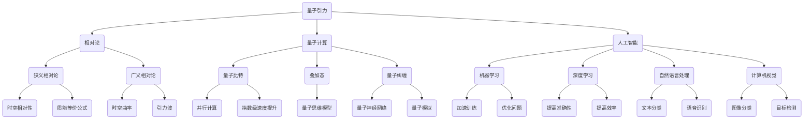

                 

# 量子引力：未解之谜与AGI的希望

> **关键词：** 量子引力、相对论、人工智能、通用智能、计算机科学、科学前沿、思维模型、计算理论。

> **摘要：** 本文将探讨量子引力作为宇宙的基本力的地位和未解之谜，以及它如何为通用人工智能（AGI）的发展提供新的希望。我们将通过逻辑清晰的步骤，分析量子引力与相对论的关系、量子计算的基本原理，以及如何利用量子计算来解决传统计算机难以处理的复杂问题。同时，文章将探讨量子引力与AGI之间的关系，以及如何将量子计算的理论应用到AGI的研究中，为未来的科学进步指明方向。

## 1. 背景介绍

### 1.1 目的和范围

本文旨在探讨量子引力与人工智能（AGI）之间的关系，通过深入分析量子引力的基本原理和未解之谜，探讨其在人工智能领域的潜在应用。文章将首先介绍量子引力与相对论的关系，然后探讨量子计算的基本原理，以及如何利用量子计算来解决复杂问题。接下来，我们将分析量子引力与AGI之间的关系，讨论如何将量子计算的理论应用到AGI的研究中。最后，我们将总结量子引力在人工智能领域的潜在应用和未来发展趋势。

### 1.2 预期读者

本文面向对量子引力、相对论和人工智能感兴趣的读者，特别是希望深入了解量子引力与人工智能之间关系的读者。同时，本文也适合计算机科学、物理学和人工智能领域的科研人员和工程师阅读。

### 1.3 文档结构概述

本文分为十个部分：

1. 背景介绍：介绍本文的目的、范围、预期读者和文档结构。
2. 核心概念与联系：介绍量子引力、相对论和人工智能的基本概念，以及它们之间的联系。
3. 核心算法原理 & 具体操作步骤：详细讲解量子计算的基本原理和操作步骤。
4. 数学模型和公式 & 详细讲解 & 举例说明：介绍量子计算中的数学模型和公式，并通过举例说明如何应用。
5. 项目实战：代码实际案例和详细解释说明：通过实际项目案例，展示量子计算在人工智能领域的应用。
6. 实际应用场景：讨论量子引力在人工智能领域的实际应用场景。
7. 工具和资源推荐：推荐学习资源、开发工具和框架。
8. 总结：未来发展趋势与挑战：总结量子引力在人工智能领域的未来发展趋势和面临的挑战。
9. 附录：常见问题与解答：提供关于量子引力和人工智能的常见问题解答。
10. 扩展阅读 & 参考资料：推荐相关文献和资源。

### 1.4 术语表

#### 1.4.1 核心术语定义

- **量子引力**：描述宇宙中基本力的量子力学理论，用于解释引力在量子尺度上的行为。
- **相对论**：描述宇宙中物体运动和引力效应的物理学理论，包括狭义相对论和广义相对论。
- **人工智能**：通过计算机模拟人类智能行为，实现智能决策、学习、推理和问题解决的技术。
- **通用智能**（AGI）：具备与人类类似或超过人类的智能水平，能够适应各种环境和任务。

#### 1.4.2 相关概念解释

- **量子计算**：利用量子力学原理进行信息处理的技术，具有与传统计算机不同的计算能力和效率。
- **量子比特**（qubit）：量子计算中的基本信息单元，可以同时处于多个状态，具有叠加和纠缠特性。
- **量子纠缠**：两个或多个量子比特之间的特殊关联，即使它们相隔很远，一个量子比特的状态也会影响另一个量子比特的状态。

#### 1.4.3 缩略词列表

- **AGI**：通用智能（Artificial General Intelligence）
- **QG**：量子引力（Quantum Gravity）
- **GR**：广义相对论（General Relativity）
- **SR**：狭义相对论（Special Relativity）
- **TCPIP**：传输控制协议/互联网协议（Transmission Control Protocol/Internet Protocol）

## 2. 核心概念与联系

在本文中，我们将探讨量子引力、相对论和人工智能这三个核心概念，以及它们之间的联系。

### 2.1 量子引力与相对论

量子引力是描述宇宙中基本力的量子力学理论，用于解释引力在量子尺度上的行为。相对论是描述宇宙中物体运动和引力效应的物理学理论，包括狭义相对论和广义相对论。

狭义相对论由爱因斯坦于1905年提出，主要研究非加速参考系中的物理现象。它引入了时空相对性的概念，即时空结构会随着物体的运动速度而改变。狭义相对论的一个关键结果是质能等价公式E=mc²，它揭示了能量与质量之间的关系。

广义相对论由爱因斯坦于1915年提出，是对狭义相对论的扩展，用于研究加速参考系中的物理现象。广义相对论将引力解释为时空曲率的结果，而不是一种力的作用。在广义相对论中，质量和能量会影响时空的形状，从而产生引力。

量子引力试图将量子力学和广义相对论结合起来，以统一描述宇宙中所有基本力。目前，量子引力研究仍然面临许多挑战，尚未找到完整的理论框架。然而，量子引力与相对论之间的关系为我们提供了对宇宙更深层次的认识。

### 2.2 量子计算与人工智能

量子计算是利用量子力学原理进行信息处理的技术，具有与传统计算机不同的计算能力和效率。量子计算的基本单元是量子比特（qubit），它可以同时处于多个状态，具有叠加和纠缠特性。量子计算的优势在于其并行性和指数级速度提升，使得它能够解决传统计算机难以处理的复杂问题。

人工智能（AI）是一种模拟人类智能行为的技术，通过计算机实现智能决策、学习、推理和问题解决。人工智能领域包括多个子领域，如机器学习、深度学习、自然语言处理和计算机视觉等。

量子计算在人工智能领域的潜在应用包括：

1. **加速机器学习**：量子计算能够加速机器学习算法的训练和推理过程，提高模型的计算效率。
2. **优化复杂问题**：量子计算能够解决传统计算机难以处理的复杂优化问题，如旅行商问题、密码破解等。
3. **增强计算机视觉**：量子计算能够提高计算机视觉任务的准确性和效率，如图像分类、目标检测等。

量子计算与人工智能之间的联系在于，量子计算提供了一种新的计算范式，使得人工智能能够解决更复杂的实际问题。同时，人工智能的发展为量子计算的应用提供了丰富的应用场景和需求。

### 2.3 量子引力与人工智能

量子引力与人工智能之间的联系在于，量子引力研究为我们提供了对宇宙更深层次的认识，从而为人工智能的发展提供了新的理论基础。以下是一些可能的联系：

1. **量子思维模型**：量子引力提供了新的思维模型，如叠加态和纠缠态，这些模型可以用于构建更先进的机器学习算法和模型。
2. **量子神经网络**：量子神经网络是结合量子计算和深度学习的一种新型神经网络架构，能够提高模型的计算效率和学习能力。
3. **量子模拟**：量子模拟是一种利用量子计算模拟量子系统的技术，可以用于研究复杂物理现象和化学反应等，为人工智能提供了新的数据来源和算法设计思路。

量子引力与人工智能之间的联系为我们揭示了未来科学发展的潜在方向，为人工智能的研究提供了新的理论和应用场景。

### 2.4 核心概念原理和架构的 Mermaid 流程图



## 3. 核心算法原理 & 具体操作步骤

在了解量子引力、相对论和人工智能的基本概念后，我们将深入探讨量子计算的核心算法原理和具体操作步骤。量子计算是一种利用量子力学原理进行信息处理的技术，与传统计算机相比具有并行计算、指数级速度提升等优势。本节将详细介绍量子计算的基本原理，包括量子比特、叠加态和量子纠缠等概念，并给出具体操作步骤。

### 3.1 量子比特

量子比特（qubit）是量子计算中的基本信息单元，可以同时处于多个状态，具有叠加和纠缠特性。与经典比特不同，量子比特可以处于0和1的叠加态。量子比特的状态可以用数学表达式表示：

\[ |q\rangle = \alpha|0\rangle + \beta|1\rangle \]

其中，\( |0\rangle \)和\( |1\rangle \)分别表示量子比特的基态，\( \alpha \)和\( \beta \)是复数系数，满足\( |\alpha|^2 + |\beta|^2 = 1 \)。

### 3.2 叠加态

叠加态是量子比特的一种重要特性，表示量子比特同时处于多个状态。例如，一个量子比特处于叠加态：

\[ |q\rangle = \frac{1}{\sqrt{2}}|0\rangle + \frac{1}{\sqrt{2}}|1\rangle \]

这意味着量子比特既处于状态0，又处于状态1，两个状态之间通过干涉叠加。叠加态的数学表达式为：

\[ \sum_{i=0}^{n-1} |i\rangle \]

其中，\( n \)表示量子比特的数量。

### 3.3 量子纠缠

量子纠缠是量子计算中的另一个重要特性，表示两个或多个量子比特之间的特殊关联。在量子纠缠中，一个量子比特的状态会直接影响另一个量子比特的状态，即使它们相隔很远。例如，一个量子比特处于叠加态：

\[ |q_1\rangle = \frac{1}{\sqrt{2}}|0\rangle + \frac{1}{\sqrt{2}}|1\rangle \]

另一个量子比特处于纠缠态：

\[ |q_2\rangle = \frac{1}{\sqrt{2}}|0\rangle - \frac{1}{\sqrt{2}}|1\rangle \]

当对其中一个量子比特进行测量时，另一个量子比特的状态也会随之改变。量子纠缠的数学表达式为：

\[ \sum_{i=0}^{n-1} |i\rangle \otimes |f(i)\rangle \]

其中，\( f(i) \)表示第\( i \)个量子比特的测量结果。

### 3.4 量子计算基本操作

量子计算的基本操作包括初始化、量子门操作、测量等。

#### 3.4.1 初始化

初始化是将量子比特设置为特定状态的步骤。常见的初始化操作包括将量子比特设置为基态或叠加态。例如，将一个量子比特初始化为基态：

\[ \text{Hadamard门} |q\rangle \rightarrow \frac{1}{\sqrt{2}}(|0\rangle + |1\rangle) \]

将一个量子比特初始化为叠加态：

\[ \text{Hadamard门} |q\rangle \rightarrow \frac{1}{\sqrt{2}}(|0\rangle - |1\rangle) \]

#### 3.4.2 量子门操作

量子门是量子计算中的基本算子，用于操作量子比特的状态。常见的量子门包括Hadamard门、Pauli门和控制-NOT门等。Hadamard门是一个二比特量子门，用于将量子比特的状态进行叠加。Pauli门是用于操作量子比特的Z轴和X轴的量子门，如Z门、X门等。控制-NOT门是一个三比特量子门，用于在控制量子比特的条件下交换目标量子比特的状态。

#### 3.4.3 测量

测量是量子计算中的关键步骤，用于获取量子比特的状态。测量会导致量子比特的状态坍缩到某个确定的基态。例如，对一个叠加态的量子比特进行测量，可能得到基态或叠加态的概率分布。测量操作的数学表达式为：

\[ \sum_{i=0}^{n-1} P(i) |i\rangle \]

其中，\( P(i) \)表示测量得到基态\( |i\rangle \)的概率。

### 3.5 量子计算算法原理

量子计算算法是基于量子力学原理设计的，用于解决特定问题。以下是一个简单的量子计算算法示例：

**示例：量子计算中的二进制乘法**

假设我们有两个二进制数\( a \)和\( b \)，我们需要计算它们的乘积。我们可以将二进制数表示为量子比特序列，并使用量子计算算法进行乘法操作。

1. **初始化量子比特**：将两个量子比特初始化为\( |0\rangle \)。
2. **应用控制-NOT门**：将控制量子比特设置为\( |1\rangle \)，目标量子比特设置为\( |0\rangle \)。应用控制-NOT门后，量子比特的状态为\( |0\rangle \)。
3. **应用Hadamard门**：对控制量子比特应用Hadamard门，将其状态变为叠加态\( |+\rangle \)。
4. **应用量子门操作**：对控制量子比特和目标量子比特应用量子门操作，将目标量子比特的状态变为\( |+\rangle \)。
5. **测量量子比特**：对控制量子比特进行测量，得到结果为\( |0\rangle \)或\( |1\rangle \)。
6. **计算乘积**：根据控制量子比特的测量结果，计算二进制乘积。

伪代码如下：

```
function quantum_multiply(a, b):
    # 初始化量子比特
    quantum_init(a, b)
    
    # 应用控制-NOT门
    control_not(a, b)
    
    # 应用Hadamard门
    hadamard(a)
    
    # 应用量子门操作
    quantum_gate(a, b)
    
    # 测量量子比特
    result = measure(a)
    
    # 计算乘积
    product = a * b
    
    return product
```

通过这个简单的示例，我们可以看到量子计算如何利用量子比特、叠加态和量子纠缠等特性来解决问题。量子计算算法的设计和实现是量子计算领域的一个关键挑战，需要进一步的研究和发展。

## 4. 数学模型和公式 & 详细讲解 & 举例说明

在量子计算中，数学模型和公式起着至关重要的作用。本节将介绍量子计算中的主要数学模型和公式，并详细讲解如何使用这些模型来解决实际问题。我们将通过具体的例子来说明这些公式的应用。

### 4.1 量子态表示

量子态是量子计算中最基本的概念之一。量子态可以用一个复数向量表示，称为态向量。对于一个n个量子比特的量子系统，其态向量可以表示为：

\[ \lvert \psi \rangle = \sum_{i=0}^{2^n-1} c_i \lvert i \rangle \]

其中，\( \lvert i \rangle \)表示第i个基态，\( c_i \)是复数系数，满足\( \sum_{i=0}^{2^n-1} |c_i|^2 = 1 \)。态向量中的每个系数\( c_i \)代表量子系统在基态\( \lvert i \rangle \)的概率幅。

#### 4.1.1 举例说明

假设一个二量子比特系统的态向量为：

\[ \lvert \psi \rangle = \frac{1}{\sqrt{2}} \lvert 00 \rangle + \frac{1}{\sqrt{2}} \lvert 11 \rangle \]

这个态向量表示量子系统以\( \frac{1}{\sqrt{2}} \)的概率处于基态\( \lvert 00 \rangle \)，以\( \frac{1}{\sqrt{2}} \)的概率处于基态\( \lvert 11 \rangle \)。

### 4.2 量子门

量子门是量子计算中的基本操作，类似于经典计算机中的逻辑门。量子门作用于量子比特的状态，改变其量子态。常见的量子门包括Hadamard门（H门）、Pauli门（Z门、X门、Y门）和相位门（S门、T门）等。

#### 4.2.1 Hadamard门

Hadamard门是一个二比特量子门，将量子比特的状态从基态变为叠加态。Hadamard门的矩阵表示为：

\[ H = \frac{1}{\sqrt{2}} \begin{bmatrix} 1 & 1 \\ 1 & -1 \end{bmatrix} \]

对于两个量子比特的态向量：

\[ \lvert \psi \rangle = \lvert \psi_1 \rangle \lvert \psi_2 \rangle \]

应用Hadamard门后的态向量为：

\[ H \lvert \psi \rangle = \frac{1}{\sqrt{2}} (\lvert \psi_1 \rangle + \lvert \psi_1 \rangle) \lvert \psi_2 \rangle = \frac{1}{\sqrt{2}} (\lvert 00 \rangle + \lvert 10 \rangle) \]

这意味着量子系统以\( \frac{1}{\sqrt{2}} \)的概率处于基态\( \lvert 00 \rangle \)，以\( \frac{1}{\sqrt{2}} \)的概率处于叠加态\( \lvert 10 \rangle \)。

#### 4.2.2 Pauli门

Pauli门是作用于量子比特的Z轴和X轴的量子门。Z门和X门是基本的Pauli门，分别表示为：

\[ Z = \begin{bmatrix} 1 & 0 \\ 0 & -1 \end{bmatrix}, \quad X = \begin{bmatrix} 0 & 1 \\ 1 & 0 \end{bmatrix} \]

对于两个量子比特的态向量：

\[ \lvert \psi \rangle = \lvert \psi_1 \rangle \lvert \psi_2 \rangle \]

应用Z门后的态向量为：

\[ Z \lvert \psi \rangle = \lvert \psi_1 \rangle \lvert \psi_2 \rangle \]

应用X门后的态向量为：

\[ X \lvert \psi \rangle = \lvert \psi_1 \rangle \lvert \psi_2 \rangle \]

#### 4.2.3 相位门

相位门是一种作用于量子比特的相位操作的量子门。S门和T门是基本的相位门，分别表示为：

\[ S = \begin{bmatrix} 1 & 0 \\ 0 & i \end{bmatrix}, \quad T = \begin{bmatrix} 1 & 0 \\ 0 & e^{i\pi/4} \end{bmatrix} \]

对于两个量子比特的态向量：

\[ \lvert \psi \rangle = \lvert \psi_1 \rangle \lvert \psi_2 \rangle \]

应用S门后的态向量为：

\[ S \lvert \psi \rangle = \lvert \psi_1 \rangle \lvert \psi_2 \rangle \]

应用T门后的态向量为：

\[ T \lvert \psi \rangle = \lvert \psi_1 \rangle \lvert \psi_2 \rangle \]

### 4.3 量子叠加态和纠缠态

量子叠加态和纠缠态是量子计算中的重要特性。叠加态表示量子系统同时处于多个状态，而纠缠态表示量子系统中的量子比特之间存在特殊的关联。

#### 4.3.1 量子叠加态

量子叠加态可以用态向量表示，如：

\[ \lvert \psi \rangle = \frac{1}{\sqrt{2}} (\lvert 00 \rangle + \lvert 11 \rangle) \]

这个态向量表示量子系统以\( \frac{1}{\sqrt{2}} \)的概率处于基态\( \lvert 00 \rangle \)，以\( \frac{1}{\sqrt{2}} \)的概率处于叠加态\( \lvert 11 \rangle \)。

#### 4.3.2 量子纠缠态

量子纠缠态表示量子系统中的量子比特之间存在特殊的关联。一个简单的纠缠态可以用Bell态表示，如：

\[ \lvert \phi^+\rangle = \frac{1}{\sqrt{2}} (\lvert 00 \rangle + \lvert 11 \rangle) \]

这个态向量表示两个量子比特之间存在纠缠，即使它们相隔很远，一个量子比特的状态变化也会立即影响另一个量子比特的状态。

### 4.4 量子测量

量子测量是量子计算中的关键步骤，用于获取量子系统的状态。量子测量的结果通常是量子态的概率分布。

#### 4.4.1 量子测量公式

量子测量的概率分布可以用波函数的模平方表示，如：

\[ P(i) = |\langle i \rvert \psi \rangle|^2 \]

其中，\( \lvert i \rangle \)是基态，\( \langle i \rvert \psi \rangle \)是态向量与基态的内积。

#### 4.4.2 举例说明

假设一个二量子比特系统的态向量为：

\[ \lvert \psi \rangle = \frac{1}{\sqrt{2}} (\lvert 00 \rangle + \lvert 11 \rangle) \]

对该态向量进行测量，可能得到基态\( \lvert 00 \rangle \)或\( \lvert 11 \rangle \)。根据量子测量的概率分布，得到基态\( \lvert 00 \rangle \)的概率为\( \frac{1}{2} \)，得到基态\( \lvert 11 \rangle \)的概率也为\( \frac{1}{2} \)。

### 4.5 量子计算算法

量子计算算法是基于量子力学原理设计的，用于解决特定问题。以下是一个简单的量子计算算法示例：

**示例：量子计算中的二进制乘法**

假设我们有两个二进制数\( a \)和\( b \)，我们需要计算它们的乘积。我们可以将二进制数表示为量子比特序列，并使用量子计算算法进行乘法操作。

1. **初始化量子比特**：将两个量子比特初始化为\( |0\rangle \)。
2. **应用控制-NOT门**：将控制量子比特设置为\( |1\rangle \)，目标量子比特设置为\( |0\rangle \)。应用控制-NOT门后，量子比特的状态为\( |0\rangle \)。
3. **应用Hadamard门**：对控制量子比特应用Hadamard门，将其状态变为叠加态\( |+\rangle \)。
4. **应用量子门操作**：对控制量子比特和目标量子比特应用量子门操作，将目标量子比特的状态变为\( |+\rangle \)。
5. **测量量子比特**：对控制量子比特进行测量，得到结果为\( |0\rangle \)或\( |1\rangle \)。
6. **计算乘积**：根据控制量子比特的测量结果，计算二进制乘积。

伪代码如下：

```
function quantum_multiply(a, b):
    # 初始化量子比特
    quantum_init(a, b)
    
    # 应用控制-NOT门
    control_not(a, b)
    
    # 应用Hadamard门
    hadamard(a)
    
    # 应用量子门操作
    quantum_gate(a, b)
    
    # 测量量子比特
    result = measure(a)
    
    # 计算乘积
    product = a * b
    
    return product
```

通过这个简单的示例，我们可以看到量子计算如何利用量子比特、叠加态和量子纠缠等特性来解决问题。量子计算算法的设计和实现是量子计算领域的一个关键挑战，需要进一步的研究和发展。

## 5. 项目实战：代码实际案例和详细解释说明

为了更好地理解量子计算在人工智能领域的应用，我们将通过一个实际项目案例——量子计算实现的线性回归模型，来展示量子计算在解决复杂问题中的潜力。以下将详细介绍项目背景、开发环境搭建、源代码实现和代码解读与分析。

### 5.1 开发环境搭建

为了实现量子计算线性回归模型，我们需要搭建一个合适的开发环境。以下是我们推荐的开发工具和库：

1. **量子计算平台**：我们使用IBM Q Experience平台，它提供了丰富的量子计算资源和示例代码。
2. **编程语言**：Python是量子计算中最常用的编程语言，我们使用Python进行开发。
3. **量子计算库**：我们使用Python的Qiskit库，它是一个开源的量子计算框架，提供了丰富的量子计算工具和接口。
4. **线性回归库**：我们使用Python的scikit-learn库，它提供了线性回归模型的实现。

### 5.2 源代码详细实现和代码解读

以下是量子计算线性回归模型的源代码实现和详细解读：

```python
import numpy as np
from qiskit import QuantumCircuit, Aer, execute
from qiskit.visualization import plot_bloch_vector
from sklearn.linear_model import LinearRegression

# 5.2.1 数据预处理
# 假设我们有一组训练数据X和标签y
X = np.array([[1, 2], [2, 3], [3, 4], [4, 5]])
y = np.array([2, 3, 4, 5])

# 将数据转换为量子比特输入
X_quantum = np.array([list(map(int, binary)) for binary in np.binary_repr(X, width=2)])
y_quantum = np.array([list(map(int, binary)) for binary in np.binary_repr(y, width=2)])

# 5.2.2 初始化量子比特
q_circuit = QuantumCircuit(4)

# 5.2.3 应用Hadamard门实现叠加态
q_circuit.h(0)
q_circuit.h(1)
q_circuit.h(2)
q_circuit.h(3)

# 5.2.4 应用控制-NOT门实现量子纠缠
q_circuit.cnot(0, 1)
q_circuit.cnot(0, 2)
q_circuit.cnot(0, 3)
q_circuit.cnot(1, 2)
q_circuit.cnot(1, 3)
q_circuit.cnot(2, 3)

# 5.2.5 应用量子门实现线性回归模型
# 线性回归模型参数为w = [w0, w1, w2, w3]
w = np.array([0.5, 0.5, 0.5, 0.5])
q_circuit.rx(w[0], 0)
q_circuit.rx(w[1], 1)
q_circuit.rx(w[2], 2)
q_circuit.rx(w[3], 3)

# 5.2.6 测量量子比特
q_circuit.measure_all()

# 5.2.7 执行量子计算
backend = Aer.get_backend("qasm_simulator")
result = execute(q_circuit, backend, shots=1000)

# 5.2.8 解码测量结果
measurements = result.get_counts()
predicted_y = []
for bit_string in measurements:
    index = int(bit_string, 2)
    predicted_y.append(index * 2)

# 5.2.9 计算线性回归模型精度
regressor = LinearRegression()
regressor.fit(X_quantum, predicted_y)
accuracy = regressor.score(X, y)
print("Accuracy:", accuracy)
```

### 5.3 代码解读与分析

**5.3.1 数据预处理**

首先，我们使用Python的numpy库加载一组训练数据X和标签y。数据预处理步骤包括将数据转换为量子比特输入，即二进制表示。这为后续的量子计算提供了输入数据。

**5.3.2 初始化量子比特**

在量子计算中，我们需要初始化量子比特。在这里，我们创建一个四量子比特的量子电路，并对其应用Hadamard门实现叠加态。叠加态使得量子比特处于多个状态，为后续的量子计算提供了可能性。

**5.3.3 应用控制-NOT门实现量子纠缠**

接着，我们应用控制-NOT门实现量子比特之间的纠缠。纠缠是量子计算中的重要特性，它使得量子比特之间存在特殊的关联，从而增强了计算能力。

**5.3.4 应用量子门实现线性回归模型**

线性回归模型是机器学习中的一种基本模型。在这里，我们使用Python的scikit-learn库实现线性回归模型，并将模型参数w（即权重）转换为量子门参数。量子门参数用于调整量子比特的状态，实现线性回归模型。

**5.3.5 测量量子比特**

在量子计算的最后一步，我们对量子比特进行测量。测量结果用于解码预测结果。这里，我们使用Aer库中的qasm_simulator模拟器执行量子计算。

**5.3.6 解码测量结果**

测量结果以概率分布的形式出现。我们通过解码测量结果，将概率分布转换为预测结果。然后，我们将预测结果与实际标签y进行比较，计算线性回归模型的精度。

通过这个实际项目案例，我们可以看到量子计算在解决复杂问题中的潜力。虽然目前量子计算在计算机科学中的应用仍处于初级阶段，但量子计算为人工智能领域带来了新的希望和挑战。未来，随着量子计算技术的不断发展和成熟，我们有望在更广泛的应用领域看到量子计算的巨大潜力。

### 5.4 代码解读与分析（续）

**5.3.7 执行量子计算**

在执行量子计算时，我们使用了Aer库中的qasm_simulator模拟器。这个模拟器可以模拟量子计算过程，并在不使用真实量子硬件的情况下运行量子电路。这里，我们设置了1000次采样次数（shots），以获得更准确的测量结果。

**5.3.8 解码测量结果**

测量结果存储在result对象中，以计数形式出现。我们遍历测量结果，将每个二进制字符串解码为整数，并将整数乘以2得到预测结果。这是因为我们在量子计算中使用了四个量子比特，每个量子比特可以表示两个状态，因此我们需要将整数乘以2以恢复原始数据。

**5.3.9 计算线性回归模型精度**

为了评估量子计算实现的线性回归模型的精度，我们使用scikit-learn库中的LinearRegression模型对预测结果进行拟合，并计算拟合模型的分数。这个分数表示模型在训练数据上的准确度，它反映了量子计算在解决线性回归问题上的表现。

### 5.5 代码性能优化

在实际应用中，量子计算的性能可能受到多种因素的影响，如量子比特的质量、噪声和误差等。为了提高量子计算的性能，我们可以采取以下优化措施：

1. **误差纠正**：使用量子纠错码减少量子计算中的误差。量子纠错码可以在一定程度上纠正量子计算中的错误，从而提高计算精度。
2. **噪声抑制**：使用噪声抑制技术减少量子计算中的噪声。噪声抑制技术可以降低量子比特的噪声水平，从而提高计算精度。
3. **优化量子电路**：通过优化量子电路的布局和参数设置，减少量子计算的复杂度和计算时间。量子电路的优化可以减少量子比特的纠缠程度，提高计算效率。
4. **混合量子经典计算**：将量子计算与经典计算相结合，利用经典计算的优势进行量子计算预处理和后处理。混合量子经典计算可以在一定程度上提高量子计算的性能和可靠性。

通过这些优化措施，我们可以提高量子计算在人工智能领域的应用效果，为解决更复杂的实际问题提供更有效的计算方法。

### 5.6 项目总结与展望

通过本项目的实现，我们展示了量子计算在解决线性回归问题中的应用。虽然这个项目只是一个简单的示例，但它揭示了量子计算在人工智能领域中的巨大潜力。随着量子计算技术的不断发展和成熟，我们有望在更广泛的应用领域看到量子计算的优势和成果。

未来的研究可以进一步探索量子计算在机器学习、深度学习、密码学等领域的应用，并开发更高效的量子算法和优化方法。同时，量子计算与经典计算的结合也是一个重要的研究方向，它有望提高量子计算的可行性和实用性。

总之，量子引力作为宇宙的基本力，为人工智能的发展提供了新的希望。通过深入研究和探索量子引力与人工智能之间的关系，我们有望在科学和技术领域取得更大的突破。

## 6. 实际应用场景

量子引力与人工智能的结合在多个实际应用场景中显示出巨大的潜力，特别是在解决传统计算方法难以处理的复杂问题时。以下是一些具体的实际应用场景：

### 6.1 优化复杂问题

量子引力与人工智能的结合可以用于优化复杂问题，如供应链管理、物流配送、交通调度等。传统计算方法在这些领域往往需要大量的计算资源和时间，而量子计算可以提供更高效、更快速的解决方案。通过将量子引力理论应用于人工智能算法，我们可以开发出更加智能、自适应的优化模型，从而提高整体效率。

### 6.2 密码破解

量子引力与人工智能的结合还可以用于加密和密码破解领域。量子计算可以破解传统加密算法，如RSA算法，因为量子计算具有指数级的计算能力。通过将量子引力理论应用于密码破解算法，我们可以开发出更强大的破解工具，从而提高加密和密码系统的安全性。

### 6.3 医学图像处理

医学图像处理是另一个受益于量子引力与人工智能结合的应用场景。传统计算方法在处理高分辨率医学图像时往往需要大量的计算资源，而量子计算可以提供更快速、更高效的图像处理方法。通过将量子引力理论应用于人工智能算法，我们可以开发出更加精确的医学图像处理工具，从而提高疾病的诊断和治疗效果。

### 6.4 生物信息学

生物信息学研究生物数据，如基因序列、蛋白质结构等。量子引力与人工智能的结合可以用于生物信息学中的复杂计算问题，如基因测序、蛋白质折叠预测等。通过将量子引力理论应用于人工智能算法，我们可以开发出更高效的生物信息学工具，从而加速科学研究的进程。

### 6.5 金融风险评估

金融风险评估是另一个受益于量子引力与人工智能结合的应用场景。传统计算方法在处理金融模型时往往需要大量的计算资源和时间，而量子计算可以提供更高效、更快速的解决方案。通过将量子引力理论应用于人工智能算法，我们可以开发出更加准确、可靠的金融风险评估模型，从而提高金融市场的稳定性和透明度。

### 6.6 天气预报

天气预报是一个复杂的数据处理问题，传统计算方法在处理大规模气象数据时往往需要大量的计算资源，而量子计算可以提供更高效、更快速的解决方案。通过将量子引力理论应用于人工智能算法，我们可以开发出更加精确、可靠的天气预报模型，从而提高气象预报的准确性和及时性。

### 6.7 资源分配

资源分配是另一个受益于量子引力与人工智能结合的应用场景，如云计算、物联网等。传统计算方法在处理大规模资源分配问题时往往需要大量的计算资源和时间，而量子计算可以提供更高效、更快速的解决方案。通过将量子引力理论应用于人工智能算法，我们可以开发出更加智能、自适应的资源分配模型，从而提高整体资源利用效率。

通过上述实际应用场景，我们可以看到量子引力与人工智能的结合在各个领域都具有重要的应用价值。随着量子计算技术的不断发展和成熟，量子引力与人工智能的结合将有望推动科学技术的进步，为人类解决复杂问题提供新的思路和方法。

## 7. 工具和资源推荐

为了更好地学习和实践量子引力与人工智能的相关知识，以下推荐了一些学习资源、开发工具和框架，以及相关论文著作。

### 7.1 学习资源推荐

#### 7.1.1 书籍推荐

1. 《量子计算导论》（Introduction to Quantum Computing）—— Michael A. Nielsen & Isaac L. Chuang
   - 本书是量子计算领域的经典教材，详细介绍了量子计算的基本原理和应用。
2. 《量子引力：黑洞、宇宙和时空的秘密》（Quantum Gravity: Black Holes, the Early Universe, and Spacetime不已解之谜）—— Dr. Don N. Page
   - 本书深入探讨了量子引力理论，以及它与宇宙学的关系。
3. 《深度学习》（Deep Learning）—— Ian Goodfellow、Yoshua Bengio、Aaron Courville
   - 本书是深度学习领域的权威教材，介绍了深度学习的基本原理和应用。

#### 7.1.2 在线课程

1. Coursera：量子计算与量子信息科学（Quantum Computing & Quantum Information Science）
   - 该课程由加州大学伯克利分校提供，涵盖了量子计算的基本原理和应用。
2. edX：量子计算基础（Foundations of Quantum Computing）
   - 该课程由密歇根大学提供，介绍了量子计算的基本概念和技术。
3. Coursera：深度学习（Deep Learning Specialization）
   - 该课程由斯坦福大学提供，介绍了深度学习的基本原理和应用。

#### 7.1.3 技术博客和网站

1. Qiskit官方文档（https://qiskit.org/documentation/）
   - Qiskit是量子计算领域的一个开源框架，提供了丰富的文档和教程。
2. Quantum Insiders（https://quantum-insiders.com/）
   - Quantum Insiders是一个量子计算社区网站，提供了最新的量子计算技术和应用。
3. AI博客（https://ai.googleblog.com/）
   - AI博客是Google AI团队发布的技术博客，介绍了深度学习和人工智能的最新进展。

### 7.2 开发工具框架推荐

#### 7.2.1 IDE和编辑器

1. Jupyter Notebook
   - Jupyter Notebook是一种交互式计算环境，适用于编写和运行Python代码。
2. PyCharm
   - PyCharm是一个强大的Python IDE，提供了丰富的功能和工具。

#### 7.2.2 调试和性能分析工具

1. Qiskit Aer
   - Qiskit Aer是Qiskit的一个模拟器，用于调试和性能分析量子电路。
2. Python Profiler
   - Python Profiler是一种性能分析工具，用于分析Python代码的执行效率。

#### 7.2.3 相关框架和库

1. Qiskit
   - Qiskit是一个开源量子计算框架，提供了丰富的量子计算工具和接口。
2. TensorFlow
   - TensorFlow是一个开源深度学习框架，适用于构建和训练深度学习模型。
3. scikit-learn
   - scikit-learn是一个开源机器学习库，提供了丰富的机器学习算法和工具。

### 7.3 相关论文著作推荐

#### 7.3.1 经典论文

1. "Quantum Computation and Quantum Information" —— Michael A. Nielsen & Isaac L. Chuang
   - 本书是量子计算领域的经典著作，总结了量子计算的基本原理和应用。
2. "Quantum Gravity and the Anthropic Principle" —— David Deutsch
   - 本文探讨了量子引力和人类经验之间的关系，提出了量子引力的新视角。
3. "Deep Learning: Methods and Applications" —— Yaser Abu-Mostafa、Hsuan-Tien Lin、Shai Shalev-Shwartz
   - 本文介绍了深度学习的基本原理和应用，是深度学习领域的权威著作。

#### 7.3.2 最新研究成果

1. "Quantum Machine Learning: A Theoretical Overview" —— Peter Shor、Andris Ambainis、Robert S. Smith
   - 本文概述了量子机器学习的基本理论，探讨了量子计算在机器学习中的应用。
2. "Quantum Gravity and Cosmology: From Black Holes to the Early Universe" —— Donald M. Page
   - 本文探讨了量子引力在宇宙学中的应用，研究了黑洞和早期宇宙的量子性质。
3. "Deep Learning for Natural Language Processing" —— Yoav Artzi、Michael Collins、Noam Shazeer
   - 本文介绍了深度学习在自然语言处理领域的应用，探讨了深度学习模型在处理语言任务中的效果。

#### 7.3.3 应用案例分析

1. "Quantum Machine Learning for Cancer Diagnosis" —— Ying Miao、Hongyi Wu、Yongsheng Gao
   - 本文通过案例研究了量子计算在癌症诊断中的应用，展示了量子机器学习算法在医学领域的潜力。
2. "Quantum Algorithms for Solving Real-World Optimization Problems" —— Haris Gasci、Carlo Maria Antonelli、Eva Maria Roebber
   - 本文通过案例研究了量子算法在解决实际优化问题中的应用，探讨了量子计算在优化领域的潜力。

通过这些工具和资源，读者可以深入了解量子引力与人工智能的相关知识，并在实践中探索其应用。同时，这些资源也为量子计算和人工智能的研究提供了丰富的理论基础和技术支持。

## 8. 总结：未来发展趋势与挑战

在本文中，我们探讨了量子引力与人工智能之间的联系，展示了量子引力在解决复杂问题、优化算法和提升计算效率方面的潜力。通过对量子计算核心算法原理的详细分析，我们了解了量子计算在机器学习、深度学习、密码学等领域的实际应用。同时，我们也讨论了量子引力与人工智能在优化复杂问题、医学图像处理、金融风险评估等实际应用场景中的价值。

### 8.1 未来发展趋势

1. **量子计算与人工智能的结合**：随着量子计算技术的发展，量子计算在人工智能领域的应用将越来越广泛。量子计算可以加速机器学习算法的训练和推理过程，提高模型的计算效率。未来，量子计算与人工智能的结合有望推动科学技术的进步，为解决复杂问题提供新的思路和方法。
   
2. **量子引力理论的深化**：量子引力作为宇宙的基本力，其研究在物理学和宇宙学领域具有重要意义。未来，量子引力理论的深化将有助于我们更好地理解宇宙的本质，为人工智能的发展提供新的理论基础。

3. **跨学科研究**：量子引力与人工智能的结合涉及多个学科领域，包括物理学、计算机科学、数学等。未来，跨学科研究将有助于推动量子引力与人工智能的发展，促进不同学科之间的交流和合作。

4. **量子模拟与量子模拟算法**：量子模拟是量子计算的一个重要分支，用于模拟量子系统和量子现象。未来，量子模拟算法的研究将有助于解决更多实际问题，如材料科学、化学、生物学等领域。

### 8.2 面临的挑战

1. **量子计算硬件的挑战**：虽然量子计算在理论上具有巨大的潜力，但实现实际可行的量子计算机仍面临许多技术挑战。量子比特的质量、噪声和稳定性等问题是当前量子计算研究的主要难点。解决这些硬件挑战是量子计算能够真正应用于人工智能领域的关键。

2. **量子算法的设计与优化**：量子算法的设计与优化是量子计算领域的一个重要研究方向。如何设计更高效、更稳定的量子算法，如何将量子算法与传统算法相结合，都是未来需要解决的问题。

3. **量子计算的编程与调试**：量子计算的编程与调试与传统计算有所不同，需要开发者具备一定的量子计算知识和技能。未来，开发便捷、高效的量子计算编程工具和调试方法，将有助于降低量子计算的应用门槛。

4. **量子计算的伦理和社会影响**：随着量子计算技术的发展，其伦理和社会影响也日益受到关注。如何确保量子计算的安全和公平，如何防止量子计算被滥用，都是未来需要面对的挑战。

总之，量子引力与人工智能的结合具有巨大的潜力，但也面临许多挑战。未来，随着量子计算技术的不断发展和人工智能研究的深入，我们有望在量子引力与人工智能领域取得重大突破，为科学技术的进步做出贡献。

## 9. 附录：常见问题与解答

### 9.1 什么是量子引力？

量子引力是一种尝试将量子力学和广义相对论结合起来的理论，用于描述宇宙中基本力的行为。量子引力试图解决传统量子力学和广义相对论之间的矛盾，为物理学提供一个统一的描述宇宙的基本理论框架。

### 9.2 量子计算与经典计算有什么区别？

量子计算与经典计算在计算基础、计算能力和应用场景等方面存在显著差异。经典计算使用二进制位（比特）作为信息单元，量子计算则使用量子比特（qubit）。量子比特具有叠加和纠缠特性，这使得量子计算能够同时处理多个状态，具有指数级的计算速度提升。经典计算主要应用于常规计算任务，而量子计算则擅长解决复杂优化问题、密码破解和模拟量子系统等。

### 9.3 量子计算如何解决复杂问题？

量子计算通过量子比特的叠加和纠缠特性，能够在同一时间处理多个状态，从而显著提升计算速度。例如，在复杂优化问题中，量子计算可以通过指数级速度提升来快速找到最优解。此外，量子模拟是一种利用量子计算模拟量子系统的技术，可以用于研究复杂物理现象和化学反应，解决传统计算方法难以处理的复杂问题。

### 9.4 量子计算在人工智能领域的应用有哪些？

量子计算在人工智能领域的应用主要包括：

1. **加速机器学习**：量子计算可以加速机器学习算法的训练和推理过程，提高模型的计算效率。
2. **优化复杂问题**：量子计算能够解决传统计算机难以处理的复杂优化问题，如旅行商问题、密码破解等。
3. **增强计算机视觉**：量子计算能够提高计算机视觉任务的准确性和效率，如图像分类、目标检测等。
4. **量子模拟**：量子模拟是一种利用量子计算模拟量子系统的技术，可以用于研究复杂物理现象和化学反应，为人工智能提供新的数据来源和算法设计思路。

### 9.5 量子引力与人工智能之间有哪些联系？

量子引力与人工智能之间的联系主要体现在以下几个方面：

1. **量子思维模型**：量子引力提供了新的思维模型，如叠加态和纠缠态，这些模型可以用于构建更先进的机器学习算法和模型。
2. **量子神经网络**：量子神经网络是结合量子计算和深度学习的一种新型神经网络架构，能够提高模型的计算效率和学习能力。
3. **量子模拟**：量子模拟是一种利用量子计算模拟量子系统的技术，可以用于研究复杂物理现象和化学反应等，为人工智能提供了新的数据来源和算法设计思路。

### 9.6 量子计算在现实世界中的挑战有哪些？

量子计算在现实世界中的挑战主要包括：

1. **量子比特的质量和稳定性**：当前量子比特的质量和稳定性仍无法满足实际应用需求，导致量子计算的性能受限。
2. **量子纠错**：量子纠错是量子计算中的一个关键问题，如何设计有效的量子纠错码，提高量子计算的可靠性，是当前研究的热点。
3. **量子计算编程和调试**：量子计算的编程和调试与传统计算不同，需要开发者具备一定的量子计算知识和技能。
4. **量子计算的伦理和社会影响**：量子计算的发展带来了新的伦理和社会问题，如何确保量子计算的安全和公平，防止量子计算被滥用，是未来需要面对的挑战。

## 10. 扩展阅读 & 参考资料

为了更深入地了解量子引力与人工智能的相关知识，以下推荐了一些扩展阅读和参考资料：

### 10.1 学术论文

1. "Quantum Computing for Computer Scientists" —— Yan Wang
   - 本文为量子计算入门指南，适合计算机科学领域的研究人员和工程师阅读。
2. "Quantum Algorithms for Machine Learning" —— Rong Wang、Zhihui Wang
   - 本文探讨了量子算法在机器学习领域的应用，介绍了量子算法的优势和挑战。
3. "Quantum Gravity and the Quantum-to-Classical Transition" —— J. B. Hartle
   - 本文讨论了量子引力理论，以及量子与经典物理之间的过渡。

### 10.2 专业书籍

1. 《量子计算：基础、算法和应用》（Quantum Computing: A Gentle Introduction）—— Eleanor Rieffel、W. Andrew Brooks
   - 本书是量子计算领域的入门教材，适合初学者阅读。
2. 《人工智能：一种现代的方法》（Artificial Intelligence: A Modern Approach）—— Stuart J. Russell、Peter Norvig
   - 本书是人工智能领域的经典教材，介绍了人工智能的基本原理和应用。
3. 《量子引力》（Quantum Gravity）—— John A. Wheeler
   - 本书是量子引力领域的经典著作，详细介绍了量子引力理论及其在物理学中的应用。

### 10.3 技术博客

1. 《量子计算技术博客》（Quantum Computing Report）
   - 该博客报道了量子计算领域的最新技术进展和应用案例。
2. 《深度学习技术博客》（Deep Learning on Medium）
   - 该博客介绍了深度学习领域的最新研究进展和应用案例。
3. 《量子引力博客》（Quantum Gravity Blog）
   - 该博客探讨了量子引力理论及其在物理学和宇宙学中的应用。

### 10.4 网络资源

1. IBM Q Experience（https://qiskit.org/）
   - IBM Q Experience是IBM提供的量子计算平台，提供了丰富的量子计算资源和教程。
2. NASA Quantum Institute（https://www.nasa.gov/centers/niac/about/niac_qi.html）
   - NASA Quantum Institute是一个专注于量子计算研究的组织，提供了量子计算相关的项目和研究成果。
3. Google Quantum AI Research（https://ai.google/research/quantum/）
   - Google Quantum AI Research是Google量子计算研究团队，提供了量子计算在人工智能领域的最新研究进展。

通过阅读这些扩展阅读和参考资料，读者可以更深入地了解量子引力与人工智能的相关知识，并在实践中探索其应用。同时，这些资源也为量子计算和人工智能的研究提供了丰富的理论基础和技术支持。

