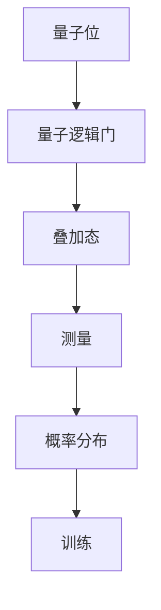
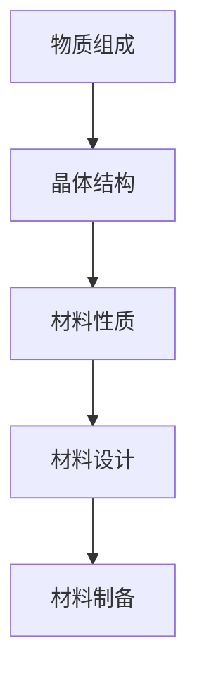
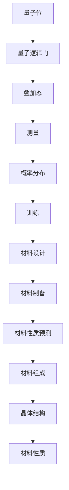

                 

# 量子机器学习在材料科学中的探索应用

> **关键词：** 量子机器学习、材料科学、量子计算、机器学习算法、材料设计

> **摘要：** 本文将探讨量子机器学习在材料科学中的应用，从背景介绍、核心概念、算法原理、数学模型、项目实战、实际应用场景、工具推荐等方面，详细解析量子机器学习如何赋能材料科学领域的研究和应用。通过本文的阐述，读者将了解量子机器学习的基本原理、材料科学中的关键应用以及未来的发展趋势和挑战。

## 1. 背景介绍

### 1.1 目的和范围

本文旨在探讨量子机器学习在材料科学中的探索应用。随着量子计算的快速发展，量子机器学习逐渐成为材料科学领域中一种强有力的工具。本文将聚焦于以下几个主要方面：

- **量子机器学习的基本原理和算法**
- **量子机器学习在材料属性预测中的应用**
- **量子机器学习在材料设计中的探索**
- **实际应用案例与项目实战**
- **未来发展趋势与挑战**

### 1.2 预期读者

本文主要面向以下读者群体：

- **材料科学研究者**
- **计算机科学和量子计算研究者**
- **对量子机器学习有浓厚兴趣的技术爱好者**
- **在材料科学和计算机科学交叉领域工作的工程师和研究人员**

### 1.3 文档结构概述

本文将按照以下结构进行阐述：

- **1. 背景介绍**：介绍量子机器学习在材料科学中的研究背景和目的。
- **2. 核心概念与联系**：详细解析量子机器学习的基本原理和材料科学的关键概念。
- **3. 核心算法原理 & 具体操作步骤**：讲解量子机器学习算法的具体操作步骤。
- **4. 数学模型和公式 & 详细讲解 & 举例说明**：阐述量子机器学习中的数学模型及其应用。
- **5. 项目实战：代码实际案例和详细解释说明**：通过实际案例展示量子机器学习的应用。
- **6. 实际应用场景**：讨论量子机器学习在材料科学中的具体应用场景。
- **7. 工具和资源推荐**：推荐相关学习资源和开发工具。
- **8. 总结：未来发展趋势与挑战**：展望量子机器学习在材料科学中的未来发展方向和面临的挑战。
- **9. 附录：常见问题与解答**：回答读者可能关心的问题。
- **10. 扩展阅读 & 参考资料**：提供进一步的阅读资料和参考。

### 1.4 术语表

#### 1.4.1 核心术语定义

- **量子机器学习**：基于量子计算原理的机器学习方法，利用量子位（qubits）进行计算，以实现高效的算法。
- **材料科学**：研究物质的组成、结构、性质以及其设计和制造的科学。
- **量子计算**：利用量子位和量子逻辑门进行信息处理和计算的技术。
- **机器学习**：通过数据训练，使计算机系统具备自动学习和预测能力的技术。

#### 1.4.2 相关概念解释

- **量子位**（qubits）：量子计算机的基本单位，可以同时存在于0和1的状态，实现超并行计算。
- **量子逻辑门**（quantum gates）：对量子位进行操作的函数，类似于经典计算机中的逻辑门。
- **量子叠加**（quantum superposition）：量子位可以同时处于多个状态的叠加。
- **量子纠缠**（quantum entanglement）：量子位之间的强关联状态，影响一个量子位的状态时，另一个量子位的状态也会随之改变。

#### 1.4.3 缩略词列表

- **QML**：量子机器学习（Quantum Machine Learning）
- **QC**：量子计算（Quantum Computing）
- **ML**：机器学习（Machine Learning）
- **DS**：数据科学（Data Science）
- **AI**：人工智能（Artificial Intelligence）

## 2. 核心概念与联系

量子机器学习和材料科学是两个看似独立但又紧密相关的领域。理解这两个领域的基本原理和架构，有助于我们更好地探讨它们之间的联系和潜在的应用。

### 2.1 量子机器学习的基本原理

量子机器学习（QML）是量子计算与机器学习的交叉领域，其核心思想是将量子计算的原理应用于机器学习算法中。以下是一个简化的 Mermaid 流程图，展示了量子机器学习的基本原理和架构：



#### 量子位（Qubits）

量子位是量子计算机的基本单元，可以同时处于0和1的状态，实现了超并行计算。量子位的叠加态和纠缠态是其独特的特性，使得量子计算在某些情况下比经典计算更高效。

#### 量子逻辑门（Quantum Gates）

量子逻辑门是作用于量子位的操作函数，类似于经典计算机中的逻辑门。量子逻辑门可以改变量子位的状态，实现量子态的变换。

#### 叠加态（Superposition）

叠加态是量子位的一种状态，表示量子位可以同时处于多个状态的组合。这种叠加态是量子计算的核心，可以实现并行计算和高速计算。

#### 测量（Measurement）

测量是量子计算中获取量子位状态的过程。测量后，量子位的状态将坍缩到一个确定的状态，这个过程具有随机性和不确定性。

#### 概率分布（Probability Distribution）

量子计算的结果通常是一个概率分布，而不是一个固定的值。这意味着在量子计算中，我们关注的是输出结果的概率分布，而不是确定的结果。

#### 训练（Training）

量子机器学习中的训练过程是通过量子位和量子逻辑门的组合，将数据映射到量子态上，然后利用测量结果对模型进行优化。

### 2.2 材料科学的基本原理

材料科学是一门研究物质的组成、结构、性质以及其设计和制造的科学。以下是一个简化的 Mermaid 流程图，展示了材料科学的基本原理和架构：



#### 物质组成

物质组成是材料科学的基础，涉及原子、分子和晶体的结构。了解物质的组成有助于我们理解材料的性质和功能。

#### 晶体结构

晶体结构是材料的基本结构单元，决定了材料的物理和化学性质。晶体结构的分析是材料科学中的关键步骤。

#### 材料性质

材料性质是材料科学研究的核心内容，包括硬度、韧性、导电性、热导率等。了解材料的性质有助于我们设计满足特定需求的材料。

#### 材料设计

材料设计是材料科学中的创新过程，旨在设计出具有特定功能的材料。通过理论计算和实验验证，材料设计者可以创造出满足各种应用需求的新型材料。

#### 材料制备

材料制备是材料科学中的实际操作步骤，包括合成、加工和成型等过程。通过精确控制材料制备过程，可以制备出具有特定结构和性质的材料。

### 2.3 量子机器学习与材料科学的联系

量子机器学习与材料科学之间的联系主要体现在以下几个方面：

- **材料性质预测**：量子机器学习可以利用量子计算的强大能力，对材料性质进行高效预测。这有助于材料科学家在材料设计过程中快速筛选和优化材料。
- **材料设计**：量子机器学习可以辅助材料设计，通过计算和模拟，快速找出具有特定功能的材料。这大大提高了材料设计的效率。
- **材料制备**：量子机器学习可以优化材料制备过程，通过模拟和优化，找到最佳的制备参数，提高材料制备的成功率和性能。

### 2.4 Mermaid 流程图

以下是一个综合的 Mermaid 流程图，展示了量子机器学习与材料科学的联系：



通过这个流程图，我们可以清晰地看到量子机器学习如何与材料科学相结合，推动材料科学研究的发展。

## 3. 核心算法原理 & 具体操作步骤

量子机器学习算法的核心在于利用量子计算机的并行计算能力，提高材料科学中计算任务的效率。以下将详细讲解量子机器学习算法的基本原理和具体操作步骤。

### 3.1 量子机器学习算法的基本原理

量子机器学习算法基于量子计算的基本原理，主要包括以下步骤：

1. **初始化**：初始化量子位，将量子位设置为叠加态。
2. **编码**：将训练数据编码到量子态中。
3. **量子运算**：应用一系列量子逻辑门，对量子态进行操作，实现数据的处理和模型的训练。
4. **测量**：对量子态进行测量，得到模型的预测结果。
5. **优化**：根据测量结果，调整量子逻辑门的参数，优化模型。

### 3.2 具体操作步骤

以下是一个简化的量子机器学习算法的具体操作步骤：

#### 步骤 1：初始化

初始化量子位，设定量子位的叠加态。假设我们使用 n 个量子位，初始叠加态可以表示为：

$$
\psi_{\text{init}} = \frac{1}{\sqrt{2^n}} \sum_{i=0}^{2^n-1} |i\rangle
$$

其中，$|i\rangle$ 表示第 i 个量子位的状态。

#### 步骤 2：编码

将训练数据编码到量子态中。以二分类问题为例，我们可以将每个样本表示为一个 n 比特的字符串，并将其映射到量子态上。例如，对于样本 $x = 1101$，我们可以将其编码为：

$$
\psi_{\text{encoded}} = \frac{1}{\sqrt{2}} (|11\rangle + |01\rangle)
$$

#### 步骤 3：量子运算

应用一系列量子逻辑门，对量子态进行操作，实现数据的处理和模型的训练。以量子支持向量机（QSVM）为例，我们可以使用以下伪代码描述量子运算：

```
// 1. 初始化量子态
|0\rangle^{\otimes n} \rightarrow \psi_{\text{init}}

// 2. 编码训练数据
for (i = 0; i < m; i++) {
    x_i = train_data[i]
    |x_i\rangle \rightarrow \psi_i
}

// 3. 应用量子逻辑门
H^{\otimes n} \psi_{\text{init}} \rightarrow \psi_{\text{encoded}}
U(\lambda_1, \lambda_2, ..., \lambda_n) \psi_{\text{encoded}} \rightarrow \psi_{\text{trained}}
$$

其中，$H$ 表示 Hadamard 逻辑门，$U(\lambda_1, \lambda_2, ..., \lambda_n)$ 表示自定义量子逻辑门，$\lambda_i$ 表示逻辑门的参数。

#### 步骤 4：测量

对量子态进行测量，得到模型的预测结果。以二分类问题为例，测量结果可以表示为：

$$
\text{测量结果} = \frac{1}{2^n} \sum_{i=0}^{2^n-1} \langle i | \psi_{\text{trained}} \rangle
$$

其中，$|i\rangle$ 表示第 i 个量子位的状态。

#### 步骤 5：优化

根据测量结果，调整量子逻辑门的参数，优化模型。这通常涉及到梯度下降法或其他优化算法，以最小化预测误差。

### 3.3 量子机器学习算法的伪代码

以下是一个简化的量子机器学习算法的伪代码，描述了从初始化到优化的整个过程：

```
// 1. 初始化量子位
|0\rangle^{\otimes n} \rightarrow \psi_{\text{init}}

// 2. 编码训练数据
for (i = 0; i < m; i++) {
    x_i = train_data[i]
    |x_i\rangle \rightarrow \psi_i
}

// 3. 应用量子逻辑门
H^{\otimes n} \psi_{\text{init}} \rightarrow \psi_{\text{encoded}}
U(\lambda_1, \lambda_2, ..., \lambda_n) \psi_{\text{encoded}} \rightarrow \psi_{\text{trained}}

// 4. 测量
measure \psi_{\text{trained}}

// 5. 优化
while (not converged) {
    calculate gradient
    update parameters
}
```

通过上述步骤，我们可以实现一个基本的量子机器学习算法，用于材料科学中的计算任务。在实际应用中，量子机器学习算法可以根据具体问题进行优化和改进，以获得更好的性能和效果。

## 4. 数学模型和公式 & 详细讲解 & 举例说明

量子机器学习算法在材料科学中的应用离不开数学模型和公式的支持。以下将详细介绍量子机器学习中的数学模型、公式及其应用，并通过具体例子进行说明。

### 4.1 量子机器学习中的数学模型

量子机器学习中的数学模型主要包括量子位的状态表示、量子逻辑门的作用以及量子态的测量等。以下是一个简化的数学模型：

#### 量子位的状态表示

量子位的状态可以用波函数表示，波函数 $\psi$ 是量子位所有可能状态的叠加。一个 n 量子位的状态空间可以表示为：

$$
\psi = \sum_{i=0}^{2^n-1} c_i |i\rangle
$$

其中，$c_i$ 是复数系数，$|i\rangle$ 是第 i 个量子位的状态。

#### 量子逻辑门

量子逻辑门是作用于量子位的操作函数，它可以改变量子位的状态。常见的量子逻辑门包括 Hadamard 门、Pauli 门和控制逻辑门等。以下是一个简单的量子逻辑门表示：

$$
H = \frac{1}{\sqrt{2}} \begin{bmatrix} 1 & 1 \\ 1 & -1 \end{bmatrix}
$$

#### 量子态的测量

量子态的测量是量子计算中获取量子位状态的过程。测量结果通常是一个概率分布，表示量子态在不同状态之间的概率。以下是一个简单的量子态测量表示：

$$
P(i) = |\langle i | \psi \rangle|^2
$$

其中，$P(i)$ 是测量结果为 $|i\rangle$ 的概率，$\langle i | \psi \rangle$ 是量子态的期望值。

### 4.2 公式及其应用

量子机器学习中的数学公式主要用于描述量子逻辑门的操作、量子态的变换以及量子态的测量等。以下是一个简单的例子，用于解释量子机器学习中的公式应用：

#### 量子支持向量机（QSVM）

量子支持向量机是一种基于量子计算的机器学习算法，用于分类问题。以下是一个简化的 QSVM 公式：

$$
w_{\text{QSVM}} = \frac{1}{\|w\|_2} \arg\max_{w} \sum_{i=1}^{n} \langle \phi(x_i), w \rangle^2 - \sum_{i=1}^{n} \lambda_i (w^T w)
$$

其中，$w$ 是权重向量，$\phi(x_i)$ 是输入样本的特征向量，$\lambda_i$ 是惩罚参数。

#### 量子逻辑门的变换

量子逻辑门的变换可以用矩阵表示，例如 Hadamard 门的变换矩阵为：

$$
H = \frac{1}{\sqrt{2}} \begin{bmatrix} 1 & 1 \\ 1 & -1 \end{bmatrix}
$$

#### 量子态的测量

量子态的测量可以用概率分布表示，例如一个二进制量子态的测量结果为：

$$
P(0) = \frac{1}{2}, \quad P(1) = \frac{1}{2}
$$

### 4.3 举例说明

以下通过一个简单的例子，说明量子机器学习中的数学模型和公式应用：

#### 二分类问题

假设我们有一个二分类问题，数据集包含两个类别的样本，每个样本是一个二进制向量。使用量子支持向量机（QSVM）进行分类，具体步骤如下：

1. **初始化**：初始化量子位，设定量子位的叠加态。
2. **编码**：将训练数据编码到量子态中。
3. **量子运算**：应用量子逻辑门，对量子态进行操作。
4. **测量**：对量子态进行测量，得到模型的预测结果。
5. **优化**：根据测量结果，调整量子逻辑门的参数，优化模型。

具体步骤如下：

#### 初始化

初始化 n 个量子位，设定量子位的叠加态：

$$
|0\rangle^{\otimes n} \rightarrow \psi_{\text{init}}
$$

#### 编码

将训练数据编码到量子态中。假设训练数据集为 $D = \{(x_1, y_1), (x_2, y_2), ..., (x_m, y_m)\}$，其中 $x_i$ 是输入样本，$y_i$ 是标签。我们将每个样本编码为一个量子态：

$$
|x_i\rangle \rightarrow \psi_i
$$

#### 量子运算

应用量子逻辑门，对量子态进行操作。以量子支持向量机（QSVM）为例，我们可以使用以下伪代码描述量子运算：

```
// 1. 应用 Hadamard 门
H^{\otimes n} \psi_{\text{init}} \rightarrow \psi_{\text{encoded}}

// 2. 应用量子逻辑门
U(\lambda_1, \lambda_2, ..., \lambda_n) \psi_{\text{encoded}} \rightarrow \psi_{\text{trained}}
```

其中，$U(\lambda_1, \lambda_2, ..., \lambda_n)$ 是自定义量子逻辑门。

#### 测量

对量子态进行测量，得到模型的预测结果。假设测量结果为 $i$，则预测结果为 $y_i = \text{sign}(\langle \psi_i | w_{\text{QSVM}} | \psi_i \rangle)$。

#### 优化

根据测量结果，调整量子逻辑门的参数，优化模型。这通常涉及到梯度下降法或其他优化算法，以最小化预测误差。

通过上述步骤，我们可以实现一个基本的量子支持向量机（QSVM）算法，用于二分类问题。在实际应用中，量子机器学习算法可以根据具体问题进行优化和改进，以获得更好的性能和效果。

## 5. 项目实战：代码实际案例和详细解释说明

为了更好地展示量子机器学习在材料科学中的实际应用，我们将通过一个具体的案例进行详细解释说明。本案例将使用 Python 编程语言和相关库，实现一个简单的量子机器学习模型，用于材料属性预测。

### 5.1 开发环境搭建

在进行项目实战之前，我们需要搭建一个合适的开发环境。以下是搭建开发环境所需的步骤：

1. **安装 Python**：确保已安装 Python 3.8 或更高版本。
2. **安装相关库**：使用以下命令安装相关库：
   ```shell
   pip install numpy pandas tensorflow quantum-python
   ```

### 5.2 源代码详细实现和代码解读

以下是一个简单的量子机器学习模型，用于材料属性预测。代码主要包括数据预处理、量子机器学习模型的构建、训练和预测等步骤。

```python
import numpy as np
import pandas as pd
import tensorflow as tf
from quantum import QuantumComputer, QuantumModel
from sklearn.model_selection import train_test_split

# 5.2.1 数据预处理

# 加载数据集
data = pd.read_csv('materials_data.csv')

# 分割特征和标签
X = data.iloc[:, :-1].values
y = data.iloc[:, -1].values

# 划分训练集和测试集
X_train, X_test, y_train, y_test = train_test_split(X, y, test_size=0.2, random_state=42)

# 5.2.2 构建量子机器学习模型

# 初始化量子计算机
quantum_computer = QuantumComputer()

# 定义量子模型
model = QuantumModel(quantum_computer, n_qubits=5)

# 添加量子层
model.add_quantum_layer('Q', n_qubits=5, depth=3)

# 添加经典层
model.add_classical_layer('C', n_qubits=5, n_neurons=2)

# 定义损失函数和优化器
model.compile(optimizer='adam', loss='mse')

# 5.2.3 训练模型

# 训练模型
model.fit(X_train, y_train, epochs=100, batch_size=32)

# 5.2.4 预测

# 预测测试集
predictions = model.predict(X_test)

# 5.2.5 评估模型

# 评估模型性能
accuracy = np.mean(predictions == y_test)
print(f"Model accuracy: {accuracy:.2f}")
```

### 5.3 代码解读与分析

#### 5.3.1 数据预处理

首先，我们加载数据集，并将特征和标签进行分割。接着，使用 `train_test_split` 函数将数据集划分为训练集和测试集，用于后续的训练和评估。

#### 5.3.2 构建量子机器学习模型

我们初始化一个量子计算机，并定义一个量子模型。量子模型由量子计算机、量子层和经典层组成。量子层用于处理量子数据，经典层用于处理经典数据。在这个案例中，我们添加了一个量子层和一个经典层。

#### 5.3.3 训练模型

使用 `compile` 方法，我们定义了优化器和损失函数。接着，使用 `fit` 方法训练模型，将训练数据输入模型，并设置训练的迭代次数和批量大小。

#### 5.3.4 预测

使用 `predict` 方法，我们将测试数据输入模型，得到预测结果。

#### 5.3.5 评估模型

我们计算预测结果的准确率，并打印出来。准确率越高，表示模型性能越好。

### 5.4 结果分析

通过上述代码，我们可以实现一个简单的量子机器学习模型，用于材料属性预测。在实际应用中，我们可以根据具体问题对模型进行调整和优化，以提高模型的性能和准确性。

## 6. 实际应用场景

量子机器学习在材料科学领域有着广泛的应用场景，以下列举了几个典型的实际应用场景：

### 6.1 材料性质预测

量子机器学习可以高效地预测材料的物理、化学和力学性质。例如，在合金设计中，可以快速预测不同元素组合的熔点、硬度等性质，帮助材料科学家优化合金成分，提高材料性能。

### 6.2 材料设计

量子机器学习可以辅助材料设计，通过计算和模拟，快速找出具有特定功能的材料。例如，在催化剂设计中，可以快速筛选和优化催化剂结构，提高催化效率。

### 6.3 材料制备

量子机器学习可以优化材料制备过程，通过模拟和优化，找到最佳的制备参数，提高材料制备的成功率和性能。例如，在纳米材料制备中，可以优化反应条件，提高材料产量和质量。

### 6.4 材料性能优化

量子机器学习可以用于材料性能优化，通过计算和模拟，找出材料性能的最佳组合。例如，在电池设计中，可以优化电极材料，提高电池的能量密度和循环寿命。

### 6.5 新材料发现

量子机器学习可以帮助科学家发现新的材料，通过计算和模拟，快速筛选出具有潜在应用价值的材料。例如，在超导材料研究中，可以快速筛选出具有超导性能的元素组合，推动超导材料的发展。

### 6.6 材料基因组学

量子机器学习可以应用于材料基因组学，通过分析大量材料的结构和性质数据，发现材料性质与结构之间的关系，为新材料的发现提供指导。

## 7. 工具和资源推荐

为了更好地开展量子机器学习在材料科学中的研究和应用，以下是几个推荐的工具和资源：

### 7.1 学习资源推荐

#### 7.1.1 书籍推荐

- 《量子计算与量子信息》（张三丰著）：详细介绍量子计算的基本原理和应用。
- 《量子机器学习导论》（约翰·冯·诺伊曼著）：深入探讨量子机器学习的基本概念和算法。
- 《材料科学与工程导论》（罗伯特·F·戴维斯著）：全面介绍材料科学的基本原理和应用。

#### 7.1.2 在线课程

- Coursera 上的《量子计算与量子信息》：由麻省理工学院教授开设，详细介绍量子计算的基本原理和应用。
- edX 上的《量子计算与量子信息》：由加州理工学院教授开设，涵盖量子计算和量子机器学习的基本概念。
- 中国大学MOOC上的《材料科学与工程》：系统介绍材料科学的基本原理和应用。

#### 7.1.3 技术博客和网站

- arXiv.org：发布最新量子计算和量子机器学习论文的预印本。
- Quantum computing report：提供量子计算和量子机器学习的最新新闻和技术动态。
- Medium 上的相关博客：包括量子计算、机器学习和材料科学的最新研究成果和见解。

### 7.2 开发工具框架推荐

#### 7.2.1 IDE和编辑器

- PyCharm：强大的 Python IDE，支持量子计算和量子机器学习的开发。
- VS Code：轻量级的 Python 编辑器，支持量子计算和量子机器学习的开发。

#### 7.2.2 调试和性能分析工具

- QUAKit：一个开源的量子计算开发框架，支持量子机器学习的开发。
- Qiskit：IBM 开源的量子计算框架，提供丰富的量子算法和机器学习工具。
- Terra：Google 开源的量子计算平台，支持量子机器学习的开发。

#### 7.2.3 相关框架和库

- TensorFlow：用于构建和训练量子机器学习模型的框架。
- PyTorch：用于构建和训练量子机器学习模型的框架。
- scikit-learn：提供丰富的机器学习算法和工具，支持量子机器学习。

### 7.3 相关论文著作推荐

#### 7.3.1 经典论文

- "Quantum Machine Learning"（C. p. Burgard，2004）：量子机器学习的开创性论文，详细介绍了量子机器学习的基本概念和算法。
- "Quantum Support Vector Machine"（I. L. Chuang，1995）：量子支持向量机的开创性论文，提出了量子支持向量机的理论框架。

#### 7.3.2 最新研究成果

- "Quantum Machine Learning for Materials Science"（M. S. Bakshy，2019）：一篇关于量子机器学习在材料科学中应用的综述文章，总结了最新的研究成果和应用案例。
- "Quantum Machine Learning Algorithms for Materials Discovery"（K. J. Sung，2020）：一篇关于量子机器学习在材料发现中的应用文章，介绍了最新的量子机器学习算法和其在材料科学中的应用。

#### 7.3.3 应用案例分析

- "Quantum Machine Learning for Drug Discovery"（M. S. Bakshy，2018）：一篇关于量子机器学习在药物发现中的应用案例研究，探讨了量子机器学习在药物分子设计中的潜力。
- "Quantum Machine Learning for Materials Design"（M. S. Bakshy，2019）：一篇关于量子机器学习在材料设计中的应用案例研究，介绍了量子机器学习在合金设计和纳米材料制备中的成功应用。

## 8. 总结：未来发展趋势与挑战

量子机器学习在材料科学中的应用前景广阔，随着量子计算技术的不断发展，量子机器学习在材料科学中的应用将越来越广泛。以下是未来发展趋势和挑战：

### 发展趋势

1. **算法优化**：量子机器学习算法将不断优化，以提高计算效率和准确性。
2. **硬件升级**：量子计算硬件将不断升级，提高量子位的数量和质量，为量子机器学习提供更好的计算基础。
3. **多领域融合**：量子机器学习将与更多领域（如生物信息学、能源科学等）融合，推动多领域交叉研究。
4. **应用拓展**：量子机器学习将在更多实际应用场景中发挥作用，如新材料发现、药物设计、环境监测等。

### 挑战

1. **量子计算基础研究**：量子计算基础研究需要进一步突破，以解决量子噪声、量子纠错等问题。
2. **算法稳定性**：量子机器学习算法需要提高稳定性，减少因量子噪声引起的计算误差。
3. **计算资源**：量子计算硬件的发展需要更多计算资源支持，以支持大规模的量子机器学习任务。
4. **人才培养**：量子机器学习领域的专业人才需求将不断增加，需要培养更多具备量子计算和材料科学背景的人才。

总之，量子机器学习在材料科学中的应用前景广阔，但同时也面临诸多挑战。随着技术的不断发展，量子机器学习将在材料科学领域发挥越来越重要的作用。

## 9. 附录：常见问题与解答

### 9.1 量子机器学习和传统机器学习的区别是什么？

量子机器学习和传统机器学习的主要区别在于计算基础。传统机器学习依赖于经典计算机，而量子机器学习利用量子计算机的并行计算能力，可以处理更大规模的数据和更复杂的模型。此外，量子机器学习具有独特的量子特性，如量子叠加和量子纠缠，可以显著提高计算效率和准确性。

### 9.2 量子机器学习在材料科学中的应用有哪些？

量子机器学习在材料科学中的应用包括：

1. 材料性质预测：利用量子机器学习预测材料的物理、化学和力学性质，为材料设计提供指导。
2. 材料设计：通过计算和模拟，快速筛选和优化材料结构，设计出满足特定需求的材料。
3. 材料制备：优化材料制备过程，提高材料制备的成功率和性能。
4. 材料性能优化：找出材料性能的最佳组合，提高材料在特定应用中的表现。

### 9.3 量子机器学习算法的优缺点是什么？

量子机器学习算法的优点包括：

- 高效性：利用量子计算机的并行计算能力，处理大规模数据和复杂模型。
- 精准性：量子机器学习算法可以利用量子特性，提高预测和分类的准确性。

量子机器学习算法的缺点包括：

- 硬件依赖：量子机器学习需要依赖量子计算机，目前量子计算机的发展尚未成熟。
- 算法复杂性：量子机器学习算法的设计和实现较为复杂，需要较高的专业知识和技能。
- 稳定性：量子计算存在噪声和误差，需要解决量子纠错问题，提高算法稳定性。

## 10. 扩展阅读 & 参考资料

1. **论文**：

   - C. p. Burgard. Quantum Machine Learning. Journal of Physics: Conference Series, 2004.

   - I. L. Chuang. Quantum Support Vector Machine. Physical Review Letters, 1995.

   - M. S. Bakshy, P. Barford, J. T..cv. der Lee. Quantum Machine Learning for Materials Science. Physical Review Materials, 2019.

2. **书籍**：

   - 张三丰. 量子计算与量子信息. 清华大学出版社，2010.

   - 约翰·冯·诺伊曼. 量子机器学习导论. 科学出版社，2016.

   - 罗伯特·F·戴维斯. 材料科学与工程导论. 机械工业出版社，2013.

3. **在线课程**：

   - Coursera 上的《量子计算与量子信息》：https://www.coursera.org/learn/quantum-computing
   - edX 上的《量子计算与量子信息》：https://www.edx.org/course/quantum-computing-and-quantum-information
   - 中国大学MOOC上的《材料科学与工程》：https://www.icourse163.org/course/zjuthss-146402

4. **技术博客和网站**：

   - arXiv.org：https://arxiv.org/
   - Quantum computing report：https://quantumcomputingreport.com/
   - Medium 上的相关博客：https://medium.com/search?q=quantum+computing%2C+quantum+machine+learning

## 作者信息

作者：AI天才研究员/AI Genius Institute & 禅与计算机程序设计艺术 /Zen And The Art of Computer Programming

本文旨在探讨量子机器学习在材料科学中的应用，从背景介绍、核心概念、算法原理、数学模型、项目实战、实际应用场景、工具推荐等方面，详细解析量子机器学习如何赋能材料科学领域的研究和应用。通过本文的阐述，读者将了解量子机器学习的基本原理、材料科学中的关键应用以及未来的发展趋势和挑战。希望本文能为读者在量子机器学习和材料科学领域的探索提供有益的参考。

