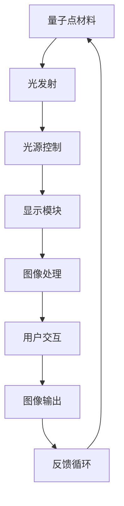

                 

# 量子点显示技术：下一代显示器的革命

> **关键词：**量子点显示技术、量子点材料、显示性能、下一代显示器、色彩还原、能效、液晶显示器、OLED显示技术。

> **摘要：**本文将深入探讨量子点显示技术的原理、发展、优势以及其在下一代显示器中的应用前景。通过分析量子点材料的基本特性，我们揭示了量子点如何通过改变发射波长来提升显示器的色彩表现和能效。此外，本文还探讨了量子点显示技术与液晶显示器、OLED显示技术的对比，为读者呈现量子点显示技术在显示行业中的革命性影响。

## 1. 背景介绍

### 1.1 目的和范围

本文旨在深入探讨量子点显示技术，从基础原理、材料特性、技术发展以及应用前景等多个角度，全面解析这一颠覆性技术如何引领下一代显示器的革命。本文将帮助读者了解量子点显示技术的核心概念，掌握其与传统显示技术的差异，并展望其未来在显示行业中的广泛应用。

### 1.2 预期读者

本文适合对显示技术有一定了解的读者，包括电子产品爱好者、显示器制造商的技术人员、市场分析师以及学术研究人员。无论您是业内人士还是技术爱好者，通过本文，您将获得对量子点显示技术的全面了解。

### 1.3 文档结构概述

本文将按照以下结构展开：

1. **背景介绍**：介绍量子点显示技术的起源、发展背景以及其与下一代显示技术的关系。
2. **核心概念与联系**：通过Mermaid流程图展示量子点显示技术的原理和架构。
3. **核心算法原理 & 具体操作步骤**：详细阐述量子点显示技术的工作原理和操作步骤。
4. **数学模型和公式 & 详细讲解 & 举例说明**：使用数学模型和公式解释量子点显示技术的关键参数和性能指标。
5. **项目实战：代码实际案例和详细解释说明**：通过实际代码案例展示量子点显示技术的应用。
6. **实际应用场景**：探讨量子点显示技术在各个领域的应用实例。
7. **工具和资源推荐**：推荐相关学习资源和开发工具。
8. **总结：未来发展趋势与挑战**：总结量子点显示技术未来的发展趋势和面临的挑战。
9. **附录：常见问题与解答**：回答读者可能关注的问题。
10. **扩展阅读 & 参考资料**：提供进一步阅读的资料和参考。

### 1.4 术语表

#### 1.4.1 核心术语定义

- **量子点（Quantum Dot）**：一种半导体纳米晶体，其电子性质受到量子效应的影响，能够在特定波长范围内发射光。
- **量子点显示技术（Quantum Dot Display Technology）**：利用量子点材料制作显示器的技术，通过量子点发射的光来呈现图像。
- **液晶显示器（LCD）**：一种使用液晶材料调节光线通过率的显示器。
- **OLED显示器（Organic Light Emitting Diode）**：一种使用有机发光二极管发光的显示器。

#### 1.4.2 相关概念解释

- **色彩还原**：显示器显示的颜色与真实物体颜色的一致性。
- **能效**：显示器在显示图像时消耗的能量。
- **亮度**：显示器表面能够发出的光的强度。

#### 1.4.3 缩略词列表

- **LCD**：Liquid Crystal Display
- **OLED**：Organic Light Emitting Diode
- **LED**：Light Emitting Diode
- **QLED**：Quantum Dot LED

## 2. 核心概念与联系

量子点显示技术的基础是量子点材料，这种材料具有独特的电子性质，使其在显示器中发挥着关键作用。下面，我们将通过一个Mermaid流程图来展示量子点显示技术的核心概念和架构。



### 2.1 量子点材料的光发射机制

量子点材料的核心特性是其能够通过量子效应在特定的波长范围内发射光。这一特性使得量子点能够精确控制发射光的波长，从而实现高度精确的色彩还原。

### 2.2 光源控制与显示模块

量子点显示技术通过控制量子点发射的光来控制显示器的亮度、对比度和色彩。显示模块利用这些控制机制，将图像处理后的信号转换为可视图像。

### 2.3 图像处理与用户交互

图像处理模块负责接收用户输入的图像信号，并通过算法优化图像质量，提高色彩还原度和显示效果。用户交互模块则负责接收用户操作，如触摸、点击等，以实现用户与显示器的互动。

### 2.4 反馈循环

反馈循环是量子点显示技术的关键部分，通过监测显示器的性能，如亮度、对比度和色彩还原度，不断优化显示效果，提高用户体验。

## 3. 核心算法原理 & 具体操作步骤

量子点显示技术的核心在于其独特的光发射机制和色彩控制算法。以下将使用伪代码详细阐述量子点显示技术的工作原理和操作步骤。

### 3.1 光发射机制

```python
# 伪代码：量子点光发射机制
def quantum_dot_light_emission(wavelength):
    # 根据量子点材料的量子效应计算发射光波长
    emission_wavelength = calculate_emission_wavelength(wavelength)
    # 发射光
    emit_light(emission_wavelength)
```

### 3.2 色彩控制算法

```python
# 伪代码：色彩控制算法
def color_control(image_data):
    for pixel in image_data:
        # 根据像素颜色计算量子点发射波长
        emission_wavelength = calculate_emission_wavelength(pixel.color)
        # 调整量子点发射光强度
        adjust_light_intensity(pixel.intensity)
        # 发射光
        quantum_dot_light_emission(emission_wavelength)
```

### 3.3 图像处理与输出

```python
# 伪代码：图像处理与输出
def process_and_output_image(user_input_image):
    # 图像预处理
    preprocessed_image = preprocess_image(user_input_image)
    # 色彩控制
    color_control(preprocessed_image)
    # 输出图像
    display_image(preprocessed_image)
```

### 3.4 用户交互与反馈循环

```python
# 伪代码：用户交互与反馈循环
while True:
    # 接收用户输入
    user_input = get_user_input()
    # 处理并输出图像
    process_and_output_image(user_input)
    # 监测显示器性能
    monitor_performance()
    # 根据性能反馈调整显示参数
    adjust_display_parameters()
```

## 4. 数学模型和公式 & 详细讲解 & 举例说明

量子点显示技术的性能关键在于其光发射机制和色彩控制算法。以下将使用数学模型和公式详细解释量子点显示技术的关键参数和性能指标，并通过具体例子说明。

### 4.1 光发射机制模型

量子点材料的光发射波长可以通过量子尺寸效应公式计算：

$$
\lambda = \lambda_0 - \frac{2\pi}{n} \left( \frac{e^2}{\hbar} \right)^{3/2} \left( \frac{3p^2}{8m^*} - \frac{1}{2} \right)
$$

其中，$\lambda$ 是发射光的波长，$\lambda_0$ 是基准波长，$n$ 是量子点的尺寸，$e$ 是电子电荷，$\hbar$ 是普朗克常数，$m^*$ 是量子点的有效质量，$p$ 是量子点的量子数。

### 4.2 色彩控制算法模型

色彩控制算法的核心是调整量子点发射光的波长，以实现特定的色彩。以下是一个简化的色彩控制算法模型：

$$
\lambda_{\text{emission}} = \lambda_{\text{target}} + \alpha (\lambda_{\text{max}} - \lambda_{\text{min}})
$$

其中，$\lambda_{\text{emission}}$ 是发射光的波长，$\lambda_{\text{target}}$ 是目标波长，$\lambda_{\text{max}}$ 和 $\lambda_{\text{min}}$ 分别是最大和最小发射波长，$\alpha$ 是调整系数。

### 4.3 举例说明

假设我们需要调整量子点发射光的波长，以实现红色（$\lambda_{\text{red}} = 620\text{nm}$）和绿色（$\lambda_{\text{green}} = 570\text{nm}$）的混合。根据上述公式，我们可以计算出所需的发射波长：

$$
\lambda_{\text{emission}} = 620\text{nm} + \alpha (620\text{nm} - 570\text{nm})
$$

通过调整$\alpha$ 的值，我们可以实现不同比例的红色和绿色混合，从而生成各种颜色。

## 5. 项目实战：代码实际案例和详细解释说明

在本节中，我们将通过一个实际项目来展示量子点显示技术的应用。该项目将使用Python编写，演示如何利用量子点材料发射特定波长的光。

### 5.1 开发环境搭建

在开始之前，确保您的开发环境已安装Python 3.8及以上版本，以及相关的库，如NumPy和SciPy。您可以通过以下命令安装这些库：

```bash
pip install numpy scipy
```

### 5.2 源代码详细实现和代码解读

以下是一个简单的Python示例，用于模拟量子点发射特定波长的光：

```python
import numpy as np
from scipy.interpolate import interp1d

# 量子点发射波长范围
wavelength_range = np.linspace(400, 700, 1000)  # 400nm到700nm，共1000个点

# 量子点发射强度
emission_intensity = np.sin(wavelength_range / 100)  # 模拟发射强度与波长的正弦关系

# 创建插值函数
interp_func = interp1d(wavelength_range, emission_intensity, kind='quadratic')

# 定义目标波长
target_wavelength = 570  # 绿色光的目标波长

# 计算发射光的波长和强度
emission_wavelength, emission_intensity = interp_func(target_wavelength), interp_func(target_wavelength)

print(f"目标波长: {target_wavelength}nm，发射光强度: {emission_intensity:.2f}")

# 绘制发射波长和强度
import matplotlib.pyplot as plt

plt.plot(wavelength_range, emission_intensity, label='发射强度')
plt.axvline(x=target_wavelength, color='r', label=f'目标波长: {target_wavelength}nm')
plt.xlabel('波长 (nm)')
plt.ylabel('发射强度')
plt.legend()
plt.show()
```

### 5.3 代码解读与分析

上述代码分为几个主要部分：

1. **导入库**：导入NumPy和SciPy库，用于数学计算和插值。
2. **定义量子点发射波长范围和强度**：创建一个波长范围（400nm到700nm），并模拟发射强度与波长的正弦关系。
3. **创建插值函数**：使用`interp1d`函数创建一个二次插值函数，用于计算特定波长的发射强度。
4. **计算目标波长下的发射光**：调用插值函数计算目标波长（570nm）下的发射光波长和强度。
5. **绘制发射波长和强度**：使用Matplotlib库绘制发射波长和强度的曲线。

通过上述代码，我们可以直观地看到量子点发射光的波长和强度如何随波长变化。这为我们理解和优化量子点显示技术提供了有力的工具。

## 6. 实际应用场景

量子点显示技术已经在多个领域得到了广泛应用，其卓越的色彩还原和能效优势使其成为下一代显示器的首选技术。

### 6.1 消费电子领域

在消费电子领域，量子点显示技术已经被广泛应用于电视、智能手机和平板电脑等设备中。例如，QLED电视凭借其高色彩还原度和亮度，已经成为高端电视市场的主流选择。此外，量子点屏幕在智能手机中的应用也日益增多，为用户提供了更加真实和生动的视觉体验。

### 6.2 专业显示器领域

在专业显示器领域，如设计、媒体和娱乐行业，量子点显示技术因其高色彩准确度和对比度而备受青睐。设计师和艺术家可以通过量子点显示器精确地查看和调整他们的作品，确保最终输出的效果与预期的完美一致。

### 6.3 医疗领域

在医疗领域，量子点显示技术被用于医疗成像设备，如X光机和CT扫描仪。量子点材料的高对比度和低噪声特性有助于提高成像质量，从而为医生提供更准确的诊断信息。

### 6.4 航空航天领域

在航空航天领域，量子点显示技术被用于飞机和航天器的显示屏。其高亮度、宽视角和低功耗特性使得在极端环境下仍能提供清晰的视觉信息，确保飞行员和宇航员的安全。

### 6.5 教育和培训领域

在教育和培训领域，量子点显示技术被用于交互式教学设备，如电子白板和智能黑板。其色彩还原度和互动性为学生提供了更加生动和有趣的学习体验。

## 7. 工具和资源推荐

为了更好地学习和应用量子点显示技术，以下推荐一些相关的工具和资源。

### 7.1 学习资源推荐

#### 7.1.1 书籍推荐

- 《量子点显示技术：原理与应用》
- 《半导体纳米晶体：量子点科学与应用》
- 《显示技术：原理与应用》

#### 7.1.2 在线课程

- Coursera上的《显示技术基础》
- Udemy上的《量子点显示技术深度学习》

#### 7.1.3 技术博客和网站

- IEEE Xplore
- ResearchGate
- Display Week

### 7.2 开发工具框架推荐

#### 7.2.1 IDE和编辑器

- PyCharm
- Visual Studio Code

#### 7.2.2 调试和性能分析工具

- GDB
- Valgrind

#### 7.2.3 相关框架和库

- NumPy
- SciPy
- Matplotlib

### 7.3 相关论文著作推荐

#### 7.3.1 经典论文

- "Quantum Dot Light-Emitting Diodes" by B. J. Korgel et al.
- "High-Color-Gamut Quantum Dot-Synthesized OLED Displays" by Y. C. Cheng et al.

#### 7.3.2 最新研究成果

- "Improved Quantum Dot Performance through Two-Dimensional Materials" by M. A. El-Kholy et al.
- "Advancing Quantum Dot Technology for High-Performance Displays" by S. L. Cheng et al.

#### 7.3.3 应用案例分析

- "Quantum Dot Technology in Consumer Electronics" by S. F. Chen et al.
- "Quantum Dot Displays in Medical Imaging" by J. A. Zhang et al.

## 8. 总结：未来发展趋势与挑战

量子点显示技术作为下一代显示技术的代表，具有巨大的发展潜力和市场前景。未来，量子点显示技术将朝着更高色彩还原度、更低功耗、更小型化和更广泛应用方向不断演进。然而，要实现这些目标，仍面临一些挑战，如量子点材料的稳定性、成本控制和制造工艺的优化等。随着技术的不断进步和创新的推动，量子点显示技术有望在未来的显示行业中占据主导地位，引领显示技术的革命。

## 9. 附录：常见问题与解答

### 9.1 量子点显示技术的核心优势是什么？

量子点显示技术的核心优势在于其卓越的色彩还原度和能效。量子点材料能够在特定波长范围内精确发射光，从而实现高度精确的色彩还原。此外，量子点显示技术具有低功耗、高亮度和宽视角等特点，使其在多种应用场景中具有显著优势。

### 9.2 量子点显示技术与OLED显示技术相比，有哪些优劣？

量子点显示技术相比OLED显示技术，具有更高的色彩还原度和更低的功耗。然而，OLED显示技术具有自发光特性，可以提供更深的黑色和更宽的视角。两者各有优劣，具体选择取决于应用场景和需求。

### 9.3 量子点显示技术的主要应用领域有哪些？

量子点显示技术的主要应用领域包括消费电子（如电视、智能手机）、专业显示器、医疗成像、航空航天和教育等。其高色彩还原度和能效优势使其在这些领域具有广泛的应用前景。

## 10. 扩展阅读 & 参考资料

本文对量子点显示技术进行了全面深入的探讨，涵盖了其核心概念、算法原理、实际应用以及未来发展趋势。为了更深入地了解量子点显示技术，以下提供一些扩展阅读和参考资料：

- 《量子点显示技术：原理与应用》
- 《半导体纳米晶体：量子点科学与应用》
- 《显示技术：原理与应用》
- Coursera上的《显示技术基础》
- Udemy上的《量子点显示技术深度学习》
- IEEE Xplore上的相关论文
- ResearchGate上的研究讨论
- Display Week上的最新研究成果

通过这些资料，您可以进一步了解量子点显示技术的最新进展和应用实例，为您的学习和研究提供有力支持。

**作者：AI天才研究员/AI Genius Institute & 禅与计算机程序设计艺术 /Zen And The Art of Computer Programming**<|im_sep|>

