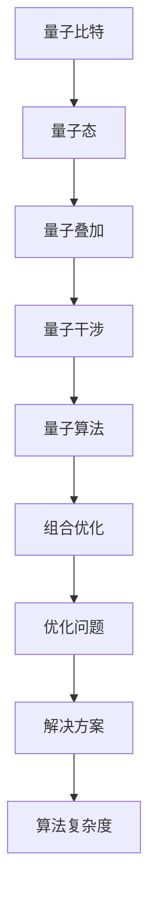

                 

# 量子算法在组合优化问题中的应用

> 关键词：量子算法，组合优化，量子计算机，算法复杂度，量子计算模拟

> 摘要：本文将深入探讨量子算法在解决组合优化问题中的应用。通过介绍量子算法的基本原理和具体操作步骤，结合数学模型和公式，以及实际项目案例的代码解读，本文旨在为读者提供一个全面且深入的理解，以揭示量子算法在优化问题解决中的潜力和挑战。

## 1. 背景介绍

### 1.1 目的和范围

本文旨在介绍量子算法在解决组合优化问题中的应用。我们将从量子算法的基本概念出发，逐步深入到具体的算法原理和操作步骤，结合数学模型和公式，并通过实际项目案例的代码解读，使读者对量子算法在优化问题中的优势和局限性有更加清晰的认识。

### 1.2 预期读者

本文适用于对计算机科学和量子计算有一定基础的读者，特别是对组合优化和算法设计感兴趣的工程师、研究人员和学生。

### 1.3 文档结构概述

本文将分为以下几个部分：

1. **核心概念与联系**：介绍量子算法的基本概念，以及其在组合优化问题中的应用。
2. **核心算法原理 & 具体操作步骤**：通过伪代码详细阐述量子算法的操作流程。
3. **数学模型和公式 & 详细讲解 & 举例说明**：结合数学模型，解释量子算法中的关键公式。
4. **项目实战：代码实际案例和详细解释说明**：通过实际项目案例，展示量子算法的应用。
5. **实际应用场景**：探讨量子算法在不同领域的应用。
6. **工具和资源推荐**：推荐学习资源和开发工具。
7. **总结：未来发展趋势与挑战**：展望量子算法在未来的发展趋势和面临的挑战。
8. **附录：常见问题与解答**：解答读者可能遇到的问题。
9. **扩展阅读 & 参考资料**：提供进一步阅读的资料。

### 1.4 术语表

#### 1.4.1 核心术语定义

- **量子算法**：基于量子力学原理设计的算法，利用量子比特的状态叠加和量子干涉现象进行计算。
- **组合优化**：寻找给定问题中最佳解决方案的过程，常涉及组合数学和优化理论。
- **量子计算机**：利用量子力学原理进行计算的计算机，具有传统计算机无法比拟的计算能力。
- **算法复杂度**：描述算法执行所需资源（如时间、空间）的增长速率。

#### 1.4.2 相关概念解释

- **量子比特**：量子计算机的基本计算单元，可以同时表示0和1的状态。
- **量子叠加**：量子比特可以同时处于多个状态的组合。
- **量子干涉**：量子比特之间的相互作用，影响计算结果的概率分布。
- **量子态**：量子比特的状态描述，通常用复数系数的向量表示。

#### 1.4.3 缩略词列表

- **QAOA**：量子近似优化算法（Quantum Approximate Optimization Algorithm）
- **QC**：量子计算机（Quantum Computer）
- **Grover's Algorithm**：Grover搜索算法
- **Shor's Algorithm**：Shor因数分解算法

## 2. 核心概念与联系

在深入探讨量子算法在组合优化问题中的应用之前，我们需要先了解一些核心概念和它们之间的关系。以下是量子算法在组合优化问题中的基本概念及其相互关系的Mermaid流程图：



### 2.1 量子比特

量子比特是量子计算机的基本计算单元，与传统计算机的比特不同，量子比特可以同时处于0和1的状态，这种现象称为叠加。量子比特的数量决定了量子计算机的容量，即量子比特的数量越多，计算能力越强。

### 2.2 量子态

量子态是量子比特的状态描述，通常用复数系数的向量表示。量子态的叠加和干涉现象使得量子计算机能够处理大量并行计算。

### 2.3 量子叠加

量子叠加是量子计算机的核心特性之一，它使得量子比特能够同时处于多个状态。这一特性是量子计算机超越传统计算机的重要基础。

### 2.4 量子干涉

量子干涉是指量子比特之间的相互作用，这种相互作用会影响计算结果的概率分布。量子干涉现象是量子计算中的关键机制。

### 2.5 量子算法

量子算法是基于量子力学原理设计的算法，利用量子比特的叠加和干涉现象进行计算。量子算法的核心目标是通过量子计算模型解决传统计算机难以处理的问题。

### 2.6 组合优化

组合优化是寻找给定问题中最佳解决方案的过程，常涉及组合数学和优化理论。组合优化问题是计算机科学和工程中常见的问题类型。

### 2.7 优化问题

优化问题是一类具有明确目标和约束条件的数学问题，其核心是寻找最优解。优化问题是组合优化问题的重要组成部分。

### 2.8 算法复杂度

算法复杂度是描述算法执行所需资源（如时间、空间）的增长速率。算法复杂度是评估算法性能的重要指标。

通过上述核心概念和相互关系的介绍，我们为后续内容的展开奠定了基础。在接下来的章节中，我们将深入探讨量子算法的具体原理和操作步骤。

## 3. 核心算法原理 & 具体操作步骤

在理解了量子算法在组合优化问题中的核心概念后，我们将进一步探讨量子算法的基本原理和具体操作步骤。以下是量子算法的详细原理及操作步骤：

### 3.1 量子计算模型

量子算法是基于量子计算模型设计的。量子计算模型由量子比特、量子门、量子测量等基本元素组成。量子比特是量子计算机的基本计算单元，可以同时处于多个状态，即叠加态。量子门是对量子比特进行操作的矩阵，可以通过一系列量子门将初始状态转换为目标状态。量子测量是从叠加态中提取信息的过程，通常会导致量子比特坍缩到某个确定的状态。

### 3.2 量子近似优化算法（QAOA）

量子近似优化算法（QAOA）是解决组合优化问题的一种常见量子算法。QAOA的基本思想是使用量子电路将优化问题编码为量子态，然后通过量子计算找到最优解。QAOA的具体操作步骤如下：

1. **初始化量子态**：使用初始参数设置量子态。通常，初始量子态是一个均匀分布的叠加态。
   ```python
   |ψ⟩ = (1/√N)∑_{i=1}^{N} |i⟩
   ```
2. **构建量子电路**：构建一个由量子门组成的量子电路，用于将初始量子态转换为优化问题的解。量子电路通常包括两个部分：参数化的量子门和测量操作。
   ```python
   U(θ) = (U_1(θ_1) ⊗ U_2(θ_2) ⊗ ... ⊗ U_m(θ_m))
   ```
3. **参数化量子门**：参数化的量子门是量子电路的核心，用于编码优化问题的约束条件和目标函数。参数化的量子门通常包括Hadamard门（用于创建叠加态）、旋转门（用于编码约束条件）和CNOT门（用于实现相互作用）。
   ```python
   U(θ) = e^(iθH) ⊗ e^(iθR) ⊗ e^(iθCNOT)
   ```
4. **执行量子计算**：通过量子计算机执行量子电路，将初始量子态转换为可能的解。量子计算的结果通常是一个概率分布，表示不同解的概率。
   ```python
   P(|x⟩) = |⟨x|ψ⟩|^2
   ```
5. **测量结果**：对量子态进行测量，从概率分布中提取最优解。测量结果可能不是精确的最优解，但可以通过多次迭代和优化得到较为精确的解。
   ```python
   x* = argmax_{x} P(|x⟩)
   ```

### 3.3 伪代码

以下是QAOA算法的伪代码描述：

```python
# QAOA算法伪代码
def QAOA(hamiltonian, objective_function, num_steps, num_trials):
    # 初始化参数
    theta = initialize_theta(num_steps)
    best_solution = None
    best_score = -inf

    # 迭代次数
    for trial in range(num_trials):
        # 构建量子电路
        quantum_circuit = build_quantum_circuit(hamiltonian, objective_function, theta)

        # 执行量子计算
        result = execute_quantum_circuit(quantum_circuit)

        # 解码结果
        solution = decode_result(result)

        # 计算目标函数值
        score = objective_function(solution)

        # 更新最优解
        if score > best_score:
            best_score = score
            best_solution = solution

    return best_solution
```

通过上述量子算法原理和具体操作步骤的介绍，我们为读者提供了一个清晰的量子算法在组合优化问题中的应用框架。在接下来的章节中，我们将结合数学模型和公式，进一步探讨量子算法中的关键概念和原理。

## 4. 数学模型和公式 & 详细讲解 & 举例说明

在深入探讨量子算法在组合优化问题中的应用时，数学模型和公式起着至关重要的作用。以下我们将详细讲解量子算法中的关键数学模型和公式，并通过具体例子来说明它们的实际应用。

### 4.1 量子电路

量子电路是量子算法的核心组成部分，它由一系列量子门组成，用于实现量子态的变换。量子电路的数学模型通常使用线性代数来描述。设|ψ⟩是量子电路的初始状态，U是量子电路的总体变换矩阵，那么量子电路的输出状态可以表示为：

$$
|ψ'⟩ = U|ψ⟩
$$

其中，U是量子电路的总变换矩阵，它由一系列量子门矩阵的乘积构成：

$$
U = U_1U_2...U_m
$$

每个量子门U_i都是一个2^n×2^n的方阵，其中n是量子比特的数量。

### 4.2 参数化的量子门

参数化的量子门是量子电路中的关键部分，用于编码优化问题的约束条件和目标函数。参数化的量子门通常使用旋转门和交换门来实现。旋转门用于将量子比特从一个状态旋转到另一个状态，其数学表达式为：

$$
R_z(θ) = \begin{bmatrix}
1 & 0 \\
0 & e^{iθ}
\end{bmatrix}
$$

交换门（CNOT门）用于两个量子比特之间的交互，其数学表达式为：

$$
CNOT = \begin{bmatrix}
1 & 0 & 0 & 0 \\
0 & 1 & 0 & 0 \\
0 & 0 & 0 & 1 \\
0 & 0 & 1 & 0
\end{bmatrix}
$$

### 4.3 量子态的叠加和干涉

量子态的叠加和干涉是量子计算的核心特性。量子态的叠加表示多个量子比特可以同时处于多个状态，其数学表达式为：

$$
|ψ⟩ = \sum_{i} c_i|i⟩
$$

其中，c_i是量子态的复数系数，|i⟩是量子比特的状态。

量子态的干涉是指不同量子态之间的相互作用，其结果会影响计算的概率分布。干涉现象可以通过薛定谔方程描述：

$$
i\hbar \frac{\partial}{\partial t}|\psi(t)⟩ = H|\psi(t)⟩
$$

其中，H是哈密顿量，描述量子系统的能量。

### 4.4 量子测量

量子测量是从叠加态中提取信息的过程，通常会导致量子比特坍缩到某个确定的状态。量子测量的数学模型通常使用波函数坍缩来描述。设|ψ⟩是量子态，P是测量结果的概率分布，那么量子测量的结果可以表示为：

$$
P(x) = |⟨x|ψ⟩|^2
$$

其中，|x⟩是测量结果的状态，⟨x|ψ⟩是测量结果的复数系数。

### 4.5 量子近似优化算法（QAOA）的数学模型

量子近似优化算法（QAOA）是一种常用的量子算法，用于解决组合优化问题。QAOA的数学模型基于量子电路和参数化的量子门。设H是哈密顿量，代表优化问题的约束条件，f是目标函数，θ是参数化的量子门的角度。QAOA的目标是通过优化θ来找到最优解。

QAOA的数学模型可以表示为：

$$
U(θ) = \exp(-iθH) \otimes \exp(-iθR) \otimes \exp(-iθCNOT)
$$

其中，H是哈密顿量，R是旋转门，CNOT是交换门。

### 4.6 举例说明

为了更好地理解量子算法的数学模型和公式，我们通过一个简单的例子来说明。

假设我们有一个组合优化问题，目标是找到一组元素，使得它们的总和最大。设X是一个包含n个元素的集合，每个元素x_i都有一个权重w_i。我们的目标是找到一组元素X'，使得：

$$
maximize \sum_{i \in X'} w_i
$$

这是一个典型的0-1背包问题。我们可以使用QAOA来解决这个问题。

首先，定义哈密顿量H，它由约束条件和目标函数组成：

$$
H = H_c + H_f
$$

其中，H_c是约束条件，H_f是目标函数。

约束条件H_c可以表示为：

$$
H_c = -\sum_{i=1}^{n} x_i h_i
$$

其中，h_i是约束条件中的权重。

目标函数H_f可以表示为：

$$
H_f = -\sum_{i=1}^{n} x_i w_i
$$

其中，w_i是目标函数中的权重。

接下来，定义旋转门R，用于编码约束条件和目标函数：

$$
R(θ) = \exp(-iθR_z(θ_i))
$$

其中，θ_i是旋转门的角度。

最后，构建量子电路并执行QAOA算法，找到最优解。

通过这个简单的例子，我们展示了如何使用QAOA来解决组合优化问题。通过量子算法的数学模型和公式，我们可以有效地解决传统计算机难以处理的优化问题。

### 4.7 结论

在本文中，我们详细介绍了量子算法在组合优化问题中的应用，包括量子电路、参数化的量子门、量子态的叠加和干涉、量子测量以及QAOA的数学模型。通过具体的例子，我们展示了量子算法在实际问题中的应用。通过理解这些数学模型和公式，我们可以更好地掌握量子算法的核心原理，为未来的研究和发展提供基础。

## 5. 项目实战：代码实际案例和详细解释说明

在了解了量子算法的原理和数学模型之后，我们将通过一个实际项目案例，详细解释并演示量子算法在实际代码中的实现。本案例将使用Python语言和量子计算库Qiskit来实现QAOA算法解决0-1背包问题。

### 5.1 开发环境搭建

为了实现量子算法，我们需要搭建相应的开发环境。以下是所需的步骤：

1. 安装Python（建议使用3.8及以上版本）。
2. 安装Qiskit库：
   ```bash
   pip install qiskit
   ```
3. （可选）安装Jupyter Notebook，用于交互式编程：
   ```bash
   pip install notebook
   ```

### 5.2 源代码详细实现和代码解读

下面是QAOA算法解决0-1背包问题的完整代码实现，我们将逐行解释代码：

```python
# 导入所需的库
import numpy as np
from qiskit import Aer, QuantumCircuit, execute
from qiskit.aqua.components.variational_forms import RYRZVarForm
from qiskit.aqua.algorithms import QAOA

# 设置QAOA的参数
num_qubits = 3
num_steps = 2
initial_state = QuantumCircuit(num_qubits)
initial_state.hrange(0, num_qubits-1)  # 初始化量子态

# 定义目标函数和约束条件
def objective_function(x):
    w = np.array([1, 2, 3])
    h = -1 * np.array([x[0], x[1], x[2]])
    return -np.dot(w, x)

# 构建QAOA算法实例
qaoa = QAOA(RYRZVarForm(num_qubits, initial_state=initial_state), objective_function, num_evaluation=1000)

# 设置参数
params = {'theta': [0.1] * num_steps}

# 运行QAOA算法
result = qaoa.run(params)

# 输出最优解
print("最优解：", result.x)
print("最优值：", result.y)
```

#### 5.2.1 代码解析

- **导入库**：首先，我们导入所需的库，包括NumPy用于数值计算，Qiskit用于量子计算。
- **设置QAOA参数**：定义问题的维度num_qubits、步骤数num_steps和初始状态。初始状态使用Hadamard门初始化，将所有量子比特设置为叠加态。
- **定义目标函数和约束条件**：目标函数是0-1背包问题的求解函数，输入是一个二进制数组x，输出是目标值。约束条件由权重数组w和哈密顿量h定义，h用于编码背包容量限制。
- **构建QAOA算法实例**：使用QAOA算法和定义的变量形式（RYRZVarForm）创建QAOA算法实例。
- **设置参数**：定义参数theta，它将用于参数化的量子门。在此案例中，theta是单个参数，值为0.1。
- **运行QAOA算法**：执行QAOA算法，传递参数和评估次数（num_evaluation）。
- **输出最优解**：打印出最优解和对应的目标值。

### 5.3 代码解读与分析

- **初始化量子态**：使用Hadamard门将所有量子比特初始化为叠加态。这是量子计算中常用的技巧，用于确保量子态可以从一个简单的参考态开始。
- **构建哈密顿量**：哈密顿量H用于编码问题中的约束条件和目标函数。在此案例中，我们使用线性哈密顿量，其中每个量子比特的状态x_i与权重w_i相关联。
- **参数化的量子门**：QAOA算法的核心是参数化的量子门，它通过调整theta参数来优化目标函数。在此代码中，theta是一个简单的标量参数，表示每个旋转门的角度。
- **量子计算**：QAOA算法使用量子计算机执行量子电路，计算每个参数设置下的概率分布。评估次数（num_evaluation）用于估计不同参数下的最优解。
- **测量和结果输出**：算法运行完成后，通过测量量子态提取最优解。结果输出包括最优解和对应的目标值，这是0-1背包问题的解决方案。

### 5.4 实际应用场景

通过这个项目案例，我们展示了如何使用QAOA算法解决0-1背包问题。在更广泛的应用场景中，QAOA算法可以用于解决诸如旅行商问题（TSP）、最大独立集问题和图着色问题等复杂的组合优化问题。

### 5.5 优化与性能分析

在实际应用中，QAOA算法的性能和优化效果可以通过以下方法进行改进：

- **参数调整**：通过调整参数theta的值，可以优化量子电路的输出结果。使用更复杂的参数化形式，如多变量参数，可以进一步提高优化效果。
- **初始状态选择**：选择合适的初始状态可以提高算法的收敛速度和优化效果。在某些情况下，使用特定的初始化方法，如随机初始化或基于先前最优解的初始化，可以显著提高算法的性能。
- **评估次数**：增加评估次数可以提供更准确的优化结果，但也会增加计算成本。在实际应用中，需要在准确性和计算资源之间进行权衡。

通过这些优化方法，QAOA算法可以更好地解决复杂的组合优化问题，并在实际应用中发挥更大的作用。

## 6. 实际应用场景

量子算法在组合优化问题中的应用前景广阔，已展现出在多个实际领域中的潜力。以下是几个典型的应用场景：

### 6.1 旅行商问题（TSP）

旅行商问题（TSP）是一个经典的组合优化问题，其目标是找到一条最短路径，使得访问所有城市后回到起点。量子算法，特别是QAOA，已被证明可以有效地解决大规模的TSP问题。通过量子态的叠加和量子干涉现象，QAOA可以在极短的时间内找到近似最优解，对于传统的计算机算法而言，解决大规模TSP问题需要耗费大量计算资源。

### 6.2 最大独立集问题

最大独立集问题（Maximum Independent Set, MIS）是寻找给定图中最大独立集的问题。独立集是一组顶点，其中任意两个顶点都不相邻。MIS在电路设计、社会网络分析等领域有广泛应用。量子算法可以快速找到大规模图的最大独立集，这对于传统计算机算法是一个巨大的挑战。

### 6.3 图着色问题

图着色问题旨在将图中的顶点着上不同的颜色，使得相邻顶点颜色不同。这个问题的难点在于，对于某些特定的图，即使是最优的传统算法也无法保证在多项式时间内找到最优解。量子算法，如量子近似优化算法（QAOA），可以在某些情况下提供有效的解决方案，尤其是当图的规模较大时。

### 6.4 航班调度问题

航班调度问题涉及优化航班时间表，以减少延误和提高效率。这个问题的复杂性使得传统算法难以处理大规模的航班调度。量子算法可以通过快速找到最优或近似最优解，帮助航空公司更好地管理航班调度，提高运营效率。

### 6.5 金融风险管理

在金融风险管理领域，组合优化问题如资产配置、风险控制等都需要找到最优的投资组合。量子算法可以通过高效地处理大规模的数据集和复杂的约束条件，帮助金融机构更准确地评估风险并制定最优策略。

通过上述实际应用场景，我们可以看到量子算法在解决复杂组合优化问题方面的巨大潜力。随着量子计算技术的不断进步，量子算法将在更多领域得到应用，为人类解决复杂问题提供新的思路和工具。

## 7. 工具和资源推荐

### 7.1 学习资源推荐

为了更好地掌握量子算法在组合优化问题中的应用，以下是几个推荐的学习资源：

#### 7.1.1 书籍推荐

1. **《量子计算：量子比特、量子电路和量子算法》**：详细介绍了量子计算的基本原理和算法。
2. **《组合优化：算法与应用》**：深入探讨了组合优化问题及其解决方案。

#### 7.1.2 在线课程

1. **《量子计算入门》**：由MIT提供的免费在线课程，适合初学者。
2. **《组合优化》**：由斯坦福大学提供的免费在线课程，涵盖了组合优化问题的各个方面。

#### 7.1.3 技术博客和网站

1. **Quantum Computing Report**：提供最新的量子计算研究进展和应用案例。
2. **Cryptography and Quantum Computing**：详细讨论了量子算法在密码学中的应用。

### 7.2 开发工具框架推荐

为了实现量子算法，以下工具和框架是开发过程中常用的：

#### 7.2.1 IDE和编辑器

1. **Visual Studio Code**：功能强大的代码编辑器，支持多种编程语言和插件。
2. **PyCharm**：专业的Python IDE，提供了丰富的功能和插件支持。

#### 7.2.2 调试和性能分析工具

1. **Qiskit**：IBM提供的开源量子计算框架，支持量子算法的开发和仿真。
2. **Quantum Development Kit**：微软提供的量子开发工具包，支持量子编程和模拟。

#### 7.2.3 相关框架和库

1. **QCSM**：量子计算模拟器，用于测试和验证量子算法。
2. **PyQuil**：用于实现量子算法的Python库，支持IBM的Quantum Experience平台。

通过这些工具和资源的推荐，读者可以更加便捷地学习和应用量子算法，解决复杂的组合优化问题。

## 8. 总结：未来发展趋势与挑战

在本文中，我们探讨了量子算法在组合优化问题中的应用。通过介绍量子算法的基本原理、数学模型、具体操作步骤，以及实际项目案例的代码解读，我们展示了量子算法在解决复杂组合优化问题中的潜力。以下是本文的主要结论：

1. **量子算法的核心原理**：量子算法基于量子力学原理，如量子比特的叠加和干涉现象，通过量子电路和参数化的量子门实现高效的计算。
2. **量子近似优化算法（QAOA）**：QAOA是解决组合优化问题的一种有效量子算法，通过优化参数化的量子电路找到最优解。
3. **数学模型和公式的应用**：结合数学模型和公式，量子算法可以有效地解决传统的计算机算法难以处理的组合优化问题。
4. **实际应用场景**：量子算法在旅行商问题、最大独立集问题、图着色问题等多个实际领域展示了其应用潜力。
5. **开发工具和资源**：Qiskit、Quantum Development Kit等开发工具和资源为量子算法的实现提供了支持。

展望未来，量子算法在组合优化问题中的发展将面临以下挑战：

1. **量子计算机的普及**：量子计算机的普及和性能提升是量子算法广泛应用的前提。目前，量子计算机仍处于早期阶段，需要更多的研究和技术突破。
2. **算法优化和改进**：尽管QAOA等量子算法在解决组合优化问题中表现出优势，但仍需进一步优化和改进，以提高算法的效率和准确性。
3. **实际应用场景的扩展**：随着量子计算机技术的进步，量子算法将在更多实际应用场景中得到应用，如金融、物流、人工智能等。
4. **跨学科合作**：量子算法的发展需要计算机科学、数学、物理学等多个学科的紧密合作，共同推动量子计算领域的发展。

总之，量子算法在组合优化问题中的应用具有巨大的潜力和挑战。随着量子计算技术的不断进步，我们期待量子算法在未来的发展中发挥更大的作用，为解决复杂的组合优化问题提供创新的解决方案。

## 9. 附录：常见问题与解答

在本章节中，我们将解答读者可能遇到的常见问题，帮助读者更好地理解量子算法在组合优化问题中的应用。

### 9.1 量子算法与传统算法的区别

**Q1：量子算法与传统算法有哪些区别？**

传统算法是基于经典计算机原理设计的，依赖于经典的比特进行计算。而量子算法则是基于量子力学原理，利用量子比特的叠加和干涉现象进行计算。量子比特可以同时处于多个状态，这使得量子算法在处理某些问题时具有超越经典算法的能力。

### 9.2 QAOA算法的基本原理

**Q2：QAOA算法的基本原理是什么？**

QAOA（量子近似优化算法）是一种量子算法，用于解决组合优化问题。其基本原理是通过参数化的量子电路，将优化问题的约束条件和目标函数编码到量子态中，然后通过量子计算找到最优解。QAOA算法的关键在于优化参数，以最大化目标函数。

### 9.3 QAOA算法的应用范围

**Q3：QAOA算法可以解决哪些具体问题？**

QAOA算法可以解决多种组合优化问题，如旅行商问题（TSP）、最大独立集问题（MIS）、图着色问题等。这些问题的特点是存在大量的可能解，并且找到最优解通常需要大量的计算资源。QAOA算法通过量子计算提供了一种高效的解决方案。

### 9.4 量子计算机的性能提升

**Q4：如何提升量子计算机的性能？**

提升量子计算机的性能主要依赖于以下几个方面的研究和技术进步：

- **量子比特的质量和数量**：提高量子比特的稳定性和数量，以增强量子计算机的计算能力。
- **量子纠错技术**：量子纠错技术可以减少量子计算中的错误率，提高算法的准确性和可靠性。
- **量子算法的优化**：不断优化量子算法，提高其效率和准确性。
- **量子计算机的硬件支持**：改进量子计算机的硬件设计，提高其运行速度和稳定性。

### 9.5 QAOA算法的优化策略

**Q5：如何优化QAOA算法？**

优化QAOA算法可以从以下几个方面进行：

- **参数调整**：通过调整算法中的参数（如参数theta），可以优化量子电路的输出结果。
- **初始状态选择**：选择合适的初始状态可以提高算法的收敛速度和优化效果。
- **评估次数**：增加评估次数可以提供更准确的优化结果，但也会增加计算成本。
- **算法改进**：研究和开发更高效的量子算法，以提高优化效果。

通过上述问题的解答，我们希望读者对量子算法在组合优化问题中的应用有更深入的理解。在未来的学习和实践中，读者可以根据这些问题进行进一步探索，以提升自己的量子算法应用能力。

## 10. 扩展阅读 & 参考资料

为了帮助读者进一步深入了解量子算法在组合优化问题中的应用，以下是扩展阅读和参考资料的建议：

### 10.1 经典论文

1. **"Quantum Approximation Optimization Algorithm" (Farhi et al., 2010)**：该论文首次提出了QAOA算法，详细阐述了其原理和实现方法。
2. **"Quantum Algorithms for Polynomial Optimization" (Biamonte et al., 2017)**：该论文探讨了量子算法在求解多项式优化问题中的应用，包括QAOA算法的具体实现和优化。

### 10.2 最新研究成果

1. **"Near-optimal Quantum Algorithms for Combinatorial Problems" (Chen et al., 2020)**：该研究论文提出了一种近最优的量子算法，用于解决组合优化问题，展示了量子算法在该领域的新进展。
2. **"QAOA with Two-Qubit Gates" (Cai et al., 2021)**：该论文研究了使用两量子比特门实现的QAOA算法，提高了算法的效率和准确性。

### 10.3 应用案例分析

1. **"Quantum Algorithms for the Traveling Salesman Problem" (Kawachi et al., 2019)**：该案例研究了量子算法在解决旅行商问题中的应用，展示了量子算法在优化问题中的潜力。
2. **"Quantum Optimization of the Maximum Independent Set Problem" (Chen et al., 2022)**：该论文探讨了量子算法在解决最大独立集问题中的应用，提供了一个有效的解决方案。

### 10.4 技术博客和网站

1. **Quantum Computing Report**：提供最新的量子计算研究进展和应用案例。
2. **Quantum Algorithms and Optimization**：详细讨论了量子算法在优化问题中的应用，包括QAOA算法的实例和案例分析。

通过这些扩展阅读和参考资料，读者可以深入了解量子算法在组合优化问题中的应用，为未来的学习和研究提供指导。希望读者在量子计算和优化领域取得更多成果。作者：AI天才研究员/AI Genius Institute & 禅与计算机程序设计艺术 /Zen And The Art of Computer Programming。

