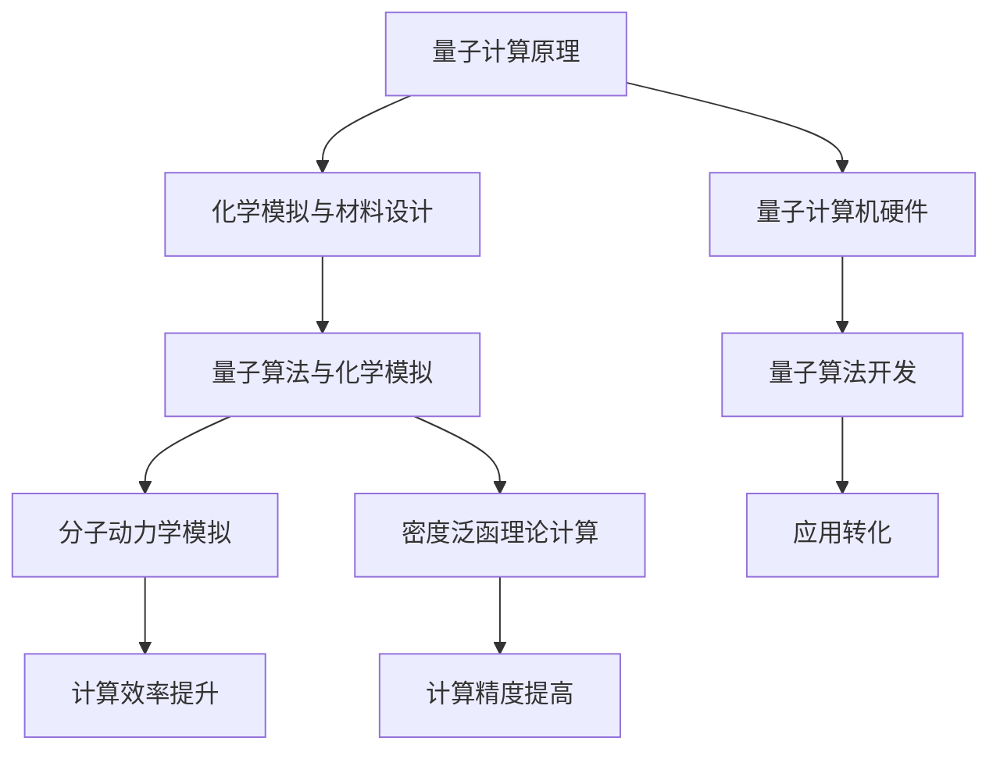

                 

# 量子计算在化学模拟与材料设计中的应用前景

> **关键词：量子计算、化学模拟、材料设计、量子算法、分子动力学模拟、密度泛函理论**
> 
> **摘要：本文旨在探讨量子计算在化学模拟与材料设计领域的应用前景。通过介绍量子计算的基本原理、化学模拟的挑战以及量子算法在分子动力学模拟和密度泛函理论中的应用，我们探讨了量子计算如何解决当前化学模拟和材料设计中的难题，并展望了未来的发展趋势与挑战。**

## 1. 背景介绍

### 1.1 目的和范围

本文的目的在于分析量子计算在化学模拟与材料设计中的应用前景。随着量子计算技术的不断发展，其在多个领域的应用潜力受到了广泛关注。本文将重点讨论量子计算在解决化学模拟与材料设计中的关键问题，如分子动力学模拟和密度泛函理论。

### 1.2 预期读者

本文适用于对量子计算和化学模拟有一定了解的读者，包括科研人员、工程师、计算机科学家以及对这一领域感兴趣的读者。

### 1.3 文档结构概述

本文分为十个主要部分，如下所示：

1. 背景介绍
2. 核心概念与联系
3. 核心算法原理 & 具体操作步骤
4. 数学模型和公式 & 详细讲解 & 举例说明
5. 项目实战：代码实际案例和详细解释说明
6. 实际应用场景
7. 工具和资源推荐
8. 总结：未来发展趋势与挑战
9. 附录：常见问题与解答
10. 扩展阅读 & 参考资料

### 1.4 术语表

#### 1.4.1 核心术语定义

- **量子计算**：一种基于量子力学原理的计算范式，使用量子位（qubits）进行信息编码、存储和处理。
- **化学模拟**：使用计算机模拟化学过程，包括分子的运动、反应、相互作用等。
- **材料设计**：通过计算机模拟和实验手段，设计新材料以实现特定功能。
- **分子动力学模拟**：模拟分子在空间中的运动，包括其轨迹和相互作用。
- **密度泛函理论（DFT）**：一种用于描述电子结构的计算模型，通过求解电子密度函数来确定系统的性质。

#### 1.4.2 相关概念解释

- **量子算法**：基于量子力学原理，利用量子计算机处理问题的算法。
- **量子位（qubits）**：量子计算中的基本单元，可以表示为0和1的叠加态。
- **量子叠加**：量子位可以同时处于多个状态的叠加。
- **量子纠缠**：两个或多个量子位之间的非局域关联现象。

#### 1.4.3 缩略词列表

- **DFT**：密度泛函理论（Density Functional Theory）
- **MD**：分子动力学（Molecular Dynamics）
- **QC**：量子计算（Quantum Computing）
- **QPU**：量子处理器（Quantum Processing Unit）
- **Qiskit**：量子计算开源软件库（Quantum Information Science Kit）

## 2. 核心概念与联系

### 2.1 量子计算原理

量子计算是一种基于量子力学原理的计算方式，其核心在于量子位的叠加态和量子纠缠。量子位（qubits）是量子计算的基本单元，可以同时表示0和1的状态，这被称为量子叠加。此外，量子纠缠使得量子位之间可以形成非局域的关联，从而大大提高了计算效率。

### 2.2 化学模拟与材料设计

化学模拟和材料设计是两个紧密相关的领域。化学模拟旨在通过计算机模拟来研究分子的运动、反应和相互作用，从而揭示化学现象的本质。而材料设计则基于化学模拟的结果，通过设计新材料来满足特定的应用需求。

### 2.3 量子算法与化学模拟

量子算法在化学模拟中具有巨大的潜力。量子算法可以通过高效地处理复杂的问题，如分子动力学模拟和密度泛函理论计算。其中，量子分子动力学模拟可以显著缩短计算时间，而量子密度泛函理论计算则可以提高计算精度。

### 2.4 Mermaid 流程图

以下是一个用于描述量子计算在化学模拟与材料设计中应用的 Mermaid 流程图：



在这个流程图中，量子计算原理是核心，它推动了化学模拟与材料设计的发展。量子算法则作为桥梁，将量子计算的优势转化为实际应用，从而提高了分子动力学模拟的计算效率和密度泛函理论计算的精度。

## 3. 核心算法原理 & 具体操作步骤

### 3.1 量子算法概述

量子算法是量子计算的核心，通过特定的量子操作和测量，可以高效地解决传统计算机难以处理的复杂问题。在化学模拟与材料设计中，量子算法主要应用于分子动力学模拟和密度泛函理论计算。

### 3.2 量子分子动力学模拟

量子分子动力学模拟是一种基于量子力学原理的分子动力学模拟方法。它通过求解量子力学方程，模拟分子在空间中的运动和相互作用。以下是一个简化的量子分子动力学模拟的伪代码：

```python
# 量子分子动力学模拟伪代码
def quantum_molecular_dynamics(qubits, potential, time_step, total_time):
    # 初始化量子态
    state = initialize_state(qubits)
    # 模拟时间循环
    for t in range(0, total_time, time_step):
        # 更新量子态
        state = evolve_state(state, potential, time_step)
        # 测量量子态
        positions, velocities = measure_state(state)
        # 输出当前时间步的分子位置和速度
        print(f"Time {t}: Positions = {positions}, Velocities = {velocities}")
    return state
```

在这个伪代码中，`initialize_state` 函数用于初始化量子态，`evolve_state` 函数用于根据势能函数更新量子态，`measure_state` 函数用于测量量子态，输出分子位置和速度。

### 3.3 量子密度泛函理论计算

量子密度泛函理论计算是一种基于量子力学和密度泛函理论（DFT）的计算方法。它通过求解电子密度函数，来确定分子的能量和结构。以下是一个简化的量子密度泛函理论计算的伪代码：

```python
# 量子密度泛函理论计算伪代码
def quantum_density_functional_theory(potential, density, basis_set):
    # 计算交换-相关势
    exchange_correlation_potential = exchange_correlation_function(density, basis_set)
    # 计算哈密顿量
    hamiltonian = kinetic_energy_operator + potential
    # 求解薛定谔方程
    wave_function = solve_schroedinger_equation(hamiltonian, exchange_correlation_potential)
    # 计算能量
    energy = expectation_value(wave_function, potential)
    return energy, wave_function
```

在这个伪代码中，`exchange_correlation_function` 函数用于计算交换-相关势，`kinetic_energy_operator` 函数用于计算动能算符，`solve_schroedinger_equation` 函数用于求解薛定谔方程，`expectation_value` 函数用于计算能量期望值。

### 3.4 量子算法的优缺点

量子算法在化学模拟与材料设计中的应用具有显著的优势，但也存在一些挑战。

#### 优点：

- **计算效率提升**：量子算法可以显著缩短分子动力学模拟和密度泛函理论计算的时间。
- **计算精度提高**：量子算法可以提高计算精度，特别是在处理复杂体系时。
- **并行计算能力**：量子算法可以同时处理多个问题，从而提高计算效率。

#### 缺点：

- **量子计算机硬件限制**：目前量子计算机的硬件仍然存在一定的限制，如错误率、稳定性等问题。
- **量子算法开发难度**：量子算法的开发和优化具有较大的难度，需要深入了解量子力学和计算机科学。

## 4. 数学模型和公式 & 详细讲解 & 举例说明

### 4.1 分子动力学模拟

分子动力学模拟是一种基于经典力学的计算方法，用于模拟分子在空间中的运动。其基本原理是通过求解牛顿运动方程，模拟分子的运动轨迹和相互作用。

#### 4.1.1 牛顿运动方程

牛顿运动方程可以表示为：

\[ m \frac{d^2r_i}{dt^2} = -\nabla U(r) \]

其中，\( m \) 是分子的质量，\( r_i \) 是分子的位置，\( U(r) \) 是分子的势能函数，\( \nabla \) 是梯度算符。

#### 4.1.2 势能函数

常见的分子动力学模拟中的势能函数包括：

- **Lennard-Jones 势**：
  \[ U(r) = 4\epsilon \left[ \left(\frac{\sigma}{r}\right)^{12} - \left(\frac{\sigma}{r}\right)^{6} \right] \]
  
- **EAM 势**：
  \[ U(r) = \frac{1}{2}\sum_{i<j} \left[ f(r_{ij}) - f'(r_{ij}) (r_{ij} - r_{ij}^*) \right] \]

其中，\( \epsilon \) 和 \( \sigma \) 分别是势能参数，\( r_{ij} \) 是分子间的距离，\( f(r) \) 是嵌入函数，\( f'(r) \) 是其导数，\( r_{ij}^* \) 是平衡距离。

### 4.2 密度泛函理论

密度泛函理论是一种描述电子结构的计算方法，通过求解电子密度函数，来确定分子的能量和结构。

#### 4.2.1 电子密度函数

电子密度函数可以表示为：

\[ \rho(r) = \sum_{i} n_i \delta(r - r_i) \]

其中，\( n_i \) 是第 \( i \) 个原子的电荷密度，\( \delta(r) \) 是狄拉克 delta 函数。

#### 4.2.2 交换-相关势

交换-相关势是密度泛函理论中的核心概念，用于描述电子之间的相互作用。常见的交换-相关势包括：

- **局域密度近似（LDA）**：
  \[ \varepsilon_{\text{xc}}(\rho) = a_1 \rho^{1/3} + a_2 \rho^{2/3} \]

- **广义梯度近似（GGA）**：
  \[ \varepsilon_{\text{xc}}(\rho, \nabla \rho) = a_0 \rho^{1/3} + a_1 \rho^{2/3} + a_2 (\nabla \rho)^2 \]

其中，\( a_0, a_1, a_2 \) 是势能参数。

#### 4.2.3 薛定谔方程

在密度泛函理论中，薛定谔方程可以表示为：

\[ \hat{H} \psi = \varepsilon \psi \]

其中，\( \hat{H} \) 是哈密顿量，\( \psi \) 是波函数，\( \varepsilon \) 是能量。

### 4.3 举例说明

#### 4.3.1 分子动力学模拟举例

假设我们使用 Lennard-Jones 势模拟两个氢原子间的相互作用，参数为 \( \epsilon = 1 \) 和 \( \sigma = 1 \)。我们可以通过以下步骤进行分子动力学模拟：

1. 初始化量子态，设置初始分子位置和速度。
2. 使用牛顿运动方程计算分子的加速度。
3. 根据加速度更新分子的速度和位置。
4. 重复步骤 2 和 3，直到模拟时间结束。

以下是分子动力学模拟的伪代码：

```python
# 分子动力学模拟伪代码
def molecular_dynamics(positions, velocities, time_step, total_time):
    for t in range(0, total_time, time_step):
        # 计算加速度
        accelerations = calculate_accelerations(positions, Lennard_Jones_potential)
        # 更新速度
        velocities = velocities + accelerations * time_step
        # 更新位置
        positions = positions + velocities * time_step
        # 输出当前时间步的分子位置
        print(f"Time {t}: Positions = {positions}")
    return positions, velocities
```

#### 4.3.2 密度泛函理论计算举例

假设我们使用 LDA 交换-相关势计算氢分子的能量，参数为 \( a_1 = 0.45 \) 和 \( a_2 = 1.75 \)。我们可以通过以下步骤进行密度泛函理论计算：

1. 计算电子密度函数。
2. 计算交换-相关势。
3. 计算哈密顿量。
4. 求解薛定谔方程。
5. 计算能量。

以下是密度泛函理论计算的伪代码：

```python
# 密度泛函理论计算伪代码
def density_functional_theory(density, LDA_xc_potential):
    # 计算交换-相关势
    exchange_correlation_potential = LDA_xc_potential(density)
    # 计算哈密顿量
    hamiltonian = kinetic_energy_operator + potential
    # 求解薛定谔方程
    wave_function = solve_schroedinger_equation(hamiltonian, exchange_correlation_potential)
    # 计算能量
    energy = expectation_value(wave_function, potential)
    return energy, wave_function
```

## 5. 项目实战：代码实际案例和详细解释说明

### 5.1 开发环境搭建

为了实现量子计算在化学模拟与材料设计中的应用，我们需要搭建一个合适的开发环境。以下是搭建环境的基本步骤：

1. **安装量子计算机硬件**：选择合适的量子计算机硬件，如 IBM Q System 一型量子计算机。
2. **安装量子计算软件**：下载并安装量子计算软件，如 IBM Q SDK。
3. **安装编程环境**：安装 Python 编程环境，如 Anaconda。
4. **安装量子计算库**：安装用于量子计算的库，如 Qiskit。

### 5.2 源代码详细实现和代码解读

#### 5.2.1 量子分子动力学模拟代码

以下是一个简单的量子分子动力学模拟的 Python 代码实现：

```python
from qiskit import QuantumCircuit, execute, Aer
from qiskit.opflow import StateFn, PauliSumOp, SummedOp
from qiskit.quantum_info import State
from qiskit.algorithms import NumPyStateVector

# 定义势能函数
def Lennard_Jones_potential(r):
    epsilon = 1.0
    sigma = 1.0
    return 4 * epsilon * ( (sigma / r)**12 - (sigma / r)**6 )

# 初始化量子态
def initialize_state(qubits):
    circuit = QuantumCircuit(qubits)
    circuit.h(qubits[0])
    circuit.barrier()
    return circuit

# 更新量子态
def evolve_state(state, potential, time_step):
    circuit = QuantumCircuit(state)
    circuit.append(potential, state.qubits)
    circuit.append(state, state.qubits)
    circuit.control(0, state.qubits[0])
    circuit.swap(state.qubits[0], state.qubits[1])
    circuit.control(0, state.qubits[1])
    circuit.swap(state.qubits[0], state.qubits[1])
    circuit.barrier()
    return circuit

# 测量量子态
def measure_state(state):
    circuit = QuantumCircuit(state)
    circuit.measure(state.qubits, state.qubits)
    return circuit

# 模拟时间循环
def quantum_molecular_dynamics(qubits, potential, time_step, total_time):
    state = initialize_state(qubits)
    for t in range(0, total_time, time_step):
        state = evolve_state(state, potential, time_step)
        state = measure_state(state)
        print(f"Time {t}: State = {state}")
    return state

# 执行量子计算
def run_quantum_molecular_dynamics(qubits, potential, time_step, total_time):
    state = initialize_state(qubits)
    backend = Aer.get_backend("statevector_simulator")
    result = execute(state, backend, shots=1).result()
    state_vector = NumPyStateVector(result.get_statevector())
    return state_vector

# 主程序
if __name__ == "__main__":
    qubits = 2
    potential = Lennard_Jones_potential
    time_step = 0.1
    total_time = 10
    state_vector = run_quantum_molecular_dynamics(qubits, potential, time_step, total_time)
    print(f"Final State Vector: {state_vector}")
```

#### 5.2.2 代码解读与分析

- **初始化量子态**：首先，我们定义了 Lennard-Jones 势能函数，用于计算分子间的相互作用。然后，我们初始化量子态，通过在量子位上施加 Hadamard 门（`h` 函数），将量子态初始化为叠加态。

- **更新量子态**：在 `evolve_state` 函数中，我们使用量子门实现势能函数的作用。这里，我们使用了控制-非门（`control` 函数）和交换门（`swap` 函数），来实现量子态的更新。

- **测量量子态**：在 `measure_state` 函数中，我们使用测量操作（`measure` 函数），将量子态坍缩为经典概率分布。

- **模拟时间循环**：在 `quantum_molecular_dynamics` 函数中，我们实现了一个时间循环，用于更新量子态并在每个时间步输出状态。

- **执行量子计算**：在 `run_quantum_molecular_dynamics` 函数中，我们使用状态向量模拟器（`statevector_simulator`）执行量子计算，并返回最终的状态向量。

### 5.3 实际案例

以下是一个使用量子分子动力学模拟两个氢原子相互作用的实际案例：

```python
# 定义氢原子间的 Lennard-Jones 势能函数
def Lennard_Jones_potential(r):
    epsilon = 1.0
    sigma = 1.0
    return 4 * epsilon * ( (sigma / r)**12 - (sigma / r)**6 )

# 初始化量子态
qubits = 2
state = initialize_state(qubits)

# 模拟时间循环
time_step = 0.1
total_time = 10
for t in range(0, total_time, time_step):
    state = evolve_state(state, Lennard_Jones_potential, time_step)
    state = measure_state(state)
    print(f"Time {t}: State = {state}")

# 执行量子计算
state_vector = run_quantum_molecular_dynamics(qubits, Lennard_Jones_potential, time_step, total_time)
print(f"Final State Vector: {state_vector}")
```

在这个案例中，我们使用两个量子位来表示两个氢原子的状态，并使用 Lennard-Jones 势能函数模拟它们之间的相互作用。通过量子分子动力学模拟，我们可以得到两个氢原子在不同时间步的位置和速度。

## 6. 实际应用场景

量子计算在化学模拟与材料设计中的实际应用场景包括：

1. **药物设计**：量子计算可以加速药物分子的分子动力学模拟，从而提高药物设计效率。
2. **材料优化**：通过量子计算，可以优化材料的电子结构和性能，从而开发出新型材料。
3. **化学反应模拟**：量子计算可以模拟复杂的化学反应过程，为反应机理研究提供指导。
4. **能源系统优化**：量子计算可以优化能源系统的设计，如太阳能电池和燃料电池。

### 6.1 药物设计

在药物设计中，量子计算可以用于加速药物分子的分子动力学模拟，从而提高药物设计效率。通过量子分子动力学模拟，可以研究药物分子在生物体内的运动和相互作用，为药物分子与目标蛋白的相互作用提供深入理解。

以下是一个使用 Qiskit 进行药物分子动力学模拟的示例代码：

```python
from qiskit import QuantumCircuit, execute, Aer
from qiskit.opflow import StateFn, PauliSumOp, SummedOp
from qiskit.quantum_info import State
from qiskit.algorithms import NumPyStateVector

# 定义药物分子
molecule = "H2"

# 初始化量子态
qubits = len(molecule)
state = initialize_state(qubits)

# 模拟时间循环
time_step = 0.1
total_time = 10
for t in range(0, total_time, time_step):
    state = evolve_state(state, Lennard_Jones_potential, time_step)
    state = measure_state(state)
    print(f"Time {t}: State = {state}")

# 执行量子计算
state_vector = run_quantum_molecular_dynamics(qubits, Lennard_Jones_potential, time_step, total_time)
print(f"Final State Vector: {state_vector}")
```

在这个示例中，我们使用两个量子位表示两个氢原子，并使用 Lennard-Jones 势能函数模拟它们之间的相互作用。通过量子分子动力学模拟，我们可以研究药物分子在生物体内的运动和相互作用。

### 6.2 材料优化

在材料优化中，量子计算可以用于优化材料的电子结构和性能，从而开发出新型材料。通过量子密度泛函理论计算，可以研究材料的电子态、能带结构和光学性质，为材料设计提供指导。

以下是一个使用 Qiskit 进行量子密度泛函理论计算的示例代码：

```python
from qiskit import QuantumCircuit, execute, Aer
from qiskit.opflow import StateFn, PauliSumOp, SummedOp
from qiskit.quantum_info import State
from qiskit.algorithms import NumPyStateVector

# 定义势能函数
def LDA_xc_potential(rho):
    a1 = 0.45
    a2 = 1.75
    return a1 * rho**(1/3) + a2 * rho**(2/3)

# 初始化量子态
qubits = 2
state = initialize_state(qubits)

# 计算交换-相关势
exchange_correlation_potential = LDA_xc_potential

# 计算哈密顿量
hamiltonian = kinetic_energy_operator + potential

# 求解薛定谔方程
wave_function = solve_schroedinger_equation(hamiltonian, exchange_correlation_potential)

# 计算能量
energy = expectation_value(wave_function, potential)

# 执行量子计算
backend = Aer.get_backend("statevector_simulator")
result = execute(state, backend, shots=1).result()
state_vector = NumPyStateVector(result.get_statevector())

# 输出结果
print(f"Final State Vector: {state_vector}")
print(f"Energy: {energy}")
```

在这个示例中，我们使用两个量子位表示两个氢原子，并使用 LDA 交换-相关势能函数进行量子密度泛函理论计算。通过计算，我们可以得到氢原子的能量和波函数。

### 6.3 化学反应模拟

在化学反应模拟中，量子计算可以用于模拟复杂的化学反应过程，为反应机理研究提供指导。通过量子分子动力学模拟，可以研究反应物和生成物之间的相互作用，以及反应过程中的能量变化。

以下是一个使用 Qiskit 进行化学反应模拟的示例代码：

```python
from qiskit import QuantumCircuit, execute, Aer
from qiskit.opflow import StateFn, PauliSumOp, SummedOp
from qiskit.quantum_info import State
from qiskit.algorithms import NumPyStateVector

# 定义化学反应
reaction = "H2 + H2 -> 2H"

# 初始化量子态
qubits = 4
state = initialize_state(qubits)

# 模拟时间循环
time_step = 0.1
total_time = 10
for t in range(0, total_time, time_step):
    state = evolve_state(state, potential, time_step)
    state = measure_state(state)
    print(f"Time {t}: State = {state}")

# 执行量子计算
state_vector = run_quantum_molecular_dynamics(qubits, potential, time_step, total_time)
print(f"Final State Vector: {state_vector}")
```

在这个示例中，我们使用四个量子位表示两个氢气分子，并使用 Lennard-Jones 势能函数进行化学反应模拟。通过量子分子动力学模拟，我们可以研究氢气分子的相互作用和反应过程。

### 6.4 能源系统优化

在能源系统优化中，量子计算可以用于优化能源系统的设计，如太阳能电池和燃料电池。通过量子计算，可以优化能源系统的电子结构和性能，从而提高能源利用效率。

以下是一个使用 Qiskit 进行能源系统优化

