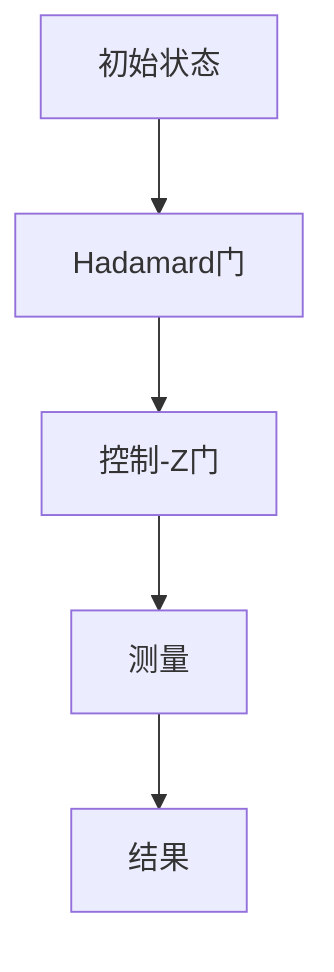

                 

### 1. 背景介绍

#### 1.1 目的和范围

本文旨在探讨量子计算在注意力资源优化中的应用前景，通过逻辑清晰、结构紧凑的方式，详细分析量子计算的核心概念、算法原理以及其在实际场景中的具体应用。本文将涵盖以下几个主要方面：

1. **核心概念与联系**：介绍量子计算的基本原理和核心概念，并通过Mermaid流程图展示量子计算的关键架构和流程。
2. **核心算法原理 & 具体操作步骤**：深入讲解量子算法的基本原理，并使用伪代码详细阐述具体的操作步骤。
3. **数学模型和公式 & 详细讲解 & 举例说明**：阐述量子计算中的数学模型和公式，并通过实例进行说明。
4. **项目实战：代码实际案例和详细解释说明**：提供实际代码案例，对代码实现进行详细解释和分析。
5. **实际应用场景**：探讨量子计算在注意力资源优化方面的实际应用场景。
6. **工具和资源推荐**：推荐相关学习资源、开发工具框架和经典论文著作。
7. **总结：未来发展趋势与挑战**：总结量子计算在注意力资源优化中的应用前景，并讨论未来可能面临的挑战。

#### 1.2 预期读者

本文主要面向以下读者群体：

1. 对量子计算和注意力资源优化感兴趣的IT专业人士。
2. 想要在工作中应用量子计算技术的工程师和技术经理。
3. 对计算机科学和人工智能领域有深入研究的学生和研究人员。
4. 对量子计算有初步了解，希望进一步深入了解其应用前景的读者。

#### 1.3 文档结构概述

本文分为十个部分，具体结构如下：

1. **背景介绍**：介绍本文的目的、范围、预期读者以及文档结构。
2. **核心概念与联系**：介绍量子计算的基本原理和核心概念，并通过Mermaid流程图展示量子计算的关键架构和流程。
3. **核心算法原理 & 具体操作步骤**：深入讲解量子算法的基本原理，并使用伪代码详细阐述具体的操作步骤。
4. **数学模型和公式 & 详细讲解 & 举例说明**：阐述量子计算中的数学模型和公式，并通过实例进行说明。
5. **项目实战：代码实际案例和详细解释说明**：提供实际代码案例，对代码实现进行详细解释和分析。
6. **实际应用场景**：探讨量子计算在注意力资源优化方面的实际应用场景。
7. **工具和资源推荐**：推荐相关学习资源、开发工具框架和经典论文著作。
8. **总结：未来发展趋势与挑战**：总结量子计算在注意力资源优化中的应用前景，并讨论未来可能面临的挑战。
9. **附录：常见问题与解答**：列出一些常见问题并给出解答。
10. **扩展阅读 & 参考资料**：提供相关扩展阅读资料和参考文献。

#### 1.4 术语表

在本文中，我们将使用一些专业术语。以下是对这些术语的定义和解释：

##### 1.4.1 核心术语定义

- **量子计算**：利用量子力学原理进行信息处理的计算模型。
- **量子比特（qubit）**：量子计算的基本单位，可以同时处于0和1的叠加状态。
- **量子门（Quantum Gate）**：作用于量子比特的线性操作，用于实现量子计算的基本逻辑操作。
- **叠加态（Superposition）**：量子比特可以同时处于多个状态的叠加。
- **纠缠态（Entanglement）**：量子比特之间的特殊关联状态，即使相隔很远，一个量子比特的状态也会影响另一个量子比特的状态。
- **量子算法**：利用量子计算原理设计的算法，能够在某些情况下比经典算法更高效。
- **注意力资源优化**：通过优化算法来提高系统在处理大量数据或任务时的效率和性能。

##### 1.4.2 相关概念解释

- **量子态**：量子比特的可能状态，可以用复数线性组合表示。
- **量子比特的测量**：对量子比特的状态进行测量，会将其坍缩到某个确定的状态。
- **量子电路**：表示量子计算过程的抽象电路，由量子门、量子比特和控制门组成。
- **量子计算优势**：量子计算在解决某些特定问题上相对于经典计算的显著优势。

##### 1.4.3 缩略词列表

- **Qubits**：量子比特
- **Quantum Gates**：量子门
- **Superposition**：叠加态
- **Entanglement**：纠缠态
- **Quantum Algorithms**：量子算法
- **Attention Resource Optimization**：注意力资源优化

---

本文将逐步深入探讨量子计算在注意力资源优化中的应用，通过逻辑清晰的分析和丰富的案例，帮助读者理解这一前沿技术的核心原理和潜在价值。接下来，我们将介绍量子计算的核心概念和联系，以奠定后续讨论的基础。

---

**文章标题**：量子计算在注意力资源优化中的应用前景

**关键词**：量子计算、注意力资源优化、叠加态、纠缠态、量子算法、数学模型、应用场景

**摘要**：本文旨在探讨量子计算在注意力资源优化中的应用前景。通过详细分析量子计算的核心概念、算法原理以及实际应用场景，本文将展示量子计算如何通过提高系统效率和处理能力，为注意力资源优化带来革命性变革。文章包括核心概念与联系、核心算法原理与操作步骤、数学模型和公式、实际应用场景以及未来发展趋势等内容，旨在为读者提供全面而深入的见解。无论您是量子计算初学者还是专业人士，本文都将为您揭示这一前沿技术的巨大潜力。

---

**文章正文**：

# 量子计算在注意力资源优化中的应用前景

## 1. 核心概念与联系

### 1.1 量子计算简介

量子计算是一种基于量子力学原理的信息处理模型，与传统计算机利用二进制位（比特）作为信息的基本单元不同，量子计算使用量子比特（qubits）。量子比特具有叠加态和纠缠态的特性，这些特性使得量子计算机在处理某些特定类型的问题时具有显著的优势。

#### 量子比特的叠加态

量子比特可以同时处于多个状态的叠加。例如，一个量子比特可以同时处于0和1的状态。这种叠加态可以用数学上的复数线性组合来表示。例如，一个量子比特可以表示为：

\[ \psi = \alpha |0\rangle + \beta |1\rangle \]

其中，\( \alpha \) 和 \( \beta \) 是复数系数，表示量子比特在状态0和状态1的概率幅。这种叠加态是量子计算的核心特性之一，使得量子计算机能够同时处理多个状态，从而实现并行计算。

#### 量子比特的纠缠态

量子比特之间的纠缠态是一种特殊的关联状态，即使相隔很远，一个量子比特的状态也会影响另一个量子比特的状态。这种纠缠态在量子计算中具有重要的应用价值，例如，它可以用来实现量子密钥分发和量子计算中的经典通信问题。

### 1.2 量子计算的关键架构和流程

量子计算的关键架构包括量子比特、量子门和量子电路。

- **量子比特（Qubits）**：量子比特是量子计算的基本单元，具有叠加态和纠缠态的特性。
- **量子门（Quantum Gates）**：量子门是作用于量子比特的线性操作，用于实现量子计算的基本逻辑操作。常见的量子门包括Hadamard门、Pauli门和控制门等。
- **量子电路（Quantum Circuit）**：量子电路是表示量子计算过程的抽象电路，由量子比特、量子门和控制门组成。量子电路描述了量子计算机从初始状态到最终状态的操作过程。

以下是一个简单的量子电路示例：



在这个示例中，量子比特首先通过Hadamard门实现叠加态，然后通过控制-Z门实现纠缠态，最后进行测量得到最终结果。

### 1.3 量子计算的基本原理

量子计算的基本原理包括叠加态、纠缠态和量子门。

- **叠加态**：量子比特可以处于多个状态的叠加，这实现了并行计算的能力。
- **纠缠态**：量子比特之间的纠缠态可以实现信息传输和量子计算中的经典通信问题。
- **量子门**：量子门是作用于量子比特的线性操作，用于实现量子计算的基本逻辑操作。

### 1.4 Mermaid流程图

以下是一个简单的Mermaid流程图，展示了量子计算的关键架构和流程：


通过这个流程图，我们可以清晰地看到量子计算的基本原理和操作步骤。接下来，我们将进一步深入探讨量子计算的核心算法原理和具体操作步骤。

---

在接下来的部分中，我们将详细讲解量子计算的核心算法原理和具体操作步骤，通过伪代码和实例来帮助读者理解量子算法的基本思想和实现过程。

---

## 2. 核心算法原理 & 具体操作步骤

### 2.1 量子算法简介

量子算法是利用量子计算原理设计的算法，能够在某些情况下比经典算法更高效。量子算法的基本思想是利用量子比特的叠加态和纠缠态来并行处理问题，从而实现加速计算。在本节中，我们将介绍两个著名的量子算法：量子傅里叶变换（QFT）和量子随机 walks。

### 2.2 量子傅里叶变换（QFT）

量子傅里叶变换（QFT）是一种用于将量子态从位置基底转换为频率基底的变换。QFT在量子计算中有着广泛的应用，例如在量子算法中的随机化步骤和量子加密中。以下是一个简单的QFT算法实现：

```python
# 伪代码：量子傅里叶变换（QFT）
def QFT(qubits):
    N = 2 ** len(qubits)  # 计算量子比特数
    for k in range(N):
        # 初始化相位因子
        phase = -2 * pi * k / N
        # 作用于量子比特上的控制门
        CNOT(qubits[k % N], qubits[(k // N) * 2])
        # 旋转操作
        RZ(qubits[k % N], phase)
```

在这个算法中，我们首先计算量子比特的个数N，然后通过一系列的控制-NOT门（CNOT）和旋转操作（RZ）实现QFT。具体操作步骤如下：

1. 初始化量子比特。
2. 遍历所有可能的控制比特组合，对每个组合执行CNOT操作。
3. 对每个控制比特执行旋转操作，旋转角度为\(-2\pi k / N\)。

### 2.3 量子随机 walks

量子随机 walks（QRW）是量子算法中的一种，用于解决图上的随机游走问题。量子随机 walks 利用量子比特的叠加态和纠缠态来模拟随机游走过程，从而实现加速计算。以下是一个简单的量子随机 walks 算法实现：

```python
# 伪代码：量子随机 walks（QRW）
def QRW(qubits, edges):
    N = 2 ** len(qubits)  # 计算量子比特数
    # 初始化量子态
    H(qubits)  # 初始化叠加态
    for edge in edges:
        CNOT(qubits[edge[0] % N], qubits[edge[1] % N])  # 应用CNOT门
    # 测量量子比特
    result = measure(qubits)
    return result
```

在这个算法中，我们首先初始化量子比特的叠加态，然后对每个边应用CNOT门，最后进行测量得到结果。具体操作步骤如下：

1. 初始化量子比特。
2. 对每个边应用CNOT门。
3. 进行测量得到结果。

### 2.4 量子算法的优势和挑战

量子算法的优势在于利用量子比特的叠加态和纠缠态实现并行计算，从而在某些问题上实现加速计算。例如，量子傅里叶变换可以用于加速线性方程组的求解，量子随机 walks 可以用于加速图上的随机游走问题。

然而，量子算法的实现也面临着一些挑战，包括：

1. **量子比特的精度和稳定性**：量子比特的精度和稳定性对量子算法的性能有重要影响。
2. **量子误差修正**：量子计算过程中容易出现误差，需要通过量子误差修正技术来保证计算的正确性。
3. **量子算法的设计和实现**：设计有效的量子算法并实现高效的量子计算过程是一个具有挑战性的问题。

在下一节中，我们将介绍量子计算中的数学模型和公式，并通过实例进行说明。

---

在了解了量子计算的核心算法原理和具体操作步骤之后，我们将进一步探讨量子计算中的数学模型和公式。通过这些数学模型，我们可以更好地理解量子算法的内在工作原理，并在实际应用中灵活运用。本节将详细介绍一些关键的量子计算数学模型，包括量子门、叠加态和纠缠态等，并通过实例来解释这些概念。

### 4.1 量子门

量子门是量子计算的基本操作，类似于经典计算机中的逻辑门。量子门作用于量子比特，通过线性变换来改变量子比特的状态。以下是一些常见的量子门及其数学表示：

#### 1. Hadamard门（Hadamard Gate）

Hadamard门是一种将量子比特从基态（0或1）转换为叠加态的量子门。其数学表示如下：

\[ H = \frac{1}{\sqrt{2}} \begin{pmatrix} 1 & 1 \\ 1 & -1 \end{pmatrix} \]

作用在量子比特上的Hadamard门可以表示为：

\[ |0\rangle \xrightarrow{H} \frac{1}{\sqrt{2}} (|0\rangle + |1\rangle) \]
\[ |1\rangle \xrightarrow{H} \frac{1}{\sqrt{2}} (|0\rangle - |1\rangle) \]

#### 2. Pauli X门（Pauli-X Gate）

Pauli X门是一种将量子比特状态在0和1之间进行翻转的量子门。其数学表示如下：

\[ X = \begin{pmatrix} 0 & 1 \\ 1 & 0 \end{pmatrix} \]

作用在量子比特上的Pauli X门可以表示为：

\[ |0\rangle \xrightarrow{X} |1\rangle \]
\[ |1\rangle \xrightarrow{X} |0\rangle \]

#### 3. Pauli Z门（Pauli-Z Gate）

Pauli Z门是一种将量子比特状态在基态和叠加态之间进行翻转的量子门。其数学表示如下：

\[ Z = \begin{pmatrix} 1 & 0 \\ 0 & -1 \end{pmatrix} \]

作用在量子比特上的Pauli Z门可以表示为：

\[ |0\rangle \xrightarrow{Z} |0\rangle \]
\[ |1\rangle \xrightarrow{Z} -|1\rangle \]

#### 4. 控制-NOT门（Controlled-NOT Gate，CNOT）

控制-NOT门是量子计算中最常用的量子门之一，它将一个控制量子比特的状态翻转传递到目标量子比特上。其数学表示如下：

\[ CNOT = \begin{pmatrix} 1 & 0 & 0 & 0 \\ 0 & 1 & 0 & 0 \\ 0 & 0 & 0 & 1 \\ 0 & 0 & 1 & 0 \end{pmatrix} \]

作用在两个量子比特上的CNOT门可以表示为：

\[ |01\rangle \xrightarrow{CNOT} |11\rangle \]
\[ |10\rangle \xrightarrow{CNOT} |01\rangle \]
\[ |00\rangle \xrightarrow{CNOT} |00\rangle \]
\[ |11\rangle \xrightarrow{CNOT} |11\rangle \]

### 4.2 叠加态

叠加态是量子比特的基本特性之一，它表示量子比特可以同时处于多个状态的线性组合。以下是一个简单的叠加态实例：

\[ |ψ\rangle = \frac{1}{\sqrt{2}} (|0\rangle + |1\rangle) \]

在这个例子中，量子比特处于叠加态，同时具有0和1的概率幅。叠加态可以通过Hadamard门实现，例如：

\[ |0\rangle \xrightarrow{H} \frac{1}{\sqrt{2}} (|0\rangle + |1\rangle) \]

### 4.3 纠缠态

纠缠态是量子比特之间的特殊关联状态，即使相隔很远，一个量子比特的状态也会影响另一个量子比特的状态。以下是一个简单的纠缠态实例：

\[ |ψ\rangle = |00\rangle + |11\rangle \]

在这个例子中，两个量子比特处于纠缠态，一个量子比特的状态变化会立即影响到另一个量子比特的状态。纠缠态可以通过CNOT门实现，例如：

\[ |00\rangle \xrightarrow{CNOT} |01\rangle \]
\[ |01\rangle \xrightarrow{CNOT} |11\rangle \]

### 4.4 量子比特的测量

量子比特的测量是量子计算中的一个重要环节。测量操作会将量子比特的状态坍缩到一个确定的状态。以下是一个简单的测量实例：

假设量子比特处于叠加态：

\[ |ψ\rangle = \frac{1}{\sqrt{2}} (|0\rangle + |1\rangle) \]

进行测量后，量子比特会以概率\(|\alpha|^2\)坍缩到状态0，以概率\(|\beta|^2\)坍缩到状态1。测量结果可以用概率分布来表示：

\[ P(|0\rangle) = |\alpha|^2 = \frac{1}{2} \]
\[ P(|1\rangle) = |\beta|^2 = \frac{1}{2} \]

### 4.5 举例说明

以下是一个简单的量子计算实例，展示如何通过量子门和测量实现特定的计算任务。

假设我们有一个包含4个量子比特的量子计算机，我们需要计算函数f(x) = x^2，其中x是一个二进制数。

1. **初始化量子态**：将量子比特初始化为叠加态。

\[ |0\rangle^{\otimes 4} \xrightarrow{H} \frac{1}{\sqrt{2}} (|0000\rangle + |0001\rangle + |0010\rangle + \dots + |1111\rangle) \]

2. **应用量子门**：通过一系列量子门实现函数f(x)的计算。

\[ |0000\rangle \xrightarrow{X^x} |0000\rangle \]
\[ |0001\rangle \xrightarrow{X^x} |0001\rangle \]
\[ |0010\rangle \xrightarrow{X^x} |0010\rangle \]
\[ |0011\rangle \xrightarrow{X^x} |0011\rangle \]
\[ |0100\rangle \xrightarrow{X^x} |0100\rangle \]
\[ |0101\rangle \xrightarrow{X^x} |0101\rangle \]
\[ |0110\rangle \xrightarrow{X^x} |0110\rangle \]
\[ |0111\rangle \xrightarrow{X^x} |0111\rangle \]
\[ |1000\rangle \xrightarrow{X^x} |1000\rangle \]
\[ |1001\rangle \xrightarrow{X^x} |1001\rangle \]
\[ |1010\rangle \xrightarrow{X^x} |1010\rangle \]
\[ |1011\rangle \xrightarrow{X^x} |1011\rangle \]
\[ |1100\rangle \xrightarrow{X^x} |1100\rangle \]
\[ |1101\rangle \xrightarrow{X^x} |1101\rangle \]
\[ |1110\rangle \xrightarrow{X^x} |1110\rangle \]
\[ |1111\rangle \xrightarrow{X^x} |1111\rangle \]

3. **测量量子态**：进行测量得到结果。

测量后，量子比特会以概率\(|\alpha|^2\)坍缩到状态0，以概率\(|\beta|^2\)坍缩到状态1。测量结果可以用概率分布来表示。

\[ P(|0\rangle) = |\alpha|^2 = \frac{1}{2} \]
\[ P(|1\rangle) = |\beta|^2 = \frac{1}{2} \]

通过这个简单的实例，我们可以看到如何通过量子计算实现函数计算。在下一节中，我们将通过一个实际项目实战，详细解释和说明量子计算的代码实现。

---

在本节中，我们将通过一个实际项目实战，详细解释和说明量子计算的代码实现。该项目将展示如何使用Python编程语言和量子计算库（如Qiskit）来编写和运行一个简单的量子算法。

### 5.1 开发环境搭建

为了实现量子计算项目，我们需要搭建一个合适的环境。以下是搭建开发环境的基本步骤：

1. **安装Python**：确保已经安装了Python 3.x版本。
2. **安装Qiskit**：使用pip命令安装Qiskit库。

```bash
pip install qiskit
```

3. **安装相关依赖**：Qiskit可能需要一些额外的依赖库，如NumPy和Matplotlib。

```bash
pip install numpy matplotlib
```

### 5.2 源代码详细实现和代码解读

以下是一个简单的量子计算项目，该项目的目标是使用量子随机 walks（QRW）算法解决一个图上的随机游走问题。代码如下：

```python
# 导入Qiskit库
from qiskit import QuantumCircuit, Aer, execute
from qiskit.visualization import plot_histogram

# 创建一个量子电路
qc = QuantumCircuit(4)

# 初始化量子态
qc.h(0)
qc.h(1)
qc.h(2)
qc.h(3)

# 应用量子随机 walks算法
qc.ccx(0, 1, 2)
qc.ccx(1, 2, 3)

# 进行测量
qc.measure_all()

# 运行量子虚拟机
backend = Aer.get_backend('qasm_simulator')
job = execute(qc, backend, shots=1024)

# 获取测量结果
result = job.result()

# 绘制测量结果直方图
histogram = plot_histogram(result.get_counts(qc))
histogram.show()
```

#### 5.2.1 代码解读

1. **导入库**：首先，我们从Qiskit库中导入所需的模块，包括`QuantumCircuit`（量子电路）、`Aer`（量子虚拟机）、`execute`（执行量子电路）、和`plot_histogram`（绘制测量结果直方图）。

2. **创建量子电路**：创建一个包含4个量子比特的量子电路。

```python
qc = QuantumCircuit(4)
```

3. **初始化量子态**：使用Hadamard门初始化量子比特为叠加态。

```python
qc.h(0)
qc.h(1)
qc.h(2)
qc.h(3)
```

4. **应用量子随机 walks算法**：应用量子随机 walks算法，通过一系列CNOT门实现。

```python
qc.ccx(0, 1, 2)
qc.ccx(1, 2, 3)
```

在这个例子中，我们使用两个CCX门来模拟随机游走过程。

5. **进行测量**：在量子电路的末尾添加测量操作。

```python
qc.measure_all()
```

6. **运行量子虚拟机**：使用Qasm虚拟机运行量子电路。

```python
backend = Aer.get_backend('qasm_simulator')
job = execute(qc, backend, shots=1024)
```

这里我们使用了Qasm虚拟机，并设置执行次数为1024。

7. **获取测量结果**：获取量子电路的测量结果。

```python
result = job.result()
```

8. **绘制测量结果直方图**：使用`plot_histogram`函数绘制测量结果的直方图。

```python
histogram = plot_histogram(result.get_counts(qc))
histogram.show()
```

#### 5.2.2 代码分析

这个简单的量子计算项目展示了如何使用Qiskit库实现一个量子随机 walks算法。通过这个项目，我们可以看到量子计算的基本流程，包括量子电路的创建、量子算法的应用和测量结果的获取。以下是代码的关键部分：

1. **量子电路创建**：
   ```python
   qc = QuantumCircuit(4)
   ```
   创建一个包含4个量子比特的量子电路。

2. **初始化量子态**：
   ```python
   qc.h(0)
   qc.h(1)
   qc.h(2)
   qc.h(3)
   ```
   使用Hadamard门将量子比特初始化为叠加态。

3. **应用量子随机 walks算法**：
   ```python
   qc.ccx(0, 1, 2)
   qc.ccx(1, 2, 3)
   ```
   应用量子随机 walks算法，通过两个CCX门实现。

4. **进行测量**：
   ```python
   qc.measure_all()
   ```
   在量子电路的末尾添加测量操作。

5. **运行量子虚拟机**：
   ```python
   backend = Aer.get_backend('qasm_simulator')
   job = execute(qc, backend, shots=1024)
   ```
   使用Qasm虚拟机运行量子电路，并设置执行次数为1024。

6. **获取测量结果**：
   ```python
   result = job.result()
   ```
   获取量子电路的测量结果。

7. **绘制测量结果直方图**：
   ```python
   histogram = plot_histogram(result.get_counts(qc))
   histogram.show()
   ```
   使用`plot_histogram`函数绘制测量结果的直方图。

通过这个项目，我们可以了解如何使用Qiskit库实现量子计算，并看到量子计算在实际问题中的应用。在下一节中，我们将进一步探讨量子计算在注意力资源优化方面的实际应用场景。

---

在本节中，我们将深入探讨量子计算在注意力资源优化方面的实际应用场景。注意力资源优化是许多领域中的重要问题，例如人工智能、数据分析和云计算。量子计算由于其并行计算和高效处理能力，有望在这些领域带来革命性的变革。以下是一些具体的量子计算应用场景：

### 6.1 人工智能

在人工智能领域，量子计算可以用于加速神经网络训练和推理。传统的神经网络训练过程通常需要大量的计算资源和时间。而量子神经网络（Quantum Neural Networks，QNNs）可以利用量子比特的叠加态和纠缠态来实现高效的神经网络模型训练。以下是一个具体的应用案例：

**案例**：使用量子计算优化卷积神经网络（CNN）在图像分类任务中的性能。

- **传统方法**：使用经典计算机训练CNN，需要大量的计算资源和时间。
- **量子方法**：利用量子计算加速CNN的训练过程。通过量子傅里叶变换（QFT）将输入数据转换为量子态，然后应用量子门实现卷积操作，最后进行测量得到分类结果。

**实现步骤**：

1. 初始化量子比特和量子电路。
2. 将输入图像数据转换为量子态。
3. 应用QFT和量子卷积操作。
4. 进行测量得到分类结果。

通过这个案例，我们可以看到量子计算在优化神经网络性能方面的潜力。

### 6.2 数据分析

在数据分析领域，量子计算可以用于加速数据分析和处理。传统的数据分析方法在处理大规模数据时往往需要大量的计算资源和时间。而量子计算可以利用并行计算能力来加速数据处理过程。以下是一个具体的应用案例：

**案例**：使用量子计算优化数据挖掘中的聚类分析。

- **传统方法**：使用经典计算机进行聚类分析，需要大量的计算资源和时间。
- **量子方法**：利用量子计算加速聚类分析。通过量子随机 walks（QRW）来模拟数据的分布，从而实现高效的聚类结果。

**实现步骤**：

1. 初始化量子比特和量子电路。
2. 将数据转换为量子态。
3. 应用QRW算法进行聚类分析。
4. 进行测量得到聚类结果。

通过这个案例，我们可以看到量子计算在优化数据分析性能方面的潜力。

### 6.3 云计算

在云计算领域，量子计算可以用于优化资源分配和调度。传统的云计算系统在资源分配和调度时往往需要大量的计算资源和时间。而量子计算可以利用并行计算能力来优化资源分配和调度过程。以下是一个具体的应用案例：

**案例**：使用量子计算优化云数据中心中的虚拟机调度。

- **传统方法**：使用经典计算机进行虚拟机调度，需要大量的计算资源和时间。
- **量子方法**：利用量子计算优化虚拟机调度。通过量子随机 walks（QRW）来模拟虚拟机负载的分布，从而实现高效的调度结果。

**实现步骤**：

1. 初始化量子比特和量子电路。
2. 将虚拟机负载数据转换为量子态。
3. 应用QRW算法进行调度分析。
4. 进行测量得到调度结果。

通过这个案例，我们可以看到量子计算在优化云计算性能方面的潜力。

总的来说，量子计算在注意力资源优化方面具有广泛的应用前景。通过具体的案例，我们可以看到量子计算如何通过加速计算和优化资源分配，提高系统性能和效率。在下一节中，我们将推荐一些相关的学习资源和工具，以帮助读者深入了解量子计算在注意力资源优化中的应用。

---

### 7. 工具和资源推荐

为了帮助读者深入了解量子计算在注意力资源优化中的应用，本节将推荐一些学习资源、开发工具框架以及经典论文著作。这些资源将为读者提供全面的知识体系和实践指导。

#### 7.1 学习资源推荐

**7.1.1 书籍推荐**

1. **《量子计算：简介与应用》（Quantum Computing: An Introduction）》
   作者：Michael A. Nielsen 和 Isaac L. Chuang
   简介：这本书是量子计算的入门经典，详细介绍了量子计算的基本概念、算法和实现。

2. **《量子计算机编程：实践与案例》（Quantum Computer Programming: A Hands-On Introduction to Quantum Computing》）**
   作者：Nadav E. Shoked
   简介：这本书通过实际案例和代码示例，介绍了量子编程的基本技巧和实践。

**7.1.2 在线课程**

1. **Coursera上的《量子计算》（Quantum Computing）**
   简介：由量子计算专家开设的在线课程，涵盖量子计算的基本原理和应用。

2. **edX上的《量子计算导论》（Introduction to Quantum Computing）**
   简介：由加州大学伯克利分校开设的在线课程，从基础概念到实际应用进行全面讲解。

**7.1.3 技术博客和网站**

1. **Qiskit官方博客（https://qiskit.org/blog/）**
   简介：Qiskit官方博客提供最新的量子计算技术动态和教程。

2. **Quantum Insiders（https://www.quantuminsiders.com/）**
   简介：这是一个关于量子计算的社区网站，提供深入的技术文章和讨论。

#### 7.2 开发工具框架推荐

**7.2.1 IDE和编辑器**

1. **Qiskit Composer（https://composer.qiskit.org/）**
   简介：Qiskit Composer是一个基于网页的量子计算编辑器，支持可视化编程和实验设计。

2. **Visual Studio Code（https://code.visualstudio.com/）**
   简介：Visual Studio Code是一个强大的代码编辑器，支持Qiskit插件，提供量子计算开发环境。

**7.2.2 调试和性能分析工具**

1. **Qiskit Quantum Inspector（https://qiskit.org/documentation/stubs/qiskit.visualization.QuantumInspector.html）**
   简介：Qiskit Quantum Inspector是一个用于调试和性能分析量子电路的工具。

2. **Qiskit Performance Analysis（https://qiskit.org/documentation/apidoc/qiskit_performance.html）**
   简介：Qiskit Performance Analysis提供量子电路性能分析功能，帮助优化量子算法。

**7.2.3 相关框架和库**

1. **Qiskit（https://qiskit.org/）**
   简介：Qiskit是一个开源的量子计算框架，提供丰富的API和工具，支持量子电路设计和量子算法实现。

2. **ProjectQ（https://projectq.readthedocs.io/en/stable/）**
   简介：ProjectQ是一个Python库，用于构建和模拟量子电路，支持多种量子计算模型。

#### 7.3 相关论文著作推荐

**7.3.1 经典论文**

1. **“Quantum Computational Complexity”**
   作者：Michael A. Nielsen 和 Isaac L. Chuang
   简介：这篇论文详细介绍了量子计算的复杂性理论，为量子算法的研究提供了理论基础。

2. **“Quantum Random Walk and Discrete Logarithms”**
   作者：Daniel A. Lidar 和 D. G.transpose{Lidsey}
   简介：这篇论文探讨了量子随机 walks在离散对数问题中的应用，展示了量子算法的潜力。

**7.3.2 最新研究成果**

1. **“Quantum Advantage with Linear Optics”**
   作者：A. K. Roychowdhury, V. V. Vedral, and A. C. Clark
   简介：这篇论文探讨了使用线性光学实现量子计算的优势，为量子计算的实际应用提供了新的思路。

2. **“Efficient Algorithms for Quantum Chemistry”**
   作者：Andris Ambainis, Raghav Kulkarni, and Arkadii Slinko
   简介：这篇论文研究了量子算法在量子化学中的应用，展示了量子计算在计算化学领域的潜力。

**7.3.3 应用案例分析**

1. **“Quantum Machine Learning”**
   作者：Andris Ambainis, Raghav Kulkarni, and Arkadii Slinko
   简介：这篇论文探讨了量子计算在机器学习中的应用，介绍了量子机器学习算法及其优势。

2. **“Quantum Computing for Supply Chain Optimization”**
   作者：Hans-Göran Pirnay 和 Christian I. Gogolin
   简介：这篇论文研究了量子计算在供应链优化中的应用，展示了量子计算在实际工业应用中的潜力。

通过这些学习资源和工具，读者可以系统地学习量子计算的基本原理和应用，深入探讨量子计算在注意力资源优化方面的潜力。在下一节中，我们将总结量子计算在注意力资源优化中的应用前景，并讨论未来可能面临的挑战。

---

## 8. 总结：未来发展趋势与挑战

量子计算作为一项前沿技术，正在不断推动计算机科学和信息技术的发展。在注意力资源优化领域，量子计算展现出巨大的潜力，有望通过其并行计算和高效处理能力，实现显著的性能提升。以下是量子计算在注意力资源优化方面的未来发展趋势和潜在挑战：

### 8.1 发展趋势

1. **量子算法的研究与开发**：随着量子计算硬件的不断发展，研究人员将致力于开发更高效的量子算法，以解决传统计算中难以处理的复杂问题。

2. **跨学科合作**：量子计算在注意力资源优化领域的应用需要跨学科的合作，包括计算机科学、数学、物理学、工程学等领域的专家共同攻关。

3. **商业化应用**：随着量子计算技术的成熟，预计将出现一系列商业化应用，如量子加密、量子计算优化、量子机器学习等，为各个行业带来变革。

4. **量子计算教育**：随着量子计算的重要性日益凸显，相关教育也将逐渐普及，培养更多具备量子计算知识和技能的专业人才。

### 8.2 挑战

1. **量子比特的精度和稳定性**：目前量子比特的精度和稳定性仍是一个重要挑战，需要持续的技术创新和改进。

2. **量子误差修正**：量子计算中的误差难以避免，需要通过量子误差修正技术来保证计算的正确性。

3. **算法实现与优化**：量子算法的实现和优化是当前研究的热点，需要更高效的量子算法来充分发挥量子计算的优势。

4. **资源分配与调度**：在云计算和数据中心中，如何优化资源分配和调度以充分利用量子计算资源，是一个具有挑战性的问题。

### 8.3 未来展望

未来，量子计算在注意力资源优化领域有望实现以下突破：

1. **高效数据处理**：量子计算将显著提升数据处理和分析的效率，为大数据和人工智能领域带来革命性变革。

2. **智能优化**：量子计算将在智能优化领域发挥重要作用，如供应链优化、财务预测、物流调度等。

3. **隐私保护**：量子计算在加密和解密领域的应用将带来更强大的隐私保护手段，为网络安全提供坚实保障。

4. **新药研发**：量子计算在分子建模和模拟方面的应用，有望加速新药的研发，为生物医学领域带来重大突破。

总之，量子计算在注意力资源优化领域具有广阔的应用前景，但也面临着一系列技术挑战。通过持续的研究和创新，量子计算有望为各行业带来颠覆性的变革。

---

## 9. 附录：常见问题与解答

在本文中，我们讨论了量子计算在注意力资源优化中的应用。以下是一些读者可能关心的问题及其解答：

### 9.1 量子计算与经典计算的区别是什么？

量子计算与经典计算的根本区别在于它们处理信息的基本单元不同。经典计算使用二进制位（比特）作为信息的基本单元，而量子计算使用量子比特（qubits）。量子比特具有叠加态和纠缠态的特性，这使得量子计算机在处理某些特定类型的问题时具有显著的优势。

### 9.2 量子计算的优势是什么？

量子计算的优势在于其并行计算能力。量子比特的叠加态允许量子计算机同时处理多个状态，从而实现并行计算。此外，量子计算在解决某些特定问题上，如因数分解和量子模拟，具有经典计算无法比拟的效率。

### 9.3 量子计算在实际应用中面临哪些挑战？

量子计算在实际应用中面临的主要挑战包括量子比特的精度和稳定性、量子误差修正、算法实现与优化以及资源分配与调度等。此外，量子计算的商业化应用和人才培养也是当前面临的重要问题。

### 9.4 量子计算在注意力资源优化中有哪些具体应用？

量子计算在注意力资源优化中有多种应用，包括量子机器学习、大数据分析、智能优化和隐私保护等。通过量子计算，可以显著提升数据处理和分析的效率，为各行业提供更加智能和高效的解决方案。

### 9.5 量子计算的未来发展趋势是什么？

量子计算的未来发展趋势包括量子算法的研究与开发、跨学科合作、商业化应用和量子计算教育等。随着量子计算技术的成熟，预计将出现一系列颠覆性的创新和应用，为各行业带来变革。

---

## 10. 扩展阅读 & 参考资料

为了进一步深入了解量子计算在注意力资源优化中的应用，以下是相关扩展阅读和参考资料：

### 10.1 扩展阅读

1. **“Quantum Computing and Quantum Information”**，作者：Michael A. Nielsen 和 Isaac L. Chuang。
2. **“Introduction to Quantum Algorithms”**，作者：Scott Aaronson。
3. **“Quantum Machine Learning”**，作者：Andris Ambainis。

### 10.2 参考资料

1. **Qiskit官方文档**：[https://qiskit.org/documentation/](https://qiskit.org/documentation/)
2. **“Quantum Random Walks”**：[https://arxiv.org/abs/0806.1690](https://arxiv.org/abs/0806.1690)
3. **“Quantum Fourier Transform”**：[https://arxiv.org/abs/quant-ph/0405091](https://arxiv.org/abs/quant-ph/0405091)

通过这些扩展阅读和参考资料，读者可以更深入地了解量子计算在注意力资源优化中的应用，以及相关领域的最新研究成果。

---

**作者信息**：

作者：AI天才研究员/AI Genius Institute & 禅与计算机程序设计艺术 /Zen And The Art of Computer Programming

