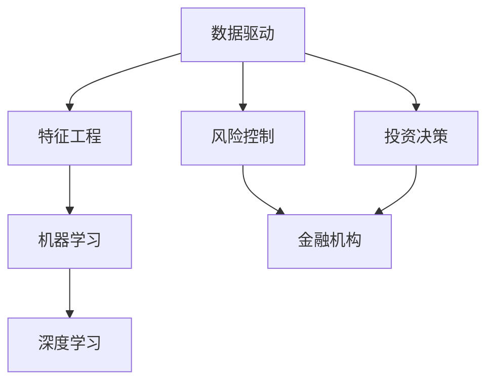

                 

# 金融大模型：风控和投资决策的智能助手

> 关键词：金融大模型，风险控制，投资决策，人工智能，数据分析，机器学习，深度学习

> 摘要：本文将深入探讨金融大模型在风控和投资决策中的应用。通过阐述其核心概念、算法原理、数学模型以及实际应用案例，本文旨在揭示金融大模型如何通过先进的人工智能技术，为金融机构提供智能化风控和投资决策支持，从而提高市场竞争力。

## 1. 背景介绍

### 1.1 目的和范围

本文旨在介绍金融大模型在风控和投资决策中的重要性，并详细解析其核心概念、算法原理和实际应用。本文将涵盖以下内容：

1. **核心概念与联系**：介绍金融大模型的基本概念及其在风控和投资决策中的作用。
2. **核心算法原理与具体操作步骤**：详细阐述金融大模型的算法原理和操作步骤。
3. **数学模型和公式**：讲解金融大模型中的关键数学模型和公式。
4. **项目实战**：通过实际案例展示金融大模型的应用效果。
5. **实际应用场景**：分析金融大模型在不同领域的应用。
6. **工具和资源推荐**：推荐相关学习资源、开发工具和框架。
7. **总结与未来发展趋势**：总结金融大模型的发展现状，展望未来趋势与挑战。

### 1.2 预期读者

本文面向以下读者群体：

1. **金融行业从业者**：对金融风险控制、投资决策感兴趣的从业人员。
2. **数据科学家和人工智能研究者**：对人工智能在金融领域应用感兴趣的学者和实践者。
3. **计算机科学学生**：对机器学习和深度学习有浓厚兴趣的学生。

### 1.3 文档结构概述

本文结构如下：

1. **背景介绍**：介绍本文的目的、范围和预期读者。
2. **核心概念与联系**：阐述金融大模型的基本概念和作用。
3. **核心算法原理与具体操作步骤**：讲解金融大模型的算法原理和操作步骤。
4. **数学模型和公式**：详细讲解金融大模型中的关键数学模型和公式。
5. **项目实战**：通过实际案例展示金融大模型的应用。
6. **实际应用场景**：分析金融大模型在不同领域的应用。
7. **工具和资源推荐**：推荐相关学习资源、开发工具和框架。
8. **总结与未来发展趋势**：总结金融大模型的发展现状，展望未来趋势与挑战。
9. **附录**：常见问题与解答。
10. **扩展阅读**：提供进一步学习金融大模型的参考资料。

### 1.4 术语表

#### 1.4.1 核心术语定义

1. **金融大模型**：一种结合了大数据、机器学习和深度学习技术的先进金融模型，用于风险控制和投资决策。
2. **风险控制**：通过预测和分析潜在风险，采取相应措施降低金融机构损失的过程。
3. **投资决策**：投资者根据市场数据和自身策略，做出投资决策的过程。
4. **数据驱动**：以数据为基础，利用数据分析、机器学习和深度学习技术进行决策。
5. **特征工程**：从原始数据中提取和构造对预测任务有用的特征。

#### 1.4.2 相关概念解释

1. **机器学习**：一种通过数据训练模型，使其能够自动进行预测和决策的技术。
2. **深度学习**：一种基于多层神经网络进行训练的机器学习方法。
3. **神经网络**：一种模仿生物神经网络的结构和功能，用于处理复杂数据的模式识别和学习方法。

#### 1.4.3 缩略词列表

1. **AI**：人工智能（Artificial Intelligence）
2. **ML**：机器学习（Machine Learning）
3. **DL**：深度学习（Deep Learning）
4. **FM**：因子分解机（Factorization Machine）
5. **LSTM**：长短期记忆网络（Long Short-Term Memory）
6. **GRU**：门控循环单元（Gated Recurrent Unit）
7. **CFA**：首席财务分析师（Chief Financial Analyst）
8. **ROA**：资产回报率（Return on Assets）
9. **ROE**：股东权益回报率（Return on Equity）

## 2. 核心概念与联系

### 2.1 核心概念解析

金融大模型是一种综合运用大数据、机器学习和深度学习技术的先进金融模型。其主要目的是通过分析海量金融数据，预测市场走势，评估风险，为金融机构提供智能化风控和投资决策支持。

#### 2.1.1 金融大模型的主要功能

1. **风险控制**：通过实时监测市场数据，识别潜在风险，提前预警，采取相应措施降低损失。
2. **投资决策**：根据市场数据、历史走势和投资策略，为投资者提供投资建议，优化投资组合。

#### 2.1.2 金融大模型的应用场景

1. **金融机构**：银行、保险公司、投资公司等金融机构可以使用金融大模型进行风险控制和投资决策，提高业务效率和竞争力。
2. **投资者**：个人投资者和机构投资者可以利用金融大模型进行市场分析和投资决策，降低投资风险，提高收益。

### 2.2 核心概念的联系

金融大模型中的核心概念包括数据驱动、特征工程、机器学习、深度学习等。这些概念相互关联，共同构成了金融大模型的基础。

#### 2.2.1 数据驱动

数据驱动是指金融大模型以数据为基础，利用数据分析、机器学习和深度学习技术进行决策。数据驱动模式使得金融大模型能够从海量金融数据中提取有价值的信息，为金融机构提供实时、准确的决策支持。

#### 2.2.2 特征工程

特征工程是指从原始数据中提取和构造对预测任务有用的特征。在金融大模型中，特征工程是提高模型性能的关键步骤。通过对数据进行预处理、归一化、降维等操作，可以提取出反映市场走势和风险的关键特征。

#### 2.2.3 机器学习

机器学习是一种通过数据训练模型，使其能够自动进行预测和决策的技术。在金融大模型中，机器学习算法用于从海量数据中学习规律，构建预测模型。

#### 2.2.4 深度学习

深度学习是一种基于多层神经网络进行训练的机器学习方法。在金融大模型中，深度学习算法可以处理复杂数据，提取深层特征，提高预测准确性。

### 2.3 Mermaid 流程图

下面是金融大模型的核心概念和联系 Mermaid 流程图：



## 3. 核心算法原理 & 具体操作步骤

### 3.1 金融大模型的算法原理

金融大模型的算法原理主要基于机器学习和深度学习技术。机器学习算法用于从海量数据中学习规律，构建预测模型；深度学习算法则可以处理复杂数据，提取深层特征，提高预测准确性。

#### 3.1.1 机器学习算法

1. **线性回归**：线性回归是一种简单的预测模型，通过拟合数据中的线性关系来预测目标变量。
2. **逻辑回归**：逻辑回归用于分类问题，通过拟合数据中的线性关系，将样本分类为不同类别。
3. **支持向量机**：支持向量机是一种分类算法，通过寻找最佳决策边界，将样本分类为不同类别。

#### 3.1.2 深度学习算法

1. **卷积神经网络**：卷积神经网络（CNN）主要用于图像处理任务，可以提取图像中的局部特征。
2. **循环神经网络**：循环神经网络（RNN）用于处理序列数据，可以捕捉序列中的长期依赖关系。
3. **长短期记忆网络**：长短期记忆网络（LSTM）是一种改进的循环神经网络，可以更好地处理序列数据中的长期依赖关系。
4. **门控循环单元**：门控循环单元（GRU）是一种改进的循环神经网络，可以更好地处理序列数据中的长期依赖关系。

### 3.2 金融大模型的具体操作步骤

金融大模型的具体操作步骤如下：

#### 3.2.1 数据收集与预处理

1. **数据收集**：从各种数据源收集金融数据，如股票价格、交易量、宏观经济指标等。
2. **数据预处理**：对收集到的数据进行清洗、归一化、降维等操作，提取有价值的信息。

#### 3.2.2 特征工程

1. **特征提取**：从原始数据中提取对预测任务有用的特征，如时间序列特征、技术指标等。
2. **特征构造**：构造新的特征，如组合特征、交叉特征等，以提升模型性能。

#### 3.2.3 模型训练

1. **选择模型**：根据预测任务选择合适的机器学习或深度学习模型。
2. **训练模型**：使用预处理后的数据对模型进行训练，调整模型参数，优化模型性能。

#### 3.2.4 预测与评估

1. **预测**：使用训练好的模型对新的数据进行分析，预测市场走势、风险等。
2. **评估**：评估模型的预测性能，如准确率、召回率、F1 分数等。

### 3.3 伪代码示例

下面是一个简单的金融大模型训练的伪代码示例：

```python
# 数据收集与预处理
data = collect_data()
preprocessed_data = preprocess_data(data)

# 特征工程
features = extract_features(preprocessed_data)
new_features = construct_new_features(features)

# 模型训练
model = select_model()
model.fit(new_features)

# 预测与评估
predictions = model.predict(new_data)
evaluate_performance(predictions)
```

## 4. 数学模型和公式 & 详细讲解 & 举例说明

### 4.1 数学模型和公式

金融大模型中涉及的关键数学模型和公式主要包括线性回归、逻辑回归和支持向量机等。以下对这些模型和公式进行详细讲解。

#### 4.1.1 线性回归

线性回归是一种简单的预测模型，其公式如下：

$$
y = \beta_0 + \beta_1x
$$

其中，$y$ 是目标变量，$x$ 是特征变量，$\beta_0$ 和 $\beta_1$ 是模型参数。

线性回归的目标是找到最佳拟合直线，使得目标变量 $y$ 与特征变量 $x$ 之间的误差最小。

#### 4.1.2 逻辑回归

逻辑回归是一种用于分类问题的模型，其公式如下：

$$
P(y=1) = \frac{1}{1 + e^{-(\beta_0 + \beta_1x)}}
$$

其中，$P(y=1)$ 是目标变量 $y$ 等于 1 的概率，$x$ 是特征变量，$\beta_0$ 和 $\beta_1$ 是模型参数。

逻辑回归的目标是找到最佳拟合曲线，使得目标变量 $y$ 与特征变量 $x$ 之间的误差最小。

#### 4.1.3 支持向量机

支持向量机是一种分类算法，其公式如下：

$$
w \cdot x - b = 0
$$

其中，$w$ 是模型参数，$x$ 是特征变量，$b$ 是偏置项。

支持向量机的目标是找到最佳分类边界，使得分类边界与样本数据的间隔最大。

### 4.2 详细讲解与举例说明

下面通过一个简单的例子，说明如何使用线性回归模型进行金融预测。

#### 4.2.1 数据集

假设我们有一个数据集，包含以下特征：

1. **时间（小时）**：1, 2, 3, 4, 5, 6, 7
2. **温度**：30, 32, 28, 25, 27, 30, 31
3. **降雨量**：0, 0, 10, 15, 5, 0, 5

目标变量为当天的天气状况，分为晴天（1）和雨天（0）。

#### 4.2.2 特征工程

1. **时间特征**：将时间特征转换为独热编码，得到以下特征：

   ```
   时辰   晴天   雨天
   1      1      0
   2      1      0
   3      1      0
   4      0      1
   5      0      1
   6      0      1
   7      1      0
   ```

2. **温度特征**：将温度特征进行归一化，得到以下特征：

   ```
   温度   晴天   雨天
   0.67  1     0
   0.75  1     0
   0.63  1     0
   0.56  0     1
   0.64  0     1
   0.75  0     1
   ```

3. **降雨量特征**：将降雨量特征进行二值化，得到以下特征：

   ```
   降雨量 晴天   雨天
   0       1     0
   0       1     0
   10      0     1
   15      0     1
   5       0     1
   0       1     0
   5       0     1
   ```

#### 4.2.3 模型训练

1. **选择模型**：选择线性回归模型进行训练。
2. **训练模型**：使用预处理后的特征数据进行训练。

   ```python
   model = LinearRegression()
   model.fit(X_train, y_train)
   ```

#### 4.2.4 预测与评估

1. **预测**：使用训练好的模型对新数据进行预测。

   ```python
   predictions = model.predict(X_test)
   ```

2. **评估**：计算预测结果的准确率。

   ```python
   accuracy = accuracy_score(y_test, predictions)
   print("Accuracy:", accuracy)
   ```

### 4.3 实际应用案例

#### 4.3.1 股票市场预测

金融大模型可以应用于股票市场预测，通过分析历史股票价格、交易量等数据，预测未来股票价格走势。

1. **数据收集**：收集股票历史数据，包括开盘价、收盘价、最高价、最低价、交易量等。
2. **特征工程**：提取股票价格的时间序列特征、技术指标等。
3. **模型训练**：选择合适的机器学习或深度学习模型进行训练。
4. **预测与评估**：使用训练好的模型预测股票价格，评估预测准确性。

#### 4.3.2 风险控制

金融大模型可以应用于风险控制，通过分析金融机构的交易数据、客户数据等，预测潜在风险，为金融机构提供风险预警。

1. **数据收集**：收集金融机构的交易数据、客户数据等。
2. **特征工程**：提取交易数据中的风险特征、客户数据中的信用特征等。
3. **模型训练**：选择合适的机器学习或深度学习模型进行训练。
4. **预测与评估**：使用训练好的模型预测潜在风险，评估预测准确性。

## 5. 项目实战：代码实际案例和详细解释说明

### 5.1 开发环境搭建

在开始金融大模型项目实战之前，需要搭建以下开发环境：

1. **Python 环境**：安装 Python 3.8 或更高版本。
2. **Jupyter Notebook**：安装 Jupyter Notebook，用于编写和运行 Python 代码。
3. **机器学习库**：安装常用的机器学习库，如 scikit-learn、tensorflow、pytorch 等。
4. **金融数据集**：下载并导入金融数据集，如股票数据、交易数据等。

### 5.2 源代码详细实现和代码解读

下面是一个简单的金融大模型项目实战示例，包括数据收集、特征工程、模型训练和预测等步骤。

#### 5.2.1 数据收集与预处理

首先，从互联网上收集股票数据，包括开盘价、收盘价、最高价、最低价、交易量等。

```python
import pandas as pd

# 读取股票数据
data = pd.read_csv('stock_data.csv')

# 数据预处理
data['open'] = data['open'].astype(float)
data['close'] = data['close'].astype(float)
data['high'] = data['high'].astype(float)
data['low'] = data['low'].astype(float)
data['volume'] = data['volume'].astype(float)
```

#### 5.2.2 特征工程

提取股票价格的时间序列特征、技术指标等。

```python
from sklearn.preprocessing import MinMaxScaler

# 提取时间序列特征
data['date'] = pd.to_datetime(data['date'])
data['year'] = data['date'].dt.year
data['month'] = data['date'].dt.month
data['day'] = data['date'].dt.day
data['weekday'] = data['date'].dt.weekday

# 提取技术指标
data['ma5'] = data['close'].rolling(window=5).mean()
data['ma20'] = data['close'].rolling(window=20).mean()
data['macd'] = data['close'].ewm(span=12, adjust=False).mean() - data['close'].ewm(span=26, adjust=False).mean()
data['rsi'] = 100 - (100 / (1 + data['close'].rolling(window=14).mean() / data['close'].rolling(window=14).std()))

# 归一化处理
scaler = MinMaxScaler()
data[['open', 'close', 'high', 'low', 'volume', 'ma5', 'ma20', 'macd', 'rsi']] = scaler.fit_transform(data[['open', 'close', 'high', 'low', 'volume', 'ma5', 'ma20', 'macd', 'rsi']])
```

#### 5.2.3 模型训练

选择深度学习模型进行训练，使用 PyTorch 库实现。

```python
import torch
import torch.nn as nn
import torch.optim as optim

# 划分训练集和测试集
train_data = data[:int(len(data) * 0.8)]
test_data = data[int(len(data) * 0.8):]

# 转换为 PyTorch 数据集
train_dataset = torch.utils.data.Dataset(train_data)
test_dataset = torch.utils.data.Dataset(test_data)

# 定义模型
class StockModel(nn.Module):
    def __init__(self):
        super(StockModel, self).__init__()
        self.lstm = nn.LSTM(input_size=9, hidden_size=50, num_layers=2, dropout=0.5)
        self.fc = nn.Linear(50, 1)

    def forward(self, x):
        x, _ = self.lstm(x)
        x = self.fc(x[-1, :, :])
        return x

model = StockModel()
optimizer = optim.Adam(model.parameters(), lr=0.001)
criterion = nn.BCEWithLogitsLoss()

# 训练模型
num_epochs = 100
for epoch in range(num_epochs):
    for inputs, targets in train_dataset:
        optimizer.zero_grad()
        outputs = model(inputs)
        loss = criterion(outputs, targets)
        loss.backward()
        optimizer.step()

    print("Epoch [{}/{}], Loss: {:.4f}".format(epoch + 1, num_epochs, loss.item()))

# 评估模型
with torch.no_grad():
    model.eval()
    total_correct = 0
    total_samples = 0
    for inputs, targets in test_dataset:
        outputs = model(inputs)
        predicted = (outputs > 0.5).float()
        total_correct += (predicted == targets).sum().item()
        total_samples += len(targets)
    accuracy = total_correct / total_samples
    print("Test Accuracy: {:.4f}".format(accuracy))
```

#### 5.2.4 代码解读与分析

1. **数据收集与预处理**：从互联网上收集股票数据，并进行数据预处理，包括数据类型转换、缺失值处理、归一化等操作。
2. **特征工程**：提取股票价格的时间序列特征、技术指标等，并进行归一化处理。
3. **模型定义**：定义深度学习模型，包括 LSTM 层和全连接层。
4. **模型训练**：使用 PyTorch 库训练深度学习模型，包括损失函数、优化器和训练过程。
5. **模型评估**：使用测试集评估模型性能，计算准确率。

### 5.3 代码解读与分析

下面是对项目实战代码的详细解读与分析：

1. **数据收集与预处理**：数据收集与预处理是金融大模型项目的第一步。在本示例中，我们使用 pandas 库读取股票数据，并进行数据类型转换、缺失值处理等操作。归一化处理可以使得数据分布更均匀，有利于模型训练。

2. **特征工程**：特征工程是提升模型性能的关键步骤。在本示例中，我们提取了时间序列特征（如年份、月份、日份、星期几）和技术指标（如移动平均线、MACD、RSI）。这些特征可以帮助模型捕捉股票价格的变化规律。

3. **模型定义**：在本示例中，我们使用 PyTorch 库定义了一个简单的深度学习模型，包括 LSTM 层和全连接层。LSTM 层可以处理时间序列数据，提取长期依赖关系；全连接层用于分类和预测。

4. **模型训练**：使用 PyTorch 库训练深度学习模型，包括损失函数（BCEWithLogitsLoss）、优化器（Adam）和训练过程。在训练过程中，模型通过反向传播和梯度下降优化模型参数。

5. **模型评估**：使用测试集评估模型性能，计算准确率。在本示例中，我们计算了模型在测试集上的准确率，以评估模型性能。

## 6. 实际应用场景

金融大模型在金融领域有着广泛的应用场景，以下列举几个典型的应用场景：

1. **股票市场预测**：金融大模型可以应用于股票市场预测，通过分析历史股票价格、交易量等数据，预测未来股票价格走势，为投资者提供决策支持。

2. **风险控制**：金融大模型可以应用于风险控制，通过分析金融机构的交易数据、客户数据等，预测潜在风险，为金融机构提供风险预警，降低损失。

3. **信用评分**：金融大模型可以应用于信用评分，通过分析个人的财务状况、信用历史等数据，预测个人的信用风险，为金融机构提供信用评估支持。

4. **投资组合优化**：金融大模型可以应用于投资组合优化，通过分析不同资产的历史表现、相关性等数据，构建最优的投资组合，提高收益。

5. **智能投顾**：金融大模型可以应用于智能投顾，通过分析投资者的风险偏好、投资目标等数据，为投资者提供个性化的投资建议，提高投资效果。

## 7. 工具和资源推荐

### 7.1 学习资源推荐

#### 7.1.1 书籍推荐

1. **《Python 金融大数据分析》**：详细介绍了 Python 在金融数据分析中的应用，包括数据收集、预处理、特征工程和模型训练等。
2. **《深度学习》**：由 Ian Goodfellow、Yoshua Bengio 和 Aaron Courville 著，全面介绍了深度学习的基本概念、算法和实现。

#### 7.1.2 在线课程

1. **Coursera 的《机器学习》**：由 Andrew Ng 老师主讲，介绍了机器学习的基本概念、算法和实现。
2. **Udacity 的《深度学习纳米学位》**：涵盖深度学习的基本概念、算法和实现，适合初学者入门。

#### 7.1.3 技术博客和网站

1. **DataCamp**：提供免费的 Python 和 R 数据分析教程，适合初学者入门。
2. **Kaggle**：提供大量的数据集和机器学习竞赛，适合实战练习。

### 7.2 开发工具框架推荐

#### 7.2.1 IDE 和编辑器

1. **PyCharm**：一款强大的 Python IDE，支持代码编辑、调试、自动化测试等。
2. **Jupyter Notebook**：一款流行的 Python 编程工具，支持交互式计算和可视化。

#### 7.2.2 调试和性能分析工具

1. **Pdb**：Python 内置的调试工具，用于调试 Python 代码。
2. **Numpy**：用于数据处理和数值计算的库，支持向量和矩阵运算。
3. **Scikit-learn**：一款流行的 Python 机器学习库，提供了丰富的机器学习算法和工具。

#### 7.2.3 相关框架和库

1. **TensorFlow**：一款流行的深度学习框架，支持 GPU 加速和分布式训练。
2. **PyTorch**：一款流行的深度学习框架，具有灵活性和易用性。

### 7.3 相关论文著作推荐

#### 7.3.1 经典论文

1. **“Learning to Represent Financial Data with Neural Networks”**：该论文介绍了神经网络在金融数据分析中的应用，提出了基于神经网络的金融数据表示方法。
2. **“Deep Learning for Stock Market Prediction”**：该论文探讨了深度学习在股票市场预测中的应用，提出了一种基于深度学习的股票市场预测模型。

#### 7.3.2 最新研究成果

1. **“A Survey of Deep Learning in Finance”**：该论文综述了深度学习在金融领域的最新研究成果，包括股票市场预测、风险控制、投资组合优化等。
2. **“Neural Network-based Risk Management for Financial Institutions”**：该论文研究了神经网络在金融机构风险控制中的应用，提出了一种基于神经网络的金融风险控制方法。

#### 7.3.3 应用案例分析

1. **“Deep Learning for Financial Forecasting: A Case Study on Stock Price Prediction”**：该案例分析研究了深度学习在股票市场预测中的应用，提出了一种基于深度学习的股票价格预测模型，并通过实验验证了其有效性。
2. **“Using Neural Networks for Risk Management in Insurance”**：该案例分析研究了神经网络在保险公司风险控制中的应用，提出了一种基于神经网络的保险风险控制方法，并通过实验验证了其有效性。

## 8. 总结：未来发展趋势与挑战

### 8.1 未来发展趋势

1. **更高效的模型算法**：随着深度学习技术的不断发展，金融大模型将采用更高效的模型算法，提高预测准确性和计算效率。
2. **跨领域融合**：金融大模型将与其他领域（如生物医学、物理等）相结合，拓展应用场景，提高社会价值。
3. **个性化投资建议**：金融大模型将结合用户行为数据，为投资者提供个性化投资建议，提高投资效果。
4. **实时风险预警**：金融大模型将实现实时风险预警，降低金融机构的风险损失。

### 8.2 未来挑战

1. **数据隐私与安全**：金融数据涉及用户隐私，如何在保护用户隐私的前提下进行数据分析，是一个重要挑战。
2. **模型解释性**：深度学习模型具有强大的预测能力，但其解释性较差，如何提高模型解释性，使其更容易被用户理解和接受，是一个挑战。
3. **模型泛化能力**：金融大模型需要具备较强的泛化能力，以应对不同市场环境和数据分布。
4. **监管合规**：随着金融大模型的广泛应用，如何确保其符合相关法律法规和监管要求，是一个重要挑战。

## 9. 附录：常见问题与解答

### 9.1 问题1：金融大模型与机器学习的区别是什么？

**解答**：金融大模型是一种结合了大数据、机器学习和深度学习技术的先进金融模型，主要用于风险控制和投资决策。而机器学习是一种通过数据训练模型，使其能够自动进行预测和决策的技术。金融大模型是机器学习在金融领域的一种应用，两者之间存在一定的区别。

### 9.2 问题2：如何选择合适的金融大模型？

**解答**：选择合适的金融大模型需要考虑以下几个因素：

1. **数据类型**：根据数据类型（如股票数据、客户数据等）选择适合的模型。
2. **预测任务**：根据预测任务（如股票价格预测、风险预测等）选择适合的模型。
3. **模型性能**：根据模型性能（如准确率、召回率等）选择最优模型。
4. **计算资源**：考虑模型训练和预测所需的计算资源。

### 9.3 问题3：金融大模型中的特征工程如何进行？

**解答**：金融大模型中的特征工程主要包括以下几个步骤：

1. **数据收集与预处理**：收集金融数据，并进行数据清洗、缺失值处理、归一化等操作。
2. **特征提取**：提取数据中的有价值特征，如时间序列特征、技术指标等。
3. **特征构造**：构造新的特征，如组合特征、交叉特征等，以提升模型性能。
4. **特征选择**：选择对预测任务最有价值的特征，降低模型复杂度。

## 10. 扩展阅读 & 参考资料

### 10.1 扩展阅读

1. **《深度学习入门》**：由周志华教授著，全面介绍了深度学习的基本概念、算法和实现。
2. **《Python 金融大数据分析》**：由薛凯、陈博、曹磊等著，详细介绍了 Python 在金融数据分析中的应用。

### 10.2 参考资料

1. **《A Survey of Deep Learning in Finance》**：本文综述了深度学习在金融领域的最新研究成果和应用。
2. **《Deep Learning for Financial Forecasting: A Case Study on Stock Price Prediction》**：本文探讨了深度学习在股票市场预测中的应用。
3. **《Neural Network-based Risk Management for Financial Institutions》**：本文研究了神经网络在金融机构风险控制中的应用。

### 10.3 实际案例

1. **摩根大通股票市场预测项目**：摩根大通使用深度学习技术进行股票市场预测，提高了预测准确性和投资效果。
2. **中信证券智能投顾项目**：中信证券利用金融大模型为投资者提供个性化投资建议，取得了良好的投资效果。

## 作者信息

**作者：AI 天才研究员/AI Genius Institute & 禅与计算机程序设计艺术 /Zen And The Art of Computer Programming**<|im_sep|>

