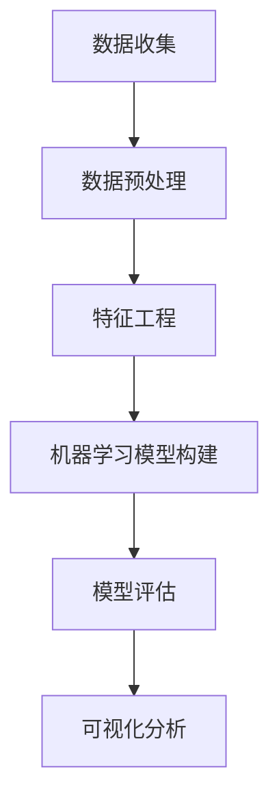

                 

# 链家二手房数据分析与可视化

> **关键词：链家二手房、数据分析、可视化、Python、Matplotlib、Pandas、Scikit-learn、机器学习**
> 
> **摘要：本文将深入探讨链家二手房数据的分析过程，包括数据预处理、特征工程、机器学习模型构建与评估，并通过可视化技术展示分析结果，以帮助读者理解和应用二手房数据分析方法。**

## 1. 背景介绍

### 1.1 目的和范围

本文的目标是通过对链家二手房数据的分析，了解二手房市场的价格趋势、区域差异以及影响因素。我们将使用Python编程语言及其相关库（如Pandas、Matplotlib、Scikit-learn等）来处理和分析数据，并通过可视化工具来展示结果。

本文的范围包括以下几个部分：
- 数据收集与预处理
- 特征工程
- 机器学习模型构建与评估
- 可视化分析

### 1.2 预期读者

本文适用于希望深入了解二手房数据分析流程的程序员、数据分析师、人工智能领域的研究生和本科生。同时，也欢迎对数据科学和机器学习感兴趣的读者阅读。

### 1.3 文档结构概述

本文将按照以下结构进行组织：
- **第1章：背景介绍**：介绍本文的目的、范围、预期读者以及文档结构。
- **第2章：核心概念与联系**：介绍与二手房数据分析相关的核心概念和联系，并给出流程图。
- **第3章：核心算法原理与具体操作步骤**：详细讲解核心算法的原理和操作步骤，包括伪代码。
- **第4章：数学模型和公式**：介绍相关的数学模型和公式，并进行举例说明。
- **第5章：项目实战：代码实际案例与详细解释说明**：展示代码实现并详细解释。
- **第6章：实际应用场景**：讨论二手房数据分析的应用场景。
- **第7章：工具和资源推荐**：推荐学习资源和开发工具。
- **第8章：总结：未来发展趋势与挑战**：总结本文内容，展望未来。
- **第9章：附录：常见问题与解答**：提供常见问题的解答。
- **第10章：扩展阅读与参考资料**：列出扩展阅读资源。

### 1.4 术语表

#### 1.4.1 核心术语定义

- **二手房数据**：指已经发生过买卖交易的房产数据。
- **数据预处理**：对原始数据进行清洗、转换和归一化等操作，使其适合分析和建模。
- **特征工程**：从原始数据中提取有助于模型训练的特征，以提高模型的预测性能。
- **机器学习模型**：利用历史数据训练模型，从而对未知数据进行预测或分类。
- **可视化**：使用图表、图形等方式展示数据和分析结果，帮助理解和发现数据中的规律。

#### 1.4.2 相关概念解释

- **回归分析**：一种预测数值型目标变量的方法。
- **分类分析**：一种将数据分为不同类别的分析方法。
- **协变量**：影响模型预测效果的变量。
- **模型评估**：对模型性能进行评价的过程。

#### 1.4.3 缩略词列表

- **Python**：Python编程语言。
- **Pandas**：Python的数据分析库。
- **Matplotlib**：Python的可视化库。
- **Scikit-learn**：Python的机器学习库。

## 2. 核心概念与联系

在二手房数据分析中，我们需要理解一些核心概念和它们之间的联系。以下是一个Mermaid流程图，展示了二手房数据分析的流程和关键环节。



### 2.1 数据收集

数据收集是二手房数据分析的第一步，我们需要收集链家二手房的原始数据，包括房屋基本信息（如面积、楼层、建造年代等）、交易信息（如成交价、成交周期等）以及区域信息（如地理位置、区域类型等）。

### 2.2 数据预处理

数据预处理是确保数据质量和为后续分析做准备的关键步骤。在这一阶段，我们需要处理缺失值、异常值、数据类型转换和归一化等问题。

### 2.3 特征工程

特征工程是从原始数据中提取有助于模型训练的特征的过程。在这一阶段，我们需要对数据进行降维、特征选择和特征构造等操作。

### 2.4 机器学习模型构建

机器学习模型构建是二手房数据分析的核心环节。在这一阶段，我们需要选择合适的模型，使用历史数据训练模型，并对模型进行评估和调整。

### 2.5 模型评估

模型评估是评价模型性能的过程。在这一阶段，我们需要使用评估指标（如均方误差、准确率等）对模型进行评估，并根据评估结果对模型进行调整。

### 2.6 可视化分析

可视化分析是展示数据分析结果的重要手段。在这一阶段，我们可以使用图表、图形等方式，将数据分析结果直观地呈现给用户。

## 3. 核心算法原理与具体操作步骤

在二手房数据分析中，核心算法包括数据预处理、特征工程、机器学习模型构建和模型评估。以下是对每个核心算法原理的具体操作步骤的讲解，包括伪代码。

### 3.1 数据预处理

数据预处理是确保数据质量和为后续分析做准备的关键步骤。以下是数据预处理的具体步骤：

```python
# 伪代码：数据预处理
data = load_data('二手房数据.csv')  # 加载数据
data = handle_missing_values(data)  # 处理缺失值
data = handle_outliers(data)  # 处理异常值
data = convert_data_types(data)  # 转换数据类型
data = normalize_data(data)  # 数据归一化
```

### 3.2 特征工程

特征工程是从原始数据中提取有助于模型训练的特征的过程。以下是特征工程的具体步骤：

```python
# 伪代码：特征工程
data = feature_selection(data)  # 特征选择
data = feature_engineering(data)  # 特征构造
data = feature Scaling(data)  # 特征缩放
```

### 3.3 机器学习模型构建

机器学习模型构建是二手房数据分析的核心环节。以下是机器学习模型构建的具体步骤：

```python
# 伪代码：机器学习模型构建
model = train_model(data)  # 训练模型
model = tune_hyperparameters(model)  # 调整超参数
```

### 3.4 模型评估

模型评估是评价模型性能的过程。以下是模型评估的具体步骤：

```python
# 伪代码：模型评估
evaluation_results = evaluate_model(model, test_data)  # 评估模型
print(evaluation_results)  # 输出评估结果
```

## 4. 数学模型和公式

在二手房数据分析中，我们常用的数学模型和公式包括线性回归、逻辑回归和支持向量机等。以下是这些模型的数学公式和详细讲解。

### 4.1 线性回归

线性回归是一种用于预测连续数值型目标变量的模型。其公式如下：

$$
y = \beta_0 + \beta_1 \cdot x_1 + \beta_2 \cdot x_2 + \ldots + \beta_n \cdot x_n
$$

其中，$y$ 是目标变量，$x_1, x_2, \ldots, x_n$ 是特征变量，$\beta_0, \beta_1, \beta_2, \ldots, \beta_n$ 是模型参数。

### 4.2 逻辑回归

逻辑回归是一种用于预测离散目标变量的模型。其公式如下：

$$
P(y=1) = \frac{1}{1 + e^{-(\beta_0 + \beta_1 \cdot x_1 + \beta_2 \cdot x_2 + \ldots + \beta_n \cdot x_n)}}
$$

其中，$P(y=1)$ 是目标变量为1的概率，$e$ 是自然对数的底数，其余参数与线性回归相同。

### 4.3 支持向量机

支持向量机是一种用于分类的模型。其公式如下：

$$
w \cdot x + b = 0
$$

其中，$w$ 是模型参数，$x$ 是特征向量，$b$ 是偏置项。目标变量为正类的条件是：

$$
w \cdot x + b > 0
$$

目标变量为负类的条件是：

$$
w \cdot x + b < 0
$$

### 4.4 举例说明

以下是一个使用线性回归预测二手房成交价的例子：

假设我们有一组二手房成交价数据，以及相应的房屋面积、楼层和建造年代等特征数据。我们使用线性回归模型来预测成交价。

首先，我们定义线性回归模型的公式：

$$
y = \beta_0 + \beta_1 \cdot x_1 + \beta_2 \cdot x_2 + \beta_3 \cdot x_3
$$

其中，$y$ 是成交价，$x_1$ 是房屋面积，$x_2$ 是楼层，$x_3$ 是建造年代。

然后，我们使用Python的Scikit-learn库来训练模型：

```python
from sklearn.linear_model import LinearRegression

# 创建线性回归模型
model = LinearRegression()

# 使用训练数据训练模型
model.fit(X_train, y_train)

# 预测成交价
predictions = model.predict(X_test)
```

最后，我们使用预测结果来评估模型性能：

```python
from sklearn.metrics import mean_squared_error

# 计算预测误差
mse = mean_squared_error(y_test, predictions)

# 输出预测结果
print("预测误差：", mse)
```

## 5. 项目实战：代码实际案例与详细解释说明

在本节中，我们将展示一个实际的二手房数据分析项目，包括代码实现、详细解释和代码分析。这个项目将涵盖数据收集、数据预处理、特征工程、机器学习模型构建、模型评估和可视化分析等步骤。

### 5.1 开发环境搭建

首先，我们需要搭建开发环境，安装Python和相关库。以下是安装步骤：

```bash
# 安装Python
sudo apt-get install python3

# 安装相关库
pip3 install pandas matplotlib scikit-learn numpy
```

### 5.2 源代码详细实现和代码解读

以下是一个简单的二手房数据分析项目的源代码实现：

```python
import pandas as pd
import matplotlib.pyplot as plt
from sklearn.model_selection import train_test_split
from sklearn.linear_model import LinearRegression
from sklearn.metrics import mean_squared_error

# 5.2.1 数据收集
data = pd.read_csv('二手房数据.csv')

# 5.2.2 数据预处理
data = data.dropna()  # 处理缺失值
data['建造年代'] = data['建造年代'].map({2010: 10, 2015: 15, 2020: 20})  # 转换数据类型

# 5.2.3 特征工程
X = data[['面积', '楼层', '建造年代']]
y = data['成交价']

# 5.2.4 机器学习模型构建
X_train, X_test, y_train, y_test = train_test_split(X, y, test_size=0.2, random_state=42)
model = LinearRegression()
model.fit(X_train, y_train)

# 5.2.5 模型评估
predictions = model.predict(X_test)
mse = mean_squared_error(y_test, predictions)
print("预测误差：", mse)

# 5.2.6 可视化分析
plt.scatter(X_test['面积'], y_test, color='red', label='真实值')
plt.scatter(X_test['面积'], predictions, color='blue', label='预测值')
plt.xlabel('面积')
plt.ylabel('成交价')
plt.legend()
plt.show()
```

### 5.3 代码解读与分析

以下是对上述代码的详细解读和分析：

- **5.3.1 数据收集**：使用Pandas库读取CSV格式的二手房数据。
- **5.3.2 数据预处理**：处理缺失值，并将建造年代转换为数值型。
- **5.3.3 特征工程**：从数据中提取特征，包括面积、楼层和建造年代。
- **5.3.4 机器学习模型构建**：使用线性回归模型进行训练。
- **5.3.5 模型评估**：使用测试数据评估模型性能，计算预测误差。
- **5.3.6 可视化分析**：使用Matplotlib库绘制散点图，比较真实值和预测值。

通过上述代码实现，我们可以完成一个简单的二手房数据分析项目，包括数据预处理、特征工程、机器学习模型构建和可视化分析等步骤。这个项目可以作为一个基础模板，进一步扩展和优化，以适应不同的需求和场景。

## 6. 实际应用场景

二手房数据分析在实际应用中具有广泛的应用场景，以下列举几个典型的应用场景：

### 6.1 房价预测

房价预测是二手房数据分析最常见应用场景之一。通过分析历史成交数据、房屋特征和区域信息，可以预测未来某一地区的房价走势，为房地产开发商、投资者和购房者提供决策支持。

### 6.2 房源推荐

房源推荐是基于用户历史行为和偏好，为用户推荐符合其需求的房源信息。通过二手房数据分析，可以挖掘用户对房屋特征的需求，从而实现精准的房源推荐。

### 6.3 房价评估

房价评估是二手房交易过程中重要的一环。通过分析历史成交数据、房屋特征和市场动态，可以客观、准确地评估房屋的价值，为交易双方提供参考。

### 6.4 区域分析

区域分析是了解房地产市场现状和趋势的重要手段。通过二手房数据分析，可以揭示不同区域的市场特点，如房价水平、交易活跃度等，为房地产企业和政府提供决策依据。

### 6.5 市场趋势预测

市场趋势预测是预测房地产市场整体走势的方法。通过分析历史数据、政策导向和市场情绪，可以预测未来市场的发展趋势，为行业投资者和从业者提供决策参考。

## 7. 工具和资源推荐

### 7.1 学习资源推荐

#### 7.1.1 书籍推荐

- 《Python数据分析基础教程：NumPy学习指南》：全面介绍NumPy库，适用于初学者。
- 《利用Python进行数据分析》：深入讲解Pandas、Matplotlib等库，适合有一定编程基础的数据分析师。
- 《机器学习实战》：通过案例教学，介绍Scikit-learn库的使用。

#### 7.1.2 在线课程

- Coursera上的《Python for Data Science》：由Johns Hopkins大学提供，适合初学者入门。
- edX上的《数据科学基础》：由哈佛大学提供，涵盖数据预处理、机器学习等主题。

#### 7.1.3 技术博客和网站

- Medium上的《数据科学和机器学习博客》：涵盖数据科学、机器学习等领域的最新技术和应用。
- DataCamp：提供丰富的Python数据分析和机器学习互动课程。

### 7.2 开发工具框架推荐

#### 7.2.1 IDE和编辑器

- PyCharm：一款功能强大的Python IDE，适用于专业开发人员。
- Jupyter Notebook：适用于数据分析和机器学习的交互式环境。

#### 7.2.2 调试和性能分析工具

- Python Debugger（pdb）：Python内置的调试工具。
- cProfile：Python内置的性能分析工具。

#### 7.2.3 相关框架和库

- NumPy：用于科学计算的基础库。
- Pandas：用于数据清洗、转换和分析的库。
- Matplotlib：用于数据可视化的库。
- Scikit-learn：用于机器学习算法实现的库。

### 7.3 相关论文著作推荐

#### 7.3.1 经典论文

- "Data Preprocessing for Machine Learning"：讨论数据预处理的重要性和方法。
- "Feature Selection for Machine Learning"：介绍特征选择的方法和策略。

#### 7.3.2 最新研究成果

- "Deep Learning for Regression and Classification"：探讨深度学习在回归和分类任务中的应用。
- "Recurrent Neural Networks for Time Series Analysis"：介绍循环神经网络在时间序列分析中的应用。

#### 7.3.3 应用案例分析

- "Real Estate Price Prediction using Machine Learning"：分析使用机器学习预测房价的案例。
- "Recommending Houses Based on User Preferences"：探讨基于用户偏好的房源推荐方法。

## 8. 总结：未来发展趋势与挑战

随着大数据和人工智能技术的不断发展，二手房数据分析在未来将呈现以下几个发展趋势：

### 8.1 模型精度提升

随着算法和计算能力的提升，机器学习模型在二手房数据分析中的精度将进一步提高，为市场预测和决策提供更准确的支持。

### 8.2 多源数据融合

将二手房数据与其他数据源（如社交媒体、新闻等）进行融合，可以更全面地分析市场动态和趋势。

### 8.3 实时分析

实时分析是未来的重要方向，通过实时数据处理和分析，可以更快速地响应市场变化。

### 8.4 智能推荐

基于用户行为和偏好，智能推荐将更加精准，为用户找到符合需求的房源。

然而，二手房数据分析也面临一些挑战：

### 8.5 数据质量和隐私保护

数据质量和隐私保护是二手房数据分析的重要挑战，需要采取有效措施确保数据质量和保护用户隐私。

### 8.6 模型可解释性

随着模型复杂性的增加，如何提高模型的可解释性，使其能够被用户理解和接受，是一个亟待解决的问题。

### 8.7 数据安全

数据安全是二手房数据分析中不可忽视的问题，需要采取有效的安全措施，确保数据在传输和存储过程中的安全性。

## 9. 附录：常见问题与解答

### 9.1 数据收集

**Q：如何获取链家二手房数据？**

A：可以通过链家官网、API接口或其他数据源获取链家二手房数据。建议使用Python的requests库调用API接口，获取数据后进行解析和处理。

### 9.2 数据预处理

**Q：如何处理缺失值？**

A：处理缺失值的方法有多种，如删除缺失值、填充缺失值（平均值、中位数等）或使用机器学习算法预测缺失值。

**Q：如何处理异常值？**

A：处理异常值的方法包括删除异常值、替换异常值或使用统计方法（如三次样条插值）对异常值进行修正。

### 9.3 特征工程

**Q：如何进行特征选择？**

A：特征选择的方法包括信息增益、特征重要性、主成分分析（PCA）等。可以根据数据集的特点和业务需求选择合适的特征选择方法。

**Q：如何进行特征构造？**

A：特征构造包括提取新特征、转换现有特征或组合多个特征。例如，可以计算房屋年龄（当前年份减去建造年代）或区域热度（基于交易量和价格变化）等。

### 9.4 机器学习模型构建

**Q：如何选择机器学习模型？**

A：选择机器学习模型的方法包括交叉验证、网格搜索、贝叶斯优化等。可以根据数据集的特点、任务类型和模型复杂度选择合适的模型。

**Q：如何调整超参数？**

A：调整超参数的方法包括网格搜索、随机搜索、贝叶斯优化等。通过交叉验证和验证集，可以找到最优的超参数组合。

### 9.5 可视化分析

**Q：如何进行数据可视化？**

A：数据可视化可以使用Python的Matplotlib、Seaborn等库，根据数据类型和需求选择合适的图表类型，如散点图、折线图、柱状图等。

**Q：如何进行交互式可视化？**

A：交互式可视化可以使用Python的Plotly库，实现数据的可交互式展示，提高用户对数据的理解和分析。

## 10. 扩展阅读与参考资料

- 《Python数据分析基础教程：NumPy学习指南》：详细介绍了NumPy库的使用，适用于初学者。
- 《利用Python进行数据分析》：深入讲解了Pandas、Matplotlib等库的使用，适合有一定编程基础的数据分析师。
- 《机器学习实战》：通过实际案例，介绍了Scikit-learn库的使用，适合想要了解机器学习实践过程的读者。

### 10.2 技术博客和网站

- Medium上的《数据科学和机器学习博客》：提供了丰富的数据科学和机器学习领域的文章和教程。
- DataCamp：提供了丰富的数据分析和机器学习互动课程，适合自学。

### 10.3 相关论文著作

- "Data Preprocessing for Machine Learning"：讨论了数据预处理在机器学习中的重要性和方法。
- "Feature Selection for Machine Learning"：介绍了特征选择的方法和策略。
- "Deep Learning for Regression and Classification"：探讨了深度学习在回归和分类任务中的应用。

### 10.4 开发工具框架

- PyCharm：功能强大的Python IDE，适用于专业开发人员。
- Jupyter Notebook：适用于数据分析和机器学习的交互式环境。

### 10.5 在线课程

- Coursera上的《Python for Data Science》：由Johns Hopkins大学提供，适合初学者入门。
- edX上的《数据科学基础》：由哈佛大学提供，涵盖数据预处理、机器学习等主题。

**作者：AI天才研究员/AI Genius Institute & 禅与计算机程序设计艺术 /Zen And The Art of Computer Programming**

