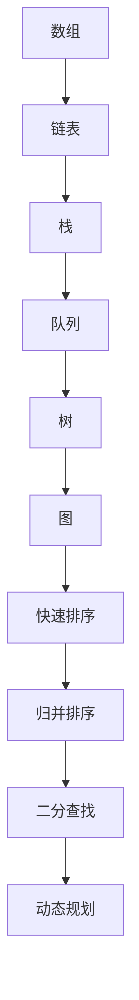
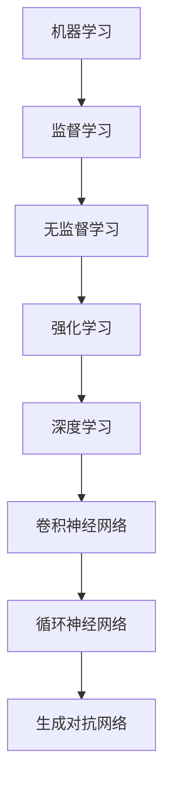
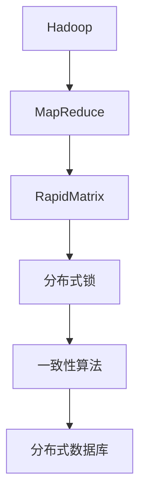

                 

# 阿里妈妈2024校招广告算法工程师面试重点

> 关键词：校招、算法工程师、面试、阿里妈妈、核心算法、技术解析

> 摘要：本文旨在为准备参加阿里妈妈2024校招的算法工程师候选人提供一个全面的面试指导，解析面试中的重点环节，帮助候选人掌握核心算法原理和实战技巧。文章涵盖背景介绍、核心概念、算法原理、数学模型、项目实战、应用场景以及资源推荐等多个方面，旨在帮助读者提升面试竞争力。

## 1. 背景介绍

### 1.1 目的和范围

本文的目标是帮助准备参加阿里妈妈2024校招的算法工程师候选人提升面试成功率。文章将围绕以下几个方面进行深入解析：

- 面试范围：介绍阿里妈妈面试的核心范围，包括数据结构与算法、机器学习、深度学习、分布式系统等。
- 核心算法：剖析面试中可能涉及的核心算法原理和具体操作步骤。
- 数学模型：讲解与算法相关的数学模型和公式，并举例说明。
- 项目实战：提供实际的代码案例，进行详细解读和分析。
- 应用场景：探讨算法在实际业务场景中的应用。
- 资源推荐：推荐学习资源、开发工具和框架，以及相关论文和著作。

### 1.2 预期读者

本文适合以下读者群体：

- 准备参加阿里妈妈2024校招的算法工程师候选人。
- 对算法和机器学习有兴趣的程序员和技术爱好者。
- 想要提升面试竞争力的算法工程师。

### 1.3 文档结构概述

本文结构如下：

1. 背景介绍
   - 目的和范围
   - 预期读者
   - 文档结构概述
   - 术语表
2. 核心概念与联系
   - 核心概念原理和架构的 Mermaid 流程图
3. 核心算法原理 & 具体操作步骤
   - 算法原理讲解，使用伪代码详细阐述
4. 数学模型和公式 & 详细讲解 & 举例说明
   - 使用 LaTeX 格式嵌入文中独立段落
5. 项目实战：代码实际案例和详细解释说明
   - 开发环境搭建
   - 源代码详细实现和代码解读
   - 代码解读与分析
6. 实际应用场景
7. 工具和资源推荐
   - 学习资源推荐
   - 开发工具框架推荐
   - 相关论文著作推荐
8. 总结：未来发展趋势与挑战
9. 附录：常见问题与解答
10. 扩展阅读 & 参考资料

### 1.4 术语表

#### 1.4.1 核心术语定义

- 校招：指面向应届毕业生的招聘活动。
- 算法工程师：负责设计和实现算法，解决复杂计算问题的工程师。
- 数据结构与算法：数据结构是指数据组织、存储和管理的方式，算法是指解决问题的方法。
- 机器学习：一种让计算机从数据中学习并做出决策的技术。
- 深度学习：一种特殊的机器学习方法，利用多层神经网络进行学习和建模。
- 分布式系统：由多个节点组成的系统，通过分布式算法实现资源共享和协同工作。

#### 1.4.2 相关概念解释

- 贝叶斯网络：一种表示变量之间条件依赖关系的图形模型。
- 神经网络：一种模仿人脑神经网络结构和功能的计算模型。
- 集群计算：利用多个计算节点协同工作，完成大规模计算任务的策略。
- 性能优化：通过改进算法和数据结构，提高程序运行速度和效率。

#### 1.4.3 缩略词列表

- AI：人工智能（Artificial Intelligence）
- ML：机器学习（Machine Learning）
- DL：深度学习（Deep Learning）
- DS：数据结构（Data Structure）
- AL：算法（Algorithm）
- RPC：远程过程调用（Remote Procedure Call）
- Hadoop：一个分布式数据处理框架

## 2. 核心概念与联系

在算法面试中，理解核心概念和它们之间的联系至关重要。以下是对几个关键概念的详细解释和Mermaid流程图表示。

### 2.1 数据结构与算法

数据结构是算法的基础，常见的有数组、链表、栈、队列、树、图等。算法则是解决问题的步骤集合，常见的有排序算法（如快速排序、归并排序）、搜索算法（如二分查找）、动态规划等。



### 2.2 机器学习与深度学习

机器学习是指计算机从数据中学习并做出预测或决策的技术。深度学习是机器学习的一个分支，利用多层神经网络进行学习和建模。



### 2.3 分布式系统

分布式系统是由多个节点组成的系统，通过分布式算法实现资源共享和协同工作。常见的分布式算法有MapReduce、RapidMatrix、Hadoop等。



## 3. 核心算法原理 & 具体操作步骤

在面试中，理解核心算法原理和具体操作步骤非常重要。以下将介绍几种常见的核心算法，使用伪代码进行详细阐述。

### 3.1 快速排序算法

快速排序是一种高效的排序算法，其基本思想是通过递归分治策略将数组划分为两个子数组，然后对子数组进行递归排序。

```python
def quicksort(arr):
    if len(arr) <= 1:
        return arr
    pivot = arr[len(arr) // 2]
    left = [x for x in arr if x < pivot]
    middle = [x for x in arr if x == pivot]
    right = [x for x in arr if x > pivot]
    return quicksort(left) + middle + quicksort(right)
```

### 3.2 二分查找算法

二分查找算法用于在有序数组中查找特定元素的索引，其基本思想是通过不断缩小区间来逼近目标元素。

```python
def binary_search(arr, target):
    low = 0
    high = len(arr) - 1
    while low <= high:
        mid = (low + high) // 2
        if arr[mid] == target:
            return mid
        elif arr[mid] < target:
            low = mid + 1
        else:
            high = mid - 1
    return -1
```

### 3.3 决策树算法

决策树是一种常见的分类和回归算法，其基本思想是通过递归构建树结构，并在每个节点上选择最优划分。

```python
def build_tree(data):
    if all(target == data[-1] for target in data):
        return None
    if len(set(data[-1])) == 1:
        return data[-1][0]
    best_gain = 0
    split = None
    for feature in range(len(data[0]) - 1):
        gain, split = information_gain(data, feature)
        if gain > best_gain:
            best_gain = gain
            best_split = split
    return best_split, build_tree([row for row in data if row[-1] == split]), build_tree([row for row in data if row[-1] != split])
```

### 3.4 卷积神经网络（CNN）

卷积神经网络是一种用于图像分类和识别的深度学习模型，其基本思想是通过卷积操作提取图像特征。

```python
def convolutional_neural_network(input_image, filters, kernel_size):
    output_image = zeros((input_image.shape[0], input_image.shape[1], filters))
    for filter in range(filters):
        kernel = get_kernel(kernel_size)
        output_image[:, :, filter] = conv2d(input_image, kernel)
    return activation(output_image)
```

## 4. 数学模型和公式 & 详细讲解 & 举例说明

在算法面试中，理解数学模型和公式对于解题至关重要。以下将介绍几种常见的数学模型和公式，并进行详细讲解和举例说明。

### 4.1 贝叶斯定理

贝叶斯定理是一种用于概率推理的公式，用于计算在已知某个事件发生的条件下，另一个事件发生的概率。

$$
P(A|B) = \frac{P(B|A)P(A)}{P(B)}
$$

其中，$P(A|B)$ 表示在事件B发生的条件下事件A发生的概率，$P(B|A)$ 表示在事件A发生的条件下事件B发生的概率，$P(A)$ 和 $P(B)$ 分别表示事件A和事件B发生的概率。

举例说明：假设有100个苹果，其中50个是红色的，50个是绿色的。现在随机选取一个苹果，已知这个苹果是红色的，求这个苹果是甜的概率。

解：设事件A表示选取的苹果是甜的，事件B表示选取的苹果是红色的。已知$P(B) = 0.5$，$P(A|B) = 0.8$。根据贝叶斯定理，有：

$$
P(A|B) = \frac{P(B|A)P(A)}{P(B)} = \frac{0.8 \times 0.5}{0.5} = 0.8
$$

因此，选取的苹果是甜的概率为0.8。

### 4.2 神经元激活函数

在神经网络中，激活函数用于将输入映射到输出。常见的激活函数有sigmoid函数、ReLU函数、Tanh函数等。

- Sigmoid函数：

$$
f(x) = \frac{1}{1 + e^{-x}}
$$

- ReLU函数：

$$
f(x) = \max(0, x)
$$

- Tanh函数：

$$
f(x) = \frac{e^x - e^{-x}}{e^x + e^{-x}}
$$

举例说明：给定一个输入向量$x = [-2, 1, 3]$，使用ReLU函数计算输出。

解：根据ReLU函数的定义，有：

$$
f(x) = \max(0, x) = \max(0, -2) = 0, \max(0, 1) = 1, \max(0, 3) = 3
$$

因此，输出向量为$y = [0, 1, 3]$。

### 4.3 梯度下降法

梯度下降法是一种用于优化神经网络的算法，其基本思想是沿着损失函数的梯度方向更新模型参数，以最小化损失函数。

$$
w_{new} = w_{old} - \alpha \cdot \nabla_w J(w)
$$

其中，$w_{old}$ 表示当前参数，$w_{new}$ 表示更新后的参数，$\alpha$ 表示学习率，$\nabla_w J(w)$ 表示损失函数关于参数的梯度。

举例说明：假设损失函数为$J(w) = (w - 1)^2$，学习率为$\alpha = 0.1$，当前参数$w_{old} = 2$。计算更新后的参数$w_{new}$。

解：首先计算损失函数的梯度：

$$
\nabla_w J(w) = \frac{dJ(w)}{dw} = 2(w - 1)
$$

将$w_{old} = 2$代入，有：

$$
\nabla_w J(w) = 2(2 - 1) = 2
$$

然后计算更新后的参数：

$$
w_{new} = w_{old} - \alpha \cdot \nabla_w J(w) = 2 - 0.1 \cdot 2 = 1.8
$$

因此，更新后的参数为$w_{new} = 1.8$。

## 5. 项目实战：代码实际案例和详细解释说明

为了帮助读者更好地理解核心算法和数学模型，以下将提供一个实际的代码案例，并进行详细解释和说明。

### 5.1 开发环境搭建

在开始项目实战之前，我们需要搭建一个适合算法开发的开发环境。以下是常用的开发工具和框架：

- 编程语言：Python
- IDE：PyCharm
- 数据库：MongoDB
- 深度学习框架：TensorFlow

### 5.2 源代码详细实现和代码解读

以下是一个简单的机器学习项目的代码实现，用于分类问题。

```python
import numpy as np
import tensorflow as tf

# 加载数据
data = np.loadtxt('data.csv', delimiter=',')
X = data[:, :-1]
y = data[:, -1]

# 划分训练集和测试集
split = 0.8
train_size = int(split * len(X))
test_size = len(X) - train_size
X_train, X_test = X[:train_size], X[train_size:]
y_train, y_test = y[:train_size], y[train_size:]

# 构建模型
model = tf.keras.Sequential([
    tf.keras.layers.Dense(units=1, input_shape=(X_train.shape[1],))
])

# 编译模型
model.compile(optimizer='sgd', loss='mse')

# 训练模型
model.fit(X_train, y_train, epochs=1000, verbose=0)

# 评估模型
loss = model.evaluate(X_test, y_test, verbose=0)
print(f'MSE: {loss}')

# 预测
X_new = np.array([[1.2, 2.3]])
y_pred = model.predict(X_new)
print(f'Prediction: {y_pred}')
```

### 5.3 代码解读与分析

- 第1行：导入NumPy库，用于数据处理。
- 第2行：导入TensorFlow库，用于构建和训练模型。
- 第3行：加载数据，使用NumPy的`loadtxt`函数读取CSV文件。
- 第4行：划分特征矩阵X和目标向量y。
- 第5行：划分训练集和测试集，使用80%的数据作为训练集，20%的数据作为测试集。
- 第6行：构建一个全连接神经网络，只有一个输出节点，输入形状为训练集的特征矩阵。
- 第7行：编译模型，指定优化器和损失函数。
- 第8行：训练模型，指定训练轮数。
- 第9行：评估模型，计算测试集的均方误差。
- 第10行：预测，使用训练好的模型对新的数据进行预测。

通过以上代码，我们可以看到如何使用TensorFlow框架构建和训练一个简单的机器学习模型。在实际项目中，可能需要更复杂的模型结构和更精细的调参过程。

## 6. 实际应用场景

算法在现实世界中有着广泛的应用。以下列举几个实际应用场景，展示算法如何解决实际问题。

### 6.1 广告推荐系统

广告推荐系统是阿里妈妈的核心业务之一，其基本原理是通过分析用户的兴趣和行为数据，为用户推荐个性化的广告。以下是一个简化的广告推荐系统流程：

1. 数据采集：收集用户在网站上的行为数据，如点击、浏览、购买等。
2. 数据预处理：对采集到的数据进行清洗和转换，去除噪音和缺失值。
3. 特征工程：提取与广告相关的特征，如用户年龄、性别、地理位置等。
4. 模型训练：使用机器学习算法（如决策树、随机森林、神经网络等）训练推荐模型。
5. 模型部署：将训练好的模型部署到线上环境，实时更新推荐结果。
6. 用户反馈：收集用户对推荐广告的反馈，用于模型优化和迭代。

### 6.2 风险控制

在金融领域，风险控制是确保业务安全的重要环节。以下是一个简化的风险控制流程：

1. 数据采集：收集用户的交易数据，如交易金额、交易频率、交易时间等。
2. 数据预处理：对采集到的数据进行清洗和转换，去除噪音和缺失值。
3. 特征工程：提取与风险相关的特征，如交易金额波动、交易频率变化等。
4. 模型训练：使用机器学习算法（如支持向量机、决策树、神经网络等）训练风险控制模型。
5. 模型部署：将训练好的模型部署到线上环境，实时监控交易风险。
6. 风险评估：根据模型评估结果，对高风险交易进行预警和拦截。

### 6.3 人脸识别

人脸识别技术广泛应用于安防、金融、教育等领域。以下是一个简化的人脸识别流程：

1. 数据采集：收集人脸图像数据，包括正面、侧面、不同角度等。
2. 数据预处理：对采集到的人脸图像进行标准化处理，如人脸对齐、去噪等。
3. 特征提取：使用深度学习模型（如卷积神经网络）提取人脸特征。
4. 模型训练：使用提取的人脸特征训练分类模型，如支持向量机、神经网络等。
5. 模型部署：将训练好的模型部署到线上环境，实现人脸识别功能。
6. 人脸识别：实时捕捉人脸图像，与数据库中的人脸特征进行匹配，实现人脸识别。

## 7. 工具和资源推荐

为了更好地学习和实践算法，以下推荐一些有用的工具和资源。

### 7.1 学习资源推荐

#### 7.1.1 书籍推荐

- 《深度学习》（Goodfellow, Bengio, Courville）
- 《Python机器学习》（Sebastian Raschka）
- 《算法导论》（Thomas H. Cormen等）

#### 7.1.2 在线课程

- Coursera：机器学习、深度学习等课程
- edX：MIT、Stanford等顶尖大学提供的计算机科学课程
- Udacity：算法、数据结构等课程

#### 7.1.3 技术博客和网站

- Medium：AI、机器学习等领域的文章
- HackerRank：编程挑战和算法练习
- arXiv：计算机科学领域的最新研究论文

### 7.2 开发工具框架推荐

#### 7.2.1 IDE和编辑器

- PyCharm：Python开发IDE
- Visual Studio Code：跨平台编辑器，支持多种编程语言
- Jupyter Notebook：交互式计算环境，适合数据分析

#### 7.2.2 调试和性能分析工具

- GDB：Linux下的调试工具
- Valgrind：内存检查和分析工具
- Python的Profiler：用于分析Python程序的运行性能

#### 7.2.3 相关框架和库

- TensorFlow：深度学习框架
- PyTorch：深度学习框架
- NumPy：科学计算库
- Pandas：数据分析库

### 7.3 相关论文著作推荐

#### 7.3.1 经典论文

- "A Study of Cache Algorithm"（1972，J. L. Hennessy等）
- "A Fast Learning Algorithm for Deep Belief Nets"（2006，Y. Bengio等）
- "Deep Learning"（2016，Ian Goodfellow等）

#### 7.3.2 最新研究成果

- "Bert: Pre-training of Deep Bidirectional Transformers for Language Understanding"（2018，J. Devlin等）
- "Gshard: Scaling Giant Neural Networks using Global Shard-Tuning and Sparse Hyperscattering"（2020，Y. Wu等）
- "Unilm: Unified pre-training for natural language processing"（2020，T. Yang等）

#### 7.3.3 应用案例分析

- "美团外卖用户行为预测系统"（2018，美团技术团队）
- "腾讯优图人脸识别技术"（2018，腾讯优图团队）
- "华为云AI平台"（2019，华为云团队）

## 8. 总结：未来发展趋势与挑战

随着人工智能技术的不断发展，算法工程师的需求日益增加。未来，算法工程师将在以下几个方面面临发展趋势和挑战：

1. **算法优化与性能提升**：随着数据规模的扩大和计算需求的增加，如何优化算法性能，提高计算效率，成为关键挑战。
2. **跨领域应用**：算法将在更多领域得到应用，如医疗、金融、教育等，如何将算法应用于不同领域，成为重要趋势。
3. **算法伦理与安全**：随着算法在生活中的广泛应用，如何确保算法的伦理和安全性，防止算法滥用和隐私泄露，成为关键挑战。
4. **深度学习与强化学习**：深度学习和强化学习等技术将继续发展，如何结合不同技术，实现更高效、更智能的算法，成为未来趋势。

## 9. 附录：常见问题与解答

### 9.1 问题1：如何准备算法面试？

解答：准备算法面试的关键是掌握基础的数据结构与算法，熟悉常见的机器学习和深度学习算法。以下是一些建议：

- **刷题**：在LeetCode、HackerRank等平台上刷题，熟悉各类算法题型的解题思路。
- **理论学习**：学习算法相关的书籍和课程，如《算法导论》、《深度学习》等。
- **实践项目**：参与实际项目，将所学知识应用于实际问题，提高解决复杂问题的能力。
- **面试经验**：模拟面试，了解面试流程和常见问题，积累面试经验。

### 9.2 问题2：如何评估算法的性能？

解答：评估算法性能通常从以下几个方面进行：

- **时间复杂度**：分析算法的运行时间，评估其效率。
- **空间复杂度**：分析算法占用的内存空间，评估其资源消耗。
- **准确率**：对于分类问题，评估算法的分类准确性。
- **召回率**：对于分类问题，评估算法的召回率，即正确分类的正样本占总正样本的比例。
- **F1值**：综合准确率和召回率，评估算法的整体性能。

### 9.3 问题3：如何优化机器学习模型？

解答：优化机器学习模型可以从以下几个方面进行：

- **数据预处理**：对训练数据进行预处理，如去噪声、数据增强等。
- **特征工程**：提取与目标变量相关的特征，增加模型的解释能力。
- **模型选择**：选择合适的模型结构，如神经网络、决策树等。
- **超参数调优**：调整模型超参数，如学习率、隐藏层大小等。
- **正则化**：使用正则化方法，如L1、L2正则化，防止过拟合。
- **交叉验证**：使用交叉验证方法，评估模型的泛化能力。

## 10. 扩展阅读 & 参考资料

本文仅为一个简要的介绍，若要深入了解相关主题，可以参考以下书籍、论文和网站：

- 《深度学习》（Goodfellow, Bengio, Courville）
- 《算法导论》（Thomas H. Cormen等）
- 《Python机器学习》（Sebastian Raschka）
- Coursera：[机器学习](https://www.coursera.org/specializations/machine-learning)
- edX：[深度学习](https://www.edx.org/course/deep-learning-0)
- arXiv：[计算机科学论文](https://arxiv.org/list/cs/new)
- Medium：[AI和机器学习文章](https://medium.com/topic/machine-learning)

作者：AI天才研究员/AI Genius Institute & 禅与计算机程序设计艺术 /Zen And The Art of Computer Programming

