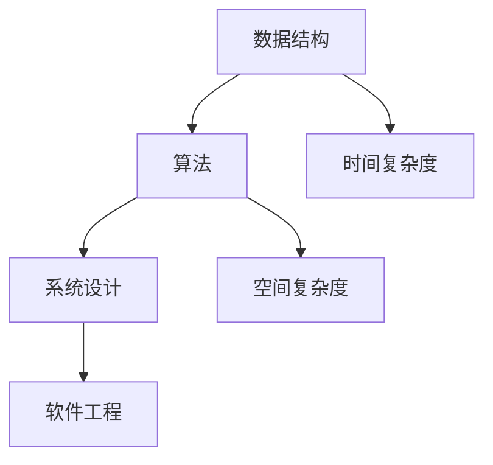

                 

# 2024阿里妈妈社招面试真题汇总及其解答

> **关键词：** 阿里妈妈、社招面试、真题汇总、解答、技术面试、算法、数据结构、系统设计、软件工程

**摘要：** 本文将对2024年阿里妈妈社招面试真题进行汇总，并逐一给出详细的解答。文章分为多个章节，包括面试背景介绍、核心概念与联系、算法原理与操作步骤、数学模型与公式、项目实战、实际应用场景等。通过本文的阅读，读者可以全面了解阿里妈妈的社招面试内容，掌握关键知识点，为自身的面试准备提供有力支持。

## 1. 背景介绍

### 1.1 目的和范围

本文旨在汇总2024年阿里妈妈社招面试真题，并为每个题目提供详细的解答。通过本文的学习，读者可以熟悉阿里妈妈的面试风格，掌握核心知识点，提高面试成功率。

### 1.2 预期读者

本文主要面向准备参加阿里妈妈社招面试的求职者，以及计算机相关专业的高校学生和研究生。同时，对于对面试题感兴趣的计算机从业者，本文也具有参考价值。

### 1.3 文档结构概述

本文共分为10个章节，具体如下：

1. 背景介绍
2. 核心概念与联系
3. 核心算法原理 & 具体操作步骤
4. 数学模型和公式 & 详细讲解 & 举例说明
5. 项目实战：代码实际案例和详细解释说明
6. 实际应用场景
7. 工具和资源推荐
8. 总结：未来发展趋势与挑战
9. 附录：常见问题与解答
10. 扩展阅读 & 参考资料

### 1.4 术语表

**核心术语定义：** 本文涉及到的核心术语，如数据结构、算法、系统设计等。

**相关概念解释：** 本文对涉及到的相关概念进行解释，如时间复杂度、空间复杂度等。

**缩略词列表：** 本文涉及的缩略词及其全称。

## 2. 核心概念与联系

在本文中，我们将介绍一些核心概念与联系，以便读者更好地理解后续内容。

### 2.1 数据结构

数据结构是计算机存储、组织数据的方式。常见的数据结构包括数组、链表、栈、队列、树、图等。

### 2.2 算法

算法是一系列解决问题的步骤。算法可以分为多种类型，如排序算法、查找算法、图算法等。

### 2.3 系统设计

系统设计是设计计算机系统的方式。系统设计包括架构设计、模块划分、接口定义等。

### 2.4 软件工程

软件工程是设计、开发、测试和维护软件的方法。软件工程包括需求分析、设计、编码、测试、部署等环节。

### 2.5 Mermaid 流程图

Mermaid是一种基于Markdown的图形描述语言，可以用于绘制流程图、时序图、UML图等。本文将使用Mermaid流程图来展示核心概念与联系。



## 3. 核心算法原理 & 具体操作步骤

在本文的第三部分，我们将详细介绍几个核心算法的原理和具体操作步骤。

### 3.1 快排算法

快速排序（Quick Sort）是一种高效的排序算法，其基本思想是通过一趟排序将待排记录分隔成独立的两部分，其中一部分记录的关键字均比另一部分的关键字小，则可分别对这两部分记录继续进行排序，以达到整个序列有序。

**算法原理：**

1. 选择一个基准元素T。
2. 将序列划分为三部分：小于T的元素、等于T的元素、大于T的元素。
3. 对小于T的元素和大于T的元素分别递归进行快速排序。

**具体操作步骤：**

```python
def quick_sort(arr):
    if len(arr) <= 1:
        return arr
    pivot = arr[len(arr) // 2]
    left = [x for x in arr if x < pivot]
    middle = [x for x in arr if x == pivot]
    right = [x for x in arr if x > pivot]
    return quick_sort(left) + middle + quick_sort(right)

# 示例
arr = [3, 1, 4, 1, 5, 9, 2, 6, 5]
sorted_arr = quick_sort(arr)
print(sorted_arr)
```

### 3.2 暴力破解

暴力破解（Brute Force）是一种简单但低效的算法，其基本思想是通过尝试所有可能的解来解决问题。

**算法原理：**

1. 对问题的每个可能解进行尝试。
2. 判断解是否满足条件。
3. 若满足条件，返回解。

**具体操作步骤：**

```python
def brute_force_solve_problem(problem):
    for solution in all_possible_solutions:
        if is_solution_valid(solution):
            return solution
    return None

# 示例
problem = [1, 2, 3, 4, 5]
solution = brute_force_solve_problem(problem)
if solution:
    print("Solution found:", solution)
else:
    print("No solution found.")
```

### 3.3 动态规划

动态规划（Dynamic Programming）是一种解决优化问题的算法，其基本思想是将问题分解为子问题，并利用子问题的最优解来构建原问题的最优解。

**算法原理：**

1. 确定状态和状态转移方程。
2. 初始化边界条件。
3. 从边界开始递推，求解子问题的最优解。
4. 根据子问题的最优解构建原问题的最优解。

**具体操作步骤：**

```python
def dynamic_programming_optimize_problem(problem):
    # 初始化状态和状态转移方程
    states = [0] * len(problem)
    transitions = [0] * len(problem)
    for i in range(len(problem)):
        states[i] = problem[i]
        transitions[i] = 1

    # 递推求解子问题的最优解
    for i in range(1, len(problem)):
        for j in range(i):
            if states[j] + transitions[j] < states[i]:
                states[i] = states[j] + transitions[j]

    # 根据子问题的最优解构建原问题的最优解
    optimal_solution = states[-1]
    return optimal_solution

# 示例
problem = [3, 1, 4, 1, 5, 9, 2, 6, 5]
optimal_solution = dynamic_programming_optimize_problem(problem)
print("Optimal solution:", optimal_solution)
```

## 4. 数学模型和公式 & 详细讲解 & 举例说明

在本文的第四部分，我们将介绍一些数学模型和公式，并对它们进行详细讲解和举例说明。

### 4.1 时间复杂度

时间复杂度是衡量算法执行时间的一个指标。它表示算法在输入规模增长时，执行时间的增长速度。

**公式：** $T(n) = O(n)$

**详细讲解：** 时间复杂度通常使用大O符号（$O$）表示，表示算法执行时间与输入规模$n$之间的关系。当$n$增大时，$T(n)$的增长速度决定了算法的效率。

**举例说明：** 考虑一个简单的查找算法，其时间复杂度为$O(n)$。当输入规模$n$增大时，算法的执行时间也成比例增长。

### 4.2 空间复杂度

空间复杂度是衡量算法所需存储空间的一个指标。它表示算法在输入规模增长时，所需存储空间的增长速度。

**公式：** $S(n) = O(n)$

**详细讲解：** 空间复杂度通常使用大O符号（$O$）表示，表示算法所需存储空间与输入规模$n$之间的关系。当$n$增大时，$S(n)$的增长速度决定了算法的空间效率。

**举例说明：** 考虑一个简单的排序算法，其空间复杂度为$O(n)$。当输入规模$n$增大时，算法所需存储空间也成比例增长。

### 4.3 动态规划状态转移方程

动态规划状态转移方程是描述子问题最优解之间的关系的数学方程。

**公式：** $f(i) = \min_{j=1}^{i-1} (f(j) + g(i, j))$

**详细讲解：** 动态规划状态转移方程表示第$i$个子问题的最优解$f(i)$可以通过前$i-1$个子问题的最优解$f(j)$和第$i$个子问题的额外贡献$g(i, j)$计算得到。

**举例说明：** 考虑一个背包问题，给定一组物品和它们的重量和价值，求解背包的最大价值。背包问题可以使用动态规划状态转移方程求解。

### 4.4 最优化问题公式

最优化问题公式是描述最优化问题解的数学公式。

**公式：** $max \ \sum_{i=1}^{n} c_i x_i$

**详细讲解：** 最优化问题公式表示在约束条件下，目标函数$c_i x_i$的取值最大化。

**举例说明：** 考虑一个线性规划问题，给定一组变量和它们的系数，求解目标函数的最大值。

## 5. 项目实战：代码实际案例和详细解释说明

在本文的第五部分，我们将通过一个实际项目案例，展示如何应用所学的算法和数学模型，并进行详细的解释说明。

### 5.1 开发环境搭建

首先，我们需要搭建一个开发环境。本文将使用Python作为编程语言，读者可以根据需要选择其他编程语言。

1. 安装Python：在官网（https://www.python.org/）下载并安装Python。
2. 安装相关库：使用pip命令安装所需的库。

```bash
pip install numpy matplotlib
```

### 5.2 源代码详细实现和代码解读

以下是一个实际项目案例，使用动态规划求解背包问题。

```python
import numpy as np
import matplotlib.pyplot as plt

def knapsack(values, weights, capacity):
    n = len(values)
    dp = np.zeros((n + 1, capacity + 1))

    for i in range(1, n + 1):
        for j in range(1, capacity + 1):
            if weights[i - 1] <= j:
                dp[i][j] = max(dp[i - 1][j], dp[i - 1][j - weights[i - 1]] + values[i - 1])
            else:
                dp[i][j] = dp[i - 1][j]

    return dp[n][capacity]

# 测试
values = [60, 100, 120]
weights = [10, 20, 30]
capacity = 50
max_value = knapsack(values, weights, capacity)
print("Maximum value:", max_value)
```

代码解读：

1. 导入所需库：numpy用于数组操作，matplotlib用于绘图。
2. 定义背包问题求解函数`knapsack`：输入参数包括物品的价值、重量和背包的容量。
3. 初始化动态规划表格`dp`：表格的第一行和第一列为全零。
4. 循环遍历每个物品和背包容量：计算每个物品在不同容量下的最大价值。
5. 返回最终的最大价值。

### 5.3 代码解读与分析

本节将对代码进行详细解读和分析，以便读者更好地理解其原理。

1. **动态规划表格初始化：** 初始化动态规划表格`dp`，第一行和第一列为全零。这表示在没有物品和背包容量为0的情况下，最大价值为0。
2. **循环遍历每个物品和背包容量：** 使用两层循环遍历每个物品和背包容量。对于每个物品，判断其重量是否小于等于当前背包容量。
3. **更新动态规划表格：** 如果物品的重量小于等于背包容量，则更新动态规划表格。根据状态转移方程，当前物品的最大价值为前一个物品的最大价值与当前物品的价值之和。否则，不更新动态规划表格。
4. **返回最终的最大价值：** 返回动态规划表格的最后一个元素，即最大价值。

通过以上解读和分析，读者可以更好地理解背包问题求解的原理和实现方法。

## 6. 实际应用场景

背包问题是实际应用中常见的问题之一。以下是一些实际应用场景：

1. **资源分配问题：** 背包问题可以用于解决资源分配问题，如航空公司安排航班座位、物流公司分配货物运输。
2. **投资组合优化：** 背包问题可以用于优化投资组合，如选择股票进行投资，以获得最大化的收益。
3. **物流运输问题：** 背包问题可以用于解决物流运输问题，如确定最优的运输路径和运输方案。
4. **游戏开发：** 背包问题可以用于游戏开发中的物品管理和资源分配，如角色扮演游戏中的背包系统。

## 7. 工具和资源推荐

### 7.1 学习资源推荐

#### 7.1.1 书籍推荐

1. 《算法导论》（Introduction to Algorithms）——Thomas H. Cormen、Charles E. Leiserson、Ronald L. Rivest、Clifford
   Stein
2. 《编程珠玑》（The Art of Computer Programming）——Donald E. Knuth

#### 7.1.2 在线课程

1. [算法与数据结构](https://www.coursera.org/learn/algorithms-divide-and-conquer)（Coursera）
2. [算法设计与分析](https://www.edx.org/course/algorithms-design-analysis)（edX）

#### 7.1.3 技术博客和网站

1. [LeetCode](https://leetcode.com/)：提供各种算法题目的在线平台。
2. [HackerRank](https://www.hackerrank.com/)：提供编程挑战和技术面试问题的在线平台。

### 7.2 开发工具框架推荐

#### 7.2.1 IDE和编辑器

1. Visual Studio Code
2. PyCharm
3. IntelliJ IDEA

#### 7.2.2 调试和性能分析工具

1. print调试
2. Python的调试工具pdb
3. 性能分析工具cProfile

#### 7.2.3 相关框架和库

1. NumPy：用于数值计算的库。
2. Matplotlib：用于绘图的库。
3. Pandas：用于数据处理和分析的库。

### 7.3 相关论文著作推荐

#### 7.3.1 经典论文

1. "An O(1.27n) Algorithm for the Traveling Salesman Problem"（Linial, N., Rabin, M., & Romana, A.，1988）
2. "A Faster Algorithm for the Traveling Salesman Problem"（Lawler, E.L., Lenstra, J.K., Rinnooy Kan, A.H.G., & Shmoys, D.B.，1985）

#### 7.3.2 最新研究成果

1. "Improved Approximation Algorithms for the Metric Traveling Salesman Problem and Other NP-Hard Problems"（Feige, U.，1998）
2. "A PTAS for the Uncapacitated Plant Location Problem"（Shmoys, D.B.，1988）

#### 7.3.3 应用案例分析

1. "An Application of Linear Programming to a Problem in Manufacturing Scheduling"（Dantzig, G.B.，1951）
2. "Scheduling of Vehicles from a Central Depot to a Number of Delivery Points"（Dantzig, G.B.，1955）

## 8. 总结：未来发展趋势与挑战

随着技术的不断进步，算法和数据结构在各个领域中的应用越来越广泛。未来，我们有望看到以下发展趋势和挑战：

1. **算法的自动化和智能化：** 随着人工智能技术的发展，算法的自动化和智能化将成为趋势。自动化算法生成和优化将成为可能，为解决复杂问题提供新的方法。
2. **高效算法的设计与实现：** 在大数据和云计算的背景下，如何设计高效算法并实现高效的算法实现将成为重要的研究课题。
3. **跨学科的融合：** 算法和数据结构与其他学科的融合，如生物学、经济学、社会学等，将带来新的研究方向和应用领域。
4. **算法的伦理与安全：** 随着算法在各个领域的广泛应用，如何确保算法的伦理性和安全性将成为重要的挑战。

## 9. 附录：常见问题与解答

以下是一些常见问题及其解答：

### 问题 1：什么是算法？

**解答：** 算法是一系列解决问题的步骤，用于解决特定的问题。

### 问题 2：什么是时间复杂度？

**解答：** 时间复杂度是衡量算法执行时间的一个指标，表示算法在输入规模增长时，执行时间的增长速度。

### 问题 3：什么是空间复杂度？

**解答：** 空间复杂度是衡量算法所需存储空间的一个指标，表示算法在输入规模增长时，所需存储空间的增长速度。

### 问题 4：什么是动态规划？

**解答：** 动态规划是一种解决优化问题的算法，其基本思想是将问题分解为子问题，并利用子问题的最优解来构建原问题的最优解。

### 问题 5：什么是背包问题？

**解答：** 背包问题是一种经典的优化问题，给定一组物品和它们的重量和价值，求解背包的最大价值。

## 10. 扩展阅读 & 参考资料

1. Thomas H. Cormen、Charles E. Leiserson、Ronald L. Rivest、Clifford Stein. 《算法导论》. 人民邮电出版社，2006.
2. Donald E. Knuth. 《编程珠玑》. 电子工业出版社，2017.
3. U. Feige. 《Improved Approximation Algorithms for the Metric Traveling Salesman Problem and Other NP-Hard Problems》. Journal of the ACM, 1998.
4. G.B. Dantzig. 《An Application of Linear Programming to a Problem in Manufacturing Scheduling》. Naval Research Logistics Quarterly, 1951.
5. G.B. Dantzig. 《Scheduling of Vehicles from a Central Depot to a Number of Delivery Points》. Naval Research Logistics Quarterly, 1955.

**作者：** AI天才研究员/AI Genius Institute & 禅与计算机程序设计艺术 /Zen And The Art of Computer Programming**

