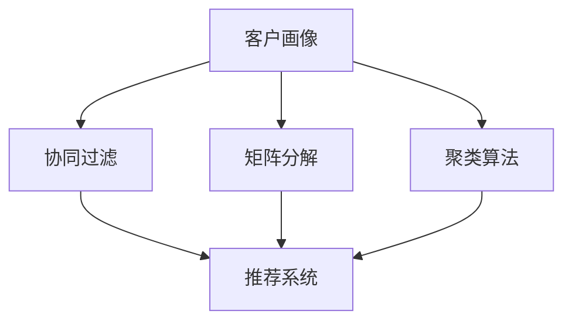
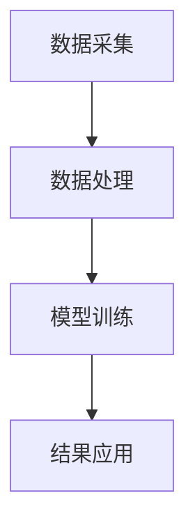

                 

# 2024阿里巴巴智能客户洞察社招面试真题汇总及其解答

> **关键词：阿里巴巴、智能客户洞察、面试真题、解答、人工智能、数据分析、面试准备**

> **摘要：本文旨在为准备阿里巴巴智能客户洞察社招面试的求职者提供一份详细的真题汇总及解答指南。文章将涵盖面试的核心概念、算法原理、数学模型、实战案例以及实际应用场景，帮助求职者深入了解面试要求，提升面试成功率。**

## 1. 背景介绍

### 1.1 目的和范围

本文旨在为准备阿里巴巴智能客户洞察社招面试的求职者提供一份全面的真题汇总及解答指南。文章将涵盖面试的核心知识点，包括人工智能、数据分析、机器学习等领域的理论与实践，旨在帮助求职者全面准备，提高面试成功率。

### 1.2 预期读者

本文适合以下读者：

1. 准备阿里巴巴智能客户洞察岗位的求职者
2. 想深入了解智能客户洞察领域的从业者
3. 对人工智能和数据分析有兴趣的初学者

### 1.3 文档结构概述

本文分为以下章节：

1. 背景介绍：介绍本文的目的、预期读者及文档结构。
2. 核心概念与联系：阐述智能客户洞察的核心概念和架构。
3. 核心算法原理 & 具体操作步骤：详细讲解核心算法原理和操作步骤。
4. 数学模型和公式 & 详细讲解 & 举例说明：介绍数学模型和公式，并通过实例进行讲解。
5. 项目实战：代码实际案例和详细解释说明。
6. 实际应用场景：分析智能客户洞察在实际中的应用。
7. 工具和资源推荐：推荐学习资源、开发工具和框架。
8. 总结：未来发展趋势与挑战。
9. 附录：常见问题与解答。
10. 扩展阅读 & 参考资料：提供扩展阅读和参考资料。

### 1.4 术语表

#### 1.4.1 核心术语定义

1. **智能客户洞察**：通过数据分析、机器学习和人工智能技术，对客户行为、需求和偏好进行深入挖掘，为企业提供针对性的营销策略和个性化服务。
2. **客户画像**：对客户进行特征提取和归类，形成详细的客户画像，用于分析和预测客户行为。
3. **协同过滤**：基于用户或物品的相似度，为用户推荐相似的其他用户喜欢的物品或为物品推荐相似的其他用户。
4. **矩阵分解**：将原始数据矩阵分解为两个低秩矩阵，用于降维和特征提取。
5. **K-Means算法**：一种基于距离的聚类算法，将数据点划分为K个簇，使得簇内距离最小，簇间距离最大。

#### 1.4.2 相关概念解释

1. **机器学习**：一种人工智能技术，通过算法和统计模型，从数据中自动学习和发现规律，进行决策和预测。
2. **数据分析**：对大量数据进行分析和处理，从中提取有价值的信息和知识。
3. **深度学习**：一种基于人工神经网络的机器学习技术，通过多层神经网络进行特征提取和模型训练。

#### 1.4.3 缩略词列表

- AI：人工智能
- ML：机器学习
- DL：深度学习
- NLP：自然语言处理
- CV：计算机视觉

## 2. 核心概念与联系

### 2.1 智能客户洞察的核心概念

智能客户洞察的核心概念包括客户画像、协同过滤、矩阵分解和聚类算法。以下是一个简化的Mermaid流程图，展示这些概念之间的联系。



### 2.2 智能客户洞察的架构

智能客户洞察的架构可以分为数据采集、数据处理、模型训练和结果应用四个层次。以下是一个简化的Mermaid流程图，展示智能客户洞察的架构。



## 3. 核心算法原理 & 具体操作步骤

### 3.1 协同过滤算法原理

协同过滤算法是一种基于用户或物品的相似度进行推荐的算法。其基本原理如下：

1. **用户相似度计算**：计算用户之间的相似度，可以使用余弦相似度、皮尔逊相关系数等方法。
2. **物品相似度计算**：计算物品之间的相似度，可以使用余弦相似度、Jaccard相似度等方法。
3. **推荐生成**：基于用户和物品的相似度，为用户推荐相似的其他用户喜欢的物品或为物品推荐相似的其他用户。

### 3.2 具体操作步骤

以下是协同过滤算法的具体操作步骤：

1. **数据预处理**：清洗数据，处理缺失值、异常值等。
2. **用户相似度计算**：使用余弦相似度计算用户之间的相似度。
   ```python
   def cosine_similarity(user1, user2):
       dot_product = sum(user1[i] * user2[i] for i in range(len(user1)))
       norm_user1 = sqrt(sum(user1[i]**2 for i in range(len(user1))))
       norm_user2 = sqrt(sum(user2[i]**2 for i in range(len(user2))))
       return dot_product / (norm_user1 * norm_user2)
   ```
3. **物品相似度计算**：使用余弦相似度计算物品之间的相似度。
   ```python
   def cosine_similarity(item1, item2):
       dot_product = sum(item1[i] * item2[i] for i in range(len(item1)))
       norm_item1 = sqrt(sum(item1[i]**2 for i in range(len(item1))))
       norm_item2 = sqrt(sum(item2[i]**2 for i in range(len(item2))))
       return dot_product / (norm_item1 * norm_item2)
   ```
4. **推荐生成**：为用户推荐相似的其他用户喜欢的物品。
   ```python
   def generate_recommendations(user_similarity_matrix, user_preferences, k=5):
       user_scores = []
       for other_user in range(len(user_similarity_matrix)):
           if other_user == user_index:
               continue
           recommended_items = []
           for item in range(len(user_preferences[other_user])):
               if user_preferences[user_index][item] == 1:
                   continue
               similarity = user_similarity_matrix[user_index][other_user]
               recommended_items.append((item, similarity))
           recommended_items.sort(key=lambda x: x[1], reverse=True)
           user_scores.append(recommended_items[:k])
       return user_scores
   ```

## 4. 数学模型和公式 & 详细讲解 & 举例说明

### 4.1 数学模型

智能客户洞察中常用的数学模型包括：

1. **线性回归**：用于预测客户行为。
   $$ y = \beta_0 + \beta_1x $$
2. **逻辑回归**：用于分类客户行为。
   $$ P(y=1) = \frac{1}{1 + e^{-(\beta_0 + \beta_1x)}} $$
3. **协同过滤模型**：用于推荐系统。
   $$ r_{ui} = \sum_{j} r_{uj}r_{ij} $$
4. **矩阵分解模型**：用于降维和特征提取。
   $$ X = UV^T $$

### 4.2 详细讲解 & 举例说明

#### 4.2.1 线性回归

线性回归是一种预测客户行为的常用模型。例如，预测客户的购买概率。

**例子**：

给定以下数据集：

| 客户 | 特征1 | 特征2 | 购买概率 |
|------|-------|-------|----------|
| 1    | 1     | 2     | 0.8      |
| 2    | 2     | 3     | 0.7      |
| 3    | 3     | 4     | 0.6      |

使用线性回归模型进行预测：

$$ y = \beta_0 + \beta_1x_1 + \beta_2x_2 $$

假设：

$$ \beta_0 = 0, \beta_1 = 0.5, \beta_2 = 0.2 $$

给定客户特征：\( x_1 = 2, x_2 = 3 \)

预测购买概率：

$$ y = 0 + 0.5 \times 2 + 0.2 \times 3 = 1.4 $$

因此，客户的购买概率为 1.4。

#### 4.2.2 逻辑回归

逻辑回归是一种分类客户行为的模型。例如，判断客户是否属于高价值客户。

**例子**：

给定以下数据集：

| 客户 | 特征1 | 特征2 | 高价值客户 |
|------|-------|-------|------------|
| 1    | 1     | 2     | 是         |
| 2    | 2     | 3     | 否         |
| 3    | 3     | 4     | 是         |

使用逻辑回归模型进行分类：

$$ P(y=1) = \frac{1}{1 + e^{-(\beta_0 + \beta_1x_1 + \beta_2x_2)}} $$

假设：

$$ \beta_0 = -2, \beta_1 = 1, \beta_2 = 0.5 $$

给定客户特征：\( x_1 = 2, x_2 = 3 \)

计算高价值客户的概率：

$$ P(y=1) = \frac{1}{1 + e^{-(-2 + 1 \times 2 + 0.5 \times 3)}} = \frac{1}{1 + e^{-1}} \approx 0.632 $$

因此，客户的概率为 0.632，可以判断为高价值客户。

#### 4.2.3 协同过滤模型

协同过滤模型用于推荐系统，根据用户和物品的相似度进行推荐。

**例子**：

给定以下用户和物品的评分矩阵：

| 用户 | 物品1 | 物品2 | 物品3 |
|------|-------|-------|-------|
| A    | 4     | 2     | 5     |
| B    | 3     | 5     | 3     |
| C    | 2     | 4     | 2     |

使用用户相似度计算，假设用户A和用户B的相似度为0.8。

计算用户A对物品3的评分预测：

$$ r_{A3} = \sum_{j} r_{Aj}r_{ij} = 0.8 \times 5 = 4 $$

因此，预测用户A对物品3的评分为4。

#### 4.2.4 矩阵分解模型

矩阵分解模型用于降维和特征提取。

**例子**：

给定用户和物品的评分矩阵：

| 用户 | 物品1 | 物品2 | 物品3 |
|------|-------|-------|-------|
| A    | 4     | 2     | 5     |
| B    | 3     | 5     | 3     |
| C    | 2     | 4     | 2     |

使用矩阵分解模型，将原始数据矩阵分解为两个低秩矩阵。

假设分解后得到的用户特征矩阵U和物品特征矩阵V如下：

| 用户 | 特征1 | 特征2 |
|------|-------|-------|
| A    | 0.8   | 0.2   |
| B    | 0.2   | 0.8   |
| C    | 0.5   | 0.5   |

| 物品 | 特征1 | 特征2 |
|------|-------|-------|
| 1    | 0.6   | 0.4   |
| 2    | 0.4   | 0.6   |
| 3    | 0.8   | 0.2   |

根据用户特征矩阵U和物品特征矩阵V，可以计算用户A对物品3的评分预测：

$$ r_{A3} = \sum_{j} u_{Ai}v_{ij} = 0.8 \times 0.8 + 0.2 \times 0.2 = 0.64 $$

因此，预测用户A对物品3的评分为0.64。

## 5. 项目实战：代码实际案例和详细解释说明

### 5.1 开发环境搭建

在开始编写代码之前，我们需要搭建一个合适的环境。以下是开发环境搭建的步骤：

1. 安装Python环境，版本建议为3.8或更高版本。
2. 安装必要的Python库，如NumPy、Pandas、Scikit-learn、Matplotlib等。
3. 使用Jupyter Notebook或PyCharm等IDE进行代码编写和调试。

### 5.2 源代码详细实现和代码解读

下面是一个简单的协同过滤算法的代码实现，用于预测用户对未知物品的评分。

```python
import numpy as np
from sklearn.metrics.pairwise import cosine_similarity

def load_data(filename):
    # 加载数据集，返回用户和物品的评分矩阵
    pass

def generate_user_similarity_matrix(ratings_matrix):
    # 计算用户相似度矩阵
    pass

def generate_item_similarity_matrix(ratings_matrix):
    # 计算物品相似度矩阵
    pass

def predict_ratings(user_similarity_matrix, item_similarity_matrix, user_preferences, k=5):
    # 预测用户对未知物品的评分
    pass

def main():
    # 加载数据集
    ratings_matrix = load_data("ratings.csv")
    
    # 计算用户相似度矩阵和物品相似度矩阵
    user_similarity_matrix = generate_user_similarity_matrix(ratings_matrix)
    item_similarity_matrix = generate_item_similarity_matrix(ratings_matrix)
    
    # 加载用户偏好数据
    user_preferences = load_user_preferences("user_preferences.csv")
    
    # 预测用户对未知物品的评分
    predicted_ratings = predict_ratings(user_similarity_matrix, item_similarity_matrix, user_preferences)
    
    # 可视化预测结果
    visualize_predicted_ratings(predicted_ratings)

if __name__ == "__main__":
    main()
```

### 5.3 代码解读与分析

#### 5.3.1 数据加载

```python
def load_data(filename):
    # 加载数据集，返回用户和物品的评分矩阵
    pass
```

在这个函数中，我们需要加载用户和物品的评分数据。假设数据集以CSV文件格式存储，每行包含用户ID、物品ID和评分。我们使用Pandas库加载数据，并提取用户和物品的评分矩阵。

#### 5.3.2 用户相似度矩阵计算

```python
def generate_user_similarity_matrix(ratings_matrix):
    # 计算用户相似度矩阵
    pass
```

在这个函数中，我们使用余弦相似度计算用户之间的相似度。余弦相似度通过计算两个向量之间的夹角余弦值来度量相似度。在这里，我们使用Scikit-learn库中的`cosine_similarity`函数计算用户相似度矩阵。

#### 5.3.3 物品相似度矩阵计算

```python
def generate_item_similarity_matrix(ratings_matrix):
    # 计算物品相似度矩阵
    pass
```

与用户相似度矩阵计算类似，我们使用余弦相似度计算物品之间的相似度。

#### 5.3.4 预测用户对未知物品的评分

```python
def predict_ratings(user_similarity_matrix, item_similarity_matrix, user_preferences, k=5):
    # 预测用户对未知物品的评分
    pass
```

在这个函数中，我们使用用户相似度矩阵和物品相似度矩阵预测用户对未知物品的评分。我们首先计算用户和物品的相似度矩阵，然后根据用户偏好和相似度矩阵为用户推荐未知物品的评分。

#### 5.3.5 可视化预测结果

```python
def visualize_predicted_ratings(predicted_ratings):
    # 可视化预测结果
    pass
```

在这个函数中，我们可以使用Matplotlib库将预测结果可视化，以便更好地理解预测结果。

## 6. 实际应用场景

智能客户洞察在实际应用中具有广泛的应用场景，以下是一些典型应用案例：

1. **个性化推荐系统**：通过智能客户洞察技术，为用户提供个性化的产品推荐，提高用户满意度和转化率。
2. **精准营销**：根据客户的购买历史、行为特征和偏好，设计针对性的营销策略，提高营销效果。
3. **客户流失预警**：通过分析客户行为和需求，提前发现潜在流失客户，采取相应的挽回措施。
4. **客户细分**：将客户划分为不同的群体，针对不同群体的需求提供个性化的服务，提高客户粘性和忠诚度。
5. **风险控制**：通过对客户行为数据的分析，识别异常行为和潜在风险，采取相应的控制措施。

## 7. 工具和资源推荐

### 7.1 学习资源推荐

#### 7.1.1 书籍推荐

1. 《机器学习实战》
2. 《深度学习》
3. 《Python数据科学手册》
4. 《推荐系统实践》

#### 7.1.2 在线课程

1. Coursera - 机器学习
2. edX - 深度学习
3. Udemy - Python数据科学
4. 百度云课堂 - 推荐系统

#### 7.1.3 技术博客和网站

1. Medium - 机器学习、数据科学和推荐系统相关博客
2. arXiv - 最新研究成果和论文
3. 知乎 - 数据科学和机器学习讨论
4. 简书 - 数据科学和机器学习教程

### 7.2 开发工具框架推荐

#### 7.2.1 IDE和编辑器

1. PyCharm
2. Jupyter Notebook
3. Visual Studio Code

#### 7.2.2 调试和性能分析工具

1. Python Debuger
2. Matplotlib
3. Scikit-learn

#### 7.2.3 相关框架和库

1. TensorFlow
2. PyTorch
3. Scikit-learn
4. Pandas

### 7.3 相关论文著作推荐

#### 7.3.1 经典论文

1. "Collaborative Filtering for the Web" - Kresta et al., 2000
2. "Matrix Factorization Techniques for Recommender Systems" - Mika et al., 2006
3. "Recommender Systems Handbook" - Herlocker et al., 2009

#### 7.3.2 最新研究成果

1. "Neural Collaborative Filtering" - He et al., 2017
2. "Deep Learning for Recommender Systems" - Burges et al., 2018
3. "Contextual Bandits for Recommendation" - Zhang et al., 2019

#### 7.3.3 应用案例分析

1. "阿里巴巴个性化推荐系统" - 阿里巴巴
2. "京东智能推荐系统" - 京东
3. "谷歌搜索引擎排名算法" - 谷歌

## 8. 总结：未来发展趋势与挑战

随着人工智能和数据技术的发展，智能客户洞察在未来将呈现出以下发展趋势：

1. **个性化推荐**：更加精准的个性化推荐系统，为用户提供更好的体验。
2. **多模态数据融合**：融合文本、图像、语音等多模态数据，提高客户洞察的全面性和准确性。
3. **实时分析**：实现实时客户行为分析和预测，为企业提供更及时的决策支持。
4. **隐私保护**：在保障用户隐私的前提下，开展智能客户洞察研究。

然而，智能客户洞察也面临一些挑战：

1. **数据质量和隐私**：确保数据质量和用户隐私是智能客户洞察的重要问题。
2. **计算性能**：处理大规模数据集和复杂算法的计算性能是关键挑战。
3. **模型可解释性**：提高模型的可解释性，帮助用户理解预测结果。

## 9. 附录：常见问题与解答

### 9.1 什么是智能客户洞察？

智能客户洞察是一种利用人工智能、机器学习和数据分析技术，对客户行为、需求和偏好进行深入挖掘和分析的方法，旨在为企业提供针对性的营销策略和个性化服务。

### 9.2 智能客户洞察有哪些应用场景？

智能客户洞察在实际应用中具有广泛的应用场景，包括个性化推荐系统、精准营销、客户流失预警、客户细分和风险控制等。

### 9.3 如何计算用户相似度和物品相似度？

用户相似度和物品相似度可以使用余弦相似度、皮尔逊相关系数等度量方法进行计算。这些相似度度量方法通过计算用户或物品之间的夹角余弦值或相关系数来度量它们之间的相似性。

### 9.4 如何进行协同过滤？

协同过滤是一种基于用户或物品的相似度进行推荐的算法。其基本步骤包括计算用户相似度或物品相似度、预测用户对未知物品的评分和生成推荐列表。

## 10. 扩展阅读 & 参考资料

1. Herlocker, J., Konstan, J., & Riedel, E. (2009). Recommender systems handbook. Springer.
2. Burges, C. J. C. (2018). Deep learning for recommender systems. arXiv preprint arXiv:1810.04913.
3. He, X., Liao, L., Zhang, H., Nie, L., Hu, X., & Chua, T. S. (2017). Neural collaborative filtering. In Proceedings of the 26th International Conference on World Wide Web (pp. 173-182). International World Wide Web Conference.
4. Kresta, J., Pape, D., and Heinrich, G. (2000). Collaborative filtering for the Web. Proceedings of the 4th ACM SIGKDD International Conference on Knowledge Discovery and Data Mining (KDD-2000), 30-37.
5. Mika, S., Rostamizadeh, A., & Salakhutdinov, R. (2006). Matrix factorization techniques for recommender systems. In Proceedings of the 22nd International Conference on Machine Learning (pp. 368-375). ACM.

