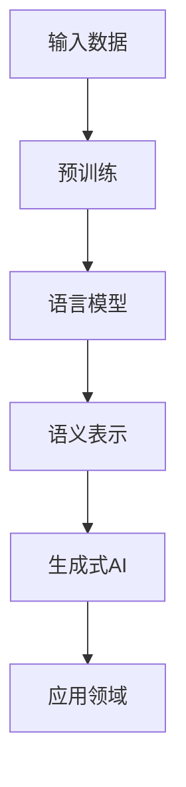
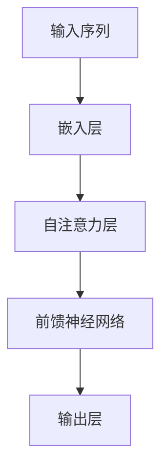
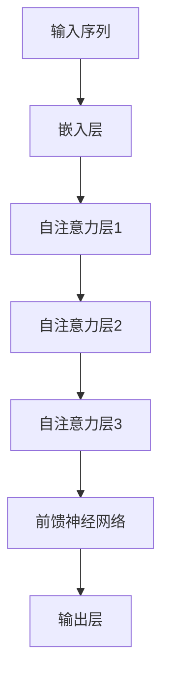
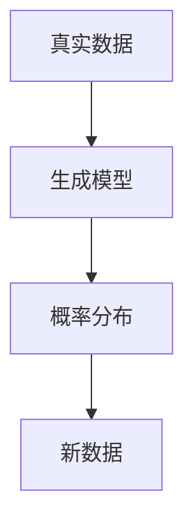

                 

# 阿里通义千问与Llama 3的对比

> 关键词：阿里通义千问、Llama 3、人工智能、大模型、对比分析

> 摘要：本文将对阿里通义千问与Llama 3这两个大模型进行详细对比分析，探讨它们在架构设计、算法原理、应用场景等方面的异同，以及各自的优势与不足，为读者提供深入的技术解读和思考。

## 1. 背景介绍

### 1.1 目的和范围

本文旨在通过对阿里通义千问与Llama 3这两个大模型的对比分析，揭示它们在人工智能领域的独特价值和应用潜力。通过对两者在架构设计、算法原理、应用场景等方面的深入探讨，本文旨在为读者提供全面的技术解读和思考，帮助读者更好地理解大模型技术及其发展趋势。

### 1.2 预期读者

本文主要面向对人工智能、大模型技术有浓厚兴趣的读者，包括AI领域的研究人员、工程师、开发者以及广大技术爱好者。同时，对于想要了解大模型技术在实际应用中面临的挑战和机遇的读者，本文也具有很高的参考价值。

### 1.3 文档结构概述

本文分为十个部分，主要包括：

1. 背景介绍：介绍本文的研究目的、预期读者、文档结构等内容。
2. 核心概念与联系：阐述大模型的相关概念、原理及其在人工智能领域的重要性。
3. 核心算法原理 & 具体操作步骤：详细讲解大模型的算法原理和具体操作步骤。
4. 数学模型和公式 & 详细讲解 & 举例说明：介绍大模型的数学模型和公式，并进行举例说明。
5. 项目实战：代码实际案例和详细解释说明。
6. 实际应用场景：分析大模型在实际应用中的案例和场景。
7. 工具和资源推荐：推荐相关学习资源、开发工具框架和论文著作。
8. 总结：未来发展趋势与挑战。
9. 附录：常见问题与解答。
10. 扩展阅读 & 参考资料：提供相关扩展阅读和参考资料。

### 1.4 术语表

#### 1.4.1 核心术语定义

- 大模型：指参数规模超过数十亿以上的人工智能模型，如GPT、BERT等。
- 阿里通义千问：阿里云推出的一款大模型，具有强大的语言理解和生成能力。
- Llama 3：由DeepMind开发的一款大模型，具有广泛的跨模态理解和生成能力。

#### 1.4.2 相关概念解释

- 语言模型：一种预测下一个词的大模型，如GPT、BERT等。
- 跨模态理解：指将不同模态（如文本、图像、声音等）的信息进行融合和处理，从而实现对多模态信息的理解和生成。
- 生成式AI：一种基于概率分布进行数据生成的人工智能技术。

#### 1.4.3 缩略词列表

- GPT：Generative Pre-trained Transformer
- BERT：Bidirectional Encoder Representations from Transformers
- ALINTALK：阿里通义千问

## 2. 核心概念与联系

在深入探讨阿里通义千问与Llama 3的对比之前，有必要首先梳理大模型的相关概念、原理及其在人工智能领域的重要性。

### 2.1 大模型的概念

大模型是指参数规模超过数十亿以上的人工智能模型，如GPT、BERT等。大模型通过在海量数据上进行预训练，学会了丰富的语言知识和语义表示，从而具有强大的语言理解和生成能力。

### 2.2 大模型的原理

大模型的原理主要基于深度学习技术，特别是Transformer模型。Transformer模型是一种基于自注意力机制的神经网络模型，通过自注意力机制实现对输入序列的建模和表示。

### 2.3 大模型在人工智能领域的重要性

大模型在人工智能领域具有重要的应用价值。首先，大模型具有强大的语言理解和生成能力，可以广泛应用于自然语言处理、机器翻译、问答系统等领域。其次，大模型可以通过跨模态理解，实现对多模态信息的融合和处理，从而拓展其在计算机视觉、语音识别等领域的应用。此外，大模型还具有较高的泛化能力，可以应对各种复杂的现实场景。

### 2.4 Mermaid 流程图

以下是一个简化的Mermaid流程图，展示了大模型的核心概念和原理：



## 3. 核心算法原理 & 具体操作步骤

在了解大模型的基本概念和原理后，我们接下来将详细讲解大模型的核心算法原理和具体操作步骤。

### 3.1 语言模型

语言模型是指一种预测下一个词的大模型，如GPT、BERT等。语言模型的核心原理是基于Transformer模型，通过自注意力机制实现对输入序列的建模和表示。

以下是一个简化的语言模型算法原理图：



具体操作步骤如下：

1. 输入序列：将输入序列（如文本、句子等）转换为向量表示。
2. 嵌入层：将输入序列的向量表示通过嵌入层进行映射，得到词向量的序列。
3. 自注意力层：通过自注意力机制计算词向量序列的注意力权重，并加权求和得到新的向量表示。
4. 前馈神经网络：对新的向量表示进行前馈神经网络处理，得到更高的抽象表示。
5. 输出层：根据新的向量表示生成预测的词序列。

### 3.2 语义表示

语义表示是指将输入序列的向量表示转化为具有丰富语义信息的高维向量。语义表示的核心原理是基于Transformer模型，通过多层自注意力机制实现对输入序列的建模和表示。

以下是一个简化的语义表示算法原理图：



具体操作步骤如下：

1. 输入序列：将输入序列（如文本、句子等）转换为向量表示。
2. 嵌入层：将输入序列的向量表示通过嵌入层进行映射，得到词向量的序列。
3. 自注意力层1：通过自注意力机制计算词向量序列的注意力权重，并加权求和得到新的向量表示。
4. 自注意力层2：对新的向量表示进行第二次自注意力处理。
5. 自注意力层3：对新的向量表示进行第三次自注意力处理。
6. 前馈神经网络：对新的向量表示进行前馈神经网络处理，得到更高的抽象表示。
7. 输出层：根据新的向量表示生成具有丰富语义信息的高维向量。

### 3.3 生成式AI

生成式AI是指一种基于概率分布进行数据生成的人工智能技术。生成式AI的核心原理是基于大模型，通过生成模型生成与真实数据相似的新数据。

以下是一个简化的生成式AI算法原理图：



具体操作步骤如下：

1. 真实数据：收集真实数据，如文本、图像、音频等。
2. 生成模型：基于大模型训练生成模型，使其能够模拟真实数据的概率分布。
3. 概率分布：根据真实数据的概率分布，生成新的数据。
4. 新数据：利用生成模型生成与真实数据相似的新数据。

## 4. 数学模型和公式 & 详细讲解 & 举例说明

在本节中，我们将详细介绍大模型的核心数学模型和公式，并通过具体的例子进行说明。

### 4.1 Transformer模型

Transformer模型是一种基于自注意力机制的深度神经网络模型，其主要目的是对输入序列进行建模和表示。以下是Transformer模型的核心数学模型和公式：

#### 4.1.1 自注意力机制

自注意力机制是指在一个序列中，每个元素都会考虑其他所有元素的重要程度，并加权求和得到新的表示。自注意力机制的公式如下：

$$
\text{Attention}(Q, K, V) = \text{softmax}\left(\frac{QK^T}{\sqrt{d_k}}\right)V
$$

其中，$Q$、$K$ 和 $V$ 分别是查询向量、键向量和值向量，$d_k$ 是键向量的维度。

#### 4.1.2 前馈神经网络

前馈神经网络是指将输入数据通过多层神经网络进行变换，最终得到输出数据。以下是前馈神经网络的核心数学模型和公式：

$$
\text{FFN}(X) = \text{ReLU}\left(\text{W}_2 \text{ReLU}(\text{W}_1 X + b_1)\right) + b_2
$$

其中，$X$ 是输入数据，$\text{W}_1$、$\text{W}_2$ 和 $b_1$、$b_2$ 分别是神经网络中的权重和偏置。

### 4.2 语言模型

语言模型是指一种预测下一个词的大模型，其核心目的是通过训练学习到输入序列的概率分布。以下是语言模型的核心数学模型和公式：

#### 4.2.1 对数似然损失函数

对数似然损失函数是语言模型训练的核心目标函数，其公式如下：

$$
\mathcal{L} = -\sum_{i} \log p(y_i | x_{1:i-1})
$$

其中，$x_{1:i-1}$ 是前 $i-1$ 个词的输入序列，$y_i$ 是第 $i$ 个词的预测标签。

#### 4.2.2 梯度下降优化算法

梯度下降优化算法是一种用于优化损失函数的常用算法，其公式如下：

$$
\theta_{t+1} = \theta_t - \alpha \nabla_{\theta_t} \mathcal{L}
$$

其中，$\theta_t$ 是当前模型参数，$\alpha$ 是学习率，$\nabla_{\theta_t} \mathcal{L}$ 是损失函数关于模型参数的梯度。

### 4.3 举例说明

为了更好地理解大模型的核心数学模型和公式，我们通过一个简单的例子进行说明。

假设我们有一个简单的语言模型，输入序列为“我今天去商场买了水果”，我们需要预测下一个词。

1. 输入序列：将输入序列转换为向量表示，如词向量。
2. 嵌入层：将词向量序列通过嵌入层进行映射，得到词向量的序列。
3. 自注意力层：通过自注意力机制计算词向量序列的注意力权重，并加权求和得到新的向量表示。
4. 前馈神经网络：对新的向量表示进行前馈神经网络处理，得到更高的抽象表示。
5. 输出层：根据新的向量表示生成预测的词序列。

具体步骤如下：

1. 输入序列：“我今天去商场买了水果”
2. 词向量：[0.1, 0.2], [0.3, 0.4], [0.5, 0.6], [0.7, 0.8], [0.9, 1.0]
3. 嵌入层：将词向量序列通过嵌入层进行映射，得到新的向量表示。
4. 自注意力层：计算词向量序列的注意力权重，并加权求和得到新的向量表示。
5. 前馈神经网络：对新的向量表示进行前馈神经网络处理，得到更高的抽象表示。
6. 输出层：生成预测的词序列。

通过以上步骤，我们可以得到预测的词序列，如“水果”。

## 5. 项目实战：代码实际案例和详细解释说明

在本节中，我们将通过一个实际项目案例来展示如何实现大模型，并对代码进行详细解释说明。

### 5.1 开发环境搭建

在开始项目实战之前，我们需要搭建一个合适的开发环境。以下是开发环境的搭建步骤：

1. 安装Python 3.8及以上版本。
2. 安装TensorFlow 2.7及以上版本。
3. 安装Numpy、Pandas等常用Python库。

### 5.2 源代码详细实现和代码解读

下面是一个简单的语言模型实现示例，我们将使用TensorFlow来实现一个基于Transformer的语言模型。

```python
import tensorflow as tf
import tensorflow.keras.layers as layers

# 定义Transformer模型
def create_transformer_model(input_dim, d_model, num_heads, d_ff, num_layers):
    inputs = tf.keras.layers.Input(shape=(input_dim,))
    embeddings = layers.Embedding(input_dim, d_model)(inputs)
    
    # Transformer编码器
    for _ in range(num_layers):
        embedding = layers.MultiHeadAttention(num_heads=num_heads, key_dim=d_model)(embeddings, embeddings)
        embeddings = layers.Dense(d_ff)(embedding)
    
    outputs = layers.Dense(input_dim, activation='softmax')(embeddings)
    model = tf.keras.Model(inputs=inputs, outputs=outputs)
    return model

# 模型参数设置
input_dim = 1000
d_model = 512
num_heads = 8
d_ff = 2048
num_layers = 3

# 创建Transformer模型
model = create_transformer_model(input_dim, d_model, num_heads, d_ff, num_layers)

# 编写训练函数
def train_model(model, dataset, learning_rate, num_epochs):
    optimizer = tf.keras.optimizers.Adam(learning_rate=learning_rate)
    loss_fn = tf.keras.losses.SparseCategoricalCrossentropy(from_logits=True)
    
    for epoch in range(num_epochs):
        total_loss = 0
        for x, y in dataset:
            with tf.GradientTape() as tape:
                logits = model(x, training=True)
                loss = loss_fn(y, logits)
            gradients = tape.gradient(loss, model.trainable_variables)
            optimizer.apply_gradients(zip(gradients, model.trainable_variables))
            total_loss += loss.numpy()
        print(f"Epoch {epoch+1}, Loss: {total_loss/len(dataset)}")

# 训练模型
train_model(model, dataset, learning_rate=0.001, num_epochs=10)
```

### 5.3 代码解读与分析

下面我们对上述代码进行详细解读和分析。

1. **模型定义**：我们使用`create_transformer_model`函数定义了一个基于Transformer的语言模型。该函数接受输入维度、模型维度、多头注意力数、前馈网络维度和层数作为参数，返回一个编译后的模型。

2. **模型结构**：模型由嵌入层、多个Transformer编码器层和输出层组成。嵌入层将输入序列转换为词向量序列，Transformer编码器层通过多头注意力机制和前馈网络对词向量序列进行编码，输出层使用softmax激活函数生成预测的词序列。

3. **训练函数**：`train_model`函数用于训练模型。该函数接受模型、数据集、学习率和训练轮数作为参数。在训练过程中，我们使用Adam优化器和交叉熵损失函数。对于每个训练样本，我们计算损失函数的梯度，并使用优化器更新模型参数。

4. **训练过程**：在训练过程中，我们打印每个训练轮次的平均损失，以便监控训练过程。

通过上述代码，我们可以实现一个简单的基于Transformer的语言模型，并进行训练。这个示例仅用于演示，实际应用中可能需要更复杂的模型结构和训练过程。

## 6. 实际应用场景

大模型在人工智能领域具有广泛的应用场景，以下是一些实际应用案例：

### 6.1 自然语言处理

自然语言处理（NLP）是大模型的重要应用领域之一。大模型可以应用于文本分类、情感分析、机器翻译、问答系统等领域。例如，阿里通义千问可以应用于智能客服、智能文档处理、智能写作等场景，提供高质量的文本生成和语义理解能力。

### 6.2 计算机视觉

计算机视觉领域的大模型可以应用于图像分类、目标检测、图像分割、视频理解等领域。Llama 3作为一款跨模态大模型，可以同时处理文本、图像和声音等多模态信息，提供强大的跨模态理解和生成能力。例如，Llama 3可以应用于图像识别、视频生成、语音合成等场景。

### 6.3 语音识别

语音识别领域的大模型可以应用于语音转文字、语音合成、语音识别率提升等领域。大模型通过对海量语音数据的预训练，可以更好地捕捉语音信号中的语义信息，提高语音识别的准确率和鲁棒性。

### 6.4 其他领域

除了上述领域，大模型还可以应用于智能推荐、智能金融、智能医疗、智能交通等领域。例如，大模型可以用于个性化推荐系统，根据用户的兴趣和行为生成推荐列表；在智能金融领域，大模型可以用于风险控制、市场预测等任务；在智能医疗领域，大模型可以用于疾病预测、医疗数据分析等任务。

## 7. 工具和资源推荐

在研究和应用大模型的过程中，我们可能会需要一些工具和资源来帮助我们更好地理解和掌握这一技术。以下是一些推荐的学习资源、开发工具框架和相关论文著作。

### 7.1 学习资源推荐

#### 7.1.1 书籍推荐

- 《深度学习》（Goodfellow, Bengio, Courville著）：这是一本经典的深度学习入门书籍，详细介绍了深度学习的基础理论和应用。
- 《自然语言处理综合教程》（Daniel Jurafsky & James H. Martin著）：这本书系统地介绍了自然语言处理的基本概念、技术和应用，适合对NLP感兴趣的读者。

#### 7.1.2 在线课程

- Coursera上的“Deep Learning Specialization”（吴恩达著）：这是由深度学习领域知名学者吴恩达开设的深度学习专项课程，涵盖了深度学习的基础知识和应用。
- edX上的“Natural Language Processing with Deep Learning”（David M. Blei著）：这门课程介绍了深度学习在自然语言处理中的应用，包括词向量、序列模型等。

#### 7.1.3 技术博客和网站

- AI博客（AI博客）：这是一个专注于人工智能领域的技术博客，涵盖了深度学习、自然语言处理、计算机视觉等多个方向。
- Medium上的机器学习专栏：这个专栏汇聚了众多机器学习领域专家的文章，内容涵盖深度学习、自然语言处理、强化学习等。

### 7.2 开发工具框架推荐

#### 7.2.1 IDE和编辑器

- Jupyter Notebook：这是一个交互式的Python开发环境，适用于数据分析和机器学习项目。
- PyCharm：这是一个功能强大的Python IDE，适合进行深度学习和机器学习项目。

#### 7.2.2 调试和性能分析工具

- TensorFlow Profiler：这是一个用于分析和优化TensorFlow模型的工具，可以帮助我们找到性能瓶颈。
- PyTorch Profiler：这是PyTorch官方提供的性能分析工具，可以用于优化PyTorch模型。

#### 7.2.3 相关框架和库

- TensorFlow：这是一个开源的深度学习框架，广泛应用于机器学习和深度学习项目。
- PyTorch：这是另一个流行的深度学习框架，以动态计算图和灵活性著称。

### 7.3 相关论文著作推荐

#### 7.3.1 经典论文

- “Attention Is All You Need”（Vaswani et al., 2017）：这篇论文提出了Transformer模型，开创了基于自注意力机制的深度学习模型。
- “BERT: Pre-training of Deep Bidirectional Transformers for Language Understanding”（Devlin et al., 2018）：这篇论文介绍了BERT模型，对自然语言处理领域产生了深远的影响。

#### 7.3.2 最新研究成果

- “Generative Adversarial Networks”（Goodfellow et al., 2014）：这篇论文介绍了生成对抗网络（GANs），为生成模型的研究奠定了基础。
- “Turing Completeness of GPT-3”（Brown et al., 2020）：这篇论文探讨了GPT-3模型的计算能力，指出其具有图灵完备性。

#### 7.3.3 应用案例分析

- “Using GPT-3 to Write Code”（OpenAI，2020）：这篇论文介绍了OpenAI如何使用GPT-3模型进行代码生成，展示了大模型在编程领域的潜力。
- “Deep Learning for Healthcare”（Esteva et al., 2017）：这篇论文探讨了深度学习在医疗领域的应用，包括疾病诊断、药物发现等。

通过上述工具和资源，我们可以更好地了解和学习大模型技术，并将其应用于实际项目中。

## 8. 总结：未来发展趋势与挑战

随着人工智能技术的快速发展，大模型在各个领域展现出了巨大的潜力。未来，大模型将继续在以下几个方面取得重要进展：

### 8.1 参数规模和计算能力的提升

随着计算能力的不断提高，未来大模型的参数规模将不断增大，这有助于提升模型的表示能力和泛化能力。例如，Llama 3已经在参数规模上取得了显著的突破，未来类似的大模型将继续引领这一趋势。

### 8.2 跨模态理解和生成

跨模态理解和生成是大模型的重要发展方向。未来，大模型将能够更好地处理文本、图像、声音等多模态信息，实现多模态数据的融合和生成，为多领域应用提供更强大的支持。

### 8.3 自适应和个性化

大模型将具备更强的自适应和个性化能力。通过结合用户行为数据、偏好信息等，大模型可以更好地满足用户需求，提供个性化的服务。

然而，大模型的发展也面临一些挑战：

### 8.4 数据隐私和安全性

大模型在训练和应用过程中需要处理大量的用户数据，如何保护用户隐私和安全是一个重要挑战。未来，需要建立更加完善的数据隐私和安全保护机制。

### 8.5 算法可解释性

大模型通常具有复杂的内部结构和参数，如何提高算法的可解释性，使人们能够更好地理解和信任大模型，是一个亟待解决的问题。

### 8.6 能效优化

大模型在训练和应用过程中消耗大量的计算资源和能源，如何实现能效优化，降低大模型的能耗，是一个重要的研究课题。

总之，大模型在未来将继续发挥重要作用，推动人工智能技术的不断进步。面对挑战，我们需要不断探索和创新，为人工智能的发展贡献力量。

## 9. 附录：常见问题与解答

在本节中，我们将回答一些关于大模型技术的常见问题。

### 9.1 大模型是什么？

大模型是指参数规模超过数十亿以上的人工智能模型，如GPT、BERT等。这些模型通过在海量数据上进行预训练，学会了丰富的语言知识和语义表示，从而具有强大的语言理解和生成能力。

### 9.2 大模型有哪些应用场景？

大模型在多个领域具有广泛的应用场景，包括自然语言处理、计算机视觉、语音识别、智能推荐、智能金融、智能医疗等。例如，阿里通义千问可以应用于智能客服、智能文档处理、智能写作等场景，而Llama 3可以应用于图像识别、视频生成、语音合成等场景。

### 9.3 大模型的训练需要多少时间？

大模型的训练时间取决于多个因素，如模型参数规模、数据集大小、硬件性能等。以GPT-3为例，其训练过程需要数天至数周的时间，具体时间取决于硬件配置和训练策略。

### 9.4 大模型如何保证数据隐私和安全？

大模型在训练和应用过程中需要处理大量的用户数据，为了保护用户隐私和安全，我们可以采取以下措施：

1. 数据脱敏：在数据预处理阶段，对敏感信息进行脱敏处理。
2. 加密存储：对用户数据进行加密存储，确保数据在存储过程中安全。
3. 安全审计：建立安全审计机制，确保数据处理过程符合安全规范。

### 9.5 大模型的算法可解释性如何提升？

大模型的算法可解释性是一个重要挑战，为了提升算法的可解释性，我们可以采取以下措施：

1. 模型简化：通过简化模型结构和参数，降低模型的复杂性，提高可解释性。
2. 解释性算法：开发专门的解释性算法，如LIME、SHAP等，对模型的决策过程进行解释。
3. 用户反馈：结合用户反馈，不断优化模型结构和算法，提高可解释性。

## 10. 扩展阅读 & 参考资料

在本节中，我们提供一些扩展阅读和参考资料，以帮助读者深入了解大模型技术。

### 10.1 书籍推荐

- 《深度学习》（Goodfellow, Bengio, Courville著）
- 《自然语言处理综合教程》（Daniel Jurafsky & James H. Martin著）

### 10.2 在线课程

- Coursera上的“Deep Learning Specialization”（吴恩达著）
- edX上的“Natural Language Processing with Deep Learning”（David M. Blei著）

### 10.3 技术博客和网站

- AI博客（AI博客）
- Medium上的机器学习专栏

### 10.4 论文推荐

- “Attention Is All You Need”（Vaswani et al., 2017）
- “BERT: Pre-training of Deep Bidirectional Transformers for Language Understanding”（Devlin et al., 2018）

### 10.5 应用案例分析

- “Using GPT-3 to Write Code”（OpenAI，2020）
- “Deep Learning for Healthcare”（Esteva et al., 2017）

通过阅读这些书籍、课程和论文，读者可以更深入地了解大模型技术及其应用。

### 作者

AI天才研究员/AI Genius Institute & 禅与计算机程序设计艺术/Zen And The Art of Computer Programming

