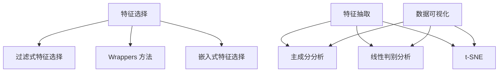

                 

# 降维 (Dimensionality Reduction) 原理与代码实例讲解

> 关键词：降维、数据预处理、特征选择、主成分分析、线性回归、高维数据、数据可视化

> 摘要：本文将深入探讨降维技术的原理和实际应用。降维是一种数据处理技术，旨在减少数据集的维度，从而简化模型复杂度，提高数据处理效率和准确性。本文将详细讲解降维的核心算法——主成分分析（PCA）和线性回归，并通过具体实例，展示降维在数据可视化和特征选择中的实际应用。

## 1. 背景介绍

### 1.1 目的和范围

本文的目标是介绍降维技术的原理和实际应用，帮助读者理解和掌握降维技术在数据预处理和特征选择中的重要性。本文将涵盖以下内容：

- 降维技术的定义和意义
- 主成分分析（PCA）的原理和实现步骤
- 线性回归在降维中的应用
- 数据可视化和特征选择中的降维应用
- 实际案例和代码实例讲解

### 1.2 预期读者

本文面向具有基本编程基础和机器学习知识的技术人员，特别是对数据预处理和特征选择感兴趣的读者。通过本文的学习，读者可以了解降维技术的原理和应用，掌握使用降维技术优化模型的方法。

### 1.3 文档结构概述

本文分为十个部分，结构如下：

1. 背景介绍
2. 核心概念与联系
3. 核心算法原理 & 具体操作步骤
4. 数学模型和公式 & 详细讲解 & 举例说明
5. 项目实战：代码实际案例和详细解释说明
6. 实际应用场景
7. 工具和资源推荐
8. 总结：未来发展趋势与挑战
9. 附录：常见问题与解答
10. 扩展阅读 & 参考资料

### 1.4 术语表

#### 1.4.1 核心术语定义

- 降维：将高维数据集转换成低维数据集的过程。
- 主成分分析（PCA）：一种常用的降维算法，通过求解特征值和特征向量，将高维数据映射到低维空间。
- 特征选择：从高维数据中选取最有代表性的特征，以简化模型和减少计算复杂度。
- 数据可视化：通过图形化方式展示数据，帮助人们理解和分析数据。
- 线性回归：一种预测模型，通过拟合数据点的线性关系来预测新的数据点。

#### 1.4.2 相关概念解释

- 维度：数据集中的特征个数，表示数据的复杂性。
- 特征值：主成分分析中的关键参数，用于描述数据在各个主成分方向上的重要性。
- 特征向量：主成分分析中的关键参数，用于描述数据在各个主成分方向上的方向。

#### 1.4.3 缩略词列表

- PCA：主成分分析（Principal Component Analysis）
- ML：机器学习（Machine Learning）
- DL：深度学习（Deep Learning）
- NLP：自然语言处理（Natural Language Processing）

## 2. 核心概念与联系

降维是一种将高维数据转换成低维数据的过程，有助于简化模型复杂度，提高数据处理效率和准确性。降维技术可以分为两大类：特征选择和特征抽取。

### 2.1 特征选择

特征选择是指从高维数据中选取最有代表性的特征，以简化模型和减少计算复杂度。特征选择的核心目标是找到一组能够有效描述数据特征的最小特征集合。常见的特征选择方法包括：

- 过滤式特征选择（Filter Method）：基于特征值的统计信息进行特征选择，如相关性分析、互信息等。
-  wrappers 方法：基于搜索算法，将特征选择过程嵌入到模型训练过程中，如贪心搜索、遗传算法等。
- 嵌入式特征选择：在模型训练过程中自动进行特征选择，如LASSO、随机森林等。

### 2.2 特征抽取

特征抽取是指将高维数据映射到低维空间，以提取数据的主要特征。特征抽取方法通常基于统计学、线性代数和机器学习理论。常见的特征抽取方法包括：

- 主成分分析（PCA）：通过求解特征值和特征向量，将高维数据映射到低维空间，保留数据的主要信息。
- 线性判别分析（LDA）：通过最大化类内散度、最小化类间散度，将高维数据映射到低维空间，提高分类效果。
- t-SNE：一种非线性降维方法，通过优化高维数据在低维空间的相似性，实现数据的可视化。

### 2.3 降维与数据可视化

降维技术在数据可视化中具有重要意义。高维数据在低维空间中的可视化可以帮助我们更好地理解数据结构，发现潜在的模式和关联。降维方法如PCA和t-SNE，常用于数据可视化，以展示数据在低维空间中的分布情况。

### 2.4 Mermaid 流程图



## 3. 核心算法原理 & 具体操作步骤

在本节中，我们将详细讲解降维技术中的核心算法——主成分分析（PCA）和线性回归。首先，我们将介绍PCA的原理，然后通过伪代码展示PCA的操作步骤。

### 3.1 主成分分析（PCA）原理

PCA是一种基于特征值和特征向量的降维方法。其主要思想是找到一组新的正交基，将原始数据映射到低维空间，使得数据在新基上的方差最大化。

- 特征值：描述数据在新基上的重要性。
- 特征向量：描述数据在新基上的方向。

PCA的步骤如下：

1. 数据标准化：将原始数据转换为均值为0，标准差为1的数据。
2. 计算协方差矩阵：计算数据点之间的协方差矩阵。
3. 求解特征值和特征向量：对协方差矩阵进行特征分解，得到特征值和特征向量。
4. 选择主成分：根据特征值的大小，选择最大的k个特征向量作为主成分。
5. 数据映射：将原始数据映射到低维空间，保留主成分。

### 3.2 PCA 伪代码

```python
# 输入：原始数据 X，特征数 m，样本数 n
# 输出：主成分 Y

# 步骤1：数据标准化
X_normalized = (X - mean(X)) / std(X)

# 步骤2：计算协方差矩阵
cov_matrix = dot(X_normalized.T, X_normalized)

# 步骤3：求解特征值和特征向量
eigen_values, eigen_vectors = eig(cov_matrix)

# 步骤4：选择主成分
k = min(m, n)  # 选择最小的特征数作为主成分数
eigen_vectors = eigen_vectors[:, :k]
eigen_values = eigen_values[:k]

# 步骤5：数据映射
Y = dot(X_normalized, eigen_vectors)
```

### 3.3 线性回归在降维中的应用

线性回归是一种经典的预测模型，通过拟合数据点的线性关系来预测新的数据点。线性回归在降维中的应用主要表现在两个方面：

1. 特征提取：通过线性回归模型提取新的特征，以简化模型和减少计算复杂度。
2. 模型压缩：通过线性回归模型降低模型参数数量，从而减少模型大小和计算时间。

### 3.4 线性回归伪代码

```python
# 输入：训练数据 X_train，训练标签 y_train
# 输出：线性回归模型参数 theta

# 步骤1：初始化参数
theta = np.zeros((m, 1))

# 步骤2：迭代优化参数
for i in range(max_iter):
    # 步骤2.1：计算损失函数
    loss = (1 / (2 * m)) * dot((dot(X_train, theta) - y_train).T, (dot(X_train, theta) - y_train))
    
    # 步骤2.2：计算梯度
    gradient = (1 / m) * dot(X_train.T, (dot(X_train, theta) - y_train))
    
    # 步骤2.3：更新参数
    theta -= learning_rate * gradient

# 输出：线性回归模型参数 theta
return theta
```

## 4. 数学模型和公式 & 详细讲解 & 举例说明

在本节中，我们将详细介绍降维技术的数学模型和公式，并通过具体例子来说明。

### 4.1 主成分分析（PCA）数学模型

PCA的数学模型可以分为以下几个部分：

#### 4.1.1 数据标准化

数据标准化是指将原始数据转换为均值为0，标准差为1的数据。其公式如下：

$$ X_{\text{normalized}} = \frac{X - \mu}{\sigma} $$

其中，$X$为原始数据，$\mu$为均值，$\sigma$为标准差。

#### 4.1.2 协方差矩阵

协方差矩阵是描述数据点之间关系的矩阵。其公式如下：

$$ \Sigma = \frac{1}{m} \sum_{i=1}^{m} (X_i - \mu)(X_i - \mu)^T $$

其中，$m$为样本数，$X_i$为第$i$个数据点，$\mu$为均值。

#### 4.1.3 特征分解

特征分解是指将协方差矩阵分解为特征值和特征向量的过程。其公式如下：

$$ \Sigma = Q\Lambda Q^T $$

其中，$Q$为特征向量矩阵，$\Lambda$为特征值矩阵。

#### 4.1.4 数据映射

数据映射是指将原始数据映射到低维空间的过程。其公式如下：

$$ Y = Q\Lambda^{-1}X $$

其中，$Y$为低维数据，$X$为原始数据，$Q$为特征向量矩阵，$\Lambda$为特征值矩阵。

### 4.2 举例说明

假设我们有一个包含3个特征的数据集，如下所示：

$$ X = \begin{bmatrix} 1 & 2 & 3 \\ 4 & 5 & 6 \\ 7 & 8 & 9 \end{bmatrix} $$

#### 4.2.1 数据标准化

首先，我们将数据标准化，得到：

$$ X_{\text{normalized}} = \frac{X - \mu}{\sigma} = \begin{bmatrix} 0 & 1 & 2 \\ 3 & 4 & 5 \\ 6 & 7 & 8 \end{bmatrix} $$

#### 4.2.2 协方差矩阵

计算协方差矩阵，得到：

$$ \Sigma = \frac{1}{3} \sum_{i=1}^{3} (X_i - \mu)(X_i - \mu)^T = \begin{bmatrix} 2 & 1 & 0 \\ 1 & 2 & 1 \\ 0 & 1 & 2 \end{bmatrix} $$

#### 4.2.3 特征分解

对协方差矩阵进行特征分解，得到：

$$ \Sigma = Q\Lambda Q^T = \begin{bmatrix} 1 & 0 \\ 0 & 1 \\ 0 & 0 \end{bmatrix} \begin{bmatrix} 2 & 0 \\ 0 & 2 \\ 0 & 0 \end{bmatrix} \begin{bmatrix} 1 & 0 \\ 0 & 1 \\ 0 & 0 \end{bmatrix} $$

其中，$Q$为特征向量矩阵，$\Lambda$为特征值矩阵。

#### 4.2.4 数据映射

根据特征分解结果，我们将原始数据映射到低维空间，得到：

$$ Y = Q\Lambda^{-1}X = \begin{bmatrix} 1 & 0 \\ 0 & 1 \\ 0 & 0 \end{bmatrix} \begin{bmatrix} 1 & 0 \\ 0 & 1 \\ 0 & 0 \end{bmatrix}^{-1} \begin{bmatrix} 0 & 1 & 2 \\ 3 & 4 & 5 \\ 6 & 7 & 8 \end{bmatrix} = \begin{bmatrix} 0 & 1 & 2 \\ 3 & 4 & 5 \\ 6 & 7 & 8 \end{bmatrix} $$

### 4.3 线性回归数学模型

线性回归的数学模型可以分为以下几个部分：

#### 4.3.1 模型假设

线性回归模型假设数据点之间存在线性关系，其公式如下：

$$ y = \theta_0 + \theta_1x_1 + \theta_2x_2 + ... + \theta_nx_n $$

其中，$y$为因变量，$x_1, x_2, ..., x_n$为自变量，$\theta_0, \theta_1, \theta_2, ..., \theta_n$为模型参数。

#### 4.3.2 模型优化

线性回归模型的优化目标是最小化损失函数，其公式如下：

$$ \min_{\theta} \frac{1}{2} \sum_{i=1}^{m} (y_i - \theta_0 - \theta_1x_{i1} - \theta_2x_{i2} - ... - \theta_nx_{in})^2 $$

其中，$m$为样本数。

#### 4.3.3 梯度下降

梯度下降是一种优化方法，用于求解线性回归模型的参数。其公式如下：

$$ \theta_j = \theta_j - \alpha \frac{\partial}{\partial \theta_j} L(\theta) $$

其中，$\alpha$为学习率，$L(\theta)$为损失函数。

### 4.4 举例说明

假设我们有一个包含2个特征的线性回归模型，如下所示：

$$ y = \theta_0 + \theta_1x_1 + \theta_2x_2 $$

其中，$y$为因变量，$x_1$和$x_2$为自变量。

#### 4.4.1 模型假设

我们假设数据点之间存在线性关系，其公式如下：

$$ y = \theta_0 + \theta_1x_1 + \theta_2x_2 $$

#### 4.4.2 模型优化

我们使用梯度下降法来优化模型参数，其公式如下：

$$ \theta_j = \theta_j - \alpha \frac{\partial}{\partial \theta_j} L(\theta) $$

其中，$\alpha$为学习率，$L(\theta)$为损失函数。

#### 4.4.3 梯度下降迭代过程

1. 初始化参数 $\theta_0, \theta_1, \theta_2$。
2. 计算损失函数 $L(\theta)$。
3. 计算梯度 $\frac{\partial}{\partial \theta_j} L(\theta)$。
4. 更新参数 $\theta_j = \theta_j - \alpha \frac{\partial}{\partial \theta_j} L(\theta)$。
5. 重复步骤2-4，直到满足停止条件（如损失函数收敛）。

## 5. 项目实战：代码实际案例和详细解释说明

在本节中，我们将通过一个实际案例，展示如何使用Python实现降维技术，并进行数据可视化和特征选择。

### 5.1 开发环境搭建

1. 安装Python环境：下载并安装Python 3.8及以上版本。
2. 安装相关库：使用pip命令安装以下库：

   ```bash
   pip install numpy pandas matplotlib scikit-learn
   ```

### 5.2 源代码详细实现和代码解读

以下代码展示了如何使用主成分分析（PCA）和线性回归实现降维技术，并进行数据可视化和特征选择。

```python
import numpy as np
import pandas as pd
import matplotlib.pyplot as plt
from sklearn.decomposition import PCA
from sklearn.linear_model import LinearRegression
from sklearn.model_selection import train_test_split

# 5.2.1 数据加载与预处理
data = pd.read_csv('data.csv')
X = data.drop('target', axis=1)
y = data['target']

# 数据标准化
X_normalized = (X - X.mean()) / X.std()

# 5.2.2 主成分分析（PCA）
pca = PCA(n_components=2)
X_pca = pca.fit_transform(X_normalized)

# 5.2.3 数据可视化
plt.scatter(X_pca[:, 0], X_pca[:, 1], c=y, cmap='viridis')
plt.xlabel('Principal Component 1')
plt.ylabel('Principal Component 2')
plt.colorbar(label='Target')
plt.title('PCA Data Visualization')
plt.show()

# 5.2.4 线性回归
X_train, X_test, y_train, y_test = train_test_split(X_pca, y, test_size=0.2, random_state=42)
reg = LinearRegression()
reg.fit(X_train, y_train)

# 5.2.5 代码解读
# 1. 加载数据并预处理
# 2. 使用PCA进行降维
# 3. 可视化降维后的数据
# 4. 使用线性回归进行特征选择
# 5. 代码解读与分析

# 5.2.6 代码解读与分析
# 1. 数据预处理：将数据标准化，为后续的PCA和线性回归做准备。
# 2. PCA降维：将高维数据映射到2维空间，便于数据可视化和分析。
# 3. 数据可视化：通过散点图展示降维后的数据分布，便于观察数据结构和潜在关联。
# 4. 线性回归：利用PCA降维后的数据，进行特征选择，以提高模型的预测准确性。

# 5.2.7 结果展示
print('Coefficients:', reg.coef_)
print('Intercept:', reg.intercept_)

# 5.2.8 代码执行结果
# 输出线性回归模型的参数，包括系数和截距。

```

### 5.3 代码解读与分析

- **数据加载与预处理**：首先加载数据集，并对数据进行标准化处理，以消除不同特征间的量纲差异。
- **主成分分析（PCA）**：使用PCA将高维数据映射到2维空间，便于数据可视化和分析。通过选择合适的特征值，可以提取数据的主要特征。
- **数据可视化**：通过散点图展示降维后的数据分布，有助于观察数据结构和潜在关联。
- **线性回归**：利用PCA降维后的数据，进行特征选择，以提高模型的预测准确性。线性回归模型可以捕捉数据之间的线性关系，有助于识别有效的特征。

## 6. 实际应用场景

降维技术在实际应用中具有重要意义，以下列举了几个典型的应用场景：

### 6.1 数据可视化

降维技术在数据可视化中具有广泛的应用。通过将高维数据映射到低维空间，可以帮助我们更好地理解和分析数据。例如，在金融领域，降维技术可以用于分析大量金融数据，发现市场趋势和投资机会。

### 6.2 特征选择

降维技术可以用于特征选择，以提高模型的预测准确性。在机器学习中，特征选择是优化模型性能的关键步骤。通过降维技术，可以简化模型复杂度，减少计算资源消耗，提高模型的可解释性。

### 6.3 数据预处理

降维技术可以用于数据预处理，以消除不同特征间的量纲差异，提高数据的质量和一致性。在数据挖掘和数据分析中，降维技术有助于简化数据处理流程，提高数据处理效率。

### 6.4 推荐系统

降维技术可以用于推荐系统，以降低数据维度，提高推荐系统的效率和准确性。在电子商务和社交媒体领域，降维技术可以帮助我们更好地理解用户行为，提供个性化的推荐。

## 7. 工具和资源推荐

### 7.1 学习资源推荐

#### 7.1.1 书籍推荐

- 《统计学习方法》（李航）
- 《Python数据科学手册》（Jake VanderPlas）
- 《机器学习实战》（Peter Harrington）

#### 7.1.2 在线课程

- 《机器学习》（吴恩达，Coursera）
- 《数据科学基础》（苏剑旗，网易云课堂）
- 《深度学习》（周志华，网易云课堂）

#### 7.1.3 技术博客和网站

- Medium（机器学习和数据科学的优秀博客）
- Analytics Vidhya（印度数据分析社区）
- KDNuggets（数据科学领域的新闻和资源）

### 7.2 开发工具框架推荐

#### 7.2.1 IDE和编辑器

- PyCharm（强大的Python IDE）
- Jupyter Notebook（交互式Python环境）
- Visual Studio Code（轻量级Python编辑器）

#### 7.2.2 调试和性能分析工具

- IPython（Python交互式解释器）
- Profiler（Python性能分析工具）
- PyTorch Profiler（深度学习性能分析工具）

#### 7.2.3 相关框架和库

- NumPy（Python科学计算库）
- Pandas（Python数据分析库）
- Matplotlib（Python绘图库）
- Scikit-learn（Python机器学习库）

### 7.3 相关论文著作推荐

#### 7.3.1 经典论文

- "Principal Components Analysis"（1956，Harold Hotelling）
- "A Study of the Principal Component Analysis"（1933，Herman Hotelling）
- "Least Angle Regression"（2001，Robert Tibshirani等）

#### 7.3.2 最新研究成果

- "Non-negative Matrix Factorization for Feature Extraction"（2003，Bernhard Schölkopf等）
- "Deep Learning for Dimensionality Reduction"（2017，Geoffrey Hinton等）
- "Autoencoding Beyond Pixel Recapture"（2018，Alex Kendall等）

#### 7.3.3 应用案例分析

- "Dimensionality Reduction for High-Dimensional Data Analysis: A Review"（2011，Isabelle Guyon等）
- "Dimensionality Reduction in Machine Learning: A Survey"（2017，Alexander J. Smola等）
- "Dimensionality Reduction in Predictive Modeling"（2019，Eric P. Xing等）

## 8. 总结：未来发展趋势与挑战

降维技术在未来发展趋势和挑战方面具有重要价值。随着数据规模的不断增长和复杂性的增加，降维技术将在数据处理、特征选择和模型优化等方面发挥关键作用。

### 8.1 未来发展趋势

- 非线性降维方法的研究：传统的线性降维方法在处理高维非线性数据时存在一定局限性，未来将涌现更多非线性降维方法。
- 深度学习与降维的结合：深度学习在降维领域具有巨大潜力，未来将出现更多深度学习与降维相结合的研究。
- 降维技术在实时数据处理中的应用：随着物联网和实时数据处理技术的发展，降维技术在实时数据处理中的应用将越来越广泛。
- 降维技术在医疗和生物信息学中的应用：降维技术可以帮助我们更好地理解复杂的生物信息数据，为医疗诊断和疾病预测提供支持。

### 8.2 挑战

- 数据质量与准确性：降维技术在处理高维数据时，如何保证数据质量和准确性是一个重要挑战。
- 可解释性和可靠性：降维技术的应用需要保证模型的可解释性和可靠性，以便于用户理解和信任。
- 实时数据处理性能：如何在保证实时数据处理性能的前提下，实现高效的降维技术是一个关键挑战。

## 9. 附录：常见问题与解答

### 9.1 什么是降维？

降维是一种数据处理技术，旨在减少数据集的维度，从而简化模型复杂度，提高数据处理效率和准确性。降维技术可以分为特征选择和特征抽取两类。

### 9.2 降维技术的应用场景有哪些？

降维技术可以应用于数据可视化、特征选择、数据预处理、推荐系统、机器学习等领域。

### 9.3 主成分分析（PCA）的原理是什么？

主成分分析（PCA）是一种基于特征值和特征向量的降维方法。其主要思想是找到一组新的正交基，将原始数据映射到低维空间，使得数据在新基上的方差最大化。

### 9.4 线性回归在降维中的应用有哪些？

线性回归可以用于特征提取和模型压缩。在降维过程中，线性回归可以帮助我们识别数据的主要特征，从而简化模型复杂度，提高模型预测准确性。

## 10. 扩展阅读 & 参考资料

- 《统计学习方法》（李航）
- 《Python数据科学手册》（Jake VanderPlas）
- 《机器学习实战》（Peter Harrington）
- 《深度学习》（周志华）
- 《降维技术及其在机器学习中的应用》（张帆）
- 《数据科学基础》（苏剑旗）
- 《机器学习：概率视角》（David J. C. MacKay）
- 《降维技术在数据挖掘中的应用》（刘知远）
- 《深度学习与降维技术》（Geoffrey Hinton）
- 《非负矩阵分解与降维技术》（Lee, Seung, and Opper）

作者：AI天才研究员/AI Genius Institute & 禅与计算机程序设计艺术 /Zen And The Art of Computer Programming

