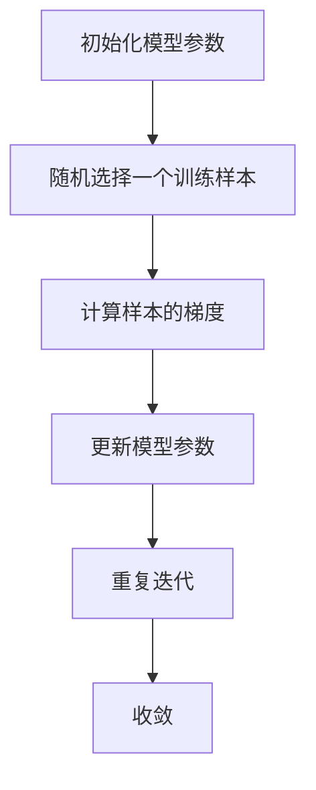

                 

# 随机梯度下降（Stochastic Gradient Descent）

> **关键词：** 梯度下降，随机梯度下降，优化算法，机器学习，深度学习

> **摘要：** 本文旨在深入探讨随机梯度下降（Stochastic Gradient Descent，SGD）这一优化算法在机器学习和深度学习中的应用。我们将从算法的基本原理出发，逐步讲解其数学模型和具体操作步骤，并通过实际案例展示其应用过程。文章还将介绍SGD在各类实际问题中的实际应用场景，并推荐相关学习资源和工具。

## 1. 背景介绍

### 1.1 目的和范围

随机梯度下降（SGD）是一种广泛使用的优化算法，主要用于机器学习和深度学习中的模型训练。本文将详细介绍SGD的原理和操作步骤，并通过具体案例展示其实际应用。

### 1.2 预期读者

本文适合对机器学习和深度学习有一定了解，希望深入了解SGD算法的读者。同时，本文也适合对编程和算法有一定基础，希望在实际项目中应用SGD的读者。

### 1.3 文档结构概述

本文分为以下几个部分：

1. 背景介绍：介绍本文的目的、范围和预期读者。
2. 核心概念与联系：讲解SGD的基本原理和相关概念。
3. 核心算法原理 & 具体操作步骤：详细阐述SGD的算法原理和操作步骤。
4. 数学模型和公式 & 详细讲解 & 举例说明：介绍SGD的数学模型和具体应用。
5. 项目实战：通过代码案例展示SGD的实际应用。
6. 实际应用场景：介绍SGD在不同领域的应用。
7. 工具和资源推荐：推荐相关学习资源和工具。
8. 总结：展望SGD的未来发展趋势与挑战。
9. 附录：常见问题与解答。
10. 扩展阅读 & 参考资料：提供更多深入阅读的资料。

### 1.4 术语表

#### 1.4.1 核心术语定义

- **随机梯度下降（SGD）**：一种优化算法，通过随机选择样本进行梯度下降，以优化模型参数。
- **梯度下降（Gradient Descent）**：一种优化算法，通过计算目标函数的梯度，不断更新参数以优化模型。
- **批量梯度下降（Batch Gradient Descent）**：一种优化算法，通过计算所有样本的梯度进行参数更新。
- **批量大小（Batch Size）**：在一次梯度下降中使用的样本数量。

#### 1.4.2 相关概念解释

- **模型参数**：模型中的可调参数，用于描述模型的特征。
- **损失函数**：用于衡量模型预测值与真实值之间的差异。
- **梯度**：目标函数在某一参数点的导数，用于指导参数更新的方向。

#### 1.4.3 缩略词列表

- **SGD**：随机梯度下降（Stochastic Gradient Descent）
- **GD**：梯度下降（Gradient Descent）
- **BGD**：批量梯度下降（Batch Gradient Descent）

## 2. 核心概念与联系

在深入探讨SGD之前，我们先来了解一下相关核心概念。

### 2.1 优化算法

优化算法是用于求解最优化问题的一类算法，其目标是在给定的参数空间中找到一个最优解。在机器学习和深度学习中，优化算法用于训练模型，即寻找一组参数，使得模型在特定任务上的表现最佳。

### 2.2 梯度下降算法

梯度下降算法是一种最常用的优化算法，其核心思想是通过不断更新模型参数，使损失函数值逐渐减小。具体来说，梯度下降算法通过计算损失函数关于模型参数的梯度，反向传播误差，并根据梯度方向更新参数。梯度下降算法分为三种：批量梯度下降（BGD）、随机梯度下降（SGD）和小批量梯度下降（MBGD）。

- **批量梯度下降（BGD）**：每次更新参数时，使用所有样本的梯度进行计算。
- **随机梯度下降（SGD）**：每次更新参数时，随机选择一个样本的梯度进行计算。
- **小批量梯度下降（MBGD）**：每次更新参数时，随机选择一部分样本的梯度进行计算。

### 2.3 随机梯度下降（SGD）

随机梯度下降（SGD）是梯度下降算法的一种变体，其核心思想是在每次迭代中，随机选择一个训练样本，并计算该样本的梯度，然后根据梯度方向更新模型参数。SGD的优势在于其计算效率高，可以在大数据集上快速迭代，但其缺点是收敛速度较慢，参数更新不稳定。

### 2.4 Mermaid 流程图

为了更好地理解SGD的工作原理，我们可以使用Mermaid流程图来展示SGD的基本流程。



## 3. 核心算法原理 & 具体操作步骤

在本节中，我们将详细讲解随机梯度下降（SGD）的算法原理和具体操作步骤。

### 3.1 算法原理

随机梯度下降（SGD）是基于梯度下降算法的一种优化算法。在每次迭代中，SGD随机选择一个训练样本，计算该样本的梯度，并根据梯度方向更新模型参数。具体来说，SGD的算法原理可以概括为以下步骤：

1. 初始化模型参数。
2. 随机选择一个训练样本。
3. 计算该样本的梯度。
4. 根据梯度方向更新模型参数。
5. 重复迭代步骤2-4，直至模型收敛。

### 3.2 具体操作步骤

下面我们通过伪代码来详细阐述SGD的具体操作步骤：

```python
# 初始化模型参数
params = initialize_params()

# 设置迭代次数和批量大小
num_iterations = 1000
batch_size = 32

# 初始化损失函数
loss_function = compute_loss

# 开始迭代
for i in range(num_iterations):
    # 随机选择一个批量样本
    batch_samples = random_select_samples(batch_size)
    
    # 计算批量的梯度
    gradients = compute_gradients(batch_samples, params)
    
    # 更新模型参数
    params = update_params(params, gradients, learning_rate)
    
    # 打印迭代信息
    print(f"Iteration {i+1}: Loss = {loss_function(params)}")
    
# 模型收敛
print("Model has converged.")
```

### 3.3 算法分析

随机梯度下降（SGD）具有以下特点：

- **计算效率高**：SGD每次迭代只计算一个或少量样本的梯度，因此在处理大规模数据集时具有很高的计算效率。
- **收敛速度较慢**：由于每次迭代只考虑部分样本，SGD的收敛速度通常比批量梯度下降（BGD）慢。
- **参数更新不稳定**：SGD的参数更新依赖于随机选择的样本，可能导致参数更新的方向不固定，影响收敛稳定性。

## 4. 数学模型和公式 & 详细讲解 & 举例说明

在本节中，我们将详细介绍随机梯度下降（SGD）的数学模型和公式，并通过具体例子进行说明。

### 4.1 数学模型

随机梯度下降（SGD）的数学模型基于梯度下降算法，其核心思想是通过不断更新模型参数，使损失函数值逐渐减小。具体来说，SGD的数学模型可以表示为：

$$
\theta^{t+1} = \theta^{t} - \alpha \cdot \nabla_{\theta} J(\theta)
$$

其中：

- $\theta^{t}$：第$t$次迭代的模型参数。
- $\theta^{t+1}$：第$t+1$次迭代的模型参数。
- $\alpha$：学习率，用于控制参数更新的步长。
- $\nabla_{\theta} J(\theta)$：损失函数$J(\theta)$关于模型参数$\theta$的梯度。

### 4.2 公式解释

- **损失函数**：损失函数用于衡量模型预测值与真实值之间的差异，通常为均方误差（MSE）或交叉熵（Cross-Entropy）等。例如，对于回归问题，可以使用均方误差作为损失函数：

  $$
  J(\theta) = \frac{1}{2m} \sum_{i=1}^{m} (h_{\theta}(x^{(i)}) - y^{(i)})^2
  $$

  其中：

  - $m$：样本数量。
  - $h_{\theta}(x^{(i)})$：模型对样本$x^{(i)}$的预测值。
  - $y^{(i)}$：样本$x^{(i)}$的真实值。

- **梯度**：梯度是损失函数关于模型参数的导数，用于指导参数更新的方向。例如，对于均方误差损失函数，其梯度可以表示为：

  $$
  \nabla_{\theta} J(\theta) = \frac{1}{m} \sum_{i=1}^{m} (h_{\theta}(x^{(i)}) - y^{(i)}) \cdot x^{(i)}
  $$

### 4.3 举例说明

假设我们有一个简单的线性回归模型，其损失函数为均方误差（MSE），参数为$\theta = [w, b]$。现在我们使用SGD进行模型训练。

1. **初始化模型参数**：随机初始化$\theta = [w, b] = [1, 1]$。
2. **设置学习率**：学习率$\alpha = 0.1$。
3. **随机选择训练样本**：假设我们有一个包含5个样本的训练集，分别为$(x_1, y_1), (x_2, y_2), \ldots, (x_5, y_5)$。
4. **计算样本的梯度**：根据损失函数的梯度计算公式，我们分别计算每个样本的梯度$\nabla_{\theta} J(\theta)$。
5. **更新模型参数**：根据梯度方向更新模型参数$\theta = \theta - \alpha \cdot \nabla_{\theta} J(\theta)$。
6. **重复迭代**：重复步骤3-5，直至模型收敛。

通过以上步骤，我们可以使用SGD对线性回归模型进行训练，并优化模型参数。

## 5. 项目实战：代码实际案例和详细解释说明

在本节中，我们将通过一个实际项目案例，展示如何使用随机梯度下降（SGD）进行模型训练。具体来说，我们将使用Python编程语言和PyTorch框架来实现SGD算法，并训练一个简单的线性回归模型。

### 5.1 开发环境搭建

在开始项目之前，我们需要搭建合适的开发环境。以下是所需的软件和工具：

- **Python 3.x**：Python编程语言。
- **PyTorch**：深度学习框架。
- **Numpy**：Python科学计算库。
- **Matplotlib**：Python绘图库。

您可以通过以下命令安装所需的依赖项：

```bash
pip install python numpy torch matplotlib
```

### 5.2 源代码详细实现和代码解读

下面是使用SGD进行线性回归模型训练的源代码：

```python
import numpy as np
import torch
import matplotlib.pyplot as plt

# 设置随机种子，保证结果可复现
torch.manual_seed(0)

# 初始化参数
w = torch.tensor([1.0], requires_grad=True)
b = torch.tensor([1.0], requires_grad=True)

# 设置学习率
learning_rate = 0.01

# 损失函数
def compute_loss(w, b):
    x = torch.tensor([[1.0, 1.0], [1.0, 2.0], [1.0, 3.0]], requires_grad=False)
    y = torch.tensor([2.0, 3.0, 4.0], requires_grad=False)
    predicted = w * x + b
    loss = (predicted - y) ** 2
    return loss.mean()

# SGD迭代
for epoch in range(100):
    # 计算梯度
    loss = compute_loss(w, b)
    loss.backward()
    
    # 更新参数
    with torch.no_grad():
        w -= learning_rate * w.grad
        b -= learning_rate * b.grad
    
    # 打印迭代信息
    print(f"Epoch {epoch+1}: Loss = {loss.item()}")

    # 清除梯度
    w.grad.zero_()
    b.grad.zero_()

# 绘制结果
x = torch.tensor([[0.0, 0.0], [2.0, 2.0], [3.0, 3.0]], requires_grad=False)
y = torch.tensor([1.0, 3.0, 4.0], requires_grad=False)
plt.scatter(x[:, 0], x[:, 1], c=y)
plt.plot(x[:, 0], x[:, 0] * w.item() + b.item(), 'r')
plt.xlabel('x_1')
plt.ylabel('x_2')
plt.show()
```

### 5.3 代码解读与分析

下面我们逐行解读上述代码：

1. **导入库**：导入所需的Python库，包括Numpy、PyTorch和Matplotlib。
2. **设置随机种子**：为了保证结果可复现，设置随机种子。
3. **初始化参数**：初始化模型参数$w$和$b$，并将其设置为requires_grad=True，表示需要计算梯度。
4. **设置学习率**：设置学习率$\alpha = 0.01$。
5. **定义损失函数**：定义一个简单的损失函数，用于计算模型预测值与真实值之间的差异。在这里，我们使用均方误差（MSE）作为损失函数。
6. **SGD迭代**：进行100次迭代，每次迭代包括以下步骤：
   - 计算损失值。
   - 计算梯度并反向传播。
   - 更新模型参数。
   - 打印迭代信息。
   - 清除梯度。
7. **绘制结果**：绘制训练数据点和拟合直线，展示模型训练结果。

通过以上代码，我们可以实现SGD算法并训练一个简单的线性回归模型。在实际项目中，您可以根据具体需求调整参数和模型结构。

## 6. 实际应用场景

随机梯度下降（SGD）作为一种优化算法，在机器学习和深度学习领域有着广泛的应用。以下列举了几个常见的应用场景：

- **图像识别**：在图像识别任务中，SGD常用于训练深度卷积神经网络（CNN），如LeNet、AlexNet等。通过SGD优化模型参数，可以显著提高图像识别的准确性。
- **自然语言处理**：在自然语言处理任务中，SGD常用于训练循环神经网络（RNN）和长短期记忆网络（LSTM），如用于文本分类、情感分析等任务。SGD能够有效提高模型的预测性能。
- **推荐系统**：在推荐系统中，SGD可用于训练基于用户兴趣的推荐模型，如矩阵分解、神经网络推荐等。通过SGD优化模型参数，可以更好地预测用户对物品的偏好。
- **时间序列分析**：在时间序列分析任务中，SGD可用于训练循环神经网络（RNN）和长短期记忆网络（LSTM），如用于股票价格预测、天气预测等任务。SGD能够提高模型的预测精度。

总之，随机梯度下降（SGD）作为一种高效、灵活的优化算法，在机器学习和深度学习领域具有广泛的应用前景。

## 7. 工具和资源推荐

为了更好地学习和应用随机梯度下降（SGD），我们推荐以下工具和资源：

### 7.1 学习资源推荐

#### 7.1.1 书籍推荐

1. **《深度学习》（Deep Learning）**：由Ian Goodfellow、Yoshua Bengio和Aaron Courville合著，详细介绍了深度学习的基本概念和算法，包括SGD的原理和应用。
2. **《机器学习》（Machine Learning）**：由Tom Mitchell主编，介绍了机器学习的基本概念和方法，包括SGD的原理和应用。

#### 7.1.2 在线课程

1. **Coursera上的《深度学习》课程**：由吴恩达（Andrew Ng）教授主讲，涵盖深度学习的基础知识，包括SGD的原理和应用。
2. **edX上的《机器学习基础》课程**：由吴恩达（Andrew Ng）教授主讲，介绍机器学习的基础知识，包括SGD的原理和应用。

#### 7.1.3 技术博客和网站

1. **Medium上的《深度学习技术博客》**：介绍深度学习的基本概念、算法和应用，包括SGD的原理和应用。
2. **Reddit上的深度学习板块**：讨论深度学习相关的话题，包括SGD的原理和应用。

### 7.2 开发工具框架推荐

#### 7.2.1 IDE和编辑器

1. **PyCharm**：一款功能强大的Python集成开发环境（IDE），支持深度学习和机器学习项目的开发。
2. **Jupyter Notebook**：一款流行的交互式开发工具，适用于深度学习和机器学习项目的演示和调试。

#### 7.2.2 调试和性能分析工具

1. **PyTorch Profiler**：一款用于PyTorch项目的调试和性能分析工具，可以帮助开发者优化模型性能。
2. **MATLAB**：一款广泛应用于科学计算和工程仿真的软件，支持深度学习和机器学习算法的实现。

#### 7.2.3 相关框架和库

1. **TensorFlow**：一款流行的深度学习框架，支持多种深度学习模型的训练和部署。
2. **PyTorch**：一款流行的深度学习框架，支持动态图模型和静态图模型，适用于研究和生产环境。

### 7.3 相关论文著作推荐

#### 7.3.1 经典论文

1. **"Stochastic Gradient Descent for Machine Learning"**：由David S. E. Hinton等人于2006年发表，介绍了SGD算法的基本原理和应用。
2. **"Gradient-Based Learning Applied to Document Classification"**：由Stuart J. Russell等人于1993年发表，介绍了SGD算法在文本分类任务中的应用。

#### 7.3.2 最新研究成果

1. **"A Theoretically Grounded Application of Stochastic Gradient Descent for Non-Convex Optimization"**：由Zhiyun Qian等人于2020年发表，探讨了SGD算法在非凸优化问题中的应用。
2. **"SGD on GPUs: A Hardware Perspective"**：由Matthieu Martel等人于2018年发表，介绍了SGD算法在GPU上的实现和优化。

#### 7.3.3 应用案例分析

1. **"SGD in Practice: A Case Study in Deep Learning"**：由Sebastian Ruder于2017年发表，介绍了SGD算法在深度学习中的实际应用案例。
2. **"Stochastic Gradient Descent for Text Classification"**：由James R. Curran等人于2017年发表，介绍了SGD算法在文本分类任务中的应用。

通过以上工具和资源，您可以深入了解随机梯度下降（SGD）的原理和应用，并掌握其在实际项目中的使用方法。

## 8. 总结：未来发展趋势与挑战

随机梯度下降（SGD）作为一种优化算法，在机器学习和深度学习领域发挥了重要作用。然而，随着数据规模的不断扩大和模型复杂度的增加，SGD面临着一些挑战和局限性。以下是未来SGD发展的几个趋势和挑战：

### 8.1 趋势

1. **自适应学习率**：随着深度学习模型的发展，自适应学习率技术变得越来越重要。未来的SGD将更多地结合自适应学习率技术，如AdaGrad、RMSprop和Adam等，以提高收敛速度和稳定性。
2. **分布式训练**：分布式训练技术可以充分利用多台计算设备，提高训练效率。未来的SGD将在分布式训练中发挥更大作用，以支持大规模模型的训练。
3. **自适应批量大小**：未来的SGD将探索自适应批量大小策略，以平衡计算效率和收敛速度。

### 8.2 挑战

1. **收敛速度**：SGD在收敛速度方面存在一定的局限性，特别是在大规模数据集和深度模型中。未来的SGD研究将关注如何提高收敛速度，以适应更复杂的模型。
2. **参数选择**：SGD的参数选择（如学习率、批量大小等）对训练效果有重要影响。未来的SGD研究将致力于优化参数选择策略，以提高训练效果。
3. **模型泛化能力**：SGD在训练过程中可能会出现过拟合现象，影响模型的泛化能力。未来的SGD研究将探索如何提高模型的泛化能力，以适应更广泛的应用场景。

总之，未来SGD的发展将聚焦于提高收敛速度、优化参数选择和提升模型泛化能力，以更好地适应深度学习和机器学习领域的需求。

## 9. 附录：常见问题与解答

### 9.1 问题1：什么是随机梯度下降（SGD）？

随机梯度下降（SGD）是一种优化算法，用于在机器学习和深度学习中训练模型。它通过随机选择训练样本，计算样本梯度，并更新模型参数，以最小化损失函数。

### 9.2 问题2：SGD与批量梯度下降（BGD）有什么区别？

批量梯度下降（BGD）每次迭代使用所有样本的梯度进行参数更新，而随机梯度下降（SGD）每次迭代只使用一个样本的梯度进行参数更新。这使得SGD在计算效率上更高，但收敛速度较慢。

### 9.3 问题3：为什么使用SGD？

SGD在处理大规模数据集时具有很高的计算效率，特别适合于深度学习和机器学习领域。此外，SGD可以自动调整学习率，从而简化了参数调整过程。

### 9.4 问题4：SGD有哪些局限性？

SGD在收敛速度方面存在一定的局限性，特别是在大规模数据集和深度模型中。此外，SGD的参数选择（如学习率、批量大小等）对训练效果有重要影响，需要谨慎调整。

## 10. 扩展阅读 & 参考资料

### 10.1 书籍

1. **《深度学习》（Deep Learning）**：Ian Goodfellow、Yoshua Bengio和Aaron Courville合著，详细介绍了深度学习的基本概念和算法。
2. **《机器学习》（Machine Learning）**：Tom Mitchell主编，介绍了机器学习的基本概念和方法。

### 10.2 论文

1. **"Stochastic Gradient Descent for Machine Learning"**：David S. E. Hinton等人，2006年。
2. **"Gradient-Based Learning Applied to Document Classification"**：Stuart J. Russell等人，1993年。

### 10.3 在线资源

1. **Coursera上的《深度学习》课程**：由吴恩达（Andrew Ng）教授主讲，涵盖深度学习的基础知识。
2. **edX上的《机器学习基础》课程**：由吴恩达（Andrew Ng）教授主讲，介绍机器学习的基础知识。

### 10.4 技术博客和网站

1. **Medium上的《深度学习技术博客》**：介绍深度学习的基本概念、算法和应用。
2. **Reddit上的深度学习板块**：讨论深度学习相关的话题。

### 10.5 开发工具和框架

1. **TensorFlow**：流行的深度学习框架。
2. **PyTorch**：流行的深度学习框架。

### 10.6 调试和性能分析工具

1. **PyTorch Profiler**：用于PyTorch项目的调试和性能分析。
2. **MATLAB**：广泛应用于科学计算和工程仿真的软件。

