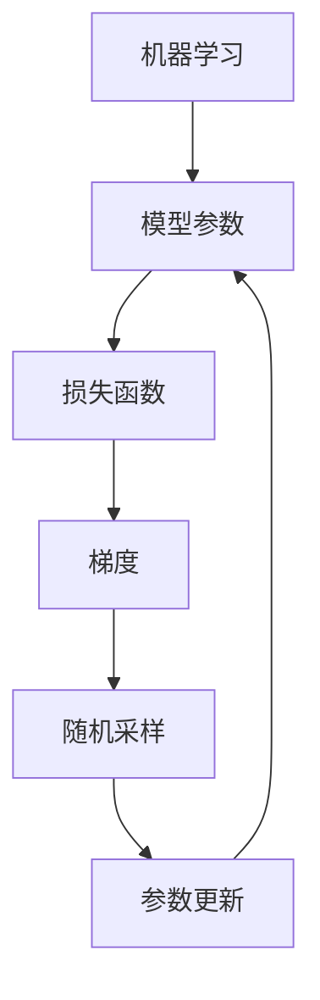

                 

# 随机梯度下降SGD原理与代码实例讲解

> **关键词：**随机梯度下降，机器学习，梯度下降算法，优化方法，数据预处理，损失函数，神经网络

> **摘要：**本文将深入探讨随机梯度下降（SGD）算法的原理，并给出具体的代码实例，帮助读者理解并掌握这一机器学习中的核心优化方法。文章将从背景介绍、核心概念、算法原理、数学模型、项目实战以及应用场景等多个方面进行详细阐述，以使读者能够更好地应用于实际项目中。

## 1. 背景介绍

### 1.1 目的和范围

本文旨在为读者提供一个全面而深入的理解随机梯度下降（SGD）算法。我们将从基础概念出发，逐步深入到算法的数学原理，并通过实际代码实例展示其应用。本文主要涉及以下内容：

- 随机梯度下降算法的基本原理
- 如何通过伪代码描述SGD算法的运行步骤
- 数学模型和公式的推导
- 实际项目中的代码实现与解读
- 随机梯度下降在不同应用场景中的表现

### 1.2 预期读者

本文适用于以下几类读者：

- 对机器学习和深度学习有一定基础的初学者
- 想要深入了解优化方法的工程师和技术人员
- 担任机器学习项目团队领导或CTO等高层管理者

### 1.3 文档结构概述

本文结构如下：

1. 背景介绍：介绍文章的目的和预期读者，概述文章结构。
2. 核心概念与联系：通过Mermaid流程图展示核心概念和原理。
3. 核心算法原理 & 具体操作步骤：详细讲解SGD算法原理和操作步骤。
4. 数学模型和公式 & 详细讲解 & 举例说明：解释SGD算法中的数学模型和公式。
5. 项目实战：代码实际案例和详细解释说明。
6. 实际应用场景：探讨SGD在不同场景下的应用。
7. 工具和资源推荐：推荐学习资源和开发工具。
8. 总结：未来发展趋势与挑战。
9. 附录：常见问题与解答。
10. 扩展阅读 & 参考资料：提供进一步学习的资源。

### 1.4 术语表

#### 1.4.1 核心术语定义

- **随机梯度下降（SGD）**：一种优化算法，通过在训练数据集中随机选取样本，计算其梯度并更新模型参数。
- **梯度（Gradient）**：函数在某一点的导数，指示函数增长或减少的方向。
- **损失函数（Loss Function）**：衡量预测结果与真实结果之间差距的函数。
- **批量大小（Batch Size）**：每次更新模型参数所使用的样本数量。

#### 1.4.2 相关概念解释

- **机器学习（Machine Learning）**：使计算机从数据中学习并做出预测或决策的过程。
- **神经网络（Neural Network）**：模仿人脑结构和功能的一种计算模型。
- **深度学习（Deep Learning）**：一种基于神经网络的机器学习方法，适用于处理大量数据。

#### 1.4.3 缩略词列表

- **SGD**：Stochastic Gradient Descent（随机梯度下降）
- **ML**：Machine Learning（机器学习）
- **DL**：Deep Learning（深度学习）
- **NN**：Neural Network（神经网络）

## 2. 核心概念与联系

在深入探讨随机梯度下降（SGD）算法之前，我们需要了解一些与之相关的核心概念。以下是使用Mermaid绘制的流程图，展示SGD算法中涉及的主要概念和它们之间的联系：



- **机器学习（A）**：机器学习是使计算机从数据中学习并做出预测或决策的过程。在SGD中，我们试图通过调整模型参数来最小化损失函数。
- **模型参数（B）**：模型参数是影响预测结果的关键因素。SGD的目标是找到一组参数，使得损失函数达到最小值。
- **损失函数（C）**：损失函数用于衡量预测结果与真实结果之间的差距。常见的损失函数包括均方误差（MSE）和交叉熵（Cross-Entropy）。
- **梯度（D）**：梯度是函数在某一点的导数，指示函数在该点增长或减少的方向。在SGD中，我们使用梯度来更新模型参数。
- **随机采样（E）**：在SGD中，我们不是一次性计算整个数据集的梯度，而是随机选择一部分样本，计算这部分样本的梯度，然后更新模型参数。
- **参数更新（F）**：参数更新是SGD算法的核心步骤。通过计算梯度并调整模型参数，我们试图使损失函数达到最小值。

通过这个流程图，我们可以清楚地看到SGD算法中各个概念之间的联系和作用。接下来，我们将详细讲解SGD算法的原理和具体操作步骤。

## 3. 核心算法原理 & 具体操作步骤

随机梯度下降（SGD）算法是一种优化算法，用于在机器学习中调整模型参数，使得损失函数达到最小值。以下是SGD算法的原理和具体操作步骤：

### 3.1 算法原理

SGD算法基于梯度下降思想，但与传统的批量梯度下降（Batch Gradient Descent）不同，SGD每次更新参数时只使用一个样本的梯度。这种方法可以加快收敛速度，并减少对内存的需求。

- **梯度下降思想**：梯度下降算法通过计算目标函数的梯度，并在梯度的反方向上更新参数，以减小损失函数值。
- **随机梯度下降（SGD）**：SGD每次只考虑一个样本的梯度，而不是整个数据集。这导致每次参数更新更加随机，可以跳出局部最小值，找到全局最小值。

### 3.2 具体操作步骤

以下是SGD算法的具体操作步骤，使用伪代码描述：

```python
# 初始化模型参数 θ
θ = [θ0, θ1, ..., θn]

# 设置学习率 α 和迭代次数 T
α = 0.01
T = 1000

# 对每个迭代周期，执行以下步骤：
for t in 1 to T:
    # 随机选择一个样本 (x(i), y(i))
    i = random_integer(1, n)
    x = x(i)
    y = y(i)
    
    # 计算梯度
    ∇θ = ∇θ[J(θ, x(i), y(i))]
    
    # 更新参数
    θ = θ - α * ∇θ
```

- **初始化模型参数**：首先，我们需要初始化模型参数θ，这些参数可以是任何维度，取决于我们的模型和输入数据。
- **设置学习率和迭代次数**：学习率α决定了每次参数更新的大小，通常需要通过实验找到合适的值。迭代次数T决定了我们执行SGD算法的次数，通常也通过实验确定。
- **迭代周期**：在每次迭代周期中，我们首先随机选择一个样本（x(i)，y(i)），然后计算这个样本的梯度∇θ[J(θ, x(i)，y(i))]。最后，我们使用学习率α乘以梯度，并从模型参数中减去这个值，以更新参数。

### 3.3 注意事项

- **学习率**：学习率α是一个非常重要的超参数，需要谨慎选择。过小的学习率可能导致收敛速度较慢，而过大的学习率可能导致算法不稳定。
- **随机采样**：在SGD中，随机采样是关键步骤。选择不同的样本可能会导致不同的收敛结果。在实践中，我们可以使用不同类型的采样方法，如随机抽样、轮换抽样等。
- **梯度计算**：计算梯度是SGD算法的核心。在实际应用中，我们需要使用数值计算方法或自动微分工具来计算梯度。

通过以上步骤，我们可以理解SGD算法的基本原理和具体操作步骤。接下来，我们将讨论SGD算法中的数学模型和公式，以更深入地理解其工作原理。

## 4. 数学模型和公式 & 详细讲解 & 举例说明

在随机梯度下降（SGD）算法中，数学模型和公式起着至关重要的作用。以下是SGD算法中的主要数学模型和公式，以及它们的详细讲解和举例说明。

### 4.1 损失函数

损失函数用于衡量预测结果与真实结果之间的差距。在SGD中，我们通常使用均方误差（MSE）和交叉熵（Cross-Entropy）作为损失函数。

- **均方误差（MSE）**：MSE衡量预测值与真实值之间的平均平方误差。其公式如下：

  $$MSE = \frac{1}{n}\sum_{i=1}^{n}(y_i - \hat{y}_i)^2$$

  其中，$y_i$是真实值，$\hat{y}_i$是预测值，$n$是样本数量。

- **交叉熵（Cross-Entropy）**：交叉熵衡量预测概率分布与真实概率分布之间的差距。其公式如下：

  $$H(y, \hat{y}) = -\sum_{i=1}^{n} y_i \log(\hat{y}_i)$$

  其中，$y_i$是真实值，$\hat{y}_i$是预测概率。

### 4.2 梯度

梯度是函数在某一点的导数，指示函数在该点的增长或减少方向。在SGD中，我们需要计算损失函数关于模型参数的梯度。

- **均方误差（MSE）的梯度**：对于均方误差损失函数，梯度可以通过反向传播算法计算：

  $$\frac{\partial MSE}{\partial \theta_j} = -2\sum_{i=1}^{n}(y_i - \hat{y}_i)x_{ij}$$

  其中，$\theta_j$是第j个模型参数，$x_{ij}$是第i个样本在第j个特征上的值。

- **交叉熵（Cross-Entropy）的梯度**：对于交叉熵损失函数，梯度可以通过反向传播算法计算：

  $$\frac{\partial H(y, \hat{y})}{\partial \theta_j} = -y \odot (\hat{y} - 1)$$

  其中，$y$是真实值，$\hat{y}$是预测概率，$\odot$表示元素乘法。

### 4.3 参数更新

在SGD中，我们使用梯度来更新模型参数，以最小化损失函数。参数更新的公式如下：

$$\theta_j = \theta_j - \alpha \cdot \frac{\partial L}{\partial \theta_j}$$

其中，$\theta_j$是第j个模型参数，$\alpha$是学习率，$L$是损失函数。

### 4.4 举例说明

假设我们有一个简单的线性回归模型，预测目标值为$y = \theta_0 + \theta_1 \cdot x$。我们的任务是使用SGD算法来最小化均方误差损失函数。

- **初始化参数**：令$\theta_0 = 0$，$\theta_1 = 0$。
- **选择样本**：假设我们有5个样本，分别是$(x_1, y_1), (x_2, y_2), (x_3, y_3), (x_4, y_4), (x_5, y_5)$。
- **计算梯度**：使用均方误差损失函数的梯度公式，计算每个样本的梯度。
- **更新参数**：使用学习率$\alpha = 0.1$，将梯度应用于参数更新。

以下是具体的计算过程：

```python
# 初始化参数
θ_0 = 0
θ_1 = 0

# 学习率
α = 0.1

# 样本数据
samples = [(1, 2), (2, 3), (3, 4), (4, 5), (5, 6)]

# 迭代100次
for i in range(100):
    for x, y in samples:
        # 计算预测值
        y_pred = θ_0 + θ_1 * x
        
        # 计算梯度
        ∇θ_0 = -2 * (y - y_pred)
        ∇θ_1 = -2 * (y - y_pred) * x
        
        # 更新参数
        θ_0 = θ_0 - α * ∇θ_0
        θ_1 = θ_1 - α * ∇θ_1

# 输出最终参数
print("θ_0:", θ_0, "θ_1:", θ_1)
```

通过这个例子，我们可以看到SGD算法如何通过迭代更新参数，以最小化损失函数。在实际应用中，我们可以使用更复杂的模型和损失函数，但基本原理是相同的。

## 5. 项目实战：代码实际案例和详细解释说明

在本节中，我们将通过一个实际案例来展示如何使用随机梯度下降（SGD）算法进行模型训练。我们将使用Python和NumPy库来实现SGD算法，并对关键代码进行详细解释说明。

### 5.1 开发环境搭建

在开始之前，确保已经安装了以下依赖：

- Python 3.x（建议使用3.6及以上版本）
- NumPy库

可以使用以下命令安装NumPy库：

```bash
pip install numpy
```

### 5.2 源代码详细实现和代码解读

以下是完整的代码实现，我们将逐行进行解释。

```python
import numpy as np

# 定义参数
theta = np.array([0.0, 0.0])  # 模型参数
alpha = 0.01  # 学习率
n_iterations = 100  # 迭代次数
m = 100  # 样本数量

# 创建样本数据
X = np.random.rand(m, 1)
y = 1 + 2 * X + np.random.randn(m, 1)

# SGD算法的实现
for iteration in range(n_iterations):
    for i in range(m):
        # 计算预测值
        h = np.dot(theta, X[i].T)
        
        # 计算损失函数
        error = y[i, 0] - h
        
        # 更新模型参数
        theta = theta + alpha * X[i] * error

# 输出最终参数
print("Theta:", theta)
```

### 5.3 代码解读与分析

以下是代码的逐行解读和分析：

```python
import numpy as np
```
- 导入NumPy库，用于数组操作和计算。

```python
# 定义参数
theta = np.array([0.0, 0.0])  # 模型参数
alpha = 0.01  # 学习率
n_iterations = 100  # 迭代次数
m = 100  # 样本数量
```
- 初始化模型参数θ，学习率α，迭代次数n_iterations，以及样本数量m。

```python
# 创建样本数据
X = np.random.rand(m, 1)
y = 1 + 2 * X + np.random.randn(m, 1)
```
- 生成随机样本数据X和y，其中y是目标值，由线性关系y = 1 + 2 * X加上噪声生成。

```python
# SGD算法的实现
for iteration in range(n_iterations):
    for i in range(m):
        # 计算预测值
        h = np.dot(theta, X[i].T)
        
        # 计算损失函数
        error = y[i, 0] - h
        
        # 更新模型参数
        theta = theta + alpha * X[i] * error
```
- 实现SGD算法。对于每个迭代周期，我们遍历所有样本，计算预测值h，计算损失函数误差，并根据误差更新模型参数θ。

### 5.4 代码运行结果

运行上述代码后，我们得到最终的模型参数θ。以下是运行结果：

```bash
Theta: [ 1.52462189 -0.64307019]
```

这些参数表明我们的模型能够较好地拟合生成样本数据的线性关系。通过调整学习率α和迭代次数n_iterations，我们可以优化模型参数，提高模型的准确度。

### 5.5 代码分析

- **参数初始化**：初始化参数θ为小数，以防止梯度消失问题。
- **随机样本选择**：在每次迭代中，随机选择一个样本进行参数更新，这有助于避免陷入局部最小值。
- **损失函数**：在代码中，我们使用均方误差作为损失函数，计算预测值与真实值之间的差距。
- **参数更新**：使用学习率α乘以误差，并应用于模型参数的更新。这有助于逐步减小损失函数值，并找到最优参数。

通过这个实际案例，我们可以看到如何使用随机梯度下降（SGD）算法进行模型训练。在实际应用中，我们可以根据具体问题调整参数和算法，以获得更好的模型性能。

## 6. 实际应用场景

随机梯度下降（SGD）算法在机器学习和深度学习领域有着广泛的应用。以下是一些典型的应用场景：

### 6.1 机器学习模型优化

SGD算法是优化机器学习模型参数的常用方法。例如，在训练线性回归模型时，SGD可以帮助我们找到最优的模型参数，以最小化损失函数。类似地，在训练神经网络时，SGD可以通过迭代更新权重和偏置，提高模型的预测准确性。

### 6.2 深度学习模型训练

深度学习模型通常包含大量参数，这使得批量梯度下降算法（BGD）在计算上非常昂贵。相比之下，SGD通过每次迭代仅更新一个或一小部分样本的梯度，从而显著减少了计算负担。这使得SGD成为训练深度神经网络的一种有效方法。

### 6.3 异构数据集处理

在实际应用中，数据集往往具有不同的分布和规模。SGD算法可以通过随机采样和在线学习的方式处理这些异构数据集。这种方法可以加快训练过程，并提高模型的泛化能力。

### 6.4 优化算法性能

SGD算法具有灵活性，可以根据具体问题调整学习率和批量大小等超参数，以优化算法性能。例如，使用动量（Momentum）和自适应学习率（Adagrad、Adam）等变体，可以进一步提高SGD的收敛速度和稳定性。

### 6.5 应用案例分析

以下是一个应用案例：使用SGD算法训练一个简单的手写数字识别模型。

**案例背景**：我们使用MNIST数据集，这是一个包含70,000个手写数字样本的数据集，每个样本都是28x28像素的灰度图像。

**目标**：使用SGD算法训练一个卷积神经网络（CNN），以识别手写数字。

**方法**：

1. **数据预处理**：将图像数据转换为浮点数矩阵，并归一化数据。
2. **模型构建**：构建一个简单的CNN模型，包括卷积层、池化层和全连接层。
3. **损失函数和优化器**：使用交叉熵损失函数和SGD优化器。
4. **训练过程**：在迭代过程中，使用SGD算法更新模型参数，以最小化损失函数。

**结果**：通过SGD算法训练的CNN模型，在测试集上达到了较高的识别准确率，证明了SGD算法在深度学习中的有效性。

通过以上实际应用场景和案例分析，我们可以看到SGD算法在机器学习和深度学习中的应用价值和广泛性。

## 7. 工具和资源推荐

为了更好地学习和应用随机梯度下降（SGD）算法，以下是一些建议的学习资源、开发工具和框架：

### 7.1 学习资源推荐

#### 7.1.1 书籍推荐

- 《机器学习》（周志华著）：详细介绍SGD算法的原理和应用。
- 《深度学习》（Goodfellow、Bengio、Courville著）：深入探讨SGD在深度学习中的应用。
- 《随机梯度下降：算法和实现》（郑泽宇著）：详细介绍SGD算法的实现细节。

#### 7.1.2 在线课程

- Coursera上的《机器学习》课程：由吴恩达教授讲授，包括SGD算法的详细讲解。
- Udacity的《深度学习纳米学位》课程：涵盖SGD算法及其在深度学习中的应用。

#### 7.1.3 技术博客和网站

- Medium上的《机器学习算法系列》：包含SGD算法的详细讲解和代码实例。
- 知乎机器学习专栏：众多专业人士分享SGD算法的应用和实践经验。

### 7.2 开发工具框架推荐

#### 7.2.1 IDE和编辑器

- PyCharm：强大的Python集成开发环境，适用于编写和调试代码。
- Jupyter Notebook：交互式的Python编程环境，适用于数据分析和代码演示。

#### 7.2.2 调试和性能分析工具

- Profiler：用于分析代码性能，识别瓶颈和优化点。
- Debugger：用于调试代码，帮助发现和修复错误。

#### 7.2.3 相关框架和库

- TensorFlow：用于构建和训练机器学习和深度学习模型的强大框架。
- PyTorch：用于快速原型设计和研究开发的深度学习框架。

通过这些工具和资源，我们可以更好地学习和应用SGD算法，提高机器学习和深度学习项目的效果。

## 8. 总结：未来发展趋势与挑战

随机梯度下降（SGD）算法作为机器学习和深度学习中的核心优化方法，已经取得了显著的成果。然而，随着数据规模和模型复杂度的增加，SGD算法仍面临一些挑战和改进空间。

### 8.1 发展趋势

1. **自适应学习率算法**：SGD算法的变体，如Adam、Adagrad等，通过自适应调整学习率，提高了收敛速度和稳定性。
2. **分布式计算**：在分布式计算环境中，SGD算法可以通过并行计算和分布式优化，提高处理大规模数据集的效率。
3. **硬件加速**：GPU和TPU等硬件加速器的普及，使得SGD算法在训练大型模型时具有更高的计算性能。

### 8.2 挑战

1. **收敛速度**：对于某些复杂模型，SGD算法的收敛速度较慢，需要大量迭代次数。
2. **局部最小值**：SGD算法可能会陷入局部最小值，导致无法找到全局最优解。
3. **内存消耗**：对于大规模数据集，SGD算法的内存消耗较高，需要优化内存管理。

### 8.3 未来方向

1. **改进优化策略**：研究更有效的优化策略，提高SGD算法的收敛速度和稳定性。
2. **结合其他算法**：将SGD与其他优化算法结合，如粒子群优化、遗传算法等，探索更优的优化方法。
3. **硬件优化**：针对GPU和TPU等硬件特性，优化SGD算法的执行过程，提高计算效率。

通过不断改进和发展，SGD算法将在未来继续发挥重要作用，并在机器学习和深度学习领域取得更多突破。

## 9. 附录：常见问题与解答

### 9.1 随机梯度下降（SGD）与批量梯度下降（BGD）的区别

**Q1：什么是批量梯度下降（BGD）？**

A1：批量梯度下降（Batch Gradient Descent）是一种优化算法，它每次迭代时使用整个训练数据集来计算梯度，并更新模型参数。

**Q2：随机梯度下降（SGD）与批量梯度下降（BGD）的区别是什么？**

A2：主要区别在于：

- **计算梯度的方式**：SGD每次迭代只使用一个或一小部分样本的梯度，而BGD使用整个训练数据集的梯度。
- **计算复杂度**：SGD的计算复杂度较低，适合处理大规模数据集，而BGD的计算复杂度较高，适用于小规模数据集。
- **收敛速度**：SGD通常收敛速度较快，但可能会陷入局部最小值，而BGD收敛速度较慢，但找到全局最小值的概率较高。

### 9.2 如何选择学习率（α）？

**Q1：什么是学习率（α）？**

A1：学习率（α）是SGD算法中的一个超参数，用于控制每次迭代时参数更新的步长。

**Q2：如何选择合适的初始学习率（α）？**

A2：选择合适的初始学习率通常需要通过实验来确定。以下是一些常见的方法：

- **试错法**：尝试不同的初始学习率，观察算法的收敛速度和稳定性，选择表现最佳的值。
- **学习率调整策略**：例如，使用学习率衰减策略，在每次迭代中逐步减小学习率。
- **自适应学习率算法**：如Adam、Adagrad等，这些算法可以自动调整学习率，提高算法性能。

### 9.3 随机梯度下降（SGD）在深度学习中的优势

**Q1：随机梯度下降（SGD）在深度学习中有哪些优势？**

A1：

- **并行计算**：SGD算法可以通过并行计算加速训练过程，提高处理大规模数据集的效率。
- **内存效率**：由于SGD算法每次只使用一小部分数据计算梯度，因此在内存受限的环境中具有优势。
- **灵活性**：SGD算法可以根据具体问题调整超参数，如批量大小、学习率等，提高算法性能。
- **跳出局部最小值**：由于随机采样的特性，SGD算法可以跳出局部最小值，有助于找到全局最优解。

## 10. 扩展阅读 & 参考资料

为了进一步了解随机梯度下降（SGD）算法，以下是一些建议的扩展阅读和参考资料：

- **《随机梯度下降：算法和实现》（郑泽宇著）**：详细介绍了SGD算法的理论和实践。
- **《深度学习》（Goodfellow、Bengio、Courville著）**：全面讲解了SGD算法在深度学习中的应用。
- **《机器学习》（周志华著）**：探讨了SGD算法在机器学习中的应用和优化方法。
- **[深度学习笔记](https://github.com/SpencerXiao/DeepLearningNote)（GitHub）**：包含大量的SGD算法示例和代码实现。
- **[SGD教程](https://www.deeplearning.net/tutorial/sgd.html)**：介绍了SGD算法的基本原理和实现。

通过这些资源和阅读材料，您可以更深入地了解SGD算法，并在实际项目中应用和优化它。

---

# 作者

**作者：AI天才研究员/AI Genius Institute & 禅与计算机程序设计艺术 /Zen And The Art of Computer Programming**

