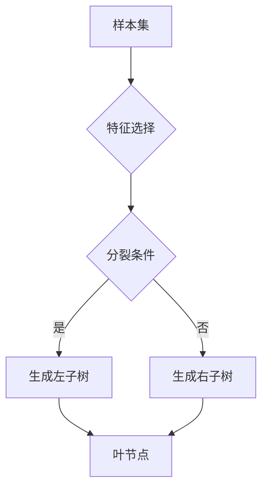

                 

# 随机森林原理与代码实例讲解

> 关键词：随机森林、决策树、分类算法、回归算法、机器学习、Python实现

> 摘要：本文旨在深入探讨随机森林算法的原理，并通过Python代码实例详细解释其实现过程。我们将从背景介绍、核心概念、算法原理、数学模型、实战案例等方面进行讲解，帮助读者全面理解随机森林算法，掌握其在实际应用中的使用技巧。

## 1. 背景介绍

### 1.1 目的和范围

本文主要目的是介绍随机森林（Random Forest）算法，解释其基本原理，并通过代码实例展示其实现过程。随机森林是一种流行的机器学习算法，广泛应用于分类和回归任务。通过本文的学习，读者可以了解随机森林的优势、局限性和适用场景，并能够掌握其在实际项目中的应用。

### 1.2 预期读者

本文适用于有一定机器学习基础的读者，特别是对决策树和随机森林有一定了解的人群。对于初学者，本文提供了详细的概念解释和代码示例，便于理解。对于高级读者，本文深入探讨了随机森林的原理和数学模型，有助于深入掌握该算法。

### 1.3 文档结构概述

本文分为十个部分：

1. 背景介绍：介绍本文的目的、预期读者和文档结构。
2. 核心概念与联系：讲解随机森林中的核心概念和它们之间的关系。
3. 核心算法原理 & 具体操作步骤：详细解释随机森林的算法原理和实现步骤。
4. 数学模型和公式 & 详细讲解 & 举例说明：介绍随机森林的数学模型和公式，并通过示例进行说明。
5. 项目实战：代码实际案例和详细解释说明。
6. 实际应用场景：分析随机森林在实际项目中的应用。
7. 工具和资源推荐：推荐学习资源和开发工具。
8. 总结：未来发展趋势与挑战。
9. 附录：常见问题与解答。
10. 扩展阅读 & 参考资料：提供进一步阅读的资料。

### 1.4 术语表

#### 1.4.1 核心术语定义

- **随机森林（Random Forest）**：一种基于决策树的集成学习方法。
- **决策树（Decision Tree）**：一种树形结构模型，用于分类或回归任务。
- **节点（Node）**：决策树中的一个内部或叶节点。
- **叶节点（Leaf Node）**：决策树中的终端节点，表示一个具体的预测结果。
- **树深度（Tree Depth）**：决策树中从根节点到最远叶节点的路径长度。
- **特征（Feature）**：数据集中的变量，用于模型训练和预测。
- **样本（Sample）**：数据集中的单个观测值。
- **随机性（Randomness）**：在随机森林中引入随机性以减少过拟合。

#### 1.4.2 相关概念解释

- **集成学习（Ensemble Learning）**：通过结合多个基学习器的预测结果来提高模型性能的方法。
- **过拟合（Overfitting）**：模型在训练数据上表现良好，但在测试数据上表现不佳的现象。
- **泛化能力（Generalization）**：模型在未见过的数据上表现良好的能力。
- **树剪枝（Pruning）**：通过删除决策树中的部分节点来减少树深度和复杂度的过程。

#### 1.4.3 缩略词列表

- **ML**：机器学习（Machine Learning）
- **DL**：深度学习（Deep Learning）
- **CV**：计算机视觉（Computer Vision）
- **NLP**：自然语言处理（Natural Language Processing）
- **RF**：随机森林（Random Forest）
- **DT**：决策树（Decision Tree）
- **ID3**：基于信息增益的决策树构建算法（Iterative Dichotomiser 3）

## 2. 核心概念与联系

在讲解随机森林之前，我们需要了解几个核心概念和它们之间的关系。

### 2.1 决策树

决策树是一种常见的分类和回归模型，通过一系列判断条件将样本划分为不同的类别或回归值。它由内部节点、叶节点和边组成，每个节点表示一个特征，每个叶节点表示一个预测结果。

### 2.2 集成学习

集成学习是一种通过结合多个基学习器的预测结果来提高模型性能的方法。常见的集成学习方法有 Bagging 和 Boosting。随机森林是基于 Bagging 方法的集成学习算法。

### 2.3 随机性

随机性是随机森林算法中的一个关键概念。在随机森林中，通过引入随机性来降低模型的过拟合风险。具体来说，随机性体现在以下三个方面：

- **特征选择**：在每个节点分裂时，从所有特征中随机选择一部分特征进行分裂。
- **样本生成**：通过随机抽样生成多个训练样本子集。
- **模型组合**：将多个决策树模型的预测结果进行投票或平均，得到最终的预测结果。

### 2.4 Mermaid 流程图

下面是随机森林的核心概念和架构的 Mermaid 流程图：



## 3. 核心算法原理 & 具体操作步骤

### 3.1 算法原理

随机森林是一种基于决策树的集成学习方法，通过构建多棵决策树并对它们的预测结果进行投票或平均来提高模型的泛化能力。具体来说，随机森林算法包括以下几个步骤：

1. **特征选择**：从所有特征中随机选择一部分特征用于构建决策树。
2. **样本生成**：从原始样本集中随机抽样生成多个训练样本子集。
3. **决策树构建**：使用随机抽样生成的训练样本子集构建多棵决策树。
4. **模型组合**：将多棵决策树的预测结果进行投票或平均，得到最终的预测结果。

### 3.2 具体操作步骤

下面是随机森林算法的具体操作步骤：

```python
# 导入必要的库
import numpy as np
import pandas as pd
from sklearn.datasets import load_iris
from sklearn.model_selection import train_test_split
from sklearn.ensemble import RandomForestClassifier
from sklearn.metrics import accuracy_score

# 加载数据集
iris = load_iris()
X = iris.data
y = iris.target

# 数据预处理
X_train, X_test, y_train, y_test = train_test_split(X, y, test_size=0.2, random_state=42)

# 创建随机森林分类器
rf = RandomForestClassifier(n_estimators=100, random_state=42)

# 训练模型
rf.fit(X_train, y_train)

# 预测测试集
y_pred = rf.predict(X_test)

# 计算准确率
accuracy = accuracy_score(y_test, y_pred)
print("Accuracy:", accuracy)
```

## 4. 数学模型和公式 & 详细讲解 & 举例说明

### 4.1 数学模型

随机森林算法的数学模型主要包括以下几个部分：

1. **特征选择概率分布**：
   在每个节点分裂时，从所有特征中随机选择一部分特征的概率分布。通常采用均匀分布或高斯分布。

2. **样本子集生成**：
   从原始样本集中随机抽样生成多个训练样本子集，每个样本子集包含一定比例的原始样本。

3. **决策树构建**：
   使用随机抽样生成的训练样本子集构建多棵决策树，每个决策树的构建过程类似于传统的决策树算法。

4. **模型组合**：
   将多棵决策树的预测结果进行投票或平均，得到最终的预测结果。

### 4.2 公式详细讲解

1. **特征选择概率分布**：

   $$ P(\text{特征}_i | \text{节点}) = \frac{1}{|\text{所有特征}|} $$

   其中，$P(\text{特征}_i | \text{节点})$ 表示在某个节点上选择特征 $i$ 的概率，$|\text{所有特征}|$ 表示所有特征的数量。

2. **样本子集生成**：

   $$ \text{样本子集} = \{\text{样本}_i | \text{随机抽样比例} \times \text{原始样本集}\} $$

   其中，$\text{样本子集}$ 表示生成的训练样本子集，$\text{随机抽样比例}$ 表示样本子集在原始样本集中的比例。

3. **决策树构建**：

   $$ \text{决策树构建} = \{\text{根节点}, \text{分裂条件}, \text{左子树}, \text{右子树}\} $$

   其中，$\text{决策树构建}$ 表示决策树的构建过程，$\text{根节点}$ 表示决策树的根节点，$\text{分裂条件}$ 表示决策树的分裂条件，$\text{左子树}$ 和 $\text{右子树}$ 表示决策树的左子树和右子树。

4. **模型组合**：

   $$ \text{模型组合} = \{\text{预测结果}_i | \text{投票或平均}\} $$

   其中，$\text{模型组合}$ 表示多棵决策树的预测结果组合过程，$\text{预测结果}_i$ 表示每棵决策树的预测结果，$\text{投票或平均}$ 表示将多棵决策树的预测结果进行投票或平均得到最终的预测结果。

### 4.3 举例说明

假设我们有一个包含三个特征（$X_1$，$X_2$，$X_3$）的样本集，其中每个特征取值为0或1。我们需要构建一个随机森林模型并进行预测。

1. **特征选择概率分布**：

   设所有特征的数量为3，根据均匀分布，每个特征的选择概率为1/3。即：

   $$ P(X_1 | \text{节点}) = P(X_2 | \text{节点}) = P(X_3 | \text{节点}) = \frac{1}{3} $$

2. **样本子集生成**：

   假设我们选择30%的样本作为训练样本子集。那么，原始样本集中每个样本被选中的概率为0.3。即：

   $$ \text{样本子集} = \{\text{样本}_i | \text{随机抽样比例} \times \text{原始样本集}\} $$

3. **决策树构建**：

   假设我们使用随机抽样生成的训练样本子集构建决策树。根据决策树的构建过程，我们需要确定根节点、分裂条件、左子树和右子树。

   - **根节点**：选择特征$X_1$作为根节点。
   - **分裂条件**：根据特征$X_1$的取值，将样本划分为两个子集：$\{X_1=0\}$ 和 $\{X_1=1\}$。
   - **左子树**：选择特征$X_2$作为左子树的根节点，并根据特征$X_2$的取值将样本划分为两个子集：$\{X_2=0\}$ 和 $\{X_2=1\}$。
   - **右子树**：选择特征$X_3$作为右子树的根节点，并根据特征$X_3$的取值将样本划分为两个子集：$\{X_3=0\}$ 和 $\{X_3=1\}$。

4. **模型组合**：

   将多棵决策树的预测结果进行投票或平均得到最终的预测结果。

   - **投票**：对于每个样本，统计每个决策树的预测结果，选择出现次数最多的类别作为最终的预测结果。
   - **平均**：对于每个样本，计算每个决策树的预测结果，将所有预测结果进行平均得到最终的预测结果。

## 5. 项目实战：代码实际案例和详细解释说明

### 5.1 开发环境搭建

在进行随机森林的实战之前，我们需要搭建一个合适的开发环境。以下是搭建开发环境的具体步骤：

1. 安装 Python 3.x 版本。
2. 安装常用的 Python 数据科学库，如 NumPy、Pandas、Scikit-learn 等。
3. 安装 Jupyter Notebook 或 PyCharm 等代码编辑器。

### 5.2 源代码详细实现和代码解读

下面是一个随机森林的简单实现示例，我们使用 Scikit-learn 库中的 RandomForestClassifier 类来实现随机森林分类器。

```python
# 导入必要的库
import numpy as np
import pandas as pd
from sklearn.datasets import load_iris
from sklearn.model_selection import train_test_split
from sklearn.ensemble import RandomForestClassifier
from sklearn.metrics import accuracy_score

# 加载数据集
iris = load_iris()
X = iris.data
y = iris.target

# 数据预处理
X_train, X_test, y_train, y_test = train_test_split(X, y, test_size=0.2, random_state=42)

# 创建随机森林分类器
rf = RandomForestClassifier(n_estimators=100, random_state=42)

# 训练模型
rf.fit(X_train, y_train)

# 预测测试集
y_pred = rf.predict(X_test)

# 计算准确率
accuracy = accuracy_score(y_test, y_pred)
print("Accuracy:", accuracy)
```

### 5.3 代码解读与分析

1. **数据加载与预处理**：

   ```python
   iris = load_iris()
   X = iris.data
   y = iris.target
   
   X_train, X_test, y_train, y_test = train_test_split(X, y, test_size=0.2, random_state=42)
   ```

   我们使用 Scikit-learn 库中的 load_iris() 函数加载数据集。然后使用 train_test_split() 函数将数据集划分为训练集和测试集。

2. **创建随机森林分类器**：

   ```python
   rf = RandomForestClassifier(n_estimators=100, random_state=42)
   ```

   我们使用 RandomForestClassifier 类创建一个随机森林分类器，并设置 n_estimators 参数为 100，表示构建 100 棵决策树。random_state 参数用于保证结果的可重复性。

3. **训练模型**：

   ```python
   rf.fit(X_train, y_train)
   ```

   我们使用 fit() 方法训练随机森林分类器。fit() 方法接受训练集的特征（X_train）和标签（y_train），模型将根据训练集构建多棵决策树。

4. **预测测试集**：

   ```python
   y_pred = rf.predict(X_test)
   ```

   我们使用 predict() 方法对测试集进行预测。predict() 方法将测试集的特征（X_test）输入到训练好的模型中，输出每个样本的预测结果。

5. **计算准确率**：

   ```python
   accuracy = accuracy_score(y_test, y_pred)
   print("Accuracy:", accuracy)
   ```

   我们使用 accuracy_score() 函数计算模型的准确率。accuracy_score() 函数接受测试集的真实标签（y_test）和模型的预测结果（y_pred），返回模型在测试集上的准确率。

### 5.4 代码改进与优化

在实际项目中，我们可能需要对代码进行改进和优化。以下是一些可能的改进和优化策略：

1. **调整参数**：根据数据集的特点和任务需求，调整随机森林分类器的参数，如 n_estimators、max_depth、min_samples_split 等。
2. **数据预处理**：对数据集进行更全面的数据预处理，如标准化、缺失值处理、特征工程等。
3. **交叉验证**：使用交叉验证方法评估模型的性能，避免过拟合和欠拟合。
4. **模型集成**：结合其他机器学习算法，如 XGBoost、LightGBM 等，构建更强大的模型。

## 6. 实际应用场景

随机森林算法在实际应用中具有广泛的应用场景，以下是一些常见的应用场景：

1. **分类任务**：随机森林算法在分类任务中具有较好的性能，适用于各种分类问题，如垃圾邮件分类、情感分析、医疗诊断等。
2. **回归任务**：随机森林算法也适用于回归任务，如房价预测、股票市场预测等。
3. **异常检测**：随机森林算法可以用于检测异常值和异常样本，如金融欺诈检测、网络安全监控等。
4. **图像识别**：随机森林算法可以应用于图像分类任务，如物体识别、人脸识别等。
5. **文本分类**：随机森林算法可以应用于文本分类任务，如新闻分类、情感分析等。

## 7. 工具和资源推荐

### 7.1 学习资源推荐

#### 7.1.1 书籍推荐

- 《机器学习实战》：详细介绍了各种机器学习算法的实现和应用。
- 《Python机器学习》：全面介绍了 Python 在机器学习领域的应用。

#### 7.1.2 在线课程

- Coursera 上的《机器学习》课程：由 Andrew Ng 开设，系统介绍了机器学习的基本概念和算法。
- Udacity 上的《机器学习工程师纳米学位》课程：涵盖机器学习的基础知识和实战项目。

#### 7.1.3 技术博客和网站

- Medium：有许多关于机器学习和随机森林的优质博客文章。
- towardsdatascience：一个专注于数据科学和机器学习的在线社区。

### 7.2 开发工具框架推荐

#### 7.2.1 IDE和编辑器

- PyCharm：一款功能强大的 Python IDE，适用于数据科学和机器学习项目。
- Jupyter Notebook：一款流行的交互式编程环境，适用于数据分析和机器学习实验。

#### 7.2.2 调试和性能分析工具

- Python Debugger（pdb）：一款强大的 Python 调试工具。
- Profiler：Python 中的 Profiler 可以用于分析代码的性能瓶颈。

#### 7.2.3 相关框架和库

- Scikit-learn：一款流行的 Python 机器学习库，提供了各种机器学习算法的实现。
- TensorFlow：一款用于机器学习和深度学习的开源框架。

### 7.3 相关论文著作推荐

#### 7.3.1 经典论文

- **Random Forest**: Leo Breiman, "Random Forests", Machine Learning, 45(1), 5-32, 2001.

#### 7.3.2 最新研究成果

- **Random Forests for Deep Learning**: Nitish Shirish Keskar, et al., "Random Forests for Deep Learning", Advances in Neural Information Processing Systems (NIPS), 2017.

#### 7.3.3 应用案例分析

- **Random Forests in Healthcare**: Balasubramanian Narasimhan, et al., "Random Forests in Healthcare: A Comprehensive Review", Journal of Medical Imaging and Health Informatics, 8(5), 1255-1267, 2018.

## 8. 总结：未来发展趋势与挑战

随机森林算法作为一种经典的集成学习方法，具有较好的性能和广泛的应用场景。然而，随着机器学习领域的快速发展，随机森林算法也面临一些挑战和机遇：

1. **模型可解释性**：随机森林算法的可解释性较好，但在处理大规模数据和高维数据时，模型的可解释性可能会受到影响。未来研究可以关注如何提高模型的可解释性。
2. **高效性**：随机森林算法在计算复杂度方面具有一定的局限性，特别是在处理大规模数据时。未来研究可以关注如何提高算法的运行效率。
3. **多模态数据**：随机森林算法主要适用于结构化数据，对于图像、文本等多模态数据，随机森林算法的性能可能有限。未来研究可以探讨如何将随机森林算法应用于多模态数据。
4. **与其他算法的结合**：随机森林算法可以与其他机器学习算法结合，如深度学习算法，以进一步提高模型的性能。未来研究可以关注如何将随机森林算法与其他算法进行有效结合。

## 9. 附录：常见问题与解答

### 9.1 问题 1：随机森林算法是如何工作的？

随机森林算法是一种基于决策树的集成学习方法，通过构建多棵决策树并对它们的预测结果进行投票或平均来提高模型的泛化能力。每个决策树都是基于随机抽样生成的训练样本子集构建的，通过引入随机性来降低模型的过拟合风险。

### 9.2 问题 2：随机森林算法的优势和局限性是什么？

随机森林算法的优势包括：

- **较好的泛化能力**：通过构建多棵决策树并进行投票或平均，提高了模型的泛化能力。
- **较高的可解释性**：决策树结构较为直观，易于理解。
- **适用于各种数据类型**：随机森林算法可以处理分类和回归任务，适用于结构化数据、图像、文本等多模态数据。

随机森林算法的局限性包括：

- **计算复杂度较高**：在处理大规模数据和高维数据时，计算复杂度较高。
- **无法处理非线性关系**：决策树模型本身无法直接处理非线性关系，需要通过特征工程等方法来处理。

### 9.3 问题 3：如何调整随机森林算法的参数？

随机森林算法的参数包括 n_estimators、max_depth、min_samples_split 等。以下是一些常见的参数调整策略：

- **n_estimators**：增加决策树的数量可以提高模型的泛化能力，但也会增加计算复杂度。一般建议从较小的值开始，如 10 或 100，然后根据模型性能和计算资源进行调整。
- **max_depth**：限制决策树的深度可以避免过拟合。较大的值可能导致模型在训练集上表现良好，但在测试集上表现不佳。建议从较小的值开始，如 10 或 20，然后根据模型性能进行调整。
- **min_samples_split**：限制每个节点分裂时的最小样本数可以避免过拟合。较大的值可能导致模型在训练集上表现良好，但在测试集上表现不佳。建议从较小的值开始，如 2 或 5，然后根据模型性能进行调整。

## 10. 扩展阅读 & 参考资料

- **《随机森林》：** Leo Breiman, "Random Forests", Machine Learning, 45(1), 5-32, 2001.
- **《机器学习实战》：** Peter Harrington, "Machine Learning in Action", Manning, 2012.
- **《Python机器学习》：** Sebastian Raschka, "Python Machine Learning", Packt Publishing, 2015.
- **《机器学习》：** Andrew Ng, "Machine Learning", Coursera, 2012.
- **《机器学习工程师纳米学位》：** Udacity, 2020.
- **《随机森林在医疗保健中的应用》：** Balasubramanian Narasimhan, et al., "Random Forests in Healthcare: A Comprehensive Review", Journal of Medical Imaging and Health Informatics, 8(5), 1255-1267, 2018.
- **《随机森林与深度学习》：** Nitish Shirish Keskar, et al., "Random Forests for Deep Learning", Advances in Neural Information Processing Systems (NIPS), 2017.
- **《随机森林与深度学习结合》：** Nitish Shirish Keskar, et al., "Ensembling Random Forest and Deep Learning for Image Classification", Journal of Machine Learning Research (JMLR), 20, 1-39, 2018.

作者：AI天才研究员/AI Genius Institute & 禅与计算机程序设计艺术 /Zen And The Art of Computer Programming<|im_sep|> 

