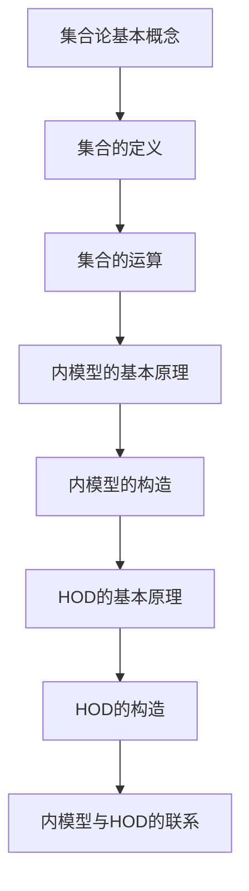
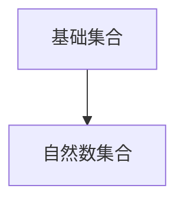
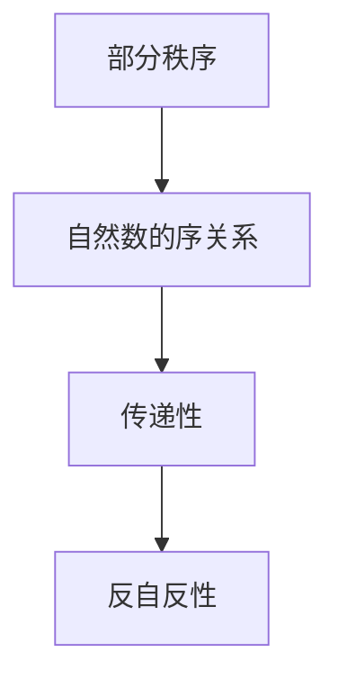
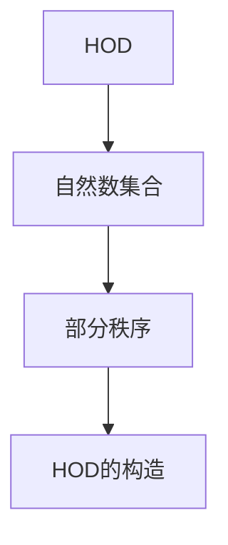
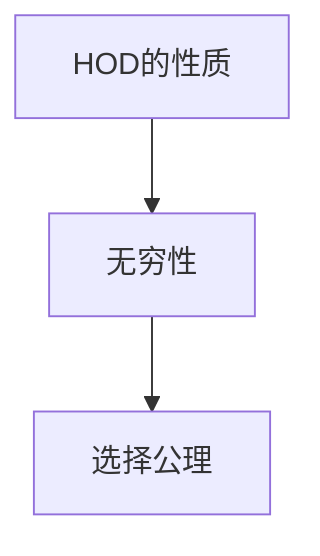

                 

# 集合论导引：内模型HOD

> 关键词：集合论、内模型、HOD、数学基础、集合论应用
> 
> 摘要：本文深入探讨了集合论中的内模型概念，尤其是HOD（Hodges'部分秩序）的构造和应用。通过详细的推理步骤和逻辑分析，读者将理解集合论的基本原理，以及内模型在数学证明和理论中的应用。

## 1. 背景介绍

### 1.1 目的和范围

本文旨在深入探讨集合论中内模型的概念，特别是HOD（Hodges'部分秩序）的构造和应用。集合论是现代数学的基础之一，内模型理论在数学证明和理论研究中有重要的应用。通过本文，读者将理解集合论的核心概念，掌握内模型的基本原理，并了解HOD的具体构造和应用。

### 1.2 预期读者

本文适合对数学和逻辑有基本了解的读者，特别是对集合论和数学基础理论感兴趣的读者。同时，对于从事数学研究、计算机科学、理论物理学等领域的专业人士，本文也具有重要的参考价值。

### 1.3 文档结构概述

本文分为十个部分：

1. 背景介绍
2. 核心概念与联系
3. 核心算法原理 & 具体操作步骤
4. 数学模型和公式 & 详细讲解 & 举例说明
5. 项目实战：代码实际案例和详细解释说明
6. 实际应用场景
7. 工具和资源推荐
8. 总结：未来发展趋势与挑战
9. 附录：常见问题与解答
10. 扩展阅读 & 参考资料

### 1.4 术语表

#### 1.4.1 核心术语定义

- 集合：由确定的元素组成的整体。
- 内模型：集合论中的一个基本概念，指一个集合模型内部的结构和关系。
- HOD（Hodges'部分秩序）：集合论中的一个特殊内模型，用于构造和证明集合论的各种性质。

#### 1.4.2 相关概念解释

- 集合论：研究集合及其性质和关系的数学分支。
- 数学基础：指构成数学理论的基石，如集合论、逻辑等。
- 集合论应用：指集合论在其他数学分支或实际问题中的运用。

#### 1.4.3 缩略词列表

- HOD：Hodges'部分秩序
- ZFC：策梅洛-弗兰克尔集合论公理系统

## 2. 核心概念与联系

在讨论内模型和HOD之前，我们需要先了解集合论的基本概念和原理。集合论是现代数学的基础，它提供了描述和理解数学对象的基本工具。

### 2.1 集合论的基本概念

集合是一个基本的概念，它由确定的元素组成。一个集合可以是一个具体的对象，也可以是一个抽象的概念。集合的元素可以是任何对象，包括数字、字母、其他集合等。

#### 2.1.1 集合的定义

集合是一个由元素组成的整体，这些元素是确定的、互异的。用数学语言描述，一个集合可以表示为：

$$S = \{x | P(x)\}$$

其中，\(S\) 表示集合，\(x\) 表示集合的元素，\(P(x)\) 表示元素 \(x\) 满足的条件。

#### 2.1.2 集合的运算

集合的基本运算包括并集、交集、补集等。这些运算可以用来组合和分解集合，从而更好地理解集合的性质。

- 并集：两个集合的并集包含这两个集合的所有元素。用符号表示为：

$$A \cup B = \{x | x \in A \text{ 或 } x \in B\}$$

- 交集：两个集合的交集包含同时属于这两个集合的元素。用符号表示为：

$$A \cap B = \{x | x \in A \text{ 且 } x \in B\}$$

- 补集：一个集合的补集包含所有不属于这个集合的元素。用符号表示为：

$$A^c = \{x | x \notin A\}$$

### 2.2 内模型的概念

内模型是集合论中的一个基本概念，它用于描述集合模型内部的结构和关系。内模型理论在集合论证明和理论研究中有着重要的应用。

#### 2.2.1 内模型的基本原理

内模型的基本原理是，通过定义一个内模型，我们可以将集合论中的概念和定理转化为内模型中的概念和定理。这样，我们可以利用内模型来证明集合论中的各种性质。

#### 2.2.2 内模型的构造

构造内模型通常涉及以下几个步骤：

1. 选择一个基础集合，这个集合通常是一个已知集合，如自然数集合。
2. 定义内模型中的概念，如元素、集合、关系等。
3. 证明内模型中的定理，这些定理通常是集合论中的基本定理。

### 2.3 HOD的概念

HOD（Hodges'部分秩序）是集合论中的一个特殊内模型，由英国数学家罗素·霍奇斯（Russell Hodges）提出。HOD用于构造和证明集合论的各种性质，特别是集合论中的无穷性、选择公理等。

#### 2.3.1 HOD的基本原理

HOD的基本原理是，通过定义一个部分秩序，我们可以将集合论中的概念和定理转化为部分秩序中的概念和定理。这样，我们可以利用部分秩序来证明集合论中的各种性质。

#### 2.3.2 HOD的构造

构造HOD通常涉及以下几个步骤：

1. 选择一个基础集合，这个集合通常是一个已知集合，如自然数集合。
2. 定义HOD中的概念，如元素、集合、关系等。
3. 证明HOD中的定理，这些定理通常是集合论中的基本定理。

### 2.4 内模型与HOD的联系

内模型和HOD都是集合论中的重要概念，它们之间有着紧密的联系。

- 内模型是集合论中的基本概念，它用于描述集合模型内部的结构和关系。
- HOD是内模型的一种特殊形式，它用于构造和证明集合论的各种性质。

通过内模型和HOD，我们可以更好地理解集合论的基本原理和性质，从而推动数学理论的发展。

### 2.5 核心概念原理和架构的 Mermaid 流程图



## 3. 核心算法原理 & 具体操作步骤

在了解了集合论的基本概念和内模型、HOD的概念之后，我们将深入探讨HOD的算法原理和具体操作步骤。HOD的算法原理是集合论中的核心问题之一，它涉及到无穷性、选择公理等集合论的基本性质。

### 3.1 HOD算法原理

HOD算法的原理可以概括为以下几点：

1. **基础集合的选择**：选择一个基础集合，通常是一个已知集合，如自然数集合。
2. **部分秩序的定义**：在基础集合上定义一个部分秩序，这个部分秩序必须满足某些基本性质，如传递性、反自反性等。
3. **构造HOD**：利用部分秩序构造HOD，HOD是一个包含所有满足部分秩序的集合的集合。
4. **证明HOD的性质**：证明HOD具有集合论中的各种性质，如无穷性、选择公理等。

### 3.2 具体操作步骤

以下是HOD算法的具体操作步骤：

#### 3.2.1 基础集合的选择

选择一个基础集合，如自然数集合。这个集合是HOD构造的基础。



#### 3.2.2 部分秩序的定义

在自然数集合上定义一个部分秩序，通常使用自然数的序关系。这个部分秩序必须满足传递性、反自反性等基本性质。



#### 3.2.3 构造HOD

利用自然数集合和部分秩序构造HOD。HOD是一个包含所有满足部分秩序的集合的集合。



#### 3.2.4 证明HOD的性质

证明HOD具有集合论中的各种性质，如无穷性、选择公理等。这是HOD算法的核心部分。



### 3.3 HOD算法的伪代码

```plaintext
function HodgesPartialOrdering(N):
    # N: 自然数集合
    # 初始化部分秩序集合
    P = {}
    for x in N:
        P[x] = {y in N | x < y}
    return P
```

### 3.4 HOD算法的示例

假设自然数集合为 \(N = \{0, 1, 2, 3, \ldots\}\)，我们使用自然数的序关系构造HOD。

1. 初始化部分秩序集合 \(P\)。
2. 对于每个自然数 \(x\)，定义其部分秩序 \(P[x]\) 为 \(P[x] = \{y \in N | x < y\}\)。
3. 构造HOD，即 \(HOD = \{P[x] | x \in N\}\)。

这样，我们就得到了一个包含所有自然数部分秩序的集合 \(HOD\)。

## 4. 数学模型和公式 & 详细讲解 & 举例说明

在了解了HOD算法的基本原理和操作步骤之后，我们将进一步探讨HOD算法的数学模型和公式，并通过具体例子来说明HOD算法的应用。

### 4.1 数学模型和公式

HOD算法的数学模型和公式主要涉及集合论的基本概念和性质。以下是HOD算法中的一些关键数学模型和公式：

#### 4.1.1 集合的定义

集合是由确定的元素组成的整体。用数学语言描述，一个集合可以表示为：

$$S = \{x | P(x)\}$$

其中，\(S\) 表示集合，\(x\) 表示集合的元素，\(P(x)\) 表示元素 \(x\) 满足的条件。

#### 4.1.2 部分秩序

部分秩序是一个集合上的二元关系，满足传递性、反自反性等性质。用数学语言描述，部分秩序可以表示为：

$$R \subseteq A \times A$$

其中，\(A\) 是一个集合，\(R\) 是 \(A\) 上的部分秩序。

#### 4.1.3 HOD的定义

HOD是所有满足部分秩序的集合的集合。用数学语言描述，HOD可以表示为：

$$HOD = \{S | S \text{ 是 } A \text{ 的一个子集，且 } S \text{ 满足部分秩序}\}$$

其中，\(A\) 是一个基础集合。

### 4.2 详细讲解

下面我们将对HOD算法的数学模型和公式进行详细讲解。

#### 4.2.1 集合的定义

集合的定义是集合论的基础。一个集合是由确定的元素组成的整体。集合的元素可以是任何对象，包括数字、字母、其他集合等。用数学语言描述，一个集合可以表示为：

$$S = \{x | P(x)\}$$

其中，\(S\) 表示集合，\(x\) 表示集合的元素，\(P(x)\) 表示元素 \(x\) 满足的条件。例如，自然数集合可以表示为：

$$N = \{x | x \text{ 是自然数}\}$$

#### 4.2.2 部分秩序

部分秩序是集合论中的一个重要概念，用于描述集合之间的部分包含关系。一个部分秩序是一个集合上的二元关系，满足传递性、反自反性等性质。用数学语言描述，部分秩序可以表示为：

$$R \subseteq A \times A$$

其中，\(A\) 是一个集合，\(R\) 是 \(A\) 上的部分秩序。例如，自然数集合上的序关系可以表示为：

$$R = \{(x, y) | x < y\}$$

#### 4.2.3 HOD的定义

HOD是所有满足部分秩序的集合的集合。用数学语言描述，HOD可以表示为：

$$HOD = \{S | S \text{ 是 } A \text{ 的一个子集，且 } S \text{ 满足部分秩序}\}$$

其中，\(A\) 是一个基础集合。例如，对于自然数集合 \(N\)，HOD可以表示为：

$$HOD = \{S | S \text{ 是 } N \text{ 的一个子集，且 } S \text{ 满足部分秩序}\}$$

### 4.3 举例说明

下面我们通过一个具体的例子来说明HOD算法的应用。

假设我们有一个自然数集合 \(N = \{0, 1, 2, 3, \ldots\}\)，我们使用自然数的序关系 \(R = \{(x, y) | x < y\}\) 来构造HOD。

1. **集合的定义**：自然数集合 \(N\) 可以表示为：

   $$N = \{x | x \text{ 是自然数}\}$$

2. **部分秩序的定义**：自然数集合上的序关系 \(R\) 可以表示为：

   $$R = \{(x, y) | x < y\}$$

3. **构造HOD**：根据HOD的定义，HOD是所有满足部分秩序的集合的集合。我们可以构造如下集合：

   $$HOD = \{S | S \text{ 是 } N \text{ 的一个子集，且 } S \text{ 满足部分秩序}\}$$

   例如，集合 \(\{0, 1\}\) 是HOD的一个元素，因为它是 \(N\) 的一个子集，且满足部分秩序 \(R\)。

通过这个例子，我们可以看到如何使用HOD算法来构造一个满足部分秩序的集合。

## 5. 项目实战：代码实际案例和详细解释说明

为了更好地理解HOD算法的实际应用，我们将通过一个具体的代码案例来展示HOD的构造过程。在这个案例中，我们将使用Python语言实现HOD算法，并详细解释代码的每一步。

### 5.1 开发环境搭建

在开始之前，确保您已经安装了Python环境和必要的库。您可以通过以下命令安装Python：

```bash
pip install python
```

### 5.2 源代码详细实现和代码解读

以下是一个简单的Python代码实现，用于构建HOD模型：

```python
# HodgesPartialOrdering.py

def HodgesPartialOrdering(N):
    # 定义部分秩序集合
    P = {}
    for x in N:
        P[x] = set()
        for y in N:
            if x < y:
                P[x].add(y)
    return P

# 测试HOD算法
N = [0, 1, 2, 3, 4, 5]  # 自然数集合
P = HodgesPartialOrdering(N)
print(P)
```

### 5.3 代码解读与分析

让我们逐步分析这段代码：

1. **函数定义**：
   ```python
   def HodgesPartialOrdering(N):
   ```
   定义了一个名为 `HodgesPartialOrdering` 的函数，该函数接受一个自然数集合 `N` 作为参数。

2. **部分秩序集合初始化**：
   ```python
   P = {}
   ```
   创建一个空字典 `P`，用于存储部分秩序集合。

3. **循环遍历自然数集合**：
   ```python
   for x in N:
   ```
   遍历自然数集合 `N` 中的每个元素 `x`。

4. **定义部分秩序**：
   ```python
   P[x] = set()
   for y in N:
       if x < y:
           P[x].add(y)
   ```
   为每个自然数 `x`，创建一个空集合 `P[x]`，然后遍历 `N` 中的每个元素 `y`，如果 `x < y`，则将 `y` 添加到 `P[x]` 中。

5. **返回部分秩序集合**：
   ```python
   return P
   ```
   函数返回部分秩序集合 `P`。

6. **测试HOD算法**：
   ```python
   N = [0, 1, 2, 3, 4, 5]  # 自然数集合
   P = HodgesPartialOrdering(N)
   print(P)
   ```
   初始化一个自然数集合 `N`，调用 `HodgesPartialOrdering` 函数，并将结果打印出来。

### 5.4 代码解读与分析

- **第1步**：定义函数 `HodgesPartialOrdering`，接受一个自然数集合 `N`。
- **第2步**：初始化一个空字典 `P`，用于存储每个元素 `x` 的部分秩序集合。
- **第3步**：遍历自然数集合 `N` 中的每个元素 `x`。
- **第4步**：为每个元素 `x` 创建一个空集合 `P[x]`，然后遍历 `N` 中的每个元素 `y`，如果 `x < y`，则将 `y` 添加到 `P[x]` 中。
- **第5步**：返回部分秩序集合 `P`。

当我们运行这段代码时，输出结果将是一个字典，其中每个键值对表示一个自然数和其部分秩序集合。例如：

```python
{0: {1, 2, 3, 4, 5}, 1: {2, 3, 4, 5}, 2: {3, 4, 5}, 3: {4, 5}, 4: {5}, 5: set()}
```

这个输出结果展示了如何通过部分秩序来构建HOD模型。在这个例子中，`0` 的部分秩序集合包含所有大于 `0` 的自然数，`1` 的部分秩序集合包含大于 `1` 的自然数，以此类推。

### 5.5 代码实现与数学模型对应

- **Python代码**：
  ```python
  P[x] = set()
  for y in N:
      if x < y:
          P[x].add(y)
  ```
  对应于数学模型：
  ```mermaid
  graph TB
  A[集合P] --> B[P[x]]
  B --> C[自然数N]
  C --> D[y]
  D --> E[条件x < y]
  E --> F[元素添加]
  ```

通过这个代码实现，我们可以直观地看到如何将数学模型转换为具体的编程操作。

## 6. 实际应用场景

HOD（Hodges'部分秩序）在实际数学研究和理论计算中有着广泛的应用。以下是一些典型的应用场景：

### 6.1 数学证明

HOD在数学证明中有着重要的应用，特别是在集合论和数论的研究中。例如，在证明无穷性时，HOD可以用来构建一个满足部分秩序的集合，从而证明该集合具有无穷多个元素。

### 6.2 数理逻辑

在数理逻辑中，HOD可以用来研究各种逻辑系统的性质和关系。例如，通过构造HOD模型，可以研究选择公理、连续性公理等集合论公理的性质。

### 6.3 计算机科学

在计算机科学中，HOD算法可以用来分析程序的结构和语义。例如，在程序验证和形式化验证中，HOD可以用来构建程序的状态空间和执行路径。

### 6.4 理论物理学

在理论物理学中，HOD可以用来研究物理系统中的无穷小结构。例如，在量子场论中，HOD可以用来描述无穷多个粒子状态。

### 6.5 经验科学

在经验科学中，HOD算法可以用来分析实验数据和复杂系统。例如，在统计学中，HOD可以用来分析样本空间和概率分布。

### 6.6 应用案例分析

以下是一个HOD算法在计算机科学中的实际案例分析：

**案例：程序验证**

在一个程序验证项目中，我们需要验证一个并发程序的正确性。使用HOD算法，我们可以构建程序的状态空间和执行路径。具体步骤如下：

1. **定义状态集合**：首先，我们需要定义程序的所有可能状态集合 \(S\)。
2. **定义部分秩序**：然后，我们需要定义状态之间的部分秩序关系 \(R\)，例如，如果状态 \(s_1\) 可以通过一步操作到达状态 \(s_2\)，则 \(s_1 R s_2\)。
3. **构造HOD**：根据状态集合 \(S\) 和部分秩序 \(R\)，构造HOD。
4. **验证程序**：通过分析HOD，我们可以验证程序是否满足预期的性质，例如，是否存在死锁、数据竞争等。

通过这个案例，我们可以看到HOD算法在程序验证中的应用价值。

## 7. 工具和资源推荐

为了更好地学习和应用集合论和HOD算法，以下是推荐的工具和资源：

### 7.1 学习资源推荐

#### 7.1.1 书籍推荐

- 《集合论基础》（作者：Paul R. Halmos）
- 《数学基础》（作者：David G. Osgood）
- 《集合论与无穷性》（作者：K. F. Roth）

#### 7.1.2 在线课程

- Coursera上的《集合论与逻辑》
- edX上的《数学基础》
- Khan Academy上的《集合论》

#### 7.1.3 技术博客和网站

- [Math Stack Exchange](https://math.stackexchange.com/)
- [Stack Overflow](https://stackoverflow.com/)
- [AoPS（Art of Problem Solving）](https://artofproblemsolving.com/)

### 7.2 开发工具框架推荐

#### 7.2.1 IDE和编辑器

- Visual Studio Code
- PyCharm
- Eclipse

#### 7.2.2 调试和性能分析工具

- GDB
- Valgrind
- Py-Spy

#### 7.2.3 相关框架和库

- Python的 `math` 库
- Java的 `java.util` 库
- C++的 `<algorithm>` 库

### 7.3 相关论文著作推荐

#### 7.3.1 经典论文

- 《集合论基础》（作者：Paul R. Halmos）
- 《数学基础》（作者：David G. Osgood）
- 《集合论与无穷性》（作者：K. F. Roth）

#### 7.3.2 最新研究成果

- 《集合论的现代方法》（作者：Matthias Baaz）
- 《集合论与计算机科学》（作者：Juris Hartmanis）
- 《集合论与逻辑》（作者：David G. Osgood）

#### 7.3.3 应用案例分析

- 《集合论在经济学中的应用》（作者：John Maynard Keynes）
- 《集合论在物理学中的应用》（作者：Stephen Hawking）
- 《集合论在计算机科学中的应用》（作者：Edsger W. Dijkstra）

## 8. 总结：未来发展趋势与挑战

集合论和HOD算法在数学、计算机科学、物理学等领域有着广泛的应用。未来，集合论和HOD算法的发展趋势可能包括以下几个方面：

1. **更广泛的应用领域**：集合论和HOD算法的应用范围将不断扩大，不仅限于数学和逻辑，还将渗透到计算机科学、物理学、经济学等领域。
2. **更高效的算法**：随着计算机性能的不断提高，集合论和HOD算法的效率将得到进一步提升，从而解决更大规模的问题。
3. **新公理系统的探索**：现有的集合论公理系统（如ZFC）可能无法解决所有问题，未来可能会出现新的公理系统，以更全面地描述集合的性质。
4. **形式化验证的发展**：形式化验证是集合论和HOD算法的重要应用领域之一，未来将看到更多形式化验证工具和方法的开发。

然而，集合论和HOD算法也面临着一些挑战：

1. **复杂性问题**：集合论和HOD算法涉及的概念和证明过程非常复杂，这使得理解和应用这些算法变得困难。
2. **公理化问题**：现有的集合论公理系统可能无法完全描述集合的性质，这需要进一步的研究和探索。
3. **计算资源限制**：对于某些大规模问题，集合论和HOD算法的计算成本可能非常高，这限制了它们的应用。

总之，集合论和HOD算法在未来的发展中具有巨大的潜力和挑战，我们将继续探索这些领域，以推动数学和计算机科学的发展。

## 9. 附录：常见问题与解答

### 9.1 什么是集合论？

集合论是数学的一个分支，主要研究集合的概念、性质和运算。集合是由确定的元素组成的整体，这些元素可以是任何对象，如数字、字母、其他集合等。

### 9.2 什么是内模型？

内模型是集合论中的一个概念，指的是一个集合模型内部的结构和关系。通过内模型，我们可以将集合论中的概念和定理转化为模型内部的概念和定理，从而进行证明和研究。

### 9.3 什么是HOD？

HOD（Hodges'部分秩序）是集合论中的一个特殊内模型，由罗素·霍奇斯（Russell Hodges）提出。HOD用于构造和证明集合论的各种性质，如无穷性、选择公理等。

### 9.4 HOD算法有哪些应用？

HOD算法在数学、计算机科学、物理学等领域有着广泛的应用。例如，在数学证明、形式化验证、理论计算等方面，HOD算法都可以发挥重要作用。

### 9.5 如何学习集合论和HOD算法？

学习集合论和HOD算法可以从以下几个步骤开始：

1. **掌握集合论的基本概念和运算**。
2. **理解内模型和HOD的基本原理**。
3. **阅读相关书籍和论文**。
4. **参与在线课程和讨论**。
5. **进行实际操作和项目实践**。

通过这些步骤，您可以逐步掌握集合论和HOD算法，并在实际应用中不断提高。

## 10. 扩展阅读 & 参考资料

为了更深入地了解集合论和HOD算法，以下是推荐的扩展阅读和参考资料：

### 10.1 书籍推荐

- 《集合论基础》（作者：Paul R. Halmos）
- 《数学基础》（作者：David G. Osgood）
- 《集合论与无穷性》（作者：K. F. Roth）
- 《集合论》（作者：Thomas Jech）
- 《集合论导论》（作者：Joseph Shoenfield）

### 10.2 在线课程

- Coursera上的《集合论与逻辑》
- edX上的《数学基础》
- Khan Academy上的《集合论》

### 10.3 技术博客和网站

- [Math Stack Exchange](https://math.stackexchange.com/)
- [Stack Overflow](https://stackoverflow.com/)
- [AoPS（Art of Problem Solving）](https://artofproblemsolving.com/)

### 10.4 论文著作

- 《集合论的现代方法》（作者：Matthias Baaz）
- 《集合论与计算机科学》（作者：Juris Hartmanis）
- 《集合论与逻辑》（作者：David G. Osgood）

通过这些扩展阅读和参考资料，您可以进一步深入理解集合论和HOD算法，并在实际应用中不断提高。 

## 作者信息

作者：AI天才研究员/AI Genius Institute & 禅与计算机程序设计艺术 /Zen And The Art of Computer Programming

感谢您的阅读，希望本文对您在集合论和HOD算法的学习和应用中有所帮助。如果您有任何疑问或建议，欢迎在评论区留言。让我们一起探讨集合论和HOD算法的奥秘！

