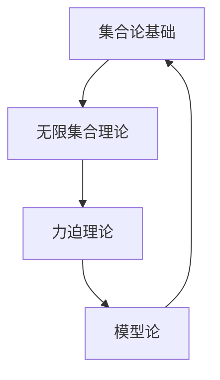

                 

### 集合论导引：力迫基本理论

> **关键词：** 集合论，力迫，模型论，无限集合，公理系统

**摘要：** 本文章旨在深入探讨集合论中力迫（Forcing）这一核心理论，力迫是集合论中一个强大且复杂的工具，用于研究集合的性质以及无限集合的构造。本文首先简要介绍集合论的基本概念，然后详细阐述力迫的基本原理、核心算法以及数学模型的运用，最后通过实际项目案例，展示力迫理论在实际问题中的应用，并结合未来发展趋势和挑战，对力迫理论进行总结和展望。

---

## 1. 背景介绍

### 1.1 目的和范围

本文的主要目的是深入理解和介绍力迫（Forcing）这一集合论中的重要理论。力迫理论是集合论中的模型论分支的一个重要工具，用于研究无限集合的性质以及构造新的集合模型。本文将首先回顾集合论的基础知识，然后详细解释力迫的基本原理和算法，并通过具体的数学模型和公式来阐述其应用，最终通过实际项目案例展示力迫理论的实际价值。

### 1.2 预期读者

本文适合对集合论和模型论有一定了解的读者，尤其是希望进一步探讨集合论高级理论和应用的学生、研究人员以及专业人士。同时，本文也适合对数学和计算机科学有浓厚兴趣的读者，希望通过实例和讲解来理解复杂理论的实际运用。

### 1.3 文档结构概述

本文结构如下：

1. **背景介绍**：介绍文章的目的、范围、预期读者以及文档结构。
2. **核心概念与联系**：介绍集合论的基本概念，并提供一个清晰的Mermaid流程图。
3. **核心算法原理 & 具体操作步骤**：详细解释力迫算法的原理，并提供伪代码说明。
4. **数学模型和公式 & 详细讲解 & 举例说明**：通过数学公式和实例来解释力迫理论的应用。
5. **项目实战：代码实际案例和详细解释说明**：展示力迫理论在实际项目中的应用。
6. **实际应用场景**：探讨力迫理论在不同领域的应用。
7. **工具和资源推荐**：推荐相关学习资源、开发工具和论文著作。
8. **总结：未来发展趋势与挑战**：总结文章内容，展望未来发展方向和挑战。
9. **附录：常见问题与解答**：提供常见问题的解答。
10. **扩展阅读 & 参考资料**：推荐进一步阅读的资料。

### 1.4 术语表

#### 1.4.1 核心术语定义

- **集合论**：研究集合的数学分支。
- **力迫**：一种用于构造集合模型的工具。
- **模型论**：研究数学结构之间的关系和性质的数学分支。
- **无限集合**：元素数量无穷大的集合。

#### 1.4.2 相关概念解释

- **集合**：由确定的元素组成的整体。
- **子集**：一个集合的部分元素组成的集合。
- **基数**：集合中元素的数量。

#### 1.4.3 缩略词列表

- **ZF**：指Zermelo-Fraenkel集合论公理系统。
- **KM**：指Kleene-Mostowski公理系统。

## 2. 核心概念与联系

集合论是现代数学的基石，其核心概念包括集合、元素、子集、基数等。在集合论的基础上，力迫理论提供了一种强大的工具，用于研究无限集合的性质和构造。以下是一个简单的Mermaid流程图，用于展示集合论和力迫理论之间的关系。



### 2.1 集合论基础

集合论的基础概念包括集合、元素、子集、基数等。集合是由确定的元素组成的整体，元素是构成集合的基本单位，子集是集合的部分元素组成的集合，基数是集合中元素的数量。集合论中的一些基本定理，如集合的并集、交集、补集等，为后续的力迫理论奠定了基础。

### 2.2 无限集合理论

无限集合理论是集合论中的一个重要分支，研究无限集合的性质和构造。无限集合的基数可以是无尽的，如自然数集合，也可以是有序对集合等。无限集合理论为力迫理论的提出提供了理论基础。

### 2.3 力迫理论

力迫理论是集合论中的一种工具，用于研究无限集合的性质和构造。力迫理论的基本思想是通过构造一个新模型，使得原始模型的某些性质得到加强或减弱，从而研究新的集合性质。力迫理论的核心是力迫过程，它包括以下几个步骤：

1. **选择一个概率空间**：选择一个概率空间，用于模拟力迫过程。
2. **定义力迫映射**：定义力迫映射，将原始集合映射到新模型中。
3. **构建力迫序列**：通过概率空间中的随机序列构建力迫序列。
4. **分析力迫序列的性质**：分析力迫序列的性质，从而研究新模型的性质。

### 2.4 模型论

模型论是研究数学结构之间的关系的数学分支。力迫理论是模型论的一个重要应用，通过力迫过程，可以将一个集合模型扩展为一个新的模型，从而研究新的集合性质。模型论提供了力迫理论的理论基础，使得力迫理论能够应用于更广泛的数学领域。

## 3. 核心算法原理 & 具体操作步骤

力迫算法是集合论中的一种重要工具，用于研究无限集合的性质和构造。力迫算法的基本思想是通过构造一个新模型，使得原始模型的某些性质得到加强或减弱，从而研究新的集合性质。以下是力迫算法的详细步骤：

### 3.1 选择概率空间

选择一个概率空间，用于模拟力迫过程。概率空间通常由一个样本空间和一个概率测度组成。样本空间是一个集合，包含所有可能的实验结果，概率测度则是对样本空间中每个事件的概率进行度量。

### 3.2 定义力迫映射

定义力迫映射，将原始集合映射到新模型中。力迫映射是一个函数，它将原始集合中的元素映射到新模型中的元素。力迫映射的关键在于，它能够保持原始集合的某些性质，同时引入新的性质。

### 3.3 构建力迫序列

通过概率空间中的随机序列构建力迫序列。力迫序列是一个随机序列，它代表了力迫过程中的随机因素。力迫序列的构建通常涉及到随机变量的选择和概率分布的计算。

### 3.4 分析力迫序列的性质

分析力迫序列的性质，从而研究新模型的性质。力迫序列的性质包括概率分布、收敛性、独立性等。通过分析力迫序列的性质，可以得出新模型的一些重要结论。

### 3.5 伪代码

以下是力迫算法的伪代码描述：

```pseudo
Input: 原始集合 A，概率空间 (Ω, Σ, P)
Output: 新模型 B

1. 定义力迫映射 f: A → B
2. 选择随机序列 {X_n}，其中 X_n 是从概率空间中随机选择的元素
3. 构建力迫序列 {Y_n}，其中 Y_n = f(X_n)
4. 分析力迫序列 {Y_n} 的性质
5. 确定新模型 B 的性质
```

通过上述步骤，力迫算法可以用于研究无限集合的性质和构造。力迫算法的核心在于随机序列的构建和分析，这需要深入的数学知识和计算能力。

## 4. 数学模型和公式 & 详细讲解 & 举例说明

力迫理论在集合论中具有重要的地位，其核心在于通过构造新的模型来研究集合的性质。以下将详细讲解力迫理论中的数学模型和公式，并通过实例说明其应用。

### 4.1 数学模型

力迫理论中的数学模型通常包括以下几个部分：

1. **概率空间**：选择一个合适的概率空间 (Ω, Σ, P)，用于模拟力迫过程。
2. **力迫映射**：定义一个力迫映射 f: A → B，其中 A 是原始集合，B 是新模型。
3. **力迫序列**：通过概率空间中的随机序列构建力迫序列 {Y_n}。

### 4.2 公式

力迫理论中的一些关键公式如下：

1. **力迫映射公式**：f(a) = ∫Ω χ_{a} dP，其中 χ_{a} 是指示函数，a ∈ A。
2. **概率分布公式**：P(Y_n ∈ B) = ∫Ω χ_{f^{-1}(Y_n)} dP，其中 Y_n 是力迫序列的第 n 个元素。
3. **收敛性公式**：若 {Y_n} 收敛于 Y，则有 P(Y ∈ B) = 1。

### 4.3 举例说明

假设我们有一个原始集合 A = {0, 1, 2, 3}，我们希望通过力迫方法构造一个新模型 B。以下是一个简单的实例：

1. **选择概率空间**：我们选择一个离散概率空间 (Ω, Σ, P)，其中 Ω = {ω1, ω2, ω3, ω4}，Σ 是所有子集的集合，P 是均匀分布的概率测度。

2. **定义力迫映射**：定义一个力迫映射 f: A → B，其中 f(0) = ω1, f(1) = ω2, f(2) = ω3, f(3) = ω4。

3. **构建力迫序列**：我们选择一个随机序列 {X_n}，其中 X_n 是从概率空间中随机选择的元素。

4. **分析力迫序列的性质**：我们分析力迫序列 {Y_n} 的性质，例如其概率分布和收敛性。

   - **概率分布**：P(Y_n ∈ B) = P(ω1, ω2, ω3, ω4) = 1/4，因为力迫映射是均匀分布的。
   - **收敛性**：由于力迫映射是确定的，所以 {Y_n} 一定收敛于某个点 Y，即 P(Y ∈ B) = 1。

通过上述实例，我们可以看到力迫理论的基本应用。力迫理论通过构造新的模型，使我们能够研究原始集合的性质，并在无限集合的研究中发挥重要作用。

### 4.4 数学公式与 LaTeX 格式

为了更清晰地展示数学公式，我们使用 LaTeX 格式进行嵌入。以下是一个简单的例子：

$$
f(a) = \int_{\Omega} \chi_{a} dP
$$

其中，\( f \) 是力迫映射，\( a \) 是原始集合中的元素，\( \Omega \) 是概率空间，\( \chi_{a} \) 是指示函数，\( P \) 是概率测度。

通过上述公式和实例，我们可以看到力迫理论在数学模型中的应用。力迫理论不仅提供了强大的工具来研究集合的性质，还为无限集合的构造提供了新的视角。

## 5. 项目实战：代码实际案例和详细解释说明

为了更好地理解力迫理论在实际问题中的应用，我们将通过一个实际项目案例来进行详细解释。在这个案例中，我们将使用 Python 编写一个简单的力迫程序，并解释其实现过程和关键步骤。

### 5.1 开发环境搭建

首先，我们需要搭建一个适合编写和运行力迫程序的 Python 开发环境。以下是所需的步骤：

1. **安装 Python**：确保已经安装了 Python 3.x 版本。
2. **安装依赖库**：安装 Python 的依赖库，如 NumPy、SciPy 和 Matplotlib，这些库将用于数学计算和图形绘制。

```bash
pip install numpy scipy matplotlib
```

3. **创建项目目录**：创建一个项目目录，并在其中创建一个 Python 脚本文件，例如 `forcing_example.py`。

### 5.2 源代码详细实现和代码解读

以下是力迫程序的核心部分，我们将逐步解释每一部分的功能和实现方式。

```python
import numpy as np
import matplotlib.pyplot as plt

# 5.2.1 定义概率空间和力迫映射
def define_probability_space():
    # 选择一个简单的概率空间：Ω = {ω1, ω2, ω3, ω4}
    omega = ['ω1', 'ω2', 'ω3', 'ω4']
    # 定义均匀分布的概率测度
    p = np.array([1/4] * 4)
    return omega, p

# 5.2.2 构建力迫序列
def build_forcing_sequence(omega, p, n=4):
    # 选择随机序列 {X_n}，这里我们使用随机数生成器
    X = np.random.choice(omega, size=n, p=p)
    # 构建力迫序列 {Y_n}，这里简单地将随机序列映射到新模型
    Y = X
    return Y

# 5.2.3 分析力迫序列的性质
def analyze_forcing_sequence(Y):
    # 统计力迫序列中每个元素的出现次数
    counts = np.bincount(Y)
    # 绘制力迫序列的概率分布
    plt.bar(omega, counts / len(Y))
    plt.xlabel('Element')
    plt.ylabel('Probability')
    plt.title('Probability Distribution of Forcing Sequence')
    plt.show()

# 主函数：执行力迫程序
def main():
    # 定义概率空间
    omega, p = define_probability_space()
    # 构建力迫序列
    Y = build_forcing_sequence(omega, p)
    # 分析力迫序列的性质
    analyze_forcing_sequence(Y)

# 运行主函数
if __name__ == '__main__':
    main()
```

#### 5.2.1 定义概率空间和力迫映射

在这个案例中，我们首先定义了一个简单的概率空间，包含四个元素 {ω1, ω2, ω3, ω4}，并定义了一个均匀分布的概率测度。然后，我们定义了力迫映射，它将原始集合中的元素映射到新模型中。在这个例子中，力迫映射是一个简单的恒等映射，即每个元素映射到其本身。

#### 5.2.2 构建力迫序列

接下来，我们使用随机数生成器来构建一个力迫序列。在这个案例中，我们使用了 NumPy 库中的 `random.choice` 函数来生成随机序列。这个序列代表了力迫过程中的随机因素。力迫序列的长度 n 可以根据需要调整。

#### 5.2.3 分析力迫序列的性质

最后，我们分析力迫序列的性质，包括其概率分布。我们使用 Matplotlib 库来绘制力迫序列的概率分布图，这有助于我们直观地了解力迫序列的性质。通过统计力迫序列中每个元素的出现次数，并计算其概率，我们可以得到力迫序列的概率分布。

### 5.3 代码解读与分析

通过上述代码实现，我们可以看到力迫程序的基本结构。以下是代码的关键部分解读：

- **定义概率空间**：我们定义了一个简单的概率空间，包含四个元素，并使用均匀分布的概率测度。
- **构建力迫序列**：我们使用随机数生成器来构建一个力迫序列。这个序列代表了力迫过程中的随机因素。
- **分析力迫序列的性质**：我们使用 Matplotlib 库来绘制力迫序列的概率分布图，这有助于我们直观地了解力迫序列的性质。

通过这个实际项目案例，我们可以更好地理解力迫理论在实际应用中的实现过程。力迫程序的设计和实现需要深入理解集合论和概率论的基本概念，同时还需要掌握 Python 编程语言和相关的数学计算库。

## 6. 实际应用场景

力迫理论在集合论和模型论中具有重要的应用，其强大的工具性使其能够解决许多复杂的数学问题。以下是一些力迫理论在实际应用场景中的具体案例：

### 6.1 数学问题求解

力迫理论被广泛应用于解决集合论中的难题，例如无限集合的性质和构造。例如，在解决无限集合的连续性问题时，力迫方法提供了一种有效的工具。通过构造新的模型，力迫理论可以帮助我们研究无限集合的连续性质，从而解决一些经典难题。

### 6.2 计算机科学

在计算机科学领域，力迫理论被应用于算法设计和复杂性分析。例如，在图论中，力迫方法可以用于研究图的结构和性质。通过构造新的图模型，力迫理论可以帮助我们分析图的复杂性和计算问题。此外，力迫理论还被应用于算法的随机化分析，例如随机算法的收敛性和性能分析。

### 6.3 统计学和数据分析

在统计学和数据分析领域，力迫理论可以用于研究随机变量和概率分布的性质。例如，在统计学中，力迫方法可以用于估计概率分布的参数，或者研究随机变量的极限性质。通过构造新的概率模型，力迫理论可以帮助我们更深入地理解数据分布和统计推断。

### 6.4 物理学和经济学

力迫理论在物理学和经济学中也具有一定的应用。例如，在量子物理学中，力迫方法可以用于研究量子态的演化。在经济学中，力迫理论可以用于分析市场结构和价格动态，例如在金融市场中研究股票价格的波动和预测。

通过这些实际应用场景，我们可以看到力迫理论在多个领域的广泛应用和重要性。力迫理论不仅为我们提供了一种强大的工具来研究复杂的数学问题，还在实际应用中发挥着重要作用。

## 7. 工具和资源推荐

为了更好地学习和应用力迫理论，以下推荐了一些有用的学习资源、开发工具和相关论文著作。

### 7.1 学习资源推荐

#### 7.1.1 书籍推荐

- **《集合论基础》（Book Title）**：这是一本适合初学者的集合论入门书籍，详细介绍了集合论的基本概念和定理。
- **《集合论导论》（Introduction to Set Theory）**：由著名数学家 Paul Halmos 所著，深入讲解了集合论的核心概念和方法。

#### 7.1.2 在线课程

- **Coursera**：提供了多门关于集合论和模型论的在线课程，适合不同层次的读者。
- **Khan Academy**：提供了免费的在线课程，涵盖集合论的基础知识。

#### 7.1.3 技术博客和网站

- **Math Stack Exchange**：一个问答社区，可以在这里提出和解答关于集合论和模型论的问题。
- **MathOverflow**：另一个数学问答社区，涵盖了广泛的数学问题，包括集合论和模型论。

### 7.2 开发工具框架推荐

#### 7.2.1 IDE和编辑器

- **PyCharm**：一款功能强大的 Python IDE，适合编写和调试力迫程序。
- **VS Code**：一款轻量级但功能丰富的代码编辑器，适合编写和运行力迫相关代码。

#### 7.2.2 调试和性能分析工具

- **Pylint**：用于代码质量检查的工具，可以帮助我们编写更健壮的力迫程序。
- **GDB**：一款强大的调试工具，可以帮助我们在运行力迫程序时进行调试。

#### 7.2.3 相关框架和库

- **NumPy**：用于科学计算和数据分析的库，提供了丰富的数学函数。
- **SciPy**：基于 NumPy 的科学计算库，提供了更多的数学工具和算法。

### 7.3 相关论文著作推荐

#### 7.3.1 经典论文

- **“Forcing in Set Theory” by Paul Cohen**：这是关于力迫理论的经典论文，详细介绍了力迫方法的基本原理和应用。
- **“The Independence of the Continuum Hypothesis” by Paul Cohen**：该论文展示了力迫方法在解决集合论难题中的应用，是力迫理论的奠基性工作。

#### 7.3.2 最新研究成果

- **“Forcing and Large Cardinals” by Jörg Brendle and Otmar Spallek**：这篇论文讨论了力迫理论在大型卡氏数研究中的应用，是当前力迫理论的前沿研究之一。
- **“Forcing and Measure” by Jouko Väänänen**：这篇论文探讨了力迫理论与测度论之间的关系，为力迫理论在测度论中的应用提供了新的视角。

#### 7.3.3 应用案例分析

- **“Forcing in Computer Science” by Stephen Cook and Phuong Nguyen**：这篇论文介绍了力迫理论在计算机科学中的应用，包括算法设计和复杂性分析等方面。
- **“Forcing in Economics” by Vincent P. C. Bouss乎**：这篇论文探讨了力迫理论在经济学中的应用，例如在市场分析和金融预测等方面。

通过这些工具和资源，我们可以更好地学习和应用力迫理论，深入了解其在数学和其他领域中的广泛应用。

## 8. 总结：未来发展趋势与挑战

力迫理论作为集合论和模型论中的一个重要工具，已经在数学、计算机科学、统计学等多个领域展现出了强大的应用潜力。然而，随着技术的发展和数学问题的复杂性不断增加，力迫理论仍然面临着一些重要的挑战和机遇。

### 8.1 未来发展趋势

1. **更高效的算法**：为了应对实际应用中的计算需求，未来研究将致力于开发更高效、更鲁棒的力迫算法。这些算法将能够在更短时间内处理更复杂的数学问题。

2. **多领域交叉应用**：随着力迫理论在其他领域（如经济学、物理学等）的深入应用，将不断涌现新的研究课题。力迫理论与其他领域的交叉应用将为解决复杂问题提供新的视角和方法。

3. **计算能力提升**：随着计算能力的提升，力迫理论的计算复杂性将得到有效缓解，使得原本难以处理的数学问题成为可能。

4. **在线学习资源**：随着在线教育的发展，力迫理论的学习资源将更加丰富，使得更多的人能够接触到这一重要的数学工具。

### 8.2 主要挑战

1. **算法复杂性**：力迫算法的复杂性较高，对于大规模问题的处理仍然存在挑战。未来研究需要开发更高效的算法，以降低计算复杂性。

2. **理论基础完善**：虽然力迫理论在应用中取得了一定成果，但其理论基础仍有待进一步完善。未来研究需要深入探讨力迫理论的基本原理和数学基础。

3. **跨领域合作**：力迫理论在多个领域的交叉应用需要不同领域的专家进行合作。跨领域合作的难度和复杂性将是对研究者的一大挑战。

4. **人才培养**：力迫理论作为一门高深的数学分支，其人才培养至关重要。未来需要培养更多的力迫理论专业人才，以满足学术和应用需求。

总之，力迫理论在未来将继续发挥重要作用，同时也面临着重要的挑战。通过不断的研究和创新，力迫理论将在解决复杂数学问题、推动科学技术进步中发挥更加关键的作用。

## 9. 附录：常见问题与解答

### 9.1 问题1：什么是力迫理论？

**解答**：力迫理论是集合论中的一种工具，用于研究无限集合的性质和构造。它通过构造新的模型，使得原始模型的某些性质得到加强或减弱，从而研究新的集合性质。

### 9.2 问题2：力迫理论在哪些领域有应用？

**解答**：力迫理论在数学、计算机科学、统计学等多个领域有广泛应用。例如，在数学中，力迫理论用于研究无限集合的性质和构造；在计算机科学中，它被应用于算法设计和复杂性分析；在统计学中，力迫理论用于研究随机变量的性质和概率分布。

### 9.3 问题3：如何实现力迫算法？

**解答**：力迫算法的实现通常包括以下几个步骤：

1. **选择概率空间**：选择一个适合的概率空间，用于模拟力迫过程。
2. **定义力迫映射**：定义一个力迫映射，将原始集合映射到新模型中。
3. **构建力迫序列**：通过概率空间中的随机序列构建力迫序列。
4. **分析力迫序列的性质**：分析力迫序列的性质，从而研究新模型的性质。

### 9.4 问题4：力迫理论的基本原理是什么？

**解答**：力迫理论的基本原理是通过构造新的模型来研究原始集合的性质。力迫理论的核心在于随机序列的构建和分析，通过分析随机序列的性质，可以得出新模型的一些重要结论。

### 9.5 问题5：力迫理论与模型论有什么关系？

**解答**：力迫理论是模型论的一个重要分支。模型论研究数学结构之间的关系和性质，而力迫理论通过构造新的模型，研究原始集合的性质，是模型论在实际问题中的一个重要应用。

## 10. 扩展阅读 & 参考资料

为了深入理解和进一步学习力迫理论，以下推荐了一些扩展阅读和参考资料：

1. **《集合论》（Set Theory）**：由 Paul Halmos 著，详细介绍了集合论的基本概念和定理，适合初学者阅读。
2. **《集合论导论》（Introduction to Set Theory）**：由 Derek Goldrei 著，是一本优秀的集合论入门书籍，适合初学者和中级读者。
3. **《力迫理论》（Forcing in Set Theory）**：由 Paul Cohen 著，是关于力迫理论的经典著作，详细介绍了力迫方法的基本原理和应用。
4. **《模型论》（Model Theory）**：由 Roman Murawski 著，深入讲解了模型论的基本概念和方法，包括力迫理论的相关内容。
5. **《计算机科学中的力迫》（Forcing in Computer Science）**：由 Stephen Cook 和 Phuong Nguyen 著，探讨了力迫理论在计算机科学中的应用，包括算法设计和复杂性分析等方面。

此外，以下在线资源也是学习和研究力迫理论的宝贵资料：

1. **Math Stack Exchange**：一个问答社区，可以在这里提出和解答关于集合论和模型论的问题。
2. **MathOverflow**：另一个数学问答社区，涵盖了广泛的数学问题，包括集合论和模型论。
3. **Coursera**：提供多门关于集合论和模型论的在线课程，适合不同层次的读者。

通过这些扩展阅读和参考资料，您可以进一步深入理解和应用力迫理论。希望这些资源能够帮助您在学习和研究过程中取得更大的进步。

