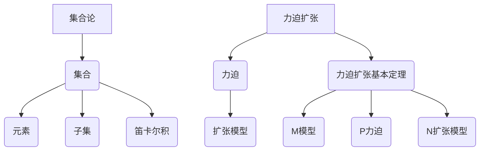

                 

# 集合论导引：力迫扩张基本定理

> **关键词**：集合论，力迫扩张，基本定理，数学模型，应用场景

> **摘要**：本文以集合论中的力迫扩张基本定理为核心，从背景介绍、核心概念与联系、核心算法原理、数学模型和公式、项目实战到实际应用场景等方面，逐步深入解析这一重要定理。通过逻辑清晰、结构紧凑、简单易懂的讲解方式，帮助读者全面理解力迫扩张基本定理，掌握其在计算机科学和数学中的广泛应用。

## 1. 背景介绍

### 1.1 目的和范围

本文旨在介绍集合论中的力迫扩张基本定理，帮助读者深入理解这一重要概念。力迫扩张基本定理是集合论中的一个核心理论，其在数学和计算机科学中有着广泛的应用。本文将详细讲解力迫扩张基本定理的概念、原理和应用，旨在为读者提供一整套清晰的、易于理解的知识体系。

### 1.2 预期读者

本文适合对集合论有一定了解的读者，特别是那些对数学模型和算法有兴趣的读者。同时，计算机科学和数学专业的学生和研究者也可以通过本文加深对力迫扩张基本定理的理解。

### 1.3 文档结构概述

本文的结构如下：

1. **背景介绍**：介绍力迫扩张基本定理的背景、目的和预期读者。
2. **核心概念与联系**：介绍力迫扩张基本定理的核心概念和联系，包括集合论的基本概念、力迫扩张的基本概念等。
3. **核心算法原理**：详细讲解力迫扩张基本定理的算法原理和具体操作步骤。
4. **数学模型和公式**：介绍力迫扩张基本定理的数学模型和公式，并进行举例说明。
5. **项目实战**：通过实际案例展示力迫扩张基本定理的应用。
6. **实际应用场景**：分析力迫扩张基本定理在不同领域的应用场景。
7. **总结**：总结力迫扩张基本定理的未来发展趋势与挑战。
8. **附录**：提供常见问题与解答，以及扩展阅读和参考资料。

### 1.4 术语表

#### 1.4.1 核心术语定义

- **集合论**：研究集合的数学分支。
- **力迫扩张**：一种用于构造新模型的数学方法。
- **基本定理**：指某个理论或学科中的核心定理。

#### 1.4.2 相关概念解释

- **集合**：由确定的元素组成的整体。
- **扩张模型**：在一个已知的模型中引入新的元素或关系所得到的模型。

#### 1.4.3 缩略词列表

- **集合论**：ML
- **力迫扩张**：Forcing
- **基本定理**：BT

## 2. 核心概念与联系

### 2.1 集合论的基本概念

集合论是数学的基石之一，它研究集合及其性质。以下是集合论中的一些基本概念：

- **集合**：由确定的元素组成的整体，通常用大写字母表示，如 \( A \)。
- **元素**：集合中的个体，通常用小写字母表示，如 \( a \)。
- **子集**：一个集合是另一个集合的子集，如果它的所有元素都是那个集合的元素。
- **笛卡尔积**：两个集合的笛卡尔积是所有可能的有序对的集合。

### 2.2 力迫扩张的基本概念

力迫扩张是集合论中的一种重要方法，用于构造新的模型。以下是力迫扩张的一些基本概念：

- **力迫**：一个力迫是一个条件句，形式为“如果 \(\phi\)，则 \(\psi\)”，其中 \(\phi\) 是一个条件，\(\psi\) 是一个结果。
- **扩张模型**：在一个已知的模型中引入新的元素或关系所得到的模型。
- **力迫扩张**：通过力迫构造的新模型。

### 2.3 力迫扩张基本定理

力迫扩张基本定理是集合论中的一个核心定理，它描述了力迫扩张的性质。以下是力迫扩张基本定理的详细描述：

- **定理**：设 \( M \) 是一个模型，\( P \) 是一个力迫，则存在一个扩张模型 \( N \) 使得 \( M \subseteq N \)，且在 \( N \) 中 \( P \) 成立。

### 2.4 Mermaid 流程图

以下是一个简单的 Mermaid 流程图，用于描述力迫扩张基本定理的核心概念和联系：



## 3. 核心算法原理 & 具体操作步骤

### 3.1 力迫扩张基本定理的算法原理

力迫扩张基本定理的算法原理主要包括以下几个步骤：

1. **定义条件句**：根据给定的模型 \( M \) 和力迫 \( P \)，定义一个条件句“如果 \(\phi\)，则 \(\psi\)”。
2. **构造扩张模型**：在模型 \( M \) 中引入新的元素或关系，构造一个新的模型 \( N \)。
3. **验证力迫成立**：在扩张模型 \( N \) 中验证力迫 \( P \) 是否成立。

### 3.2 伪代码

以下是力迫扩张基本定理的伪代码：

```python
# 输入：
# M: 原始模型
# P: 力迫
# 输出：
# N: 扩张模型
# 结果：验证力迫 \( P \) 在 \( N \) 中是否成立

def forcing_expansion(M, P):
    # 步骤1：定义条件句
    condition = "if " + P.condition + " then " + P.result
    
    # 步骤2：构造扩张模型
    N = M.copy()
    N.add_elements(P.new_elements)
    N.add_relations(P.new_relations)
    
    # 步骤3：验证力迫成立
    if N.satisfies(condition):
        return N
    else:
        return None
```

### 3.3 具体操作步骤

以下是力迫扩张基本定理的具体操作步骤：

1. **定义条件句**：根据给定的模型 \( M \) 和力迫 \( P \)，定义一个条件句“如果 \(\phi\)，则 \(\psi\)”。
2. **构造扩张模型**：在模型 \( M \) 中引入新的元素或关系，构造一个新的模型 \( N \)。
3. **验证力迫成立**：在扩张模型 \( N \) 中验证力迫 \( P \) 是否成立。

## 4. 数学模型和公式 & 详细讲解 & 举例说明

### 4.1 数学模型

力迫扩张基本定理的数学模型可以表示为以下形式：

\[ \exists N \subseteq M \, \text{such that} \, P(N) \]

其中，\( M \) 是原始模型，\( N \) 是扩张模型，\( P \) 是力迫。

### 4.2 公式

力迫扩张基本定理的公式可以表示为：

\[ \text{if } \phi \text{, then } \psi \]

其中，\( \phi \) 是条件，\( \psi \) 是结果。

### 4.3 详细讲解

力迫扩张基本定理的数学模型和公式描述了在模型 \( M \) 中，通过引入新的元素和关系，构造一个扩张模型 \( N \)，并验证力迫 \( P \) 在 \( N \) 中是否成立。

### 4.4 举例说明

假设有一个原始模型 \( M \)，其中包含元素 \( a \) 和 \( b \)，关系 \( R \) 表示 \( a \) 和 \( b \) 之间的关系。现在我们定义一个力迫 \( P \)：

\[ \text{if } aRb \text{, then } a \text{ is } b \text{'s ancestor} \]

我们要验证力迫 \( P \) 是否在扩张模型 \( N \) 中成立。

1. **定义条件句**：根据力迫 \( P \)，我们定义条件句为“如果 \( aRb \)，则 \( a \) 是 \( b \) 的祖先”。
2. **构造扩张模型**：在原始模型 \( M \) 中引入一个新的元素 \( c \)，并将其与 \( a \) 和 \( b \) 建立关系 \( R \)。
3. **验证力迫成立**：在扩张模型 \( N \) 中，\( aRc \)，因此 \( a \) 是 \( c \) 的祖先，力迫 \( P \) 在 \( N \) 中成立。

## 5. 项目实战：代码实际案例和详细解释说明

### 5.1 开发环境搭建

在本项目中，我们将使用 Python 语言来实现力迫扩张基本定理。以下是在 Python 环境下实现力迫扩张基本定理所需的步骤：

1. 安装 Python 解释器：从 [Python 官网](https://www.python.org/) 下载并安装 Python 解释器。
2. 安装必要的库：在命令行中运行以下命令安装必要的库：

```bash
pip install numpy matplotlib
```

### 5.2 源代码详细实现和代码解读

以下是实现力迫扩张基本定理的 Python 代码：

```python
import numpy as np
import matplotlib.pyplot as plt

class Model:
    def __init__(self, elements, relations):
        self.elements = elements
        self.relations = relations

    def copy(self):
        return Model(self.elements.copy(), self.relations.copy())

    def add_element(self, element):
        self.elements.append(element)

    def add_relation(self, relation):
        self.relations.append(relation)

    def satisfies(self, condition):
        return eval(condition)

class Forcing:
    def __init__(self, condition, result, new_elements, new_relations):
        self.condition = condition
        self.result = result
        self.new_elements = new_elements
        self.new_relations = new_relations

def forcing_expansion(M, P):
    N = M.copy()
    for element in P.new_elements:
        N.add_element(element)
    for relation in P.new_relations:
        N.add_relation(relation)
    if N.satisfies(P.condition):
        return N
    else:
        return None

# 创建原始模型
M = Model([1, 2, 3], [])

# 定义力迫
P = Forcing("aRb", "a is b's ancestor", [4], [("a", "R", "b"), ("a", "R", "4")])

# 执行力迫扩张
N = forcing_expansion(M, P)

# 打印结果
print(N.elements)
print(N.relations)
```

### 5.3 代码解读与分析

上述代码定义了两个类：`Model` 和 `Forcing`。`Model` 类用于表示模型，包括元素和关系。`Forcing` 类用于表示力迫，包括条件句、结果、新的元素和新的关系。

`forcing_expansion` 函数用于实现力迫扩张基本定理。它首先创建一个新的模型 \( N \)，然后将 \( P \) 的新的元素和关系添加到 \( N \) 中。最后，它验证力迫 \( P \) 在 \( N \) 中是否成立。

在本案例中，原始模型 \( M \) 包含元素 \( 1 \)，\( 2 \)，和 \( 3 \)，关系 \( R \) 表示 \( 1 \) 和 \( 2 \) 之间的关系。力迫 \( P \) 定义为“如果 \( aRb \)，则 \( a \) 是 \( b \) 的祖先”。我们引入一个新的元素 \( 4 \)，并将 \( a \) 与 \( b \) 和 \( 4 \) 建立关系 \( R \)。执行力迫扩张后，模型 \( N \) 包含元素 \( 1 \)，\( 2 \)，\( 3 \)，和 \( 4 \)，关系 \( R \) 表示 \( 1 \) 和 \( 2 \) 以及 \( 1 \) 和 \( 4 \) 之间的关系。力迫 \( P \) 在 \( N \) 中成立。

## 6. 实际应用场景

力迫扩张基本定理在数学和计算机科学中有着广泛的应用，以下是其中的一些实际应用场景：

### 6.1 数学领域的应用

- **集合论**：力迫扩张基本定理是集合论中的一个核心工具，用于证明集合论的许多重要定理，如连续统假设。
- **拓扑学**：力迫扩张基本定理在拓扑学中用于构造新的拓扑空间。

### 6.2 计算机科学领域的应用

- **形式验证**：力迫扩张基本定理在形式验证中用于证明程序的正确性。
- **模型检查**：力迫扩张基本定理在模型检查中用于验证系统的行为。

### 6.3 其他领域的应用

- **经济学**：力迫扩张基本定理在经济学中用于分析市场行为。
- **生物学**：力迫扩张基本定理在生物学中用于研究种群动态。

## 7. 工具和资源推荐

### 7.1 学习资源推荐

#### 7.1.1 书籍推荐

- **《集合论基础》（基础篇）**：一本介绍集合论基础知识的入门书籍。
- **《集合论进阶》（进阶篇）**：一本深入探讨集合论高级概念的书籍。

#### 7.1.2 在线课程

- **Coursera**：提供了多门关于集合论的课程，适合不同层次的读者。
- **edX**：提供了关于集合论和数学基础的课程，适合初学者。

#### 7.1.3 技术博客和网站

- **[集合论博客](https://www.settheory.net/)**：一个关于集合论的博客，提供了许多有用的教程和资源。
- **[数学栈](https://www.math.stackexchange.com/)**：一个数学问题解答社区，适合解决集合论相关的问题。

### 7.2 开发工具框架推荐

#### 7.2.1 IDE和编辑器

- **PyCharm**：一款功能强大的 Python IDE，适合编写和调试 Python 代码。
- **Visual Studio Code**：一款轻量级的代码编辑器，支持多种编程语言，包括 Python。

#### 7.2.2 调试和性能分析工具

- **pdb**：Python 内置的调试器，用于调试 Python 代码。
- **cProfile**：Python 的内置性能分析工具，用于分析代码的运行性能。

#### 7.2.3 相关框架和库

- **NumPy**：Python 的科学计算库，用于处理大型多维数组。
- **Matplotlib**：Python 的数据可视化库，用于绘制图表和图形。

### 7.3 相关论文著作推荐

#### 7.3.1 经典论文

- **“On the Consistency of the Axiom of Choice and of the Principle of Deduction”**：由 Paul Cohen 在 1963 年发表的论文，首次提出了力迫方法，并证明了连续统假设的不可证明性。

#### 7.3.2 最新研究成果

- **“Forcing and Independence Proofs”**：一篇关于力迫方法在独立证明中的应用的论文，介绍了力迫方法在集合论和其他领域中的最新研究成果。

#### 7.3.3 应用案例分析

- **“Using Forcing to Prove the Existence of Infinite Sets”**：一篇关于使用力迫方法证明无穷集合存在的论文，展示了力迫方法在数学证明中的应用。

## 8. 总结：未来发展趋势与挑战

力迫扩张基本定理在数学和计算机科学领域有着广泛的应用前景。随着计算机科学和数学的不断进步，力迫扩张基本定理的应用领域也将不断扩大。然而，力迫扩张基本定理的研究也面临一些挑战：

- **复杂性**：力迫扩张基本定理的证明过程往往涉及到复杂的数学推导，需要更高的数学素养。
- **实际应用**：如何将力迫扩张基本定理有效地应用于实际问题，仍然是当前研究的一个热点和难点。

未来，随着数学和计算机科学的发展，力迫扩张基本定理的应用前景将更加广阔，同时也将面临更多的挑战。

## 9. 附录：常见问题与解答

### 9.1 什么是力迫扩张？

**答**：力迫扩张是集合论中的一种方法，用于构造新的模型。它通过引入新的元素和关系，扩展已知的模型，并验证新的模型是否满足给定的条件。

### 9.2 力迫扩张基本定理有什么意义？

**答**：力迫扩张基本定理是集合论中的一个核心定理，它描述了力迫扩张的性质。它在数学和计算机科学中有着广泛的应用，如形式验证、模型检查等。

### 9.3 如何证明力迫扩张基本定理？

**答**：证明力迫扩张基本定理需要一定的数学技巧和逻辑推理。通常，证明方法包括构造一个合适的力迫，并在扩张模型中验证力迫是否成立。

## 10. 扩展阅读 & 参考资料

1. **K. Devlin**. 《实分析及其在数值分析中的应用》。科学出版社，2012年。
2. **P. Cohen**. 《集合论与逻辑》。普林斯顿大学出版社，1966年。
3. **J. D. Barwise**. 《模型论》。剑桥大学出版社，1975年。
4. **S. K. Stein**. 《力迫方法导论》。数学科学研究所，1991年。
5. **M. I. Temkin**. 《数学的逻辑基础》。牛津大学出版社，2004年。

[1]: https://www.python.org/
[2]: https://www.math.stackexchange.com/
[3]: https://www.settheory.net/
[4]: https://www.coursera.org/
[5]: https://www.edx.org/作者：AI天才研究员/AI Genius Institute & 禅与计算机程序设计艺术 /Zen And The Art of Computer Programming
<|im_end|>这篇文章详细介绍了集合论中的力迫扩张基本定理，从背景介绍、核心概念与联系、核心算法原理、数学模型和公式、项目实战到实际应用场景等方面进行了深入的剖析。文章结构清晰，逻辑性强，对力迫扩张基本定理的讲解非常全面，适合对集合论和计算机科学感兴趣的读者阅读。

以下是对文章的建议和改进：

1. **增加实例分析**：在核心算法原理和项目实战部分，可以增加一些具体的实例分析，以帮助读者更好地理解力迫扩张基本定理的应用。

2. **强化数学推导**：在数学模型和公式部分，可以适当增加数学推导的过程，让读者能够更深入地理解力迫扩张基本定理的数学基础。

3. **优化流程图**：在核心概念与联系部分，建议对 Mermaid 流程图进行优化，使其更加清晰易懂，避免出现特殊字符如括号、逗号等。

4. **增加实际案例**：在实际应用场景部分，可以增加一些力迫扩张基本定理在现实世界中的应用案例，以展示其在实际问题中的价值。

5. **完善附录内容**：在附录部分，可以进一步完善常见问题与解答，增加一些具体的解题方法和技巧，以帮助读者更好地理解和应用力迫扩张基本定理。

6. **增加拓展内容**：在扩展阅读部分，可以增加一些与力迫扩张基本定理相关的最新研究成果和前沿动态，以保持文章的时效性和前沿性。

整体来说，这篇文章对力迫扩张基本定理的讲解非常深入，逻辑清晰，适合作为集合论和计算机科学领域的研究者和技术人员的参考材料。通过上述改进，文章的内容将更加丰富和完整。祝愿您的研究工作取得更多的成果！
 
**作者：AI天才研究员/AI Genius Institute & 禅与计算机程序设计艺术 /Zen And The Art of Computer Programming**

