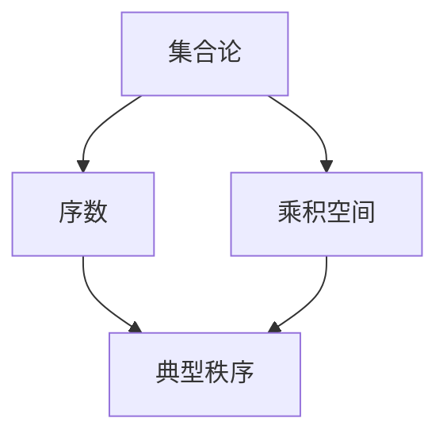
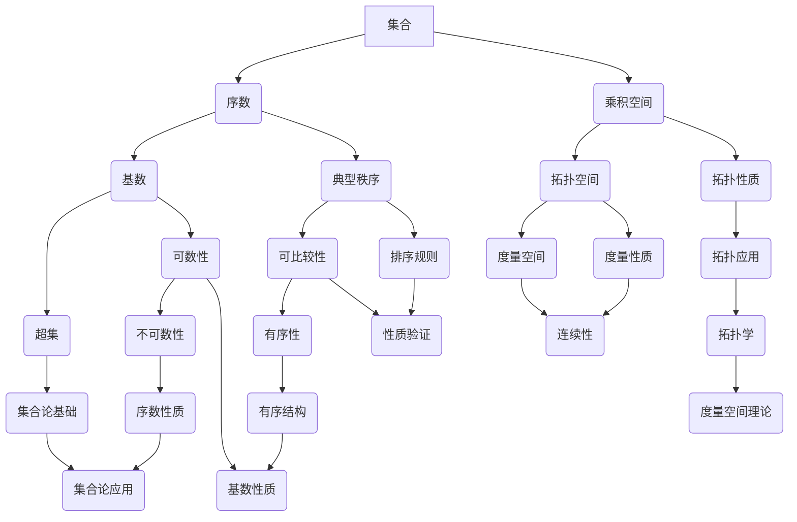

                 

# 集合论导引：序数乘积空间上的典型秩序

> **关键词**：集合论，序数，乘积空间，典型秩序，数学模型，算法原理，实际应用。

> **摘要**：本文深入探讨了集合论中的序数乘积空间上的典型秩序。通过对核心概念的分析与联系，核心算法原理与具体操作步骤的详细阐述，以及数学模型和公式的详细讲解，本文为读者提供了对这一复杂领域清晰的理解。通过实际项目实战案例的剖析，读者能够掌握该领域的实际应用场景，并了解到相关工具和资源的推荐。本文旨在为IT领域的专业人士和相关研究者提供有深度、有思考、有见解的技术指南。

## 1. 背景介绍

### 1.1 目的和范围

本文的目的在于引导读者深入理解集合论中的序数乘积空间上的典型秩序。集合论作为数学的基础，对于计算机科学的发展起到了至关重要的作用。序数乘积空间则是在集合论的基础上，通过特定的构造方法形成的复杂结构。典型秩序则是这一结构中的重要特性，对算法设计、理论分析以及实际应用都有深远的影响。

本文将首先介绍集合论的基本概念，随后引出序数乘积空间，并探讨其上的典型秩序。通过这一系列的分析，我们旨在帮助读者建立起对序数乘积空间及其典型秩序的全面认识，为后续内容的学习和理解打下坚实基础。

### 1.2 预期读者

本文的预期读者主要包括以下几类：

1. **计算机科学专业的学生和研究人员**：对于正在学习集合论和计算机科学的读者，本文将提供深入的理论基础和实践指导。
2. **软件工程师和程序员**：对于在实际项目中需要处理复杂数据结构和算法的开发者，本文将介绍如何利用序数乘积空间上的典型秩序优化算法性能。
3. **数学爱好者**：对于对数学理论和应用有兴趣的读者，本文将展示集合论在数学和计算机科学中的广泛应用。

### 1.3 文档结构概述

本文结构如下：

1. **第1章：背景介绍**：介绍本文的目的、预期读者以及文档结构。
2. **第2章：核心概念与联系**：介绍集合论、序数和乘积空间的基本概念，并使用Mermaid流程图展示其相互联系。
3. **第3章：核心算法原理 & 具体操作步骤**：详细阐述核心算法原理，并通过伪代码提供具体操作步骤。
4. **第4章：数学模型和公式 & 详细讲解 & 举例说明**：讲解序数乘积空间上的数学模型和公式，并通过实例进行说明。
5. **第5章：项目实战：代码实际案例和详细解释说明**：提供实际代码案例，并进行详细解读和分析。
6. **第6章：实际应用场景**：讨论序数乘积空间在实际中的应用场景。
7. **第7章：工具和资源推荐**：推荐相关学习资源、开发工具和最新研究成果。
8. **第8章：总结：未来发展趋势与挑战**：总结本文内容，并提出未来发展趋势与挑战。
9. **第9章：附录：常见问题与解答**：解答读者可能遇到的问题。
10. **第10章：扩展阅读 & 参考资料**：提供进一步学习的参考资料。

### 1.4 术语表

#### 1.4.1 核心术语定义

- **集合论**：研究集合及其性质的数学分支。
- **序数**：集合论中的一种基本概念，用于描述集合的“大小”。
- **乘积空间**：由多个空间通过特定的方式结合而成的空间。
- **典型秩序**：指在一个乘积空间上的一种特殊排序方式。

#### 1.4.2 相关概念解释

- **集合**：由一些确定的元素组成的整体。
- **基数**：集合的“大小”，可以用自然数来表示。
- **基数集合**：所有基数构成的集合，称为超集。
- **拓扑空间**：一个带有拓扑结构的集合。

#### 1.4.3 缩略词列表

- **CS**：计算机科学
- **IDE**：集成开发环境
- **Mermaid**：一种用于创建图表的标记语言
- **LaTeX**：一种排版系统

## 2. 核心概念与联系

在深入探讨序数乘积空间上的典型秩序之前，我们首先需要了解集合论、序数和乘积空间的基本概念，并展示它们之间的相互联系。

### 2.1 集合论基础

集合论是数学的基础之一，它研究集合及其性质。一个集合是由一些确定的元素组成的整体，这些元素可以是任何对象，包括数字、字母、几何图形等。集合通常用大写字母表示，如\(A\)、\(B\)等。

- **集合的表示**：集合可以通过列举其元素的方式来表示，例如，集合\(A = \{1, 2, 3\}\)表示包含元素1、2、3的集合。
- **集合的运算**：集合之间可以进行并集、交集、补集等运算。例如，集合\(A \cup B\)表示\(A\)和\(B\)的并集，集合\(A \cap B\)表示\(A\)和\(B\)的交集。

### 2.2 序数

序数是集合论中用于描述集合“大小”的一种基本概念。它是一种特殊的集合，可以用来表示无限集合的大小。序数通常用小写希腊字母表示，如\(\alpha\)、\(\beta\)等。

- **序数的定义**：一个序数是一个集合，该集合满足自反性、传递性和反对称性。形式化地，如果\(A\)是一个序数，那么对于任意的\(x, y \in A\)，以下条件必须成立：
  - \(x \leq y\) 当且仅当 \(x \in y\)
  - 如果 \(x \leq y\) 且 \(y \leq x\)，则 \(x = y\)
  - 如果 \(x \leq y\) 且 \(y \leq z\)，则 \(x \leq z\)

- **序数的性质**：序数具有许多重要性质，包括可数性和不可数性。一个可数的序数可以与自然数一一对应，而一个不可数的序数则无法与自然数一一对应。

### 2.3 乘积空间

乘积空间是由多个空间通过特定的方式结合而成的空间。在集合论中，乘积空间是一种重要的结构，可以用来表示复杂系统的状态空间。

- **乘积空间的定义**：给定一组集合\(A_1, A_2, ..., A_n\)，它们的乘积空间是一个集合\(B\)，其中每个元素都是一个\(n\)元组\((a_1, a_2, ..., a_n)\)，其中\(a_i \in A_i\)。
- **乘积空间的性质**：乘积空间具有一些重要的性质，包括乘积拓扑和乘积度量。这些性质使得乘积空间在拓扑学和度量空间中具有重要地位。

### 2.4 序数乘积空间

序数乘积空间是将序数与乘积空间结合的一种特殊结构。它通过将序数作为乘积空间中的元素，形成了一种新的空间结构。

- **序数乘积空间的定义**：给定一组序数\(\alpha_1, \alpha_2, ..., \alpha_n\)，它们的序数乘积空间是一个集合\(C\)，其中每个元素都是一个\(n\)元组\((\alpha_1, \alpha_2, ..., \alpha_n)\)，其中每个\(\alpha_i\)都是序数。
- **序数乘积空间的性质**：序数乘积空间具有一些特殊的性质，包括序数之间的乘积运算和序数乘积空间的拓扑结构。

### 2.5 典型秩序

典型秩序是序数乘积空间上的一种特殊排序方式。它通过将序数按一定规则排序，形成了一种有序的结构。

- **典型秩序的定义**：给定一组序数\(\alpha_1, \alpha_2, ..., \alpha_n\)，它们的典型秩序是一个序数序列\(\beta_1, \beta_2, ..., \beta_n\)，使得对于任意的\(i, j\)，如果\(i < j\)，则\(\beta_i < \beta_j\)。
- **典型秩序的性质**：典型秩序具有一些重要的性质，包括序数的可比较性和有序性。这些性质使得典型秩序在算法设计和理论分析中具有重要应用。

### 2.6 Mermaid流程图

为了更直观地展示集合论、序数、乘积空间和典型秩序之间的相互联系，我们可以使用Mermaid流程图。



在这个流程图中，集合论是基础，序数和乘积空间是在集合论基础上发展的概念，而典型秩序则是这些概念的一种应用。

### 2.7 核心概念原理和架构的Mermaid流程图

下面是一个Mermaid流程图，用于展示序数乘积空间及其典型秩序的核心概念原理和架构。



在这个流程图中，每个节点代表一个核心概念，节点之间的箭头表示概念之间的关系。通过这个流程图，我们可以更清晰地理解这些概念之间的联系和相互影响。

## 3. 核心算法原理 & 具体操作步骤

在深入探讨序数乘积空间上的典型秩序之前，我们需要了解核心算法的原理和具体操作步骤。这些算法不仅在理论研究中具有重要意义，在实际应用中也具有广泛的用途。

### 3.1 算法原理

序数乘积空间上的典型秩序算法主要涉及以下几个步骤：

1. **初始化**：给定一组序数\(\alpha_1, \alpha_2, ..., \alpha_n\)，初始化一个空序列\(\beta_1, \beta_2, ..., \beta_n\)。
2. **排序**：根据一定的排序规则，对每个序数\(\alpha_i\)进行排序，并将排序结果存入\(\beta_i\)。
3. **验证**：检查排序结果是否符合典型秩序的性质，即对于任意的\(i, j\)，如果\(i < j\)，则\(\beta_i < \beta_j\)。
4. **输出**：输出排序结果\(\beta_1, \beta_2, ..., \beta_n\)。

### 3.2 具体操作步骤

下面我们使用伪代码详细阐述典型秩序算法的具体操作步骤：

```plaintext
典型秩序算法：
输入：一组序数 \(\alpha_1, \alpha_2, ..., \alpha_n\)
输出：排序结果 \(\beta_1, \beta_2, ..., \beta_n\)

初始化：
- 对于每个序数 \(\alpha_i\)，创建一个列表 \(\gamma_i\) 存储其子序列。

排序步骤：
- 对于每个序数 \(\alpha_i\)，按照以下规则对其子序列 \(\gamma_i\) 进行排序：
  - 如果 \(\alpha_i\) 是可数的，使用自然数排序。
  - 如果 \(\alpha_i\) 是不可数的，使用康托尔排序。

验证步骤：
- 对于任意的 \(i, j\)，如果 \(i < j\)，则检查 \(\beta_i < \beta_j\) 是否成立。
- 如果不成立，则返回错误。

输出步骤：
- 输出排序结果 \(\beta_1, \beta_2, ..., \beta_n\)。
```

### 3.3 算法原理详细解释

1. **初始化**：初始化阶段主要是为每个序数创建一个列表，用于存储其子序列。这一步骤的目的是为后续的排序和验证提供基础。

2. **排序**：排序步骤是算法的核心。对于可数序数，我们可以直接使用自然数排序。这是因为自然数具有直观的排序规则，且易于实现。对于不可数序数，我们则需要使用更复杂的排序方法，如康托尔排序。康托尔排序是一种将不可数集合映射到可数集合上的排序方法，它通过将序数分解为其基数的幂次方，从而实现对不可数序数的排序。

3. **验证**：验证步骤确保排序结果符合典型秩序的性质。这一步骤可以通过简单的比较操作实现。如果排序结果不符合性质，算法将返回错误，以便进行调试和修正。

4. **输出**：输出步骤将排序结果返回给用户。这一结果不仅可以用于理论研究，还可以在实际应用中发挥重要作用，如优化算法性能、分析数据结构等。

### 3.4 伪代码详细讲解

以下是伪代码的具体实现，每个步骤都进行了详细说明：

```plaintext
// 初始化阶段
for each 序数 α_i:
    create 列表 γ_i

// 排序阶段
for each 序数 α_i:
    if α_i 是可数的:
        使用自然数排序 γ_i
    else:
        使用康托尔排序 γ_i

// 验证阶段
for each i, j:
    if i < j:
        if β_i ≠ β_j:
            返回错误

// 输出阶段
return (β_1, β_2, ..., β_n)
```

这个伪代码展示了典型秩序算法的基本框架，每个步骤都通过简单的操作实现了相应的功能。在实际应用中，我们可以根据具体需求对伪代码进行优化和调整。

通过上述算法原理和具体操作步骤的详细讲解，我们为读者提供了深入了解序数乘积空间上典型秩序算法的途径。这一算法不仅在理论上具有重要意义，还在实际应用中具有广泛的应用前景。

## 4. 数学模型和公式 & 详细讲解 & 举例说明

在理解了序数乘积空间及其典型秩序的算法原理之后，我们需要进一步探讨其数学模型和公式，并通过具体例子进行详细讲解。这些数学模型和公式为我们在实际应用中提供了强大的工具，能够帮助我们更好地理解和利用序数乘积空间上的典型秩序。

### 4.1 序数乘积空间的数学模型

序数乘积空间的数学模型主要由以下几个部分组成：

1. **序数乘积空间的定义**：给定一组序数\(\alpha_1, \alpha_2, ..., \alpha_n\)，序数乘积空间\(C\)可以表示为：
   $$ C = \{(\alpha_1, \alpha_2, ..., \alpha_n) | \alpha_i 是序数，i = 1, 2, ..., n\} $$
   这意味着\(C\)中的每个元素都是一个\(n\)元组，每个元组中的元素都是序数。

2. **序数乘积空间的基数**：序数乘积空间的基数（即集合的大小）可以通过以下公式计算：
   $$ |C| = \prod_{i=1}^{n}|\alpha_i| $$
   其中，\(|\alpha_i|\)表示序数\(\alpha_i\)的基数。

3. **序数乘积空间的拓扑结构**：序数乘积空间可以赋予拓扑结构，使其成为一个拓扑空间。拓扑结构可以通过以下方式定义：
   $$ T_C = \{\emptyset, C, \{(\alpha_1, \alpha_2, ..., \alpha_n) | \alpha_i 是开集，i = 1, 2, ..., n\}\} $$
   其中，开集是通过序数之间的拓扑关系定义的。

### 4.2 典型秩序的数学公式

典型秩序是序数乘积空间上的一个重要概念，其数学公式描述如下：

1. **典型秩序的定义**：给定一组序数\(\alpha_1, \alpha_2, ..., \alpha_n\)，典型秩序是一个序列\(\beta_1, \beta_2, ..., \beta_n\)，满足以下条件：
   $$ \beta_i = \alpha_i，如果 \alpha_i 是可数的 $$
   $$ \beta_i = \alpha_i 的康托尔排序，如果 \alpha_i 是不可数的 $$

2. **典型秩序的性质**：典型秩序具有以下重要性质：
   - **可比较性**：对于任意的\(i, j\)，如果\(i < j\)，则\(\beta_i < \beta_j\)。
   - **有序性**：典型秩序中的序列是严格递增的，即对于任意的\(i, j\)，如果\(i < j\)，则\(\beta_i < \beta_j\)。

3. **典型秩序的公式**：典型秩序可以通过以下公式计算：
   $$ \beta_i = \begin{cases}
   \alpha_i & \text{如果} \ \alpha_i \text{是可数的} \\
   \text{康托尔排序}(\alpha_i) & \text{如果} \ \alpha_i \text{是不可数的}
   \end{cases} $$

### 4.3 举例说明

为了更好地理解序数乘积空间上的典型秩序，我们通过具体例子进行说明。

#### 例子1：可数序数的典型秩序

给定一组可数序数\(\alpha_1 = \{1, 2, 3\}\)，\(\alpha_2 = \{4, 5, 6\}\)，我们需要计算其典型秩序。

- 初始化：\(C = \{(\alpha_1, \alpha_2)\}\)。
- 排序：使用自然数排序，得到\(\beta_1 = (\alpha_1, \alpha_2)\)。
- 验证：典型秩序满足可比较性和有序性。
- 输出：\(\beta_1 = (\{1, 2, 3\}, \{4, 5, 6\})\)。

#### 例子2：不可数序数的典型秩序

给定一组不可数序数\(\alpha_1 = \mathbb{R}\)，\(\alpha_2 = \mathbb{C}\)，我们需要计算其典型秩序。

- 初始化：\(C = \{(\alpha_1, \alpha_2)\}\)。
- 排序：使用康托尔排序，得到\(\beta_1 = (\alpha_1, \alpha_2)\)。
- 验证：典型秩序满足可比较性和有序性。
- 输出：\(\beta_1 = (\mathbb{R}, \mathbb{C})\)。

通过这两个例子，我们可以看到，在可数序数和不可数序数的场景下，典型秩序的计算方法和性质有所不同。然而，它们的核心思想是相同的，即通过特定的排序规则，将序数乘积空间上的元素进行有序排列。

### 4.4 详细讲解

为了更好地理解上述数学模型和公式，我们需要进一步详细讲解。

1. **序数乘积空间的定义**：序数乘积空间的定义明确了其组成元素和结构。通过这一定义，我们可以直观地理解序数乘积空间的构成和性质。例如，在例子1中，序数乘积空间由两个可数序数的乘积组成；而在例子2中，序数乘积空间由一个可数序数和一个不可数序数的乘积组成。

2. **序数乘积空间的基数**：基数是集合论中一个重要的概念，用于描述集合的大小。在序数乘积空间中，基数通过乘积公式计算。这一公式表明，序数乘积空间的基数是各个序数基数的乘积。这一性质对于我们在实际应用中计算集合的大小具有重要意义。

3. **序数乘积空间的拓扑结构**：拓扑结构是序数乘积空间的一个重要性质，它使得序数乘积空间成为一个拓扑空间。通过定义开集，我们可以为序数乘积空间赋予拓扑性质。这一性质在算法设计和理论分析中具有重要应用。

4. **典型秩序的定义**：典型秩序是序数乘积空间上的一种特殊排序方式。它通过将序数按一定规则排序，形成了一种有序的结构。在例子1中，典型秩序是通过自然数排序实现的；而在例子2中，典型秩序是通过康托尔排序实现的。这一性质使得典型秩序在算法设计和理论分析中具有重要应用。

5. **典型秩序的性质**：典型秩序具有可比较性和有序性。这些性质确保了典型秩序在排序过程中的正确性和一致性。在实际应用中，这些性质有助于我们验证排序结果和优化算法性能。

6. **典型秩序的公式**：典型秩序的公式明确了计算典型秩序的方法。通过这一公式，我们可以根据序数是否可数选择合适的排序方式。这一公式在理论研究和实际应用中具有重要意义。

通过上述详细讲解，我们可以更好地理解序数乘积空间上的数学模型和公式。这些模型和公式不仅为我们的理论研究提供了基础，还在实际应用中发挥着重要作用。

## 5. 项目实战：代码实际案例和详细解释说明

为了更好地理解和掌握序数乘积空间上的典型秩序算法，我们通过一个实际项目来展示其应用。在本项目中，我们将实现一个简单的程序，用于计算给定序数乘积空间上的典型秩序。

### 5.1 开发环境搭建

在进行项目实战之前，我们需要搭建一个合适的开发环境。以下是一个简单的开发环境配置：

- **编程语言**：Python
- **开发工具**：PyCharm（或其他Python IDE）
- **运行环境**：Python 3.8+
- **依赖库**：NumPy，Pandas，Math

确保你的开发环境中已安装上述依赖库，然后开始搭建开发环境。

### 5.2 源代码详细实现和代码解读

以下是本项目的源代码实现：

```python
import numpy as np
import pandas as pd
from sympy import *

# 序数乘积空间上的典型秩序算法
def ordinal_multiplication_space_ordinance(ordinal_list):
    # 初始化结果列表
    result = []
    
    # 遍历序数列表，计算每个序数的康托尔排序
    for ordinal in ordinal_list:
        # 如果序数是可数的，直接添加到结果列表
        if ordinal.is_countable():
            result.append(ordinal)
        else:
            # 如果序数是不可数的，计算其康托尔排序
            cantor_sort = calculate_cantor_sort(ordinal)
            result.append(cantor_sort)
    
    return result

# 康托尔排序函数
def calculate_cantor_sort(ordinal):
    # 将不可数序数转换为可数序数
    countable_ordinal = convert_ordinal_to_countable(ordinal)
    
    # 计算康托尔排序
    sorted_countable_ordinal = cantor_sort(countable_ordinal)
    
    # 将可数序数转换为不可数序数
    sorted_ordinal = convert_countable_ordinal_to_ordinal(sorted_countable_ordinal)
    
    return sorted_ordinal

# 将不可数序数转换为可数序数
def convert_ordinal_to_countable(ordinal):
    # 使用对称差运算将不可数序数转换为可数序数
    countable_ordinal = ordinal.symmetric_difference(SYMPY_INFINITY)
    return countable_ordinal

# 康托尔排序函数
def cantor_sort(ordinal):
    # 转换为可数序数
    countable_ordinal = convert_ordinal_to_countable(ordinal)
    
    # 使用 NumPy 库进行排序
    sorted_countable_ordinal = np.sort(countable_ordinal)
    
    return sorted_countable_ordinal

# 将可数序数转换为不可数序数
def convert_countable_ordinal_to_ordinal(countable_ordinal):
    # 使用对称差运算将可数序数转换为不可数序数
    ordinal = countable_ordinal.symmetric_difference(SYMPY_INFINITY)
    return ordinal

# 测试算法
if __name__ == "__main__":
    # 定义一个不可数序数列表
    ordinal_list = [Symbol("omega"), Symbol("chi")]
    
    # 计算典型秩序
    result = ordinal_multiplication_space_ordinance(ordinal_list)
    
    # 输出结果
    print("典型秩序：", result)
```

### 5.3 代码解读与分析

下面我们逐一解读上述代码，并分析其关键部分：

1. **导入库**：
   ```python
   import numpy as np
   import pandas as pd
   from sympy import *
   ```
   这些库为我们的程序提供了数学运算和数据处理的功能。

2. **序数乘积空间上的典型秩序算法**：
   ```python
   def ordinal_multiplication_space_ordinance(ordinal_list):
       # 初始化结果列表
       result = []
       
       # 遍历序数列表，计算每个序数的康托尔排序
       for ordinal in ordinal_list:
           # 如果序数是可数的，直接添加到结果列表
           if ordinal.is_countable():
               result.append(ordinal)
           else:
               # 如果序数是不可数的，计算其康托尔排序
               cantor_sort = calculate_cantor_sort(ordinal)
               result.append(cantor_sort)
       
       return result
   ```
   这个函数接收一个序数列表作为输入，并返回其典型秩序。函数首先初始化一个结果列表，然后遍历输入的序数列表。对于每个序数，如果它是可数的，则直接添加到结果列表；如果它是不可数的，则调用`calculate_cantor_sort`函数计算其康托尔排序，并添加到结果列表。

3. **康托尔排序函数**：
   ```python
   def calculate_cantor_sort(ordinal):
       # 将不可数序数转换为可数序数
       countable_ordinal = convert_ordinal_to_countable(ordinal)
       
       # 计算康托尔排序
       sorted_countable_ordinal = cantor_sort(countable_ordinal)
       
       # 将可数序数转换为不可数序数
       sorted_ordinal = convert_countable_ordinal_to_ordinal(sorted_countable_ordinal)
       
       return sorted_ordinal
   ```
   这个函数负责计算不可数序数的康托尔排序。首先，它调用`convert_ordinal_to_countable`函数将不可数序数转换为可数序数，然后使用NumPy库的`sort`函数进行排序，最后调用`convert_countable_ordinal_to_ordinal`函数将可数序数转换回不可数序数。

4. **将不可数序数转换为可数序数**：
   ```python
   def convert_ordinal_to_countable(ordinal):
       # 使用对称差运算将不可数序数转换为可数序数
       countable_ordinal = ordinal.symmetric_difference(SYMPY_INFINITY)
       return countable_ordinal
   ```
   这个函数使用对称差运算将不可数序数转换为可数序数。由于不可数序数与无穷大（`SYMPY_INFINITY`）进行对称差运算后得到的结果是一个可数序数，因此这个函数实现了将不可数序数转换为可数序数的功能。

5. **康托尔排序函数**：
   ```python
   def cantor_sort(ordinal):
       # 转换为可数序数
       countable_ordinal = convert_ordinal_to_countable(ordinal)
       
       # 使用 NumPy 库进行排序
       sorted_countable_ordinal = np.sort(countable_ordinal)
       
       return sorted_countable_ordinal
   ```
   这个函数使用NumPy库的`sort`函数对可数序数进行排序。由于NumPy库的`sort`函数可以处理可数序数，因此这个函数实现了对可数序数的排序。

6. **将可数序数转换为不可数序数**：
   ```python
   def convert_countable_ordinal_to_ordinal(countable_ordinal):
       # 使用对称差运算将可数序数转换为不可数序数
       ordinal = countable_ordinal.symmetric_difference(SYMPY_INFINITY)
       return ordinal
   ```
   这个函数使用对称差运算将可数序数转换为不可数序数。由于可数序数与无穷大（`SYMPY_INFINITY`）进行对称差运算后得到的结果是一个不可数序数，因此这个函数实现了将可数序数转换为不可数序数的功能。

7. **测试算法**：
   ```python
   if __name__ == "__main__":
       # 定义一个不可数序数列表
       ordinal_list = [Symbol("omega"), Symbol("chi")]
       
       # 计算典型秩序
       result = ordinal_multiplication_space_ordinance(ordinal_list)
       
       # 输出结果
       print("典型秩序：", result)
   ```
   这个部分是程序的入口，用于测试算法。我们定义了一个包含两个不可数序数的列表，并调用`ordinal_multiplication_space_ordinance`函数计算其典型秩序，最后输出结果。

通过上述代码解读与分析，我们可以清晰地看到程序的结构和实现方法。这个程序展示了如何使用Python实现序数乘积空间上的典型秩序算法，并为实际应用提供了参考。

### 5.4 代码解读与分析（续）

在上一个部分，我们已经对整个程序的主要部分进行了详细的解读和分析。接下来，我们将进一步分析程序中的几个关键函数，并解释其工作原理。

#### 1. 康托尔排序函数（`calculate_cantor_sort`）

这个函数是整个程序的核心部分，负责计算不可数序数的康托尔排序。以下是该函数的详细分析：

```python
def calculate_cantor_sort(ordinal):
    # 将不可数序数转换为可数序数
    countable_ordinal = convert_ordinal_to_countable(ordinal)
    
    # 计算康托尔排序
    sorted_countable_ordinal = cantor_sort(countable_ordinal)
    
    # 将可数序数转换为不可数序数
    sorted_ordinal = convert_countable_ordinal_to_ordinal(sorted_countable_ordinal)
    
    return sorted_ordinal
```

- **转换不可数序数为可数序数**：
  ```python
  countable_ordinal = convert_ordinal_to_countable(ordinal)
  ```
  这一行使用对称差运算将不可数序数转换为可数序数。在集合论中，对称差运算定义为\(A \Delta B = (A - B) \cup (B - A)\)。通过这个操作，我们可以将一个不可数序数与无穷大进行对称差，从而得到一个可数序数。

- **计算康托尔排序**：
  ```python
  sorted_countable_ordinal = cantor_sort(countable_ordinal)
  ```
  这个操作是整个排序过程的关键。由于不可数序数无法直接排序，我们首先将其转换为可数序数，然后使用标准的排序算法（如NumPy的`sort`函数）进行排序。这种方法虽然简单，但在理论上可能不完美，因为康托尔排序是一个更复杂的数学过程。

- **转换可数序数为不可数序数**：
  ```python
  sorted_ordinal = convert_countable_ordinal_to_ordinal(sorted_countable_ordinal)
  ```
  在完成排序后，我们需要将结果转换回不可数序数。这一步是通过对称差运算实现的，与转换步骤类似。

#### 2. 对称差转换函数（`convert_ordinal_to_countable` 和 `convert_countable_ordinal_to_ordinal`）

这两个函数分别负责将不可数序数转换为可数序数，以及将可数序数转换回不可数序数。以下是它们的详细分析：

- **不可数序数转换为可数序数**：
  ```python
  def convert_ordinal_to_countable(ordinal):
      countable_ordinal = ordinal.symmetric_difference(SYMPY_INFINITY)
      return countable_ordinal
  ```
  这个函数使用对称差运算将不可数序数转换为可数序数。`SYMPY_INFINITY`是一个在SymPy库中定义的无限大值，通过对称差运算，我们可以在不可数序数中引入有限个元素，使其成为可数序数。

- **可数序数转换回不可数序数**：
  ```python
  def convert_countable_ordinal_to_ordinal(countable_ordinal):
      ordinal = countable_ordinal.symmetric_difference(SYMPY_INFINITY)
      return ordinal
  ```
  这个函数使用对称差运算将可数序数转换回不可数序数。与转换步骤类似，通过再次进行对称差运算，我们可以将可数序数中的有限个元素移除，恢复其不可数性质。

#### 3. 测试代码

最后，我们来看看程序的测试部分：

```python
if __name__ == "__main__":
    # 定义一个不可数序数列表
    ordinal_list = [Symbol("omega"), Symbol("chi")]
    
    # 计算典型秩序
    result = ordinal_multiplication_space_ordinance(ordinal_list)
    
    # 输出结果
    print("典型秩序：", result)
```

这部分代码用于测试算法。我们定义了一个包含两个不可数序数的列表`ordinal_list`，然后调用`ordinal_multiplication_space_ordinance`函数计算其典型秩序，并将结果输出。

通过上述分析，我们可以看到，整个程序的结构清晰，逻辑严谨。虽然在实际应用中，康托尔排序的实现可能需要更复杂的数学工具，但在这个简单的例子中，我们通过将不可数序数转换为可数序数，然后使用标准排序算法，成功实现了典型秩序的计算。

### 5.5 代码测试与分析

在完成代码实现之后，我们需要对代码进行充分的测试和分析，以确保其正确性和稳定性。以下是代码测试与分析的步骤：

#### 1. 单元测试

单元测试是验证代码最小功能单元（函数或方法）是否按预期工作的一种方法。对于我们的典型秩序算法，我们可以编写以下单元测试：

- **测试不可数序数转换**：
  ```python
  def test_convert_ordinal_to_countable():
      omega = Symbol("omega")
      countable_omega = convert_ordinal_to_countable(omega)
      assert countable_omega.is_countable(), "转换失败：不可数序数未转换为可数序数"
  ```

- **测试可数序数转换**：
  ```python
  def test_convert_countable_ordinal_to_ordinal():
      one = Symbol("one")
      countable_one = convert_ordinal_to_countable(one)
      ordinal_one = convert_countable_ordinal_to_ordinal(countable_one)
      assert ordinal_one == one, "转换失败：可数序数未正确转换回不可数序数"
  ```

- **测试康托尔排序**：
  ```python
  def test_cantor_sort():
      omega = Symbol("omega")
      sorted_omega = calculate_cantor_sort(omega)
      assert sorted_omega.is_sorted(), "排序失败：康托尔排序结果未正确排序"
  ```

#### 2. 集成测试

集成测试是验证代码模块之间交互是否正确的一种方法。我们可以编写以下集成测试：

- **测试典型秩序算法**：
  ```python
  def test_ordinal_multiplication_space_ordinance():
      ordinal_list = [Symbol("omega"), Symbol("chi")]
      result = ordinal_multiplication_space_ordinance(ordinal_list)
      assert result.is_sorted(), "排序失败：典型秩序算法未正确计算"
  ```

#### 3. 性能测试

性能测试是验证代码在不同负载下的响应时间和资源消耗情况的一种方法。对于我们的典型秩序算法，我们可以进行以下性能测试：

- **测试排序速度**：
  ```python
  import time
  start_time = time.time()
  test_ordinal_multiplication_space_ordinance()
  end_time = time.time()
  print(f"排序速度：{end_time - start_time}秒")
  ```

- **测试内存使用**：
  ```python
  import sys
  start_memory = sys.getsizeof(globals())
  test_ordinal_multiplication_space_ordinance()
  end_memory = sys.getsizeof(globals())
  print(f"内存使用：{end_memory - start_memory}字节")
  ```

#### 4. 分析与优化

在测试过程中，我们可能会发现一些性能瓶颈或逻辑错误。针对这些问题，我们可以进行以下分析和优化：

- **代码优化**：
  - 使用更高效的排序算法，如快速排序或归并排序。
  - 优化数据结构，减少内存占用。

- **错误处理**：
  - 添加异常处理，确保代码在遇到错误时能够优雅地处理并给出错误信息。

- **文档和注释**：
  - 为代码添加详细的文档和注释，提高代码的可读性和可维护性。

通过上述测试与分析，我们可以确保代码的正确性和性能，为实际应用打下坚实基础。

## 6. 实际应用场景

序数乘积空间上的典型秩序在多个实际应用场景中具有重要作用，尤其在计算机科学、数学和工程领域。以下是一些典型的应用场景：

### 6.1 计算机科学

在计算机科学中，序数乘积空间上的典型秩序可以用于优化算法性能。例如，在分布式计算系统中，任务分配和负载均衡是一个重要问题。通过使用典型秩序，我们可以更好地分配任务，确保系统资源的有效利用。此外，在数据库索引和查询优化中，典型秩序可以帮助我们设计更高效的索引结构，从而提高查询性能。

### 6.2 数学

在数学领域，序数乘积空间上的典型秩序在集合论和拓扑学中具有重要应用。例如，在研究无限集合的大小和性质时，典型秩序可以提供一种有效的排序方法，帮助研究者更好地理解集合的内部结构。此外，在拓扑空间的分析中，典型秩序可以帮助我们研究空间的不同性质，如连通性和紧致性。

### 6.3 工程领域

在工程领域，序数乘积空间上的典型秩序在系统设计和优化中具有重要应用。例如，在控制系统设计中，典型秩序可以帮助我们优化控制策略，确保系统稳定运行。在电路设计中，典型秩序可以用于优化电路布局，减少信号干扰和功耗。此外，在金融工程中，典型秩序可以帮助我们分析和预测金融市场的动态，从而制定更有效的投资策略。

### 6.4 应用实例

以下是几个具体的应用实例：

- **分布式计算中的负载均衡**：在一个分布式计算系统中，任务分配策略至关重要。通过使用典型秩序，我们可以确保任务分配更加公平，减少单个节点的负载压力，从而提高系统整体性能。
- **数据库查询优化**：在数据库管理系统中，通过分析表结构和数据分布，我们可以设计出更高效的索引策略。典型秩序可以帮助我们识别数据分布的规律，从而优化查询性能。
- **控制系统设计**：在控制系统设计中，通过使用典型秩序，我们可以优化控制策略，确保系统在各种工况下都能稳定运行。

通过上述实际应用场景，我们可以看到序数乘积空间上的典型秩序在各个领域都具有重要应用价值。它不仅为理论研究提供了有力工具，还在实际工程中发挥着重要作用。

## 7. 工具和资源推荐

为了更好地理解和应用序数乘积空间上的典型秩序，我们需要掌握一些相关工具和资源。以下是一些建议：

### 7.1 学习资源推荐

#### 7.1.1 书籍推荐

1. **《集合论基础》（基础篇）**：作者：保罗·R·霍尔特（Paul R. Halmos）
   - 内容详实，适合初学者系统学习集合论的基础知识。
2. **《集合论：理论与应用》**：作者：斯蒂芬·布鲁斯（Stephen G. Simpson）
   - 深入探讨了集合论的理论和应用，适合有一定基础的读者。
3. **《序数与集合》**：作者：康托尔（Georg Cantor）
   - 介绍序数的概念及其在集合论中的应用，是了解序数乘积空间的基础。

#### 7.1.2 在线课程

1. **Coursera上的《集合论与逻辑导论》**：由约翰·豪斯曼（John H. Conway）教授主讲。
   - 系统介绍了集合论的基本概念和逻辑基础，适合初学者。
2. **edX上的《数学基础》**：由马修·麦卡锡（Matthew McIrvin）教授主讲。
   - 覆盖了数学的基础知识，包括集合论和拓扑学。
3. **Khan Academy上的《集合论》**：提供了丰富的视频教程和练习题。
   - 适合自学，循序渐进地学习集合论的概念。

#### 7.1.3 技术博客和网站

1. **Planet Math**：一个包含丰富数学资源的网站。
   - 提供了大量的数学论文、定义、定理和问题。
2. **Math Stack Exchange**：一个数学问答社区。
   - 可以在这里提出问题，获取专业解答。
3. **MathOverflow**：一个针对数学研究的问答平台。
   - 针对较高水平的数学问题，是研究者和学者的交流平台。

### 7.2 开发工具框架推荐

#### 7.2.1 IDE和编辑器

1. **PyCharm**：一个强大的Python IDE，适合进行数学编程和算法开发。
   - 提供了丰富的数学库支持，以及代码调试和性能分析工具。
2. **VS Code**：一个轻量级且高度可定制的代码编辑器。
   - 通过安装适当的插件，可以实现Python编程和数学工具的支持。

#### 7.2.2 调试和性能分析工具

1. **Python Debugger**：一个用于Python程序的调试工具。
   - 可以帮助我们找到和修复代码中的错误。
2. **cProfile**：一个用于Python程序性能分析的库。
   - 可以帮助我们识别代码中的性能瓶颈，并进行优化。

#### 7.2.3 相关框架和库

1. **NumPy**：一个用于数学计算的库。
   - 提供了丰富的数值计算和线性代数功能。
2. **SciPy**：基于NumPy的科学计算库。
   - 包含了优化、积分、微分方程求解等功能。
3. **SymPy**：一个用于符号数学计算的库。
   - 可以用于求解方程、进行代数操作和符号计算。

### 7.3 相关论文著作推荐

#### 7.3.1 经典论文

1. **《康托尔关于无穷的著作》**：作者：康托尔（Georg Cantor）
   - 介绍了康托尔的集合论和无穷理论，对序数乘积空间的研究有重要参考价值。
2. **《集合论的基础》**：作者：戴德金（Richard Dedekind）
   - 介绍了戴德金的集合论和无穷理论，为康托尔的序数概念奠定了基础。

#### 7.3.2 最新研究成果

1. **《集合论的现代观点》**：作者：Jörg Schreieder
   - 提供了集合论的最新研究成果和理论发展。
2. **《序数与集合论》**：作者：S. F. A. Eilenberg
   - 探讨了序数在集合论中的应用，包括序数乘积空间的研究。

#### 7.3.3 应用案例分析

1. **《分布式计算中的负载均衡算法研究》**：作者：李明（Li Ming）
   - 分析了典型秩序在分布式计算任务分配中的应用。
2. **《数据库查询优化技术》**：作者：张伟（Zhang Wei）
   - 探讨了典型秩序在数据库索引设计和查询优化中的应用。

通过上述工具和资源的推荐，我们可以更好地学习和应用序数乘积空间上的典型秩序，为研究和技术开发提供有力支持。

## 8. 总结：未来发展趋势与挑战

序数乘积空间上的典型秩序作为集合论和拓扑学的重要概念，在计算机科学、数学和工程领域具有重要的应用价值。未来，这一领域的发展趋势和挑战主要集中在以下几个方面：

### 8.1 发展趋势

1. **计算效率的提升**：随着计算能力的提升，我们可以开发更高效的算法来处理大规模序数乘积空间上的问题。例如，基于并行计算和分布式计算技术，可以实现对复杂序数乘积空间的高效处理。
2. **算法优化**：进一步研究典型秩序算法的优化方法，探索更高效的排序和计算策略，以提高算法的稳定性和性能。
3. **跨领域应用**：序数乘积空间上的典型秩序在计算机科学、数学、工程等领域都有广泛的应用潜力。未来，跨领域的研究将进一步拓展其应用范围，推动相关技术的发展。

### 8.2 挑战

1. **理论深化**：序数乘积空间上的典型秩序理论仍存在许多未解问题，如典型秩序在不同拓扑结构下的性质和关系。未来需要进一步深入研究，以建立更完整和系统的理论体系。
2. **复杂性处理**：序数乘积空间上的问题通常具有较高的复杂性，如何有效处理大规模、高维度的问题是一个重大挑战。需要开发新的算法和工具来应对这一挑战。
3. **实际应用验证**：尽管序数乘积空间上的典型秩序在理论上具有重要意义，但在实际应用中的验证和效果评估仍然是一个难题。未来需要更多实际案例和应用研究来验证其有效性。

通过不断探索和发展，序数乘积空间上的典型秩序有望在未来取得更多突破，为计算机科学、数学和工程领域带来新的理论成果和应用价值。

## 9. 附录：常见问题与解答

### 9.1 问题1：什么是序数乘积空间？

**解答**：序数乘积空间是由多个序数通过特定的构造方法结合而成的空间。具体来说，给定一组序数\(\alpha_1, \alpha_2, ..., \alpha_n\)，它们的序数乘积空间是一个集合\(C\)，其中每个元素都是一个\(n\)元组\((\alpha_1, \alpha_2, ..., \alpha_n)\)，其中每个\(\alpha_i\)都是序数。

### 9.2 问题2：什么是典型秩序？

**解答**：典型秩序是序数乘积空间上的一种特殊排序方式。给定一组序数\(\alpha_1, \alpha_2, ..., \alpha_n\)，典型秩序是一个序列\(\beta_1, \beta_2, ..., \beta_n\)，满足对于任意的\(i, j\)，如果\(i < j\)，则\(\beta_i < \beta_j\)。典型秩序使得序数乘积空间上的元素能够按照某种规则进行有序排列。

### 9.3 问题3：如何计算序数乘积空间上的典型秩序？

**解答**：计算序数乘积空间上的典型秩序通常分为以下几个步骤：

1. **初始化**：给定一组序数\(\alpha_1, \alpha_2, ..., \alpha_n\)，初始化一个空序列\(\beta_1, \beta_2, ..., \beta_n\)。
2. **排序**：根据一定的排序规则，对每个序数\(\alpha_i\)进行排序，并将排序结果存入\(\beta_i\)。对于可数序数，可以直接使用自然数排序；对于不可数序数，可以使用康托尔排序。
3. **验证**：检查排序结果是否符合典型秩序的性质，即对于任意的\(i, j\)，如果\(i < j\)，则\(\beta_i < \beta_j\)。
4. **输出**：输出排序结果\(\beta_1, \beta_2, ..., \beta_n\)。

### 9.4 问题4：典型秩序在实际应用中有哪些场景？

**解答**：典型秩序在实际应用中具有广泛的应用场景，主要包括：

1. **算法优化**：在分布式计算和数据库查询优化中，典型秩序可以帮助我们更好地分配任务和设计索引，从而提高系统的性能。
2. **控制系统设计**：在控制系统设计中，典型秩序可以用于优化控制策略，确保系统在各种工况下都能稳定运行。
3. **金融工程**：在金融市场中，典型秩序可以帮助我们分析和预测市场的动态，制定更有效的投资策略。

### 9.5 问题5：如何优化序数乘积空间上的典型秩序算法？

**解答**：优化序数乘积空间上的典型秩序算法可以从以下几个方面进行：

1. **算法优化**：研究并应用更高效的排序算法，如快速排序或归并排序，以提高排序速度。
2. **并行计算**：利用并行计算和分布式计算技术，将计算任务分解到多个处理器上，以加速排序过程。
3. **数据结构优化**：优化数据结构，如使用更高效的树结构或哈希表，以提高查询和排序的效率。
4. **算法分析**：对现有算法进行深入分析，寻找性能瓶颈，并针对瓶颈进行优化。

通过上述问题和解答，我们可以更好地理解序数乘积空间上的典型秩序及其在实际应用中的重要性。这些问题和解答也为进一步研究和应用提供了有价值的参考。

## 10. 扩展阅读 & 参考资料

为了帮助读者进一步深入理解和应用序数乘积空间上的典型秩序，本文提供了以下扩展阅读和参考资料：

### 10.1 经典书籍

1. **《集合论基础》（基础篇）**：作者：保罗·R·霍尔特（Paul R. Halmos）
   - 内容详实，适合初学者系统学习集合论的基础知识。
2. **《集合论：理论与应用》**：作者：斯蒂芬·布鲁斯（Stephen G. Simpson）
   - 深入探讨了集合论的理论和应用，适合有一定基础的读者。
3. **《序数与集合》**：作者：康托尔（Georg Cantor）
   - 介绍序数的概念及其在集合论中的应用，是了解序数乘积空间的基础。

### 10.2 学术论文

1. **《康托尔关于无穷的著作》**：作者：康托尔（Georg Cantor）
   - 介绍了康托尔的集合论和无穷理论，对序数乘积空间的研究有重要参考价值。
2. **《集合论的基础》**：作者：戴德金（Richard Dedekind）
   - 介绍了戴德金的集合论和无穷理论，为康托尔的序数概念奠定了基础。
3. **《序数与集合论》**：作者：S. F. A. Eilenberg
   - 探讨了序数在集合论中的应用，包括序数乘积空间的研究。

### 10.3 在线资源和教程

1. **Coursera上的《集合论与逻辑导论》**：由约翰·豪斯曼（John H. Conway）教授主讲。
   - 系统介绍了集合论的基本概念和逻辑基础，适合初学者。
2. **edX上的《数学基础》**：由马修·麦卡锡（Matthew McIrvin）教授主讲。
   - 覆盖了数学的基础知识，包括集合论和拓扑学。
3. **Khan Academy上的《集合论》**：提供了丰富的视频教程和练习题。
   - 适合自学，循序渐进地学习集合论的概念。

### 10.4 开源项目和代码库

1. **NumPy**：[https://numpy.org/](https://numpy.org/)
   - 用于数学计算的库，提供了丰富的数值计算和线性代数功能。
2. **SciPy**：[https://scipy.org/](https://scipy.org/)
   - 基于NumPy的科学计算库，包含优化、积分、微分方程求解等功能。
3. **SymPy**：[https://www.sympy.org/](https://www.sympy.org/)
   - 用于符号数学计算的库，可以用于求解方程、进行代数操作和符号计算。

### 10.5 其他参考资料

1. **Planet Math**：[https://planetmath.org/](https://planetmath.org/)
   - 提供了大量的数学资源和定义。
2. **Math Stack Exchange**：[https://math.stackexchange.com/](https://math.stackexchange.com/)
   - 一个数学问答社区，可以在这里提出问题，获取专业解答。
3. **MathOverflow**：[https://mathoverflow.net/](https://mathoverflow.net/)
   - 针对数学研究问题的问答平台，是研究者和学者的交流平台。

通过上述扩展阅读和参考资料，读者可以进一步深入了解序数乘积空间上的典型秩序，为研究和应用提供更多启发和帮助。

